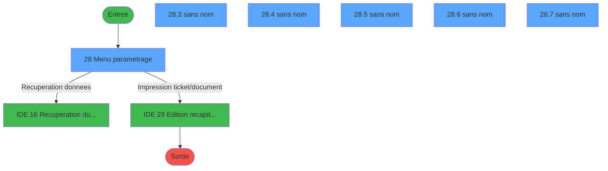
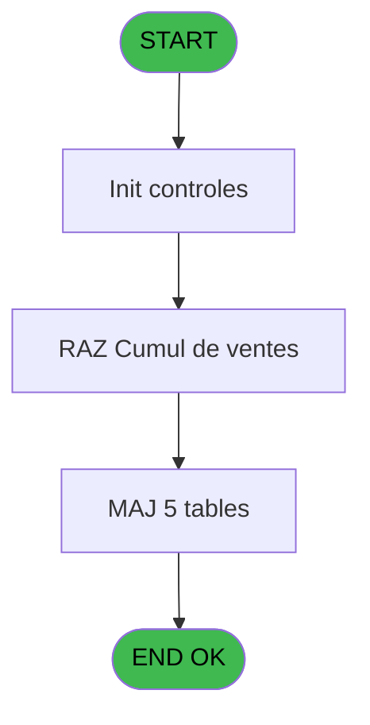
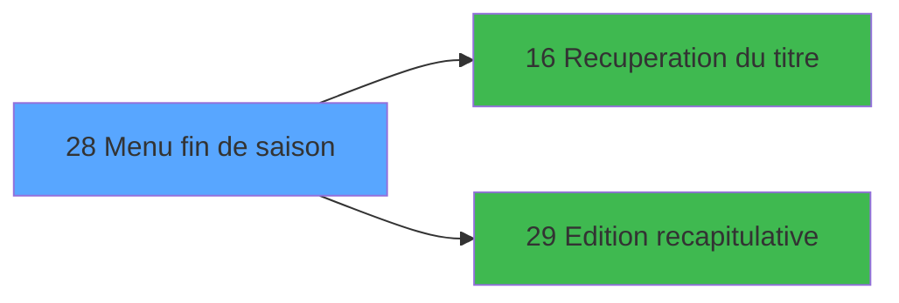

# EXB IDE 28 - Menu fin de saison

> **Analyse**: Phases 1-4 2026-02-03 10:41 -> 10:41 (14s) | Assemblage 10:41
> **Pipeline**: V7.2 Enrichi
> **Structure**: 4 onglets (Resume | Ecrans | Donnees | Connexions)

<!-- TAB:Resume -->

## 1. FICHE D'IDENTITE

| Attribut | Valeur |
|----------|--------|
| Projet | EXB |
| IDE Position | 28 |
| Nom Programme | Menu fin de saison |
| Fichier source | `Prg_28.xml` |
| Domaine metier | Navigation |
| Taches | 8 (6 ecrans visibles) |
| Tables modifiees | 5 |
| Programmes appeles | 2 |

## 2. DESCRIPTION FONCTIONNELLE

**Menu fin de saison** assure la gestion complete de ce processus, accessible depuis [Menu general (IDE 31)](EXB-IDE-31.md).

Le flux de traitement s'organise en **3 blocs fonctionnels** :

- **Traitement** (6 taches) : traitements metier divers
- **Saisie** (1 tache) : ecrans de saisie utilisateur (formulaires, champs, donnees)
- **Calcul** (1 tache) : calculs de montants, stocks ou compteurs

**Donnees modifiees** : 5 tables en ecriture (compteur_excurs__cte, participants_____par, excurs_planning__epl, excursions_______exc, details_partici__dpa).

Detail : phases du traitement

#### Phase 1 : Traitement (6 taches)

- **28** - Menu parametrage **[[ECRAN]](#ecran-t1)**
- **28.3** - (sans nom) **[[ECRAN]](#ecran-t4)**
- **28.4** - (sans nom) **[[ECRAN]](#ecran-t5)**
- **28.5** - (sans nom) **[[ECRAN]](#ecran-t6)**
- **28.6** - (sans nom) **[[ECRAN]](#ecran-t7)**
- **28.7** - (sans nom) **[[ECRAN]](#ecran-t8)**

Delegue a : [Recuperation du titre (IDE 16)](EXB-IDE-16.md)

#### Phase 2 : Calcul (1 tache)

- **28.1** - Lecture date comptable

#### Phase 3 : Saisie (1 tache)

- **28.2** - Ventes existentes

#### Tables impactees

| Table | Operations | Role metier |
|-------|-----------|-------------|
| excurs_planning__epl | **W** (1 usages) |  |
| participants_____par | **W** (1 usages) |  |
| details_partici__dpa | **W** (1 usages) |  |
| excursions_______exc | **W** (1 usages) |  |
| compteur_excurs__cte | **W** (1 usages) | Comptes GM (generaux) |

## 3. BLOCS FONCTIONNELS

### 3.1 Traitement (6 taches)

Traitements internes.

---

#### 28 - Menu parametrage [[ECRAN]](#ecran-t1)

**Role** : Tache d'orchestration : point d'entree du programme (6 sous-taches). Coordonne l'enchainement des traitements.
**Ecran** : 680 x 142 DLU (MDI) | [Voir mockup](#ecran-t1)

5 sous-taches directes

| Tache | Nom | Bloc |
|-------|-----|------|
| [28.3](#t4) | (sans nom) **[[ECRAN]](#ecran-t4)** | Traitement |
| [28.4](#t5) | (sans nom) **[[ECRAN]](#ecran-t5)** | Traitement |
| [28.5](#t6) | (sans nom) **[[ECRAN]](#ecran-t6)** | Traitement |
| [28.6](#t7) | (sans nom) **[[ECRAN]](#ecran-t7)** | Traitement |
| [28.7](#t8) | (sans nom) **[[ECRAN]](#ecran-t8)** | Traitement |

**Delegue a** : [Recuperation du titre (IDE 16)](EXB-IDE-16.md)

---

#### 28.3 - (sans nom) [[ECRAN]](#ecran-t4)

**Role** : Traitement interne.
**Ecran** : 128 x 24 DLU (MDI) | [Voir mockup](#ecran-t4)
**Delegue a** : [Recuperation du titre (IDE 16)](EXB-IDE-16.md)

---

#### 28.4 - (sans nom) [[ECRAN]](#ecran-t5)

**Role** : Traitement interne.
**Ecran** : 160 x 24 DLU (MDI) | [Voir mockup](#ecran-t5)
**Delegue a** : [Recuperation du titre (IDE 16)](EXB-IDE-16.md)

---

#### 28.5 - (sans nom) [[ECRAN]](#ecran-t6)

**Role** : Traitement interne.
**Ecran** : 132 x 32 DLU (MDI) | [Voir mockup](#ecran-t6)
**Delegue a** : [Recuperation du titre (IDE 16)](EXB-IDE-16.md)

---

#### 28.6 - (sans nom) [[ECRAN]](#ecran-t7)

**Role** : Traitement interne.
**Ecran** : 132 x 32 DLU (MDI) | [Voir mockup](#ecran-t7)
**Delegue a** : [Recuperation du titre (IDE 16)](EXB-IDE-16.md)

---

#### 28.7 - (sans nom) [[ECRAN]](#ecran-t8)

**Role** : Traitement interne.
**Ecran** : 128 x 24 DLU (MDI) | [Voir mockup](#ecran-t8)
**Delegue a** : [Recuperation du titre (IDE 16)](EXB-IDE-16.md)

### 3.2 Calcul (1 tache)

Calculs metier : montants, stocks, compteurs.

---

#### 28.1 - Lecture date comptable

**Role** : Traitement : Lecture date comptable.
**Variables liees** : D (W0 date comptable)

### 3.3 Saisie (1 tache)

Ce bloc traite la saisie des donnees de la transaction.

---

#### 28.2 - Ventes existentes

**Role** : Saisie des donnees : Ventes existentes.
**Variables liees** : E (W0 Ventes)

## 5. REGLES METIER

*(Aucune regle metier identifiee)*

## 6. CONTEXTE

- **Appele par**: [Menu general (IDE 31)](EXB-IDE-31.md)
- **Appelle**: 2 programmes | **Tables**: 7 (W:5 R:2 L:0) | **Taches**: 8 | **Expressions**: 9

<!-- TAB:Ecrans -->

## 8. ECRANS

### 8.1 Forms visibles (6 / 8)

| # | Position | Tache | Nom | Type | Largeur | Hauteur | Bloc |
|---|----------|-------|-----|------|---------|---------|------|
| 1 | 28 | 28 | Menu parametrage | MDI | 680 | 142 | Traitement |
| 2 | 28.3 | 28.3 | (sans nom) | MDI | 128 | 24 | Traitement |
| 3 | 28.4 | 28.4 | (sans nom) | MDI | 160 | 24 | Traitement |
| 4 | 28.5 | 28.5 | (sans nom) | MDI | 132 | 32 | Traitement |
| 5 | 28.6 | 28.6 | (sans nom) | MDI | 132 | 32 | Traitement |
| 6 | 28.7 | 28.7 | (sans nom) | MDI | 128 | 24 | Traitement |

### 8.2 Mockups Ecrans

---

#### 28 - Menu parametrage
**Tache** : [28](#t1) | **Type** : MDI | **Dimensions** : 680 x 142 DLU
**Bloc** : Traitement | **Titre IDE** : Menu parametrage

<!-- FORM-DATA:
{
    "width":  680,
    "vFactor":  8,
    "type":  "MDI",
    "hFactor":  8,
    "controls":  [
                     {
                         "x":  94,
                         "type":  "label",
                         "var":  "",
                         "y":  8,
                         "w":  532,
                         "fmt":  "",
                         "name":  "",
                         "h":  77,
                         "color":  "5",
                         "text":  "",
                         "parent":  null
                     },
                     {
                         "x":  107,
                         "type":  "label",
                         "var":  "",
                         "y":  16,
                         "w":  504,
                         "fmt":  "",
                         "name":  "",
                         "h":  8,
                         "color":  "142",
                         "text":  "Le traitement de fin de saison permet :",
                         "parent":  1
                     },
                     {
                         "x":  123,
                         "type":  "label",
                         "var":  "",
                         "y":  40,
                         "w":  498,
                         "fmt":  "",
                         "name":  "",
                         "h":  8,
                         "color":  "142",
                         "text":  ". l\u0027edition d\u0027un recapitulatif des ventes de la saison",
                         "parent":  1
                     },
                     {
                         "x":  123,
                         "type":  "label",
                         "var":  "",
                         "y":  49,
                         "w":  360,
                         "fmt":  "",
                         "name":  "",
                         "h":  8,
                         "color":  "142",
                         "text":  ". la remise à zero des cumuls de vente",
                         "parent":  1
                     },
                     {
                         "x":  123,
                         "type":  "label",
                         "var":  "",
                         "y":  58,
                         "w":  480,
                         "fmt":  "",
                         "name":  "",
                         "h":  8,
                         "color":  "142",
                         "text":  ". d\u0027effacer tous les plannings jusqu\u0027à la date du jour",
                         "parent":  1
                     },
                     {
                         "x":  123,
                         "type":  "label",
                         "var":  "",
                         "y":  67,
                         "w":  434,
                         "fmt":  "",
                         "name":  "",
                         "h":  8,
                         "color":  "142",
                         "text":  ". d\u0027effacer tout l\u0027historique des participants",
                         "parent":  1
                     },
                     {
                         "x":  186,
                         "type":  "label",
                         "var":  "",
                         "y":  98,
                         "w":  303,
                         "fmt":  "",
                         "name":  "",
                         "h":  8,
                         "color":  "142",
                         "text":  "Confirmer ?",
                         "parent":  null
                     },
                     {
                         "x":  3,
                         "type":  "label",
                         "var":  "",
                         "y":  117,
                         "w":  672,
                         "fmt":  "",
                         "name":  "",
                         "h":  22,
                         "color":  "1",
                         "text":  "",
                         "parent":  null
                     },
                     {
                         "x":  412,
                         "type":  "button",
                         "var":  "",
                         "y":  119,
                         "w":  154,
                         "fmt":  "\u0026Non",
                         "name":  "btn quitter",
                         "h":  18,
                         "color":  "",
                         "text":  "",
                         "parent":  9
                     },
                     {
                         "x":  111,
                         "type":  "button",
                         "var":  "",
                         "y":  119,
                         "w":  154,
                         "fmt":  "\u0026Oui",
                         "name":  "btn valider",
                         "h":  18,
                         "color":  "",
                         "text":  "",
                         "parent":  9
                     },
                     {
                         "x":  5,
                         "type":  "image",
                         "var":  "",
                         "y":  22,
                         "w":  82,
                         "fmt":  "",
                         "name":  "",
                         "h":  33,
                         "color":  "",
                         "text":  "",
                         "parent":  null
                     }
                 ],
    "taskId":  "28",
    "height":  142
}
-->

<strong>Boutons : 2 boutons</strong>

| Bouton | Pos (x,y) | Action |
|--------|-----------|--------|
| Non | 412,119 | Bouton fonctionnel |
| Oui | 111,119 | Bouton fonctionnel |

---

#### 28.3 - (sans nom)
**Tache** : [28.3](#t4) | **Type** : MDI | **Dimensions** : 128 x 24 DLU
**Bloc** : Traitement | **Titre IDE** : (sans nom)

<!-- FORM-DATA:
{
    "width":  128,
    "vFactor":  8,
    "type":  "MDI",
    "hFactor":  4,
    "controls":  [
                     {
                         "x":  4,
                         "type":  "label",
                         "var":  "",
                         "y":  0,
                         "w":  92,
                         "fmt":  "",
                         "name":  "",
                         "h":  8,
                         "color":  "",
                         "text":  "Mise à 0 des cumuls ...",
                         "parent":  null
                     }
                 ],
    "taskId":  "28.3",
    "height":  24
}
-->

---

#### 28.4 - (sans nom)
**Tache** : [28.4](#t5) | **Type** : MDI | **Dimensions** : 160 x 24 DLU
**Bloc** : Traitement | **Titre IDE** : (sans nom)

<!-- FORM-DATA:
{
    "width":  160,
    "vFactor":  8,
    "type":  "MDI",
    "hFactor":  4,
    "controls":  [
                     {
                         "x":  4,
                         "type":  "label",
                         "var":  "",
                         "y":  0,
                         "w":  96,
                         "fmt":  "",
                         "name":  "",
                         "h":  8,
                         "color":  "",
                         "text":  "Effacement des plannings",
                         "parent":  null
                     },
                     {
                         "x":  108,
                         "type":  "edit",
                         "var":  "",
                         "y":  0,
                         "w":  32,
                         "fmt":  "##/##/##",
                         "name":  "",
                         "h":  8,
                         "color":  "",
                         "text":  "",
                         "parent":  null
                     }
                 ],
    "taskId":  "28.4",
    "height":  24
}
-->

<strong>Champs : 1 champs</strong>

| Pos (x,y) | Nom | Variable | Type |
|-----------|-----|----------|------|
| 108,0 | ##/##/## | - | edit |

---

#### 28.5 - (sans nom)
**Tache** : [28.5](#t6) | **Type** : MDI | **Dimensions** : 132 x 32 DLU
**Bloc** : Traitement | **Titre IDE** : (sans nom)

<!-- FORM-DATA:
{
    "width":  132,
    "vFactor":  8,
    "type":  "MDI",
    "hFactor":  4,
    "controls":  [
                     {
                         "x":  4,
                         "type":  "label",
                         "var":  "",
                         "y":  0,
                         "w":  108,
                         "fmt":  "",
                         "name":  "",
                         "h":  8,
                         "color":  "",
                         "text":  "Effacement des participants",
                         "parent":  null
                     },
                     {
                         "x":  12,
                         "type":  "edit",
                         "var":  "",
                         "y":  8,
                         "w":  60,
                         "fmt":  "",
                         "name":  "",
                         "h":  8,
                         "color":  "",
                         "text":  "",
                         "parent":  null
                     }
                 ],
    "taskId":  "28.5",
    "height":  32
}
-->

<strong>Champs : 1 champs</strong>

| Pos (x,y) | Nom | Variable | Type |
|-----------|-----|----------|------|
| 12,8 | (sans nom) | - | edit |

---

#### 28.6 - (sans nom)
**Tache** : [28.6](#t7) | **Type** : MDI | **Dimensions** : 132 x 32 DLU
**Bloc** : Traitement | **Titre IDE** : (sans nom)

<!-- FORM-DATA:
{
    "width":  132,
    "vFactor":  8,
    "type":  "MDI",
    "hFactor":  4,
    "controls":  [
                     {
                         "x":  4,
                         "type":  "label",
                         "var":  "",
                         "y":  0,
                         "w":  108,
                         "fmt":  "",
                         "name":  "",
                         "h":  8,
                         "color":  "",
                         "text":  "Effacement des participants",
                         "parent":  null
                     },
                     {
                         "x":  12,
                         "type":  "edit",
                         "var":  "",
                         "y":  8,
                         "w":  60,
                         "fmt":  "",
                         "name":  "",
                         "h":  8,
                         "color":  "",
                         "text":  "",
                         "parent":  null
                     }
                 ],
    "taskId":  "28.6",
    "height":  32
}
-->

<strong>Champs : 1 champs</strong>

| Pos (x,y) | Nom | Variable | Type |
|-----------|-----|----------|------|
| 12,8 | (sans nom) | - | edit |

---

#### 28.7 - (sans nom)
**Tache** : [28.7](#t8) | **Type** : MDI | **Dimensions** : 128 x 24 DLU
**Bloc** : Traitement | **Titre IDE** : (sans nom)

<!-- FORM-DATA:
{
    "width":  128,
    "vFactor":  8,
    "type":  "MDI",
    "hFactor":  4,
    "controls":  [
                     {
                         "x":  4,
                         "type":  "label",
                         "var":  "",
                         "y":  0,
                         "w":  112,
                         "fmt":  "",
                         "name":  "",
                         "h":  8,
                         "color":  "",
                         "text":  "Mise à 0 des compteurs .....",
                         "parent":  null
                     }
                 ],
    "taskId":  "28.7",
    "height":  24
}
-->

## 9. NAVIGATION

### 9.1 Enchainement des ecrans

**Detail par enchainement :**

| Depuis | Action | Vers | Retour |
|--------|--------|------|--------|
| Menu parametrage | Recuperation donnees | [Recuperation du titre (IDE 16)](EXB-IDE-16.md) | Retour ecran |
| Menu parametrage | Impression ticket/document | [  Edition recapitulative (IDE 29)](EXB-IDE-29.md) | Retour ecran |

### 9.3 Structure hierarchique (8 taches)

| Position | Tache | Type | Dimensions | Bloc |
|----------|-------|------|------------|------|
| **28.1** | [**Menu parametrage** (28)](#t1) [mockup](#ecran-t1) | MDI | 680x142 | Traitement |
| 28.1.1 | [(sans nom) (28.3)](#t4) [mockup](#ecran-t4) | MDI | 128x24 | |
| 28.1.2 | [(sans nom) (28.4)](#t5) [mockup](#ecran-t5) | MDI | 160x24 | |
| 28.1.3 | [(sans nom) (28.5)](#t6) [mockup](#ecran-t6) | MDI | 132x32 | |
| 28.1.4 | [(sans nom) (28.6)](#t7) [mockup](#ecran-t7) | MDI | 132x32 | |
| 28.1.5 | [(sans nom) (28.7)](#t8) [mockup](#ecran-t8) | MDI | 128x24 | |
| **28.2** | [**Lecture date comptable** (28.1)](#t2) | MDI | - | Calcul |
| **28.3** | [**Ventes existentes** (28.2)](#t3) | MDI | - | Saisie |

### 9.4 Algorigramme

> **Legende**: Vert = START/END OK | Rouge = END KO | Bleu = Decisions
> *Algorigramme auto-genere. Utiliser `/algorigramme` pour une synthese metier detaillee.*

<!-- TAB:Donnees -->

## 10. TABLES

### Tables utilisees (7)

| ID | Nom | Description | Type | R | W | L | Usages |
|----|-----|-------------|------|---|---|---|--------|
| 292 | compteur_excurs__cte | Comptes GM (generaux) | DB |   | **W** |   | 1 |
| 293 | date_comptable___dat |  | DB | R |   |   | 1 |
| 298 | participants_____par |  | DB |   | **W** |   | 1 |
| 299 | excurs_planning__epl |  | DB |   | **W** |   | 1 |
| 300 | excursions_______exc |  | DB |   | **W** |   | 1 |
| 301 | details_partici__dpa |  | DB |   | **W** |   | 1 |
| 309 | vente____________vep | Donnees de ventes | DB | R |   |   | 1 |

### Colonnes par table (2 / 7 tables avec colonnes identifiees)

Table 292 - compteur_excurs__cte (**W**) - 1 usages

*Table utilisee uniquement en Link ou aucune colonne Real identifiee dans le DataView.*

Table 293 - date_comptable___dat (R) - 1 usages

| Lettre | Variable | Acces | Type |
|--------|----------|-------|------|
| D | W0 date comptable | R | Date |

Table 298 - participants_____par (**W**) - 1 usages

*Table utilisee uniquement en Link ou aucune colonne Real identifiee dans le DataView.*

Table 299 - excurs_planning__epl (**W**) - 1 usages

*Table utilisee uniquement en Link ou aucune colonne Real identifiee dans le DataView.*

Table 300 - excursions_______exc (**W**) - 1 usages

*Table utilisee uniquement en Link ou aucune colonne Real identifiee dans le DataView.*

Table 301 - details_partici__dpa (**W**) - 1 usages

*Table utilisee uniquement en Link ou aucune colonne Real identifiee dans le DataView.*

Table 309 - vente____________vep (R) - 1 usages

| Lettre | Variable | Acces | Type |
|--------|----------|-------|------|
| A | T1_Vente | R | Numeric |
| E | W0 Ventes | R | Alpha |

## 11. VARIABLES

### 11.1 Parametres entrants (2)

Variables recues du programme appelant ([Menu general (IDE 31)](EXB-IDE-31.md)).

| Lettre | Nom | Type | Usage dans |
|--------|-----|------|-----------|
| A | P0 masque montant | Alpha | - |
| B | P0 nom village | Alpha | - |

### 11.2 Variables de session (2)

Variables persistantes pendant toute la session.

| Lettre | Nom | Type | Usage dans |
|--------|-----|------|-----------|
| C | v. quitte | Logical | - |
| I | v. titre | Alpha | 1x session |

### 11.3 Variables de travail (3)

Variables internes au programme.

| Lettre | Nom | Type | Usage dans |
|--------|-----|------|-----------|
| D | W0 date comptable | Date | - |
| E | W0 Ventes | Alpha | [28.2](#t3) |
| F | W0 confirmation | Alpha | 2x calcul interne |

### 11.4 Autres (2)

Variables diverses.

| Lettre | Nom | Type | Usage dans |
|--------|-----|------|-----------|
| G | btn quitter | Alpha | - |
| H | btn valider | Alpha | - |

## 12. EXPRESSIONS

**9 / 9 expressions decodees (100%)**

### 12.1 Repartition par type

| Type | Expressions | Regles |
|------|-------------|--------|
| CONSTANTE | 5 | 0 |
| CONDITION | 2 | 0 |
| CAST_LOGIQUE | 1 | 0 |
| STRING | 1 | 0 |

### 12.2 Expressions cles par type

#### CONSTANTE (5 expressions)

| Type | IDE | Expression | Regle |
|------|-----|------------|-------|
| CONSTANTE | 8 | `'&Oui'` | - |
| CONSTANTE | 9 | `'&Non'` | - |
| CONSTANTE | 7 | `'O'` | - |
| CONSTANTE | 1 | `'N'` | - |
| CONSTANTE | 4 | `19` | - |

#### CONDITION (2 expressions)

| Type | IDE | Expression | Regle |
|------|-----|------------|-------|
| CONDITION | 3 | `W0 Ventes [E]<>'O' AND W0 confirmation [F]='O'` | - |
| CONDITION | 2 | `W0 Ventes [E]='O' AND W0 confirmation [F]='O'` | - |

#### CAST_LOGIQUE (1 expressions)

| Type | IDE | Expression | Regle |
|------|-----|------------|-------|
| CAST_LOGIQUE | 6 | `'TRUE'LOG` | - |

#### STRING (1 expressions)

| Type | IDE | Expression | Regle |
|------|-----|------------|-------|
| STRING | 5 | `Trim (v. titre [I])` | - |

<!-- TAB:Connexions -->

## 13. GRAPHE D'APPELS

### 13.1 Chaine depuis Main (Callers)

Main -> ... -> [Menu general (IDE 31)](EXB-IDE-31.md) -> **Menu fin de saison (IDE 28)**

### 13.2 Callers

| IDE | Nom Programme | Nb Appels |
|-----|---------------|-----------|
| [31](EXB-IDE-31.md) | Menu general | 1 |

### 13.3 Callees (programmes appeles)

### 13.4 Detail Callees avec contexte

| IDE | Nom Programme | Appels | Contexte |
|-----|---------------|--------|----------|
| [16](EXB-IDE-16.md) | Recuperation du titre | 1 | Recuperation donnees |
| [29](EXB-IDE-29.md) |   Edition recapitulative | 1 | Impression ticket/document |

## 14. RECOMMANDATIONS MIGRATION

### 14.1 Profil du programme

| Metrique | Valeur | Impact migration |
|----------|--------|-----------------|
| Lignes de logique | 72 | Programme compact |
| Expressions | 9 | Peu de logique |
| Tables WRITE | 5 | Impact modere |
| Sous-programmes | 2 | Peu de dependances |
| Ecrans visibles | 6 | Interface complexe multi-ecrans |
| Code desactive | 0% (0 / 72) | Code sain |
| Regles metier | 0 | Pas de regle identifiee |

### 14.2 Plan de migration par bloc

#### Traitement (6 taches: 6 ecrans, 0 traitement)

- **Strategie** : 6 composant(s) UI (Razor/React) avec formulaires et validation.
- 2 sous-programme(s) a migrer ou a reutiliser depuis les services existants.
- Decomposer les taches en services unitaires testables.

#### Calcul (1 tache: 0 ecran, 1 traitement)

- **Strategie** : Services de calcul purs (Domain Services).
- Migrer la logique de calcul (stock, compteurs, montants)

#### Saisie (1 tache: 0 ecran, 1 traitement)

- **Strategie** : Formulaire React/Blazor avec validation Zod/FluentValidation.
- Validation temps reel cote client + serveur

### 14.3 Dependances critiques

| Dependance | Type | Appels | Impact |
|------------|------|--------|--------|
| compteur_excurs__cte | Table WRITE (Database) | 1x | Schema + repository |
| participants_____par | Table WRITE (Database) | 1x | Schema + repository |
| excurs_planning__epl | Table WRITE (Database) | 1x | Schema + repository |
| excursions_______exc | Table WRITE (Database) | 1x | Schema + repository |
| details_partici__dpa | Table WRITE (Database) | 1x | Schema + repository |
| [  Edition recapitulative (IDE 29)](EXB-IDE-29.md) | Sous-programme | 1x | Normale - Impression ticket/document |
| [Recuperation du titre (IDE 16)](EXB-IDE-16.md) | Sous-programme | 1x | Normale - Recuperation donnees |

---
*Spec DETAILED generee par Pipeline V7.2 - 2026-02-03 10:41*
