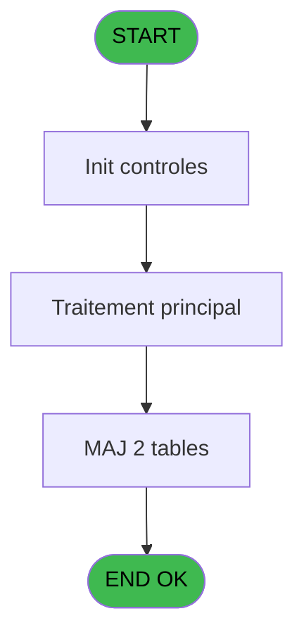

# EXB IDE 30 - Structure files Btrieve

> **Analyse**: Phases 1-4 2026-02-03 10:41 -> 10:42 (14s) | Assemblage 10:42
> **Pipeline**: V7.2 Enrichi
> **Structure**: 4 onglets (Resume | Ecrans | Donnees | Connexions)

<!-- TAB:Resume -->

## 1. FICHE D'IDENTITE

| Attribut | Valeur |
|----------|--------|
| Projet | EXB |
| IDE Position | 30 |
| Nom Programme | Structure files Btrieve |
| Fichier source | `Prg_30.xml` |
| Domaine metier | General |
| Taches | 3 (0 ecrans visibles) |
| Tables modifiees | 2 |
| Programmes appeles | 0 |

## 2. DESCRIPTION FONCTIONNELLE

**Structure files Btrieve** assure la gestion complete de ce processus, accessible depuis [Start (IDE 32)](EXB-IDE-32.md).

Le flux de traitement s'organise en **1 blocs fonctionnels** :

- **Traitement** (3 taches) : traitements metier divers

**Donnees modifiees** : 2 tables en ecriture (intermediaire____int, vente____________vep).

## 3. BLOCS FONCTIONNELS

### 3.1 Traitement (3 taches)

Traitements internes.

---

#### 30 - Veuillez patienter... [[ECRAN]](#ecran-t1)

**Role** : Traitement : Veuillez patienter....
**Ecran** : 427 x 60 DLU (MDI) | [Voir mockup](#ecran-t1)

---

#### 30.1 - Impression

**Role** : Generation du document : Impression.

---

#### 30.2 - Impression

**Role** : Generation du document : Impression.

## 5. REGLES METIER

*(Aucune regle metier identifiee)*

## 6. CONTEXTE

- **Appele par**: [Start (IDE 32)](EXB-IDE-32.md)
- **Appelle**: 0 programmes | **Tables**: 4 (W:2 R:0 L:2) | **Taches**: 3 | **Expressions**: 2

<!-- TAB:Ecrans -->

## 8. ECRANS

*(Programme sans ecran visible)*

## 9. NAVIGATION

### 9.3 Structure hierarchique (3 taches)

| Position | Tache | Type | Dimensions | Bloc |
|----------|-------|------|------------|------|
| **30.1** | [**Veuillez patienter...** (30)](#t1) [mockup](#ecran-t1) | MDI | 427x60 | Traitement |
| 30.1.1 | [Impression (30.1)](#t2) | MDI | - | |
| 30.1.2 | [Impression (30.2)](#t3) | MDI | - | |

### 9.4 Algorigramme

> **Legende**: Vert = START/END OK | Rouge = END KO | Bleu = Decisions
> *Algorigramme auto-genere. Utiliser `/algorigramme` pour une synthese metier detaillee.*

<!-- TAB:Donnees -->

## 10. TABLES

### Tables utilisees (4)

| ID | Nom | Description | Type | R | W | L | Usages |
|----|-----|-------------|------|---|---|---|--------|
| 295 | intermediaire____int |  | DB |   |   | L | 1 |
| 296 | intermediaire____int |  | DB |   | **W** |   | 1 |
| 308 | vente____________vep | Donnees de ventes | DB |   |   | L | 1 |
| 309 | vente____________vep | Donnees de ventes | DB |   | **W** |   | 1 |

### Colonnes par table (0 / 2 tables avec colonnes identifiees)

Table 296 - intermediaire____int (**W**) - 1 usages

*Table utilisee uniquement en Link ou aucune colonne Real identifiee dans le DataView.*

Table 309 - vente____________vep (**W**) - 1 usages

*Table utilisee uniquement en Link ou aucune colonne Real identifiee dans le DataView.*

## 11. VARIABLES

*(Programme sans variables locales mappees)*

## 12. EXPRESSIONS

**2 / 2 expressions decodees (100%)**

### 12.1 Repartition par type

| Type | Expressions | Regles |
|------|-------------|--------|
| CONDITION | 2 | 0 |

### 12.2 Expressions cles par type

#### CONDITION (2 expressions)

| Type | IDE | Expression | Regle |
|------|-----|------------|-------|
| CONDITION | 2 | `CallProg('{124,-1}'PROG,DbName('{296,2}'DSOURCE))=0` | - |
| CONDITION | 1 | `CallProg('{124,-1}'PROG,DbName('{309,2}'DSOURCE))=0` | - |

<!-- TAB:Connexions -->

## 13. GRAPHE D'APPELS

### 13.1 Chaine depuis Main (Callers)

Main -> ... -> [Start (IDE 32)](EXB-IDE-32.md) -> **Structure files Btrieve (IDE 30)**

### 13.2 Callers

| IDE | Nom Programme | Nb Appels |
|-----|---------------|-----------|
| [32](EXB-IDE-32.md) | Start | 1 |

### 13.3 Callees (programmes appeles)

### 13.4 Detail Callees avec contexte

| IDE | Nom Programme | Appels | Contexte |
|-----|---------------|--------|----------|
| - | (aucun) | - | - |

## 14. RECOMMANDATIONS MIGRATION

### 14.1 Profil du programme

| Metrique | Valeur | Impact migration |
|----------|--------|-----------------|
| Lignes de logique | 89 | Programme compact |
| Expressions | 2 | Peu de logique |
| Tables WRITE | 2 | Impact faible |
| Sous-programmes | 0 | Peu de dependances |
| Ecrans visibles | 0 | Ecran unique ou traitement batch |
| Code desactive | 0% (0 / 89) | Code sain |
| Regles metier | 0 | Pas de regle identifiee |

### 14.2 Plan de migration par bloc

#### Traitement (3 taches: 1 ecran, 2 traitements)

- **Strategie** : Orchestrateur avec 1 ecrans (Razor/React) et 2 traitements backend (services).
- Les ecrans deviennent des composants UI, les traitements invisibles deviennent des services injectables.
- Decomposer les taches en services unitaires testables.

### 14.3 Dependances critiques

| Dependance | Type | Appels | Impact |
|------------|------|--------|--------|
| intermediaire____int | Table WRITE (Database) | 1x | Schema + repository |
| vente____________vep | Table WRITE (Database) | 1x | Schema + repository |

---
*Spec DETAILED generee par Pipeline V7.2 - 2026-02-03 10:42*
