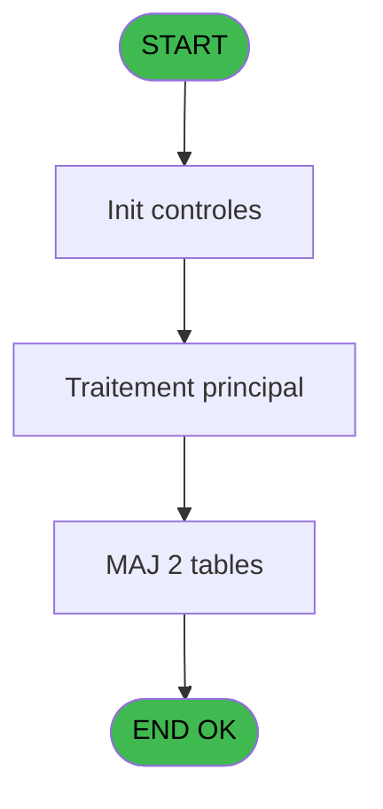
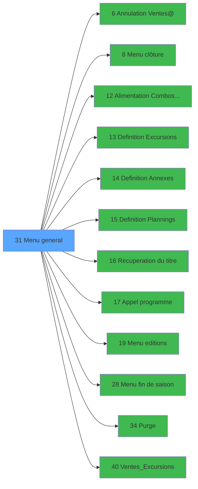

# EXB IDE 31 - Menu general

> **Analyse**: Phases 1-4 2026-02-03 10:42 -> 10:42 (18s) | Assemblage 10:42
> **Pipeline**: V7.2 Enrichi
> **Structure**: 4 onglets (Resume | Ecrans | Donnees | Connexions)

<!-- TAB:Resume -->

## 1. FICHE D'IDENTITE

| Attribut | Valeur |
|----------|--------|
| Projet | EXB |
| IDE Position | 31 |
| Nom Programme | Menu general |
| Fichier source | `Prg_31.xml` |
| Domaine metier | Navigation |
| Taches | 5 (1 ecrans visibles) |
| Tables modifiees | 2 |
| Programmes appeles | 12 |

## 2. DESCRIPTION FONCTIONNELLE

**Menu general** assure la gestion complete de ce processus, accessible depuis [Main Program (IDE 1)](EXB-IDE-1.md).

Le flux de traitement s'organise en **3 blocs fonctionnels** :

- **Traitement** (3 taches) : traitements metier divers
- **Calcul** (1 tache) : calculs de montants, stocks ou compteurs
- **Initialisation** (1 tache) : reinitialisation d'etats et de variables de travail

**Donnees modifiees** : 2 tables en ecriture (date_comptable___dat, reseau_cloture___rcg).

Detail : phases du traitement

#### Phase 1 : Traitement (3 taches)

- **31** - Menu General **[[ECRAN]](#ecran-t1)**
- **31.1** - Station eteinte erreur v1
- **31.4** - Station eteinte erreur v1

Delegue a : [Menu clôture (IDE 8)](EXB-IDE-8.md), [Alimentation Combos SERVICE (IDE 12)](EXB-IDE-12.md), [Recuperation du titre (IDE 16)](EXB-IDE-16.md), [Appel programme (IDE 17)](EXB-IDE-17.md), [ Menu fin de saison (IDE 28)](EXB-IDE-28.md), [Purge (IDE 34)](EXB-IDE-34.md)

#### Phase 2 : Initialisation (1 tache)

- **31.2** - Initialisation

Delegue a : [Definition Excursions (IDE 13)](EXB-IDE-13.md), [Definition Annexes (IDE 14)](EXB-IDE-14.md), [Definition Plannings (IDE 15)](EXB-IDE-15.md)

#### Phase 3 : Calcul (1 tache)

- **31.3** - Lecture date comptable

#### Tables impactees

| Table | Operations | Role metier |
|-------|-----------|-------------|
| reseau_cloture___rcg | **W** (2 usages) | Donnees reseau/cloture |
| date_comptable___dat | **W** (1 usages) |  |

## 3. BLOCS FONCTIONNELS

### 3.1 Traitement (3 taches)

Traitements internes.

---

#### 31 - Menu General [[ECRAN]](#ecran-t1)

**Role** : Traitement : Menu General.
**Ecran** : 725 x 255 DLU (MDI) | [Voir mockup](#ecran-t1)
**Delegue a** : [Menu clôture (IDE 8)](EXB-IDE-8.md), [Alimentation Combos SERVICE (IDE 12)](EXB-IDE-12.md), [Recuperation du titre (IDE 16)](EXB-IDE-16.md)

---

#### 31.1 - Station eteinte erreur v1

**Role** : Traitement : Station eteinte erreur v1.
**Delegue a** : [Menu clôture (IDE 8)](EXB-IDE-8.md), [Alimentation Combos SERVICE (IDE 12)](EXB-IDE-12.md), [Recuperation du titre (IDE 16)](EXB-IDE-16.md)

---

#### 31.4 - Station eteinte erreur v1

**Role** : Traitement : Station eteinte erreur v1.
**Delegue a** : [Menu clôture (IDE 8)](EXB-IDE-8.md), [Alimentation Combos SERVICE (IDE 12)](EXB-IDE-12.md), [Recuperation du titre (IDE 16)](EXB-IDE-16.md)

### 3.2 Initialisation (1 tache)

Reinitialisation d'etats et variables de travail.

---

#### 31.2 - Initialisation

**Role** : Reinitialisation : Initialisation.
**Delegue a** : [Definition Excursions (IDE 13)](EXB-IDE-13.md), [Definition Annexes (IDE 14)](EXB-IDE-14.md), [Definition Plannings (IDE 15)](EXB-IDE-15.md)

### 3.3 Calcul (1 tache)

Calculs metier : montants, stocks, compteurs.

---

#### 31.3 - Lecture date comptable

**Role** : Traitement : Lecture date comptable.
**Variables liees** : D (W0 date comptable)

## 5. REGLES METIER

*(Aucune regle metier identifiee)*

## 6. CONTEXTE

- **Appele par**: [Main Program (IDE 1)](EXB-IDE-1.md)
- **Appelle**: 12 programmes | **Tables**: 3 (W:2 R:1 L:0) | **Taches**: 5 | **Expressions**: 19

<!-- TAB:Ecrans -->

## 8. ECRANS

### 8.1 Forms visibles (1 / 5)

| # | Position | Tache | Nom | Type | Largeur | Hauteur | Bloc |
|---|----------|-------|-----|------|---------|---------|------|
| 1 | 31 | 31 | Menu General | MDI | 725 | 255 | Traitement |

### 8.2 Mockups Ecrans

---

#### 31 - Menu General
**Tache** : [31](#t1) | **Type** : MDI | **Dimensions** : 725 x 255 DLU
**Bloc** : Traitement | **Titre IDE** : Menu General

<!-- FORM-DATA:
{
    "width":  725,
    "vFactor":  8,
    "type":  "MDI",
    "hFactor":  8,
    "controls":  [
                     {
                         "x":  0,
                         "type":  "label",
                         "var":  "",
                         "y":  1,
                         "w":  721,
                         "fmt":  "",
                         "name":  "",
                         "h":  23,
                         "color":  "",
                         "text":  "",
                         "parent":  null
                     },
                     {
                         "x":  281,
                         "type":  "label",
                         "var":  "",
                         "y":  31,
                         "w":  417,
                         "fmt":  "",
                         "name":  "",
                         "h":  186,
                         "color":  "",
                         "text":  "",
                         "parent":  null
                     },
                     {
                         "x":  305,
                         "type":  "label",
                         "var":  "",
                         "y":  39,
                         "w":  367,
                         "fmt":  "",
                         "name":  "",
                         "h":  148,
                         "color":  "6",
                         "text":  "",
                         "parent":  5
                     },
                     {
                         "x":  311,
                         "type":  "label",
                         "var":  "",
                         "y":  44,
                         "w":  51,
                         "fmt":  "",
                         "name":  "",
                         "h":  142,
                         "color":  "",
                         "text":  "",
                         "parent":  6
                     },
                     {
                         "x":  374,
                         "type":  "label",
                         "var":  "",
                         "y":  47,
                         "w":  264,
                         "fmt":  "",
                         "name":  "",
                         "h":  9,
                         "color":  "146",
                         "text":  "Definition des Excursions",
                         "parent":  6
                     },
                     {
                         "x":  374,
                         "type":  "label",
                         "var":  "",
                         "y":  60,
                         "w":  245,
                         "fmt":  "",
                         "name":  "",
                         "h":  9,
                         "color":  "146",
                         "text":  "Definition des Annexes",
                         "parent":  6
                     },
                     {
                         "x":  374,
                         "type":  "label",
                         "var":  "",
                         "y":  73,
                         "w":  275,
                         "fmt":  "",
                         "name":  "",
                         "h":  9,
                         "color":  "146",
                         "text":  "Definition des Plannings",
                         "parent":  6
                     },
                     {
                         "x":  365,
                         "type":  "line",
                         "var":  "",
                         "y":  90,
                         "w":  301,
                         "fmt":  "",
                         "name":  "",
                         "h":  0,
                         "color":  "",
                         "text":  "",
                         "parent":  6
                     },
                     {
                         "x":  374,
                         "type":  "label",
                         "var":  "",
                         "y":  97,
                         "w":  210,
                         "fmt":  "",
                         "name":  "",
                         "h":  9,
                         "color":  "146",
                         "text":  "Clôture comptable",
                         "parent":  6
                     },
                     {
                         "x":  374,
                         "type":  "label",
                         "var":  "",
                         "y":  110,
                         "w":  221,
                         "fmt":  "",
                         "name":  "",
                         "h":  9,
                         "color":  "146",
                         "text":  "Editions",
                         "parent":  6
                     },
                     {
                         "x":  376,
                         "type":  "label",
                         "var":  "",
                         "y":  123,
                         "w":  210,
                         "fmt":  "",
                         "name":  "",
                         "h":  9,
                         "color":  "146",
                         "text":  "Purge",
                         "parent":  6
                     },
                     {
                         "x":  376,
                         "type":  "label",
                         "var":  "",
                         "y":  136,
                         "w":  221,
                         "fmt":  "",
                         "name":  "",
                         "h":  9,
                         "color":  "146",
                         "text":  "Fin de saison",
                         "parent":  6
                     },
                     {
                         "x":  365,
                         "type":  "line",
                         "var":  "",
                         "y":  153,
                         "w":  301,
                         "fmt":  "",
                         "name":  "",
                         "h":  0,
                         "color":  "",
                         "text":  "",
                         "parent":  6
                     },
                     {
                         "x":  378,
                         "type":  "label",
                         "var":  "",
                         "y":  160,
                         "w":  264,
                         "fmt":  "",
                         "name":  "",
                         "h":  9,
                         "color":  "146",
                         "text":  "Vente",
                         "parent":  6
                     },
                     {
                         "x":  378,
                         "type":  "label",
                         "var":  "",
                         "y":  173,
                         "w":  245,
                         "fmt":  "",
                         "name":  "",
                         "h":  9,
                         "color":  "146",
                         "text":  "Annulation de vente",
                         "parent":  6
                     },
                     {
                         "x":  401,
                         "type":  "label",
                         "var":  "",
                         "y":  198,
                         "w":  120,
                         "fmt":  "",
                         "name":  "",
                         "h":  9,
                         "color":  "",
                         "text":  "Votre choix",
                         "parent":  5
                     },
                     {
                         "x":  2,
                         "type":  "label",
                         "var":  "",
                         "y":  228,
                         "w":  718,
                         "fmt":  "",
                         "name":  "",
                         "h":  23,
                         "color":  "",
                         "text":  "",
                         "parent":  null
                     },
                     {
                         "x":  5,
                         "type":  "edit",
                         "var":  "",
                         "y":  13,
                         "w":  344,
                         "fmt":  "",
                         "name":  "",
                         "h":  8,
                         "color":  "",
                         "text":  "",
                         "parent":  1
                     },
                     {
                         "x":  537,
                         "type":  "edit",
                         "var":  "",
                         "y":  198,
                         "w":  26,
                         "fmt":  "",
                         "name":  "",
                         "h":  10,
                         "color":  "6",
                         "text":  "",
                         "parent":  5
                     },
                     {
                         "x":  5,
                         "type":  "edit",
                         "var":  "",
                         "y":  3,
                         "w":  267,
                         "fmt":  "20",
                         "name":  "",
                         "h":  8,
                         "color":  "",
                         "text":  "",
                         "parent":  null
                     },
                     {
                         "x":  509,
                         "type":  "edit",
                         "var":  "",
                         "y":  9,
                         "w":  203,
                         "fmt":  "WWW DD MMM YYYYT",
                         "name":  "",
                         "h":  8,
                         "color":  "",
                         "text":  "",
                         "parent":  null
                     },
                     {
                         "x":  32,
                         "type":  "image",
                         "var":  "",
                         "y":  72,
                         "w":  200,
                         "fmt":  "",
                         "name":  "",
                         "h":  106,
                         "color":  "",
                         "text":  "",
                         "parent":  null
                     },
                     {
                         "x":  323,
                         "type":  "button",
                         "var":  "",
                         "y":  47,
                         "w":  24,
                         "fmt":  "A",
                         "name":  "A",
                         "h":  9,
                         "color":  "",
                         "text":  "",
                         "parent":  6
                     },
                     {
                         "x":  323,
                         "type":  "button",
                         "var":  "",
                         "y":  60,
                         "w":  24,
                         "fmt":  "B",
                         "name":  "B",
                         "h":  9,
                         "color":  "",
                         "text":  "",
                         "parent":  6
                     },
                     {
                         "x":  323,
                         "type":  "button",
                         "var":  "",
                         "y":  73,
                         "w":  24,
                         "fmt":  "C",
                         "name":  "C",
                         "h":  9,
                         "color":  "",
                         "text":  "",
                         "parent":  6
                     },
                     {
                         "x":  323,
                         "type":  "button",
                         "var":  "",
                         "y":  97,
                         "w":  24,
                         "fmt":  "D",
                         "name":  "D",
                         "h":  9,
                         "color":  "",
                         "text":  "",
                         "parent":  6
                     },
                     {
                         "x":  323,
                         "type":  "button",
                         "var":  "",
                         "y":  110,
                         "w":  24,
                         "fmt":  "E",
                         "name":  "E",
                         "h":  9,
                         "color":  "",
                         "text":  "",
                         "parent":  6
                     },
                     {
                         "x":  323,
                         "type":  "button",
                         "var":  "",
                         "y":  123,
                         "w":  24,
                         "fmt":  "F",
                         "name":  "F",
                         "h":  9,
                         "color":  "",
                         "text":  "",
                         "parent":  6
                     },
                     {
                         "x":  323,
                         "type":  "button",
                         "var":  "",
                         "y":  136,
                         "w":  24,
                         "fmt":  "G",
                         "name":  "G",
                         "h":  9,
                         "color":  "",
                         "text":  "",
                         "parent":  6
                     },
                     {
                         "x":  323,
                         "type":  "button",
                         "var":  "",
                         "y":  160,
                         "w":  24,
                         "fmt":  "H",
                         "name":  "H",
                         "h":  9,
                         "color":  "",
                         "text":  "",
                         "parent":  6
                     },
                     {
                         "x":  323,
                         "type":  "button",
                         "var":  "",
                         "y":  173,
                         "w":  24,
                         "fmt":  "I",
                         "name":  "I",
                         "h":  9,
                         "color":  "",
                         "text":  "",
                         "parent":  6
                     },
                     {
                         "x":  6,
                         "type":  "button",
                         "var":  "",
                         "y":  231,
                         "w":  154,
                         "fmt":  "\u0026Quitter",
                         "name":  "",
                         "h":  18,
                         "color":  "",
                         "text":  "",
                         "parent":  22
                     }
                 ],
    "taskId":  "31",
    "height":  255
}
-->

<strong>Champs : 4 champs</strong>

| Pos (x,y) | Nom | Variable | Type |
|-----------|-----|----------|------|
| 5,13 | (sans nom) | - | edit |
| 537,198 | (sans nom) | - | edit |
| 5,3 | 20 | - | edit |
| 509,9 | WWW DD MMM YYYYT | - | edit |

<strong>Boutons : 10 boutons</strong>

| Bouton | Pos (x,y) | Action |
|--------|-----------|--------|
| A | 323,47 | Bouton fonctionnel |
| B | 323,60 | Bouton fonctionnel |
| C | 323,73 | Bouton fonctionnel |
| D | 323,97 | Bouton fonctionnel |
| E | 323,110 | Bouton fonctionnel |
| F | 323,123 | Bouton fonctionnel |
| G | 323,136 | Bouton fonctionnel |
| H | 323,160 | Bouton fonctionnel |
| I | 323,173 | Bouton fonctionnel |
| Quitter | 6,231 | Quitte le programme |

## 9. NAVIGATION

Ecran unique: **Menu General**

### 9.3 Structure hierarchique (5 taches)

| Position | Tache | Type | Dimensions | Bloc |
|----------|-------|------|------------|------|
| **31.1** | [**Menu General** (31)](#t1) [mockup](#ecran-t1) | MDI | 725x255 | Traitement |
| 31.1.1 | [Station eteinte erreur v1 (31.1)](#t2) | MDI | - | |
| 31.1.2 | [Station eteinte erreur v1 (31.4)](#t7) | MDI | - | |
| **31.2** | [**Initialisation** (31.2)](#t3) | MDI | - | Initialisation |
| **31.3** | [**Lecture date comptable** (31.3)](#t4) | MDI | - | Calcul |

### 9.4 Algorigramme

> **Legende**: Vert = START/END OK | Rouge = END KO | Bleu = Decisions
> *Algorigramme auto-genere. Utiliser `/algorigramme` pour une synthese metier detaillee.*

<!-- TAB:Donnees -->

## 10. TABLES

### Tables utilisees (3)

| ID | Nom | Description | Type | R | W | L | Usages |
|----|-----|-------------|------|---|---|---|--------|
| 69 | initialisation___ini |  | DB | R |   |   | 1 |
| 293 | date_comptable___dat |  | DB |   | **W** |   | 1 |
| 303 | reseau_cloture___rcg | Donnees reseau/cloture | DB |   | **W** |   | 2 |

### Colonnes par table (1 / 3 tables avec colonnes identifiees)

Table 69 - initialisation___ini (R) - 1 usages

*Table utilisee uniquement en Link ou aucune colonne Real identifiee dans le DataView.*

Table 293 - date_comptable___dat (**W**) - 1 usages

| Lettre | Variable | Acces | Type |
|--------|----------|-------|------|
| D | W0 date comptable | W | Date |

Table 303 - reseau_cloture___rcg (**W**) - 2 usages

*Table utilisee uniquement en Link ou aucune colonne Real identifiee dans le DataView.*

## 11. VARIABLES

### 11.1 Variables de session (1)

Variables persistantes pendant toute la session.

| Lettre | Nom | Type | Usage dans |
|--------|-----|------|-----------|
| G | v. titre | Alpha | 1x session |

### 11.2 Variables de travail (6)

Variables internes au programme.

| Lettre | Nom | Type | Usage dans |
|--------|-----|------|-----------|
| A | W0 nbre decimales | Numeric | - |
| B | W0 devise | Alpha | - |
| C | W0 masque montant | Alpha | - |
| D | W0 date comptable | Date | [31.3](#t4) |
| E | W0 nom village | Alpha | - |
| F | W0 choix action | Alpha | 9x calcul interne |

## 12. EXPRESSIONS

**19 / 19 expressions decodees (100%)**

### 12.1 Repartition par type

| Type | Expressions | Regles |
|------|-------------|--------|
| CONSTANTE | 2 | 0 |
| DATE | 1 | 0 |
| CONDITION | 11 | 0 |
| REFERENCE_VG | 2 | 0 |
| OTHER | 1 | 0 |
| NEGATION | 1 | 0 |
| STRING | 1 | 0 |

### 12.2 Expressions cles par type

#### CONSTANTE (2 expressions)

| Type | IDE | Expression | Regle |
|------|-----|------------|-------|
| CONSTANTE | 15 | `1` | - |
| CONSTANTE | 1 | `''` | - |

#### DATE (1 expressions)

| Type | IDE | Expression | Regle |
|------|-----|------------|-------|
| DATE | 14 | `Date ()` | - |

#### CONDITION (11 expressions)

| Type | IDE | Expression | Regle |
|------|-----|------------|-------|
| CONDITION | 9 | `W0 choix action [F]='F'` | - |
| CONDITION | 8 | `W0 choix action [F]='E'` | - |
| CONDITION | 10 | `W0 choix action [F]='G'` | - |
| CONDITION | 12 | `W0 choix action [F]='I'` | - |
| CONDITION | 11 | `W0 choix action [F]='H'` | - |
| ... | | *+6 autres* | |

#### REFERENCE_VG (2 expressions)

| Type | IDE | Expression | Regle |
|------|-----|------------|-------|
| REFERENCE_VG | 19 | `VG5` | - |
| REFERENCE_VG | 13 | `VG2` | - |

#### OTHER (1 expressions)

| Type | IDE | Expression | Regle |
|------|-----|------------|-------|
| OTHER | 17 | `SetParam ('TEXCURSION','B')` | - |

#### NEGATION (1 expressions)

| Type | IDE | Expression | Regle |
|------|-----|------------|-------|
| NEGATION | 18 | `NOT VG5` | - |

#### STRING (1 expressions)

| Type | IDE | Expression | Regle |
|------|-----|------------|-------|
| STRING | 16 | `Trim (v. titre [G])` | - |

<!-- TAB:Connexions -->

## 13. GRAPHE D'APPELS

### 13.1 Chaine depuis Main (Callers)

Main -> ... -> [Main Program (IDE 1)](EXB-IDE-1.md) -> **Menu general (IDE 31)**

### 13.2 Callers

| IDE | Nom Programme | Nb Appels |
|-----|---------------|-----------|
| [1](EXB-IDE-1.md) | Main Program | 1 |

### 13.3 Callees (programmes appeles)

### 13.4 Detail Callees avec contexte

| IDE | Nom Programme | Appels | Contexte |
|-----|---------------|--------|----------|
| [6](EXB-IDE-6.md) |  Annulation Ventes@ | 1 | Sous-programme |
| [8](EXB-IDE-8.md) | Menu clôture | 1 | Navigation menu |
| [12](EXB-IDE-12.md) | Alimentation Combos SERVICE | 1 | Sous-programme |
| [13](EXB-IDE-13.md) | Definition Excursions | 1 | Reinitialisation |
| [14](EXB-IDE-14.md) | Definition Annexes | 1 | Reinitialisation |
| [15](EXB-IDE-15.md) | Definition Plannings | 1 | Reinitialisation |
| [16](EXB-IDE-16.md) | Recuperation du titre | 1 | Recuperation donnees |
| [17](EXB-IDE-17.md) | Appel programme | 1 | Sous-programme |
| [19](EXB-IDE-19.md) | Menu editions | 1 | Impression ticket/document |
| [28](EXB-IDE-28.md) |  Menu fin de saison | 1 | Navigation menu |
| [34](EXB-IDE-34.md) | Purge | 1 | Sous-programme |
| [40](EXB-IDE-40.md) | Ventes_Excursions | 1 | Sous-programme |

## 14. RECOMMANDATIONS MIGRATION

### 14.1 Profil du programme

| Metrique | Valeur | Impact migration |
|----------|--------|-----------------|
| Lignes de logique | 52 | Programme compact |
| Expressions | 19 | Peu de logique |
| Tables WRITE | 2 | Impact faible |
| Sous-programmes | 12 | Forte dependance |
| Ecrans visibles | 1 | Ecran unique ou traitement batch |
| Code desactive | 0% (0 / 52) | Code sain |
| Regles metier | 0 | Pas de regle identifiee |

### 14.2 Plan de migration par bloc

#### Traitement (3 taches: 1 ecran, 2 traitements)

- **Strategie** : Orchestrateur avec 1 ecrans (Razor/React) et 2 traitements backend (services).
- Les ecrans deviennent des composants UI, les traitements invisibles deviennent des services injectables.
- 12 sous-programme(s) a migrer ou a reutiliser depuis les services existants.
- Decomposer les taches en services unitaires testables.

#### Initialisation (1 tache: 0 ecran, 1 traitement)

- **Strategie** : Constructeur/methode `InitAsync()` dans l'orchestrateur.

#### Calcul (1 tache: 0 ecran, 1 traitement)

- **Strategie** : Services de calcul purs (Domain Services).
- Migrer la logique de calcul (stock, compteurs, montants)

### 14.3 Dependances critiques

| Dependance | Type | Appels | Impact |
|------------|------|--------|--------|
| date_comptable___dat | Table WRITE (Database) | 1x | Schema + repository |
| reseau_cloture___rcg | Table WRITE (Database) | 2x | Schema + repository |
| [Menu editions (IDE 19)](EXB-IDE-19.md) | Sous-programme | 1x | Normale - Impression ticket/document |
| [Appel programme (IDE 17)](EXB-IDE-17.md) | Sous-programme | 1x | Normale - Sous-programme |
| [Recuperation du titre (IDE 16)](EXB-IDE-16.md) | Sous-programme | 1x | Normale - Recuperation donnees |
| [Ventes_Excursions (IDE 40)](EXB-IDE-40.md) | Sous-programme | 1x | Normale - Sous-programme |
| [Purge (IDE 34)](EXB-IDE-34.md) | Sous-programme | 1x | Normale - Sous-programme |
| [ Menu fin de saison (IDE 28)](EXB-IDE-28.md) | Sous-programme | 1x | Normale - Navigation menu |
| [Alimentation Combos SERVICE (IDE 12)](EXB-IDE-12.md) | Sous-programme | 1x | Normale - Sous-programme |
| [Menu clôture (IDE 8)](EXB-IDE-8.md) | Sous-programme | 1x | Normale - Navigation menu |
| [ Annulation Ventes@ (IDE 6)](EXB-IDE-6.md) | Sous-programme | 1x | Normale - Sous-programme |
| [Definition Plannings (IDE 15)](EXB-IDE-15.md) | Sous-programme | 1x | Normale - Reinitialisation |

---
*Spec DETAILED generee par Pipeline V7.2 - 2026-02-03 10:42*
