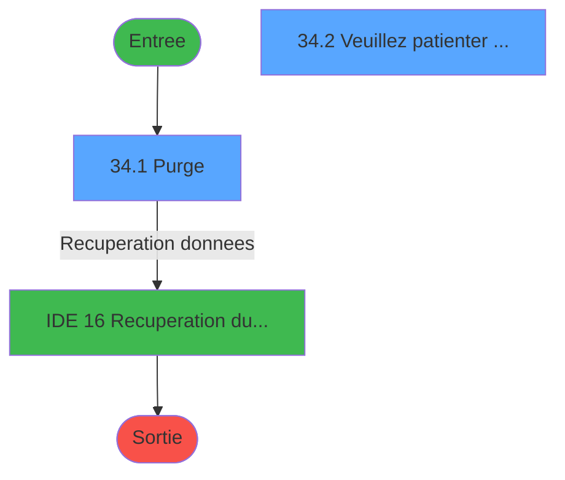
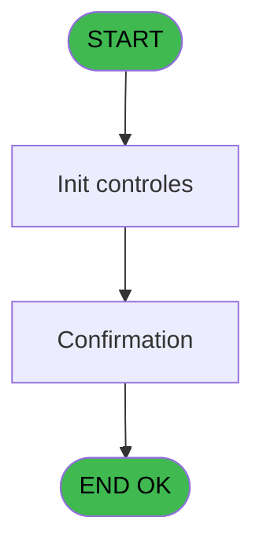

# EXB IDE 34 - Purge

> **Analyse**: Phases 1-4 2026-02-03 10:43 -> 10:43 (17s) | Assemblage 10:43
> **Pipeline**: V7.2 Enrichi
> **Structure**: 4 onglets (Resume | Ecrans | Donnees | Connexions)

<!-- TAB:Resume -->

## 1. FICHE D'IDENTITE

| Attribut | Valeur |
|----------|--------|
| Projet | EXB |
| IDE Position | 34 |
| Nom Programme | Purge |
| Fichier source | `Prg_34.xml` |
| Domaine metier | General |
| Taches | 3 (2 ecrans visibles) |
| Tables modifiees | 0 |
| Programmes appeles | 1 |

## 2. DESCRIPTION FONCTIONNELLE

**Purge** assure la gestion complete de ce processus, accessible depuis [Menu general (IDE 31)](EXB-IDE-31.md).

Le flux de traitement s'organise en **1 blocs fonctionnels** :

- **Traitement** (3 taches) : traitements metier divers

## 3. BLOCS FONCTIONNELS

### 3.1 Traitement (3 taches)

Traitements internes.

---

#### 34 - Purge [[ECRAN]](#ecran-t1)

**Role** : Traitement : Purge.
**Ecran** : 166 x 20 DLU (MDI) | [Voir mockup](#ecran-t1)
**Delegue a** : [Recuperation du titre (IDE 16)](EXB-IDE-16.md)

---

#### 34.1 - Purge [[ECRAN]](#ecran-t2)

**Role** : Traitement : Purge.
**Ecran** : 677 x 95 DLU (MDI) | [Voir mockup](#ecran-t2)
**Delegue a** : [Recuperation du titre (IDE 16)](EXB-IDE-16.md)

---

#### 34.2 - Veuillez patienter ... [[ECRAN]](#ecran-t3)

**Role** : Traitement : Veuillez patienter ....
**Ecran** : 424 x 56 DLU (MDI) | [Voir mockup](#ecran-t3)
**Delegue a** : [Recuperation du titre (IDE 16)](EXB-IDE-16.md)

## 5. REGLES METIER

*(Aucune regle metier identifiee)*

## 6. CONTEXTE

- **Appele par**: [Menu general (IDE 31)](EXB-IDE-31.md)
- **Appelle**: 1 programmes | **Tables**: 2 (W:0 R:1 L:1) | **Taches**: 3 | **Expressions**: 1

<!-- TAB:Ecrans -->

## 8. ECRANS

### 8.1 Forms visibles (2 / 3)

| # | Position | Tache | Nom | Type | Largeur | Hauteur | Bloc |
|---|----------|-------|-----|------|---------|---------|------|
| 1 | 34.1 | 34.1 | Purge | MDI | 677 | 95 | Traitement |
| 2 | 34.2 | 34.2 | Veuillez patienter ... | MDI | 424 | 56 | Traitement |

### 8.2 Mockups Ecrans

---

#### 34.1 - Purge
**Tache** : [34.1](#t2) | **Type** : MDI | **Dimensions** : 677 x 95 DLU
**Bloc** : Traitement | **Titre IDE** : Purge

<!-- FORM-DATA:
{
    "width":  677,
    "vFactor":  8,
    "type":  "MDI",
    "hFactor":  8,
    "controls":  [
                     {
                         "x":  99,
                         "type":  "label",
                         "var":  "",
                         "y":  7,
                         "w":  554,
                         "fmt":  "",
                         "name":  "",
                         "h":  48,
                         "color":  "",
                         "text":  "",
                         "parent":  null
                     },
                     {
                         "x":  110,
                         "type":  "label",
                         "var":  "",
                         "y":  11,
                         "w":  560,
                         "fmt":  "",
                         "name":  "",
                         "h":  8,
                         "color":  "142",
                         "text":  "La purge va supprimer les ventes de parcours et d\u0027options",
                         "parent":  1
                     },
                     {
                         "x":  110,
                         "type":  "label",
                         "var":  "",
                         "y":  19,
                         "w":  442,
                         "fmt":  "",
                         "name":  "",
                         "h":  8,
                         "color":  "142",
                         "text":  "anterieures de 15 jours à la date comptable :",
                         "parent":  1
                     },
                     {
                         "x":  126,
                         "type":  "label",
                         "var":  "",
                         "y":  35,
                         "w":  434,
                         "fmt":  "",
                         "name":  "",
                         "h":  8,
                         "color":  "142",
                         "text":  ". des GMs qui ont ete purges à la caisse",
                         "parent":  1
                     },
                     {
                         "x":  126,
                         "type":  "label",
                         "var":  "",
                         "y":  43,
                         "w":  213,
                         "fmt":  "",
                         "name":  "",
                         "h":  8,
                         "color":  "142",
                         "text":  ". des non-GMs",
                         "parent":  1
                     },
                     {
                         "x":  0,
                         "type":  "label",
                         "var":  "",
                         "y":  68,
                         "w":  672,
                         "fmt":  "",
                         "name":  "",
                         "h":  24,
                         "color":  "1",
                         "text":  "",
                         "parent":  null
                     },
                     {
                         "x":  8,
                         "type":  "button",
                         "var":  "",
                         "y":  72,
                         "w":  154,
                         "fmt":  "\u0026Ok",
                         "name":  "btn valider",
                         "h":  18,
                         "color":  "",
                         "text":  "",
                         "parent":  7
                     },
                     {
                         "x":  173,
                         "type":  "button",
                         "var":  "",
                         "y":  72,
                         "w":  154,
                         "fmt":  "\\A\u0026bandonner",
                         "name":  "btn quitter",
                         "h":  18,
                         "color":  "",
                         "text":  "",
                         "parent":  7
                     },
                     {
                         "x":  8,
                         "type":  "image",
                         "var":  "",
                         "y":  15,
                         "w":  82,
                         "fmt":  "",
                         "name":  "",
                         "h":  33,
                         "color":  "",
                         "text":  "",
                         "parent":  null
                     }
                 ],
    "taskId":  "34.1",
    "height":  95
}
-->

<strong>Boutons : 2 boutons</strong>

| Bouton | Pos (x,y) | Action |
|--------|-----------|--------|
| Ok | 8,72 | Valide la saisie et enregistre |
| \Abandonner | 173,72 | Annule et retour au menu |

---

#### 34.2 - Veuillez patienter ...
**Tache** : [34.2](#t3) | **Type** : MDI | **Dimensions** : 424 x 56 DLU
**Bloc** : Traitement | **Titre IDE** : Veuillez patienter ...

<!-- FORM-DATA:
{
    "width":  424,
    "vFactor":  8,
    "type":  "MDI",
    "hFactor":  8,
    "controls":  [
                     {
                         "x":  0,
                         "type":  "label",
                         "var":  "",
                         "y":  0,
                         "w":  423,
                         "fmt":  "",
                         "name":  "",
                         "h":  29,
                         "color":  "",
                         "text":  "",
                         "parent":  null
                     },
                     {
                         "x":  120,
                         "type":  "label",
                         "var":  "",
                         "y":  10,
                         "w":  221,
                         "fmt":  "",
                         "name":  "",
                         "h":  8,
                         "color":  "7",
                         "text":  "Purge en cours ...",
                         "parent":  null
                     },
                     {
                         "x":  0,
                         "type":  "label",
                         "var":  "",
                         "y":  29,
                         "w":  423,
                         "fmt":  "",
                         "name":  "",
                         "h":  27,
                         "color":  "",
                         "text":  "",
                         "parent":  null
                     },
                     {
                         "x":  72,
                         "type":  "label",
                         "var":  "",
                         "y":  38,
                         "w":  280,
                         "fmt":  "",
                         "name":  "",
                         "h":  8,
                         "color":  "",
                         "text":  "Purge des Ventes",
                         "parent":  null
                     },
                     {
                         "x":  4,
                         "type":  "image",
                         "var":  "",
                         "y":  2,
                         "w":  72,
                         "fmt":  "",
                         "name":  "",
                         "h":  25,
                         "color":  "",
                         "text":  "",
                         "parent":  null
                     }
                 ],
    "taskId":  "34.2",
    "height":  56
}
-->

## 9. NAVIGATION

### 9.1 Enchainement des ecrans

**Detail par enchainement :**

| Depuis | Action | Vers | Retour |
|--------|--------|------|--------|
| Purge | Recuperation donnees | [Recuperation du titre (IDE 16)](EXB-IDE-16.md) | Retour ecran |

### 9.3 Structure hierarchique (3 taches)

| Position | Tache | Type | Dimensions | Bloc |
|----------|-------|------|------------|------|
| **34.1** | [**Purge** (34)](#t1) [mockup](#ecran-t1) | MDI | 166x20 | Traitement |
| 34.1.1 | [Purge (34.1)](#t2) [mockup](#ecran-t2) | MDI | 677x95 | |
| 34.1.2 | [Veuillez patienter ... (34.2)](#t3) [mockup](#ecran-t3) | MDI | 424x56 | |

### 9.4 Algorigramme

> **Legende**: Vert = START/END OK | Rouge = END KO | Bleu = Decisions
> *Algorigramme auto-genere. Utiliser `/algorigramme` pour une synthese metier detaillee.*

<!-- TAB:Donnees -->

## 10. TABLES

### Tables utilisees (2)

| ID | Nom | Description | Type | R | W | L | Usages |
|----|-----|-------------|------|---|---|---|--------|
| 47 | compte_gm________cgm | Comptes GM (generaux) | DB | R |   |   | 1 |
| 309 | vente____________vep | Donnees de ventes | DB |   |   | L | 1 |

### Colonnes par table (1 / 1 tables avec colonnes identifiees)

Table 47 - compte_gm________cgm (R) - 1 usages

| Lettre | Variable | Acces | Type |
|--------|----------|-------|------|
| A | W1 ret lien compte | R | Numeric |

## 11. VARIABLES

### 11.1 Parametres entrants (1)

Variables recues du programme appelant ([Menu general (IDE 31)](EXB-IDE-31.md)).

| Lettre | Nom | Type | Usage dans |
|--------|-----|------|-----------|
| A | P0 date comptable | Date | - |

### 11.2 Variables de session (1)

Variables persistantes pendant toute la session.

| Lettre | Nom | Type | Usage dans |
|--------|-----|------|-----------|
| E | v. titre | Alpha | - |

### 11.3 Variables de travail (1)

Variables internes au programme.

| Lettre | Nom | Type | Usage dans |
|--------|-----|------|-----------|
| B | W0 confirmation | Alpha | 1x calcul interne |

### 11.4 Autres (2)

Variables diverses.

| Lettre | Nom | Type | Usage dans |
|--------|-----|------|-----------|
| C | btn valider | Alpha | - |
| D | btn quitter | Alpha | - |

## 12. EXPRESSIONS

**1 / 1 expressions decodees (100%)**

### 12.1 Repartition par type

| Type | Expressions | Regles |
|------|-------------|--------|
| CONDITION | 1 | 0 |

### 12.2 Expressions cles par type

#### CONDITION (1 expressions)

| Type | IDE | Expression | Regle |
|------|-----|------------|-------|
| CONDITION | 1 | `W0 confirmation [B]='O'` | - |

<!-- TAB:Connexions -->

## 13. GRAPHE D'APPELS

### 13.1 Chaine depuis Main (Callers)

Main -> ... -> [Menu general (IDE 31)](EXB-IDE-31.md) -> **Purge (IDE 34)**

### 13.2 Callers

| IDE | Nom Programme | Nb Appels |
|-----|---------------|-----------|
| [31](EXB-IDE-31.md) | Menu general | 1 |

### 13.3 Callees (programmes appeles)

### 13.4 Detail Callees avec contexte

| IDE | Nom Programme | Appels | Contexte |
|-----|---------------|--------|----------|
| [16](EXB-IDE-16.md) | Recuperation du titre | 1 | Recuperation donnees |

## 14. RECOMMANDATIONS MIGRATION

### 14.1 Profil du programme

| Metrique | Valeur | Impact migration |
|----------|--------|-----------------|
| Lignes de logique | 35 | Programme compact |
| Expressions | 1 | Peu de logique |
| Tables WRITE | 0 | Impact faible |
| Sous-programmes | 1 | Peu de dependances |
| Ecrans visibles | 2 | Quelques ecrans |
| Code desactive | 0% (0 / 35) | Code sain |
| Regles metier | 0 | Pas de regle identifiee |

### 14.2 Plan de migration par bloc

#### Traitement (3 taches: 3 ecrans, 0 traitement)

- **Strategie** : 3 composant(s) UI (Razor/React) avec formulaires et validation.
- 1 sous-programme(s) a migrer ou a reutiliser depuis les services existants.
- Decomposer les taches en services unitaires testables.

### 14.3 Dependances critiques

| Dependance | Type | Appels | Impact |
|------------|------|--------|--------|
| [Recuperation du titre (IDE 16)](EXB-IDE-16.md) | Sous-programme | 1x | Normale - Recuperation donnees |

---
*Spec DETAILED generee par Pipeline V7.2 - 2026-02-03 10:43*
