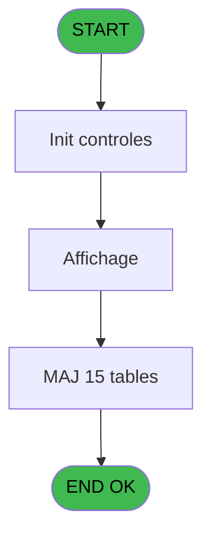
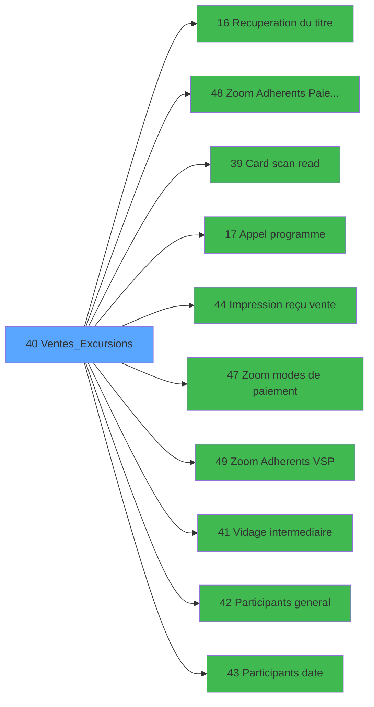

# EXB IDE 40 - Ventes_Excursions

> **Analyse**: Phases 1-4 2026-02-03 10:45 -> 10:46 (15s) | Assemblage 10:46
> **Pipeline**: V7.2 Enrichi
> **Structure**: 4 onglets (Resume | Ecrans | Donnees | Connexions)

<!-- TAB:Resume -->

## 1. FICHE D'IDENTITE

| Attribut | Valeur |
|----------|--------|
| Projet | EXB |
| IDE Position | 40 |
| Nom Programme | Ventes_Excursions |
| Fichier source | `Prg_40.xml` |
| Domaine metier | Ventes |
| Taches | 158 (30 ecrans visibles) |
| Tables modifiees | 15 |
| Programmes appeles | 10 |

## 2. DESCRIPTION FONCTIONNELLE

**Ventes_Excursions** assure la gestion complete de ce processus, accessible depuis [Menu general (IDE 31)](EXB-IDE-31.md).

Le flux de traitement s'organise en **5 blocs fonctionnels** :

- **Traitement** (101 taches) : traitements metier divers
- **Calcul** (40 taches) : calculs de montants, stocks ou compteurs
- **Saisie** (12 taches) : ecrans de saisie utilisateur (formulaires, champs, donnees)
- **Reglement** (4 taches) : gestion des moyens de paiement et reglements
- **Consultation** (1 tache) : ecrans de recherche, selection et consultation

**Donnees modifiees** : 15 tables en ecriture (reseau_cloture___rec, gm-recherche_____gmr, comptable________cte, compte_gm________cgm, intermed_compta__ite, vente, compteur_excurs__cte, date_comptable___dat, intermediaire____int, participants_____par, excurs_planning__epl, excursions_______exc, details_partici__dpa, vente____________vep, groupe).

Detail : phases du traitement

#### Phase 1 : Traitement (101 taches)

- **40** - Parcours **[[ECRAN]](#ecran-t1)**
- **40.1.1** - Planning **[[ECRAN]](#ecran-t3)**
- **40.1.2** - Planning **[[ECRAN]](#ecran-t4)**
- **40.1.2.1** - Details **[[ECRAN]](#ecran-t5)**
- **40.1.2.2.1** - Chrono
- **40.1.2.2.2** - Intermediaire v1
- **40.1.2.2.3** - Intermediaire
- **40.3** - (sans nom) **[[ECRAN]](#ecran-t14)**
- **40.3.1** - Actualisation places v1
- **40.3.2** - Actualisation places
- **40.3.2.1** - Delete
- **40.3.2.2** - Delete
- **40.5** - Inscription **[[ECRAN]](#ecran-t20)**
- **40.5.1.1** - Details **[[ECRAN]](#ecran-t23)**
- **40.5.1.2** - Enregistrement Participant
- **40.5.1.3** - Enregistrement Participant
- **40.5.2.2** - Test reseau caisse
- **40.5.2.3** - Vidage intermediaire v1
- **40.5.2.4** - Màj Flag participants
- **40.5.2.5** - Deblocage reseau caisse
- **40.5.2.6** - (sans nom)
- **40.5.2.6.1** - Enregistrement Participant **[[ECRAN]](#ecran-t34)**
- **40.5.2.6.2.1** - Imputation
- **40.5.2.6.2.2** - Date caisse
- **40.5.2.6.2.5** - Màj solde
- **40.5.2.6.3.1** - Imputation
- **40.5.2.6.3.2** - Date caisse
- **40.5.2.6.4** - Enregistrement Participant
- **40.5.2.7** - Test Cloture
- **40.5.2.7.1** - Blocage Cloture v1
- **40.5.2.8** - Deblocage Cloture v1
- **40.5.3.2** - Test reseau caisse
- **40.5.3.3** - Vidage intermediaire v1
- **40.5.3.4** - Màj Flag participants v1
- **40.5.3.5** - Deblocage reseau caisse
- **40.5.3.6** - (sans nom)
- **40.5.3.6.1** - Enregistrement Participant **[[ECRAN]](#ecran-t58)**
- **40.5.3.6.2.1** - Imputation
- **40.5.3.6.2.2** - Date caisse
- **40.5.3.6.2.5** - Màj solde
- **40.5.3.6.3.1** - Imputation
- **40.5.3.6.3.2** - Date caisse
- **40.5.3.6.4** - Enregistrement Participant
- **40.5.3.8** - Test Cloture
- **40.5.3.8.1** - Blocage Cloture v1
- **40.5.3.9** - Deblocage Cloture v1
- **40.5.4** - Participants **[[ECRAN]](#ecran-t75)**
- **40.5.10** - Participants **[[ECRAN]](#ecran-t81)**
- **40.5.10.1** - Suppression
- **40.5.10.2** - Suppression
- **40.5.10.3** - Details **[[ECRAN]](#ecran-t84)**
- **40.5.11.1** - Enregistrement Participant
- **40.5.11.2** - Enregistrement Participant
- **40.6** - Recupere tva par default
- **40.1.2.2.4** - Intermediaire v1
- **40.7** - (sans nom) **[[ECRAN]](#ecran-t107)**
- **40.7.1** - Actualisation places v1
- **40.7.2** - Actualisation places
- **40.7.2.1** - Delete
- **40.7.2.2** - Delete
- **40.9** - Inscription **[[ECRAN]](#ecran-t117)**
- **40.9.1.1** - Details **[[ECRAN]](#ecran-t119)**
- **40.9.1.2** - Enregistrement Participant
- **40.9.1.3** - Enregistrement Participant
- **40.9.2.2** - Test reseau caisse
- **40.9.2.3** - Vidage intermediaire v1
- **40.9.2.4** - Màj Flag participants
- **40.9.2.5** - Deblocage reseau caisse
- **40.9.2.6** - (sans nom)
- **40.9.2.6.1** - Enregistrement Participant **[[ECRAN]](#ecran-t129)**
- **40.9.2.6.2.1** - Imputation
- **40.9.2.6.2.2** - Date caisse
- **40.9.2.6.2.5** - Màj solde
- **40.9.2.6.3.1** - Imputation
- **40.9.2.6.3.2** - Date caisse
- **40.9.2.6.4** - Enregistrement Participant
- **40.9.2.7** - Test Cloture
- **40.9.2.7.1** - Blocage Cloture v1
- **40.9.2.8** - Deblocage Cloture v1
- **40.9.3.2** - Test reseau caisse
- **40.9.3.3** - Vidage intermediaire v1
- **40.9.3.4** - Màj Flag participants
- **40.9.3.5** - Deblocage reseau caisse
- **40.9.3.6** - (sans nom)
- **40.9.3.6.1** - Enregistrement Participant **[[ECRAN]](#ecran-t154)**
- **40.9.3.6.2.1** - Imputation
- **40.9.3.6.2.2** - Date caisse
- **40.9.3.6.2.5** - Màj solde
- **40.9.3.6.3.1** - Imputation
- **40.9.3.6.3.2** - Date caisse
- **40.9.3.6.4** - Enregistrement Participant
- **40.9.3.8** - Test Cloture
- **40.9.3.8.1** - Blocage Cloture v1
- **40.9.3.9** - Deblocage Cloture v1
- **40.9.4** - Participants **[[ECRAN]](#ecran-t171)**
- **40.9.10** - Participants **[[ECRAN]](#ecran-t177)**
- **40.9.10.1** - Suppression
- **40.9.10.2** - Suppression
- **40.9.10.3** - Details **[[ECRAN]](#ecran-t180)**
- **40.9.11.1** - Enregistrement Participant
- **40.9.11.2** - Enregistrement Participant

Delegue a : [Recuperation du titre (IDE 16)](EXB-IDE-16.md), [Card scan read (IDE 39)](EXB-IDE-39.md), [Appel programme (IDE 17)](EXB-IDE-17.md), [  Vidage intermediaire (IDE 41)](EXB-IDE-41.md), [  Participants general (IDE 42)](EXB-IDE-42.md), [  Participants date (IDE 43)](EXB-IDE-43.md)

#### Phase 2 : Saisie (12 taches)

- **40.1** - Ventes Excursion **[[ECRAN]](#ecran-t2)**
- **40.1.2.2** - Definition des Ventes **[[ECRAN]](#ecran-t6)**
- **40.1.2.3** - Ventes en cours .... v1 **[[ECRAN]](#ecran-t11)**
- **40.1.3** - Ventes en cours ....v1 **[[ECRAN]](#ecran-t12)**
- **40.4** - Ventes en cours .... v1 **[[ECRAN]](#ecran-t19)**
- **40.5.1** - Saisie Participants **[[ECRAN]](#ecran-t21)**
- **40.5.11** - Saisie Participants **[[ECRAN]](#ecran-t85)**
- **40.1.2.4** - Ventes en cours .... v1 **[[ECRAN]](#ecran-t101)**
- **40.1.4** - Ventes en cours ....v1 **[[ECRAN]](#ecran-t104)**
- **40.8** - Ventes en cours .... v1 **[[ECRAN]](#ecran-t114)**
- **40.9.1** - Saisie Participants **[[ECRAN]](#ecran-t118)**
- **40.9.11** - Saisie Participants **[[ECRAN]](#ecran-t181)**

Delegue a : [  Impression reçu vente (IDE 44)](EXB-IDE-44.md)

#### Phase 3 : Consultation (1 tache)

- **40.2** - Recherche **[[ECRAN]](#ecran-t13)**

Delegue a : [Recuperation du titre (IDE 16)](EXB-IDE-16.md), [Zoom Adherents Paiement (IDE 48)](EXB-IDE-48.md), [Zoom modes de paiement (IDE 47)](EXB-IDE-47.md), [Zoom Adherents VSP (IDE 49)](EXB-IDE-49.md)

#### Phase 4 : Reglement (4 taches)

- **40.5.2** - Paiement partiel **[[ECRAN]](#ecran-t26)**
- **40.5.3** - Paiement global **[[ECRAN]](#ecran-t50)**
- **40.9.2** - Paiement partiel **[[ECRAN]](#ecran-t122)**
- **40.9.3** - Paiement global **[[ECRAN]](#ecran-t147)**

Delegue a : [Zoom Adherents Paiement (IDE 48)](EXB-IDE-48.md), [Zoom modes de paiement (IDE 47)](EXB-IDE-47.md)

#### Phase 5 : Calcul (40 taches)

- **40.5.2.1** - Lecture date comptable
- **40.5.2.6.1.1** - Compteur
- **40.5.2.6.2** - Màj Comptable
- **40.5.2.6.2.3** - Creation comptable v1
- **40.5.2.6.2.4** - Creation comptable
- **40.5.2.6.3** - Màj Comptable
- **40.5.2.6.3.3** - Creation comptable
- **40.5.3.1** - Lecture date comptable
- **40.5.3.6.1.1** - Compteur
- **40.5.3.6.2** - Màj Comptable
- **40.5.3.6.2.3** - Creation comptable v1
- **40.5.3.6.2.4** - Creation comptable
- **40.5.3.6.3** - Màj Comptable
- **40.5.3.6.3.3** - Creation comptable
- **40.5.3.7** - Compteur
- **40.5.5** - Compteur
- **40.5.6** - Compteur
- **40.5.7** - Compteur
- **40.5.8** - Compteur
- **40.5.9** - Compteur
- **40.9.2.1** - Lecture date comptable
- **40.9.2.6.1.1** - Compteur
- **40.9.2.6.2** - Màj Comptable
- **40.9.2.6.2.3** - Creation comptable v1
- **40.9.2.6.2.4** - Creation comptable
- **40.9.2.6.3** - Màj Comptable
- **40.9.2.6.3.3** - Creation comptable
- **40.9.3.1** - Lecture date comptable
- **40.9.3.6.1.1** - Compteur
- **40.9.3.6.2** - Màj Comptable
- **40.9.3.6.2.3** - Creation comptable v1
- **40.9.3.6.2.4** - Creation comptable
- **40.9.3.6.3** - Màj Comptable
- **40.9.3.6.3.3** - Creation comptable
- **40.9.3.7** - Compteur
- **40.9.5** - Compteur
- **40.9.6** - Compteur
- **40.9.7** - Compteur
- **40.9.8** - Compteur
- **40.9.9** - Compteur

#### Tables impactees

| Table | Operations | Role metier |
|-------|-----------|-------------|
| intermediaire____int | R/**W** (30 usages) |  |
| participants_____par | **W**/L (30 usages) |  |
| details_partici__dpa | **W**/L (14 usages) |  |
| compte_gm________cgm | **W** (12 usages) | Comptes GM (generaux) |
| reseau_cloture___rec | **W** (12 usages) | Donnees reseau/cloture |
| compteur_excurs__cte | **W**/L (9 usages) | Comptes GM (generaux) |
| gm-recherche_____gmr | R/**W** (6 usages) | Index de recherche |
| excursions_______exc | R/**W**/L (6 usages) |  |
| groupe | **W**/L (6 usages) |  |
| excurs_planning__epl | **W**/L (4 usages) |  |
| intermed_compta__ite | **W** (4 usages) |  |
| vente | **W** (4 usages) | Donnees de ventes |
| date_comptable___dat | **W** (4 usages) |  |
| comptable________cte | **W** (4 usages) |  |
| vente____________vep | **W** (4 usages) | Donnees de ventes |

## 3. BLOCS FONCTIONNELS

### 3.1 Traitement (101 taches)

Traitements internes.

---

#### 40 - Parcours [[ECRAN]](#ecran-t1)

**Role** : Tache d'orchestration : point d'entree du programme (101 sous-taches). Coordonne l'enchainement des traitements.
**Ecran** : 166 x 24 DLU (MDI) | [Voir mockup](#ecran-t1)

100 sous-taches directes

| Tache | Nom | Bloc |
|-------|-----|------|
| [40.1.1](#t3) | Planning **[[ECRAN]](#ecran-t3)** | Traitement |
| [40.1.2](#t4) | Planning **[[ECRAN]](#ecran-t4)** | Traitement |
| [40.1.2.1](#t5) | Details **[[ECRAN]](#ecran-t5)** | Traitement |
| [40.1.2.2.1](#t8) | Chrono | Traitement |
| [40.1.2.2.2](#t9) | Intermediaire v1 | Traitement |
| [40.1.2.2.3](#t10) | Intermediaire | Traitement |
| [40.3](#t14) | (sans nom) **[[ECRAN]](#ecran-t14)** | Traitement |
| [40.3.1](#t15) | Actualisation places v1 | Traitement |
| [40.3.2](#t16) | Actualisation places | Traitement |
| [40.3.2.1](#t17) | Delete | Traitement |
| [40.3.2.2](#t18) | Delete | Traitement |
| [40.5](#t20) | Inscription **[[ECRAN]](#ecran-t20)** | Traitement |
| [40.5.1.1](#t23) | Details **[[ECRAN]](#ecran-t23)** | Traitement |
| [40.5.1.2](#t24) | Enregistrement Participant | Traitement |
| [40.5.1.3](#t25) | Enregistrement Participant | Traitement |
| [40.5.2.2](#t29) | Test reseau caisse | Traitement |
| [40.5.2.3](#t30) | Vidage intermediaire v1 | Traitement |
| [40.5.2.4](#t31) | Màj Flag participants | Traitement |
| [40.5.2.5](#t32) | Deblocage reseau caisse | Traitement |
| [40.5.2.6](#t33) | (sans nom) | Traitement |
| [40.5.2.6.1](#t34) | Enregistrement Participant **[[ECRAN]](#ecran-t34)** | Traitement |
| [40.5.2.6.2.1](#t37) | Imputation | Traitement |
| [40.5.2.6.2.2](#t38) | Date caisse | Traitement |
| [40.5.2.6.2.5](#t41) | Màj solde | Traitement |
| [40.5.2.6.3.1](#t43) | Imputation | Traitement |
| [40.5.2.6.3.2](#t44) | Date caisse | Traitement |
| [40.5.2.6.4](#t46) | Enregistrement Participant | Traitement |
| [40.5.2.7](#t47) | Test Cloture | Traitement |
| [40.5.2.7.1](#t48) | Blocage Cloture v1 | Traitement |
| [40.5.2.8](#t49) | Deblocage Cloture v1 | Traitement |
| [40.5.3.2](#t53) | Test reseau caisse | Traitement |
| [40.5.3.3](#t54) | Vidage intermediaire v1 | Traitement |
| [40.5.3.4](#t55) | Màj Flag participants v1 | Traitement |
| [40.5.3.5](#t56) | Deblocage reseau caisse | Traitement |
| [40.5.3.6](#t57) | (sans nom) | Traitement |
| [40.5.3.6.1](#t58) | Enregistrement Participant **[[ECRAN]](#ecran-t58)** | Traitement |
| [40.5.3.6.2.1](#t61) | Imputation | Traitement |
| [40.5.3.6.2.2](#t62) | Date caisse | Traitement |
| [40.5.3.6.2.5](#t65) | Màj solde | Traitement |
| [40.5.3.6.3.1](#t67) | Imputation | Traitement |
| [40.5.3.6.3.2](#t68) | Date caisse | Traitement |
| [40.5.3.6.4](#t70) | Enregistrement Participant | Traitement |
| [40.5.3.8](#t72) | Test Cloture | Traitement |
| [40.5.3.8.1](#t73) | Blocage Cloture v1 | Traitement |
| [40.5.3.9](#t74) | Deblocage Cloture v1 | Traitement |
| [40.5.4](#t75) | Participants **[[ECRAN]](#ecran-t75)** | Traitement |
| [40.5.10](#t81) | Participants **[[ECRAN]](#ecran-t81)** | Traitement |
| [40.5.10.1](#t82) | Suppression | Traitement |
| [40.5.10.2](#t83) | Suppression | Traitement |
| [40.5.10.3](#t84) | Details **[[ECRAN]](#ecran-t84)** | Traitement |
| [40.5.11.1](#t87) | Enregistrement Participant | Traitement |
| [40.5.11.2](#t88) | Enregistrement Participant | Traitement |
| [40.6](#t89) | Recupere tva par default | Traitement |
| [40.1.2.2.4](#t98) | Intermediaire v1 | Traitement |
| [40.7](#t107) | (sans nom) **[[ECRAN]](#ecran-t107)** | Traitement |
| [40.7.1](#t108) | Actualisation places v1 | Traitement |
| [40.7.2](#t109) | Actualisation places | Traitement |
| [40.7.2.1](#t110) | Delete | Traitement |
| [40.7.2.2](#t111) | Delete | Traitement |
| [40.9](#t117) | Inscription **[[ECRAN]](#ecran-t117)** | Traitement |
| [40.9.1.1](#t119) | Details **[[ECRAN]](#ecran-t119)** | Traitement |
| [40.9.1.2](#t120) | Enregistrement Participant | Traitement |
| [40.9.1.3](#t121) | Enregistrement Participant | Traitement |
| [40.9.2.2](#t124) | Test reseau caisse | Traitement |
| [40.9.2.3](#t125) | Vidage intermediaire v1 | Traitement |
| [40.9.2.4](#t126) | Màj Flag participants | Traitement |
| [40.9.2.5](#t127) | Deblocage reseau caisse | Traitement |
| [40.9.2.6](#t128) | (sans nom) | Traitement |
| [40.9.2.6.1](#t129) | Enregistrement Participant **[[ECRAN]](#ecran-t129)** | Traitement |
| [40.9.2.6.2.1](#t132) | Imputation | Traitement |
| [40.9.2.6.2.2](#t133) | Date caisse | Traitement |
| [40.9.2.6.2.5](#t137) | Màj solde | Traitement |
| [40.9.2.6.3.1](#t139) | Imputation | Traitement |
| [40.9.2.6.3.2](#t140) | Date caisse | Traitement |
| [40.9.2.6.4](#t143) | Enregistrement Participant | Traitement |
| [40.9.2.7](#t144) | Test Cloture | Traitement |
| [40.9.2.7.1](#t145) | Blocage Cloture v1 | Traitement |
| [40.9.2.8](#t146) | Deblocage Cloture v1 | Traitement |
| [40.9.3.2](#t149) | Test reseau caisse | Traitement |
| [40.9.3.3](#t150) | Vidage intermediaire v1 | Traitement |
| [40.9.3.4](#t151) | Màj Flag participants | Traitement |
| [40.9.3.5](#t152) | Deblocage reseau caisse | Traitement |
| [40.9.3.6](#t153) | (sans nom) | Traitement |
| [40.9.3.6.1](#t154) | Enregistrement Participant **[[ECRAN]](#ecran-t154)** | Traitement |
| [40.9.3.6.2.1](#t157) | Imputation | Traitement |
| [40.9.3.6.2.2](#t158) | Date caisse | Traitement |
| [40.9.3.6.2.5](#t161) | Màj solde | Traitement |
| [40.9.3.6.3.1](#t163) | Imputation | Traitement |
| [40.9.3.6.3.2](#t164) | Date caisse | Traitement |
| [40.9.3.6.4](#t166) | Enregistrement Participant | Traitement |
| [40.9.3.8](#t168) | Test Cloture | Traitement |
| [40.9.3.8.1](#t169) | Blocage Cloture v1 | Traitement |
| [40.9.3.9](#t170) | Deblocage Cloture v1 | Traitement |
| [40.9.4](#t171) | Participants **[[ECRAN]](#ecran-t171)** | Traitement |
| [40.9.10](#t177) | Participants **[[ECRAN]](#ecran-t177)** | Traitement |
| [40.9.10.1](#t178) | Suppression | Traitement |
| [40.9.10.2](#t179) | Suppression | Traitement |
| [40.9.10.3](#t180) | Details **[[ECRAN]](#ecran-t180)** | Traitement |
| [40.9.11.1](#t182) | Enregistrement Participant | Traitement |
| [40.9.11.2](#t183) | Enregistrement Participant | Traitement |

---

#### 40.1.1 - Planning [[ECRAN]](#ecran-t3)

**Role** : Traitement : Planning.
**Ecran** : 544 x 133 DLU (Modal) | [Voir mockup](#ecran-t3)

---

#### 40.1.2 - Planning [[ECRAN]](#ecran-t4)

**Role** : Traitement : Planning.
**Ecran** : 1043 x 181 DLU (MDI) | [Voir mockup](#ecran-t4)

---

#### 40.1.2.1 - Details [[ECRAN]](#ecran-t5)

**Role** : Traitement : Details.
**Ecran** : 760 x 236 DLU (MDI) | [Voir mockup](#ecran-t5)

---

#### 40.1.2.2.1 - Chrono

**Role** : Traitement : Chrono.

---

#### 40.1.2.2.2 - Intermediaire v1

**Role** : Traitement : Intermediaire v1.

---

#### 40.1.2.2.3 - Intermediaire

**Role** : Traitement : Intermediaire.

---

#### 40.3 - (sans nom) [[ECRAN]](#ecran-t14)

**Role** : Traitement interne.
**Ecran** : 88 x 24 DLU (MDI) | [Voir mockup](#ecran-t14)

---

#### 40.3.1 - Actualisation places v1

**Role** : Traitement : Actualisation places v1.

---

#### 40.3.2 - Actualisation places

**Role** : Traitement : Actualisation places.

---

#### 40.3.2.1 - Delete

**Role** : Traitement : Delete.

---

#### 40.3.2.2 - Delete

**Role** : Traitement : Delete.

---

#### 40.5 - Inscription [[ECRAN]](#ecran-t20)

**Role** : Traitement : Inscription.
**Ecran** : 1189 x 279 DLU (MDI) | [Voir mockup](#ecran-t20)

---

#### 40.5.1.1 - Details [[ECRAN]](#ecran-t23)

**Role** : Traitement : Details.
**Ecran** : 826 x 227 DLU (MDI) | [Voir mockup](#ecran-t23)

---

#### 40.5.1.2 - Enregistrement Participant

**Role** : Traitement : Enregistrement Participant.

---

#### 40.5.1.3 - Enregistrement Participant

**Role** : Traitement : Enregistrement Participant.

---

#### 40.5.2.2 - Test reseau caisse

**Role** : Verification : Test reseau caisse.
**Variables liees** : W (W cloture caisse)

---

#### 40.5.2.3 - Vidage intermediaire v1

**Role** : Traitement : Vidage intermediaire v1.

---

#### 40.5.2.4 - Màj Flag participants

**Role** : Traitement : Màj Flag participants.

---

#### 40.5.2.5 - Deblocage reseau caisse

**Role** : Traitement : Deblocage reseau caisse.
**Variables liees** : W (W cloture caisse)

---

#### 40.5.2.6 - (sans nom)

**Role** : Traitement interne.

---

#### 40.5.2.6.1 - Enregistrement Participant [[ECRAN]](#ecran-t34)

**Role** : Traitement : Enregistrement Participant.
**Ecran** : 208 x 24 DLU (MDI) | [Voir mockup](#ecran-t34)

---

#### 40.5.2.6.2.1 - Imputation

**Role** : Traitement : Imputation.

---

#### 40.5.2.6.2.2 - Date caisse

**Role** : Traitement : Date caisse.
**Variables liees** : H (W0 date), W (W cloture caisse)

---

#### 40.5.2.6.2.5 - Màj solde

**Role** : Consultation/chargement : Màj solde.

---

#### 40.5.2.6.3.1 - Imputation

**Role** : Traitement : Imputation.

---

#### 40.5.2.6.3.2 - Date caisse

**Role** : Traitement : Date caisse.
**Variables liees** : H (W0 date), W (W cloture caisse)

---

#### 40.5.2.6.4 - Enregistrement Participant

**Role** : Traitement : Enregistrement Participant.

---

#### 40.5.2.7 - Test Cloture

**Role** : Verification : Test Cloture.
**Variables liees** : V (W Cloture), W (W cloture caisse)

---

#### 40.5.2.7.1 - Blocage Cloture v1

**Role** : Traitement : Blocage Cloture v1.
**Variables liees** : V (W Cloture), W (W cloture caisse)

---

#### 40.5.2.8 - Deblocage Cloture v1

**Role** : Traitement : Deblocage Cloture v1.
**Variables liees** : V (W Cloture), W (W cloture caisse)

---

#### 40.5.3.2 - Test reseau caisse

**Role** : Verification : Test reseau caisse.
**Variables liees** : W (W cloture caisse)

---

#### 40.5.3.3 - Vidage intermediaire v1

**Role** : Traitement : Vidage intermediaire v1.

---

#### 40.5.3.4 - Màj Flag participants v1

**Role** : Traitement : Màj Flag participants v1.

---

#### 40.5.3.5 - Deblocage reseau caisse

**Role** : Traitement : Deblocage reseau caisse.
**Variables liees** : W (W cloture caisse)

---

#### 40.5.3.6 - (sans nom)

**Role** : Traitement interne.

---

#### 40.5.3.6.1 - Enregistrement Participant [[ECRAN]](#ecran-t58)

**Role** : Traitement : Enregistrement Participant.
**Ecran** : 208 x 24 DLU (MDI) | [Voir mockup](#ecran-t58)

---

#### 40.5.3.6.2.1 - Imputation

**Role** : Traitement : Imputation.

---

#### 40.5.3.6.2.2 - Date caisse

**Role** : Traitement : Date caisse.
**Variables liees** : H (W0 date), W (W cloture caisse)

---

#### 40.5.3.6.2.5 - Màj solde

**Role** : Consultation/chargement : Màj solde.

---

#### 40.5.3.6.3.1 - Imputation

**Role** : Traitement : Imputation.

---

#### 40.5.3.6.3.2 - Date caisse

**Role** : Traitement : Date caisse.
**Variables liees** : H (W0 date), W (W cloture caisse)

---

#### 40.5.3.6.4 - Enregistrement Participant

**Role** : Traitement : Enregistrement Participant.

---

#### 40.5.3.8 - Test Cloture

**Role** : Verification : Test Cloture.
**Variables liees** : V (W Cloture), W (W cloture caisse)

---

#### 40.5.3.8.1 - Blocage Cloture v1

**Role** : Traitement : Blocage Cloture v1.
**Variables liees** : V (W Cloture), W (W cloture caisse)

---

#### 40.5.3.9 - Deblocage Cloture v1

**Role** : Traitement : Deblocage Cloture v1.
**Variables liees** : V (W Cloture), W (W cloture caisse)

---

#### 40.5.4 - Participants [[ECRAN]](#ecran-t75)

**Role** : Traitement : Participants.
**Ecran** : 875 x 73 DLU (Modal) | [Voir mockup](#ecran-t75)

---

#### 40.5.10 - Participants [[ECRAN]](#ecran-t81)

**Role** : Traitement : Participants.
**Ecran** : 912 x 140 DLU (MDI) | [Voir mockup](#ecran-t81)

---

#### 40.5.10.1 - Suppression

**Role** : Traitement : Suppression.

---

#### 40.5.10.2 - Suppression

**Role** : Traitement : Suppression.

---

#### 40.5.10.3 - Details [[ECRAN]](#ecran-t84)

**Role** : Traitement : Details.
**Ecran** : 832 x 231 DLU (MDI) | [Voir mockup](#ecran-t84)

---

#### 40.5.11.1 - Enregistrement Participant

**Role** : Traitement : Enregistrement Participant.

---

#### 40.5.11.2 - Enregistrement Participant

**Role** : Traitement : Enregistrement Participant.

---

#### 40.6 - Recupere tva par default

**Role** : Consultation/chargement : Recupere tva par default.
**Variables liees** : P (W0 TVA Default)

---

#### 40.1.2.2.4 - Intermediaire v1

**Role** : Traitement : Intermediaire v1.

---

#### 40.7 - (sans nom) [[ECRAN]](#ecran-t107)

**Role** : Traitement interne.
**Ecran** : 88 x 24 DLU (MDI) | [Voir mockup](#ecran-t107)

---

#### 40.7.1 - Actualisation places v1

**Role** : Traitement : Actualisation places v1.

---

#### 40.7.2 - Actualisation places

**Role** : Traitement : Actualisation places.

---

#### 40.7.2.1 - Delete

**Role** : Traitement : Delete.

---

#### 40.7.2.2 - Delete

**Role** : Traitement : Delete.

---

#### 40.9 - Inscription [[ECRAN]](#ecran-t117)

**Role** : Traitement : Inscription.
**Ecran** : 1189 x 279 DLU (MDI) | [Voir mockup](#ecran-t117)

---

#### 40.9.1.1 - Details [[ECRAN]](#ecran-t119)

**Role** : Traitement : Details.
**Ecran** : 826 x 227 DLU (MDI) | [Voir mockup](#ecran-t119)

---

#### 40.9.1.2 - Enregistrement Participant

**Role** : Traitement : Enregistrement Participant.

---

#### 40.9.1.3 - Enregistrement Participant

**Role** : Traitement : Enregistrement Participant.

---

#### 40.9.2.2 - Test reseau caisse

**Role** : Verification : Test reseau caisse.
**Variables liees** : W (W cloture caisse)

---

#### 40.9.2.3 - Vidage intermediaire v1

**Role** : Traitement : Vidage intermediaire v1.

---

#### 40.9.2.4 - Màj Flag participants

**Role** : Traitement : Màj Flag participants.

---

#### 40.9.2.5 - Deblocage reseau caisse

**Role** : Traitement : Deblocage reseau caisse.
**Variables liees** : W (W cloture caisse)

---

#### 40.9.2.6 - (sans nom)

**Role** : Traitement interne.

---

#### 40.9.2.6.1 - Enregistrement Participant [[ECRAN]](#ecran-t129)

**Role** : Traitement : Enregistrement Participant.
**Ecran** : 208 x 24 DLU (MDI) | [Voir mockup](#ecran-t129)

---

#### 40.9.2.6.2.1 - Imputation

**Role** : Traitement : Imputation.

---

#### 40.9.2.6.2.2 - Date caisse

**Role** : Traitement : Date caisse.
**Variables liees** : H (W0 date), W (W cloture caisse)

---

#### 40.9.2.6.2.5 - Màj solde

**Role** : Consultation/chargement : Màj solde.

---

#### 40.9.2.6.3.1 - Imputation

**Role** : Traitement : Imputation.

---

#### 40.9.2.6.3.2 - Date caisse

**Role** : Traitement : Date caisse.
**Variables liees** : H (W0 date), W (W cloture caisse)

---

#### 40.9.2.6.4 - Enregistrement Participant

**Role** : Traitement : Enregistrement Participant.

---

#### 40.9.2.7 - Test Cloture

**Role** : Verification : Test Cloture.
**Variables liees** : V (W Cloture), W (W cloture caisse)

---

#### 40.9.2.7.1 - Blocage Cloture v1

**Role** : Traitement : Blocage Cloture v1.
**Variables liees** : V (W Cloture), W (W cloture caisse)

---

#### 40.9.2.8 - Deblocage Cloture v1

**Role** : Traitement : Deblocage Cloture v1.
**Variables liees** : V (W Cloture), W (W cloture caisse)

---

#### 40.9.3.2 - Test reseau caisse

**Role** : Verification : Test reseau caisse.
**Variables liees** : W (W cloture caisse)

---

#### 40.9.3.3 - Vidage intermediaire v1

**Role** : Traitement : Vidage intermediaire v1.

---

#### 40.9.3.4 - Màj Flag participants

**Role** : Traitement : Màj Flag participants.

---

#### 40.9.3.5 - Deblocage reseau caisse

**Role** : Traitement : Deblocage reseau caisse.
**Variables liees** : W (W cloture caisse)

---

#### 40.9.3.6 - (sans nom)

**Role** : Traitement interne.

---

#### 40.9.3.6.1 - Enregistrement Participant [[ECRAN]](#ecran-t154)

**Role** : Traitement : Enregistrement Participant.
**Ecran** : 208 x 24 DLU (MDI) | [Voir mockup](#ecran-t154)

---

#### 40.9.3.6.2.1 - Imputation

**Role** : Traitement : Imputation.

---

#### 40.9.3.6.2.2 - Date caisse

**Role** : Traitement : Date caisse.
**Variables liees** : H (W0 date), W (W cloture caisse)

---

#### 40.9.3.6.2.5 - Màj solde

**Role** : Consultation/chargement : Màj solde.

---

#### 40.9.3.6.3.1 - Imputation

**Role** : Traitement : Imputation.

---

#### 40.9.3.6.3.2 - Date caisse

**Role** : Traitement : Date caisse.
**Variables liees** : H (W0 date), W (W cloture caisse)

---

#### 40.9.3.6.4 - Enregistrement Participant

**Role** : Traitement : Enregistrement Participant.

---

#### 40.9.3.8 - Test Cloture

**Role** : Verification : Test Cloture.
**Variables liees** : V (W Cloture), W (W cloture caisse)

---

#### 40.9.3.8.1 - Blocage Cloture v1

**Role** : Traitement : Blocage Cloture v1.
**Variables liees** : V (W Cloture), W (W cloture caisse)

---

#### 40.9.3.9 - Deblocage Cloture v1

**Role** : Traitement : Deblocage Cloture v1.
**Variables liees** : V (W Cloture), W (W cloture caisse)

---

#### 40.9.4 - Participants [[ECRAN]](#ecran-t171)

**Role** : Traitement : Participants.
**Ecran** : 875 x 73 DLU (Modal) | [Voir mockup](#ecran-t171)

---

#### 40.9.10 - Participants [[ECRAN]](#ecran-t177)

**Role** : Traitement : Participants.
**Ecran** : 912 x 140 DLU (MDI) | [Voir mockup](#ecran-t177)

---

#### 40.9.10.1 - Suppression

**Role** : Traitement : Suppression.

---

#### 40.9.10.2 - Suppression

**Role** : Traitement : Suppression.

---

#### 40.9.10.3 - Details [[ECRAN]](#ecran-t180)

**Role** : Traitement : Details.
**Ecran** : 832 x 231 DLU (MDI) | [Voir mockup](#ecran-t180)

---

#### 40.9.11.1 - Enregistrement Participant

**Role** : Traitement : Enregistrement Participant.

---

#### 40.9.11.2 - Enregistrement Participant

**Role** : Traitement : Enregistrement Participant.

### 3.2 Saisie (12 taches)

L'operateur saisit les donnees de la transaction via 12 ecrans (Ventes Excursion, Definition des Ventes, Ventes en cours .... v1, Ventes en cours ....v1, Ventes en cours .... v1, Saisie Participants, Saisie Participants, Ventes en cours .... v1, Ventes en cours ....v1, Ventes en cours .... v1, Saisie Participants, Saisie Participants).

---

#### 40.1 - Ventes Excursion [[ECRAN]](#ecran-t2)

**Role** : Saisie des donnees : Ventes Excursion.
**Ecran** : 1197 x 295 DLU (MDI) | [Voir mockup](#ecran-t2)

---

#### 40.1.2.2 - Definition des Ventes [[ECRAN]](#ecran-t6)

**Role** : Saisie des donnees : Definition des Ventes.
**Ecran** : 733 x 199 DLU (MDI) | [Voir mockup](#ecran-t6)

---

#### 40.1.2.3 - Ventes en cours .... v1 [[ECRAN]](#ecran-t11)

**Role** : Saisie des donnees : Ventes en cours .... v1.
**Ecran** : 757 x 60 DLU (MDI) | [Voir mockup](#ecran-t11)

---

#### 40.1.3 - Ventes en cours ....v1 [[ECRAN]](#ecran-t12)

**Role** : Saisie des donnees : Ventes en cours ....v1.
**Ecran** : 795 x 63 DLU (Modal) | [Voir mockup](#ecran-t12)

---

#### 40.4 - Ventes en cours .... v1 [[ECRAN]](#ecran-t19)

**Role** : Saisie des donnees : Ventes en cours .... v1.
**Ecran** : 758 x 60 DLU (MDI) | [Voir mockup](#ecran-t19)

---

#### 40.5.1 - Saisie Participants [[ECRAN]](#ecran-t21)

**Role** : Saisie des donnees : Saisie Participants.
**Ecran** : 699 x 140 DLU (MDI) | [Voir mockup](#ecran-t21)

---

#### 40.5.11 - Saisie Participants [[ECRAN]](#ecran-t85)

**Role** : Saisie des donnees : Saisie Participants.
**Ecran** : 699 x 142 DLU (MDI) | [Voir mockup](#ecran-t85)

---

#### 40.1.2.4 - Ventes en cours .... v1 [[ECRAN]](#ecran-t101)

**Role** : Saisie des donnees : Ventes en cours .... v1.
**Ecran** : 757 x 60 DLU (MDI) | [Voir mockup](#ecran-t101)

---

#### 40.1.4 - Ventes en cours ....v1 [[ECRAN]](#ecran-t104)

**Role** : Saisie des donnees : Ventes en cours ....v1.
**Ecran** : 795 x 63 DLU (Modal) | [Voir mockup](#ecran-t104)

---

#### 40.8 - Ventes en cours .... v1 [[ECRAN]](#ecran-t114)

**Role** : Saisie des donnees : Ventes en cours .... v1.
**Ecran** : 758 x 60 DLU (MDI) | [Voir mockup](#ecran-t114)

---

#### 40.9.1 - Saisie Participants [[ECRAN]](#ecran-t118)

**Role** : Saisie des donnees : Saisie Participants.
**Ecran** : 699 x 140 DLU (MDI) | [Voir mockup](#ecran-t118)

---

#### 40.9.11 - Saisie Participants [[ECRAN]](#ecran-t181)

**Role** : Saisie des donnees : Saisie Participants.
**Ecran** : 699 x 142 DLU (MDI) | [Voir mockup](#ecran-t181)

### 3.3 Consultation (1 tache)

Ecrans de recherche et consultation.

---

#### 40.2 - Recherche [[ECRAN]](#ecran-t13)

**Role** : Traitement : Recherche.
**Ecran** : 574 x 137 DLU (MDI) | [Voir mockup](#ecran-t13)
**Delegue a** : [Zoom Adherents VSP (IDE 49)](EXB-IDE-49.md)

### 3.4 Reglement (4 taches)

Gestion des moyens de paiement : 4 taches de reglement.

---

#### 40.5.2 - Paiement partiel [[ECRAN]](#ecran-t26)

**Role** : Gestion du reglement : Paiement partiel.
**Ecran** : 699 x 158 DLU (MDI) | [Voir mockup](#ecran-t26)
**Delegue a** : [Zoom Adherents Paiement (IDE 48)](EXB-IDE-48.md), [Zoom modes de paiement (IDE 47)](EXB-IDE-47.md)

---

#### 40.5.3 - Paiement global [[ECRAN]](#ecran-t50)

**Role** : Gestion du reglement : Paiement global.
**Ecran** : 699 x 158 DLU (MDI) | [Voir mockup](#ecran-t50)
**Delegue a** : [Zoom Adherents Paiement (IDE 48)](EXB-IDE-48.md), [Zoom modes de paiement (IDE 47)](EXB-IDE-47.md)

---

#### 40.9.2 - Paiement partiel [[ECRAN]](#ecran-t122)

**Role** : Gestion du reglement : Paiement partiel.
**Ecran** : 699 x 158 DLU (MDI) | [Voir mockup](#ecran-t122)
**Delegue a** : [Zoom Adherents Paiement (IDE 48)](EXB-IDE-48.md), [Zoom modes de paiement (IDE 47)](EXB-IDE-47.md)

---

#### 40.9.3 - Paiement global [[ECRAN]](#ecran-t147)

**Role** : Gestion du reglement : Paiement global.
**Ecran** : 699 x 158 DLU (MDI) | [Voir mockup](#ecran-t147)
**Delegue a** : [Zoom Adherents Paiement (IDE 48)](EXB-IDE-48.md), [Zoom modes de paiement (IDE 47)](EXB-IDE-47.md)

### 3.5 Calcul (40 taches)

Calculs metier : montants, stocks, compteurs.

---

#### 40.5.2.1 - Lecture date comptable

**Role** : Traitement : Lecture date comptable.
**Variables liees** : H (W0 date)

---

#### 40.5.2.6.1.1 - Compteur

**Role** : Calcul : Compteur.

---

#### 40.5.2.6.2 - Màj Comptable

**Role** : Traitement : Màj Comptable.

---

#### 40.5.2.6.2.3 - Creation comptable v1

**Role** : Creation d'enregistrement : Creation comptable v1.

---

#### 40.5.2.6.2.4 - Creation comptable

**Role** : Creation d'enregistrement : Creation comptable.

---

#### 40.5.2.6.3 - Màj Comptable

**Role** : Traitement : Màj Comptable.

---

#### 40.5.2.6.3.3 - Creation comptable

**Role** : Creation d'enregistrement : Creation comptable.

---

#### 40.5.3.1 - Lecture date comptable

**Role** : Traitement : Lecture date comptable.
**Variables liees** : H (W0 date)

---

#### 40.5.3.6.1.1 - Compteur

**Role** : Calcul : Compteur.

---

#### 40.5.3.6.2 - Màj Comptable

**Role** : Traitement : Màj Comptable.

---

#### 40.5.3.6.2.3 - Creation comptable v1

**Role** : Creation d'enregistrement : Creation comptable v1.

---

#### 40.5.3.6.2.4 - Creation comptable

**Role** : Creation d'enregistrement : Creation comptable.

---

#### 40.5.3.6.3 - Màj Comptable

**Role** : Traitement : Màj Comptable.

---

#### 40.5.3.6.3.3 - Creation comptable

**Role** : Creation d'enregistrement : Creation comptable.

---

#### 40.5.3.7 - Compteur

**Role** : Calcul : Compteur.

---

#### 40.5.5 - Compteur

**Role** : Calcul : Compteur.

---

#### 40.5.6 - Compteur

**Role** : Calcul : Compteur.

---

#### 40.5.7 - Compteur

**Role** : Calcul : Compteur.

---

#### 40.5.8 - Compteur

**Role** : Calcul : Compteur.

---

#### 40.5.9 - Compteur

**Role** : Calcul : Compteur.

---

#### 40.9.2.1 - Lecture date comptable

**Role** : Traitement : Lecture date comptable.
**Variables liees** : H (W0 date)

---

#### 40.9.2.6.1.1 - Compteur

**Role** : Calcul : Compteur.

---

#### 40.9.2.6.2 - Màj Comptable

**Role** : Traitement : Màj Comptable.

---

#### 40.9.2.6.2.3 - Creation comptable v1

**Role** : Creation d'enregistrement : Creation comptable v1.

---

#### 40.9.2.6.2.4 - Creation comptable

**Role** : Creation d'enregistrement : Creation comptable.

---

#### 40.9.2.6.3 - Màj Comptable

**Role** : Traitement : Màj Comptable.

---

#### 40.9.2.6.3.3 - Creation comptable

**Role** : Creation d'enregistrement : Creation comptable.

---

#### 40.9.3.1 - Lecture date comptable

**Role** : Traitement : Lecture date comptable.
**Variables liees** : H (W0 date)

---

#### 40.9.3.6.1.1 - Compteur

**Role** : Calcul : Compteur.

---

#### 40.9.3.6.2 - Màj Comptable

**Role** : Traitement : Màj Comptable.

---

#### 40.9.3.6.2.3 - Creation comptable v1

**Role** : Creation d'enregistrement : Creation comptable v1.

---

#### 40.9.3.6.2.4 - Creation comptable

**Role** : Creation d'enregistrement : Creation comptable.

---

#### 40.9.3.6.3 - Màj Comptable

**Role** : Traitement : Màj Comptable.

---

#### 40.9.3.6.3.3 - Creation comptable

**Role** : Creation d'enregistrement : Creation comptable.

---

#### 40.9.3.7 - Compteur

**Role** : Calcul : Compteur.

---

#### 40.9.5 - Compteur

**Role** : Calcul : Compteur.

---

#### 40.9.6 - Compteur

**Role** : Calcul : Compteur.

---

#### 40.9.7 - Compteur

**Role** : Calcul : Compteur.

---

#### 40.9.8 - Compteur

**Role** : Calcul : Compteur.

---

#### 40.9.9 - Compteur

**Role** : Calcul : Compteur.

## 5. REGLES METIER

*(Aucune regle metier identifiee)*

## 6. CONTEXTE

- **Appele par**: [Menu general (IDE 31)](EXB-IDE-31.md)
- **Appelle**: 10 programmes | **Tables**: 23 (W:15 R:7 L:11) | **Taches**: 158 | **Expressions**: 11

<!-- TAB:Ecrans -->

## 8. ECRANS

### 8.1 Forms visibles (30 / 158)

| # | Position | Tache | Nom | Type | Largeur | Hauteur | Bloc |
|---|----------|-------|-----|------|---------|---------|------|
| 1 | 40.1 | 40.1 | Ventes Excursion | MDI | 1197 | 295 | Saisie |
| 2 | 40.1.1 | 40.1.1 | Planning | Modal | 544 | 133 | Traitement |
| 3 | 40.1.2 | 40.1.2 | Planning | MDI | 1043 | 181 | Traitement |
| 4 | 40.1.2.1 | 40.1.2.1 | Details | MDI | 760 | 236 | Traitement |
| 5 | 40.1.2.2 | 40.1.2.2 | Definition des Ventes | MDI | 733 | 199 | Saisie |
| 6 | 40.1.2.3 | 40.1.2.3 | Ventes en cours .... v1 | MDI | 757 | 60 | Saisie |
| 7 | 40.1.3 | 40.1.3 | Ventes en cours ....v1 | Modal | 795 | 63 | Saisie |
| 8 | 40.2 | 40.2 | Recherche | MDI | 574 | 137 | Consultation |
| 9 | 40.5 | 40.4 | Ventes en cours .... v1 | MDI | 758 | 60 | Saisie |
| 10 | 40.7 | 40.5 | Inscription | MDI | 1189 | 279 | Traitement |
| 11 | 40.7.1 | 40.5.1 | Saisie Participants | MDI | 699 | 140 | Saisie |
| 12 | 40.7.1.1 | 40.5.1.1 | Details | MDI | 826 | 227 | Traitement |
| 13 | 40.7.2 | 40.5.2 | Paiement partiel | MDI | 699 | 158 | Reglement |
| 14 | 40.7.3 | 40.5.3 | Paiement global | MDI | 699 | 158 | Reglement |
| 15 | 40.7.4 | 40.5.4 | Participants | Modal | 875 | 73 | Traitement |
| 16 | 40.7.10 | 40.5.10 | Participants | MDI | 912 | 140 | Traitement |
| 17 | 40.7.10.3 | 40.5.10.3 | Details | MDI | 832 | 231 | Traitement |
| 18 | 40.7.11 | 40.5.11 | Saisie Participants | MDI | 699 | 142 | Saisie |
| 19 | 40.1.2.4 | 40.1.2.4 | Ventes en cours .... v1 | MDI | 757 | 60 | Saisie |
| 20 | 40.1.4 | 40.1.4 | Ventes en cours ....v1 | Modal | 795 | 63 | Saisie |
| 21 | 40.6 | 40.8 | Ventes en cours .... v1 | MDI | 758 | 60 | Saisie |
| 22 | 40.8 | 40.9 | Inscription | MDI | 1189 | 279 | Traitement |
| 23 | 40.8.1 | 40.9.1 | Saisie Participants | MDI | 699 | 140 | Saisie |
| 24 | 40.8.1.1 | 40.9.1.1 | Details | MDI | 826 | 227 | Traitement |
| 25 | 40.8.2 | 40.9.2 | Paiement partiel | MDI | 699 | 158 | Reglement |
| 26 | 40.8.3 | 40.9.3 | Paiement global | MDI | 699 | 158 | Reglement |
| 27 | 40.8.4 | 40.9.4 | Participants | Modal | 875 | 73 | Traitement |
| 28 | 40.8.10 | 40.9.10 | Participants | MDI | 912 | 140 | Traitement |
| 29 | 40.8.10.3 | 40.9.10.3 | Details | MDI | 832 | 231 | Traitement |
| 30 | 40.8.11 | 40.9.11 | Saisie Participants | MDI | 699 | 142 | Saisie |

### 8.2 Mockups Ecrans

---

#### 40.1 - Ventes Excursion
**Tache** : [40.1](#t2) | **Type** : MDI | **Dimensions** : 1197 x 295 DLU
**Bloc** : Saisie | **Titre IDE** : Ventes Excursion

<!-- FORM-DATA:
{
    "width":  1197,
    "vFactor":  8,
    "type":  "MDI",
    "hFactor":  8,
    "controls":  [
                     {
                         "x":  3,
                         "type":  "label",
                         "var":  "",
                         "y":  2,
                         "w":  1183,
                         "fmt":  "",
                         "name":  "",
                         "h":  27,
                         "color":  "",
                         "text":  "",
                         "parent":  null
                     },
                     {
                         "x":  323,
                         "type":  "label",
                         "var":  "",
                         "y":  39,
                         "w":  553,
                         "fmt":  "",
                         "name":  "",
                         "h":  143,
                         "color":  "195",
                         "text":  "Planning",
                         "parent":  null
                     },
                     {
                         "x":  907,
                         "type":  "label",
                         "var":  "",
                         "y":  42,
                         "w":  251,
                         "fmt":  "",
                         "name":  "",
                         "h":  110,
                         "color":  "",
                         "text":  "",
                         "parent":  null
                     },
                     {
                         "x":  30,
                         "type":  "table",
                         "var":  "",
                         "name":  "",
                         "titleH":  12,
                         "color":  "110",
                         "w":  285,
                         "y":  39,
                         "fmt":  "",
                         "parent":  null,
                         "text":  "",
                         "rowH":  14,
                         "h":  143,
                         "cols":  [
                                      {
                                          "title":  "Excursion",
                                          "layer":  1,
                                          "w":  249
                                      }
                                  ],
                         "rows":  1
                     },
                     {
                         "x":  931,
                         "type":  "label",
                         "var":  "",
                         "y":  52,
                         "w":  199,
                         "fmt":  "",
                         "name":  "",
                         "h":  77,
                         "color":  "155",
                         "text":  "",
                         "parent":  null
                     },
                     {
                         "x":  934,
                         "type":  "label",
                         "var":  "",
                         "y":  53,
                         "w":  42,
                         "fmt":  "",
                         "name":  "",
                         "h":  75,
                         "color":  "",
                         "text":  "",
                         "parent":  9
                     },
                     {
                         "x":  987,
                         "type":  "label",
                         "var":  "",
                         "y":  59,
                         "w":  125,
                         "fmt":  "",
                         "name":  "",
                         "h":  9,
                         "color":  "142",
                         "text":  "Recherche",
                         "parent":  9
                     },
                     {
                         "x":  987,
                         "type":  "label",
                         "var":  "",
                         "y":  76,
                         "w":  125,
                         "fmt":  "",
                         "name":  "",
                         "h":  9,
                         "color":  "142",
                         "text":  "En Cours",
                         "parent":  9
                     },
                     {
                         "x":  987,
                         "type":  "label",
                         "var":  "",
                         "y":  93,
                         "w":  127,
                         "fmt":  "",
                         "name":  "",
                         "h":  9,
                         "color":  "142",
                         "text":  "Participants",
                         "parent":  9
                     },
                     {
                         "x":  987,
                         "type":  "label",
                         "var":  "",
                         "y":  110,
                         "w":  128,
                         "fmt":  "",
                         "name":  "",
                         "h":  9,
                         "color":  "142",
                         "text":  "Inscriptions",
                         "parent":  9
                     },
                     {
                         "x":  950,
                         "type":  "label",
                         "var":  "",
                         "y":  137,
                         "w":  120,
                         "fmt":  "",
                         "name":  "",
                         "h":  9,
                         "color":  "",
                         "text":  "Votre choix",
                         "parent":  6
                     },
                     {
                         "x":  32,
                         "type":  "label",
                         "var":  "",
                         "y":  192,
                         "w":  845,
                         "fmt":  "",
                         "name":  "",
                         "h":  72,
                         "color":  "195",
                         "text":  "En Cours",
                         "parent":  null
                     },
                     {
                         "x":  1,
                         "type":  "label",
                         "var":  "",
                         "y":  271,
                         "w":  1185,
                         "fmt":  "",
                         "name":  "",
                         "h":  21,
                         "color":  "",
                         "text":  "",
                         "parent":  null
                     },
                     {
                         "x":  37,
                         "type":  "edit",
                         "var":  "",
                         "y":  52,
                         "w":  209,
                         "fmt":  "",
                         "name":  "",
                         "h":  10,
                         "color":  "110",
                         "text":  "",
                         "parent":  7
                     },
                     {
                         "x":  1086,
                         "type":  "edit",
                         "var":  "",
                         "y":  137,
                         "w":  26,
                         "fmt":  "",
                         "name":  "",
                         "h":  10,
                         "color":  "6",
                         "text":  "",
                         "parent":  6
                     },
                     {
                         "x":  6,
                         "type":  "edit",
                         "var":  "",
                         "y":  6,
                         "w":  267,
                         "fmt":  "20",
                         "name":  "",
                         "h":  8,
                         "color":  "",
                         "text":  "",
                         "parent":  1
                     },
                     {
                         "x":  972,
                         "type":  "edit",
                         "var":  "",
                         "y":  11,
                         "w":  203,
                         "fmt":  "WWW DD MMM YYYYT",
                         "name":  "",
                         "h":  8,
                         "color":  "",
                         "text":  "",
                         "parent":  1
                     },
                     {
                         "x":  6,
                         "type":  "edit",
                         "var":  "",
                         "y":  17,
                         "w":  395,
                         "fmt":  "",
                         "name":  "",
                         "h":  8,
                         "color":  "",
                         "text":  "",
                         "parent":  null
                     },
                     {
                         "x":  951,
                         "type":  "image",
                         "var":  "",
                         "y":  183,
                         "w":  192,
                         "fmt":  "",
                         "name":  "",
                         "h":  70,
                         "color":  "",
                         "text":  "",
                         "parent":  null
                     },
                     {
                         "x":  251,
                         "type":  "button",
                         "var":  "",
                         "y":  52,
                         "w":  31,
                         "fmt":  "...",
                         "name":  "",
                         "h":  13,
                         "color":  "",
                         "text":  "",
                         "parent":  7
                     },
                     {
                         "x":  943,
                         "type":  "button",
                         "var":  "",
                         "y":  59,
                         "w":  24,
                         "fmt":  "R",
                         "name":  "R",
                         "h":  9,
                         "color":  "",
                         "text":  "",
                         "parent":  null
                     },
                     {
                         "x":  943,
                         "type":  "button",
                         "var":  "",
                         "y":  76,
                         "w":  24,
                         "fmt":  "E",
                         "name":  "E",
                         "h":  9,
                         "color":  "",
                         "text":  "",
                         "parent":  null
                     },
                     {
                         "x":  943,
                         "type":  "button",
                         "var":  "",
                         "y":  93,
                         "w":  24,
                         "fmt":  "P",
                         "name":  "P",
                         "h":  9,
                         "color":  "",
                         "text":  "",
                         "parent":  null
                     },
                     {
                         "x":  943,
                         "type":  "button",
                         "var":  "",
                         "y":  110,
                         "w":  24,
                         "fmt":  "I",
                         "name":  "I",
                         "h":  9,
                         "color":  "",
                         "text":  "",
                         "parent":  null
                     },
                     {
                         "x":  7,
                         "type":  "button",
                         "var":  "",
                         "y":  273,
                         "w":  154,
                         "fmt":  "\u0026Quitter",
                         "name":  "",
                         "h":  18,
                         "color":  "",
                         "text":  "",
                         "parent":  20
                     }
                 ],
    "taskId":  "40.1",
    "height":  295
}
-->

<strong>Champs : 5 champs</strong>

| Pos (x,y) | Nom | Variable | Type |
|-----------|-----|----------|------|
| 37,52 | (sans nom) | - | edit |
| 1086,137 | (sans nom) | - | edit |
| 6,6 | 20 | - | edit |
| 972,11 | WWW DD MMM YYYYT | - | edit |
| 6,17 | (sans nom) | - | edit |

<strong>Boutons : 6 boutons</strong>

| Bouton | Pos (x,y) | Action |
|--------|-----------|--------|
| ... | 251,52 | Bouton fonctionnel |
| R | 943,59 | Bouton fonctionnel |
| E | 943,76 | Bouton fonctionnel |
| P | 943,93 | Bouton fonctionnel |
| I | 943,110 | Bouton fonctionnel |
| Quitter | 7,273 | Quitte le programme |

---

#### 40.1.1 - Planning
**Tache** : [40.1.1](#t3) | **Type** : Modal | **Dimensions** : 544 x 133 DLU
**Bloc** : Traitement | **Titre IDE** : Planning

<!-- FORM-DATA:
{
    "width":  544,
    "vFactor":  8,
    "type":  "Modal",
    "hFactor":  8,
    "controls":  [
                     {
                         "x":  10,
                         "type":  "table",
                         "var":  "",
                         "name":  "",
                         "titleH":  12,
                         "color":  "110",
                         "w":  534,
                         "y":  4,
                         "fmt":  "",
                         "parent":  null,
                         "text":  "",
                         "rowH":  14,
                         "h":  122,
                         "cols":  [
                                      {
                                          "title":  "Date",
                                          "layer":  1,
                                          "w":  130
                                      },
                                      {
                                          "title":  "Clôture le",
                                          "layer":  2,
                                          "w":  124
                                      },
                                      {
                                          "title":  "A",
                                          "layer":  3,
                                          "w":  77
                                      },
                                      {
                                          "title":  "Vendues",
                                          "layer":  4,
                                          "w":  71
                                      },
                                      {
                                          "title":  "Disponibles",
                                          "layer":  5,
                                          "w":  98
                                      }
                                  ],
                         "rows":  5
                     },
                     {
                         "x":  16,
                         "type":  "edit",
                         "var":  "",
                         "y":  21,
                         "w":  120,
                         "fmt":  "",
                         "name":  "",
                         "h":  8,
                         "color":  "110",
                         "text":  "",
                         "parent":  1
                     },
                     {
                         "x":  146,
                         "type":  "edit",
                         "var":  "",
                         "y":  21,
                         "w":  120,
                         "fmt":  "",
                         "name":  "",
                         "h":  8,
                         "color":  "110",
                         "text":  "",
                         "parent":  1
                     },
                     {
                         "x":  274,
                         "type":  "edit",
                         "var":  "",
                         "y":  21,
                         "w":  64,
                         "fmt":  "HH:MM",
                         "name":  "",
                         "h":  8,
                         "color":  "110",
                         "text":  "",
                         "parent":  1
                     },
                     {
                         "x":  355,
                         "type":  "edit",
                         "var":  "",
                         "y":  21,
                         "w":  53,
                         "fmt":  "",
                         "name":  "",
                         "h":  8,
                         "color":  "110",
                         "text":  "",
                         "parent":  1
                     },
                     {
                         "x":  437,
                         "type":  "edit",
                         "var":  "",
                         "y":  21,
                         "w":  53,
                         "fmt":  "",
                         "name":  "",
                         "h":  8,
                         "color":  "110",
                         "text":  "",
                         "parent":  1
                     }
                 ],
    "taskId":  "40.1.1",
    "height":  133
}
-->

<strong>Champs : 5 champs</strong>

| Pos (x,y) | Nom | Variable | Type |
|-----------|-----|----------|------|
| 16,21 | (sans nom) | - | edit |
| 146,21 | (sans nom) | - | edit |
| 274,21 | HH:MM | - | edit |
| 355,21 | (sans nom) | - | edit |
| 437,21 | (sans nom) | - | edit |

---

#### 40.1.2 - Planning
**Tache** : [40.1.2](#t4) | **Type** : MDI | **Dimensions** : 1043 x 181 DLU
**Bloc** : Traitement | **Titre IDE** : Planning

<!-- FORM-DATA:
{
    "width":  1043,
    "vFactor":  8,
    "type":  "MDI",
    "hFactor":  8,
    "controls":  [
                     {
                         "x":  5,
                         "type":  "label",
                         "var":  "",
                         "y":  1,
                         "w":  1028,
                         "fmt":  "",
                         "name":  "",
                         "h":  17,
                         "color":  "",
                         "text":  "",
                         "parent":  null
                     },
                     {
                         "x":  790,
                         "type":  "label",
                         "var":  "",
                         "y":  24,
                         "w":  219,
                         "fmt":  "",
                         "name":  "",
                         "h":  70,
                         "color":  "",
                         "text":  "",
                         "parent":  null
                     },
                     {
                         "x":  18,
                         "type":  "table",
                         "var":  "",
                         "name":  "",
                         "titleH":  12,
                         "color":  "110",
                         "w":  754,
                         "y":  35,
                         "fmt":  "",
                         "parent":  null,
                         "text":  "",
                         "rowH":  13,
                         "h":  111,
                         "cols":  [
                                      {
                                          "title":  "Excursion du",
                                          "layer":  1,
                                          "w":  152
                                      },
                                      {
                                          "title":  "Clôture inscription",
                                          "layer":  2,
                                          "w":  291
                                      },
                                      {
                                          "title":  "Places Vendues",
                                          "layer":  3,
                                          "w":  170
                                      },
                                      {
                                          "title":  "Disponibles",
                                          "layer":  4,
                                          "w":  108
                                      }
                                  ],
                         "rows":  4
                     },
                     {
                         "x":  807,
                         "type":  "label",
                         "var":  "",
                         "y":  34,
                         "w":  189,
                         "fmt":  "",
                         "name":  "",
                         "h":  35,
                         "color":  "155",
                         "text":  "",
                         "parent":  5
                     },
                     {
                         "x":  809,
                         "type":  "label",
                         "var":  "",
                         "y":  35,
                         "w":  42,
                         "fmt":  "",
                         "name":  "",
                         "h":  33,
                         "color":  "",
                         "text":  "",
                         "parent":  5
                     },
                     {
                         "x":  862,
                         "type":  "label",
                         "var":  "",
                         "y":  39,
                         "w":  77,
                         "fmt":  "",
                         "name":  "",
                         "h":  9,
                         "color":  "142",
                         "text":  "Vente",
                         "parent":  10
                     },
                     {
                         "x":  854,
                         "type":  "label",
                         "var":  "",
                         "y":  54,
                         "w":  133,
                         "fmt":  "",
                         "name":  "",
                         "h":  9,
                         "color":  "142",
                         "text":  "Participants",
                         "parent":  10
                     },
                     {
                         "x":  817,
                         "type":  "label",
                         "var":  "",
                         "y":  76,
                         "w":  120,
                         "fmt":  "",
                         "name":  "",
                         "h":  9,
                         "color":  "",
                         "text":  "Votre choix",
                         "parent":  5
                     },
                     {
                         "x":  1,
                         "type":  "label",
                         "var":  "",
                         "y":  156,
                         "w":  1034,
                         "fmt":  "",
                         "name":  "",
                         "h":  21,
                         "color":  "",
                         "text":  "",
                         "parent":  null
                     },
                     {
                         "x":  24,
                         "type":  "edit",
                         "var":  "",
                         "y":  50,
                         "w":  120,
                         "fmt":  "",
                         "name":  "",
                         "h":  8,
                         "color":  "110",
                         "text":  "",
                         "parent":  6
                     },
                     {
                         "x":  229,
                         "type":  "edit",
                         "var":  "",
                         "y":  50,
                         "w":  120,
                         "fmt":  "",
                         "name":  "",
                         "h":  8,
                         "color":  "110",
                         "text":  "",
                         "parent":  6
                     },
                     {
                         "x":  384,
                         "type":  "edit",
                         "var":  "",
                         "y":  50,
                         "w":  64,
                         "fmt":  "HH:MM",
                         "name":  "",
                         "h":  8,
                         "color":  "110",
                         "text":  "",
                         "parent":  6
                     },
                     {
                         "x":  552,
                         "type":  "edit",
                         "var":  "",
                         "y":  50,
                         "w":  53,
                         "fmt":  "",
                         "name":  "",
                         "h":  8,
                         "color":  "110",
                         "text":  "",
                         "parent":  6
                     },
                     {
                         "x":  645,
                         "type":  "edit",
                         "var":  "",
                         "y":  50,
                         "w":  53,
                         "fmt":  "",
                         "name":  "",
                         "h":  8,
                         "color":  "110",
                         "text":  "",
                         "parent":  6
                     },
                     {
                         "x":  953,
                         "type":  "edit",
                         "var":  "",
                         "y":  76,
                         "w":  26,
                         "fmt":  "",
                         "name":  "W2 Action",
                         "h":  10,
                         "color":  "6",
                         "text":  "",
                         "parent":  5
                     },
                     {
                         "x":  8,
                         "type":  "edit",
                         "var":  "",
                         "y":  5,
                         "w":  267,
                         "fmt":  "20",
                         "name":  "",
                         "h":  8,
                         "color":  "",
                         "text":  "",
                         "parent":  1
                     },
                     {
                         "x":  727,
                         "type":  "edit",
                         "var":  "",
                         "y":  5,
                         "w":  299,
                         "fmt":  "WWW DD MMM YYYYT",
                         "name":  "",
                         "h":  8,
                         "color":  "",
                         "text":  "",
                         "parent":  1
                     },
                     {
                         "x":  17,
                         "type":  "edit",
                         "var":  "",
                         "y":  21,
                         "w":  757,
                         "fmt":  "30",
                         "name":  "",
                         "h":  12,
                         "color":  "7",
                         "text":  "",
                         "parent":  null
                     },
                     {
                         "x":  709,
                         "type":  "button",
                         "var":  "",
                         "y":  48,
                         "w":  34,
                         "fmt":  "...",
                         "name":  "",
                         "h":  12,
                         "color":  "",
                         "text":  "",
                         "parent":  6
                     },
                     {
                         "x":  182,
                         "type":  "edit",
                         "var":  "",
                         "y":  50,
                         "w":  41,
                         "fmt":  "30",
                         "name":  "",
                         "h":  8,
                         "color":  "110",
                         "text":  "",
                         "parent":  6
                     },
                     {
                         "x":  352,
                         "type":  "edit",
                         "var":  "",
                         "y":  50,
                         "w":  27,
                         "fmt":  "30",
                         "name":  "",
                         "h":  8,
                         "color":  "110",
                         "text":  "",
                         "parent":  6
                     },
                     {
                         "x":  818,
                         "type":  "button",
                         "var":  "",
                         "y":  39,
                         "w":  24,
                         "fmt":  "V",
                         "name":  "V",
                         "h":  9,
                         "color":  "",
                         "text":  "",
                         "parent":  5
                     },
                     {
                         "x":  818,
                         "type":  "button",
                         "var":  "",
                         "y":  54,
                         "w":  24,
                         "fmt":  "P",
                         "name":  "P",
                         "h":  9,
                         "color":  "",
                         "text":  "",
                         "parent":  5
                     },
                     {
                         "x":  846,
                         "type":  "image",
                         "var":  "",
                         "y":  97,
                         "w":  116,
                         "fmt":  "",
                         "name":  "",
                         "h":  48,
                         "color":  "",
                         "text":  "",
                         "parent":  null
                     },
                     {
                         "x":  5,
                         "type":  "button",
                         "var":  "",
                         "y":  158,
                         "w":  154,
                         "fmt":  "\u0026Quitter",
                         "name":  "",
                         "h":  18,
                         "color":  "",
                         "text":  "",
                         "parent":  24
                     }
                 ],
    "taskId":  "40.1.2",
    "height":  181
}
-->

<strong>Champs : 11 champs</strong>

| Pos (x,y) | Nom | Variable | Type |
|-----------|-----|----------|------|
| 24,50 | (sans nom) | - | edit |
| 229,50 | (sans nom) | - | edit |
| 384,50 | HH:MM | - | edit |
| 552,50 | (sans nom) | - | edit |
| 645,50 | (sans nom) | - | edit |
| 953,76 | W2 Action | - | edit |
| 8,5 | 20 | - | edit |
| 727,5 | WWW DD MMM YYYYT | - | edit |
| 17,21 | 30 | - | edit |
| 182,50 | 30 | - | edit |
| 352,50 | 30 | - | edit |

<strong>Boutons : 4 boutons</strong>

| Bouton | Pos (x,y) | Action |
|--------|-----------|--------|
| ... | 709,48 | Bouton fonctionnel |
| V | 818,39 | Bouton fonctionnel |
| P | 818,54 | Bouton fonctionnel |
| Quitter | 5,158 | Quitte le programme |

---

#### 40.1.2.1 - Details
**Tache** : [40.1.2.1](#t5) | **Type** : MDI | **Dimensions** : 760 x 236 DLU
**Bloc** : Traitement | **Titre IDE** : Details

<!-- FORM-DATA:
{
    "width":  760,
    "vFactor":  8,
    "type":  "MDI",
    "hFactor":  8,
    "controls":  [
                     {
                         "x":  0,
                         "type":  "label",
                         "var":  "",
                         "y":  2,
                         "w":  756,
                         "fmt":  "",
                         "name":  "",
                         "h":  17,
                         "color":  "",
                         "text":  "",
                         "parent":  null
                     },
                     {
                         "x":  6,
                         "type":  "label",
                         "var":  "",
                         "y":  23,
                         "w":  583,
                         "fmt":  "",
                         "name":  "",
                         "h":  62,
                         "color":  "",
                         "text":  "",
                         "parent":  null
                     },
                     {
                         "x":  28,
                         "type":  "label",
                         "var":  "",
                         "y":  32,
                         "w":  136,
                         "fmt":  "",
                         "name":  "",
                         "h":  10,
                         "color":  "",
                         "text":  "Date Excursion",
                         "parent":  4
                     },
                     {
                         "x":  28,
                         "type":  "label",
                         "var":  "",
                         "y":  63,
                         "w":  158,
                         "fmt":  "",
                         "name":  "",
                         "h":  10,
                         "color":  "",
                         "text":  "Clôture inscription le",
                         "parent":  4
                     },
                     {
                         "x":  360,
                         "type":  "label",
                         "var":  "",
                         "y":  63,
                         "w":  18,
                         "fmt":  "",
                         "name":  "",
                         "h":  10,
                         "color":  "",
                         "text":  "à",
                         "parent":  4
                     },
                     {
                         "x":  6,
                         "type":  "label",
                         "var":  "",
                         "y":  90,
                         "w":  583,
                         "fmt":  "",
                         "name":  "",
                         "h":  62,
                         "color":  "",
                         "text":  "",
                         "parent":  null
                     },
                     {
                         "x":  323,
                         "type":  "label",
                         "var":  "",
                         "y":  98,
                         "w":  142,
                         "fmt":  "",
                         "name":  "",
                         "h":  10,
                         "color":  "",
                         "text":  "Maxi par vehicule",
                         "parent":  12
                     },
                     {
                         "x":  28,
                         "type":  "label",
                         "var":  "",
                         "y":  100,
                         "w":  154,
                         "fmt":  "",
                         "name":  "",
                         "h":  10,
                         "color":  "",
                         "text":  "Capacite mini",
                         "parent":  12
                     },
                     {
                         "x":  28,
                         "type":  "label",
                         "var":  "",
                         "y":  117,
                         "w":  170,
                         "fmt":  "",
                         "name":  "",
                         "h":  10,
                         "color":  "",
                         "text":  "Nombre de vehicules",
                         "parent":  12
                     },
                     {
                         "x":  323,
                         "type":  "label",
                         "var":  "",
                         "y":  133,
                         "w":  144,
                         "fmt":  "",
                         "name":  "",
                         "h":  10,
                         "color":  "",
                         "text":  "Places disponibles",
                         "parent":  12
                     },
                     {
                         "x":  28,
                         "type":  "label",
                         "var":  "",
                         "y":  134,
                         "w":  158,
                         "fmt":  "",
                         "name":  "",
                         "h":  10,
                         "color":  "",
                         "text":  "Places vendues",
                         "parent":  12
                     },
                     {
                         "x":  6,
                         "type":  "label",
                         "var":  "",
                         "y":  159,
                         "w":  583,
                         "fmt":  "",
                         "name":  "",
                         "h":  50,
                         "color":  "",
                         "text":  "",
                         "parent":  null
                     },
                     {
                         "x":  28,
                         "type":  "label",
                         "var":  "",
                         "y":  167,
                         "w":  154,
                         "fmt":  "",
                         "name":  "",
                         "h":  10,
                         "color":  "",
                         "text":  "GO mini-club",
                         "parent":  24
                     },
                     {
                         "x":  28,
                         "type":  "label",
                         "var":  "",
                         "y":  181,
                         "w":  176,
                         "fmt":  "",
                         "name":  "",
                         "h":  10,
                         "color":  "",
                         "text":  "Langues demandees",
                         "parent":  24
                     },
                     {
                         "x":  0,
                         "type":  "label",
                         "var":  "",
                         "y":  213,
                         "w":  756,
                         "fmt":  "",
                         "name":  "",
                         "h":  20,
                         "color":  "",
                         "text":  "",
                         "parent":  null
                     },
                     {
                         "x":  4,
                         "type":  "button",
                         "var":  "",
                         "y":  214,
                         "w":  154,
                         "fmt":  "\u0026Quitter",
                         "name":  "",
                         "h":  18,
                         "color":  "",
                         "text":  "",
                         "parent":  29
                     },
                     {
                         "x":  3,
                         "type":  "edit",
                         "var":  "",
                         "y":  6,
                         "w":  267,
                         "fmt":  "20",
                         "name":  "",
                         "h":  8,
                         "color":  "",
                         "text":  "",
                         "parent":  1
                     },
                     {
                         "x":  544,
                         "type":  "edit",
                         "var":  "",
                         "y":  6,
                         "w":  203,
                         "fmt":  "WWW DD MMM YYYYT",
                         "name":  "",
                         "h":  8,
                         "color":  "",
                         "text":  "",
                         "parent":  1
                     },
                     {
                         "x":  209,
                         "type":  "edit",
                         "var":  "",
                         "y":  32,
                         "w":  126,
                         "fmt":  "",
                         "name":  "",
                         "h":  10,
                         "color":  "",
                         "text":  "",
                         "parent":  4
                     },
                     {
                         "x":  28,
                         "type":  "edit",
                         "var":  "",
                         "y":  48,
                         "w":  400,
                         "fmt":  "30",
                         "name":  "",
                         "h":  8,
                         "color":  "",
                         "text":  "",
                         "parent":  4
                     },
                     {
                         "x":  209,
                         "type":  "edit",
                         "var":  "",
                         "y":  63,
                         "w":  126,
                         "fmt":  "",
                         "name":  "",
                         "h":  10,
                         "color":  "",
                         "text":  "",
                         "parent":  4
                     },
                     {
                         "x":  393,
                         "type":  "edit",
                         "var":  "",
                         "y":  63,
                         "w":  70,
                         "fmt":  "HH:MM",
                         "name":  "",
                         "h":  10,
                         "color":  "",
                         "text":  "",
                         "parent":  4
                     },
                     {
                         "x":  476,
                         "type":  "edit",
                         "var":  "",
                         "y":  97,
                         "w":  59,
                         "fmt":  "",
                         "name":  "",
                         "h":  10,
                         "color":  "",
                         "text":  "",
                         "parent":  12
                     },
                     {
                         "x":  209,
                         "type":  "edit",
                         "var":  "",
                         "y":  99,
                         "w":  59,
                         "fmt":  "",
                         "name":  "",
                         "h":  10,
                         "color":  "",
                         "text":  "",
                         "parent":  12
                     },
                     {
                         "x":  611,
                         "type":  "image",
                         "var":  "",
                         "y":  112,
                         "w":  121,
                         "fmt":  "",
                         "name":  "",
                         "h":  95,
                         "color":  "",
                         "text":  "",
                         "parent":  null
                     },
                     {
                         "x":  209,
                         "type":  "edit",
                         "var":  "",
                         "y":  116,
                         "w":  59,
                         "fmt":  "",
                         "name":  "",
                         "h":  10,
                         "color":  "",
                         "text":  "",
                         "parent":  12
                     },
                     {
                         "x":  209,
                         "type":  "edit",
                         "var":  "",
                         "y":  133,
                         "w":  59,
                         "fmt":  "",
                         "name":  "",
                         "h":  10,
                         "color":  "",
                         "text":  "",
                         "parent":  12
                     },
                     {
                         "x":  476,
                         "type":  "edit",
                         "var":  "",
                         "y":  133,
                         "w":  59,
                         "fmt":  "",
                         "name":  "",
                         "h":  10,
                         "color":  "",
                         "text":  "",
                         "parent":  12
                     },
                     {
                         "x":  209,
                         "type":  "edit",
                         "var":  "",
                         "y":  167,
                         "w":  59,
                         "fmt":  "",
                         "name":  "",
                         "h":  10,
                         "color":  "",
                         "text":  "",
                         "parent":  24
                     },
                     {
                         "x":  209,
                         "type":  "edit",
                         "var":  "",
                         "y":  182,
                         "w":  277,
                         "fmt":  "",
                         "name":  "",
                         "h":  21,
                         "color":  "",
                         "text":  "",
                         "parent":  24
                     }
                 ],
    "taskId":  "40.1.2.1",
    "height":  236
}
-->

<strong>Champs : 13 champs</strong>

| Pos (x,y) | Nom | Variable | Type |
|-----------|-----|----------|------|
| 3,6 | 20 | - | edit |
| 544,6 | WWW DD MMM YYYYT | - | edit |
| 209,32 | (sans nom) | - | edit |
| 28,48 | 30 | - | edit |
| 209,63 | (sans nom) | - | edit |
| 393,63 | HH:MM | - | edit |
| 476,97 | (sans nom) | - | edit |
| 209,99 | (sans nom) | - | edit |
| 209,116 | (sans nom) | - | edit |
| 209,133 | (sans nom) | - | edit |
| 476,133 | (sans nom) | - | edit |
| 209,167 | (sans nom) | - | edit |
| 209,182 | (sans nom) | - | edit |

<strong>Boutons : 1 boutons</strong>

| Bouton | Pos (x,y) | Action |
|--------|-----------|--------|
| Quitter | 4,214 | Quitte le programme |

---

#### 40.1.2.2 - Definition des Ventes
**Tache** : [40.1.2.2](#t6) | **Type** : MDI | **Dimensions** : 733 x 199 DLU
**Bloc** : Saisie | **Titre IDE** : Definition des Ventes

<!-- FORM-DATA:
{
    "width":  733,
    "vFactor":  8,
    "type":  "MDI",
    "hFactor":  8,
    "controls":  [
                     {
                         "x":  0,
                         "type":  "label",
                         "var":  "",
                         "y":  2,
                         "w":  730,
                         "fmt":  "",
                         "name":  "",
                         "h":  17,
                         "color":  "",
                         "text":  "",
                         "parent":  null
                     },
                     {
                         "x":  513,
                         "type":  "label",
                         "var":  "",
                         "y":  29,
                         "w":  93,
                         "fmt":  "",
                         "name":  "",
                         "h":  10,
                         "color":  "7",
                         "text":  "Vendues",
                         "parent":  null
                     },
                     {
                         "x":  15,
                         "type":  "label",
                         "var":  "",
                         "y":  39,
                         "w":  473,
                         "fmt":  "",
                         "name":  "",
                         "h":  97,
                         "color":  "",
                         "text":  "",
                         "parent":  null
                     },
                     {
                         "x":  513,
                         "type":  "label",
                         "var":  "",
                         "y":  44,
                         "w":  118,
                         "fmt":  "",
                         "name":  "",
                         "h":  10,
                         "color":  "7",
                         "text":  "Disponibles",
                         "parent":  null
                     },
                     {
                         "x":  35,
                         "type":  "label",
                         "var":  "",
                         "y":  46,
                         "w":  64,
                         "fmt":  "",
                         "name":  "",
                         "h":  10,
                         "color":  "",
                         "text":  "Vendeur",
                         "parent":  7
                     },
                     {
                         "x":  33,
                         "type":  "label",
                         "var":  "",
                         "y":  61,
                         "w":  64,
                         "fmt":  "",
                         "name":  "",
                         "h":  10,
                         "color":  "",
                         "text":  "Prix",
                         "parent":  7
                     },
                     {
                         "x":  33,
                         "type":  "label",
                         "var":  "",
                         "y":  77,
                         "w":  64,
                         "fmt":  "",
                         "name":  "",
                         "h":  10,
                         "color":  "",
                         "text":  "Taxe",
                         "parent":  7
                     },
                     {
                         "x":  33,
                         "type":  "label",
                         "var":  "",
                         "y":  92,
                         "w":  87,
                         "fmt":  "",
                         "name":  "",
                         "h":  10,
                         "color":  "",
                         "text":  "Remise",
                         "parent":  7
                     },
                     {
                         "x":  33,
                         "type":  "label",
                         "var":  "",
                         "y":  106,
                         "w":  120,
                         "fmt":  "",
                         "name":  "",
                         "h":  10,
                         "color":  "",
                         "text":  "Supplement",
                         "parent":  7
                     },
                     {
                         "x":  33,
                         "type":  "label",
                         "var":  "",
                         "y":  120,
                         "w":  87,
                         "fmt":  "",
                         "name":  "",
                         "h":  10,
                         "color":  "",
                         "text":  "Total",
                         "parent":  7
                     },
                     {
                         "x":  15,
                         "type":  "label",
                         "var":  "",
                         "y":  136,
                         "w":  473,
                         "fmt":  "",
                         "name":  "",
                         "h":  28,
                         "color":  "",
                         "text":  "",
                         "parent":  null
                     },
                     {
                         "x":  33,
                         "type":  "label",
                         "var":  "",
                         "y":  146,
                         "w":  136,
                         "fmt":  "",
                         "name":  "",
                         "h":  10,
                         "color":  "",
                         "text":  "Places reservees",
                         "parent":  23
                     },
                     {
                         "x":  0,
                         "type":  "label",
                         "var":  "",
                         "y":  175,
                         "w":  727,
                         "fmt":  "",
                         "name":  "",
                         "h":  21,
                         "color":  "",
                         "text":  "",
                         "parent":  null
                     },
                     {
                         "x":  183,
                         "type":  "edit",
                         "var":  "",
                         "y":  46,
                         "w":  70,
                         "fmt":  "",
                         "name":  "W_ Code vendeur",
                         "h":  10,
                         "color":  "6",
                         "text":  "",
                         "parent":  7
                     },
                     {
                         "x":  260,
                         "type":  "edit",
                         "var":  "",
                         "y":  46,
                         "w":  215,
                         "fmt":  "",
                         "name":  "",
                         "h":  10,
                         "color":  "7",
                         "text":  "",
                         "parent":  7
                     },
                     {
                         "x":  183,
                         "type":  "edit",
                         "var":  "",
                         "y":  61,
                         "w":  182,
                         "fmt":  "15",
                         "name":  "W_Prix_unitaire",
                         "h":  10,
                         "color":  "6",
                         "text":  "",
                         "parent":  7
                     },
                     {
                         "x":  183,
                         "type":  "combobox",
                         "var":  "",
                         "y":  76,
                         "w":  182,
                         "fmt":  "",
                         "name":  "W_Tva",
                         "h":  12,
                         "color":  "",
                         "text":  "5,10,20,22,33",
                         "parent":  null
                     },
                     {
                         "x":  183,
                         "type":  "edit",
                         "var":  "",
                         "y":  92,
                         "w":  70,
                         "fmt":  "3 %",
                         "name":  "W_Remise",
                         "h":  10,
                         "color":  "6",
                         "text":  "",
                         "parent":  7
                     },
                     {
                         "x":  183,
                         "type":  "edit",
                         "var":  "",
                         "y":  106,
                         "w":  182,
                         "fmt":  "15",
                         "name":  "W_Supplement",
                         "h":  10,
                         "color":  "6",
                         "text":  "",
                         "parent":  7
                     },
                     {
                         "x":  183,
                         "type":  "edit",
                         "var":  "",
                         "y":  146,
                         "w":  37,
                         "fmt":  "",
                         "name":  "W_Nombre_places",
                         "h":  10,
                         "color":  "6",
                         "text":  "",
                         "parent":  23
                     },
                     {
                         "x":  4,
                         "type":  "button",
                         "var":  "",
                         "y":  177,
                         "w":  154,
                         "fmt":  "\u0026Ok",
                         "name":  "btn ok",
                         "h":  18,
                         "color":  "",
                         "text":  "",
                         "parent":  26
                     },
                     {
                         "x":  3,
                         "type":  "edit",
                         "var":  "",
                         "y":  6,
                         "w":  267,
                         "fmt":  "20",
                         "name":  "",
                         "h":  8,
                         "color":  "",
                         "text":  "",
                         "parent":  1
                     },
                     {
                         "x":  520,
                         "type":  "edit",
                         "var":  "",
                         "y":  6,
                         "w":  203,
                         "fmt":  "WWW DD MMM YYYYT",
                         "name":  "",
                         "h":  8,
                         "color":  "",
                         "text":  "",
                         "parent":  1
                     },
                     {
                         "x":  29,
                         "type":  "edit",
                         "var":  "",
                         "y":  24,
                         "w":  444,
                         "fmt":  "30",
                         "name":  "",
                         "h":  8,
                         "color":  "7",
                         "text":  "",
                         "parent":  null
                     },
                     {
                         "x":  649,
                         "type":  "edit",
                         "var":  "",
                         "y":  29,
                         "w":  59,
                         "fmt":  "",
                         "name":  "",
                         "h":  10,
                         "color":  "7",
                         "text":  "",
                         "parent":  null
                     },
                     {
                         "x":  649,
                         "type":  "edit",
                         "var":  "",
                         "y":  44,
                         "w":  59,
                         "fmt":  "",
                         "name":  "",
                         "h":  10,
                         "color":  "7",
                         "text":  "",
                         "parent":  null
                     },
                     {
                         "x":  522,
                         "type":  "image",
                         "var":  "",
                         "y":  73,
                         "w":  168,
                         "fmt":  "",
                         "name":  "",
                         "h":  72,
                         "color":  "",
                         "text":  "",
                         "parent":  null
                     },
                     {
                         "x":  183,
                         "type":  "edit",
                         "var":  "",
                         "y":  120,
                         "w":  182,
                         "fmt":  "15",
                         "name":  "",
                         "h":  10,
                         "color":  "6",
                         "text":  "",
                         "parent":  7
                     },
                     {
                         "x":  163,
                         "type":  "button",
                         "var":  "",
                         "y":  177,
                         "w":  154,
                         "fmt":  "A\u0026bandonner",
                         "name":  "",
                         "h":  18,
                         "color":  "",
                         "text":  "",
                         "parent":  null
                     }
                 ],
    "taskId":  "40.1.2.2",
    "height":  199
}
-->

<strong>Champs : 13 champs</strong>

| Pos (x,y) | Nom | Variable | Type |
|-----------|-----|----------|------|
| 183,46 | W_ Code vendeur | - | edit |
| 260,46 | (sans nom) | - | edit |
| 183,61 | W_Prix_unitaire | - | edit |
| 183,76 | W_Tva | - | combobox |
| 183,92 | W_Remise | - | edit |
| 183,106 | W_Supplement | - | edit |
| 183,146 | W_Nombre_places | - | edit |
| 3,6 | 20 | - | edit |
| 520,6 | WWW DD MMM YYYYT | - | edit |
| 29,24 | 30 | - | edit |
| 649,29 | (sans nom) | - | edit |
| 649,44 | (sans nom) | - | edit |
| 183,120 | 15 | - | edit |

<strong>Boutons : 2 boutons</strong>

| Bouton | Pos (x,y) | Action |
|--------|-----------|--------|
| Ok | 4,177 | Valide la saisie et enregistre |
| Abandonner | 163,177 | Annule et retour au menu |

---

#### 40.1.2.3 - Ventes en cours .... v1
**Tache** : [40.1.2.3](#t11) | **Type** : MDI | **Dimensions** : 757 x 60 DLU
**Bloc** : Saisie | **Titre IDE** : Ventes en cours .... v1

<!-- FORM-DATA:
{
    "width":  757,
    "vFactor":  8,
    "type":  "MDI",
    "hFactor":  8,
    "controls":  [
                     {
                         "x":  5,
                         "type":  "table",
                         "var":  "",
                         "name":  "",
                         "titleH":  12,
                         "color":  "110",
                         "w":  752,
                         "y":  1,
                         "fmt":  "",
                         "parent":  null,
                         "text":  "",
                         "rowH":  14,
                         "h":  56,
                         "cols":  [
                                      {
                                          "title":  "Vente",
                                          "layer":  1,
                                          "w":  237
                                      },
                                      {
                                          "title":  "Date",
                                          "layer":  2,
                                          "w":  128
                                      },
                                      {
                                          "title":  "Qté res.",
                                          "layer":  3,
                                          "w":  67
                                      },
                                      {
                                          "title":  "% R",
                                          "layer":  4,
                                          "w":  56
                                      },
                                      {
                                          "title":  "Prix",
                                          "layer":  5,
                                          "w":  231
                                      }
                                  ],
                         "rows":  5
                     },
                     {
                         "x":  11,
                         "type":  "edit",
                         "var":  "",
                         "y":  15,
                         "w":  225,
                         "fmt":  "",
                         "name":  "",
                         "h":  10,
                         "color":  "110",
                         "text":  "",
                         "parent":  1
                     },
                     {
                         "x":  389,
                         "type":  "edit",
                         "var":  "",
                         "y":  15,
                         "w":  30,
                         "fmt":  "",
                         "name":  "",
                         "h":  10,
                         "color":  "110",
                         "text":  "",
                         "parent":  1
                     },
                     {
                         "x":  451,
                         "type":  "edit",
                         "var":  "",
                         "y":  15,
                         "w":  30,
                         "fmt":  "",
                         "name":  "",
                         "h":  10,
                         "color":  "110",
                         "text":  "",
                         "parent":  1
                     },
                     {
                         "x":  508,
                         "type":  "edit",
                         "var":  "",
                         "y":  15,
                         "w":  211,
                         "fmt":  "",
                         "name":  "",
                         "h":  10,
                         "color":  "110",
                         "text":  "",
                         "parent":  1
                     },
                     {
                         "x":  253,
                         "type":  "edit",
                         "var":  "",
                         "y":  15,
                         "w":  115,
                         "fmt":  "",
                         "name":  "",
                         "h":  10,
                         "color":  "110",
                         "text":  "",
                         "parent":  1
                     }
                 ],
    "taskId":  "40.1.2.3",
    "height":  60
}
-->

<strong>Champs : 5 champs</strong>

| Pos (x,y) | Nom | Variable | Type |
|-----------|-----|----------|------|
| 11,15 | (sans nom) | - | edit |
| 389,15 | (sans nom) | - | edit |
| 451,15 | (sans nom) | - | edit |
| 508,15 | (sans nom) | - | edit |
| 253,15 | (sans nom) | - | edit |

---

#### 40.1.3 - Ventes en cours ....v1
**Tache** : [40.1.3](#t12) | **Type** : Modal | **Dimensions** : 795 x 63 DLU
**Bloc** : Saisie | **Titre IDE** : Ventes en cours ....v1

<!-- FORM-DATA:
{
    "width":  795,
    "vFactor":  8,
    "type":  "Modal",
    "hFactor":  8,
    "controls":  [
                     {
                         "x":  2,
                         "type":  "table",
                         "var":  "",
                         "name":  "",
                         "titleH":  12,
                         "color":  "110",
                         "w":  763,
                         "y":  1,
                         "fmt":  "",
                         "parent":  null,
                         "text":  "",
                         "rowH":  14,
                         "h":  57,
                         "cols":  [
                                      {
                                          "title":  "Vente",
                                          "layer":  1,
                                          "w":  243
                                      },
                                      {
                                          "title":  "Date",
                                          "layer":  2,
                                          "w":  132
                                      },
                                      {
                                          "title":  "Qte res.",
                                          "layer":  3,
                                          "w":  67
                                      },
                                      {
                                          "title":  "% R",
                                          "layer":  4,
                                          "w":  49
                                      },
                                      {
                                          "title":  "Prix",
                                          "layer":  5,
                                          "w":  237
                                      }
                                  ],
                         "rows":  5
                     },
                     {
                         "x":  8,
                         "type":  "edit",
                         "var":  "",
                         "y":  15,
                         "w":  238,
                         "fmt":  "",
                         "name":  "",
                         "h":  10,
                         "color":  "110",
                         "text":  "",
                         "parent":  1
                     },
                     {
                         "x":  386,
                         "type":  "edit",
                         "var":  "",
                         "y":  15,
                         "w":  30,
                         "fmt":  "",
                         "name":  "",
                         "h":  10,
                         "color":  "110",
                         "text":  "",
                         "parent":  1
                     },
                     {
                         "x":  456,
                         "type":  "edit",
                         "var":  "",
                         "y":  15,
                         "w":  30,
                         "fmt":  "",
                         "name":  "",
                         "h":  10,
                         "color":  "110",
                         "text":  "",
                         "parent":  1
                     },
                     {
                         "x":  506,
                         "type":  "edit",
                         "var":  "",
                         "y":  15,
                         "w":  221,
                         "fmt":  "N## ### ### ###.###Z",
                         "name":  "",
                         "h":  10,
                         "color":  "110",
                         "text":  "",
                         "parent":  1
                     },
                     {
                         "x":  250,
                         "type":  "edit",
                         "var":  "",
                         "y":  15,
                         "w":  120,
                         "fmt":  "",
                         "name":  "",
                         "h":  10,
                         "color":  "110",
                         "text":  "",
                         "parent":  1
                     }
                 ],
    "taskId":  "40.1.3",
    "height":  63
}
-->

<strong>Champs : 5 champs</strong>

| Pos (x,y) | Nom | Variable | Type |
|-----------|-----|----------|------|
| 8,15 | (sans nom) | - | edit |
| 386,15 | (sans nom) | - | edit |
| 456,15 | (sans nom) | - | edit |
| 506,15 | N## ### ### ###.###Z | - | edit |
| 250,15 | (sans nom) | - | edit |

---

#### 40.2 - Recherche
**Tache** : [40.2](#t13) | **Type** : MDI | **Dimensions** : 574 x 137 DLU
**Bloc** : Consultation | **Titre IDE** : Recherche

<!-- FORM-DATA:
{
    "width":  574,
    "vFactor":  8,
    "type":  "MDI",
    "hFactor":  8,
    "controls":  [
                     {
                         "x":  5,
                         "type":  "label",
                         "var":  "",
                         "y":  2,
                         "w":  565,
                         "fmt":  "",
                         "name":  "",
                         "h":  17,
                         "color":  "",
                         "text":  "",
                         "parent":  null
                     },
                     {
                         "x":  299,
                         "type":  "label",
                         "var":  "",
                         "y":  37,
                         "w":  180,
                         "fmt":  "",
                         "name":  "",
                         "h":  9,
                         "color":  "",
                         "text":  "Entrez le libelle :",
                         "parent":  null
                     },
                     {
                         "x":  3,
                         "type":  "label",
                         "var":  "",
                         "y":  113,
                         "w":  567,
                         "fmt":  "",
                         "name":  "",
                         "h":  21,
                         "color":  "",
                         "text":  "",
                         "parent":  null
                     },
                     {
                         "x":  267,
                         "type":  "edit",
                         "var":  "",
                         "y":  65,
                         "w":  238,
                         "fmt":  "",
                         "name":  "",
                         "h":  10,
                         "color":  "6",
                         "text":  "",
                         "parent":  null
                     },
                     {
                         "x":  359,
                         "type":  "edit",
                         "var":  "",
                         "y":  6,
                         "w":  203,
                         "fmt":  "WWW DD MMM YYYYT",
                         "name":  "",
                         "h":  8,
                         "color":  "",
                         "text":  "",
                         "parent":  1
                     },
                     {
                         "x":  41,
                         "type":  "image",
                         "var":  "",
                         "y":  38,
                         "w":  163,
                         "fmt":  "",
                         "name":  "",
                         "h":  59,
                         "color":  "",
                         "text":  "",
                         "parent":  null
                     },
                     {
                         "x":  6,
                         "type":  "button",
                         "var":  "",
                         "y":  115,
                         "w":  168,
                         "fmt":  "\u0026Quitter",
                         "name":  "",
                         "h":  18,
                         "color":  "",
                         "text":  "",
                         "parent":  7
                     },
                     {
                         "x":  8,
                         "type":  "edit",
                         "var":  "",
                         "y":  6,
                         "w":  267,
                         "fmt":  "20",
                         "name":  "",
                         "h":  8,
                         "color":  "",
                         "text":  "",
                         "parent":  1
                     }
                 ],
    "taskId":  "40.2",
    "height":  137
}
-->

<strong>Champs : 3 champs</strong>

| Pos (x,y) | Nom | Variable | Type |
|-----------|-----|----------|------|
| 267,65 | (sans nom) | - | edit |
| 359,6 | WWW DD MMM YYYYT | - | edit |
| 8,6 | 20 | - | edit |

<strong>Boutons : 1 boutons</strong>

| Bouton | Pos (x,y) | Action |
|--------|-----------|--------|
| Quitter | 6,115 | Quitte le programme |

---

#### 40.5 - Ventes en cours .... v1
**Tache** : [40.4](#t19) | **Type** : MDI | **Dimensions** : 758 x 60 DLU
**Bloc** : Saisie | **Titre IDE** : Ventes en cours .... v1

<!-- FORM-DATA:
{
    "width":  758,
    "vFactor":  8,
    "type":  "MDI",
    "hFactor":  8,
    "controls":  [
                     {
                         "x":  3,
                         "type":  "table",
                         "var":  "",
                         "name":  "",
                         "titleH":  12,
                         "color":  "110",
                         "w":  749,
                         "y":  0,
                         "fmt":  "",
                         "parent":  null,
                         "text":  "",
                         "rowH":  14,
                         "h":  55,
                         "cols":  [
                                      {
                                          "title":  "Vente",
                                          "layer":  1,
                                          "w":  238
                                      },
                                      {
                                          "title":  "Date",
                                          "layer":  2,
                                          "w":  128
                                      },
                                      {
                                          "title":  "Qté res.",
                                          "layer":  3,
                                          "w":  80
                                      },
                                      {
                                          "title":  "% R",
                                          "layer":  4,
                                          "w":  56
                                      },
                                      {
                                          "title":  "Prix",
                                          "layer":  5,
                                          "w":  210
                                      }
                                  ],
                         "rows":  5
                     },
                     {
                         "x":  10,
                         "type":  "edit",
                         "var":  "",
                         "y":  14,
                         "w":  227,
                         "fmt":  "",
                         "name":  "",
                         "h":  10,
                         "color":  "110",
                         "text":  "",
                         "parent":  1
                     },
                     {
                         "x":  374,
                         "type":  "edit",
                         "var":  "",
                         "y":  14,
                         "w":  30,
                         "fmt":  "",
                         "name":  "",
                         "h":  10,
                         "color":  "110",
                         "text":  "",
                         "parent":  1
                     },
                     {
                         "x":  454,
                         "type":  "edit",
                         "var":  "",
                         "y":  14,
                         "w":  41,
                         "fmt":  "",
                         "name":  "",
                         "h":  10,
                         "color":  "110",
                         "text":  "",
                         "parent":  1
                     },
                     {
                         "x":  514,
                         "type":  "edit",
                         "var":  "",
                         "y":  14,
                         "w":  195,
                         "fmt":  "N## ### ### ###.###Z",
                         "name":  "",
                         "h":  10,
                         "color":  "110",
                         "text":  "",
                         "parent":  1
                     },
                     {
                         "x":  245,
                         "type":  "edit",
                         "var":  "",
                         "y":  14,
                         "w":  120,
                         "fmt":  "",
                         "name":  "",
                         "h":  10,
                         "color":  "110",
                         "text":  "",
                         "parent":  1
                     }
                 ],
    "taskId":  "40.5",
    "height":  60
}
-->

<strong>Champs : 5 champs</strong>

| Pos (x,y) | Nom | Variable | Type |
|-----------|-----|----------|------|
| 10,14 | (sans nom) | - | edit |
| 374,14 | (sans nom) | - | edit |
| 454,14 | (sans nom) | - | edit |
| 514,14 | N## ### ### ###.###Z | - | edit |
| 245,14 | (sans nom) | - | edit |

---

#### 40.7 - Inscription
**Tache** : [40.5](#t20) | **Type** : MDI | **Dimensions** : 1189 x 279 DLU
**Bloc** : Traitement | **Titre IDE** : Inscription

<!-- FORM-DATA:
{
    "width":  1189,
    "vFactor":  8,
    "type":  "MDI",
    "hFactor":  8,
    "controls":  [
                     {
                         "x":  0,
                         "type":  "label",
                         "var":  "",
                         "y":  2,
                         "w":  1183,
                         "fmt":  "",
                         "name":  "",
                         "h":  17,
                         "color":  "",
                         "text":  "",
                         "parent":  null
                     },
                     {
                         "x":  12,
                         "type":  "table",
                         "var":  "",
                         "name":  "",
                         "titleH":  12,
                         "color":  "110",
                         "w":  893,
                         "y":  27,
                         "fmt":  "",
                         "parent":  null,
                         "text":  "",
                         "rowH":  14,
                         "h":  98,
                         "cols":  [
                                      {
                                          "title":  "Excursion",
                                          "layer":  1,
                                          "w":  245
                                      },
                                      {
                                          "title":  "Date",
                                          "layer":  2,
                                          "w":  136
                                      },
                                      {
                                          "title":  "Qté res.",
                                          "layer":  3,
                                          "w":  81
                                      },
                                      {
                                          "title":  "Prix unitaire",
                                          "layer":  4,
                                          "w":  196
                                      },
                                      {
                                          "title":  "Ttoal unitaire",
                                          "layer":  5,
                                          "w":  196
                                      }
                                  ],
                         "rows":  5
                     },
                     {
                         "x":  917,
                         "type":  "label",
                         "var":  "",
                         "y":  26,
                         "w":  251,
                         "fmt":  "",
                         "name":  "",
                         "h":  115,
                         "color":  "",
                         "text":  "",
                         "parent":  null
                     },
                     {
                         "x":  934,
                         "type":  "label",
                         "var":  "",
                         "y":  35,
                         "w":  206,
                         "fmt":  "",
                         "name":  "",
                         "h":  81,
                         "color":  "155",
                         "text":  "",
                         "parent":  null
                     },
                     {
                         "x":  937,
                         "type":  "label",
                         "var":  "",
                         "y":  36,
                         "w":  39,
                         "fmt":  "",
                         "name":  "",
                         "h":  79,
                         "color":  "",
                         "text":  "",
                         "parent":  11
                     },
                     {
                         "x":  994,
                         "type":  "label",
                         "var":  "",
                         "y":  40,
                         "w":  125,
                         "fmt":  "",
                         "name":  "",
                         "h":  9,
                         "color":  "142",
                         "text":  "Liste",
                         "parent":  11
                     },
                     {
                         "x":  994,
                         "type":  "label",
                         "var":  "",
                         "y":  55,
                         "w":  125,
                         "fmt":  "",
                         "name":  "",
                         "h":  9,
                         "color":  "142",
                         "text":  "Paiement",
                         "parent":  11
                     },
                     {
                         "x":  994,
                         "type":  "label",
                         "var":  "",
                         "y":  70,
                         "w":  127,
                         "fmt":  "",
                         "name":  "",
                         "h":  9,
                         "color":  "142",
                         "text":  "Global",
                         "parent":  11
                     },
                     {
                         "x":  994,
                         "type":  "label",
                         "var":  "",
                         "y":  86,
                         "w":  128,
                         "fmt":  "",
                         "name":  "",
                         "h":  9,
                         "color":  "142",
                         "text":  "Inscription",
                         "parent":  11
                     },
                     {
                         "x":  994,
                         "type":  "label",
                         "var":  "",
                         "y":  101,
                         "w":  128,
                         "fmt":  "",
                         "name":  "",
                         "h":  9,
                         "color":  "142",
                         "text":  "Groupe",
                         "parent":  11
                     },
                     {
                         "x":  960,
                         "type":  "label",
                         "var":  "",
                         "y":  124,
                         "w":  120,
                         "fmt":  "",
                         "name":  "",
                         "h":  9,
                         "color":  "",
                         "text":  "Votre choix",
                         "parent":  10
                     },
                     {
                         "x":  12,
                         "type":  "label",
                         "var":  "",
                         "y":  129,
                         "w":  898,
                         "fmt":  "",
                         "name":  "",
                         "h":  97,
                         "color":  "195",
                         "text":  "Participants en cours d\u0027inscription",
                         "parent":  null
                     },
                     {
                         "x":  104,
                         "type":  "label",
                         "var":  "",
                         "y":  140,
                         "w":  86,
                         "fmt":  "",
                         "name":  "",
                         "h":  10,
                         "color":  "",
                         "text":  "inscrits sur",
                         "parent":  25
                     },
                     {
                         "x":  12,
                         "type":  "label",
                         "var":  "",
                         "y":  226,
                         "w":  898,
                         "fmt":  "",
                         "name":  "",
                         "h":  19,
                         "color":  "195",
                         "text":  "",
                         "parent":  null
                     },
                     {
                         "x":  37,
                         "type":  "label",
                         "var":  "",
                         "y":  231,
                         "w":  114,
                         "fmt":  "",
                         "name":  "",
                         "h":  8,
                         "color":  "7",
                         "text":  "Montant Total",
                         "parent":  30
                     },
                     {
                         "x":  0,
                         "type":  "label",
                         "var":  "",
                         "y":  255,
                         "w":  1183,
                         "fmt":  "",
                         "name":  "",
                         "h":  22,
                         "color":  "",
                         "text":  "",
                         "parent":  null
                     },
                     {
                         "x":  18,
                         "type":  "edit",
                         "var":  "",
                         "y":  44,
                         "w":  232,
                         "fmt":  "",
                         "name":  "",
                         "h":  8,
                         "color":  "110",
                         "text":  "",
                         "parent":  4
                     },
                     {
                         "x":  402,
                         "type":  "edit",
                         "var":  "",
                         "y":  43,
                         "w":  64,
                         "fmt":  "",
                         "name":  "",
                         "h":  8,
                         "color":  "110",
                         "text":  "",
                         "parent":  4
                     },
                     {
                         "x":  485,
                         "type":  "edit",
                         "var":  "",
                         "y":  43,
                         "w":  176,
                         "fmt":  "## ### ### ###.###Z",
                         "name":  "",
                         "h":  8,
                         "color":  "110",
                         "text":  "",
                         "parent":  4
                     },
                     {
                         "x":  685,
                         "type":  "edit",
                         "var":  "",
                         "y":  43,
                         "w":  176,
                         "fmt":  "N## ### ### ###.###Z",
                         "name":  "",
                         "h":  8,
                         "color":  "110",
                         "text":  "",
                         "parent":  4
                     },
                     {
                         "x":  267,
                         "type":  "edit",
                         "var":  "",
                         "y":  43,
                         "w":  120,
                         "fmt":  "",
                         "name":  "",
                         "h":  8,
                         "color":  "110",
                         "text":  "",
                         "parent":  4
                     },
                     {
                         "x":  1096,
                         "type":  "edit",
                         "var":  "",
                         "y":  124,
                         "w":  26,
                         "fmt":  "",
                         "name":  "W1_Action",
                         "h":  10,
                         "color":  "6",
                         "text":  "",
                         "parent":  10
                     },
                     {
                         "x":  27,
                         "type":  "edit",
                         "var":  "",
                         "y":  140,
                         "w":  59,
                         "fmt":  "",
                         "name":  "",
                         "h":  10,
                         "color":  "",
                         "text":  "",
                         "parent":  25
                     },
                     {
                         "x":  210,
                         "type":  "edit",
                         "var":  "",
                         "y":  140,
                         "w":  109,
                         "fmt":  "",
                         "name":  "",
                         "h":  10,
                         "color":  "",
                         "text":  "",
                         "parent":  25
                     },
                     {
                         "x":  684,
                         "type":  "edit",
                         "var":  "",
                         "y":  231,
                         "w":  176,
                         "fmt":  "N## ### ### ###.###Z",
                         "name":  "",
                         "h":  8,
                         "color":  "142",
                         "text":  "",
                         "parent":  30
                     },
                     {
                         "x":  3,
                         "type":  "edit",
                         "var":  "",
                         "y":  6,
                         "w":  267,
                         "fmt":  "20",
                         "name":  "",
                         "h":  8,
                         "color":  "",
                         "text":  "",
                         "parent":  1
                     },
                     {
                         "x":  969,
                         "type":  "edit",
                         "var":  "",
                         "y":  6,
                         "w":  203,
                         "fmt":  "WWW DD MMM YYYYT",
                         "name":  "",
                         "h":  8,
                         "color":  "",
                         "text":  "",
                         "parent":  1
                     },
                     {
                         "x":  944,
                         "type":  "button",
                         "var":  "",
                         "y":  40,
                         "w":  24,
                         "fmt":  "L",
                         "name":  "L",
                         "h":  9,
                         "color":  "",
                         "text":  "",
                         "parent":  null
                     },
                     {
                         "x":  944,
                         "type":  "button",
                         "var":  "",
                         "y":  55,
                         "w":  24,
                         "fmt":  "P",
                         "name":  "P",
                         "h":  9,
                         "color":  "",
                         "text":  "",
                         "parent":  null
                     },
                     {
                         "x":  944,
                         "type":  "button",
                         "var":  "",
                         "y":  70,
                         "w":  24,
                         "fmt":  "G",
                         "name":  "G",
                         "h":  9,
                         "color":  "",
                         "text":  "",
                         "parent":  null
                     },
                     {
                         "x":  944,
                         "type":  "button",
                         "var":  "",
                         "y":  84,
                         "w":  24,
                         "fmt":  "I",
                         "name":  "I",
                         "h":  9,
                         "color":  "",
                         "text":  "",
                         "parent":  null
                     },
                     {
                         "x":  944,
                         "type":  "button",
                         "var":  "",
                         "y":  101,
                         "w":  24,
                         "fmt":  "R",
                         "name":  "R",
                         "h":  9,
                         "color":  "",
                         "text":  "",
                         "parent":  null
                     },
                     {
                         "x":  974,
                         "type":  "image",
                         "var":  "",
                         "y":  159,
                         "w":  160,
                         "fmt":  "",
                         "name":  "",
                         "h":  56,
                         "color":  "",
                         "text":  "",
                         "parent":  null
                     },
                     {
                         "x":  4,
                         "type":  "button",
                         "var":  "",
                         "y":  257,
                         "w":  154,
                         "fmt":  "\u0026Quitter",
                         "name":  "",
                         "h":  18,
                         "color":  "",
                         "text":  "",
                         "parent":  33
                     }
                 ],
    "taskId":  "40.7",
    "height":  279
}
-->

<strong>Champs : 11 champs</strong>

| Pos (x,y) | Nom | Variable | Type |
|-----------|-----|----------|------|
| 18,44 | (sans nom) | - | edit |
| 402,43 | (sans nom) | - | edit |
| 485,43 | ## ### ### ###.###Z | - | edit |
| 685,43 | N## ### ### ###.###Z | - | edit |
| 267,43 | (sans nom) | - | edit |
| 1096,124 | W1_Action | - | edit |
| 27,140 | (sans nom) | - | edit |
| 210,140 | (sans nom) | - | edit |
| 684,231 | N## ### ### ###.###Z | - | edit |
| 3,6 | 20 | - | edit |
| 969,6 | WWW DD MMM YYYYT | - | edit |

<strong>Boutons : 6 boutons</strong>

| Bouton | Pos (x,y) | Action |
|--------|-----------|--------|
| L | 944,40 | Bouton fonctionnel |
| P | 944,55 | Bouton fonctionnel |
| G | 944,70 | Bouton fonctionnel |
| I | 944,84 | Bouton fonctionnel |
| R | 944,101 | Bouton fonctionnel |
| Quitter | 4,257 | Quitte le programme |

---

#### 40.7.1 - Saisie Participants
**Tache** : [40.5.1](#t21) | **Type** : MDI | **Dimensions** : 699 x 140 DLU
**Bloc** : Saisie | **Titre IDE** : Saisie Participants

<!-- FORM-DATA:
{
    "width":  699,
    "vFactor":  8,
    "type":  "MDI",
    "hFactor":  8,
    "controls":  [
                     {
                         "x":  0,
                         "type":  "label",
                         "var":  "",
                         "y":  2,
                         "w":  695,
                         "fmt":  "",
                         "name":  "",
                         "h":  17,
                         "color":  "",
                         "text":  "",
                         "parent":  null
                     },
                     {
                         "x":  24,
                         "type":  "label",
                         "var":  "",
                         "y":  36,
                         "w":  426,
                         "fmt":  "",
                         "name":  "",
                         "h":  74,
                         "color":  "",
                         "text":  "",
                         "parent":  null
                     },
                     {
                         "x":  39,
                         "type":  "label",
                         "var":  "",
                         "y":  44,
                         "w":  56,
                         "fmt":  "",
                         "name":  "",
                         "h":  10,
                         "color":  "",
                         "text":  "Prix",
                         "parent":  5
                     },
                     {
                         "x":  39,
                         "type":  "label",
                         "var":  "",
                         "y":  61,
                         "w":  147,
                         "fmt":  "",
                         "name":  "",
                         "h":  10,
                         "color":  "",
                         "text":  "GM / GO",
                         "parent":  5
                     },
                     {
                         "x":  39,
                         "type":  "label",
                         "var":  "",
                         "y":  78,
                         "w":  154,
                         "fmt":  "",
                         "name":  "",
                         "h":  10,
                         "color":  "",
                         "text":  "Nom",
                         "parent":  5
                     },
                     {
                         "x":  39,
                         "type":  "label",
                         "var":  "",
                         "y":  94,
                         "w":  120,
                         "fmt":  "",
                         "name":  "",
                         "h":  10,
                         "color":  "",
                         "text":  "Prenom",
                         "parent":  5
                     },
                     {
                         "x":  0,
                         "type":  "label",
                         "var":  "",
                         "y":  116,
                         "w":  692,
                         "fmt":  "",
                         "name":  "",
                         "h":  21,
                         "color":  "",
                         "text":  "",
                         "parent":  null
                     },
                     {
                         "x":  527,
                         "type":  "button",
                         "var":  "",
                         "y":  118,
                         "w":  154,
                         "fmt":  "\u0026Scan Card",
                         "name":  "SCANCARD",
                         "h":  18,
                         "color":  "",
                         "text":  "",
                         "parent":  null
                     },
                     {
                         "x":  215,
                         "type":  "combobox",
                         "var":  "",
                         "y":  60,
                         "w":  106,
                         "fmt":  "",
                         "name":  "W_GM_O/N",
                         "h":  12,
                         "color":  "",
                         "text":  "",
                         "parent":  null
                     },
                     {
                         "x":  215,
                         "type":  "edit",
                         "var":  "",
                         "y":  78,
                         "w":  182,
                         "fmt":  "U15",
                         "name":  "W_Nom",
                         "h":  10,
                         "color":  "6",
                         "text":  "",
                         "parent":  5
                     },
                     {
                         "x":  397,
                         "type":  "button",
                         "var":  "",
                         "y":  78,
                         "w":  23,
                         "fmt":  "...",
                         "name":  "v. Bouton GM",
                         "h":  10,
                         "color":  "",
                         "text":  "",
                         "parent":  null
                     },
                     {
                         "x":  215,
                         "type":  "edit",
                         "var":  "",
                         "y":  94,
                         "w":  104,
                         "fmt":  "",
                         "name":  "W_Prenom",
                         "h":  10,
                         "color":  "6",
                         "text":  "",
                         "parent":  5
                     },
                     {
                         "x":  4,
                         "type":  "button",
                         "var":  "",
                         "y":  118,
                         "w":  154,
                         "fmt":  "\u0026Ok",
                         "name":  "btn ok",
                         "h":  18,
                         "color":  "",
                         "text":  "",
                         "parent":  14
                     },
                     {
                         "x":  3,
                         "type":  "edit",
                         "var":  "",
                         "y":  6,
                         "w":  267,
                         "fmt":  "20",
                         "name":  "",
                         "h":  8,
                         "color":  "",
                         "text":  "",
                         "parent":  1
                     },
                     {
                         "x":  485,
                         "type":  "edit",
                         "var":  "",
                         "y":  6,
                         "w":  203,
                         "fmt":  "WWW DD MMM YYYYT",
                         "name":  "",
                         "h":  8,
                         "color":  "",
                         "text":  "",
                         "parent":  1
                     },
                     {
                         "x":  24,
                         "type":  "edit",
                         "var":  "",
                         "y":  24,
                         "w":  344,
                         "fmt":  "30",
                         "name":  "",
                         "h":  8,
                         "color":  "",
                         "text":  "",
                         "parent":  null
                     },
                     {
                         "x":  516,
                         "type":  "image",
                         "var":  "",
                         "y":  38,
                         "w":  144,
                         "fmt":  "",
                         "name":  "",
                         "h":  69,
                         "color":  "",
                         "text":  "",
                         "parent":  null
                     },
                     {
                         "x":  215,
                         "type":  "edit",
                         "var":  "",
                         "y":  44,
                         "w":  182,
                         "fmt":  "15",
                         "name":  "",
                         "h":  10,
                         "color":  "6",
                         "text":  "",
                         "parent":  5
                     },
                     {
                         "x":  163,
                         "type":  "button",
                         "var":  "",
                         "y":  118,
                         "w":  154,
                         "fmt":  "A\u0026bandonner",
                         "name":  "",
                         "h":  18,
                         "color":  "",
                         "text":  "",
                         "parent":  null
                     }
                 ],
    "taskId":  "40.7.1",
    "height":  140
}
-->

<strong>Champs : 7 champs</strong>

| Pos (x,y) | Nom | Variable | Type |
|-----------|-----|----------|------|
| 215,60 | W_GM_O/N | - | combobox |
| 215,78 | W_Nom | - | edit |
| 215,94 | W_Prenom | - | edit |
| 3,6 | 20 | - | edit |
| 485,6 | WWW DD MMM YYYYT | - | edit |
| 24,24 | 30 | - | edit |
| 215,44 | 15 | - | edit |

<strong>Boutons : 4 boutons</strong>

| Bouton | Pos (x,y) | Action |
|--------|-----------|--------|
| Scan Card | 527,118 | Appel [Card scan read (IDE 39)](EXB-IDE-39.md) |
| ... | 397,78 | Bouton fonctionnel |
| Ok | 4,118 | Valide la saisie et enregistre |
| Abandonner | 163,118 | Annule et retour au menu |

---

#### 40.7.1.1 - Details
**Tache** : [40.5.1.1](#t23) | **Type** : MDI | **Dimensions** : 826 x 227 DLU
**Bloc** : Traitement | **Titre IDE** : Details

<!-- FORM-DATA:
{
    "width":  826,
    "vFactor":  8,
    "type":  "MDI",
    "hFactor":  8,
    "controls":  [
                     {
                         "x":  0,
                         "type":  "label",
                         "var":  "",
                         "y":  2,
                         "w":  825,
                         "fmt":  "",
                         "name":  "",
                         "h":  19,
                         "color":  "",
                         "text":  "",
                         "parent":  null
                     },
                     {
                         "x":  218,
                         "type":  "label",
                         "var":  "",
                         "y":  28,
                         "w":  101,
                         "fmt":  "",
                         "name":  "",
                         "h":  10,
                         "color":  "",
                         "text":  "Details pour",
                         "parent":  null
                     },
                     {
                         "x":  31,
                         "type":  "table",
                         "var":  "",
                         "name":  "",
                         "titleH":  12,
                         "color":  "148",
                         "w":  765,
                         "y":  48,
                         "fmt":  "",
                         "parent":  null,
                         "text":  "",
                         "rowH":  14,
                         "h":  152,
                         "cols":  [
                                      {
                                          "title":  "Tables",
                                          "layer":  1,
                                          "w":  248
                                      },
                                      {
                                          "title":  "Détails",
                                          "layer":  2,
                                          "w":  481
                                      }
                                  ],
                         "rows":  2
                     },
                     {
                         "x":  0,
                         "type":  "label",
                         "var":  "",
                         "y":  206,
                         "w":  825,
                         "fmt":  "",
                         "name":  "",
                         "h":  21,
                         "color":  "",
                         "text":  "",
                         "parent":  null
                     },
                     {
                         "x":  37,
                         "type":  "edit",
                         "var":  "",
                         "y":  62,
                         "w":  232,
                         "fmt":  "20",
                         "name":  "",
                         "h":  8,
                         "color":  "110",
                         "text":  "",
                         "parent":  7
                     },
                     {
                         "x":  299,
                         "type":  "edit",
                         "var":  "",
                         "y":  64,
                         "w":  456,
                         "fmt":  "",
                         "name":  "",
                         "h":  8,
                         "color":  "110",
                         "text":  "",
                         "parent":  7
                     },
                     {
                         "x":  615,
                         "type":  "edit",
                         "var":  "",
                         "y":  7,
                         "w":  203,
                         "fmt":  "WWW DD MMM YYYYT",
                         "name":  "",
                         "h":  8,
                         "color":  "",
                         "text":  "",
                         "parent":  1
                     },
                     {
                         "x":  328,
                         "type":  "edit",
                         "var":  "",
                         "y":  28,
                         "w":  176,
                         "fmt":  "U15",
                         "name":  "",
                         "h":  10,
                         "color":  "",
                         "text":  "",
                         "parent":  null
                     },
                     {
                         "x":  518,
                         "type":  "edit",
                         "var":  "",
                         "y":  28,
                         "w":  98,
                         "fmt":  "",
                         "name":  "",
                         "h":  10,
                         "color":  "",
                         "text":  "",
                         "parent":  null
                     },
                     {
                         "x":  3,
                         "type":  "button",
                         "var":  "",
                         "y":  208,
                         "w":  154,
                         "fmt":  "\u0026Quitter",
                         "name":  "",
                         "h":  18,
                         "color":  "",
                         "text":  "",
                         "parent":  12
                     },
                     {
                         "x":  3,
                         "type":  "edit",
                         "var":  "",
                         "y":  7,
                         "w":  267,
                         "fmt":  "20",
                         "name":  "",
                         "h":  8,
                         "color":  "",
                         "text":  "",
                         "parent":  1
                     }
                 ],
    "taskId":  "40.7.1.1",
    "height":  227
}
-->

<strong>Champs : 6 champs</strong>

| Pos (x,y) | Nom | Variable | Type |
|-----------|-----|----------|------|
| 37,62 | 20 | - | edit |
| 299,64 | (sans nom) | - | edit |
| 615,7 | WWW DD MMM YYYYT | - | edit |
| 328,28 | U15 | - | edit |
| 518,28 | (sans nom) | - | edit |
| 3,7 | 20 | - | edit |

<strong>Boutons : 1 boutons</strong>

| Bouton | Pos (x,y) | Action |
|--------|-----------|--------|
| Quitter | 3,208 | Quitte le programme |

---

#### 40.7.2 - Paiement partiel
**Tache** : [40.5.2](#t26) | **Type** : MDI | **Dimensions** : 699 x 158 DLU
**Bloc** : Reglement | **Titre IDE** : Paiement partiel

<!-- FORM-DATA:
{
    "width":  699,
    "vFactor":  8,
    "type":  "MDI",
    "hFactor":  8,
    "controls":  [
                     {
                         "x":  0,
                         "type":  "label",
                         "var":  "",
                         "y":  2,
                         "w":  695,
                         "fmt":  "",
                         "name":  "",
                         "h":  17,
                         "color":  "",
                         "text":  "",
                         "parent":  null
                     },
                     {
                         "x":  39,
                         "type":  "label",
                         "var":  "",
                         "y":  31,
                         "w":  99,
                         "fmt":  "",
                         "name":  "",
                         "h":  10,
                         "color":  "",
                         "text":  "GM / GO",
                         "parent":  null
                     },
                     {
                         "x":  39,
                         "type":  "label",
                         "var":  "",
                         "y":  48,
                         "w":  80,
                         "fmt":  "",
                         "name":  "",
                         "h":  10,
                         "color":  "",
                         "text":  "Nom",
                         "parent":  null
                     },
                     {
                         "x":  39,
                         "type":  "label",
                         "var":  "",
                         "y":  64,
                         "w":  104,
                         "fmt":  "",
                         "name":  "",
                         "h":  10,
                         "color":  "",
                         "text":  "Prenom",
                         "parent":  null
                     },
                     {
                         "x":  39,
                         "type":  "label",
                         "var":  "",
                         "y":  96,
                         "w":  120,
                         "fmt":  "",
                         "name":  "",
                         "h":  10,
                         "color":  "",
                         "text":  "TOTAL",
                         "parent":  null
                     },
                     {
                         "x":  39,
                         "type":  "label",
                         "var":  "",
                         "y":  112,
                         "w":  120,
                         "fmt":  "",
                         "name":  "",
                         "h":  10,
                         "color":  "",
                         "text":  "Paiement par",
                         "parent":  null
                     },
                     {
                         "x":  0,
                         "type":  "label",
                         "var":  "",
                         "y":  132,
                         "w":  692,
                         "fmt":  "",
                         "name":  "",
                         "h":  23,
                         "color":  "",
                         "text":  "",
                         "parent":  null
                     },
                     {
                         "x":  515,
                         "type":  "button",
                         "var":  "",
                         "y":  135,
                         "w":  154,
                         "fmt":  "\u0026Scan Card",
                         "name":  "SCANCARD",
                         "h":  18,
                         "color":  "",
                         "text":  "",
                         "parent":  null
                     },
                     {
                         "x":  215,
                         "type":  "combobox",
                         "var":  "",
                         "y":  31,
                         "w":  106,
                         "fmt":  "",
                         "name":  "W_GM_O/N",
                         "h":  12,
                         "color":  "",
                         "text":  "",
                         "parent":  null
                     },
                     {
                         "x":  215,
                         "type":  "edit",
                         "var":  "",
                         "y":  48,
                         "w":  182,
                         "fmt":  "U15",
                         "name":  "W_Nom",
                         "h":  10,
                         "color":  "6",
                         "text":  "",
                         "parent":  null
                     },
                     {
                         "x":  400,
                         "type":  "button",
                         "var":  "",
                         "y":  48,
                         "w":  23,
                         "fmt":  "...",
                         "name":  "V_Bouton Zoom",
                         "h":  10,
                         "color":  "",
                         "text":  "",
                         "parent":  null
                     },
                     {
                         "x":  215,
                         "type":  "edit",
                         "var":  "",
                         "y":  64,
                         "w":  104,
                         "fmt":  "",
                         "name":  "W_Prenom",
                         "h":  10,
                         "color":  "6",
                         "text":  "",
                         "parent":  null
                     },
                     {
                         "x":  215,
                         "type":  "edit",
                         "var":  "",
                         "y":  79,
                         "w":  26,
                         "fmt":  "",
                         "name":  "",
                         "h":  10,
                         "color":  "6",
                         "text":  "",
                         "parent":  null
                     },
                     {
                         "x":  273,
                         "type":  "edit",
                         "var":  "",
                         "y":  79,
                         "w":  104,
                         "fmt":  "",
                         "name":  "",
                         "h":  10,
                         "color":  "6",
                         "text":  "",
                         "parent":  null
                     },
                     {
                         "x":  407,
                         "type":  "edit",
                         "var":  "",
                         "y":  79,
                         "w":  48,
                         "fmt":  "3Z",
                         "name":  "",
                         "h":  10,
                         "color":  "6",
                         "text":  "",
                         "parent":  null
                     },
                     {
                         "x":  215,
                         "type":  "edit",
                         "var":  "",
                         "y":  112,
                         "w":  82,
                         "fmt":  "",
                         "name":  "W_Moyen_paiement",
                         "h":  10,
                         "color":  "6",
                         "text":  "",
                         "parent":  null
                     },
                     {
                         "x":  314,
                         "type":  "edit",
                         "var":  "",
                         "y":  112,
                         "w":  170,
                         "fmt":  "",
                         "name":  "",
                         "h":  10,
                         "color":  "6",
                         "text":  "",
                         "parent":  null
                     },
                     {
                         "x":  4,
                         "type":  "button",
                         "var":  "",
                         "y":  135,
                         "w":  154,
                         "fmt":  "\u0026Ok",
                         "name":  "btn ok",
                         "h":  18,
                         "color":  "",
                         "text":  "",
                         "parent":  21
                     },
                     {
                         "x":  3,
                         "type":  "edit",
                         "var":  "",
                         "y":  6,
                         "w":  267,
                         "fmt":  "20",
                         "name":  "",
                         "h":  8,
                         "color":  "",
                         "text":  "",
                         "parent":  1
                     },
                     {
                         "x":  485,
                         "type":  "edit",
                         "var":  "",
                         "y":  6,
                         "w":  203,
                         "fmt":  "WWW DD MMM YYYYT",
                         "name":  "",
                         "h":  8,
                         "color":  "",
                         "text":  "",
                         "parent":  1
                     },
                     {
                         "x":  511,
                         "type":  "image",
                         "var":  "",
                         "y":  41,
                         "w":  144,
                         "fmt":  "",
                         "name":  "",
                         "h":  68,
                         "color":  "",
                         "text":  "",
                         "parent":  null
                     },
                     {
                         "x":  244,
                         "type":  "edit",
                         "var":  "",
                         "y":  79,
                         "w":  26,
                         "fmt":  "1",
                         "name":  "",
                         "h":  10,
                         "color":  "",
                         "text":  "",
                         "parent":  null
                     },
                     {
                         "x":  377,
                         "type":  "edit",
                         "var":  "",
                         "y":  79,
                         "w":  26,
                         "fmt":  "1",
                         "name":  "",
                         "h":  10,
                         "color":  "",
                         "text":  "",
                         "parent":  null
                     },
                     {
                         "x":  39,
                         "type":  "edit",
                         "var":  "",
                         "y":  80,
                         "w":  142,
                         "fmt":  "12",
                         "name":  "",
                         "h":  8,
                         "color":  "",
                         "text":  "",
                         "parent":  null
                     },
                     {
                         "x":  215,
                         "type":  "edit",
                         "var":  "",
                         "y":  96,
                         "w":  182,
                         "fmt":  "15",
                         "name":  "",
                         "h":  10,
                         "color":  "6",
                         "text":  "",
                         "parent":  null
                     },
                     {
                         "x":  165,
                         "type":  "button",
                         "var":  "",
                         "y":  135,
                         "w":  154,
                         "fmt":  "A\u0026bandonner",
                         "name":  "",
                         "h":  18,
                         "color":  "",
                         "text":  "",
                         "parent":  null
                     }
                 ],
    "taskId":  "40.7.2",
    "height":  158
}
-->

<strong>Champs : 14 champs</strong>

| Pos (x,y) | Nom | Variable | Type |
|-----------|-----|----------|------|
| 215,31 | W_GM_O/N | - | combobox |
| 215,48 | W_Nom | - | edit |
| 215,64 | W_Prenom | - | edit |
| 215,79 | (sans nom) | - | edit |
| 273,79 | (sans nom) | - | edit |
| 407,79 | 3Z | - | edit |
| 215,112 | W_Moyen_paiement | - | edit |
| 314,112 | (sans nom) | - | edit |
| 3,6 | 20 | - | edit |
| 485,6 | WWW DD MMM YYYYT | - | edit |
| 244,79 | 1 | - | edit |
| 377,79 | 1 | - | edit |
| 39,80 | 12 | - | edit |
| 215,96 | 15 | - | edit |

<strong>Boutons : 4 boutons</strong>

| Bouton | Pos (x,y) | Action |
|--------|-----------|--------|
| Scan Card | 515,135 | Appel [Card scan read (IDE 39)](EXB-IDE-39.md) |
| ... | 400,48 | Bouton fonctionnel |
| Ok | 4,135 | Valide la saisie et enregistre |
| Abandonner | 165,135 | Annule et retour au menu |

---

#### 40.7.3 - Paiement global
**Tache** : [40.5.3](#t50) | **Type** : MDI | **Dimensions** : 699 x 158 DLU
**Bloc** : Reglement | **Titre IDE** : Paiement global

<!-- FORM-DATA:
{
    "width":  699,
    "vFactor":  8,
    "type":  "MDI",
    "hFactor":  8,
    "controls":  [
                     {
                         "x":  0,
                         "type":  "label",
                         "var":  "",
                         "y":  2,
                         "w":  695,
                         "fmt":  "",
                         "name":  "",
                         "h":  17,
                         "color":  "",
                         "text":  "",
                         "parent":  null
                     },
                     {
                         "x":  39,
                         "type":  "label",
                         "var":  "",
                         "y":  31,
                         "w":  99,
                         "fmt":  "",
                         "name":  "",
                         "h":  10,
                         "color":  "",
                         "text":  "GM / GO",
                         "parent":  null
                     },
                     {
                         "x":  39,
                         "type":  "label",
                         "var":  "",
                         "y":  48,
                         "w":  93,
                         "fmt":  "",
                         "name":  "",
                         "h":  10,
                         "color":  "",
                         "text":  "Nom",
                         "parent":  null
                     },
                     {
                         "x":  39,
                         "type":  "label",
                         "var":  "",
                         "y":  64,
                         "w":  104,
                         "fmt":  "",
                         "name":  "",
                         "h":  10,
                         "color":  "",
                         "text":  "Prenom",
                         "parent":  null
                     },
                     {
                         "x":  39,
                         "type":  "label",
                         "var":  "",
                         "y":  96,
                         "w":  120,
                         "fmt":  "",
                         "name":  "",
                         "h":  10,
                         "color":  "",
                         "text":  "TOTAL",
                         "parent":  null
                     },
                     {
                         "x":  39,
                         "type":  "label",
                         "var":  "",
                         "y":  112,
                         "w":  120,
                         "fmt":  "",
                         "name":  "",
                         "h":  10,
                         "color":  "",
                         "text":  "Paiement par",
                         "parent":  null
                     },
                     {
                         "x":  0,
                         "type":  "label",
                         "var":  "",
                         "y":  132,
                         "w":  692,
                         "fmt":  "",
                         "name":  "",
                         "h":  23,
                         "color":  "",
                         "text":  "",
                         "parent":  null
                     },
                     {
                         "x":  518,
                         "type":  "button",
                         "var":  "",
                         "y":  135,
                         "w":  154,
                         "fmt":  "\u0026Scan Card",
                         "name":  "SCANCARD",
                         "h":  18,
                         "color":  "",
                         "text":  "",
                         "parent":  null
                     },
                     {
                         "x":  215,
                         "type":  "combobox",
                         "var":  "",
                         "y":  30,
                         "w":  106,
                         "fmt":  "",
                         "name":  "W_GM_O/N",
                         "h":  12,
                         "color":  "",
                         "text":  "",
                         "parent":  null
                     },
                     {
                         "x":  215,
                         "type":  "edit",
                         "var":  "",
                         "y":  48,
                         "w":  182,
                         "fmt":  "U15",
                         "name":  "W_Nom",
                         "h":  10,
                         "color":  "6",
                         "text":  "",
                         "parent":  null
                     },
                     {
                         "x":  400,
                         "type":  "button",
                         "var":  "",
                         "y":  48,
                         "w":  23,
                         "fmt":  "...",
                         "name":  "V_Bt Zoom",
                         "h":  10,
                         "color":  "",
                         "text":  "",
                         "parent":  null
                     },
                     {
                         "x":  215,
                         "type":  "edit",
                         "var":  "",
                         "y":  64,
                         "w":  104,
                         "fmt":  "",
                         "name":  "W_Prenom",
                         "h":  10,
                         "color":  "6",
                         "text":  "",
                         "parent":  null
                     },
                     {
                         "x":  215,
                         "type":  "edit",
                         "var":  "",
                         "y":  79,
                         "w":  26,
                         "fmt":  "",
                         "name":  "",
                         "h":  10,
                         "color":  "6",
                         "text":  "",
                         "parent":  null
                     },
                     {
                         "x":  273,
                         "type":  "edit",
                         "var":  "",
                         "y":  79,
                         "w":  104,
                         "fmt":  "",
                         "name":  "",
                         "h":  10,
                         "color":  "6",
                         "text":  "",
                         "parent":  null
                     },
                     {
                         "x":  407,
                         "type":  "edit",
                         "var":  "",
                         "y":  79,
                         "w":  48,
                         "fmt":  "3Z",
                         "name":  "",
                         "h":  10,
                         "color":  "6",
                         "text":  "",
                         "parent":  null
                     },
                     {
                         "x":  215,
                         "type":  "edit",
                         "var":  "",
                         "y":  112,
                         "w":  82,
                         "fmt":  "",
                         "name":  "W_Moyen_paiement",
                         "h":  10,
                         "color":  "6",
                         "text":  "",
                         "parent":  null
                     },
                     {
                         "x":  320,
                         "type":  "edit",
                         "var":  "",
                         "y":  112,
                         "w":  173,
                         "fmt":  "",
                         "name":  "",
                         "h":  10,
                         "color":  "6",
                         "text":  "",
                         "parent":  null
                     },
                     {
                         "x":  4,
                         "type":  "button",
                         "var":  "",
                         "y":  135,
                         "w":  154,
                         "fmt":  "\u0026Ok",
                         "name":  "btn ok",
                         "h":  18,
                         "color":  "",
                         "text":  "",
                         "parent":  21
                     },
                     {
                         "x":  3,
                         "type":  "edit",
                         "var":  "",
                         "y":  6,
                         "w":  267,
                         "fmt":  "20",
                         "name":  "",
                         "h":  8,
                         "color":  "",
                         "text":  "",
                         "parent":  1
                     },
                     {
                         "x":  485,
                         "type":  "edit",
                         "var":  "",
                         "y":  6,
                         "w":  203,
                         "fmt":  "WWW DD MMM YYYYT",
                         "name":  "",
                         "h":  8,
                         "color":  "",
                         "text":  "",
                         "parent":  1
                     },
                     {
                         "x":  511,
                         "type":  "image",
                         "var":  "",
                         "y":  41,
                         "w":  144,
                         "fmt":  "",
                         "name":  "",
                         "h":  68,
                         "color":  "",
                         "text":  "",
                         "parent":  null
                     },
                     {
                         "x":  244,
                         "type":  "edit",
                         "var":  "",
                         "y":  79,
                         "w":  26,
                         "fmt":  "1",
                         "name":  "",
                         "h":  10,
                         "color":  "",
                         "text":  "",
                         "parent":  null
                     },
                     {
                         "x":  377,
                         "type":  "edit",
                         "var":  "",
                         "y":  79,
                         "w":  26,
                         "fmt":  "1",
                         "name":  "",
                         "h":  10,
                         "color":  "",
                         "text":  "",
                         "parent":  null
                     },
                     {
                         "x":  39,
                         "type":  "edit",
                         "var":  "",
                         "y":  80,
                         "w":  142,
                         "fmt":  "12",
                         "name":  "",
                         "h":  8,
                         "color":  "",
                         "text":  "",
                         "parent":  null
                     },
                     {
                         "x":  215,
                         "type":  "edit",
                         "var":  "",
                         "y":  96,
                         "w":  182,
                         "fmt":  "15",
                         "name":  "",
                         "h":  10,
                         "color":  "6",
                         "text":  "",
                         "parent":  null
                     },
                     {
                         "x":  165,
                         "type":  "button",
                         "var":  "",
                         "y":  135,
                         "w":  154,
                         "fmt":  "A\u0026bandonner",
                         "name":  "",
                         "h":  18,
                         "color":  "",
                         "text":  "",
                         "parent":  null
                     }
                 ],
    "taskId":  "40.7.3",
    "height":  158
}
-->

<strong>Champs : 14 champs</strong>

| Pos (x,y) | Nom | Variable | Type |
|-----------|-----|----------|------|
| 215,30 | W_GM_O/N | - | combobox |
| 215,48 | W_Nom | - | edit |
| 215,64 | W_Prenom | - | edit |
| 215,79 | (sans nom) | - | edit |
| 273,79 | (sans nom) | - | edit |
| 407,79 | 3Z | - | edit |
| 215,112 | W_Moyen_paiement | - | edit |
| 320,112 | (sans nom) | - | edit |
| 3,6 | 20 | - | edit |
| 485,6 | WWW DD MMM YYYYT | - | edit |
| 244,79 | 1 | - | edit |
| 377,79 | 1 | - | edit |
| 39,80 | 12 | - | edit |
| 215,96 | 15 | - | edit |

<strong>Boutons : 4 boutons</strong>

| Bouton | Pos (x,y) | Action |
|--------|-----------|--------|
| Scan Card | 518,135 | Appel [Card scan read (IDE 39)](EXB-IDE-39.md) |
| ... | 400,48 | Bouton fonctionnel |
| Ok | 4,135 | Valide la saisie et enregistre |
| Abandonner | 165,135 | Annule et retour au menu |

---

#### 40.7.4 - Participants
**Tache** : [40.5.4](#t75) | **Type** : Modal | **Dimensions** : 875 x 73 DLU
**Bloc** : Traitement | **Titre IDE** : Participants

<!-- FORM-DATA:
{
    "width":  875,
    "vFactor":  8,
    "type":  "Modal",
    "hFactor":  8,
    "controls":  [
                     {
                         "x":  0,
                         "type":  "table",
                         "var":  "",
                         "name":  "",
                         "titleH":  12,
                         "color":  "110",
                         "w":  874,
                         "y":  1,
                         "fmt":  "",
                         "parent":  null,
                         "text":  "",
                         "rowH":  14,
                         "h":  70,
                         "cols":  [
                                      {
                                          "title":  "Nom",
                                          "layer":  1,
                                          "w":  180
                                      },
                                      {
                                          "title":  "Prénom",
                                          "layer":  2,
                                          "w":  112
                                      },
                                      {
                                          "title":  "Remise",
                                          "layer":  3,
                                          "w":  171
                                      },
                                      {
                                          "title":  "Prix unitaire",
                                          "layer":  4,
                                          "w":  182
                                      },
                                      {
                                          "title":  "Total unitaire",
                                          "layer":  5,
                                          "w":  196
                                      }
                                  ],
                         "rows":  5
                     },
                     {
                         "x":  6,
                         "type":  "edit",
                         "var":  "",
                         "y":  18,
                         "w":  171,
                         "fmt":  "",
                         "name":  "",
                         "h":  8,
                         "color":  "110",
                         "text":  "",
                         "parent":  1
                     },
                     {
                         "x":  184,
                         "type":  "edit",
                         "var":  "",
                         "y":  18,
                         "w":  98,
                         "fmt":  "",
                         "name":  "",
                         "h":  8,
                         "color":  "110",
                         "text":  "",
                         "parent":  1
                     },
                     {
                         "x":  467,
                         "type":  "edit",
                         "var":  "",
                         "y":  18,
                         "w":  173,
                         "fmt":  "N## ### ### ###.###Z",
                         "name":  "",
                         "h":  8,
                         "color":  "110",
                         "text":  "",
                         "parent":  1
                     },
                     {
                         "x":  654,
                         "type":  "edit",
                         "var":  "",
                         "y":  18,
                         "w":  176,
                         "fmt":  "N## ### ### ###.###Z",
                         "name":  "",
                         "h":  8,
                         "color":  "110",
                         "text":  "",
                         "parent":  1
                     },
                     {
                         "x":  296,
                         "type":  "edit",
                         "var":  "",
                         "y":  18,
                         "w":  165,
                         "fmt":  "14",
                         "name":  "",
                         "h":  8,
                         "color":  "110",
                         "text":  "",
                         "parent":  1
                     }
                 ],
    "taskId":  "40.7.4",
    "height":  73
}
-->

<strong>Champs : 5 champs</strong>

| Pos (x,y) | Nom | Variable | Type |
|-----------|-----|----------|------|
| 6,18 | (sans nom) | - | edit |
| 184,18 | (sans nom) | - | edit |
| 467,18 | N## ### ### ###.###Z | - | edit |
| 654,18 | N## ### ### ###.###Z | - | edit |
| 296,18 | 14 | - | edit |

---

#### 40.7.10 - Participants
**Tache** : [40.5.10](#t81) | **Type** : MDI | **Dimensions** : 912 x 140 DLU
**Bloc** : Traitement | **Titre IDE** : Participants

<!-- FORM-DATA:
{
    "width":  912,
    "vFactor":  8,
    "type":  "MDI",
    "hFactor":  8,
    "controls":  [
                     {
                         "x":  2,
                         "type":  "label",
                         "var":  "",
                         "y":  1,
                         "w":  909,
                         "fmt":  "",
                         "name":  "",
                         "h":  17,
                         "color":  "",
                         "text":  "",
                         "parent":  null
                     },
                     {
                         "x":  2,
                         "type":  "table",
                         "var":  "",
                         "name":  "",
                         "titleH":  12,
                         "color":  "110",
                         "w":  904,
                         "y":  24,
                         "fmt":  "",
                         "parent":  null,
                         "text":  "",
                         "rowH":  14,
                         "h":  83,
                         "cols":  [
                                      {
                                          "title":  "Nom",
                                          "layer":  1,
                                          "w":  186
                                      },
                                      {
                                          "title":  "Prénom",
                                          "layer":  2,
                                          "w":  108
                                      },
                                      {
                                          "title":  "",
                                          "layer":  3,
                                          "w":  173
                                      },
                                      {
                                          "title":  "Prix unitaire",
                                          "layer":  4,
                                          "w":  183
                                      },
                                      {
                                          "title":  "Total unitaire",
                                          "layer":  5,
                                          "w":  220
                                      }
                                  ],
                         "rows":  5
                     },
                     {
                         "x":  0,
                         "type":  "label",
                         "var":  "",
                         "y":  117,
                         "w":  909,
                         "fmt":  "",
                         "name":  "",
                         "h":  20,
                         "color":  "",
                         "text":  "",
                         "parent":  null
                     },
                     {
                         "x":  8,
                         "type":  "edit",
                         "var":  "",
                         "y":  41,
                         "w":  176,
                         "fmt":  "",
                         "name":  "",
                         "h":  8,
                         "color":  "110",
                         "text":  "",
                         "parent":  4
                     },
                     {
                         "x":  192,
                         "type":  "edit",
                         "var":  "",
                         "y":  41,
                         "w":  98,
                         "fmt":  "",
                         "name":  "",
                         "h":  8,
                         "color":  "110",
                         "text":  "",
                         "parent":  4
                     },
                     {
                         "x":  477,
                         "type":  "edit",
                         "var":  "",
                         "y":  41,
                         "w":  176,
                         "fmt":  "N## ### ### ###.###Z",
                         "name":  "",
                         "h":  8,
                         "color":  "110",
                         "text":  "",
                         "parent":  4
                     },
                     {
                         "x":  662,
                         "type":  "edit",
                         "var":  "",
                         "y":  41,
                         "w":  176,
                         "fmt":  "N## ### ### ###.###Z",
                         "name":  "",
                         "h":  8,
                         "color":  "110",
                         "text":  "",
                         "parent":  4
                     },
                     {
                         "x":  3,
                         "type":  "button",
                         "var":  "",
                         "y":  118,
                         "w":  154,
                         "fmt":  "\u0026Quitter",
                         "name":  "btn Quitter",
                         "h":  18,
                         "color":  "",
                         "text":  "",
                         "parent":  15
                     },
                     {
                         "x":  751,
                         "type":  "button",
                         "var":  "",
                         "y":  118,
                         "w":  154,
                         "fmt":  "\u0026Supprimer",
                         "name":  "btn supprimer",
                         "h":  18,
                         "color":  "",
                         "text":  "",
                         "parent":  null
                     },
                     {
                         "x":  5,
                         "type":  "edit",
                         "var":  "",
                         "y":  5,
                         "w":  267,
                         "fmt":  "20",
                         "name":  "",
                         "h":  8,
                         "color":  "",
                         "text":  "",
                         "parent":  1
                     },
                     {
                         "x":  701,
                         "type":  "edit",
                         "var":  "",
                         "y":  5,
                         "w":  203,
                         "fmt":  "WWW DD MMM YYYYT",
                         "name":  "",
                         "h":  8,
                         "color":  "",
                         "text":  "",
                         "parent":  1
                     },
                     {
                         "x":  299,
                         "type":  "edit",
                         "var":  "",
                         "y":  41,
                         "w":  165,
                         "fmt":  "14",
                         "name":  "",
                         "h":  8,
                         "color":  "110",
                         "text":  "",
                         "parent":  4
                     },
                     {
                         "x":  842,
                         "type":  "button",
                         "var":  "",
                         "y":  37,
                         "w":  29,
                         "fmt":  "...",
                         "name":  "",
                         "h":  13,
                         "color":  "",
                         "text":  "",
                         "parent":  4
                     }
                 ],
    "taskId":  "40.7.10",
    "height":  140
}
-->

<strong>Champs : 7 champs</strong>

| Pos (x,y) | Nom | Variable | Type |
|-----------|-----|----------|------|
| 8,41 | (sans nom) | - | edit |
| 192,41 | (sans nom) | - | edit |
| 477,41 | N## ### ### ###.###Z | - | edit |
| 662,41 | N## ### ### ###.###Z | - | edit |
| 5,5 | 20 | - | edit |
| 701,5 | WWW DD MMM YYYYT | - | edit |
| 299,41 | 14 | - | edit |

<strong>Boutons : 3 boutons</strong>

| Bouton | Pos (x,y) | Action |
|--------|-----------|--------|
| Quitter | 3,118 | Quitte le programme |
| Supprimer | 751,118 | Supprime l'element selectionne |
| ... | 842,37 | Bouton fonctionnel |

---

#### 40.7.10.3 - Details
**Tache** : [40.5.10.3](#t84) | **Type** : MDI | **Dimensions** : 832 x 231 DLU
**Bloc** : Traitement | **Titre IDE** : Details

<!-- FORM-DATA:
{
    "width":  832,
    "vFactor":  8,
    "type":  "MDI",
    "hFactor":  8,
    "controls":  [
                     {
                         "x":  3,
                         "type":  "label",
                         "var":  "",
                         "y":  2,
                         "w":  825,
                         "fmt":  "",
                         "name":  "",
                         "h":  19,
                         "color":  "",
                         "text":  "",
                         "parent":  null
                     },
                     {
                         "x":  170,
                         "type":  "label",
                         "var":  "",
                         "y":  28,
                         "w":  120,
                         "fmt":  "",
                         "name":  "",
                         "h":  10,
                         "color":  "7",
                         "text":  "Details pour",
                         "parent":  null
                     },
                     {
                         "x":  39,
                         "type":  "table",
                         "var":  "",
                         "name":  "",
                         "titleH":  12,
                         "color":  "110",
                         "w":  766,
                         "y":  49,
                         "fmt":  "",
                         "parent":  null,
                         "text":  "",
                         "rowH":  14,
                         "h":  150,
                         "cols":  [
                                      {
                                          "title":  "Tables",
                                          "layer":  1,
                                          "w":  246
                                      },
                                      {
                                          "title":  "Détails",
                                          "layer":  2,
                                          "w":  486
                                      }
                                  ],
                         "rows":  2
                     },
                     {
                         "x":  3,
                         "type":  "label",
                         "var":  "",
                         "y":  206,
                         "w":  825,
                         "fmt":  "",
                         "name":  "",
                         "h":  21,
                         "color":  "",
                         "text":  "",
                         "parent":  null
                     },
                     {
                         "x":  45,
                         "type":  "edit",
                         "var":  "",
                         "y":  63,
                         "w":  232,
                         "fmt":  "20",
                         "name":  "",
                         "h":  8,
                         "color":  "110",
                         "text":  "",
                         "parent":  6
                     },
                     {
                         "x":  307,
                         "type":  "edit",
                         "var":  "",
                         "y":  64,
                         "w":  456,
                         "fmt":  "",
                         "name":  "",
                         "h":  8,
                         "color":  "110",
                         "text":  "",
                         "parent":  6
                     },
                     {
                         "x":  9,
                         "type":  "button",
                         "var":  "",
                         "y":  208,
                         "w":  154,
                         "fmt":  "\u0026Quitter",
                         "name":  "",
                         "h":  18,
                         "color":  "",
                         "text":  "",
                         "parent":  11
                     },
                     {
                         "x":  618,
                         "type":  "edit",
                         "var":  "",
                         "y":  7,
                         "w":  203,
                         "fmt":  "WWW DD MMM YYYYT",
                         "name":  "",
                         "h":  8,
                         "color":  "",
                         "text":  "",
                         "parent":  1
                     },
                     {
                         "x":  290,
                         "type":  "edit",
                         "var":  "",
                         "y":  28,
                         "w":  371,
                         "fmt":  "30",
                         "name":  "",
                         "h":  10,
                         "color":  "7",
                         "text":  "",
                         "parent":  null
                     },
                     {
                         "x":  6,
                         "type":  "edit",
                         "var":  "",
                         "y":  7,
                         "w":  267,
                         "fmt":  "20",
                         "name":  "",
                         "h":  8,
                         "color":  "",
                         "text":  "",
                         "parent":  1
                     }
                 ],
    "taskId":  "40.7.10.3",
    "height":  231
}
-->

<strong>Champs : 5 champs</strong>

| Pos (x,y) | Nom | Variable | Type |
|-----------|-----|----------|------|
| 45,63 | 20 | - | edit |
| 307,64 | (sans nom) | - | edit |
| 618,7 | WWW DD MMM YYYYT | - | edit |
| 290,28 | 30 | - | edit |
| 6,7 | 20 | - | edit |

<strong>Boutons : 1 boutons</strong>

| Bouton | Pos (x,y) | Action |
|--------|-----------|--------|
| Quitter | 9,208 | Quitte le programme |

---

#### 40.7.11 - Saisie Participants
**Tache** : [40.5.11](#t85) | **Type** : MDI | **Dimensions** : 699 x 142 DLU
**Bloc** : Saisie | **Titre IDE** : Saisie Participants

<!-- FORM-DATA:
{
    "width":  699,
    "vFactor":  8,
    "type":  "MDI",
    "hFactor":  8,
    "controls":  [
                     {
                         "x":  0,
                         "type":  "label",
                         "var":  "",
                         "y":  2,
                         "w":  695,
                         "fmt":  "",
                         "name":  "",
                         "h":  17,
                         "color":  "",
                         "text":  "",
                         "parent":  null
                     },
                     {
                         "x":  24,
                         "type":  "label",
                         "var":  "",
                         "y":  38,
                         "w":  426,
                         "fmt":  "",
                         "name":  "",
                         "h":  62,
                         "color":  "",
                         "text":  "",
                         "parent":  null
                     },
                     {
                         "x":  39,
                         "type":  "label",
                         "var":  "",
                         "y":  46,
                         "w":  56,
                         "fmt":  "",
                         "name":  "",
                         "h":  10,
                         "color":  "",
                         "text":  "Prix",
                         "parent":  5
                     },
                     {
                         "x":  39,
                         "type":  "label",
                         "var":  "",
                         "y":  64,
                         "w":  154,
                         "fmt":  "",
                         "name":  "",
                         "h":  10,
                         "color":  "",
                         "text":  "Nom Groupe",
                         "parent":  5
                     },
                     {
                         "x":  39,
                         "type":  "label",
                         "var":  "",
                         "y":  82,
                         "w":  136,
                         "fmt":  "",
                         "name":  "",
                         "h":  10,
                         "color":  "",
                         "text":  "Nombre places",
                         "parent":  5
                     },
                     {
                         "x":  0,
                         "type":  "label",
                         "var":  "",
                         "y":  116,
                         "w":  692,
                         "fmt":  "",
                         "name":  "",
                         "h":  21,
                         "color":  "",
                         "text":  "",
                         "parent":  null
                     },
                     {
                         "x":  215,
                         "type":  "edit",
                         "var":  "",
                         "y":  64,
                         "w":  182,
                         "fmt":  "U14",
                         "name":  "W_Nom",
                         "h":  10,
                         "color":  "6",
                         "text":  "",
                         "parent":  5
                     },
                     {
                         "x":  215,
                         "type":  "edit",
                         "var":  "",
                         "y":  82,
                         "w":  82,
                         "fmt":  "",
                         "name":  "W_Nombre_Places",
                         "h":  10,
                         "color":  "6",
                         "text":  "",
                         "parent":  5
                     },
                     {
                         "x":  4,
                         "type":  "button",
                         "var":  "",
                         "y":  118,
                         "w":  154,
                         "fmt":  "\u0026Ok",
                         "name":  "btn ok",
                         "h":  18,
                         "color":  "",
                         "text":  "",
                         "parent":  13
                     },
                     {
                         "x":  3,
                         "type":  "edit",
                         "var":  "",
                         "y":  6,
                         "w":  267,
                         "fmt":  "20",
                         "name":  "",
                         "h":  8,
                         "color":  "",
                         "text":  "",
                         "parent":  1
                     },
                     {
                         "x":  485,
                         "type":  "edit",
                         "var":  "",
                         "y":  6,
                         "w":  203,
                         "fmt":  "WWW DD MMM YYYYT",
                         "name":  "",
                         "h":  8,
                         "color":  "",
                         "text":  "",
                         "parent":  1
                     },
                     {
                         "x":  24,
                         "type":  "edit",
                         "var":  "",
                         "y":  24,
                         "w":  344,
                         "fmt":  "30",
                         "name":  "",
                         "h":  8,
                         "color":  "",
                         "text":  "",
                         "parent":  null
                     },
                     {
                         "x":  516,
                         "type":  "image",
                         "var":  "",
                         "y":  38,
                         "w":  144,
                         "fmt":  "",
                         "name":  "",
                         "h":  69,
                         "color":  "",
                         "text":  "",
                         "parent":  null
                     },
                     {
                         "x":  215,
                         "type":  "edit",
                         "var":  "",
                         "y":  46,
                         "w":  182,
                         "fmt":  "15",
                         "name":  "",
                         "h":  10,
                         "color":  "6",
                         "text":  "",
                         "parent":  5
                     },
                     {
                         "x":  163,
                         "type":  "button",
                         "var":  "",
                         "y":  118,
                         "w":  154,
                         "fmt":  "A\u0026bandonner",
                         "name":  "",
                         "h":  18,
                         "color":  "",
                         "text":  "",
                         "parent":  null
                     }
                 ],
    "taskId":  "40.7.11",
    "height":  142
}
-->

<strong>Champs : 6 champs</strong>

| Pos (x,y) | Nom | Variable | Type |
|-----------|-----|----------|------|
| 215,64 | W_Nom | - | edit |
| 215,82 | W_Nombre_Places | - | edit |
| 3,6 | 20 | - | edit |
| 485,6 | WWW DD MMM YYYYT | - | edit |
| 24,24 | 30 | - | edit |
| 215,46 | 15 | - | edit |

<strong>Boutons : 2 boutons</strong>

| Bouton | Pos (x,y) | Action |
|--------|-----------|--------|
| Ok | 4,118 | Valide la saisie et enregistre |
| Abandonner | 163,118 | Annule et retour au menu |

---

#### 40.1.2.4 - Ventes en cours .... v1
**Tache** : [40.1.2.4](#t101) | **Type** : MDI | **Dimensions** : 757 x 60 DLU
**Bloc** : Saisie | **Titre IDE** : Ventes en cours .... v1

<!-- FORM-DATA:
{
    "width":  757,
    "vFactor":  8,
    "type":  "MDI",
    "hFactor":  8,
    "controls":  [
                     {
                         "x":  5,
                         "type":  "table",
                         "var":  "",
                         "name":  "",
                         "titleH":  12,
                         "color":  "110",
                         "w":  752,
                         "y":  1,
                         "fmt":  "",
                         "parent":  null,
                         "text":  "",
                         "rowH":  14,
                         "h":  56,
                         "cols":  [
                                      {
                                          "title":  "Vente",
                                          "layer":  1,
                                          "w":  237
                                      },
                                      {
                                          "title":  "Date",
                                          "layer":  2,
                                          "w":  128
                                      },
                                      {
                                          "title":  "Qté res.",
                                          "layer":  3,
                                          "w":  67
                                      },
                                      {
                                          "title":  "% R",
                                          "layer":  4,
                                          "w":  56
                                      },
                                      {
                                          "title":  "Prix",
                                          "layer":  5,
                                          "w":  231
                                      }
                                  ],
                         "rows":  5
                     },
                     {
                         "x":  11,
                         "type":  "edit",
                         "var":  "",
                         "y":  15,
                         "w":  225,
                         "fmt":  "",
                         "name":  "",
                         "h":  10,
                         "color":  "110",
                         "text":  "",
                         "parent":  1
                     },
                     {
                         "x":  389,
                         "type":  "edit",
                         "var":  "",
                         "y":  15,
                         "w":  30,
                         "fmt":  "",
                         "name":  "",
                         "h":  10,
                         "color":  "110",
                         "text":  "",
                         "parent":  1
                     },
                     {
                         "x":  451,
                         "type":  "edit",
                         "var":  "",
                         "y":  15,
                         "w":  30,
                         "fmt":  "",
                         "name":  "",
                         "h":  10,
                         "color":  "110",
                         "text":  "",
                         "parent":  1
                     },
                     {
                         "x":  508,
                         "type":  "edit",
                         "var":  "",
                         "y":  15,
                         "w":  211,
                         "fmt":  "",
                         "name":  "",
                         "h":  10,
                         "color":  "110",
                         "text":  "",
                         "parent":  1
                     },
                     {
                         "x":  253,
                         "type":  "edit",
                         "var":  "",
                         "y":  15,
                         "w":  115,
                         "fmt":  "",
                         "name":  "",
                         "h":  10,
                         "color":  "110",
                         "text":  "",
                         "parent":  1
                     }
                 ],
    "taskId":  "40.1.2.4",
    "height":  60
}
-->

<strong>Champs : 5 champs</strong>

| Pos (x,y) | Nom | Variable | Type |
|-----------|-----|----------|------|
| 11,15 | (sans nom) | - | edit |
| 389,15 | (sans nom) | - | edit |
| 451,15 | (sans nom) | - | edit |
| 508,15 | (sans nom) | - | edit |
| 253,15 | (sans nom) | - | edit |

---

#### 40.1.4 - Ventes en cours ....v1
**Tache** : [40.1.4](#t104) | **Type** : Modal | **Dimensions** : 795 x 63 DLU
**Bloc** : Saisie | **Titre IDE** : Ventes en cours ....v1

<!-- FORM-DATA:
{
    "width":  795,
    "vFactor":  8,
    "type":  "Modal",
    "hFactor":  8,
    "controls":  [
                     {
                         "x":  2,
                         "type":  "table",
                         "var":  "",
                         "name":  "",
                         "titleH":  12,
                         "color":  "110",
                         "w":  763,
                         "y":  1,
                         "fmt":  "",
                         "parent":  null,
                         "text":  "",
                         "rowH":  14,
                         "h":  57,
                         "cols":  [
                                      {
                                          "title":  "Vente",
                                          "layer":  1,
                                          "w":  243
                                      },
                                      {
                                          "title":  "Date",
                                          "layer":  2,
                                          "w":  132
                                      },
                                      {
                                          "title":  "Qte res.",
                                          "layer":  3,
                                          "w":  67
                                      },
                                      {
                                          "title":  "% R",
                                          "layer":  4,
                                          "w":  49
                                      },
                                      {
                                          "title":  "Prix",
                                          "layer":  5,
                                          "w":  237
                                      }
                                  ],
                         "rows":  5
                     },
                     {
                         "x":  8,
                         "type":  "edit",
                         "var":  "",
                         "y":  15,
                         "w":  238,
                         "fmt":  "",
                         "name":  "",
                         "h":  10,
                         "color":  "110",
                         "text":  "",
                         "parent":  1
                     },
                     {
                         "x":  386,
                         "type":  "edit",
                         "var":  "",
                         "y":  15,
                         "w":  30,
                         "fmt":  "",
                         "name":  "",
                         "h":  10,
                         "color":  "110",
                         "text":  "",
                         "parent":  1
                     },
                     {
                         "x":  456,
                         "type":  "edit",
                         "var":  "",
                         "y":  15,
                         "w":  30,
                         "fmt":  "",
                         "name":  "",
                         "h":  10,
                         "color":  "110",
                         "text":  "",
                         "parent":  1
                     },
                     {
                         "x":  506,
                         "type":  "edit",
                         "var":  "",
                         "y":  15,
                         "w":  221,
                         "fmt":  "N## ### ### ###.###Z",
                         "name":  "",
                         "h":  10,
                         "color":  "110",
                         "text":  "",
                         "parent":  1
                     },
                     {
                         "x":  250,
                         "type":  "edit",
                         "var":  "",
                         "y":  15,
                         "w":  120,
                         "fmt":  "",
                         "name":  "",
                         "h":  10,
                         "color":  "110",
                         "text":  "",
                         "parent":  1
                     }
                 ],
    "taskId":  "40.1.4",
    "height":  63
}
-->

<strong>Champs : 5 champs</strong>

| Pos (x,y) | Nom | Variable | Type |
|-----------|-----|----------|------|
| 8,15 | (sans nom) | - | edit |
| 386,15 | (sans nom) | - | edit |
| 456,15 | (sans nom) | - | edit |
| 506,15 | N## ### ### ###.###Z | - | edit |
| 250,15 | (sans nom) | - | edit |

---

#### 40.6 - Ventes en cours .... v1
**Tache** : [40.8](#t114) | **Type** : MDI | **Dimensions** : 758 x 60 DLU
**Bloc** : Saisie | **Titre IDE** : Ventes en cours .... v1

<!-- FORM-DATA:
{
    "width":  758,
    "vFactor":  8,
    "type":  "MDI",
    "hFactor":  8,
    "controls":  [
                     {
                         "x":  3,
                         "type":  "table",
                         "var":  "",
                         "name":  "",
                         "titleH":  12,
                         "color":  "110",
                         "w":  749,
                         "y":  0,
                         "fmt":  "",
                         "parent":  null,
                         "text":  "",
                         "rowH":  14,
                         "h":  55,
                         "cols":  [
                                      {
                                          "title":  "Vente",
                                          "layer":  1,
                                          "w":  238
                                      },
                                      {
                                          "title":  "Date",
                                          "layer":  2,
                                          "w":  128
                                      },
                                      {
                                          "title":  "Qté res.",
                                          "layer":  3,
                                          "w":  80
                                      },
                                      {
                                          "title":  "% R",
                                          "layer":  4,
                                          "w":  56
                                      },
                                      {
                                          "title":  "Prix",
                                          "layer":  5,
                                          "w":  210
                                      }
                                  ],
                         "rows":  5
                     },
                     {
                         "x":  10,
                         "type":  "edit",
                         "var":  "",
                         "y":  14,
                         "w":  227,
                         "fmt":  "",
                         "name":  "",
                         "h":  10,
                         "color":  "110",
                         "text":  "",
                         "parent":  1
                     },
                     {
                         "x":  374,
                         "type":  "edit",
                         "var":  "",
                         "y":  14,
                         "w":  30,
                         "fmt":  "",
                         "name":  "",
                         "h":  10,
                         "color":  "110",
                         "text":  "",
                         "parent":  1
                     },
                     {
                         "x":  454,
                         "type":  "edit",
                         "var":  "",
                         "y":  14,
                         "w":  41,
                         "fmt":  "",
                         "name":  "",
                         "h":  10,
                         "color":  "110",
                         "text":  "",
                         "parent":  1
                     },
                     {
                         "x":  514,
                         "type":  "edit",
                         "var":  "",
                         "y":  14,
                         "w":  195,
                         "fmt":  "N## ### ### ###.###Z",
                         "name":  "",
                         "h":  10,
                         "color":  "110",
                         "text":  "",
                         "parent":  1
                     },
                     {
                         "x":  245,
                         "type":  "edit",
                         "var":  "",
                         "y":  14,
                         "w":  120,
                         "fmt":  "",
                         "name":  "",
                         "h":  10,
                         "color":  "110",
                         "text":  "",
                         "parent":  1
                     }
                 ],
    "taskId":  "40.6",
    "height":  60
}
-->

<strong>Champs : 5 champs</strong>

| Pos (x,y) | Nom | Variable | Type |
|-----------|-----|----------|------|
| 10,14 | (sans nom) | - | edit |
| 374,14 | (sans nom) | - | edit |
| 454,14 | (sans nom) | - | edit |
| 514,14 | N## ### ### ###.###Z | - | edit |
| 245,14 | (sans nom) | - | edit |

---

#### 40.8 - Inscription
**Tache** : [40.9](#t117) | **Type** : MDI | **Dimensions** : 1189 x 279 DLU
**Bloc** : Traitement | **Titre IDE** : Inscription

<!-- FORM-DATA:
{
    "width":  1189,
    "vFactor":  8,
    "type":  "MDI",
    "hFactor":  8,
    "controls":  [
                     {
                         "x":  0,
                         "type":  "label",
                         "var":  "",
                         "y":  2,
                         "w":  1183,
                         "fmt":  "",
                         "name":  "",
                         "h":  17,
                         "color":  "",
                         "text":  "",
                         "parent":  null
                     },
                     {
                         "x":  12,
                         "type":  "table",
                         "var":  "",
                         "name":  "",
                         "titleH":  12,
                         "color":  "110",
                         "w":  893,
                         "y":  27,
                         "fmt":  "",
                         "parent":  null,
                         "text":  "",
                         "rowH":  14,
                         "h":  98,
                         "cols":  [
                                      {
                                          "title":  "Excursion",
                                          "layer":  1,
                                          "w":  245
                                      },
                                      {
                                          "title":  "Date",
                                          "layer":  2,
                                          "w":  136
                                      },
                                      {
                                          "title":  "Qté res.",
                                          "layer":  3,
                                          "w":  81
                                      },
                                      {
                                          "title":  "Prix unitaire",
                                          "layer":  4,
                                          "w":  196
                                      },
                                      {
                                          "title":  "Ttoal unitaire",
                                          "layer":  5,
                                          "w":  196
                                      }
                                  ],
                         "rows":  5
                     },
                     {
                         "x":  917,
                         "type":  "label",
                         "var":  "",
                         "y":  26,
                         "w":  251,
                         "fmt":  "",
                         "name":  "",
                         "h":  115,
                         "color":  "",
                         "text":  "",
                         "parent":  null
                     },
                     {
                         "x":  934,
                         "type":  "label",
                         "var":  "",
                         "y":  35,
                         "w":  206,
                         "fmt":  "",
                         "name":  "",
                         "h":  81,
                         "color":  "155",
                         "text":  "",
                         "parent":  null
                     },
                     {
                         "x":  937,
                         "type":  "label",
                         "var":  "",
                         "y":  36,
                         "w":  39,
                         "fmt":  "",
                         "name":  "",
                         "h":  79,
                         "color":  "",
                         "text":  "",
                         "parent":  11
                     },
                     {
                         "x":  994,
                         "type":  "label",
                         "var":  "",
                         "y":  40,
                         "w":  125,
                         "fmt":  "",
                         "name":  "",
                         "h":  9,
                         "color":  "142",
                         "text":  "Liste",
                         "parent":  11
                     },
                     {
                         "x":  994,
                         "type":  "label",
                         "var":  "",
                         "y":  55,
                         "w":  125,
                         "fmt":  "",
                         "name":  "",
                         "h":  9,
                         "color":  "142",
                         "text":  "Paiement",
                         "parent":  11
                     },
                     {
                         "x":  994,
                         "type":  "label",
                         "var":  "",
                         "y":  70,
                         "w":  127,
                         "fmt":  "",
                         "name":  "",
                         "h":  9,
                         "color":  "142",
                         "text":  "Global",
                         "parent":  11
                     },
                     {
                         "x":  994,
                         "type":  "label",
                         "var":  "",
                         "y":  86,
                         "w":  128,
                         "fmt":  "",
                         "name":  "",
                         "h":  9,
                         "color":  "142",
                         "text":  "Inscription",
                         "parent":  11
                     },
                     {
                         "x":  994,
                         "type":  "label",
                         "var":  "",
                         "y":  101,
                         "w":  128,
                         "fmt":  "",
                         "name":  "",
                         "h":  9,
                         "color":  "142",
                         "text":  "Groupe",
                         "parent":  11
                     },
                     {
                         "x":  960,
                         "type":  "label",
                         "var":  "",
                         "y":  124,
                         "w":  120,
                         "fmt":  "",
                         "name":  "",
                         "h":  9,
                         "color":  "",
                         "text":  "Votre choix",
                         "parent":  10
                     },
                     {
                         "x":  12,
                         "type":  "label",
                         "var":  "",
                         "y":  129,
                         "w":  898,
                         "fmt":  "",
                         "name":  "",
                         "h":  97,
                         "color":  "195",
                         "text":  "Participants en cours d\u0027inscription",
                         "parent":  null
                     },
                     {
                         "x":  104,
                         "type":  "label",
                         "var":  "",
                         "y":  140,
                         "w":  86,
                         "fmt":  "",
                         "name":  "",
                         "h":  10,
                         "color":  "",
                         "text":  "inscrits sur",
                         "parent":  25
                     },
                     {
                         "x":  12,
                         "type":  "label",
                         "var":  "",
                         "y":  226,
                         "w":  898,
                         "fmt":  "",
                         "name":  "",
                         "h":  19,
                         "color":  "195",
                         "text":  "",
                         "parent":  null
                     },
                     {
                         "x":  37,
                         "type":  "label",
                         "var":  "",
                         "y":  231,
                         "w":  114,
                         "fmt":  "",
                         "name":  "",
                         "h":  8,
                         "color":  "7",
                         "text":  "Montant Total",
                         "parent":  30
                     },
                     {
                         "x":  0,
                         "type":  "label",
                         "var":  "",
                         "y":  255,
                         "w":  1183,
                         "fmt":  "",
                         "name":  "",
                         "h":  22,
                         "color":  "",
                         "text":  "",
                         "parent":  null
                     },
                     {
                         "x":  18,
                         "type":  "edit",
                         "var":  "",
                         "y":  44,
                         "w":  232,
                         "fmt":  "",
                         "name":  "",
                         "h":  8,
                         "color":  "110",
                         "text":  "",
                         "parent":  4
                     },
                     {
                         "x":  402,
                         "type":  "edit",
                         "var":  "",
                         "y":  43,
                         "w":  64,
                         "fmt":  "",
                         "name":  "",
                         "h":  8,
                         "color":  "110",
                         "text":  "",
                         "parent":  4
                     },
                     {
                         "x":  485,
                         "type":  "edit",
                         "var":  "",
                         "y":  43,
                         "w":  176,
                         "fmt":  "## ### ### ###.###Z",
                         "name":  "",
                         "h":  8,
                         "color":  "110",
                         "text":  "",
                         "parent":  4
                     },
                     {
                         "x":  685,
                         "type":  "edit",
                         "var":  "",
                         "y":  43,
                         "w":  176,
                         "fmt":  "N## ### ### ###.###Z",
                         "name":  "",
                         "h":  8,
                         "color":  "110",
                         "text":  "",
                         "parent":  4
                     },
                     {
                         "x":  267,
                         "type":  "edit",
                         "var":  "",
                         "y":  43,
                         "w":  120,
                         "fmt":  "",
                         "name":  "",
                         "h":  8,
                         "color":  "110",
                         "text":  "",
                         "parent":  4
                     },
                     {
                         "x":  1096,
                         "type":  "edit",
                         "var":  "",
                         "y":  124,
                         "w":  26,
                         "fmt":  "",
                         "name":  "W1_Action",
                         "h":  10,
                         "color":  "6",
                         "text":  "",
                         "parent":  10
                     },
                     {
                         "x":  27,
                         "type":  "edit",
                         "var":  "",
                         "y":  140,
                         "w":  59,
                         "fmt":  "",
                         "name":  "",
                         "h":  10,
                         "color":  "",
                         "text":  "",
                         "parent":  25
                     },
                     {
                         "x":  210,
                         "type":  "edit",
                         "var":  "",
                         "y":  140,
                         "w":  109,
                         "fmt":  "",
                         "name":  "",
                         "h":  10,
                         "color":  "",
                         "text":  "",
                         "parent":  25
                     },
                     {
                         "x":  684,
                         "type":  "edit",
                         "var":  "",
                         "y":  231,
                         "w":  176,
                         "fmt":  "N## ### ### ###.###Z",
                         "name":  "",
                         "h":  8,
                         "color":  "142",
                         "text":  "",
                         "parent":  30
                     },
                     {
                         "x":  3,
                         "type":  "edit",
                         "var":  "",
                         "y":  6,
                         "w":  267,
                         "fmt":  "20",
                         "name":  "",
                         "h":  8,
                         "color":  "",
                         "text":  "",
                         "parent":  1
                     },
                     {
                         "x":  969,
                         "type":  "edit",
                         "var":  "",
                         "y":  6,
                         "w":  203,
                         "fmt":  "WWW DD MMM YYYYT",
                         "name":  "",
                         "h":  8,
                         "color":  "",
                         "text":  "",
                         "parent":  1
                     },
                     {
                         "x":  944,
                         "type":  "button",
                         "var":  "",
                         "y":  40,
                         "w":  24,
                         "fmt":  "L",
                         "name":  "L",
                         "h":  9,
                         "color":  "",
                         "text":  "",
                         "parent":  null
                     },
                     {
                         "x":  944,
                         "type":  "button",
                         "var":  "",
                         "y":  55,
                         "w":  24,
                         "fmt":  "P",
                         "name":  "P",
                         "h":  9,
                         "color":  "",
                         "text":  "",
                         "parent":  null
                     },
                     {
                         "x":  944,
                         "type":  "button",
                         "var":  "",
                         "y":  70,
                         "w":  24,
                         "fmt":  "G",
                         "name":  "G",
                         "h":  9,
                         "color":  "",
                         "text":  "",
                         "parent":  null
                     },
                     {
                         "x":  944,
                         "type":  "button",
                         "var":  "",
                         "y":  84,
                         "w":  24,
                         "fmt":  "I",
                         "name":  "I",
                         "h":  9,
                         "color":  "",
                         "text":  "",
                         "parent":  null
                     },
                     {
                         "x":  944,
                         "type":  "button",
                         "var":  "",
                         "y":  101,
                         "w":  24,
                         "fmt":  "R",
                         "name":  "R",
                         "h":  9,
                         "color":  "",
                         "text":  "",
                         "parent":  null
                     },
                     {
                         "x":  974,
                         "type":  "image",
                         "var":  "",
                         "y":  159,
                         "w":  160,
                         "fmt":  "",
                         "name":  "",
                         "h":  56,
                         "color":  "",
                         "text":  "",
                         "parent":  null
                     },
                     {
                         "x":  4,
                         "type":  "button",
                         "var":  "",
                         "y":  257,
                         "w":  154,
                         "fmt":  "\u0026Quitter",
                         "name":  "",
                         "h":  18,
                         "color":  "",
                         "text":  "",
                         "parent":  33
                     }
                 ],
    "taskId":  "40.8",
    "height":  279
}
-->

<strong>Champs : 11 champs</strong>

| Pos (x,y) | Nom | Variable | Type |
|-----------|-----|----------|------|
| 18,44 | (sans nom) | - | edit |
| 402,43 | (sans nom) | - | edit |
| 485,43 | ## ### ### ###.###Z | - | edit |
| 685,43 | N## ### ### ###.###Z | - | edit |
| 267,43 | (sans nom) | - | edit |
| 1096,124 | W1_Action | - | edit |
| 27,140 | (sans nom) | - | edit |
| 210,140 | (sans nom) | - | edit |
| 684,231 | N## ### ### ###.###Z | - | edit |
| 3,6 | 20 | - | edit |
| 969,6 | WWW DD MMM YYYYT | - | edit |

<strong>Boutons : 6 boutons</strong>

| Bouton | Pos (x,y) | Action |
|--------|-----------|--------|
| L | 944,40 | Bouton fonctionnel |
| P | 944,55 | Bouton fonctionnel |
| G | 944,70 | Bouton fonctionnel |
| I | 944,84 | Bouton fonctionnel |
| R | 944,101 | Bouton fonctionnel |
| Quitter | 4,257 | Quitte le programme |

---

#### 40.8.1 - Saisie Participants
**Tache** : [40.9.1](#t118) | **Type** : MDI | **Dimensions** : 699 x 140 DLU
**Bloc** : Saisie | **Titre IDE** : Saisie Participants

<!-- FORM-DATA:
{
    "width":  699,
    "vFactor":  8,
    "type":  "MDI",
    "hFactor":  8,
    "controls":  [
                     {
                         "x":  0,
                         "type":  "label",
                         "var":  "",
                         "y":  2,
                         "w":  695,
                         "fmt":  "",
                         "name":  "",
                         "h":  17,
                         "color":  "",
                         "text":  "",
                         "parent":  null
                     },
                     {
                         "x":  24,
                         "type":  "label",
                         "var":  "",
                         "y":  36,
                         "w":  426,
                         "fmt":  "",
                         "name":  "",
                         "h":  74,
                         "color":  "",
                         "text":  "",
                         "parent":  null
                     },
                     {
                         "x":  39,
                         "type":  "label",
                         "var":  "",
                         "y":  44,
                         "w":  56,
                         "fmt":  "",
                         "name":  "",
                         "h":  10,
                         "color":  "",
                         "text":  "Prix",
                         "parent":  5
                     },
                     {
                         "x":  39,
                         "type":  "label",
                         "var":  "",
                         "y":  61,
                         "w":  147,
                         "fmt":  "",
                         "name":  "",
                         "h":  10,
                         "color":  "",
                         "text":  "GM / GO",
                         "parent":  5
                     },
                     {
                         "x":  39,
                         "type":  "label",
                         "var":  "",
                         "y":  78,
                         "w":  154,
                         "fmt":  "",
                         "name":  "",
                         "h":  10,
                         "color":  "",
                         "text":  "Nom",
                         "parent":  5
                     },
                     {
                         "x":  39,
                         "type":  "label",
                         "var":  "",
                         "y":  94,
                         "w":  120,
                         "fmt":  "",
                         "name":  "",
                         "h":  10,
                         "color":  "",
                         "text":  "Prenom",
                         "parent":  5
                     },
                     {
                         "x":  0,
                         "type":  "label",
                         "var":  "",
                         "y":  116,
                         "w":  692,
                         "fmt":  "",
                         "name":  "",
                         "h":  21,
                         "color":  "",
                         "text":  "",
                         "parent":  null
                     },
                     {
                         "x":  527,
                         "type":  "button",
                         "var":  "",
                         "y":  118,
                         "w":  154,
                         "fmt":  "\u0026Scan Card",
                         "name":  "SCANCARD",
                         "h":  18,
                         "color":  "",
                         "text":  "",
                         "parent":  null
                     },
                     {
                         "x":  215,
                         "type":  "combobox",
                         "var":  "",
                         "y":  60,
                         "w":  106,
                         "fmt":  "",
                         "name":  "W_GM_O/N",
                         "h":  12,
                         "color":  "",
                         "text":  "",
                         "parent":  null
                     },
                     {
                         "x":  215,
                         "type":  "edit",
                         "var":  "",
                         "y":  78,
                         "w":  182,
                         "fmt":  "U15",
                         "name":  "W_Nom",
                         "h":  10,
                         "color":  "6",
                         "text":  "",
                         "parent":  5
                     },
                     {
                         "x":  397,
                         "type":  "button",
                         "var":  "",
                         "y":  78,
                         "w":  23,
                         "fmt":  "...",
                         "name":  "v. Bouton GM",
                         "h":  10,
                         "color":  "",
                         "text":  "",
                         "parent":  null
                     },
                     {
                         "x":  215,
                         "type":  "edit",
                         "var":  "",
                         "y":  94,
                         "w":  104,
                         "fmt":  "",
                         "name":  "W_Prenom",
                         "h":  10,
                         "color":  "6",
                         "text":  "",
                         "parent":  5
                     },
                     {
                         "x":  4,
                         "type":  "button",
                         "var":  "",
                         "y":  118,
                         "w":  154,
                         "fmt":  "\u0026Ok",
                         "name":  "btn ok",
                         "h":  18,
                         "color":  "",
                         "text":  "",
                         "parent":  14
                     },
                     {
                         "x":  3,
                         "type":  "edit",
                         "var":  "",
                         "y":  6,
                         "w":  267,
                         "fmt":  "20",
                         "name":  "",
                         "h":  8,
                         "color":  "",
                         "text":  "",
                         "parent":  1
                     },
                     {
                         "x":  485,
                         "type":  "edit",
                         "var":  "",
                         "y":  6,
                         "w":  203,
                         "fmt":  "WWW DD MMM YYYYT",
                         "name":  "",
                         "h":  8,
                         "color":  "",
                         "text":  "",
                         "parent":  1
                     },
                     {
                         "x":  24,
                         "type":  "edit",
                         "var":  "",
                         "y":  24,
                         "w":  344,
                         "fmt":  "30",
                         "name":  "",
                         "h":  8,
                         "color":  "",
                         "text":  "",
                         "parent":  null
                     },
                     {
                         "x":  516,
                         "type":  "image",
                         "var":  "",
                         "y":  38,
                         "w":  144,
                         "fmt":  "",
                         "name":  "",
                         "h":  69,
                         "color":  "",
                         "text":  "",
                         "parent":  null
                     },
                     {
                         "x":  215,
                         "type":  "edit",
                         "var":  "",
                         "y":  44,
                         "w":  182,
                         "fmt":  "15",
                         "name":  "",
                         "h":  10,
                         "color":  "6",
                         "text":  "",
                         "parent":  5
                     },
                     {
                         "x":  163,
                         "type":  "button",
                         "var":  "",
                         "y":  118,
                         "w":  154,
                         "fmt":  "A\u0026bandonner",
                         "name":  "",
                         "h":  18,
                         "color":  "",
                         "text":  "",
                         "parent":  null
                     }
                 ],
    "taskId":  "40.8.1",
    "height":  140
}
-->

<strong>Champs : 7 champs</strong>

| Pos (x,y) | Nom | Variable | Type |
|-----------|-----|----------|------|
| 215,60 | W_GM_O/N | - | combobox |
| 215,78 | W_Nom | - | edit |
| 215,94 | W_Prenom | - | edit |
| 3,6 | 20 | - | edit |
| 485,6 | WWW DD MMM YYYYT | - | edit |
| 24,24 | 30 | - | edit |
| 215,44 | 15 | - | edit |

<strong>Boutons : 4 boutons</strong>

| Bouton | Pos (x,y) | Action |
|--------|-----------|--------|
| Scan Card | 527,118 | Appel [Card scan read (IDE 39)](EXB-IDE-39.md) |
| ... | 397,78 | Bouton fonctionnel |
| Ok | 4,118 | Valide la saisie et enregistre |
| Abandonner | 163,118 | Annule et retour au menu |

---

#### 40.8.1.1 - Details
**Tache** : [40.9.1.1](#t119) | **Type** : MDI | **Dimensions** : 826 x 227 DLU
**Bloc** : Traitement | **Titre IDE** : Details

<!-- FORM-DATA:
{
    "width":  826,
    "vFactor":  8,
    "type":  "MDI",
    "hFactor":  8,
    "controls":  [
                     {
                         "x":  0,
                         "type":  "label",
                         "var":  "",
                         "y":  2,
                         "w":  825,
                         "fmt":  "",
                         "name":  "",
                         "h":  19,
                         "color":  "",
                         "text":  "",
                         "parent":  null
                     },
                     {
                         "x":  218,
                         "type":  "label",
                         "var":  "",
                         "y":  28,
                         "w":  101,
                         "fmt":  "",
                         "name":  "",
                         "h":  10,
                         "color":  "",
                         "text":  "Details pour",
                         "parent":  null
                     },
                     {
                         "x":  31,
                         "type":  "table",
                         "var":  "",
                         "name":  "",
                         "titleH":  12,
                         "color":  "148",
                         "w":  765,
                         "y":  48,
                         "fmt":  "",
                         "parent":  null,
                         "text":  "",
                         "rowH":  14,
                         "h":  152,
                         "cols":  [
                                      {
                                          "title":  "Tables",
                                          "layer":  1,
                                          "w":  248
                                      },
                                      {
                                          "title":  "Détails",
                                          "layer":  2,
                                          "w":  481
                                      }
                                  ],
                         "rows":  2
                     },
                     {
                         "x":  0,
                         "type":  "label",
                         "var":  "",
                         "y":  206,
                         "w":  825,
                         "fmt":  "",
                         "name":  "",
                         "h":  21,
                         "color":  "",
                         "text":  "",
                         "parent":  null
                     },
                     {
                         "x":  37,
                         "type":  "edit",
                         "var":  "",
                         "y":  62,
                         "w":  232,
                         "fmt":  "20",
                         "name":  "",
                         "h":  8,
                         "color":  "110",
                         "text":  "",
                         "parent":  7
                     },
                     {
                         "x":  299,
                         "type":  "edit",
                         "var":  "",
                         "y":  64,
                         "w":  456,
                         "fmt":  "",
                         "name":  "",
                         "h":  8,
                         "color":  "110",
                         "text":  "",
                         "parent":  7
                     },
                     {
                         "x":  615,
                         "type":  "edit",
                         "var":  "",
                         "y":  7,
                         "w":  203,
                         "fmt":  "WWW DD MMM YYYYT",
                         "name":  "",
                         "h":  8,
                         "color":  "",
                         "text":  "",
                         "parent":  1
                     },
                     {
                         "x":  328,
                         "type":  "edit",
                         "var":  "",
                         "y":  28,
                         "w":  176,
                         "fmt":  "U15",
                         "name":  "",
                         "h":  10,
                         "color":  "",
                         "text":  "",
                         "parent":  null
                     },
                     {
                         "x":  518,
                         "type":  "edit",
                         "var":  "",
                         "y":  28,
                         "w":  98,
                         "fmt":  "",
                         "name":  "",
                         "h":  10,
                         "color":  "",
                         "text":  "",
                         "parent":  null
                     },
                     {
                         "x":  3,
                         "type":  "button",
                         "var":  "",
                         "y":  208,
                         "w":  154,
                         "fmt":  "\u0026Quitter",
                         "name":  "",
                         "h":  18,
                         "color":  "",
                         "text":  "",
                         "parent":  12
                     },
                     {
                         "x":  3,
                         "type":  "edit",
                         "var":  "",
                         "y":  7,
                         "w":  267,
                         "fmt":  "20",
                         "name":  "",
                         "h":  8,
                         "color":  "",
                         "text":  "",
                         "parent":  1
                     }
                 ],
    "taskId":  "40.8.1.1",
    "height":  227
}
-->

<strong>Champs : 6 champs</strong>

| Pos (x,y) | Nom | Variable | Type |
|-----------|-----|----------|------|
| 37,62 | 20 | - | edit |
| 299,64 | (sans nom) | - | edit |
| 615,7 | WWW DD MMM YYYYT | - | edit |
| 328,28 | U15 | - | edit |
| 518,28 | (sans nom) | - | edit |
| 3,7 | 20 | - | edit |

<strong>Boutons : 1 boutons</strong>

| Bouton | Pos (x,y) | Action |
|--------|-----------|--------|
| Quitter | 3,208 | Quitte le programme |

---

#### 40.8.2 - Paiement partiel
**Tache** : [40.9.2](#t122) | **Type** : MDI | **Dimensions** : 699 x 158 DLU
**Bloc** : Reglement | **Titre IDE** : Paiement partiel

<!-- FORM-DATA:
{
    "width":  699,
    "vFactor":  8,
    "type":  "MDI",
    "hFactor":  8,
    "controls":  [
                     {
                         "x":  0,
                         "type":  "label",
                         "var":  "",
                         "y":  2,
                         "w":  695,
                         "fmt":  "",
                         "name":  "",
                         "h":  17,
                         "color":  "",
                         "text":  "",
                         "parent":  null
                     },
                     {
                         "x":  39,
                         "type":  "label",
                         "var":  "",
                         "y":  31,
                         "w":  99,
                         "fmt":  "",
                         "name":  "",
                         "h":  10,
                         "color":  "",
                         "text":  "GM / GO",
                         "parent":  null
                     },
                     {
                         "x":  39,
                         "type":  "label",
                         "var":  "",
                         "y":  48,
                         "w":  80,
                         "fmt":  "",
                         "name":  "",
                         "h":  10,
                         "color":  "",
                         "text":  "Nom",
                         "parent":  null
                     },
                     {
                         "x":  39,
                         "type":  "label",
                         "var":  "",
                         "y":  64,
                         "w":  104,
                         "fmt":  "",
                         "name":  "",
                         "h":  10,
                         "color":  "",
                         "text":  "Prenom",
                         "parent":  null
                     },
                     {
                         "x":  39,
                         "type":  "label",
                         "var":  "",
                         "y":  96,
                         "w":  120,
                         "fmt":  "",
                         "name":  "",
                         "h":  10,
                         "color":  "",
                         "text":  "TOTAL",
                         "parent":  null
                     },
                     {
                         "x":  39,
                         "type":  "label",
                         "var":  "",
                         "y":  112,
                         "w":  120,
                         "fmt":  "",
                         "name":  "",
                         "h":  10,
                         "color":  "",
                         "text":  "Paiement par",
                         "parent":  null
                     },
                     {
                         "x":  0,
                         "type":  "label",
                         "var":  "",
                         "y":  132,
                         "w":  692,
                         "fmt":  "",
                         "name":  "",
                         "h":  23,
                         "color":  "",
                         "text":  "",
                         "parent":  null
                     },
                     {
                         "x":  515,
                         "type":  "button",
                         "var":  "",
                         "y":  135,
                         "w":  154,
                         "fmt":  "\u0026Scan Card",
                         "name":  "SCANCARD",
                         "h":  18,
                         "color":  "",
                         "text":  "",
                         "parent":  null
                     },
                     {
                         "x":  215,
                         "type":  "combobox",
                         "var":  "",
                         "y":  31,
                         "w":  106,
                         "fmt":  "",
                         "name":  "W_GM_O/N",
                         "h":  12,
                         "color":  "",
                         "text":  "",
                         "parent":  null
                     },
                     {
                         "x":  215,
                         "type":  "edit",
                         "var":  "",
                         "y":  48,
                         "w":  182,
                         "fmt":  "U15",
                         "name":  "W_Nom",
                         "h":  10,
                         "color":  "6",
                         "text":  "",
                         "parent":  null
                     },
                     {
                         "x":  400,
                         "type":  "button",
                         "var":  "",
                         "y":  48,
                         "w":  23,
                         "fmt":  "...",
                         "name":  "V_Bouton Zoom",
                         "h":  10,
                         "color":  "",
                         "text":  "",
                         "parent":  null
                     },
                     {
                         "x":  215,
                         "type":  "edit",
                         "var":  "",
                         "y":  64,
                         "w":  104,
                         "fmt":  "",
                         "name":  "W_Prenom",
                         "h":  10,
                         "color":  "6",
                         "text":  "",
                         "parent":  null
                     },
                     {
                         "x":  215,
                         "type":  "edit",
                         "var":  "",
                         "y":  79,
                         "w":  26,
                         "fmt":  "",
                         "name":  "",
                         "h":  10,
                         "color":  "6",
                         "text":  "",
                         "parent":  null
                     },
                     {
                         "x":  273,
                         "type":  "edit",
                         "var":  "",
                         "y":  79,
                         "w":  104,
                         "fmt":  "",
                         "name":  "",
                         "h":  10,
                         "color":  "6",
                         "text":  "",
                         "parent":  null
                     },
                     {
                         "x":  407,
                         "type":  "edit",
                         "var":  "",
                         "y":  79,
                         "w":  48,
                         "fmt":  "3Z",
                         "name":  "",
                         "h":  10,
                         "color":  "6",
                         "text":  "",
                         "parent":  null
                     },
                     {
                         "x":  215,
                         "type":  "edit",
                         "var":  "",
                         "y":  112,
                         "w":  82,
                         "fmt":  "",
                         "name":  "W_Moyen_paiement",
                         "h":  10,
                         "color":  "6",
                         "text":  "",
                         "parent":  null
                     },
                     {
                         "x":  314,
                         "type":  "edit",
                         "var":  "",
                         "y":  112,
                         "w":  170,
                         "fmt":  "",
                         "name":  "",
                         "h":  10,
                         "color":  "6",
                         "text":  "",
                         "parent":  null
                     },
                     {
                         "x":  4,
                         "type":  "button",
                         "var":  "",
                         "y":  135,
                         "w":  154,
                         "fmt":  "\u0026Ok",
                         "name":  "btn ok",
                         "h":  18,
                         "color":  "",
                         "text":  "",
                         "parent":  21
                     },
                     {
                         "x":  3,
                         "type":  "edit",
                         "var":  "",
                         "y":  6,
                         "w":  267,
                         "fmt":  "20",
                         "name":  "",
                         "h":  8,
                         "color":  "",
                         "text":  "",
                         "parent":  1
                     },
                     {
                         "x":  485,
                         "type":  "edit",
                         "var":  "",
                         "y":  6,
                         "w":  203,
                         "fmt":  "WWW DD MMM YYYYT",
                         "name":  "",
                         "h":  8,
                         "color":  "",
                         "text":  "",
                         "parent":  1
                     },
                     {
                         "x":  511,
                         "type":  "image",
                         "var":  "",
                         "y":  41,
                         "w":  144,
                         "fmt":  "",
                         "name":  "",
                         "h":  68,
                         "color":  "",
                         "text":  "",
                         "parent":  null
                     },
                     {
                         "x":  244,
                         "type":  "edit",
                         "var":  "",
                         "y":  79,
                         "w":  26,
                         "fmt":  "1",
                         "name":  "",
                         "h":  10,
                         "color":  "",
                         "text":  "",
                         "parent":  null
                     },
                     {
                         "x":  377,
                         "type":  "edit",
                         "var":  "",
                         "y":  79,
                         "w":  26,
                         "fmt":  "1",
                         "name":  "",
                         "h":  10,
                         "color":  "",
                         "text":  "",
                         "parent":  null
                     },
                     {
                         "x":  39,
                         "type":  "edit",
                         "var":  "",
                         "y":  80,
                         "w":  142,
                         "fmt":  "12",
                         "name":  "",
                         "h":  8,
                         "color":  "",
                         "text":  "",
                         "parent":  null
                     },
                     {
                         "x":  215,
                         "type":  "edit",
                         "var":  "",
                         "y":  96,
                         "w":  182,
                         "fmt":  "15",
                         "name":  "",
                         "h":  10,
                         "color":  "6",
                         "text":  "",
                         "parent":  null
                     },
                     {
                         "x":  165,
                         "type":  "button",
                         "var":  "",
                         "y":  135,
                         "w":  154,
                         "fmt":  "A\u0026bandonner",
                         "name":  "",
                         "h":  18,
                         "color":  "",
                         "text":  "",
                         "parent":  null
                     }
                 ],
    "taskId":  "40.8.2",
    "height":  158
}
-->

<strong>Champs : 14 champs</strong>

| Pos (x,y) | Nom | Variable | Type |
|-----------|-----|----------|------|
| 215,31 | W_GM_O/N | - | combobox |
| 215,48 | W_Nom | - | edit |
| 215,64 | W_Prenom | - | edit |
| 215,79 | (sans nom) | - | edit |
| 273,79 | (sans nom) | - | edit |
| 407,79 | 3Z | - | edit |
| 215,112 | W_Moyen_paiement | - | edit |
| 314,112 | (sans nom) | - | edit |
| 3,6 | 20 | - | edit |
| 485,6 | WWW DD MMM YYYYT | - | edit |
| 244,79 | 1 | - | edit |
| 377,79 | 1 | - | edit |
| 39,80 | 12 | - | edit |
| 215,96 | 15 | - | edit |

<strong>Boutons : 4 boutons</strong>

| Bouton | Pos (x,y) | Action |
|--------|-----------|--------|
| Scan Card | 515,135 | Appel [Card scan read (IDE 39)](EXB-IDE-39.md) |
| ... | 400,48 | Bouton fonctionnel |
| Ok | 4,135 | Valide la saisie et enregistre |
| Abandonner | 165,135 | Annule et retour au menu |

---

#### 40.8.3 - Paiement global
**Tache** : [40.9.3](#t147) | **Type** : MDI | **Dimensions** : 699 x 158 DLU
**Bloc** : Reglement | **Titre IDE** : Paiement global

<!-- FORM-DATA:
{
    "width":  699,
    "vFactor":  8,
    "type":  "MDI",
    "hFactor":  8,
    "controls":  [
                     {
                         "x":  0,
                         "type":  "label",
                         "var":  "",
                         "y":  2,
                         "w":  695,
                         "fmt":  "",
                         "name":  "",
                         "h":  17,
                         "color":  "",
                         "text":  "",
                         "parent":  null
                     },
                     {
                         "x":  39,
                         "type":  "label",
                         "var":  "",
                         "y":  31,
                         "w":  99,
                         "fmt":  "",
                         "name":  "",
                         "h":  10,
                         "color":  "",
                         "text":  "GM / GO",
                         "parent":  null
                     },
                     {
                         "x":  39,
                         "type":  "label",
                         "var":  "",
                         "y":  48,
                         "w":  93,
                         "fmt":  "",
                         "name":  "",
                         "h":  10,
                         "color":  "",
                         "text":  "Nom",
                         "parent":  null
                     },
                     {
                         "x":  39,
                         "type":  "label",
                         "var":  "",
                         "y":  64,
                         "w":  104,
                         "fmt":  "",
                         "name":  "",
                         "h":  10,
                         "color":  "",
                         "text":  "Prenom",
                         "parent":  null
                     },
                     {
                         "x":  39,
                         "type":  "label",
                         "var":  "",
                         "y":  96,
                         "w":  120,
                         "fmt":  "",
                         "name":  "",
                         "h":  10,
                         "color":  "",
                         "text":  "TOTAL",
                         "parent":  null
                     },
                     {
                         "x":  39,
                         "type":  "label",
                         "var":  "",
                         "y":  112,
                         "w":  120,
                         "fmt":  "",
                         "name":  "",
                         "h":  10,
                         "color":  "",
                         "text":  "Paiement par",
                         "parent":  null
                     },
                     {
                         "x":  0,
                         "type":  "label",
                         "var":  "",
                         "y":  132,
                         "w":  692,
                         "fmt":  "",
                         "name":  "",
                         "h":  23,
                         "color":  "",
                         "text":  "",
                         "parent":  null
                     },
                     {
                         "x":  518,
                         "type":  "button",
                         "var":  "",
                         "y":  135,
                         "w":  154,
                         "fmt":  "\u0026Scan Card",
                         "name":  "SCANCARD",
                         "h":  18,
                         "color":  "",
                         "text":  "",
                         "parent":  null
                     },
                     {
                         "x":  215,
                         "type":  "combobox",
                         "var":  "",
                         "y":  30,
                         "w":  106,
                         "fmt":  "",
                         "name":  "W_GM_O/N",
                         "h":  12,
                         "color":  "",
                         "text":  "",
                         "parent":  null
                     },
                     {
                         "x":  215,
                         "type":  "edit",
                         "var":  "",
                         "y":  48,
                         "w":  182,
                         "fmt":  "U15",
                         "name":  "W_Nom",
                         "h":  10,
                         "color":  "6",
                         "text":  "",
                         "parent":  null
                     },
                     {
                         "x":  400,
                         "type":  "button",
                         "var":  "",
                         "y":  48,
                         "w":  23,
                         "fmt":  "...",
                         "name":  "V_Bt Zoom",
                         "h":  10,
                         "color":  "",
                         "text":  "",
                         "parent":  null
                     },
                     {
                         "x":  215,
                         "type":  "edit",
                         "var":  "",
                         "y":  64,
                         "w":  104,
                         "fmt":  "",
                         "name":  "W_Prenom",
                         "h":  10,
                         "color":  "6",
                         "text":  "",
                         "parent":  null
                     },
                     {
                         "x":  215,
                         "type":  "edit",
                         "var":  "",
                         "y":  79,
                         "w":  26,
                         "fmt":  "",
                         "name":  "",
                         "h":  10,
                         "color":  "6",
                         "text":  "",
                         "parent":  null
                     },
                     {
                         "x":  273,
                         "type":  "edit",
                         "var":  "",
                         "y":  79,
                         "w":  104,
                         "fmt":  "",
                         "name":  "",
                         "h":  10,
                         "color":  "6",
                         "text":  "",
                         "parent":  null
                     },
                     {
                         "x":  407,
                         "type":  "edit",
                         "var":  "",
                         "y":  79,
                         "w":  48,
                         "fmt":  "3Z",
                         "name":  "",
                         "h":  10,
                         "color":  "6",
                         "text":  "",
                         "parent":  null
                     },
                     {
                         "x":  215,
                         "type":  "edit",
                         "var":  "",
                         "y":  112,
                         "w":  82,
                         "fmt":  "",
                         "name":  "W_Moyen_paiement",
                         "h":  10,
                         "color":  "6",
                         "text":  "",
                         "parent":  null
                     },
                     {
                         "x":  320,
                         "type":  "edit",
                         "var":  "",
                         "y":  112,
                         "w":  173,
                         "fmt":  "",
                         "name":  "",
                         "h":  10,
                         "color":  "6",
                         "text":  "",
                         "parent":  null
                     },
                     {
                         "x":  4,
                         "type":  "button",
                         "var":  "",
                         "y":  135,
                         "w":  154,
                         "fmt":  "\u0026Ok",
                         "name":  "btn ok",
                         "h":  18,
                         "color":  "",
                         "text":  "",
                         "parent":  21
                     },
                     {
                         "x":  3,
                         "type":  "edit",
                         "var":  "",
                         "y":  6,
                         "w":  267,
                         "fmt":  "20",
                         "name":  "",
                         "h":  8,
                         "color":  "",
                         "text":  "",
                         "parent":  1
                     },
                     {
                         "x":  485,
                         "type":  "edit",
                         "var":  "",
                         "y":  6,
                         "w":  203,
                         "fmt":  "WWW DD MMM YYYYT",
                         "name":  "",
                         "h":  8,
                         "color":  "",
                         "text":  "",
                         "parent":  1
                     },
                     {
                         "x":  511,
                         "type":  "image",
                         "var":  "",
                         "y":  41,
                         "w":  144,
                         "fmt":  "",
                         "name":  "",
                         "h":  68,
                         "color":  "",
                         "text":  "",
                         "parent":  null
                     },
                     {
                         "x":  244,
                         "type":  "edit",
                         "var":  "",
                         "y":  79,
                         "w":  26,
                         "fmt":  "1",
                         "name":  "",
                         "h":  10,
                         "color":  "",
                         "text":  "",
                         "parent":  null
                     },
                     {
                         "x":  377,
                         "type":  "edit",
                         "var":  "",
                         "y":  79,
                         "w":  26,
                         "fmt":  "1",
                         "name":  "",
                         "h":  10,
                         "color":  "",
                         "text":  "",
                         "parent":  null
                     },
                     {
                         "x":  39,
                         "type":  "edit",
                         "var":  "",
                         "y":  80,
                         "w":  142,
                         "fmt":  "12",
                         "name":  "",
                         "h":  8,
                         "color":  "",
                         "text":  "",
                         "parent":  null
                     },
                     {
                         "x":  215,
                         "type":  "edit",
                         "var":  "",
                         "y":  96,
                         "w":  182,
                         "fmt":  "15",
                         "name":  "",
                         "h":  10,
                         "color":  "6",
                         "text":  "",
                         "parent":  null
                     },
                     {
                         "x":  165,
                         "type":  "button",
                         "var":  "",
                         "y":  135,
                         "w":  154,
                         "fmt":  "A\u0026bandonner",
                         "name":  "",
                         "h":  18,
                         "color":  "",
                         "text":  "",
                         "parent":  null
                     }
                 ],
    "taskId":  "40.8.3",
    "height":  158
}
-->

<strong>Champs : 14 champs</strong>

| Pos (x,y) | Nom | Variable | Type |
|-----------|-----|----------|------|
| 215,30 | W_GM_O/N | - | combobox |
| 215,48 | W_Nom | - | edit |
| 215,64 | W_Prenom | - | edit |
| 215,79 | (sans nom) | - | edit |
| 273,79 | (sans nom) | - | edit |
| 407,79 | 3Z | - | edit |
| 215,112 | W_Moyen_paiement | - | edit |
| 320,112 | (sans nom) | - | edit |
| 3,6 | 20 | - | edit |
| 485,6 | WWW DD MMM YYYYT | - | edit |
| 244,79 | 1 | - | edit |
| 377,79 | 1 | - | edit |
| 39,80 | 12 | - | edit |
| 215,96 | 15 | - | edit |

<strong>Boutons : 4 boutons</strong>

| Bouton | Pos (x,y) | Action |
|--------|-----------|--------|
| Scan Card | 518,135 | Appel [Card scan read (IDE 39)](EXB-IDE-39.md) |
| ... | 400,48 | Bouton fonctionnel |
| Ok | 4,135 | Valide la saisie et enregistre |
| Abandonner | 165,135 | Annule et retour au menu |

---

#### 40.8.4 - Participants
**Tache** : [40.9.4](#t171) | **Type** : Modal | **Dimensions** : 875 x 73 DLU
**Bloc** : Traitement | **Titre IDE** : Participants

<!-- FORM-DATA:
{
    "width":  875,
    "vFactor":  8,
    "type":  "Modal",
    "hFactor":  8,
    "controls":  [
                     {
                         "x":  0,
                         "type":  "table",
                         "var":  "",
                         "name":  "",
                         "titleH":  12,
                         "color":  "110",
                         "w":  874,
                         "y":  1,
                         "fmt":  "",
                         "parent":  null,
                         "text":  "",
                         "rowH":  14,
                         "h":  70,
                         "cols":  [
                                      {
                                          "title":  "Nom",
                                          "layer":  1,
                                          "w":  180
                                      },
                                      {
                                          "title":  "Prénom",
                                          "layer":  2,
                                          "w":  112
                                      },
                                      {
                                          "title":  "Remise",
                                          "layer":  3,
                                          "w":  171
                                      },
                                      {
                                          "title":  "Prix unitaire",
                                          "layer":  4,
                                          "w":  182
                                      },
                                      {
                                          "title":  "Total unitaire",
                                          "layer":  5,
                                          "w":  196
                                      }
                                  ],
                         "rows":  5
                     },
                     {
                         "x":  6,
                         "type":  "edit",
                         "var":  "",
                         "y":  18,
                         "w":  171,
                         "fmt":  "",
                         "name":  "",
                         "h":  8,
                         "color":  "110",
                         "text":  "",
                         "parent":  1
                     },
                     {
                         "x":  184,
                         "type":  "edit",
                         "var":  "",
                         "y":  18,
                         "w":  98,
                         "fmt":  "",
                         "name":  "",
                         "h":  8,
                         "color":  "110",
                         "text":  "",
                         "parent":  1
                     },
                     {
                         "x":  467,
                         "type":  "edit",
                         "var":  "",
                         "y":  18,
                         "w":  173,
                         "fmt":  "N## ### ### ###.###Z",
                         "name":  "",
                         "h":  8,
                         "color":  "110",
                         "text":  "",
                         "parent":  1
                     },
                     {
                         "x":  654,
                         "type":  "edit",
                         "var":  "",
                         "y":  18,
                         "w":  176,
                         "fmt":  "N## ### ### ###.###Z",
                         "name":  "",
                         "h":  8,
                         "color":  "110",
                         "text":  "",
                         "parent":  1
                     },
                     {
                         "x":  296,
                         "type":  "edit",
                         "var":  "",
                         "y":  18,
                         "w":  165,
                         "fmt":  "14",
                         "name":  "",
                         "h":  8,
                         "color":  "110",
                         "text":  "",
                         "parent":  1
                     }
                 ],
    "taskId":  "40.8.4",
    "height":  73
}
-->

<strong>Champs : 5 champs</strong>

| Pos (x,y) | Nom | Variable | Type |
|-----------|-----|----------|------|
| 6,18 | (sans nom) | - | edit |
| 184,18 | (sans nom) | - | edit |
| 467,18 | N## ### ### ###.###Z | - | edit |
| 654,18 | N## ### ### ###.###Z | - | edit |
| 296,18 | 14 | - | edit |

---

#### 40.8.10 - Participants
**Tache** : [40.9.10](#t177) | **Type** : MDI | **Dimensions** : 912 x 140 DLU
**Bloc** : Traitement | **Titre IDE** : Participants

<!-- FORM-DATA:
{
    "width":  912,
    "vFactor":  8,
    "type":  "MDI",
    "hFactor":  8,
    "controls":  [
                     {
                         "x":  2,
                         "type":  "label",
                         "var":  "",
                         "y":  1,
                         "w":  909,
                         "fmt":  "",
                         "name":  "",
                         "h":  17,
                         "color":  "",
                         "text":  "",
                         "parent":  null
                     },
                     {
                         "x":  2,
                         "type":  "table",
                         "var":  "",
                         "name":  "",
                         "titleH":  12,
                         "color":  "110",
                         "w":  904,
                         "y":  24,
                         "fmt":  "",
                         "parent":  null,
                         "text":  "",
                         "rowH":  14,
                         "h":  83,
                         "cols":  [
                                      {
                                          "title":  "Nom",
                                          "layer":  1,
                                          "w":  186
                                      },
                                      {
                                          "title":  "Prénom",
                                          "layer":  2,
                                          "w":  108
                                      },
                                      {
                                          "title":  "",
                                          "layer":  3,
                                          "w":  173
                                      },
                                      {
                                          "title":  "Prix unitaire",
                                          "layer":  4,
                                          "w":  183
                                      },
                                      {
                                          "title":  "Total unitaire",
                                          "layer":  5,
                                          "w":  220
                                      }
                                  ],
                         "rows":  5
                     },
                     {
                         "x":  0,
                         "type":  "label",
                         "var":  "",
                         "y":  117,
                         "w":  909,
                         "fmt":  "",
                         "name":  "",
                         "h":  20,
                         "color":  "",
                         "text":  "",
                         "parent":  null
                     },
                     {
                         "x":  8,
                         "type":  "edit",
                         "var":  "",
                         "y":  41,
                         "w":  176,
                         "fmt":  "",
                         "name":  "",
                         "h":  8,
                         "color":  "110",
                         "text":  "",
                         "parent":  4
                     },
                     {
                         "x":  192,
                         "type":  "edit",
                         "var":  "",
                         "y":  41,
                         "w":  98,
                         "fmt":  "",
                         "name":  "",
                         "h":  8,
                         "color":  "110",
                         "text":  "",
                         "parent":  4
                     },
                     {
                         "x":  477,
                         "type":  "edit",
                         "var":  "",
                         "y":  41,
                         "w":  176,
                         "fmt":  "N## ### ### ###.###Z",
                         "name":  "",
                         "h":  8,
                         "color":  "110",
                         "text":  "",
                         "parent":  4
                     },
                     {
                         "x":  662,
                         "type":  "edit",
                         "var":  "",
                         "y":  41,
                         "w":  176,
                         "fmt":  "N## ### ### ###.###Z",
                         "name":  "",
                         "h":  8,
                         "color":  "110",
                         "text":  "",
                         "parent":  4
                     },
                     {
                         "x":  3,
                         "type":  "button",
                         "var":  "",
                         "y":  118,
                         "w":  154,
                         "fmt":  "\u0026Quitter",
                         "name":  "btn Quitter",
                         "h":  18,
                         "color":  "",
                         "text":  "",
                         "parent":  15
                     },
                     {
                         "x":  751,
                         "type":  "button",
                         "var":  "",
                         "y":  118,
                         "w":  154,
                         "fmt":  "\u0026Supprimer",
                         "name":  "btn supprimer",
                         "h":  18,
                         "color":  "",
                         "text":  "",
                         "parent":  null
                     },
                     {
                         "x":  5,
                         "type":  "edit",
                         "var":  "",
                         "y":  5,
                         "w":  267,
                         "fmt":  "20",
                         "name":  "",
                         "h":  8,
                         "color":  "",
                         "text":  "",
                         "parent":  1
                     },
                     {
                         "x":  701,
                         "type":  "edit",
                         "var":  "",
                         "y":  5,
                         "w":  203,
                         "fmt":  "WWW DD MMM YYYYT",
                         "name":  "",
                         "h":  8,
                         "color":  "",
                         "text":  "",
                         "parent":  1
                     },
                     {
                         "x":  299,
                         "type":  "edit",
                         "var":  "",
                         "y":  41,
                         "w":  165,
                         "fmt":  "14",
                         "name":  "",
                         "h":  8,
                         "color":  "110",
                         "text":  "",
                         "parent":  4
                     },
                     {
                         "x":  842,
                         "type":  "button",
                         "var":  "",
                         "y":  37,
                         "w":  29,
                         "fmt":  "...",
                         "name":  "",
                         "h":  13,
                         "color":  "",
                         "text":  "",
                         "parent":  4
                     }
                 ],
    "taskId":  "40.8.10",
    "height":  140
}
-->

<strong>Champs : 7 champs</strong>

| Pos (x,y) | Nom | Variable | Type |
|-----------|-----|----------|------|
| 8,41 | (sans nom) | - | edit |
| 192,41 | (sans nom) | - | edit |
| 477,41 | N## ### ### ###.###Z | - | edit |
| 662,41 | N## ### ### ###.###Z | - | edit |
| 5,5 | 20 | - | edit |
| 701,5 | WWW DD MMM YYYYT | - | edit |
| 299,41 | 14 | - | edit |

<strong>Boutons : 3 boutons</strong>

| Bouton | Pos (x,y) | Action |
|--------|-----------|--------|
| Quitter | 3,118 | Quitte le programme |
| Supprimer | 751,118 | Supprime l'element selectionne |
| ... | 842,37 | Bouton fonctionnel |

---

#### 40.8.10.3 - Details
**Tache** : [40.9.10.3](#t180) | **Type** : MDI | **Dimensions** : 832 x 231 DLU
**Bloc** : Traitement | **Titre IDE** : Details

<!-- FORM-DATA:
{
    "width":  832,
    "vFactor":  8,
    "type":  "MDI",
    "hFactor":  8,
    "controls":  [
                     {
                         "x":  3,
                         "type":  "label",
                         "var":  "",
                         "y":  2,
                         "w":  825,
                         "fmt":  "",
                         "name":  "",
                         "h":  19,
                         "color":  "",
                         "text":  "",
                         "parent":  null
                     },
                     {
                         "x":  170,
                         "type":  "label",
                         "var":  "",
                         "y":  28,
                         "w":  120,
                         "fmt":  "",
                         "name":  "",
                         "h":  10,
                         "color":  "7",
                         "text":  "Details pour",
                         "parent":  null
                     },
                     {
                         "x":  39,
                         "type":  "table",
                         "var":  "",
                         "name":  "",
                         "titleH":  12,
                         "color":  "110",
                         "w":  766,
                         "y":  49,
                         "fmt":  "",
                         "parent":  null,
                         "text":  "",
                         "rowH":  14,
                         "h":  150,
                         "cols":  [
                                      {
                                          "title":  "Tables",
                                          "layer":  1,
                                          "w":  246
                                      },
                                      {
                                          "title":  "Détails",
                                          "layer":  2,
                                          "w":  486
                                      }
                                  ],
                         "rows":  2
                     },
                     {
                         "x":  3,
                         "type":  "label",
                         "var":  "",
                         "y":  206,
                         "w":  825,
                         "fmt":  "",
                         "name":  "",
                         "h":  21,
                         "color":  "",
                         "text":  "",
                         "parent":  null
                     },
                     {
                         "x":  45,
                         "type":  "edit",
                         "var":  "",
                         "y":  63,
                         "w":  232,
                         "fmt":  "20",
                         "name":  "",
                         "h":  8,
                         "color":  "110",
                         "text":  "",
                         "parent":  6
                     },
                     {
                         "x":  307,
                         "type":  "edit",
                         "var":  "",
                         "y":  64,
                         "w":  456,
                         "fmt":  "",
                         "name":  "",
                         "h":  8,
                         "color":  "110",
                         "text":  "",
                         "parent":  6
                     },
                     {
                         "x":  9,
                         "type":  "button",
                         "var":  "",
                         "y":  208,
                         "w":  154,
                         "fmt":  "\u0026Quitter",
                         "name":  "",
                         "h":  18,
                         "color":  "",
                         "text":  "",
                         "parent":  11
                     },
                     {
                         "x":  618,
                         "type":  "edit",
                         "var":  "",
                         "y":  7,
                         "w":  203,
                         "fmt":  "WWW DD MMM YYYYT",
                         "name":  "",
                         "h":  8,
                         "color":  "",
                         "text":  "",
                         "parent":  1
                     },
                     {
                         "x":  290,
                         "type":  "edit",
                         "var":  "",
                         "y":  28,
                         "w":  371,
                         "fmt":  "30",
                         "name":  "",
                         "h":  10,
                         "color":  "7",
                         "text":  "",
                         "parent":  null
                     },
                     {
                         "x":  6,
                         "type":  "edit",
                         "var":  "",
                         "y":  7,
                         "w":  267,
                         "fmt":  "20",
                         "name":  "",
                         "h":  8,
                         "color":  "",
                         "text":  "",
                         "parent":  1
                     }
                 ],
    "taskId":  "40.8.10.3",
    "height":  231
}
-->

<strong>Champs : 5 champs</strong>

| Pos (x,y) | Nom | Variable | Type |
|-----------|-----|----------|------|
| 45,63 | 20 | - | edit |
| 307,64 | (sans nom) | - | edit |
| 618,7 | WWW DD MMM YYYYT | - | edit |
| 290,28 | 30 | - | edit |
| 6,7 | 20 | - | edit |

<strong>Boutons : 1 boutons</strong>

| Bouton | Pos (x,y) | Action |
|--------|-----------|--------|
| Quitter | 9,208 | Quitte le programme |

---

#### 40.8.11 - Saisie Participants
**Tache** : [40.9.11](#t181) | **Type** : MDI | **Dimensions** : 699 x 142 DLU
**Bloc** : Saisie | **Titre IDE** : Saisie Participants

<!-- FORM-DATA:
{
    "width":  699,
    "vFactor":  8,
    "type":  "MDI",
    "hFactor":  8,
    "controls":  [
                     {
                         "x":  0,
                         "type":  "label",
                         "var":  "",
                         "y":  2,
                         "w":  695,
                         "fmt":  "",
                         "name":  "",
                         "h":  17,
                         "color":  "",
                         "text":  "",
                         "parent":  null
                     },
                     {
                         "x":  24,
                         "type":  "label",
                         "var":  "",
                         "y":  38,
                         "w":  426,
                         "fmt":  "",
                         "name":  "",
                         "h":  62,
                         "color":  "",
                         "text":  "",
                         "parent":  null
                     },
                     {
                         "x":  39,
                         "type":  "label",
                         "var":  "",
                         "y":  46,
                         "w":  56,
                         "fmt":  "",
                         "name":  "",
                         "h":  10,
                         "color":  "",
                         "text":  "Prix",
                         "parent":  5
                     },
                     {
                         "x":  39,
                         "type":  "label",
                         "var":  "",
                         "y":  64,
                         "w":  154,
                         "fmt":  "",
                         "name":  "",
                         "h":  10,
                         "color":  "",
                         "text":  "Nom Groupe",
                         "parent":  5
                     },
                     {
                         "x":  39,
                         "type":  "label",
                         "var":  "",
                         "y":  82,
                         "w":  136,
                         "fmt":  "",
                         "name":  "",
                         "h":  10,
                         "color":  "",
                         "text":  "Nombre places",
                         "parent":  5
                     },
                     {
                         "x":  0,
                         "type":  "label",
                         "var":  "",
                         "y":  116,
                         "w":  692,
                         "fmt":  "",
                         "name":  "",
                         "h":  21,
                         "color":  "",
                         "text":  "",
                         "parent":  null
                     },
                     {
                         "x":  215,
                         "type":  "edit",
                         "var":  "",
                         "y":  64,
                         "w":  182,
                         "fmt":  "U14",
                         "name":  "W_Nom",
                         "h":  10,
                         "color":  "6",
                         "text":  "",
                         "parent":  5
                     },
                     {
                         "x":  215,
                         "type":  "edit",
                         "var":  "",
                         "y":  82,
                         "w":  82,
                         "fmt":  "",
                         "name":  "W_Nombre_Places",
                         "h":  10,
                         "color":  "6",
                         "text":  "",
                         "parent":  5
                     },
                     {
                         "x":  4,
                         "type":  "button",
                         "var":  "",
                         "y":  118,
                         "w":  154,
                         "fmt":  "\u0026Ok",
                         "name":  "btn ok",
                         "h":  18,
                         "color":  "",
                         "text":  "",
                         "parent":  13
                     },
                     {
                         "x":  3,
                         "type":  "edit",
                         "var":  "",
                         "y":  6,
                         "w":  267,
                         "fmt":  "20",
                         "name":  "",
                         "h":  8,
                         "color":  "",
                         "text":  "",
                         "parent":  1
                     },
                     {
                         "x":  485,
                         "type":  "edit",
                         "var":  "",
                         "y":  6,
                         "w":  203,
                         "fmt":  "WWW DD MMM YYYYT",
                         "name":  "",
                         "h":  8,
                         "color":  "",
                         "text":  "",
                         "parent":  1
                     },
                     {
                         "x":  24,
                         "type":  "edit",
                         "var":  "",
                         "y":  24,
                         "w":  344,
                         "fmt":  "30",
                         "name":  "",
                         "h":  8,
                         "color":  "",
                         "text":  "",
                         "parent":  null
                     },
                     {
                         "x":  516,
                         "type":  "image",
                         "var":  "",
                         "y":  38,
                         "w":  144,
                         "fmt":  "",
                         "name":  "",
                         "h":  69,
                         "color":  "",
                         "text":  "",
                         "parent":  null
                     },
                     {
                         "x":  215,
                         "type":  "edit",
                         "var":  "",
                         "y":  46,
                         "w":  182,
                         "fmt":  "15",
                         "name":  "",
                         "h":  10,
                         "color":  "6",
                         "text":  "",
                         "parent":  5
                     },
                     {
                         "x":  163,
                         "type":  "button",
                         "var":  "",
                         "y":  118,
                         "w":  154,
                         "fmt":  "A\u0026bandonner",
                         "name":  "",
                         "h":  18,
                         "color":  "",
                         "text":  "",
                         "parent":  null
                     }
                 ],
    "taskId":  "40.8.11",
    "height":  142
}
-->

<strong>Champs : 6 champs</strong>

| Pos (x,y) | Nom | Variable | Type |
|-----------|-----|----------|------|
| 215,64 | W_Nom | - | edit |
| 215,82 | W_Nombre_Places | - | edit |
| 3,6 | 20 | - | edit |
| 485,6 | WWW DD MMM YYYYT | - | edit |
| 24,24 | 30 | - | edit |
| 215,46 | 15 | - | edit |

<strong>Boutons : 2 boutons</strong>

| Bouton | Pos (x,y) | Action |
|--------|-----------|--------|
| Ok | 4,118 | Valide la saisie et enregistre |
| Abandonner | 163,118 | Annule et retour au menu |

## 9. NAVIGATION

### 9.1 Enchainement des ecrans

```mermaid
flowchart TD
    START([Entree])
    style START fill:#3fb950
    VF2[40.1 Ventes Excursion]
    style VF2 fill:#58a6ff
    VF3[40.1.1 Planning]
    style VF3 fill:#58a6ff
    VF4[40.1.2 Planning]
    style VF4 fill:#58a6ff
    VF5[40.1.2.1 Details]
    style VF5 fill:#58a6ff
    VF6[40.1.2.2 Definition des Ventes]
    style VF6 fill:#58a6ff
    VF11[40.1.2.3 Ventes en cours .....]
    style VF11 fill:#58a6ff
    VF12[40.1.3 Ventes en cours .....]
    style VF12 fill:#58a6ff
    VF13[40.2 Recherche]
    style VF13 fill:#58a6ff
    VF19[40.4 Ventes en cours .....]
    style VF19 fill:#58a6ff
    VF20[40.5 Inscription]
    style VF20 fill:#58a6ff
    VF21[40.5.1 Saisie Participants]
    style VF21 fill:#58a6ff
    VF23[40.5.1.1 Details]
    style VF23 fill:#58a6ff
    VF26[40.5.2 Paiement partiel]
    style VF26 fill:#58a6ff
    VF50[40.5.3 Paiement global]
    style VF50 fill:#58a6ff
    VF75[40.5.4 Participants]
    style VF75 fill:#58a6ff
    VF81[40.5.10 Participants]
    style VF81 fill:#58a6ff
    VF84[40.5.10.3 Details]
    style VF84 fill:#58a6ff
    VF85[40.5.11 Saisie Participants]
    style VF85 fill:#58a6ff
    VF101[40.1.2.4 Ventes en cours ....]
    style VF101 fill:#58a6ff
    VF104[40.1.4 Ventes en cours ....]
    style VF104 fill:#58a6ff
    VF114[40.8 Ventes en cours ....]
    style VF114 fill:#58a6ff
    VF117[40.9 Inscription]
    style VF117 fill:#58a6ff
    VF118[40.9.1 Saisie Participants]
    style VF118 fill:#58a6ff
    VF119[40.9.1.1 Details]
    style VF119 fill:#58a6ff
    VF122[40.9.2 Paiement partiel]
    style VF122 fill:#58a6ff
    VF147[40.9.3 Paiement global]
    style VF147 fill:#58a6ff
    VF171[40.9.4 Participants]
    style VF171 fill:#58a6ff
    VF177[40.9.10 Participants]
    style VF177 fill:#58a6ff
    VF180[40.9.10.3 Details]
    style VF180 fill:#58a6ff
    VF181[40.9.11 Saisie Participants]
    style VF181 fill:#58a6ff
    EXT16[IDE 16 Recuperation du...]
    style EXT16 fill:#3fb950
    EXT48[IDE 48 Zoom Adherents ...]
    style EXT48 fill:#3fb950
    EXT39[IDE 39 Card scan read]
    style EXT39 fill:#3fb950
    EXT17[IDE 17 Appel programme]
    style EXT17 fill:#3fb950
    EXT44[IDE 44 Impression reçu...]
    style EXT44 fill:#3fb950
    EXT47[IDE 47 Zoom modes de p...]
    style EXT47 fill:#3fb950
    EXT49[IDE 49 Zoom Adherents VSP]
    style EXT49 fill:#3fb950
    EXT41[IDE 41 Vidage intermed...]
    style EXT41 fill:#3fb950
    EXT42[IDE 42 Participants ge...]
    style EXT42 fill:#3fb950
    EXT43[IDE 43 Participants date]
    style EXT43 fill:#3fb950
    FIN([Sortie])
    style FIN fill:#f85149
    START --> VF2
    VF2 -->|Recuperation donnees| EXT16
    VF2 -->|Selection/consultation| EXT48
    VF2 -->|Sous-programme| EXT39
    VF2 -->|Sous-programme| EXT17
    VF2 -->|Sous-programme| EXT44
    VF2 -->|Selection/consultation| EXT47
    VF2 -->|Selection/consultation| EXT49
    VF2 -->|Sous-programme| EXT41
    EXT43 --> FIN
```

**Detail par enchainement :**

| Depuis | Action | Vers | Retour |
|--------|--------|------|--------|
| Ventes Excursion | Recuperation donnees | [Recuperation du titre (IDE 16)](EXB-IDE-16.md) | Retour ecran |
| Ventes Excursion | Selection/consultation | [Zoom Adherents Paiement (IDE 48)](EXB-IDE-48.md) | Retour ecran |
| Ventes Excursion | Sous-programme | [Card scan read (IDE 39)](EXB-IDE-39.md) | Retour ecran |
| Ventes Excursion | Sous-programme | [Appel programme (IDE 17)](EXB-IDE-17.md) | Retour ecran |
| Ventes Excursion | Sous-programme | [  Impression reçu vente (IDE 44)](EXB-IDE-44.md) | Retour ecran |
| Ventes Excursion | Selection/consultation | [Zoom modes de paiement (IDE 47)](EXB-IDE-47.md) | Retour ecran |
| Ventes Excursion | Selection/consultation | [Zoom Adherents VSP (IDE 49)](EXB-IDE-49.md) | Retour ecran |
| Ventes Excursion | Sous-programme | [  Vidage intermediaire (IDE 41)](EXB-IDE-41.md) | Retour ecran |
| Ventes Excursion | Sous-programme | [  Participants general (IDE 42)](EXB-IDE-42.md) | Retour ecran |
| Ventes Excursion | Sous-programme | [  Participants date (IDE 43)](EXB-IDE-43.md) | Retour ecran |

### 9.3 Structure hierarchique (158 taches)

| Position | Tache | Type | Dimensions | Bloc |
|----------|-------|------|------------|------|
| **40.1** | [**Parcours** (40)](#t1) [mockup](#ecran-t1) | MDI | 166x24 | Traitement |
| 40.1.1 | [Planning (40.1.1)](#t3) [mockup](#ecran-t3) | Modal | 544x133 | |
| 40.1.2 | [Planning (40.1.2)](#t4) [mockup](#ecran-t4) | MDI | 1043x181 | |
| 40.1.3 | [Details (40.1.2.1)](#t5) [mockup](#ecran-t5) | MDI | 760x236 | |
| 40.1.4 | [Chrono (40.1.2.2.1)](#t8) | MDI | - | |
| 40.1.5 | [Intermediaire v1 (40.1.2.2.2)](#t9) | MDI | - | |
| 40.1.6 | [Intermediaire (40.1.2.2.3)](#t10) | MDI | - | |
| 40.1.7 | [(sans nom) (40.3)](#t14) [mockup](#ecran-t14) | MDI | 88x24 | |
| 40.1.8 | [Actualisation places v1 (40.3.1)](#t15) | MDI | - | |
| 40.1.9 | [Actualisation places (40.3.2)](#t16) | MDI | - | |
| 40.1.10 | [Delete (40.3.2.1)](#t17) | MDI | - | |
| 40.1.11 | [Delete (40.3.2.2)](#t18) | MDI | - | |
| 40.1.12 | [Inscription (40.5)](#t20) [mockup](#ecran-t20) | MDI | 1189x279 | |
| 40.1.13 | [Details (40.5.1.1)](#t23) [mockup](#ecran-t23) | MDI | 826x227 | |
| 40.1.14 | [Enregistrement Participant (40.5.1.2)](#t24) | MDI | - | |
| 40.1.15 | [Enregistrement Participant (40.5.1.3)](#t25) | MDI | - | |
| 40.1.16 | [Test reseau caisse (40.5.2.2)](#t29) | MDI | - | |
| 40.1.17 | [Vidage intermediaire v1 (40.5.2.3)](#t30) | MDI | - | |
| 40.1.18 | [Màj Flag participants (40.5.2.4)](#t31) | MDI | - | |
| 40.1.19 | [Deblocage reseau caisse (40.5.2.5)](#t32) | MDI | - | |
| 40.1.20 | [(sans nom) (40.5.2.6)](#t33) | MDI | - | |
| 40.1.21 | [Enregistrement Participant (40.5.2.6.1)](#t34) [mockup](#ecran-t34) | MDI | 208x24 | |
| 40.1.22 | [Imputation (40.5.2.6.2.1)](#t37) | MDI | - | |
| 40.1.23 | [Date caisse (40.5.2.6.2.2)](#t38) | MDI | - | |
| 40.1.24 | [Màj solde (40.5.2.6.2.5)](#t41) | MDI | - | |
| 40.1.25 | [Imputation (40.5.2.6.3.1)](#t43) | MDI | - | |
| 40.1.26 | [Date caisse (40.5.2.6.3.2)](#t44) | MDI | - | |
| 40.1.27 | [Enregistrement Participant (40.5.2.6.4)](#t46) | MDI | - | |
| 40.1.28 | [Test Cloture (40.5.2.7)](#t47) | MDI | - | |
| 40.1.29 | [Blocage Cloture v1 (40.5.2.7.1)](#t48) | MDI | - | |
| 40.1.30 | [Deblocage Cloture v1 (40.5.2.8)](#t49) | MDI | - | |
| 40.1.31 | [Test reseau caisse (40.5.3.2)](#t53) | MDI | - | |
| 40.1.32 | [Vidage intermediaire v1 (40.5.3.3)](#t54) | MDI | - | |
| 40.1.33 | [Màj Flag participants v1 (40.5.3.4)](#t55) | MDI | - | |
| 40.1.34 | [Deblocage reseau caisse (40.5.3.5)](#t56) | MDI | - | |
| 40.1.35 | [(sans nom) (40.5.3.6)](#t57) | MDI | - | |
| 40.1.36 | [Enregistrement Participant (40.5.3.6.1)](#t58) [mockup](#ecran-t58) | MDI | 208x24 | |
| 40.1.37 | [Imputation (40.5.3.6.2.1)](#t61) | MDI | - | |
| 40.1.38 | [Date caisse (40.5.3.6.2.2)](#t62) | MDI | - | |
| 40.1.39 | [Màj solde (40.5.3.6.2.5)](#t65) | MDI | - | |
| 40.1.40 | [Imputation (40.5.3.6.3.1)](#t67) | MDI | - | |
| 40.1.41 | [Date caisse (40.5.3.6.3.2)](#t68) | MDI | - | |
| 40.1.42 | [Enregistrement Participant (40.5.3.6.4)](#t70) | MDI | - | |
| 40.1.43 | [Test Cloture (40.5.3.8)](#t72) | MDI | - | |
| 40.1.44 | [Blocage Cloture v1 (40.5.3.8.1)](#t73) | MDI | - | |
| 40.1.45 | [Deblocage Cloture v1 (40.5.3.9)](#t74) | MDI | - | |
| 40.1.46 | [Participants (40.5.4)](#t75) [mockup](#ecran-t75) | Modal | 875x73 | |
| 40.1.47 | [Participants (40.5.10)](#t81) [mockup](#ecran-t81) | MDI | 912x140 | |
| 40.1.48 | [Suppression (40.5.10.1)](#t82) | MDI | - | |
| 40.1.49 | [Suppression (40.5.10.2)](#t83) | MDI | - | |
| 40.1.50 | [Details (40.5.10.3)](#t84) [mockup](#ecran-t84) | MDI | 832x231 | |
| 40.1.51 | [Enregistrement Participant (40.5.11.1)](#t87) | MDI | - | |
| 40.1.52 | [Enregistrement Participant (40.5.11.2)](#t88) | MDI | - | |
| 40.1.53 | [Recupere tva par default (40.6)](#t89) | MDI | - | |
| 40.1.54 | [Intermediaire v1 (40.1.2.2.4)](#t98) | MDI | - | |
| 40.1.55 | [(sans nom) (40.7)](#t107) [mockup](#ecran-t107) | MDI | 88x24 | |
| 40.1.56 | [Actualisation places v1 (40.7.1)](#t108) | MDI | - | |
| 40.1.57 | [Actualisation places (40.7.2)](#t109) | MDI | - | |
| 40.1.58 | [Delete (40.7.2.1)](#t110) | MDI | - | |
| 40.1.59 | [Delete (40.7.2.2)](#t111) | MDI | - | |
| 40.1.60 | [Inscription (40.9)](#t117) [mockup](#ecran-t117) | MDI | 1189x279 | |
| 40.1.61 | [Details (40.9.1.1)](#t119) [mockup](#ecran-t119) | MDI | 826x227 | |
| 40.1.62 | [Enregistrement Participant (40.9.1.2)](#t120) | MDI | - | |
| 40.1.63 | [Enregistrement Participant (40.9.1.3)](#t121) | MDI | - | |
| 40.1.64 | [Test reseau caisse (40.9.2.2)](#t124) | MDI | - | |
| 40.1.65 | [Vidage intermediaire v1 (40.9.2.3)](#t125) | MDI | - | |
| 40.1.66 | [Màj Flag participants (40.9.2.4)](#t126) | MDI | - | |
| 40.1.67 | [Deblocage reseau caisse (40.9.2.5)](#t127) | MDI | - | |
| 40.1.68 | [(sans nom) (40.9.2.6)](#t128) | MDI | - | |
| 40.1.69 | [Enregistrement Participant (40.9.2.6.1)](#t129) [mockup](#ecran-t129) | MDI | 208x24 | |
| 40.1.70 | [Imputation (40.9.2.6.2.1)](#t132) | MDI | - | |
| 40.1.71 | [Date caisse (40.9.2.6.2.2)](#t133) | MDI | - | |
| 40.1.72 | [Màj solde (40.9.2.6.2.5)](#t137) | MDI | - | |
| 40.1.73 | [Imputation (40.9.2.6.3.1)](#t139) | MDI | - | |
| 40.1.74 | [Date caisse (40.9.2.6.3.2)](#t140) | MDI | - | |
| 40.1.75 | [Enregistrement Participant (40.9.2.6.4)](#t143) | MDI | - | |
| 40.1.76 | [Test Cloture (40.9.2.7)](#t144) | MDI | - | |
| 40.1.77 | [Blocage Cloture v1 (40.9.2.7.1)](#t145) | MDI | - | |
| 40.1.78 | [Deblocage Cloture v1 (40.9.2.8)](#t146) | MDI | - | |
| 40.1.79 | [Test reseau caisse (40.9.3.2)](#t149) | MDI | - | |
| 40.1.80 | [Vidage intermediaire v1 (40.9.3.3)](#t150) | MDI | - | |
| 40.1.81 | [Màj Flag participants (40.9.3.4)](#t151) | MDI | - | |
| 40.1.82 | [Deblocage reseau caisse (40.9.3.5)](#t152) | MDI | - | |
| 40.1.83 | [(sans nom) (40.9.3.6)](#t153) | MDI | - | |
| 40.1.84 | [Enregistrement Participant (40.9.3.6.1)](#t154) [mockup](#ecran-t154) | MDI | 208x24 | |
| 40.1.85 | [Imputation (40.9.3.6.2.1)](#t157) | MDI | - | |
| 40.1.86 | [Date caisse (40.9.3.6.2.2)](#t158) | MDI | - | |
| 40.1.87 | [Màj solde (40.9.3.6.2.5)](#t161) | MDI | - | |
| 40.1.88 | [Imputation (40.9.3.6.3.1)](#t163) | MDI | - | |
| 40.1.89 | [Date caisse (40.9.3.6.3.2)](#t164) | MDI | - | |
| 40.1.90 | [Enregistrement Participant (40.9.3.6.4)](#t166) | MDI | - | |
| 40.1.91 | [Test Cloture (40.9.3.8)](#t168) | MDI | - | |
| 40.1.92 | [Blocage Cloture v1 (40.9.3.8.1)](#t169) | MDI | - | |
| 40.1.93 | [Deblocage Cloture v1 (40.9.3.9)](#t170) | MDI | - | |
| 40.1.94 | [Participants (40.9.4)](#t171) [mockup](#ecran-t171) | Modal | 875x73 | |
| 40.1.95 | [Participants (40.9.10)](#t177) [mockup](#ecran-t177) | MDI | 912x140 | |
| 40.1.96 | [Suppression (40.9.10.1)](#t178) | MDI | - | |
| 40.1.97 | [Suppression (40.9.10.2)](#t179) | MDI | - | |
| 40.1.98 | [Details (40.9.10.3)](#t180) [mockup](#ecran-t180) | MDI | 832x231 | |
| 40.1.99 | [Enregistrement Participant (40.9.11.1)](#t182) | MDI | - | |
| 40.1.100 | [Enregistrement Participant (40.9.11.2)](#t183) | MDI | - | |
| **40.2** | [**Ventes Excursion** (40.1)](#t2) [mockup](#ecran-t2) | MDI | 1197x295 | Saisie |
| 40.2.1 | [Definition des Ventes (40.1.2.2)](#t6) [mockup](#ecran-t6) | MDI | 733x199 | |
| 40.2.2 | [Ventes en cours .... v1 (40.1.2.3)](#t11) [mockup](#ecran-t11) | MDI | 757x60 | |
| 40.2.3 | [Ventes en cours ....v1 (40.1.3)](#t12) [mockup](#ecran-t12) | Modal | 795x63 | |
| 40.2.4 | [Ventes en cours .... v1 (40.4)](#t19) [mockup](#ecran-t19) | MDI | 758x60 | |
| 40.2.5 | [Saisie Participants (40.5.1)](#t21) [mockup](#ecran-t21) | MDI | 699x140 | |
| 40.2.6 | [Saisie Participants (40.5.11)](#t85) [mockup](#ecran-t85) | MDI | 699x142 | |
| 40.2.7 | [Ventes en cours .... v1 (40.1.2.4)](#t101) [mockup](#ecran-t101) | MDI | 757x60 | |
| 40.2.8 | [Ventes en cours ....v1 (40.1.4)](#t104) [mockup](#ecran-t104) | Modal | 795x63 | |
| 40.2.9 | [Ventes en cours .... v1 (40.8)](#t114) [mockup](#ecran-t114) | MDI | 758x60 | |
| 40.2.10 | [Saisie Participants (40.9.1)](#t118) [mockup](#ecran-t118) | MDI | 699x140 | |
| 40.2.11 | [Saisie Participants (40.9.11)](#t181) [mockup](#ecran-t181) | MDI | 699x142 | |
| **40.3** | [**Recherche** (40.2)](#t13) [mockup](#ecran-t13) | MDI | 574x137 | Consultation |
| **40.4** | [**Paiement partiel** (40.5.2)](#t26) [mockup](#ecran-t26) | MDI | 699x158 | Reglement |
| 40.4.1 | [Paiement global (40.5.3)](#t50) [mockup](#ecran-t50) | MDI | 699x158 | |
| 40.4.2 | [Paiement partiel (40.9.2)](#t122) [mockup](#ecran-t122) | MDI | 699x158 | |
| 40.4.3 | [Paiement global (40.9.3)](#t147) [mockup](#ecran-t147) | MDI | 699x158 | |
| **40.5** | [**Lecture date comptable** (40.5.2.1)](#t28) | MDI | - | Calcul |
| 40.5.1 | [Compteur (40.5.2.6.1.1)](#t35) | MDI | - | |
| 40.5.2 | [Màj Comptable (40.5.2.6.2)](#t36) | MDI | - | |
| 40.5.3 | [Creation comptable v1 (40.5.2.6.2.3)](#t39) | MDI | - | |
| 40.5.4 | [Creation comptable (40.5.2.6.2.4)](#t40) | MDI | - | |
| 40.5.5 | [Màj Comptable (40.5.2.6.3)](#t42) | MDI | - | |
| 40.5.6 | [Creation comptable (40.5.2.6.3.3)](#t45) | MDI | - | |
| 40.5.7 | [Lecture date comptable (40.5.3.1)](#t52) | MDI | - | |
| 40.5.8 | [Compteur (40.5.3.6.1.1)](#t59) | MDI | - | |
| 40.5.9 | [Màj Comptable (40.5.3.6.2)](#t60) | MDI | - | |
| 40.5.10 | [Creation comptable v1 (40.5.3.6.2.3)](#t63) | MDI | - | |
| 40.5.11 | [Creation comptable (40.5.3.6.2.4)](#t64) | MDI | - | |
| 40.5.12 | [Màj Comptable (40.5.3.6.3)](#t66) | MDI | - | |
| 40.5.13 | [Creation comptable (40.5.3.6.3.3)](#t69) | MDI | - | |
| 40.5.14 | [Compteur (40.5.3.7)](#t71) | MDI | - | |
| 40.5.15 | [Compteur (40.5.5)](#t76) | MDI | - | |
| 40.5.16 | [Compteur (40.5.6)](#t77) | MDI | - | |
| 40.5.17 | [Compteur (40.5.7)](#t78) | MDI | - | |
| 40.5.18 | [Compteur (40.5.8)](#t79) | MDI | - | |
| 40.5.19 | [Compteur (40.5.9)](#t80) | MDI | - | |
| 40.5.20 | [Lecture date comptable (40.9.2.1)](#t123) | MDI | - | |
| 40.5.21 | [Compteur (40.9.2.6.1.1)](#t130) | MDI | - | |
| 40.5.22 | [Màj Comptable (40.9.2.6.2)](#t131) | MDI | - | |
| 40.5.23 | [Creation comptable v1 (40.9.2.6.2.3)](#t135) | MDI | - | |
| 40.5.24 | [Creation comptable (40.9.2.6.2.4)](#t136) | MDI | - | |
| 40.5.25 | [Màj Comptable (40.9.2.6.3)](#t138) | MDI | - | |
| 40.5.26 | [Creation comptable (40.9.2.6.3.3)](#t142) | MDI | - | |
| 40.5.27 | [Lecture date comptable (40.9.3.1)](#t148) | MDI | - | |
| 40.5.28 | [Compteur (40.9.3.6.1.1)](#t155) | MDI | - | |
| 40.5.29 | [Màj Comptable (40.9.3.6.2)](#t156) | MDI | - | |
| 40.5.30 | [Creation comptable v1 (40.9.3.6.2.3)](#t159) | MDI | - | |
| 40.5.31 | [Creation comptable (40.9.3.6.2.4)](#t160) | MDI | - | |
| 40.5.32 | [Màj Comptable (40.9.3.6.3)](#t162) | MDI | - | |
| 40.5.33 | [Creation comptable (40.9.3.6.3.3)](#t165) | MDI | - | |
| 40.5.34 | [Compteur (40.9.3.7)](#t167) | MDI | - | |
| 40.5.35 | [Compteur (40.9.5)](#t172) | MDI | - | |
| 40.5.36 | [Compteur (40.9.6)](#t173) | MDI | - | |
| 40.5.37 | [Compteur (40.9.7)](#t174) | MDI | - | |
| 40.5.38 | [Compteur (40.9.8)](#t175) | MDI | - | |
| 40.5.39 | [Compteur (40.9.9)](#t176) | MDI | - | |

### 9.4 Algorigramme

> **Legende**: Vert = START/END OK | Rouge = END KO | Bleu = Decisions
> *Algorigramme auto-genere. Utiliser `/algorigramme` pour une synthese metier detaillee.*

<!-- TAB:Donnees -->

## 10. TABLES

### Tables utilisees (23)

| ID | Nom | Description | Type | R | W | L | Usages |
|----|-----|-------------|------|---|---|---|--------|
| 23 | reseau_cloture___rec | Donnees reseau/cloture | DB |   | **W** |   | 12 |
| 30 | gm-recherche_____gmr | Index de recherche | DB | R | **W** |   | 6 |
| 40 | comptable________cte |  | DB |   | **W** |   | 4 |
| 47 | compte_gm________cgm | Comptes GM (generaux) | DB |   | **W** |   | 12 |
| 70 | date_comptable___dat |  | DB | R |   |   | 8 |
| 77 | articles_________art | Articles et stock | DB | R |   | L | 9 |
| 89 | moyen_paiement___mop |  | DB |   |   | L | 4 |
| 173 | intermed_compta__ite |  | DB |   | **W** |   | 4 |
| 263 | vente | Donnees de ventes | DB |   | **W** |   | 4 |
| 277 | vendeur |  | DB | R |   |   | 1 |
| 292 | compteur_excurs__cte | Comptes GM (generaux) | DB |   | **W** | L | 9 |
| 293 | date_comptable___dat |  | DB |   | **W** |   | 4 |
| 294 | divers_excursion_die |  | DB |   |   | L | 4 |
| 296 | intermediaire____int |  | DB | R | **W** |   | 30 |
| 298 | participants_____par |  | DB |   | **W** | L | 30 |
| 299 | excurs_planning__epl |  | DB |   | **W** | L | 4 |
| 300 | excursions_______exc |  | DB | R | **W** | L | 6 |
| 301 | details_partici__dpa |  | DB |   | **W** | L | 14 |
| 304 | tables_divers____tad |  | DB |   |   | L | 4 |
| 309 | vente____________vep | Donnees de ventes | DB |   | **W** |   | 4 |
| 310 | groupe |  | DB |   | **W** | L | 6 |
| 311 | table_des_tva |  | DB | R |   |   | 1 |
| 331 | reseau_cloture___rcg | Donnees reseau/cloture | DB |   |   | L | 4 |

### Colonnes par table (20 / 19 tables avec colonnes identifiees)

Table 23 - reseau_cloture___rec (**W**) - 12 usages

| Lettre | Variable | Acces | Type |
|--------|----------|-------|------|
| A | Retour Cloture Caisse | W | Logical |
| B | Retour Cloture Excursion | W | Logical |

Table 30 - gm-recherche_____gmr (R/**W**) - 6 usages

| Lettre | Variable | Acces | Type |
|--------|----------|-------|------|
| A | Bouton Scan Card | W | Alpha |
| B | W_GM_O/N | W | Alpha |
| C | W_Nom | W | Alpha |
| D | v. Bouton GM | W | Alpha |
| E | W_Prenom | W | Alpha |
| F | W_Confirmation | W | Numeric |
| G | btn ok | W | Alpha |
| H | T_Adherent | W | Numeric |
| I | T_Participant | W | Numeric |
| J | v. titre saisie | W | Alpha |
| K | v.EZCard compte | W | Numeric |
| L | v.EZCard filiation | W | Numeric |
| M | v.EZCard detecte | W | Alpha |
| N | v.EZCard chaine | W | Alpha |
| O | v.EZCard selection | W | Logical |
| P | v.EZCard statut | W | Alpha |
| Q | v.EZCard nom | W | Alpha |
| R | v.EZCard prenom | W | Alpha |
| S | v.EZCard cancel | W | Logical |
| T | v.EZCard SCAN active | W | Logical |
| U | v.EZCard OutOfStay | W | Logical |
| V | W Cloture | W | Logical |
| W | W cloture caisse | W | Logical |
| X | W EZCard compte | W | Numeric |
| Y | W EZCard filiation | W | Numeric |
| Z | W EZCard detecte | W | Alpha |
| BA | W EZCard chaine | W | Alpha |
| BB | W EZCard selection | W | Logical |
| BC | W EZCard statut | W | Alpha |
| BD | W EZCard nom | W | Alpha |
| BE | W EZCard prenom | W | Alpha |
| BF | W EZCard cancel | W | Logical |
| BG | W EZCard SCAN active | W | Logical |
| BH | W EZCard OutOfStay | W | Logical |

Table 40 - comptable________cte (**W**) - 4 usages

| Lettre | Variable | Acces | Type |
|--------|----------|-------|------|
| L | W_Date_comptable | W | Date |

Table 47 - compte_gm________cgm (**W**) - 12 usages

| Lettre | Variable | Acces | Type |
|--------|----------|-------|------|
| A | W_Compteur | W | Numeric |
| C | W1 Compteur_particip | W | Numeric |
| G | W_Compteur_global_P | W | Numeric |
| K | v.EZCard compte | W | Numeric |
| X | W EZCard compte | W | Numeric |

Table 70 - date_comptable___dat (R) - 8 usages

| Lettre | Variable | Acces | Type |
|--------|----------|-------|------|
| D | W_Date | R | Date |
| H | W0 date | R | Date |
| L | W_Date_comptable | R | Date |

Table 77 - articles_________art (R/L) - 9 usages

*Table utilisee uniquement en Link ou aucune colonne Real identifiee dans le DataView.*

Table 173 - intermed_compta__ite (**W**) - 4 usages

| Lettre | Variable | Acces | Type |
|--------|----------|-------|------|
| D | v. cdrt intermediaire | W | Logical |
| L | W_Date_comptable | W | Date |

Table 263 - vente (**W**) - 4 usages

| Lettre | Variable | Acces | Type |
|--------|----------|-------|------|
| E | W1 ret.lien ventes | W | Numeric |
| J | v. titre vente | W | Alpha |

Table 277 - vendeur (R) - 1 usages

| Lettre | Variable | Acces | Type |
|--------|----------|-------|------|
| A | W_ Code vendeur | R | Numeric |
| B | W_Prix_unitaire | R | Numeric |
| C | W_Tva | R | Alpha |
| D | W_Remise | R | Numeric |
| E | W_Supplement | R | Numeric |
| F | W_Nombre_places | R | Numeric |
| G | W_Confirmation | R | Numeric |
| H | W_Chrono | R | Numeric |
| I | btn ok | R | Alpha |
| J | v. titre vente | R | Alpha |

Table 292 - compteur_excurs__cte (**W**/L) - 9 usages

| Lettre | Variable | Acces | Type |
|--------|----------|-------|------|
| A | W_Compteur | W | Numeric |
| B | Retour Cloture Excursion | W | Logical |
| C | W1 Compteur_particip | W | Numeric |
| G | W_Compteur_global_P | W | Numeric |

Table 293 - date_comptable___dat (**W**) - 4 usages

| Lettre | Variable | Acces | Type |
|--------|----------|-------|------|
| D | W_Date | W | Date |
| H | W0 date | W | Date |
| L | W_Date_comptable | W | Date |

Table 296 - intermediaire____int (R/**W**) - 30 usages

| Lettre | Variable | Acces | Type |
|--------|----------|-------|------|
| A | > en entree | W | Logical |
| B | W_Quitter | W | Numeric |
| C | W_Supprimer | W | Numeric |
| D | v. cdrt intermediaire | W | Logical |
| E | W1_Quantite | W | Numeric |
| F | W1_Montant_TOTAL | W | Numeric |
| G | W_Compteur_global_P | W | Numeric |
| H | W_Qte_totale | W | Numeric |
| I | v. titre inscr | W | Alpha |

Table 298 - participants_____par (**W**/L) - 30 usages

| Lettre | Variable | Acces | Type |
|--------|----------|-------|------|
| A | W creation | W | Logical |
| B | W_Action | W | Alpha |
| C | btn Quitter | W | Alpha |
| D | btn supprimer | W | Alpha |
| E | v. titre | W | Alpha |

Table 299 - excurs_planning__epl (**W**/L) - 4 usages

| Lettre | Variable | Acces | Type |
|--------|----------|-------|------|
| A | W2 Action | W | Alpha |
| B | v. titre | W | Alpha |

Table 300 - excursions_______exc (R/**W**/L) - 6 usages

| Lettre | Variable | Acces | Type |
|--------|----------|-------|------|
| A | v. Bouton Inscript | W | Alpha |
| B | W1 choix action | W | Alpha |
| C | W1 Bascule Inscript | W | Logical |
| D | W1 fin tâche | W | Alpha |
| E | W1 ret.lien ventes | W | Numeric |
| F | v. titre scroll | W | Alpha |
| G | W1 passage suffixe | W | Logical |

Table 301 - details_partici__dpa (**W**/L) - 14 usages

| Lettre | Variable | Acces | Type |
|--------|----------|-------|------|
| A | v. titre | W | Alpha |
| B | v. titre det | W | Alpha |

Table 309 - vente____________vep (**W**) - 4 usages

| Lettre | Variable | Acces | Type |
|--------|----------|-------|------|
| E | W1 ret.lien ventes | W | Numeric |
| J | v. titre vente | W | Alpha |

Table 310 - groupe (**W**/L) - 6 usages

*Table utilisee uniquement en Link ou aucune colonne Real identifiee dans le DataView.*

Table 311 - table_des_tva (R) - 1 usages

| Lettre | Variable | Acces | Type |
|--------|----------|-------|------|
| L | W_Date_comptable | R | Date |

## 11. VARIABLES

### 11.1 Parametres entrants (4)

Variables recues du programme appelant ([Menu general (IDE 31)](EXB-IDE-31.md)).

| Lettre | Nom | Type | Usage dans |
|--------|-----|------|-----------|
| A | P0 masque montant | Alpha | - |
| B | P0 nbre decimales | Numeric | - |
| C | P0 nom village | Alpha | - |
| D | P0 devise | Alpha | - |

### 11.2 Variables de session (4)

Variables persistantes pendant toute la session.

| Lettre | Nom | Type | Usage dans |
|--------|-----|------|-----------|
| R | V Societe | Alpha | - |
| S | v.EZCard cancel | Logical | - |
| T | v.EZCard SCAN active | Logical | - |
| U | v.EZCard OutOfStay | Logical | - |

### 11.3 Variables de travail (13)

Variables internes au programme.

| Lettre | Nom | Type | Usage dans |
|--------|-----|------|-----------|
| E | W0 choix action | Alpha | 6x calcul interne |
| F | W0 code | Numeric | - |
| G | W0 libelle | Alpha | - |
| H | W0 date | Date | - |
| I | W0 Lundi | Alpha | - |
| J | W0 Mardi | Alpha | - |
| K | W0 Mercredi | Alpha | - |
| L | W0 Jeudi | Alpha | - |
| M | W0 Vendredi | Alpha | - |
| N | W0 Samedi | Alpha | - |
| O | W0 Dimanche | Alpha | - |
| P | W0 TVA Default | Alpha | - |
| Q | W0 pas enreg | Alpha | - |

### 11.4 Autres (13)

Variables diverses.

| Lettre | Nom | Type | Usage dans |
|--------|-----|------|-----------|
| V | W Cloture | Logical | - |
| W | W cloture caisse | Logical | - |
| X | W EZCard compte | Numeric | - |
| Y | W EZCard filiation | Numeric | - |
| Z | W EZCard detecte | Alpha | - |
| BA | W EZCard chaine | Alpha | - |
| BB | W EZCard selection | Logical | - |
| BC | W EZCard statut | Alpha | - |
| BD | W EZCard nom | Alpha | - |
| BE | W EZCard prenom | Alpha | - |
| BF | W EZCard cancel | Logical | - |
| BG | W EZCard SCAN active | Logical | - |
| BH | W EZCard OutOfStay | Logical | - |

Toutes les 34 variables (liste complete)

| Cat | Lettre | Nom Variable | Type |
|-----|--------|--------------|------|
| P0 | **A** | P0 masque montant | Alpha |
| P0 | **B** | P0 nbre decimales | Numeric |
| P0 | **C** | P0 nom village | Alpha |
| P0 | **D** | P0 devise | Alpha |
| W0 | **E** | W0 choix action | Alpha |
| W0 | **F** | W0 code | Numeric |
| W0 | **G** | W0 libelle | Alpha |
| W0 | **H** | W0 date | Date |
| W0 | **I** | W0 Lundi | Alpha |
| W0 | **J** | W0 Mardi | Alpha |
| W0 | **K** | W0 Mercredi | Alpha |
| W0 | **L** | W0 Jeudi | Alpha |
| W0 | **M** | W0 Vendredi | Alpha |
| W0 | **N** | W0 Samedi | Alpha |
| W0 | **O** | W0 Dimanche | Alpha |
| W0 | **P** | W0 TVA Default | Alpha |
| W0 | **Q** | W0 pas enreg | Alpha |
| V. | **R** | V Societe | Alpha |
| V. | **S** | v.EZCard cancel | Logical |
| V. | **T** | v.EZCard SCAN active | Logical |
| V. | **U** | v.EZCard OutOfStay | Logical |
| Autre | **V** | W Cloture | Logical |
| Autre | **W** | W cloture caisse | Logical |
| Autre | **X** | W EZCard compte | Numeric |
| Autre | **Y** | W EZCard filiation | Numeric |
| Autre | **Z** | W EZCard detecte | Alpha |
| Autre | **BA** | W EZCard chaine | Alpha |
| Autre | **BB** | W EZCard selection | Logical |
| Autre | **BC** | W EZCard statut | Alpha |
| Autre | **BD** | W EZCard nom | Alpha |
| Autre | **BE** | W EZCard prenom | Alpha |
| Autre | **BF** | W EZCard cancel | Logical |
| Autre | **BG** | W EZCard SCAN active | Logical |
| Autre | **BH** | W EZCard OutOfStay | Logical |

## 12. EXPRESSIONS

**11 / 11 expressions decodees (100%)**

### 12.1 Repartition par type

| Type | Expressions | Regles |
|------|-------------|--------|
| CONSTANTE | 1 | 0 |
| CONDITION | 6 | 0 |
| CAST_LOGIQUE | 2 | 0 |
| NEGATION | 1 | 0 |
| REFERENCE_VG | 1 | 0 |

### 12.2 Expressions cles par type

#### CONSTANTE (1 expressions)

| Type | IDE | Expression | Regle |
|------|-----|------------|-------|
| CONSTANTE | 9 | `'C'` | - |

#### CONDITION (6 expressions)

| Type | IDE | Expression | Regle |
|------|-----|------------|-------|
| CONDITION | 4 | `W0 choix action [E]='E'` | - |
| CONDITION | 5 | `W0 choix action [E]='P'` | - |
| CONDITION | 6 | `W0 choix action [E]='I'` | - |
| CONDITION | 1 | `W0 choix action [E]='F'` | - |
| CONDITION | 2 | `W0 choix action [E]='R'` | - |
| ... | | *+1 autres* | |

#### CAST_LOGIQUE (2 expressions)

| Type | IDE | Expression | Regle |
|------|-----|------------|-------|
| CAST_LOGIQUE | 8 | `'FALSE'LOG` | - |
| CAST_LOGIQUE | 7 | `'TRUE'LOG` | - |

#### NEGATION (1 expressions)

| Type | IDE | Expression | Regle |
|------|-----|------------|-------|
| NEGATION | 10 | `NOT VG5` | - |

#### REFERENCE_VG (1 expressions)

| Type | IDE | Expression | Regle |
|------|-----|------------|-------|
| REFERENCE_VG | 11 | `VG5` | - |

<!-- TAB:Connexions -->

## 13. GRAPHE D'APPELS

### 13.1 Chaine depuis Main (Callers)

Main -> ... -> [Menu general (IDE 31)](EXB-IDE-31.md) -> **Ventes_Excursions (IDE 40)**

### 13.2 Callers

| IDE | Nom Programme | Nb Appels |
|-----|---------------|-----------|
| [31](EXB-IDE-31.md) | Menu general | 1 |

### 13.3 Callees (programmes appeles)

### 13.4 Detail Callees avec contexte

| IDE | Nom Programme | Appels | Contexte |
|-----|---------------|--------|----------|
| [16](EXB-IDE-16.md) | Recuperation du titre | 21 | Recuperation donnees |
| [48](EXB-IDE-48.md) | Zoom Adherents Paiement | 8 | Selection/consultation |
| [39](EXB-IDE-39.md) | Card scan read | 6 | Sous-programme |
| [17](EXB-IDE-17.md) | Appel programme | 4 | Sous-programme |
| [44](EXB-IDE-44.md) |   Impression reçu vente | 4 | Sous-programme |
| [47](EXB-IDE-47.md) | Zoom modes de paiement | 4 | Selection/consultation |
| [49](EXB-IDE-49.md) | Zoom Adherents VSP | 4 | Selection/consultation |
| [41](EXB-IDE-41.md) |   Vidage intermediaire | 2 | Sous-programme |
| [42](EXB-IDE-42.md) |   Participants general | 1 | Sous-programme |
| [43](EXB-IDE-43.md) |   Participants date | 1 | Sous-programme |

## 14. RECOMMANDATIONS MIGRATION

### 14.1 Profil du programme

| Metrique | Valeur | Impact migration |
|----------|--------|-----------------|
| Lignes de logique | 3714 | Programme volumineux |
| Expressions | 11 | Peu de logique |
| Tables WRITE | 15 | Fort impact donnees |
| Sous-programmes | 10 | Dependances moderees |
| Ecrans visibles | 30 | Interface complexe multi-ecrans |
| Code desactive | 0% (0 / 3714) | Code sain |
| Regles metier | 0 | Pas de regle identifiee |

### 14.2 Plan de migration par bloc

#### Traitement (101 taches: 20 ecrans, 81 traitements)

- **Strategie** : Orchestrateur avec 20 ecrans (Razor/React) et 81 traitements backend (services).
- Les ecrans deviennent des composants UI, les traitements invisibles deviennent des services injectables.
- 10 sous-programme(s) a migrer ou a reutiliser depuis les services existants.
- Decomposer les taches en services unitaires testables.

#### Saisie (12 taches: 12 ecrans, 0 traitement)

- **Strategie** : Formulaire React/Blazor avec validation Zod/FluentValidation.
- Reproduire 12 ecrans : Ventes Excursion, Definition des Ventes, Ventes en cours .... v1, Ventes en cours ....v1, Ventes en cours .... v1, Saisie Participants, Saisie Participants, Ventes en cours .... v1, Ventes en cours ....v1, Ventes en cours .... v1, Saisie Participants, Saisie Participants
- Validation temps reel cote client + serveur

#### Consultation (1 tache: 1 ecran, 0 traitement)

- **Strategie** : Composants de recherche/selection en modales.
- 1 ecran : Recherche

#### Reglement (4 taches: 4 ecrans, 0 traitement)

- **Strategie** : Service `IReglementService` avec pattern Strategy par mode de paiement.
- Integration TPE si applicable

#### Calcul (40 taches: 0 ecran, 40 traitements)

- **Strategie** : Services de calcul purs (Domain Services).
- Migrer la logique de calcul (stock, compteurs, montants)

### 14.3 Dependances critiques

| Dependance | Type | Appels | Impact |
|------------|------|--------|--------|
| reseau_cloture___rec | Table WRITE (Database) | 12x | Schema + repository |
| gm-recherche_____gmr | Table WRITE (Database) | 2x | Schema + repository |
| comptable________cte | Table WRITE (Database) | 4x | Schema + repository |
| compte_gm________cgm | Table WRITE (Database) | 12x | Schema + repository |
| intermed_compta__ite | Table WRITE (Database) | 4x | Schema + repository |
| vente | Table WRITE (Database) | 4x | Schema + repository |
| compteur_excurs__cte | Table WRITE (Database) | 5x | Schema + repository |
| date_comptable___dat | Table WRITE (Database) | 4x | Schema + repository |
| intermediaire____int | Table WRITE (Database) | 28x | Schema + repository |
| participants_____par | Table WRITE (Database) | 28x | Schema + repository |
| excurs_planning__epl | Table WRITE (Database) | 2x | Schema + repository |
| excursions_______exc | Table WRITE (Database) | 1x | Schema + repository |
| details_partici__dpa | Table WRITE (Database) | 8x | Schema + repository |
| vente____________vep | Table WRITE (Database) | 4x | Schema + repository |
| groupe | Table WRITE (Database) | 2x | Schema + repository |
| [Recuperation du titre (IDE 16)](EXB-IDE-16.md) | Sous-programme | 21x | **CRITIQUE** - Recuperation donnees |
| [Zoom Adherents Paiement (IDE 48)](EXB-IDE-48.md) | Sous-programme | 8x | **CRITIQUE** - Selection/consultation |
| [Card scan read (IDE 39)](EXB-IDE-39.md) | Sous-programme | 6x | **CRITIQUE** - Sous-programme |
| [Zoom modes de paiement (IDE 47)](EXB-IDE-47.md) | Sous-programme | 4x | **CRITIQUE** - Selection/consultation |
| [Zoom Adherents VSP (IDE 49)](EXB-IDE-49.md) | Sous-programme | 4x | **CRITIQUE** - Selection/consultation |
| [Appel programme (IDE 17)](EXB-IDE-17.md) | Sous-programme | 4x | **CRITIQUE** - Sous-programme |
| [  Impression reçu vente (IDE 44)](EXB-IDE-44.md) | Sous-programme | 4x | **CRITIQUE** - Sous-programme |
| [  Vidage intermediaire (IDE 41)](EXB-IDE-41.md) | Sous-programme | 2x | Haute - Sous-programme |
| [  Participants date (IDE 43)](EXB-IDE-43.md) | Sous-programme | 1x | Normale - Sous-programme |
| [  Participants general (IDE 42)](EXB-IDE-42.md) | Sous-programme | 1x | Normale - Sous-programme |

---
*Spec DETAILED generee par Pipeline V7.2 - 2026-02-03 10:46*
