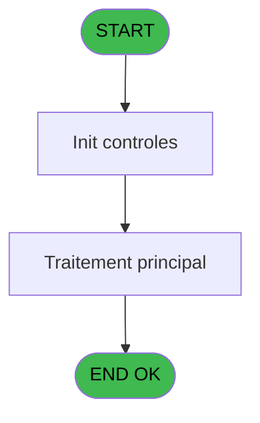

# EXB IDE 44 - Impression reçu vente

> **Analyse**: Phases 1-4 2026-02-03 10:47 -> 10:47 (18s) | Assemblage 10:47
> **Pipeline**: V7.2 Enrichi
> **Structure**: 4 onglets (Resume | Ecrans | Donnees | Connexions)

<!-- TAB:Resume -->

## 1. FICHE D'IDENTITE

| Attribut | Valeur |
|----------|--------|
| Projet | EXB |
| IDE Position | 44 |
| Nom Programme | Impression reçu vente |
| Fichier source | `Prg_44.xml` |
| Domaine metier | Ventes |
| Taches | 17 (0 ecrans visibles) |
| Tables modifiees | 0 |
| Programmes appeles | 0 |

## 2. DESCRIPTION FONCTIONNELLE

**Impression reçu vente** assure la gestion complete de ce processus, accessible depuis [Ventes_Excursions (IDE 40)](EXB-IDE-40.md).

Le flux de traitement s'organise en **2 blocs fonctionnels** :

- **Traitement** (16 taches) : traitements metier divers
- **Impression** (1 tache) : generation de tickets et documents

Detail : phases du traitement

#### Phase 1 : Traitement (16 taches)

- **44** - Veuillez patienter... **[[ECRAN]](#ecran-t1)**
- **44.2** - Impression
- **44.2.1** - Impression
- **44.2.1.1** - Participants
- **44.3** - Counter impression
- **44.3.1** - Impression
- **44.3.1.1** - Impression
- **44.3.1.2** - Impression
- **44.3.1.2.1** - Participants
- **44.4** - Impression
- **44.4.1** - Impression
- **44.4.1.1** - Participants
- **44.3.2** - Impression
- **44.3.2.1** - Impression
- **44.3.2.2** - Impression
- **44.3.2.2.1** - Participants

#### Phase 2 : Impression (1 tache)

- **44.1** - Choix imprimante

## 3. BLOCS FONCTIONNELS

### 3.1 Traitement (16 taches)

Traitements internes.

---

#### 44 - Veuillez patienter... [[ECRAN]](#ecran-t1)

**Role** : Tache d'orchestration : point d'entree du programme (16 sous-taches). Coordonne l'enchainement des traitements.
**Ecran** : 429 x 61 DLU (MDI) | [Voir mockup](#ecran-t1)

15 sous-taches directes

| Tache | Nom | Bloc |
|-------|-----|------|
| [44.2](#t3) | Impression | Traitement |
| [44.2.1](#t4) | Impression | Traitement |
| [44.2.1.1](#t5) | Participants | Traitement |
| [44.3](#t6) | Counter impression | Traitement |
| [44.3.1](#t7) | Impression | Traitement |
| [44.3.1.1](#t8) | Impression | Traitement |
| [44.3.1.2](#t9) | Impression | Traitement |
| [44.3.1.2.1](#t10) | Participants | Traitement |
| [44.4](#t13) | Impression | Traitement |
| [44.4.1](#t14) | Impression | Traitement |
| [44.4.1.1](#t15) | Participants | Traitement |
| [44.3.2](#t18) | Impression | Traitement |
| [44.3.2.1](#t19) | Impression | Traitement |
| [44.3.2.2](#t20) | Impression | Traitement |
| [44.3.2.2.1](#t21) | Participants | Traitement |

---

#### 44.2 - Impression

**Role** : Generation du document : Impression.

---

#### 44.2.1 - Impression

**Role** : Generation du document : Impression.

---

#### 44.2.1.1 - Participants

**Role** : Traitement : Participants.

---

#### 44.3 - Counter impression

**Role** : Generation du document : Counter impression.

---

#### 44.3.1 - Impression

**Role** : Generation du document : Impression.

---

#### 44.3.1.1 - Impression

**Role** : Generation du document : Impression.

---

#### 44.3.1.2 - Impression

**Role** : Generation du document : Impression.

---

#### 44.3.1.2.1 - Participants

**Role** : Traitement : Participants.

---

#### 44.4 - Impression

**Role** : Generation du document : Impression.

---

#### 44.4.1 - Impression

**Role** : Generation du document : Impression.

---

#### 44.4.1.1 - Participants

**Role** : Traitement : Participants.

---

#### 44.3.2 - Impression

**Role** : Generation du document : Impression.

---

#### 44.3.2.1 - Impression

**Role** : Generation du document : Impression.

---

#### 44.3.2.2 - Impression

**Role** : Generation du document : Impression.

---

#### 44.3.2.2.1 - Participants

**Role** : Traitement : Participants.

### 3.2 Impression (1 tache)

Generation des documents et tickets.

---

#### 44.1 - Choix imprimante

**Role** : Selection par l'operateur : Choix imprimante.
**Variables liees** : O (W0 choix imprimante)

## 5. REGLES METIER

*(Aucune regle metier identifiee)*

## 6. CONTEXTE

- **Appele par**: [Ventes_Excursions (IDE 40)](EXB-IDE-40.md)
- **Appelle**: 0 programmes | **Tables**: 8 (W:0 R:5 L:3) | **Taches**: 17 | **Expressions**: 7

<!-- TAB:Ecrans -->

## 8. ECRANS

*(Programme sans ecran visible)*

## 9. NAVIGATION

### 9.3 Structure hierarchique (17 taches)

| Position | Tache | Type | Dimensions | Bloc |
|----------|-------|------|------------|------|
| **44.1** | [**Veuillez patienter...** (44)](#t1) [mockup](#ecran-t1) | MDI | 429x61 | Traitement |
| 44.1.1 | [Impression (44.2)](#t3) | MDI | - | |
| 44.1.2 | [Impression (44.2.1)](#t4) | MDI | - | |
| 44.1.3 | [Participants (44.2.1.1)](#t5) | MDI | - | |
| 44.1.4 | [Counter impression (44.3)](#t6) | MDI | - | |
| 44.1.5 | [Impression (44.3.1)](#t7) | MDI | - | |
| 44.1.6 | [Impression (44.3.1.1)](#t8) | MDI | - | |
| 44.1.7 | [Impression (44.3.1.2)](#t9) | MDI | - | |
| 44.1.8 | [Participants (44.3.1.2.1)](#t10) | MDI | - | |
| 44.1.9 | [Impression (44.4)](#t13) | MDI | - | |
| 44.1.10 | [Impression (44.4.1)](#t14) | MDI | - | |
| 44.1.11 | [Participants (44.4.1.1)](#t15) | MDI | - | |
| 44.1.12 | [Impression (44.3.2)](#t18) | MDI | - | |
| 44.1.13 | [Impression (44.3.2.1)](#t19) | MDI | - | |
| 44.1.14 | [Impression (44.3.2.2)](#t20) | MDI | - | |
| 44.1.15 | [Participants (44.3.2.2.1)](#t21) | MDI | - | |
| **44.2** | [**Choix imprimante** (44.1)](#t2) | MDI | - | Impression |

### 9.4 Algorigramme

> **Legende**: Vert = START/END OK | Rouge = END KO | Bleu = Decisions
> *Algorigramme auto-genere. Utiliser `/algorigramme` pour une synthese metier detaillee.*

<!-- TAB:Donnees -->

## 10. TABLES

### Tables utilisees (8)

| ID | Nom | Description | Type | R | W | L | Usages |
|----|-----|-------------|------|---|---|---|--------|
| 24 | imprimante_______prn |  | DB | R |   |   | 1 |
| 277 | vendeur |  | DB |   |   | L | 4 |
| 296 | intermediaire____int |  | DB | R |   |   | 4 |
| 298 | participants_____par |  | DB | R |   |   | 4 |
| 300 | excursions_______exc |  | DB |   |   | L | 6 |
| 302 | parametre_voutchers |  | DB |   |   | L | 6 |
| 307 | vente_option_veo | Donnees de ventes | DB | R |   |   | 2 |
| 309 | vente____________vep | Donnees de ventes | DB | R |   |   | 4 |

### Colonnes par table (1 / 5 tables avec colonnes identifiees)

Table 24 - imprimante_______prn (R) - 1 usages

| Lettre | Variable | Acces | Type |
|--------|----------|-------|------|
| O | W0 choix imprimante | R | Numeric |

Table 296 - intermediaire____int (R) - 4 usages

*Table utilisee uniquement en Link ou aucune colonne Real identifiee dans le DataView.*

Table 298 - participants_____par (R) - 4 usages

*Table utilisee uniquement en Link ou aucune colonne Real identifiee dans le DataView.*

Table 307 - vente_option_veo (R) - 2 usages

*Table utilisee uniquement en Link ou aucune colonne Real identifiee dans le DataView.*

Table 309 - vente____________vep (R) - 4 usages

*Table utilisee uniquement en Link ou aucune colonne Real identifiee dans le DataView.*

## 11. VARIABLES

### 11.1 Parametres entrants (9)

Variables recues du programme appelant ([Ventes_Excursions (IDE 40)](EXB-IDE-40.md)).

| Lettre | Nom | Type | Usage dans |
|--------|-----|------|-----------|
| A | P0 nom village | Alpha | - |
| B | P0 masque montant | Alpha | - |
| C | P0 Nom | Alpha | - |
| D | P0 prenom | Alpha | - |
| E | P0 date | Date | - |
| F | P0 user | Alpha | - |
| G | P0 moyen paiement | Alpha | - |
| H | P0 flag annulation | Alpha | - |
| N | P0 Langue | Alpha | - |

### 11.2 Variables de travail (2)

Variables internes au programme.

| Lettre | Nom | Type | Usage dans |
|--------|-----|------|-----------|
| O | W0 choix imprimante | Numeric | [44.1](#t2) |
| P | W0 nom fichier ascii | Alpha | - |

### 11.3 Autres (5)

Variables diverses.

| Lettre | Nom | Type | Usage dans |
|--------|-----|------|-----------|
| I | P0_Type | Alpha | - |
| J | P0_Code | Numeric | - |
| K | P0_N° | Numeric | - |
| L | P0_Chrono | Numeric | - |
| M | P0_global O/N | Alpha | - |

Toutes les 16 variables (liste complete)

| Cat | Lettre | Nom Variable | Type |
|-----|--------|--------------|------|
| P0 | **A** | P0 nom village | Alpha |
| P0 | **B** | P0 masque montant | Alpha |
| P0 | **C** | P0 Nom | Alpha |
| P0 | **D** | P0 prenom | Alpha |
| P0 | **E** | P0 date | Date |
| P0 | **F** | P0 user | Alpha |
| P0 | **G** | P0 moyen paiement | Alpha |
| P0 | **H** | P0 flag annulation | Alpha |
| P0 | **N** | P0 Langue | Alpha |
| W0 | **O** | W0 choix imprimante | Numeric |
| W0 | **P** | W0 nom fichier ascii | Alpha |
| Autre | **I** | P0_Type | Alpha |
| Autre | **J** | P0_Code | Numeric |
| Autre | **K** | P0_N° | Numeric |
| Autre | **L** | P0_Chrono | Numeric |
| Autre | **M** | P0_global O/N | Alpha |

## 12. EXPRESSIONS

**7 / 7 expressions decodees (100%)**

### 12.1 Repartition par type

| Type | Expressions | Regles |
|------|-------------|--------|
| CONSTANTE | 2 | 0 |
| CONDITION | 2 | 0 |
| NEGATION | 1 | 0 |
| REFERENCE_VG | 1 | 0 |
| CAST_LOGIQUE | 1 | 0 |

### 12.2 Expressions cles par type

#### CONSTANTE (2 expressions)

| Type | IDE | Expression | Regle |
|------|-----|------------|-------|
| CONSTANTE | 6 | `613` | - |
| CONSTANTE | 5 | `'EXB'` | - |

#### CONDITION (2 expressions)

| Type | IDE | Expression | Regle |
|------|-----|------------|-------|
| CONDITION | 2 | `W0 choix imprimante [O]>4` | - |
| CONDITION | 1 | `W0 choix imprimante [O]<5` | - |

#### NEGATION (1 expressions)

| Type | IDE | Expression | Regle |
|------|-----|------------|-------|
| NEGATION | 3 | `NOT VG5` | - |

#### REFERENCE_VG (1 expressions)

| Type | IDE | Expression | Regle |
|------|-----|------------|-------|
| REFERENCE_VG | 4 | `VG5` | - |

#### CAST_LOGIQUE (1 expressions)

| Type | IDE | Expression | Regle |
|------|-----|------------|-------|
| CAST_LOGIQUE | 7 | `'TRUE'LOG` | - |

<!-- TAB:Connexions -->

## 13. GRAPHE D'APPELS

### 13.1 Chaine depuis Main (Callers)

Main -> ... -> [Ventes_Excursions (IDE 40)](EXB-IDE-40.md) -> **Impression reçu vente (IDE 44)**

### 13.2 Callers

| IDE | Nom Programme | Nb Appels |
|-----|---------------|-----------|
| [40](EXB-IDE-40.md) | Ventes_Excursions | 4 |

### 13.3 Callees (programmes appeles)

### 13.4 Detail Callees avec contexte

| IDE | Nom Programme | Appels | Contexte |
|-----|---------------|--------|----------|
| - | (aucun) | - | - |

## 14. RECOMMANDATIONS MIGRATION

### 14.1 Profil du programme

| Metrique | Valeur | Impact migration |
|----------|--------|-----------------|
| Lignes de logique | 332 | Taille moyenne |
| Expressions | 7 | Peu de logique |
| Tables WRITE | 0 | Impact faible |
| Sous-programmes | 0 | Peu de dependances |
| Ecrans visibles | 0 | Ecran unique ou traitement batch |
| Code desactive | 0% (0 / 332) | Code sain |
| Regles metier | 0 | Pas de regle identifiee |

### 14.2 Plan de migration par bloc

#### Traitement (16 taches: 1 ecran, 15 traitements)

- **Strategie** : Orchestrateur avec 1 ecrans (Razor/React) et 15 traitements backend (services).
- Les ecrans deviennent des composants UI, les traitements invisibles deviennent des services injectables.
- Decomposer les taches en services unitaires testables.

#### Impression (1 tache: 0 ecran, 1 traitement)

- **Strategie** : Templates HTML -> PDF via wkhtmltopdf ou Puppeteer.
- `PrintService` injectable avec choix imprimante

### 14.3 Dependances critiques

| Dependance | Type | Appels | Impact |
|------------|------|--------|--------|

---
*Spec DETAILED generee par Pipeline V7.2 - 2026-02-03 10:47*
