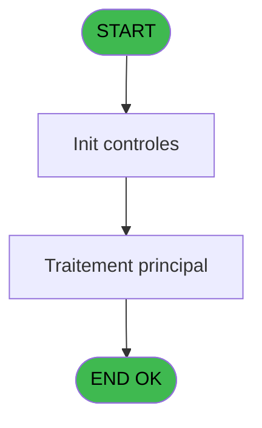
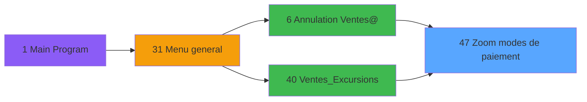
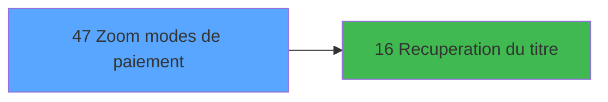

# EXB IDE 47 - Zoom modes de paiement

> **Analyse**: Phases 1-4 2026-02-03 10:48 -> 10:49 (16s) | Assemblage 10:49
> **Pipeline**: V7.2 Enrichi
> **Structure**: 4 onglets (Resume | Ecrans | Donnees | Connexions)

<!-- TAB:Resume -->

## 1. FICHE D'IDENTITE

| Attribut | Valeur |
|----------|--------|
| Projet | EXB |
| IDE Position | 47 |
| Nom Programme | Zoom modes de paiement |
| Fichier source | `Prg_47.xml` |
| Domaine metier | Consultation |
| Taches | 1 (1 ecrans visibles) |
| Tables modifiees | 0 |
| Programmes appeles | 1 |

## 2. DESCRIPTION FONCTIONNELLE

**Zoom modes de paiement** assure la gestion complete de ce processus, accessible depuis [Ventes_Excursions (IDE 40)](EXB-IDE-40.md), [ Annulation Ventes@ (IDE 6)](EXB-IDE-6.md).

Le flux de traitement s'organise en **1 blocs fonctionnels** :

- **Reglement** (1 tache) : gestion des moyens de paiement et reglements

## 3. BLOCS FONCTIONNELS

### 3.1 Reglement (1 tache)

Gestion des moyens de paiement : 1 tache de reglement.

---

#### 47 - Zoom modes de paiement [[ECRAN]](#ecran-t1)

**Role** : Gestion du reglement : Zoom modes de paiement.
**Ecran** : 368 x 152 DLU (MDI) | [Voir mockup](#ecran-t1)
**Variables liees** : D (< mode de paiement), E (> zoom vente et od)

## 5. REGLES METIER

*(Aucune regle metier identifiee)*

## 6. CONTEXTE

- **Appele par**: [Ventes_Excursions (IDE 40)](EXB-IDE-40.md), [ Annulation Ventes@ (IDE 6)](EXB-IDE-6.md)
- **Appelle**: 1 programmes | **Tables**: 2 (W:0 R:1 L:1) | **Taches**: 1 | **Expressions**: 12

<!-- TAB:Ecrans -->

## 8. ECRANS

### 8.1 Forms visibles (1 / 1)

| # | Position | Tache | Nom | Type | Largeur | Hauteur | Bloc |
|---|----------|-------|-----|------|---------|---------|------|
| 1 | 47 | 47 | Zoom modes de paiement | MDI | 368 | 152 | Reglement |

### 8.2 Mockups Ecrans

---

#### 47 - Zoom modes de paiement
**Tache** : [47](#t1) | **Type** : MDI | **Dimensions** : 368 x 152 DLU
**Bloc** : Reglement | **Titre IDE** : Zoom modes de paiement

<!-- FORM-DATA:
{
    "width":  368,
    "vFactor":  8,
    "type":  "MDI",
    "hFactor":  8,
    "controls":  [
                     {
                         "x":  81,
                         "type":  "table",
                         "var":  "",
                         "name":  "",
                         "titleH":  12,
                         "color":  "196",
                         "w":  205,
                         "y":  4,
                         "fmt":  "",
                         "parent":  null,
                         "text":  "",
                         "rowH":  13,
                         "h":  102,
                         "cols":  [
                                      {
                                          "title":  "Mode de paiement",
                                          "layer":  1,
                                          "w":  179
                                      }
                                  ],
                         "rows":  1
                     },
                     {
                         "x":  0,
                         "type":  "label",
                         "var":  "",
                         "y":  133,
                         "w":  367,
                         "fmt":  "",
                         "name":  "",
                         "h":  19,
                         "color":  "",
                         "text":  "",
                         "parent":  null
                     },
                     {
                         "x":  142,
                         "type":  "edit",
                         "var":  "",
                         "y":  19,
                         "w":  53,
                         "fmt":  "",
                         "name":  "",
                         "h":  8,
                         "color":  "177",
                         "text":  "",
                         "parent":  1
                     },
                     {
                         "x":  216,
                         "type":  "button",
                         "var":  "",
                         "y":  136,
                         "w":  144,
                         "fmt":  "",
                         "name":  "",
                         "h":  14,
                         "color":  "",
                         "text":  "",
                         "parent":  null
                     },
                     {
                         "x":  6,
                         "type":  "button",
                         "var":  "",
                         "y":  135,
                         "w":  144,
                         "fmt":  "",
                         "name":  "",
                         "h":  14,
                         "color":  "",
                         "text":  "",
                         "parent":  null
                     },
                     {
                         "x":  155,
                         "type":  "image",
                         "var":  "",
                         "y":  113,
                         "w":  58,
                         "fmt":  "",
                         "name":  "",
                         "h":  18,
                         "color":  "",
                         "text":  "",
                         "parent":  null
                     }
                 ],
    "taskId":  "47",
    "height":  152
}
-->

<strong>Champs : 1 champs</strong>

| Pos (x,y) | Nom | Variable | Type |
|-----------|-----|----------|------|
| 142,19 | (sans nom) | - | edit |

<strong>Boutons : 2 boutons</strong>

| Bouton | Pos (x,y) | Action |
|--------|-----------|--------|
| (sans nom) | 216,136 | Action declenchee |
| (sans nom) | 6,135 | Action declenchee |

## 9. NAVIGATION

Ecran unique: **Zoom modes de paiement**

### 9.3 Structure hierarchique (1 tache)

| Position | Tache | Type | Dimensions | Bloc |
|----------|-------|------|------------|------|
| **47.1** | [**Zoom modes de paiement** (47)](#t1) [mockup](#ecran-t1) | MDI | 368x152 | Reglement |

### 9.4 Algorigramme

> **Legende**: Vert = START/END OK | Rouge = END KO | Bleu = Decisions
> *Algorigramme auto-genere. Utiliser `/algorigramme` pour une synthese metier detaillee.*

<!-- TAB:Donnees -->

## 10. TABLES

### Tables utilisees (2)

| ID | Nom | Description | Type | R | W | L | Usages |
|----|-----|-------------|------|---|---|---|--------|
| 50 | moyens_reglement_mor | Reglements / paiements | DB | R |   |   | 1 |
| 89 | moyen_paiement___mop |  | DB |   |   | L | 1 |

### Colonnes par table (2 / 1 tables avec colonnes identifiees)

Table 50 - moyens_reglement_mor (R) - 1 usages

| Lettre | Variable | Acces | Type |
|--------|----------|-------|------|
| A | > societe | R | Alpha |
| B | > devise | R | Alpha |
| C | > type d'operation | R | Alpha |
| D | < mode de paiement | R | Alpha |
| E | > zoom vente et od | R | Alpha |
| F | > compte garanti | R | Logical |
| G | > solde compte | R | Numeric |
| H | > article derniere minute | R | Logical |
| I | v. passage | R | Logical |
| J | v. titre | R | Alpha |
| K | bouton quitter | R | Alpha |
| L | bouton selectionner | R | Alpha |

## 11. VARIABLES

### 11.1 Variables de session (2)

Variables persistantes pendant toute la session.

| Lettre | Nom | Type | Usage dans |
|--------|-----|------|-----------|
| I | v. passage | Logical | 1x session |
| J | v. titre | Alpha | - |

### 11.2 Autres (10)

Variables diverses.

| Lettre | Nom | Type | Usage dans |
|--------|-----|------|-----------|
| A | > societe | Alpha | 1x refs |
| B | > devise | Alpha | 1x refs |
| C | > type d'operation | Alpha | 1x refs |
| D | < mode de paiement | Alpha | - |
| E | > zoom vente et od | Alpha | - |
| F | > compte garanti | Logical | - |
| G | > solde compte | Numeric | - |
| H | > article derniere minute | Logical | - |
| K | bouton quitter | Alpha | - |
| L | bouton selectionner | Alpha | - |

## 12. EXPRESSIONS

**12 / 12 expressions decodees (100%)**

### 12.1 Repartition par type

| Type | Expressions | Regles |
|------|-------------|--------|
| CONSTANTE | 5 | 0 |
| CONDITION | 4 | 0 |
| OTHER | 1 | 0 |
| CAST_LOGIQUE | 1 | 0 |
| NEGATION | 1 | 0 |

### 12.2 Expressions cles par type

#### CONSTANTE (5 expressions)

| Type | IDE | Expression | Regle |
|------|-----|------------|-------|
| CONSTANTE | 7 | `'O'` | - |
| CONSTANTE | 12 | `'Zoom Modes de paiement'` | - |
| CONSTANTE | 3 | `61` | - |
| CONSTANTE | 1 | `'&Quitter'` | - |
| CONSTANTE | 2 | `'&Selectionner'` | - |

#### CONDITION (4 expressions)

| Type | IDE | Expression | Regle |
|------|-----|------------|-------|
| CONDITION | 6 | `> type d'operation [C]` | - |
| CONDITION | 11 | `[T]='$CARD' OR [T]='OD'` | - |
| CONDITION | 4 | `> societe [A]` | - |
| CONDITION | 5 | `> devise [B]` | - |

#### OTHER (1 expressions)

| Type | IDE | Expression | Regle |
|------|-----|------------|-------|
| OTHER | 8 | `[N]` | - |

#### CAST_LOGIQUE (1 expressions)

| Type | IDE | Expression | Regle |
|------|-----|------------|-------|
| CAST_LOGIQUE | 9 | `'TRUE'LOG` | - |

#### NEGATION (1 expressions)

| Type | IDE | Expression | Regle |
|------|-----|------------|-------|
| NEGATION | 10 | `NOT (v. passage [I])` | - |

<!-- TAB:Connexions -->

## 13. GRAPHE D'APPELS

### 13.1 Chaine depuis Main (Callers)

Main -> ... -> [Ventes_Excursions (IDE 40)](EXB-IDE-40.md) -> **Zoom modes de paiement (IDE 47)**

Main -> ... -> [ Annulation Ventes@ (IDE 6)](EXB-IDE-6.md) -> **Zoom modes de paiement (IDE 47)**

### 13.2 Callers

| IDE | Nom Programme | Nb Appels |
|-----|---------------|-----------|
| [40](EXB-IDE-40.md) | Ventes_Excursions | 4 |
| [6](EXB-IDE-6.md) |  Annulation Ventes@ | 2 |

### 13.3 Callees (programmes appeles)

### 13.4 Detail Callees avec contexte

| IDE | Nom Programme | Appels | Contexte |
|-----|---------------|--------|----------|
| [16](EXB-IDE-16.md) | Recuperation du titre | 1 | Recuperation donnees |

## 14. RECOMMANDATIONS MIGRATION

### 14.1 Profil du programme

| Metrique | Valeur | Impact migration |
|----------|--------|-----------------|
| Lignes de logique | 37 | Programme compact |
| Expressions | 12 | Peu de logique |
| Tables WRITE | 0 | Impact faible |
| Sous-programmes | 1 | Peu de dependances |
| Ecrans visibles | 1 | Ecran unique ou traitement batch |
| Code desactive | 0% (0 / 37) | Code sain |
| Regles metier | 0 | Pas de regle identifiee |

### 14.2 Plan de migration par bloc

#### Reglement (1 tache: 1 ecran, 0 traitement)

- **Strategie** : Service `IReglementService` avec pattern Strategy par mode de paiement.
- Integration TPE si applicable

### 14.3 Dependances critiques

| Dependance | Type | Appels | Impact |
|------------|------|--------|--------|
| [Recuperation du titre (IDE 16)](EXB-IDE-16.md) | Sous-programme | 1x | Normale - Recuperation donnees |

---
*Spec DETAILED generee par Pipeline V7.2 - 2026-02-03 10:49*
