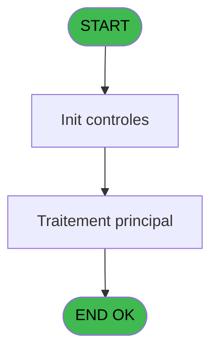
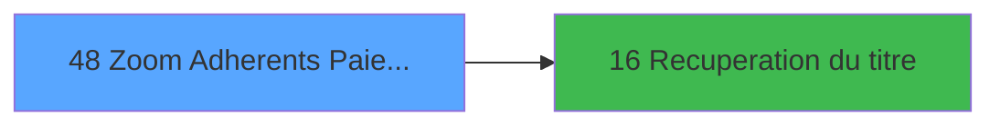

# EXB IDE 48 - Zoom Adherents Paiement

> **Analyse**: Phases 1-4 2026-02-03 10:49 -> 10:49 (16s) | Assemblage 10:49
> **Pipeline**: V7.2 Enrichi
> **Structure**: 4 onglets (Resume | Ecrans | Donnees | Connexions)

<!-- TAB:Resume -->

## 1. FICHE D'IDENTITE

| Attribut | Valeur |
|----------|--------|
| Projet | EXB |
| IDE Position | 48 |
| Nom Programme | Zoom Adherents Paiement |
| Fichier source | `Prg_48.xml` |
| Domaine metier | Consultation |
| Taches | 1 (1 ecrans visibles) |
| Tables modifiees | 0 |
| Programmes appeles | 1 |

## 2. DESCRIPTION FONCTIONNELLE

**Zoom Adherents Paiement** assure la gestion complete de ce processus, accessible depuis [Ventes_Excursions (IDE 40)](EXB-IDE-40.md).

Le flux de traitement s'organise en **1 blocs fonctionnels** :

- **Consultation** (1 tache) : ecrans de recherche, selection et consultation

**Logique metier** : 1 regles identifiees couvrant conditions metier.

## 3. BLOCS FONCTIONNELS

### 3.1 Consultation (1 tache)

Ecrans de recherche et consultation.

---

#### 48 - Zoom Adherents [[ECRAN]](#ecran-t1)

**Role** : Selection par l'operateur : Zoom Adherents.
**Ecran** : 690 x 158 DLU (MDI) | [Voir mockup](#ecran-t1)

## 5. REGLES METIER

1 regles identifiees:

### Autres (1 regles)

#### [RM-001] Si [L]='GO' alors 174 sinon IF ([U],[AC],110))

| Element | Detail |
|---------|--------|
| **Condition** | `[L]='GO'` |
| **Si vrai** | 174 |
| **Si faux** | IF ([U],[AC],110)) |
| **Expression source** | Expression 12 : `IF ([L]='GO',174,IF ([U],[AC],110))` |
| **Exemple** | Si [L]='GO' → 174. Sinon → IF ([U],[AC],110)) |

## 6. CONTEXTE

- **Appele par**: [Ventes_Excursions (IDE 40)](EXB-IDE-40.md)
- **Appelle**: 1 programmes | **Tables**: 4 (W:0 R:1 L:3) | **Taches**: 1 | **Expressions**: 15

<!-- TAB:Ecrans -->

## 8. ECRANS

### 8.1 Forms visibles (1 / 1)

| # | Position | Tache | Nom | Type | Largeur | Hauteur | Bloc |
|---|----------|-------|-----|------|---------|---------|------|
| 1 | 48 | 48 | Zoom Adherents | MDI | 690 | 158 | Consultation |

### 8.2 Mockups Ecrans

---

#### 48 - Zoom Adherents
**Tache** : [48](#t1) | **Type** : MDI | **Dimensions** : 690 x 158 DLU
**Bloc** : Consultation | **Titre IDE** : Zoom Adherents

<!-- FORM-DATA:
{
    "width":  690,
    "vFactor":  8,
    "type":  "MDI",
    "hFactor":  8,
    "controls":  [
                     {
                         "x":  21,
                         "type":  "table",
                         "var":  "",
                         "name":  "",
                         "titleH":  12,
                         "color":  "110",
                         "w":  646,
                         "y":  5,
                         "fmt":  "",
                         "parent":  null,
                         "text":  "",
                         "rowH":  13,
                         "h":  93,
                         "cols":  [
                                      {
                                          "title":  "Nom",
                                          "layer":  1,
                                          "w":  356
                                      },
                                      {
                                          "title":  "Prénom",
                                          "layer":  2,
                                          "w":  145
                                      },
                                      {
                                          "title":  "Logement",
                                          "layer":  3,
                                          "w":  111
                                      }
                                  ],
                         "rows":  3
                     },
                     {
                         "x":  2,
                         "type":  "label",
                         "var":  "",
                         "y":  132,
                         "w":  684,
                         "fmt":  "",
                         "name":  "",
                         "h":  22,
                         "color":  "",
                         "text":  "",
                         "parent":  null
                     },
                     {
                         "x":  30,
                         "type":  "edit",
                         "var":  "",
                         "y":  20,
                         "w":  344,
                         "fmt":  "",
                         "name":  "GMR nom (30)",
                         "h":  8,
                         "color":  "110",
                         "text":  "",
                         "parent":  1
                     },
                     {
                         "x":  387,
                         "type":  "edit",
                         "var":  "",
                         "y":  20,
                         "w":  98,
                         "fmt":  "",
                         "name":  "",
                         "h":  8,
                         "color":  "110",
                         "text":  "",
                         "parent":  1
                     },
                     {
                         "x":  555,
                         "type":  "edit",
                         "var":  "",
                         "y":  20,
                         "w":  75,
                         "fmt":  "",
                         "name":  "",
                         "h":  8,
                         "color":  "110",
                         "text":  "",
                         "parent":  1
                     },
                     {
                         "x":  24,
                         "type":  "edit",
                         "var":  "",
                         "y":  103,
                         "w":  23,
                         "fmt":  "",
                         "name":  "",
                         "h":  8,
                         "color":  "2",
                         "text":  "",
                         "parent":  null
                     },
                     {
                         "x":  63,
                         "type":  "edit",
                         "var":  "",
                         "y":  103,
                         "w":  200,
                         "fmt":  "",
                         "name":  "",
                         "h":  8,
                         "color":  "2",
                         "text":  "",
                         "parent":  null
                     },
                     {
                         "x":  115,
                         "type":  "button",
                         "var":  "",
                         "y":  134,
                         "w":  144,
                         "fmt":  "\u0026Selectionner",
                         "name":  "",
                         "h":  18,
                         "color":  "",
                         "text":  "",
                         "parent":  null
                     },
                     {
                         "x":  427,
                         "type":  "button",
                         "var":  "",
                         "y":  134,
                         "w":  144,
                         "fmt":  "A\u0026bandonner",
                         "name":  "",
                         "h":  18,
                         "color":  "",
                         "text":  "",
                         "parent":  null
                     },
                     {
                         "x":  314,
                         "type":  "image",
                         "var":  "",
                         "y":  103,
                         "w":  58,
                         "fmt":  "",
                         "name":  "",
                         "h":  18,
                         "color":  "",
                         "text":  "",
                         "parent":  null
                     }
                 ],
    "taskId":  "48",
    "height":  158
}
-->

<strong>Champs : 5 champs</strong>

| Pos (x,y) | Nom | Variable | Type |
|-----------|-----|----------|------|
| 30,20 | GMR nom (30) | - | edit |
| 387,20 | (sans nom) | - | edit |
| 555,20 | (sans nom) | - | edit |
| 24,103 | (sans nom) | - | edit |
| 63,103 | (sans nom) | - | edit |

<strong>Boutons : 2 boutons</strong>

| Bouton | Pos (x,y) | Action |
|--------|-----------|--------|
| Selectionner | 115,134 | Ouvre la selection |
| Abandonner | 427,134 | Annule et retour au menu |

## 9. NAVIGATION

Ecran unique: **Zoom Adherents**

### 9.3 Structure hierarchique (1 tache)

| Position | Tache | Type | Dimensions | Bloc |
|----------|-------|------|------------|------|
| **48.1** | [**Zoom Adherents** (48)](#t1) [mockup](#ecran-t1) | MDI | 690x158 | Consultation |

### 9.4 Algorigramme

> **Legende**: Vert = START/END OK | Rouge = END KO | Bleu = Decisions
> *Algorigramme auto-genere. Utiliser `/algorigramme` pour une synthese metier detaillee.*

<!-- TAB:Donnees -->

## 10. TABLES

### Tables utilisees (4)

| ID | Nom | Description | Type | R | W | L | Usages |
|----|-----|-------------|------|---|---|---|--------|
| 30 | gm-recherche_____gmr | Index de recherche | DB | R |   |   | 1 |
| 34 | hebergement______heb | Hebergement (chambres) | DB |   |   | L | 1 |
| 358 | import_mod |  | DB |   |   | L | 1 |
| 738 | pv_selling_unit |  | DB |   |   | L | 1 |

### Colonnes par table (1 / 1 tables avec colonnes identifiees)

Table 30 - gm-recherche_____gmr (R) - 1 usages

| Lettre | Variable | Acces | Type |
|--------|----------|-------|------|
| A | W_Nom | R | Alpha |
| B | W_Prenom | R | Alpha |
| C | W_Societe | R | Alpha |
| D | W_Code GM | R | Numeric |
| E | W_Filiation | R | Numeric |
| F | V.titre | R | Alpha |
| G | Existe Millesia | R | Logical |

## 11. VARIABLES

### 11.1 Variables de session (1)

Variables persistantes pendant toute la session.

| Lettre | Nom | Type | Usage dans |
|--------|-----|------|-----------|
| F | V.titre | Alpha | - |

### 11.2 Autres (6)

Variables diverses.

| Lettre | Nom | Type | Usage dans |
|--------|-----|------|-----------|
| A | W_Nom | Alpha | 1x refs |
| B | W_Prenom | Alpha | - |
| C | W_Societe | Alpha | - |
| D | W_Code GM | Numeric | - |
| E | W_Filiation | Numeric | - |
| G | Existe Millesia | Logical | 1x refs |

## 12. EXPRESSIONS

**15 / 15 expressions decodees (100%)**

### 12.1 Repartition par type

| Type | Expressions | Regles |
|------|-------------|--------|
| CONDITION | 2 | 5 |
| CONSTANTE | 3 | 0 |
| DATE | 1 | 0 |
| OTHER | 8 | 0 |
| STRING | 1 | 0 |

### 12.2 Expressions cles par type

#### CONDITION (2 expressions)

| Type | IDE | Expression | Regle |
|------|-----|------------|-------|
| CONDITION | 12 | `IF ([L]='GO',174,IF ([U],[AC],110))` | [RM-001](#rm-RM-001) |
| CONDITION | 13 | `IF ([L]='GO',1,IF ([U],[AC],1))` | - |

#### CONSTANTE (3 expressions)

| Type | IDE | Expression | Regle |
|------|-----|------------|-------|
| CONSTANTE | 11 | `'H'` | - |
| CONSTANTE | 3 | `'O'` | - |
| CONSTANTE | 2 | `42` | - |

#### DATE (1 expressions)

| Type | IDE | Expression | Regle |
|------|-----|------------|-------|
| DATE | 10 | `Date ()` | - |

#### OTHER (8 expressions)

| Type | IDE | Expression | Regle |
|------|-----|------------|-------|
| OTHER | 9 | `[K]` | - |
| OTHER | 8 | `[J]` | - |
| OTHER | 15 | `[Y]` | - |
| OTHER | 14 | `GetParam ('CODELANGUE')` | - |
| OTHER | 5 | `Existe Millesia [G]` | - |
| ... | | *+3 autres* | |

#### STRING (1 expressions)

| Type | IDE | Expression | Regle |
|------|-----|------------|-------|
| STRING | 1 | `Trim ([T])` | - |

<!-- TAB:Connexions -->

## 13. GRAPHE D'APPELS

### 13.1 Chaine depuis Main (Callers)

Main -> ... -> [Ventes_Excursions (IDE 40)](EXB-IDE-40.md) -> **Zoom Adherents Paiement (IDE 48)**

### 13.2 Callers

| IDE | Nom Programme | Nb Appels |
|-----|---------------|-----------|
| [40](EXB-IDE-40.md) | Ventes_Excursions | 8 |

### 13.3 Callees (programmes appeles)

### 13.4 Detail Callees avec contexte

| IDE | Nom Programme | Appels | Contexte |
|-----|---------------|--------|----------|
| [16](EXB-IDE-16.md) | Recuperation du titre | 1 | Recuperation donnees |

## 14. RECOMMANDATIONS MIGRATION

### 14.1 Profil du programme

| Metrique | Valeur | Impact migration |
|----------|--------|-----------------|
| Lignes de logique | 49 | Programme compact |
| Expressions | 15 | Peu de logique |
| Tables WRITE | 0 | Impact faible |
| Sous-programmes | 1 | Peu de dependances |
| Ecrans visibles | 1 | Ecran unique ou traitement batch |
| Code desactive | 0% (0 / 49) | Code sain |
| Regles metier | 1 | Quelques regles a preserver |

### 14.2 Plan de migration par bloc

#### Consultation (1 tache: 1 ecran, 0 traitement)

- **Strategie** : Composants de recherche/selection en modales.
- 1 ecran : Zoom Adherents

### 14.3 Dependances critiques

| Dependance | Type | Appels | Impact |
|------------|------|--------|--------|
| [Recuperation du titre (IDE 16)](EXB-IDE-16.md) | Sous-programme | 1x | Normale - Recuperation donnees |

---
*Spec DETAILED generee par Pipeline V7.2 - 2026-02-03 10:49*
