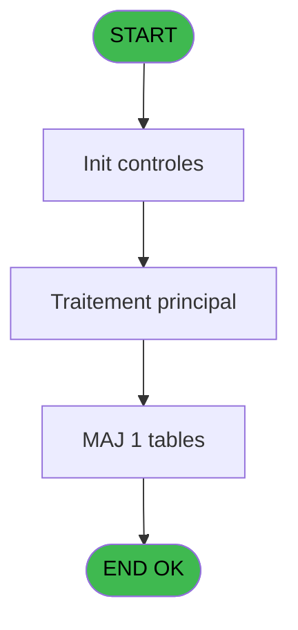

# EXB IDE 5 - Imp reçu annulation

> **Analyse**: Phases 1-4 2026-02-03 10:29 -> 10:30 (23s) | Assemblage 10:30
> **Pipeline**: V7.2 Enrichi
> **Structure**: 4 onglets (Resume | Ecrans | Donnees | Connexions)

<!-- TAB:Resume -->

## 1. FICHE D'IDENTITE

| Attribut | Valeur |
|----------|--------|
| Projet | EXB |
| IDE Position | 5 |
| Nom Programme | Imp reçu annulation |
| Fichier source | `Prg_5.xml` |
| Domaine metier | General |
| Taches | 7 (0 ecrans visibles) |
| Tables modifiees | 1 |
| Programmes appeles | 0 |

## 2. DESCRIPTION FONCTIONNELLE

**Imp reçu annulation** assure la gestion complete de ce processus, accessible depuis [ Annulation Ventes@ (IDE 6)](EXB-IDE-6.md).

Le flux de traitement s'organise en **2 blocs fonctionnels** :

- **Traitement** (6 taches) : traitements metier divers
- **Impression** (1 tache) : generation de tickets et documents

**Donnees modifiees** : 1 tables en ecriture (gm-recherche_____gmr).

Detail : phases du traitement

#### Phase 1 : Traitement (6 taches)

- **5** - Veuillez patienter... **[[ECRAN]](#ecran-t1)**
- **5.2** - Impression
- **5.2.1** - Participants
- **5.3** - Counter impression
- **5.3.1** - Impression
- **5.3.1.1** - Participants

#### Phase 2 : Impression (1 tache)

- **5.1** - Choix imprimante v1

#### Tables impactees

| Table | Operations | Role metier |
|-------|-----------|-------------|
| gm-recherche_____gmr | **W** (1 usages) | Index de recherche |

## 3. BLOCS FONCTIONNELS

### 3.1 Traitement (6 taches)

Traitements internes.

---

#### 5 - Veuillez patienter... [[ECRAN]](#ecran-t1)

**Role** : Tache d'orchestration : point d'entree du programme (6 sous-taches). Coordonne l'enchainement des traitements.
**Ecran** : 427 x 62 DLU (MDI) | [Voir mockup](#ecran-t1)

5 sous-taches directes

| Tache | Nom | Bloc |
|-------|-----|------|
| [5.2](#t3) | Impression | Traitement |
| [5.2.1](#t4) | Participants | Traitement |
| [5.3](#t5) | Counter impression | Traitement |
| [5.3.1](#t6) | Impression | Traitement |
| [5.3.1.1](#t7) | Participants | Traitement |

---

#### 5.2 - Impression

**Role** : Generation du document : Impression.

---

#### 5.2.1 - Participants

**Role** : Traitement : Participants.

---

#### 5.3 - Counter impression

**Role** : Generation du document : Counter impression.

---

#### 5.3.1 - Impression

**Role** : Generation du document : Impression.

---

#### 5.3.1.1 - Participants

**Role** : Traitement : Participants.

### 3.2 Impression (1 tache)

Generation des documents et tickets.

---

#### 5.1 - Choix imprimante v1

**Role** : Selection par l'operateur : Choix imprimante v1.
**Variables liees** : E (W0 choix imprimante)

## 5. REGLES METIER

*(Aucune regle metier identifiee)*

## 6. CONTEXTE

- **Appele par**: [ Annulation Ventes@ (IDE 6)](EXB-IDE-6.md)
- **Appelle**: 0 programmes | **Tables**: 6 (W:1 R:3 L:3) | **Taches**: 7 | **Expressions**: 9

<!-- TAB:Ecrans -->

## 8. ECRANS

*(Programme sans ecran visible)*

## 9. NAVIGATION

### 9.3 Structure hierarchique (7 taches)

| Position | Tache | Type | Dimensions | Bloc |
|----------|-------|------|------------|------|
| **5.1** | [**Veuillez patienter...** (5)](#t1) [mockup](#ecran-t1) | MDI | 427x62 | Traitement |
| 5.1.1 | [Impression (5.2)](#t3) | MDI | - | |
| 5.1.2 | [Participants (5.2.1)](#t4) | MDI | - | |
| 5.1.3 | [Counter impression (5.3)](#t5) | MDI | - | |
| 5.1.4 | [Impression (5.3.1)](#t6) | MDI | - | |
| 5.1.5 | [Participants (5.3.1.1)](#t7) | MDI | - | |
| **5.2** | [**Choix imprimante v1** (5.1)](#t2) | MDI | - | Impression |

### 9.4 Algorigramme

> **Legende**: Vert = START/END OK | Rouge = END KO | Bleu = Decisions
> *Algorigramme auto-genere. Utiliser `/algorigramme` pour une synthese metier detaillee.*

<!-- TAB:Donnees -->

## 10. TABLES

### Tables utilisees (6)

| ID | Nom | Description | Type | R | W | L | Usages |
|----|-----|-------------|------|---|---|---|--------|
| 24 | imprimante_______prn |  | DB | R |   |   | 1 |
| 30 | gm-recherche_____gmr | Index de recherche | DB |   | **W** |   | 1 |
| 298 | participants_____par |  | DB | R |   |   | 2 |
| 300 | excursions_______exc |  | DB |   |   | L | 2 |
| 302 | parametre_voutchers |  | DB |   |   | L | 2 |
| 309 | vente____________vep | Donnees de ventes | DB | R |   | L | 2 |

### Colonnes par table (2 / 4 tables avec colonnes identifiees)

Table 24 - imprimante_______prn (R) - 1 usages

| Lettre | Variable | Acces | Type |
|--------|----------|-------|------|
| E | W0 choix imprimante | R | Numeric |

Table 30 - gm-recherche_____gmr (**W**) - 1 usages

*Table utilisee uniquement en Link ou aucune colonne Real identifiee dans le DataView.*

Table 298 - participants_____par (R) - 2 usages

*Table utilisee uniquement en Link ou aucune colonne Real identifiee dans le DataView.*

Table 309 - vente____________vep (R/L) - 2 usages

| Lettre | Variable | Acces | Type |
|--------|----------|-------|------|
| C | P0 numero vente | R | Numeric |

## 11. VARIABLES

### 11.1 Parametres entrants (4)

Variables recues du programme appelant ([ Annulation Ventes@ (IDE 6)](EXB-IDE-6.md)).

| Lettre | Nom | Type | Usage dans |
|--------|-----|------|-----------|
| A | P0 nom village | Alpha | - |
| B | P0 masque montant | Alpha | - |
| C | P0 numero vente | Numeric | - |
| D | P0 frais annulation | Numeric | - |

### 11.2 Variables de travail (1)

Variables internes au programme.

| Lettre | Nom | Type | Usage dans |
|--------|-----|------|-----------|
| E | W0 choix imprimante | Numeric | [5.1](#t2) |

## 12. EXPRESSIONS

**9 / 9 expressions decodees (100%)**

### 12.1 Repartition par type

| Type | Expressions | Regles |
|------|-------------|--------|
| CONSTANTE | 2 | 0 |
| CONDITION | 2 | 0 |
| OTHER | 2 | 0 |
| NEGATION | 1 | 0 |
| REFERENCE_VG | 1 | 0 |
| CAST_LOGIQUE | 1 | 0 |

### 12.2 Expressions cles par type

#### CONSTANTE (2 expressions)

| Type | IDE | Expression | Regle |
|------|-----|------------|-------|
| CONSTANTE | 8 | `611` | - |
| CONSTANTE | 7 | `'EXB'` | - |

#### CONDITION (2 expressions)

| Type | IDE | Expression | Regle |
|------|-----|------------|-------|
| CONDITION | 2 | `W0 choix imprimante [E]>4` | - |
| CONDITION | 1 | `W0 choix imprimante [E]<5` | - |

#### OTHER (2 expressions)

| Type | IDE | Expression | Regle |
|------|-----|------------|-------|
| OTHER | 4 | `SetCrsr (1)` | - |
| OTHER | 3 | `SetCrsr (2)` | - |

#### NEGATION (1 expressions)

| Type | IDE | Expression | Regle |
|------|-----|------------|-------|
| NEGATION | 5 | `NOT VG5` | - |

#### REFERENCE_VG (1 expressions)

| Type | IDE | Expression | Regle |
|------|-----|------------|-------|
| REFERENCE_VG | 6 | `VG5` | - |

#### CAST_LOGIQUE (1 expressions)

| Type | IDE | Expression | Regle |
|------|-----|------------|-------|
| CAST_LOGIQUE | 9 | `'TRUE'LOG` | - |

<!-- TAB:Connexions -->

## 13. GRAPHE D'APPELS

### 13.1 Chaine depuis Main (Callers)

Main -> ... -> [ Annulation Ventes@ (IDE 6)](EXB-IDE-6.md) -> **Imp reçu annulation (IDE 5)**

### 13.2 Callers

| IDE | Nom Programme | Nb Appels |
|-----|---------------|-----------|
| [6](EXB-IDE-6.md) |  Annulation Ventes@ | 3 |

### 13.3 Callees (programmes appeles)

### 13.4 Detail Callees avec contexte

| IDE | Nom Programme | Appels | Contexte |
|-----|---------------|--------|----------|
| - | (aucun) | - | - |

## 14. RECOMMANDATIONS MIGRATION

### 14.1 Profil du programme

| Metrique | Valeur | Impact migration |
|----------|--------|-----------------|
| Lignes de logique | 129 | Programme compact |
| Expressions | 9 | Peu de logique |
| Tables WRITE | 1 | Impact faible |
| Sous-programmes | 0 | Peu de dependances |
| Ecrans visibles | 0 | Ecran unique ou traitement batch |
| Code desactive | 0% (0 / 129) | Code sain |
| Regles metier | 0 | Pas de regle identifiee |

### 14.2 Plan de migration par bloc

#### Traitement (6 taches: 1 ecran, 5 traitements)

- **Strategie** : Orchestrateur avec 1 ecrans (Razor/React) et 5 traitements backend (services).
- Les ecrans deviennent des composants UI, les traitements invisibles deviennent des services injectables.
- Decomposer les taches en services unitaires testables.

#### Impression (1 tache: 0 ecran, 1 traitement)

- **Strategie** : Templates HTML -> PDF via wkhtmltopdf ou Puppeteer.
- `PrintService` injectable avec choix imprimante

### 14.3 Dependances critiques

| Dependance | Type | Appels | Impact |
|------------|------|--------|--------|
| gm-recherche_____gmr | Table WRITE (Database) | 1x | Schema + repository |

---
*Spec DETAILED generee par Pipeline V7.2 - 2026-02-03 10:30*
