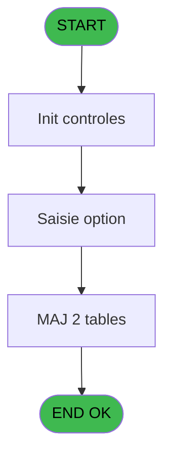
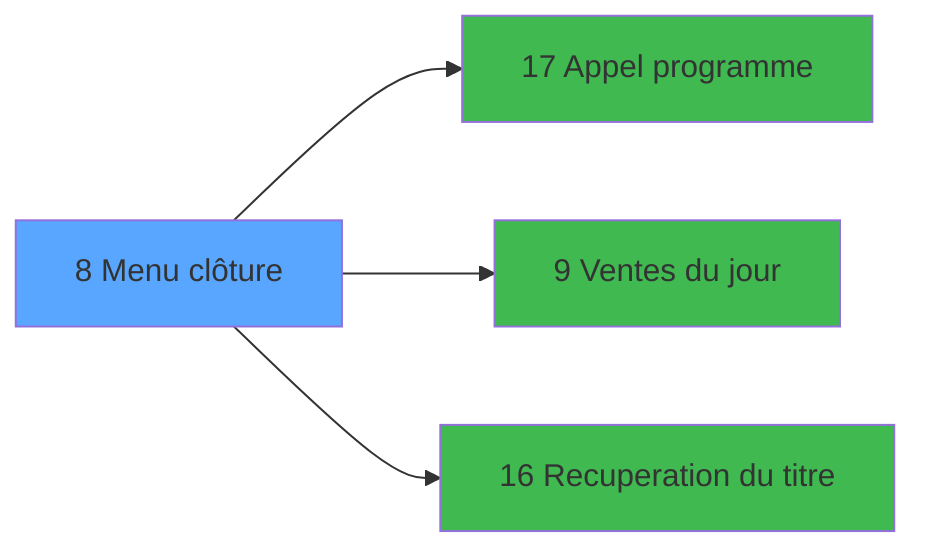

# EXB IDE 8 - Menu clôture

> **Analyse**: Phases 1-4 2026-02-03 10:31 -> 10:32 (23s) | Assemblage 10:32
> **Pipeline**: V7.2 Enrichi
> **Structure**: 4 onglets (Resume | Ecrans | Donnees | Connexions)

<!-- TAB:Resume -->

## 1. FICHE D'IDENTITE

| Attribut | Valeur |
|----------|--------|
| Projet | EXB |
| IDE Position | 8 |
| Nom Programme | Menu clôture |
| Fichier source | `Prg_8.xml` |
| Domaine metier | Navigation |
| Taches | 16 (1 ecrans visibles) |
| Tables modifiees | 2 |
| Programmes appeles | 3 |

## 2. DESCRIPTION FONCTIONNELLE

**Menu clôture** assure la gestion complete de ce processus, accessible depuis [Menu general (IDE 31)](EXB-IDE-31.md).

Le flux de traitement s'organise en **3 blocs fonctionnels** :

- **Traitement** (13 taches) : traitements metier divers
- **Calcul** (2 taches) : calculs de montants, stocks ou compteurs
- **Saisie** (1 tache) : ecrans de saisie utilisateur (formulaires, champs, donnees)

**Donnees modifiees** : 2 tables en ecriture (date_comptable___dat, reseau_cloture___rcg).

Detail : phases du traitement

#### Phase 1 : Traitement (13 taches)

- **8** - Menu fin de journee **[[ECRAN]](#ecran-t1)**
- **8.2** - (sans nom) **[[ECRAN]](#ecran-t3)**
- **8.4** - (sans nom)
- **8.4.1** - Blocage des traitements v1
- **8.4.2** - Temporisation
- **8.4.3** - Test si autres traitements v1
- **8.4.4** - Deblocage Traitement v1
- **8.6** - Deblocage clôture v1
- **8.7** - (sans nom) **[[ECRAN]](#ecran-t12)**
- **8.4.5** - Blocage des traitements v1
- **8.4.6** - Test si autres traitements v1
- **8.4.7** - Deblocage Traitement v1
- **8.8** - Deblocage clôture v1

Delegue a : [Appel programme (IDE 17)](EXB-IDE-17.md), [Recuperation du titre (IDE 16)](EXB-IDE-16.md)

#### Phase 2 : Saisie (1 tache)

- **8.1** - Saisie option **[[ECRAN]](#ecran-t2)**

Delegue a : [Ventes du jour (IDE 9)](EXB-IDE-9.md)

#### Phase 3 : Calcul (2 taches)

- **8.3** - Lecture date comptable
- **8.5** - Incrementation date comptable

#### Tables impactees

| Table | Operations | Role metier |
|-------|-----------|-------------|
| reseau_cloture___rcg | **W** (8 usages) | Donnees reseau/cloture |
| date_comptable___dat | R/**W** (2 usages) |  |

## 3. BLOCS FONCTIONNELS

### 3.1 Traitement (13 taches)

Traitements internes.

---

#### 8 - Menu fin de journee [[ECRAN]](#ecran-t1)

**Role** : Tache d'orchestration : point d'entree du programme (13 sous-taches). Coordonne l'enchainement des traitements.
**Ecran** : 166 x 33 DLU (MDI) | [Voir mockup](#ecran-t1)

12 sous-taches directes

| Tache | Nom | Bloc |
|-------|-----|------|
| [8.2](#t3) | (sans nom) **[[ECRAN]](#ecran-t3)** | Traitement |
| [8.4](#t5) | (sans nom) | Traitement |
| [8.4.1](#t6) | Blocage des traitements v1 | Traitement |
| [8.4.2](#t7) | Temporisation | Traitement |
| [8.4.3](#t8) | Test si autres traitements v1 | Traitement |
| [8.4.4](#t9) | Deblocage Traitement v1 | Traitement |
| [8.6](#t11) | Deblocage clôture v1 | Traitement |
| [8.7](#t12) | (sans nom) **[[ECRAN]](#ecran-t12)** | Traitement |
| [8.4.5](#t15) | Blocage des traitements v1 | Traitement |
| [8.4.6](#t18) | Test si autres traitements v1 | Traitement |
| [8.4.7](#t21) | Deblocage Traitement v1 | Traitement |
| [8.8](#t24) | Deblocage clôture v1 | Traitement |

**Variables liees** : I (v. titre menu)

---

#### 8.2 - (sans nom) [[ECRAN]](#ecran-t3)

**Role** : Traitement interne.
**Ecran** : 96 x 24 DLU (MDI) | [Voir mockup](#ecran-t3)

---

#### 8.4 - (sans nom)

**Role** : Traitement interne.

---

#### 8.4.1 - Blocage des traitements v1

**Role** : Traitement : Blocage des traitements v1.

---

#### 8.4.2 - Temporisation

**Role** : Traitement : Temporisation.

---

#### 8.4.3 - Test si autres traitements v1

**Role** : Verification : Test si autres traitements v1.

---

#### 8.4.4 - Deblocage Traitement v1

**Role** : Traitement : Deblocage Traitement v1.

---

#### 8.6 - Deblocage clôture v1

**Role** : Traitement : Deblocage clôture v1.
**Variables liees** : G (W0 clôture OK)

---

#### 8.7 - (sans nom) [[ECRAN]](#ecran-t12)

**Role** : Traitement interne.
**Ecran** : 104 x 24 DLU (MDI) | [Voir mockup](#ecran-t12)

---

#### 8.4.5 - Blocage des traitements v1

**Role** : Traitement : Blocage des traitements v1.

---

#### 8.4.6 - Test si autres traitements v1

**Role** : Verification : Test si autres traitements v1.

---

#### 8.4.7 - Deblocage Traitement v1

**Role** : Traitement : Deblocage Traitement v1.

---

#### 8.8 - Deblocage clôture v1

**Role** : Traitement : Deblocage clôture v1.
**Variables liees** : G (W0 clôture OK)

### 3.2 Saisie (1 tache)

L'operateur saisit les donnees de la transaction via 1 ecran (Saisie option).

---

#### 8.1 - Saisie option [[ECRAN]](#ecran-t2)

**Role** : Saisie des donnees : Saisie option.
**Ecran** : 730 x 177 DLU (MDI) | [Voir mockup](#ecran-t2)
**Delegue a** : [Ventes du jour (IDE 9)](EXB-IDE-9.md)

### 3.3 Calcul (2 taches)

Calculs metier : montants, stocks, compteurs.

---

#### 8.3 - Lecture date comptable

**Role** : Traitement : Lecture date comptable.
**Variables liees** : C (W0 date comptable)

---

#### 8.5 - Incrementation date comptable

**Role** : Traitement : Incrementation date comptable.
**Variables liees** : C (W0 date comptable)

## 5. REGLES METIER

*(Aucune regle metier identifiee)*

## 6. CONTEXTE

- **Appele par**: [Menu general (IDE 31)](EXB-IDE-31.md)
- **Appelle**: 3 programmes | **Tables**: 2 (W:2 R:1 L:0) | **Taches**: 16 | **Expressions**: 13

<!-- TAB:Ecrans -->

## 8. ECRANS

### 8.1 Forms visibles (1 / 16)

| # | Position | Tache | Nom | Type | Largeur | Hauteur | Bloc |
|---|----------|-------|-----|------|---------|---------|------|
| 1 | 8.1 | 8.1 | Saisie option | MDI | 730 | 177 | Saisie |

### 8.2 Mockups Ecrans

---

#### 8.1 - Saisie option
**Tache** : [8.1](#t2) | **Type** : MDI | **Dimensions** : 730 x 177 DLU
**Bloc** : Saisie | **Titre IDE** : Saisie option

<!-- FORM-DATA:
{
    "width":  730,
    "vFactor":  8,
    "type":  "MDI",
    "hFactor":  8,
    "controls":  [
                     {
                         "x":  2,
                         "type":  "label",
                         "var":  "",
                         "y":  2,
                         "w":  722,
                         "fmt":  "",
                         "name":  "",
                         "h":  17,
                         "color":  "",
                         "text":  "",
                         "parent":  null
                     },
                     {
                         "x":  413,
                         "type":  "label",
                         "var":  "",
                         "y":  31,
                         "w":  155,
                         "fmt":  "",
                         "name":  "",
                         "h":  8,
                         "color":  "",
                         "text":  "Date Comptable",
                         "parent":  null
                     },
                     {
                         "x":  259,
                         "type":  "label",
                         "var":  "",
                         "y":  55,
                         "w":  436,
                         "fmt":  "",
                         "name":  "",
                         "h":  73,
                         "color":  "",
                         "text":  "",
                         "parent":  null
                     },
                     {
                         "x":  283,
                         "type":  "label",
                         "var":  "",
                         "y":  65,
                         "w":  399,
                         "fmt":  "",
                         "name":  "",
                         "h":  41,
                         "color":  "155",
                         "text":  "",
                         "parent":  6
                     },
                     {
                         "x":  286,
                         "type":  "label",
                         "var":  "",
                         "y":  66,
                         "w":  44,
                         "fmt":  "",
                         "name":  "",
                         "h":  39,
                         "color":  "",
                         "text":  "",
                         "parent":  8
                     },
                     {
                         "x":  340,
                         "type":  "label",
                         "var":  "",
                         "y":  72,
                         "w":  178,
                         "fmt":  "",
                         "name":  "",
                         "h":  10,
                         "color":  "142",
                         "text":  "Edition des Ventes",
                         "parent":  8
                     },
                     {
                         "x":  340,
                         "type":  "label",
                         "var":  "",
                         "y":  87,
                         "w":  333,
                         "fmt":  "",
                         "name":  "",
                         "h":  9,
                         "color":  "142",
                         "text":  "Clôture de la journee comptable",
                         "parent":  8
                     },
                     {
                         "x":  406,
                         "type":  "label",
                         "var":  "",
                         "y":  110,
                         "w":  120,
                         "fmt":  "",
                         "name":  "",
                         "h":  9,
                         "color":  "",
                         "text":  "Votre choix",
                         "parent":  6
                     },
                     {
                         "x":  0,
                         "type":  "label",
                         "var":  "",
                         "y":  152,
                         "w":  724,
                         "fmt":  "",
                         "name":  "",
                         "h":  23,
                         "color":  "",
                         "text":  "",
                         "parent":  null
                     },
                     {
                         "x":  539,
                         "type":  "edit",
                         "var":  "",
                         "y":  110,
                         "w":  26,
                         "fmt":  "",
                         "name":  "",
                         "h":  10,
                         "color":  "6",
                         "text":  "",
                         "parent":  6
                     },
                     {
                         "x":  514,
                         "type":  "edit",
                         "var":  "",
                         "y":  6,
                         "w":  203,
                         "fmt":  "WWW DD MMM YYYYT",
                         "name":  "",
                         "h":  8,
                         "color":  "",
                         "text":  "",
                         "parent":  1
                     },
                     {
                         "x":  573,
                         "type":  "edit",
                         "var":  "",
                         "y":  31,
                         "w":  139,
                         "fmt":  "",
                         "name":  "",
                         "h":  8,
                         "color":  "",
                         "text":  "",
                         "parent":  null
                     },
                     {
                         "x":  33,
                         "type":  "image",
                         "var":  "",
                         "y":  56,
                         "w":  195,
                         "fmt":  "",
                         "name":  "",
                         "h":  70,
                         "color":  "",
                         "text":  "",
                         "parent":  null
                     },
                     {
                         "x":  577,
                         "type":  "edit",
                         "var":  "",
                         "y":  72,
                         "w":  37,
                         "fmt":  "2",
                         "name":  "",
                         "h":  8,
                         "color":  "",
                         "text":  "",
                         "parent":  8
                     },
                     {
                         "x":  296,
                         "type":  "button",
                         "var":  "",
                         "y":  73,
                         "w":  26,
                         "fmt":  "A",
                         "name":  "A",
                         "h":  9,
                         "color":  "",
                         "text":  "",
                         "parent":  8
                     },
                     {
                         "x":  296,
                         "type":  "button",
                         "var":  "",
                         "y":  87,
                         "w":  26,
                         "fmt":  "B",
                         "name":  "B",
                         "h":  9,
                         "color":  "",
                         "text":  "",
                         "parent":  null
                     },
                     {
                         "x":  8,
                         "type":  "button",
                         "var":  "",
                         "y":  155,
                         "w":  168,
                         "fmt":  "\u0026Quitter",
                         "name":  "",
                         "h":  18,
                         "color":  "",
                         "text":  "",
                         "parent":  15
                     },
                     {
                         "x":  5,
                         "type":  "edit",
                         "var":  "",
                         "y":  6,
                         "w":  267,
                         "fmt":  "20",
                         "name":  "",
                         "h":  8,
                         "color":  "",
                         "text":  "",
                         "parent":  1
                     }
                 ],
    "taskId":  "8.1",
    "height":  177
}
-->

<strong>Champs : 5 champs</strong>

| Pos (x,y) | Nom | Variable | Type |
|-----------|-----|----------|------|
| 539,110 | (sans nom) | - | edit |
| 514,6 | WWW DD MMM YYYYT | - | edit |
| 573,31 | (sans nom) | - | edit |
| 577,72 | 2 | - | edit |
| 5,6 | 20 | - | edit |

<strong>Boutons : 3 boutons</strong>

| Bouton | Pos (x,y) | Action |
|--------|-----------|--------|
| A | 296,73 | Bouton fonctionnel |
| B | 296,87 | Bouton fonctionnel |
| Quitter | 8,155 | Quitte le programme |

## 9. NAVIGATION

Ecran unique: **Saisie option**

### 9.3 Structure hierarchique (16 taches)

| Position | Tache | Type | Dimensions | Bloc |
|----------|-------|------|------------|------|
| **8.1** | [**Menu fin de journee** (8)](#t1) [mockup](#ecran-t1) | MDI | 166x33 | Traitement |
| 8.1.1 | [(sans nom) (8.2)](#t3) [mockup](#ecran-t3) | MDI | 96x24 | |
| 8.1.2 | [(sans nom) (8.4)](#t5) | MDI | - | |
| 8.1.3 | [Blocage des traitements v1 (8.4.1)](#t6) | MDI | - | |
| 8.1.4 | [Temporisation (8.4.2)](#t7) | MDI | - | |
| 8.1.5 | [Test si autres traitements v1 (8.4.3)](#t8) | MDI | - | |
| 8.1.6 | [Deblocage Traitement v1 (8.4.4)](#t9) | MDI | - | |
| 8.1.7 | [Deblocage clôture v1 (8.6)](#t11) | MDI | - | |
| 8.1.8 | [(sans nom) (8.7)](#t12) [mockup](#ecran-t12) | MDI | 104x24 | |
| 8.1.9 | [Blocage des traitements v1 (8.4.5)](#t15) | MDI | - | |
| 8.1.10 | [Test si autres traitements v1 (8.4.6)](#t18) | MDI | - | |
| 8.1.11 | [Deblocage Traitement v1 (8.4.7)](#t21) | MDI | - | |
| 8.1.12 | [Deblocage clôture v1 (8.8)](#t24) | MDI | - | |
| **8.2** | [**Saisie option** (8.1)](#t2) [mockup](#ecran-t2) | MDI | 730x177 | Saisie |
| **8.3** | [**Lecture date comptable** (8.3)](#t4) | MDI | - | Calcul |
| 8.3.1 | [Incrementation date comptable (8.5)](#t10) | MDI | - | |

### 9.4 Algorigramme

> **Legende**: Vert = START/END OK | Rouge = END KO | Bleu = Decisions
> *Algorigramme auto-genere. Utiliser `/algorigramme` pour une synthese metier detaillee.*

<!-- TAB:Donnees -->

## 10. TABLES

### Tables utilisees (2)

| ID | Nom | Description | Type | R | W | L | Usages |
|----|-----|-------------|------|---|---|---|--------|
| 293 | date_comptable___dat |  | DB | R | **W** |   | 2 |
| 303 | reseau_cloture___rcg | Donnees reseau/cloture | DB |   | **W** |   | 8 |

### Colonnes par table (1 / 2 tables avec colonnes identifiees)

Table 293 - date_comptable___dat (R/**W**) - 2 usages

| Lettre | Variable | Acces | Type |
|--------|----------|-------|------|
| C | W0 date comptable | W | Date |

Table 303 - reseau_cloture___rcg (**W**) - 8 usages

*Table utilisee uniquement en Link ou aucune colonne Real identifiee dans le DataView.*

## 11. VARIABLES

### 11.1 Parametres entrants (2)

Variables recues du programme appelant ([Menu general (IDE 31)](EXB-IDE-31.md)).

| Lettre | Nom | Type | Usage dans |
|--------|-----|------|-----------|
| A | P0 masque montant | Alpha | - |
| B | P0 nom village | Alpha | - |

### 11.2 Variables de session (1)

Variables persistantes pendant toute la session.

| Lettre | Nom | Type | Usage dans |
|--------|-----|------|-----------|
| I | v. titre menu | Alpha | - |

### 11.3 Variables de travail (6)

Variables internes au programme.

| Lettre | Nom | Type | Usage dans |
|--------|-----|------|-----------|
| C | W0 date comptable | Date | - |
| D | W0 choix action | Alpha | 4x calcul interne |
| E | W0 trait. en cours | Alpha | 1x calcul interne |
| F | W0 edition OK | Alpha | 2x calcul interne |
| G | W0 clôture OK | Alpha | [8.6](#t11), [8.8](#t24) |
| H | W0 confirmation | Numeric | 1x calcul interne |

## 12. EXPRESSIONS

**13 / 13 expressions decodees (100%)**

### 12.1 Repartition par type

| Type | Expressions | Regles |
|------|-------------|--------|
| CONSTANTE | 3 | 0 |
| CONDITION | 8 | 0 |
| NEGATION | 1 | 0 |
| REFERENCE_VG | 1 | 0 |

### 12.2 Expressions cles par type

#### CONSTANTE (3 expressions)

| Type | IDE | Expression | Regle |
|------|-----|------------|-------|
| CONSTANTE | 11 | `10` | - |
| CONSTANTE | 10 | `'F'` | - |
| CONSTANTE | 7 | `'O'` | - |

#### CONDITION (8 expressions)

| Type | IDE | Expression | Regle |
|------|-----|------------|-------|
| CONDITION | 6 | `W0 choix action [D]='F'` | - |
| CONDITION | 5 | `W0 choix action [D]='B' AND W0 edition OK [F]<>'O'` | - |
| CONDITION | 9 | `W0 clôture OK [G]<>'O'` | - |
| CONDITION | 8 | `W0 clôture OK [G]='O'` | - |
| CONDITION | 2 | `W0 choix action [D]='A'` | - |
| ... | | *+3 autres* | |

#### NEGATION (1 expressions)

| Type | IDE | Expression | Regle |
|------|-----|------------|-------|
| NEGATION | 12 | `NOT VG5` | - |

#### REFERENCE_VG (1 expressions)

| Type | IDE | Expression | Regle |
|------|-----|------------|-------|
| REFERENCE_VG | 13 | `VG5` | - |

<!-- TAB:Connexions -->

## 13. GRAPHE D'APPELS

### 13.1 Chaine depuis Main (Callers)

Main -> ... -> [Menu general (IDE 31)](EXB-IDE-31.md) -> **Menu clôture (IDE 8)**

### 13.2 Callers

| IDE | Nom Programme | Nb Appels |
|-----|---------------|-----------|
| [31](EXB-IDE-31.md) | Menu general | 1 |

### 13.3 Callees (programmes appeles)

### 13.4 Detail Callees avec contexte

| IDE | Nom Programme | Appels | Contexte |
|-----|---------------|--------|----------|
| [17](EXB-IDE-17.md) | Appel programme | 2 | Sous-programme |
| [9](EXB-IDE-9.md) | Ventes du jour | 1 | Sous-programme |
| [16](EXB-IDE-16.md) | Recuperation du titre | 1 | Recuperation donnees |

## 14. RECOMMANDATIONS MIGRATION

### 14.1 Profil du programme

| Metrique | Valeur | Impact migration |
|----------|--------|-----------------|
| Lignes de logique | 124 | Programme compact |
| Expressions | 13 | Peu de logique |
| Tables WRITE | 2 | Impact faible |
| Sous-programmes | 3 | Peu de dependances |
| Ecrans visibles | 1 | Ecran unique ou traitement batch |
| Code desactive | 0% (0 / 124) | Code sain |
| Regles metier | 0 | Pas de regle identifiee |

### 14.2 Plan de migration par bloc

#### Traitement (13 taches: 3 ecrans, 10 traitements)

- **Strategie** : Orchestrateur avec 3 ecrans (Razor/React) et 10 traitements backend (services).
- Les ecrans deviennent des composants UI, les traitements invisibles deviennent des services injectables.
- 3 sous-programme(s) a migrer ou a reutiliser depuis les services existants.
- Decomposer les taches en services unitaires testables.

#### Saisie (1 tache: 1 ecran, 0 traitement)

- **Strategie** : Formulaire React/Blazor avec validation Zod/FluentValidation.
- Reproduire 1 ecran : Saisie option
- Validation temps reel cote client + serveur

#### Calcul (2 taches: 0 ecran, 2 traitements)

- **Strategie** : Services de calcul purs (Domain Services).
- Migrer la logique de calcul (stock, compteurs, montants)

### 14.3 Dependances critiques

| Dependance | Type | Appels | Impact |
|------------|------|--------|--------|
| date_comptable___dat | Table WRITE (Database) | 1x | Schema + repository |
| reseau_cloture___rcg | Table WRITE (Database) | 8x | Schema + repository |
| [Appel programme (IDE 17)](EXB-IDE-17.md) | Sous-programme | 2x | Haute - Sous-programme |
| [Recuperation du titre (IDE 16)](EXB-IDE-16.md) | Sous-programme | 1x | Normale - Recuperation donnees |
| [Ventes du jour (IDE 9)](EXB-IDE-9.md) | Sous-programme | 1x | Normale - Sous-programme |

---
*Spec DETAILED generee par Pipeline V7.2 - 2026-02-03 10:32*
