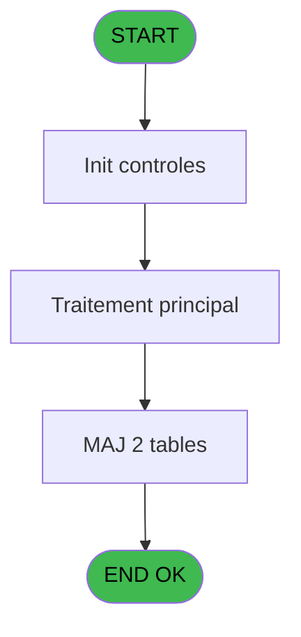

# EXB IDE 9 - Ventes du jour

> **Analyse**: Phases 1-4 2026-02-03 10:32 -> 10:32 (23s) | Assemblage 10:32
> **Pipeline**: V7.2 Enrichi
> **Structure**: 4 onglets (Resume | Ecrans | Donnees | Connexions)

<!-- TAB:Resume -->

## 1. FICHE D'IDENTITE

| Attribut | Valeur |
|----------|--------|
| Projet | EXB |
| IDE Position | 9 |
| Nom Programme | Ventes du jour |
| Fichier source | `Prg_9.xml` |
| Domaine metier | Ventes |
| Taches | 6 (1 ecrans visibles) |
| Tables modifiees | 2 |
| Programmes appeles | 1 |

## 2. DESCRIPTION FONCTIONNELLE

**Ventes du jour** assure la gestion complete de ce processus, accessible depuis [Menu clôture (IDE 8)](EXB-IDE-8.md).

Le flux de traitement s'organise en **2 blocs fonctionnels** :

- **Traitement** (4 taches) : traitements metier divers
- **Creation** (2 taches) : insertion d'enregistrements en base (mouvements, prestations)

**Donnees modifiees** : 2 tables en ecriture (vente____________vep, tempo_planning_go).

Detail : phases du traitement

#### Phase 1 : Traitement (4 taches)

- **9** - Veuillez patienter ... **[[ECRAN]](#ecran-t1)**
- **9.1.1** - (sans nom)
- **9.2** - (sans nom) **[[ECRAN]](#ecran-t5)**
- **9.3** - (sans nom) **[[ECRAN]](#ecran-t6)**

#### Phase 2 : Creation (2 taches)

- **9.1** - Creation tableau article
- **9.1.1.1** - Creation

#### Tables impactees

| Table | Operations | Role metier |
|-------|-----------|-------------|
| tempo_planning_go | **W**/L (3 usages) | Table temporaire ecran |
| vente____________vep | **W** (1 usages) | Donnees de ventes |

## 3. BLOCS FONCTIONNELS

### 3.1 Traitement (4 taches)

Traitements internes.

---

#### 9 - Veuillez patienter ... [[ECRAN]](#ecran-t1)

**Role** : Traitement : Veuillez patienter ....
**Ecran** : 429 x 58 DLU (MDI) | [Voir mockup](#ecran-t1)

3 sous-taches directes

| Tache | Nom | Bloc |
|-------|-----|------|
| [9.1.1](#t3) | (sans nom) | Traitement |
| [9.2](#t5) | (sans nom) **[[ECRAN]](#ecran-t5)** | Traitement |
| [9.3](#t6) | (sans nom) **[[ECRAN]](#ecran-t6)** | Traitement |

---

#### 9.1.1 - (sans nom)

**Role** : Traitement interne.

---

#### 9.2 - (sans nom) [[ECRAN]](#ecran-t5)

**Role** : Traitement interne.
**Ecran** : 83 x 1 DLU (MDI) | [Voir mockup](#ecran-t5)

---

#### 9.3 - (sans nom) [[ECRAN]](#ecran-t6)

**Role** : Traitement interne.
**Ecran** : 83 x 1 DLU (MDI) | [Voir mockup](#ecran-t6)

### 3.2 Creation (2 taches)

Insertion de nouveaux enregistrements en base.

---

#### 9.1 - Creation tableau article

**Role** : Creation d'enregistrement : Creation tableau article.
**Variables liees** : K (W1 Montatnt TVA article)

---

#### 9.1.1.1 - Creation

**Role** : Creation d'enregistrement : Creation.

## 5. REGLES METIER

*(Aucune regle metier identifiee)*

## 6. CONTEXTE

- **Appele par**: [Menu clôture (IDE 8)](EXB-IDE-8.md)
- **Appelle**: 1 programmes | **Tables**: 5 (W:2 R:1 L:3) | **Taches**: 6 | **Expressions**: 2

<!-- TAB:Ecrans -->

## 8. ECRANS

### 8.1 Forms visibles (1 / 6)

| # | Position | Tache | Nom | Type | Largeur | Hauteur | Bloc |
|---|----------|-------|-----|------|---------|---------|------|
| 1 | 9 | 9 | Veuillez patienter ... | MDI | 429 | 58 | Traitement |

### 8.2 Mockups Ecrans

---

#### 9 - Veuillez patienter ...
**Tache** : [9](#t1) | **Type** : MDI | **Dimensions** : 429 x 58 DLU
**Bloc** : Traitement | **Titre IDE** : Veuillez patienter ...

<!-- FORM-DATA:
{
    "width":  429,
    "vFactor":  8,
    "type":  "MDI",
    "hFactor":  8,
    "controls":  [
                     {
                         "x":  0,
                         "type":  "label",
                         "var":  "",
                         "y":  0,
                         "w":  423,
                         "fmt":  "",
                         "name":  "",
                         "h":  29,
                         "color":  "",
                         "text":  "",
                         "parent":  null
                     },
                     {
                         "x":  120,
                         "type":  "label",
                         "var":  "",
                         "y":  10,
                         "w":  221,
                         "fmt":  "",
                         "name":  "",
                         "h":  8,
                         "color":  "7",
                         "text":  "Impression en cours ...",
                         "parent":  null
                     },
                     {
                         "x":  0,
                         "type":  "label",
                         "var":  "",
                         "y":  29,
                         "w":  423,
                         "fmt":  "",
                         "name":  "",
                         "h":  27,
                         "color":  "",
                         "text":  "",
                         "parent":  null
                     },
                     {
                         "x":  72,
                         "type":  "label",
                         "var":  "",
                         "y":  38,
                         "w":  280,
                         "fmt":  "",
                         "name":  "",
                         "h":  8,
                         "color":  "",
                         "text":  "Ventes du jour",
                         "parent":  null
                     },
                     {
                         "x":  4,
                         "type":  "image",
                         "var":  "",
                         "y":  2,
                         "w":  72,
                         "fmt":  "",
                         "name":  "",
                         "h":  25,
                         "color":  "",
                         "text":  "",
                         "parent":  null
                     }
                 ],
    "taskId":  "9",
    "height":  58
}
-->

## 9. NAVIGATION

Ecran unique: **Veuillez patienter ...**

### 9.3 Structure hierarchique (6 taches)

| Position | Tache | Type | Dimensions | Bloc |
|----------|-------|------|------------|------|
| **9.1** | [**Veuillez patienter ...** (9)](#t1) [mockup](#ecran-t1) | MDI | 429x58 | Traitement |
| 9.1.1 | [(sans nom) (9.1.1)](#t3) | MDI | - | |
| 9.1.2 | [(sans nom) (9.2)](#t5) [mockup](#ecran-t5) | MDI | 83x1 | |
| 9.1.3 | [(sans nom) (9.3)](#t6) [mockup](#ecran-t6) | MDI | 83x1 | |
| **9.2** | [**Creation tableau article** (9.1)](#t2) | MDI | - | Creation |
| 9.2.1 | [Creation (9.1.1.1)](#t4) | MDI | - | |

### 9.4 Algorigramme

> **Legende**: Vert = START/END OK | Rouge = END KO | Bleu = Decisions
> *Algorigramme auto-genere. Utiliser `/algorigramme` pour une synthese metier detaillee.*

<!-- TAB:Donnees -->

## 10. TABLES

### Tables utilisees (5)

| ID | Nom | Description | Type | R | W | L | Usages |
|----|-----|-------------|------|---|---|---|--------|
| 77 | articles_________art | Articles et stock | DB | R |   |   | 2 |
| 277 | vendeur |  | DB |   |   | L | 1 |
| 300 | excursions_______exc |  | DB |   |   | L | 2 |
| 309 | vente____________vep | Donnees de ventes | DB |   | **W** |   | 1 |
| 647 | tempo_planning_go | Table temporaire ecran | DB |   | **W** | L | 3 |

### Colonnes par table (2 / 3 tables avec colonnes identifiees)

Table 77 - articles_________art (R) - 2 usages

| Lettre | Variable | Acces | Type |
|--------|----------|-------|------|
| A | W1_total_tarif | R | Numeric |
| B | W1_quantite_tarif | R | Numeric |
| C | W1 total article | R | Numeric |
| D | W1 quantite article | R | Numeric |
| E | W1 total paiement | R | Numeric |
| F | W1 total journee | R | Numeric |
| G | W1 Quantite Reduction | R | Numeric |
| H | W1 Quantite Plein tarif | R | Numeric |
| I | W1 Total Reduction | R | Numeric |
| J | W1 Total Plein Tarif | R | Numeric |
| K | W1 Montatnt TVA article | R | Numeric |
| L | W1 Montant TVA paiement | R | Numeric |
| M | W1 Montant TVA tarif | R | Numeric |
| N | W1 Montant globale TVA | R | Numeric |

Table 309 - vente____________vep (**W**) - 1 usages

*Table utilisee uniquement en Link ou aucune colonne Real identifiee dans le DataView.*

Table 647 - tempo_planning_go (**W**/L) - 3 usages

*Table utilisee uniquement en Link ou aucune colonne Real identifiee dans le DataView.*

## 11. VARIABLES

### 11.1 Parametres entrants (4)

Variables recues du programme appelant ([Menu clôture (IDE 8)](EXB-IDE-8.md)).

| Lettre | Nom | Type | Usage dans |
|--------|-----|------|-----------|
| A | P0 nom village | Alpha | - |
| B | P0 masque montant | Alpha | - |
| C | P0 date comptable | Date | - |
| D | P0 edition OK | Alpha | - |

### 11.2 Autres (10)

Variables diverses.

| Lettre | Nom | Type | Usage dans |
|--------|-----|------|-----------|
| E | W1 total paiement | Numeric | - |
| F | W1 total journee | Numeric | - |
| G | W1 Quantite Reduction | Numeric | - |
| H | W1 Quantite Plein tarif | Numeric | - |
| I | W1 Total Reduction | Numeric | - |
| J | W1 Total Plein Tarif | Numeric | - |
| K | W1 Montatnt TVA article | Numeric | - |
| L | W1 Montant TVA paiement | Numeric | - |
| M | W1 Montant TVA tarif | Numeric | - |
| N | W1 Montant globale TVA | Numeric | - |

## 12. EXPRESSIONS

**2 / 2 expressions decodees (100%)**

### 12.1 Repartition par type

| Type | Expressions | Regles |
|------|-------------|--------|
| CALCULATION | 1 | 0 |
| CONSTANTE | 1 | 0 |

### 12.2 Expressions cles par type

#### CALCULATION (1 expressions)

| Type | IDE | Expression | Regle |
|------|-----|------------|-------|
| CALCULATION | 2 | `CallProg('{123,-1}'PROG,DbName('{647,2}'DSOURCE))` | - |

#### CONSTANTE (1 expressions)

| Type | IDE | Expression | Regle |
|------|-----|------------|-------|
| CONSTANTE | 1 | `'O'` | - |

<!-- TAB:Connexions -->

## 13. GRAPHE D'APPELS

### 13.1 Chaine depuis Main (Callers)

Main -> ... -> [Menu clôture (IDE 8)](EXB-IDE-8.md) -> **Ventes du jour (IDE 9)**

### 13.2 Callers

| IDE | Nom Programme | Nb Appels |
|-----|---------------|-----------|
| [8](EXB-IDE-8.md) | Menu clôture | 1 |

### 13.3 Callees (programmes appeles)

### 13.4 Detail Callees avec contexte

| IDE | Nom Programme | Appels | Contexte |
|-----|---------------|--------|----------|
| [10](EXB-IDE-10.md) | Ventes par excursion et date | 1 | Sous-programme |

## 14. RECOMMANDATIONS MIGRATION

### 14.1 Profil du programme

| Metrique | Valeur | Impact migration |
|----------|--------|-----------------|
| Lignes de logique | 205 | Taille moyenne |
| Expressions | 2 | Peu de logique |
| Tables WRITE | 2 | Impact faible |
| Sous-programmes | 1 | Peu de dependances |
| Ecrans visibles | 1 | Ecran unique ou traitement batch |
| Code desactive | 0% (0 / 205) | Code sain |
| Regles metier | 0 | Pas de regle identifiee |

### 14.2 Plan de migration par bloc

#### Traitement (4 taches: 3 ecrans, 1 traitement)

- **Strategie** : Orchestrateur avec 3 ecrans (Razor/React) et 1 traitements backend (services).
- Les ecrans deviennent des composants UI, les traitements invisibles deviennent des services injectables.
- 1 sous-programme(s) a migrer ou a reutiliser depuis les services existants.
- Decomposer les taches en services unitaires testables.

#### Creation (2 taches: 0 ecran, 2 traitements)

- **Strategie** : Repository pattern avec Entity Framework Core.
- Insertion via `IRepository<T>.CreateAsync()`

### 14.3 Dependances critiques

| Dependance | Type | Appels | Impact |
|------------|------|--------|--------|
| vente____________vep | Table WRITE (Database) | 1x | Schema + repository |
| tempo_planning_go | Table WRITE (Database) | 1x | Schema + repository |
| [Ventes par excursion et date (IDE 10)](EXB-IDE-10.md) | Sous-programme | 1x | Normale - Sous-programme |

---
*Spec DETAILED generee par Pipeline V7.2 - 2026-02-03 10:32*
