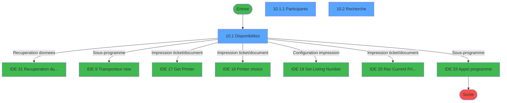
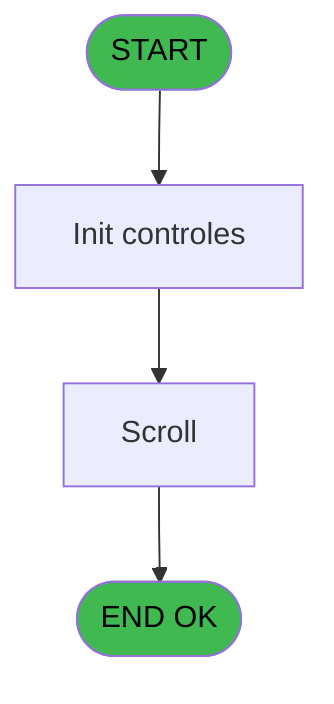
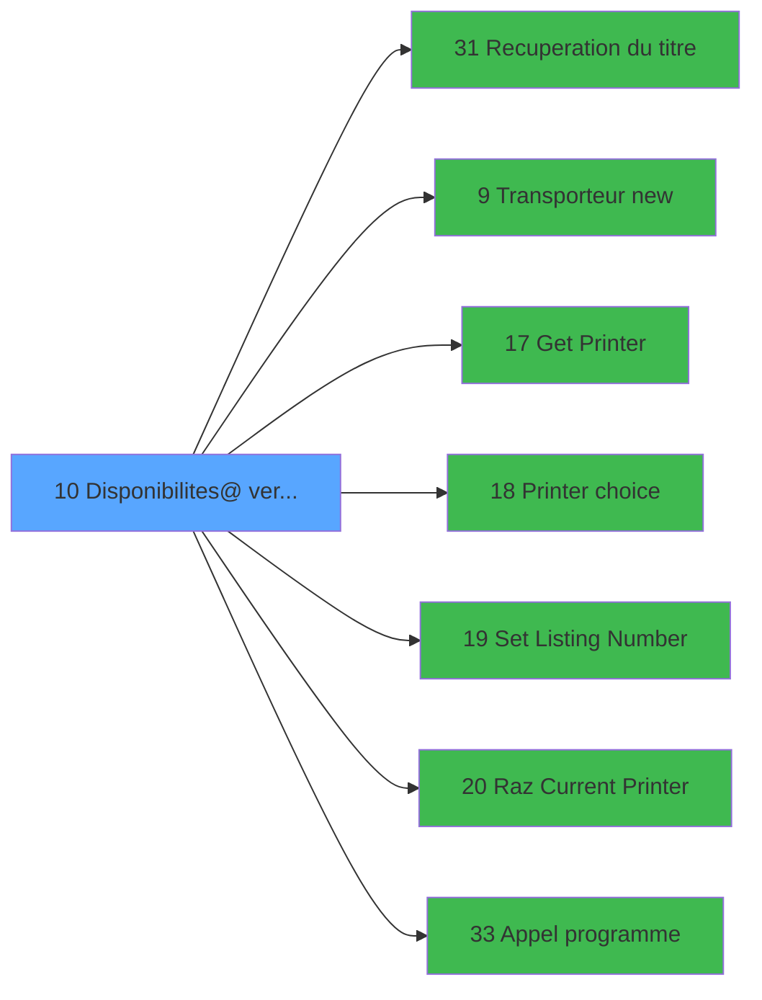

# EXF IDE 10 - Disponibilites@ verif stat

> **Analyse**: Phases 1-4 2026-02-03 10:53 -> 10:53 (16s) | Assemblage 10:53
> **Pipeline**: V7.2 Enrichi
> **Structure**: 4 onglets (Resume | Ecrans | Donnees | Connexions)

<!-- TAB:Resume -->

## 1. FICHE D'IDENTITE

| Attribut | Valeur |
|----------|--------|
| Projet | EXF |
| IDE Position | 10 |
| Nom Programme | Disponibilites@ verif stat |
| Fichier source | `Prg_10.xml` |
| Dossier IDE | General |
| Taches | 5 (3 ecrans visibles) |
| Tables modifiees | 0 |
| Programmes appeles | 7 |

## 2. DESCRIPTION FONCTIONNELLE

**Disponibilites@ verif stat** assure la gestion complete de ce processus, accessible depuis [Menu ventes (IDE 13)](EXF-IDE-13.md).

Le flux de traitement s'organise en **2 blocs fonctionnels** :

- **Traitement** (4 taches) : traitements metier divers
- **Consultation** (1 tache) : ecrans de recherche, selection et consultation

Detail : phases du traitement

#### Phase 1 : Traitement (4 taches)

- **10** - Disponibilites **[[ECRAN]](#ecran-t1)**
- **10.1** - Disponibilites **[[ECRAN]](#ecran-t2)**
- **10.1.1** - Participants **[[ECRAN]](#ecran-t3)**
- **10.3** - (sans nom) **[[ECRAN]](#ecran-t5)**

Delegue a : [Recuperation du titre (IDE 31)](EXF-IDE-31.md), [Transporteur new (IDE 9)](EXF-IDE-9.md), [Set Listing Number (IDE 19)](EXF-IDE-19.md), [Appel programme (IDE 33)](EXF-IDE-33.md)

#### Phase 2 : Consultation (1 tache)

- **10.2** - Recherche **[[ECRAN]](#ecran-t4)**

Delegue a : [Recuperation du titre (IDE 31)](EXF-IDE-31.md)

## 3. BLOCS FONCTIONNELS

### 3.1 Traitement (4 taches)

Traitements internes.

---

#### 10 - Disponibilites [[ECRAN]](#ecran-t1)

**Role** : Traitement : Disponibilites.
**Ecran** : 166 x 1 DLU (MDI) | [Voir mockup](#ecran-t1)

3 sous-taches directes

| Tache | Nom | Bloc |
|-------|-----|------|
| [10.1](#t2) | Disponibilites **[[ECRAN]](#ecran-t2)** | Traitement |
| [10.1.1](#t3) | Participants **[[ECRAN]](#ecran-t3)** | Traitement |
| [10.3](#t5) | (sans nom) **[[ECRAN]](#ecran-t5)** | Traitement |

**Delegue a** : [Recuperation du titre (IDE 31)](EXF-IDE-31.md), [Transporteur new (IDE 9)](EXF-IDE-9.md), [Set Listing Number (IDE 19)](EXF-IDE-19.md)

---

#### 10.1 - Disponibilites [[ECRAN]](#ecran-t2)

**Role** : Traitement : Disponibilites.
**Ecran** : 1197 x 248 DLU (MDI) | [Voir mockup](#ecran-t2)
**Delegue a** : [Recuperation du titre (IDE 31)](EXF-IDE-31.md), [Transporteur new (IDE 9)](EXF-IDE-9.md), [Set Listing Number (IDE 19)](EXF-IDE-19.md)

---

#### 10.1.1 - Participants [[ECRAN]](#ecran-t3)

**Role** : Traitement : Participants.
**Ecran** : 562 x 229 DLU (MDI) | [Voir mockup](#ecran-t3)
**Delegue a** : [Recuperation du titre (IDE 31)](EXF-IDE-31.md), [Transporteur new (IDE 9)](EXF-IDE-9.md), [Set Listing Number (IDE 19)](EXF-IDE-19.md)

---

#### 10.3 - (sans nom) [[ECRAN]](#ecran-t5)

**Role** : Traitement interne.
**Ecran** : 100 x 24 DLU (MDI) | [Voir mockup](#ecran-t5)
**Delegue a** : [Recuperation du titre (IDE 31)](EXF-IDE-31.md), [Transporteur new (IDE 9)](EXF-IDE-9.md), [Set Listing Number (IDE 19)](EXF-IDE-19.md)

### 3.2 Consultation (1 tache)

Ecrans de recherche et consultation.

---

#### 10.2 - Recherche [[ECRAN]](#ecran-t4)

**Role** : Traitement : Recherche.
**Ecran** : 576 x 137 DLU (MDI) | [Voir mockup](#ecran-t4)

## 5. REGLES METIER

*(Aucune regle metier identifiee)*

## 6. CONTEXTE

- **Appele par**: [Menu ventes (IDE 13)](EXF-IDE-13.md)
- **Appelle**: 7 programmes | **Tables**: 3 (W:0 R:2 L:1) | **Taches**: 5 | **Expressions**: 5

<!-- TAB:Ecrans -->

## 8. ECRANS

### 8.1 Forms visibles (3 / 5)

| # | Position | Tache | Nom | Type | Largeur | Hauteur | Bloc |
|---|----------|-------|-----|------|---------|---------|------|
| 1 | 10.1 | 10.1 | Disponibilites | MDI | 1197 | 248 | Traitement |
| 2 | 10.1.1 | 10.1.1 | Participants | MDI | 562 | 229 | Traitement |
| 3 | 10.2 | 10.2 | Recherche | MDI | 576 | 137 | Consultation |

### 8.2 Mockups Ecrans

---

#### 10.1 - Disponibilites
**Tache** : [10.1](#t2) | **Type** : MDI | **Dimensions** : 1197 x 248 DLU
**Bloc** : Traitement | **Titre IDE** : Disponibilites

<!-- FORM-DATA:
{
    "width":  1197,
    "vFactor":  8,
    "type":  "MDI",
    "hFactor":  8,
    "controls":  [
                     {
                         "x":  0,
                         "type":  "label",
                         "var":  "",
                         "y":  1,
                         "w":  1191,
                         "fmt":  "",
                         "name":  "",
                         "h":  17,
                         "color":  "",
                         "text":  "",
                         "parent":  null
                     },
                     {
                         "x":  45,
                         "type":  "table",
                         "var":  "",
                         "name":  "",
                         "titleH":  12,
                         "color":  "110",
                         "w":  1118,
                         "y":  23,
                         "fmt":  "",
                         "parent":  null,
                         "text":  "",
                         "rowH":  14,
                         "h":  97,
                         "cols":  [
                                      {
                                          "title":  "Excursion du",
                                          "layer":  1,
                                          "w":  150
                                      },
                                      {
                                          "title":  "Clôture inscription",
                                          "layer":  2,
                                          "w":  293
                                      },
                                      {
                                          "title":  "Description",
                                          "layer":  3,
                                          "w":  244
                                      },
                                      {
                                          "title":  "Places Vendues",
                                          "layer":  4,
                                          "w":  140
                                      },
                                      {
                                          "title":  "Disponibles",
                                          "layer":  5,
                                          "w":  103
                                      },
                                      {
                                          "title":  "Statut",
                                          "layer":  6,
                                          "w":  154
                                      }
                                  ],
                         "rows":  6
                     },
                     {
                         "x":  373,
                         "type":  "label",
                         "var":  "",
                         "y":  39,
                         "w":  18,
                         "fmt":  "",
                         "name":  "",
                         "h":  8,
                         "color":  "110",
                         "text":  "à",
                         "parent":  4
                     },
                     {
                         "x":  46,
                         "type":  "label",
                         "var":  "",
                         "y":  135,
                         "w":  251,
                         "fmt":  "",
                         "name":  "",
                         "h":  71,
                         "color":  "",
                         "text":  "",
                         "parent":  null
                     },
                     {
                         "x":  69,
                         "type":  "label",
                         "var":  "",
                         "y":  141,
                         "w":  198,
                         "fmt":  "",
                         "name":  "",
                         "h":  39,
                         "color":  "",
                         "text":  "",
                         "parent":  20
                     },
                     {
                         "x":  73,
                         "type":  "label",
                         "var":  "",
                         "y":  146,
                         "w":  42,
                         "fmt":  "",
                         "name":  "",
                         "h":  33,
                         "color":  "",
                         "text":  "",
                         "parent":  21
                     },
                     {
                         "x":  134,
                         "type":  "label",
                         "var":  "",
                         "y":  150,
                         "w":  125,
                         "fmt":  "",
                         "name":  "",
                         "h":  9,
                         "color":  "142",
                         "text":  "Recherche",
                         "parent":  21
                     },
                     {
                         "x":  134,
                         "type":  "label",
                         "var":  "",
                         "y":  165,
                         "w":  125,
                         "fmt":  "",
                         "name":  "",
                         "h":  9,
                         "color":  "142",
                         "text":  "Edition",
                         "parent":  21
                     },
                     {
                         "x":  89,
                         "type":  "label",
                         "var":  "",
                         "y":  187,
                         "w":  120,
                         "fmt":  "",
                         "name":  "",
                         "h":  9,
                         "color":  "",
                         "text":  "Votre choix",
                         "parent":  20
                     },
                     {
                         "x":  0,
                         "type":  "label",
                         "var":  "",
                         "y":  223,
                         "w":  1191,
                         "fmt":  "",
                         "name":  "",
                         "h":  22,
                         "color":  "",
                         "text":  "",
                         "parent":  null
                     },
                     {
                         "x":  51,
                         "type":  "edit",
                         "var":  "",
                         "y":  39,
                         "w":  120,
                         "fmt":  "",
                         "name":  "",
                         "h":  8,
                         "color":  "110",
                         "text":  "",
                         "parent":  4
                     },
                     {
                         "x":  245,
                         "type":  "edit",
                         "var":  "",
                         "y":  39,
                         "w":  120,
                         "fmt":  "",
                         "name":  "",
                         "h":  8,
                         "color":  "110",
                         "text":  "",
                         "parent":  4
                     },
                     {
                         "x":  402,
                         "type":  "edit",
                         "var":  "",
                         "y":  39,
                         "w":  64,
                         "fmt":  "HH:MM",
                         "name":  "",
                         "h":  8,
                         "color":  "110",
                         "text":  "",
                         "parent":  4
                     },
                     {
                         "x":  739,
                         "type":  "edit",
                         "var":  "",
                         "y":  39,
                         "w":  98,
                         "fmt":  "",
                         "name":  "",
                         "h":  8,
                         "color":  "110",
                         "text":  "",
                         "parent":  4
                     },
                     {
                         "x":  867,
                         "type":  "edit",
                         "var":  "",
                         "y":  39,
                         "w":  98,
                         "fmt":  "",
                         "name":  "",
                         "h":  8,
                         "color":  "110",
                         "text":  "",
                         "parent":  4
                     },
                     {
                         "x":  499,
                         "type":  "edit",
                         "var":  "",
                         "y":  39,
                         "w":  232,
                         "fmt":  "",
                         "name":  "",
                         "h":  8,
                         "color":  "110",
                         "text":  "",
                         "parent":  4
                     },
                     {
                         "x":  225,
                         "type":  "edit",
                         "var":  "",
                         "y":  187,
                         "w":  26,
                         "fmt":  "",
                         "name":  "",
                         "h":  10,
                         "color":  "6",
                         "text":  "",
                         "parent":  20
                     },
                     {
                         "x":  3,
                         "type":  "edit",
                         "var":  "",
                         "y":  6,
                         "w":  267,
                         "fmt":  "20",
                         "name":  "",
                         "h":  8,
                         "color":  "",
                         "text":  "",
                         "parent":  1
                     },
                     {
                         "x":  977,
                         "type":  "edit",
                         "var":  "",
                         "y":  6,
                         "w":  203,
                         "fmt":  "WWW DD MMM YYYYT",
                         "name":  "",
                         "h":  8,
                         "color":  "",
                         "text":  "",
                         "parent":  1
                     },
                     {
                         "x":  210,
                         "type":  "edit",
                         "var":  "",
                         "y":  39,
                         "w":  30,
                         "fmt":  "Le",
                         "name":  "",
                         "h":  8,
                         "color":  "148",
                         "text":  "",
                         "parent":  4
                     },
                     {
                         "x":  989,
                         "type":  "edit",
                         "var":  "",
                         "y":  39,
                         "w":  98,
                         "fmt":  "8",
                         "name":  "",
                         "h":  8,
                         "color":  "110",
                         "text":  "",
                         "parent":  4
                     },
                     {
                         "x":  723,
                         "type":  "image",
                         "var":  "",
                         "y":  131,
                         "w":  182,
                         "fmt":  "",
                         "name":  "",
                         "h":  92,
                         "color":  "",
                         "text":  "",
                         "parent":  null
                     },
                     {
                         "x":  1104,
                         "type":  "button",
                         "var":  "",
                         "y":  36,
                         "w":  29,
                         "fmt":  "...",
                         "name":  "",
                         "h":  13,
                         "color":  "",
                         "text":  "",
                         "parent":  4
                     },
                     {
                         "x":  82,
                         "type":  "button",
                         "var":  "",
                         "y":  150,
                         "w":  24,
                         "fmt":  "R",
                         "name":  "R",
                         "h":  9,
                         "color":  "",
                         "text":  "",
                         "parent":  21
                     },
                     {
                         "x":  82,
                         "type":  "button",
                         "var":  "",
                         "y":  165,
                         "w":  24,
                         "fmt":  "E",
                         "name":  "E",
                         "h":  9,
                         "color":  "",
                         "text":  "",
                         "parent":  21
                     },
                     {
                         "x":  3,
                         "type":  "button",
                         "var":  "",
                         "y":  226,
                         "w":  154,
                         "fmt":  "\u0026Quitter",
                         "name":  "",
                         "h":  18,
                         "color":  "",
                         "text":  "",
                         "parent":  27
                     },
                     {
                         "x":  1014,
                         "type":  "button",
                         "var":  "",
                         "y":  226,
                         "w":  168,
                         "fmt":  "Printer",
                         "name":  "",
                         "h":  18,
                         "color":  "",
                         "text":  "",
                         "parent":  null
                     }
                 ],
    "taskId":  "10.1",
    "height":  248
}
-->

<strong>Champs : 11 champs</strong>

| Pos (x,y) | Nom | Variable | Type |
|-----------|-----|----------|------|
| 51,39 | (sans nom) | - | edit |
| 245,39 | (sans nom) | - | edit |
| 402,39 | HH:MM | - | edit |
| 739,39 | (sans nom) | - | edit |
| 867,39 | (sans nom) | - | edit |
| 499,39 | (sans nom) | - | edit |
| 225,187 | (sans nom) | - | edit |
| 3,6 | 20 | - | edit |
| 977,6 | WWW DD MMM YYYYT | - | edit |
| 210,39 | Le | - | edit |
| 989,39 | 8 | - | edit |

<strong>Boutons : 5 boutons</strong>

| Bouton | Pos (x,y) | Action |
|--------|-----------|--------|
| ... | 1104,36 | Bouton fonctionnel |
| R | 82,150 | Bouton fonctionnel |
| E | 82,165 | Bouton fonctionnel |
| Quitter | 3,226 | Quitte le programme |
| Printer | 1014,226 | Appel [Get Printer (IDE 17)](EXF-IDE-17.md) |

---

#### 10.1.1 - Participants
**Tache** : [10.1.1](#t3) | **Type** : MDI | **Dimensions** : 562 x 229 DLU
**Bloc** : Traitement | **Titre IDE** : Participants

<!-- FORM-DATA:
{
    "width":  562,
    "vFactor":  8,
    "type":  "MDI",
    "hFactor":  8,
    "controls":  [
                     {
                         "x":  0,
                         "type":  "label",
                         "var":  "",
                         "y":  2,
                         "w":  559,
                         "fmt":  "",
                         "name":  "",
                         "h":  19,
                         "color":  "",
                         "text":  "",
                         "parent":  null
                     },
                     {
                         "x":  29,
                         "type":  "label",
                         "var":  "",
                         "y":  28,
                         "w":  82,
                         "fmt":  "",
                         "name":  "",
                         "h":  10,
                         "color":  "",
                         "text":  "Excursion",
                         "parent":  null
                     },
                     {
                         "x":  372,
                         "type":  "label",
                         "var":  "",
                         "y":  28,
                         "w":  27,
                         "fmt":  "",
                         "name":  "",
                         "h":  10,
                         "color":  "",
                         "text":  "du",
                         "parent":  null
                     },
                     {
                         "x":  110,
                         "type":  "table",
                         "var":  "",
                         "name":  "",
                         "titleH":  12,
                         "color":  "110",
                         "w":  350,
                         "y":  48,
                         "fmt":  "",
                         "parent":  null,
                         "text":  "",
                         "rowH":  14,
                         "h":  149,
                         "cols":  [
                                      {
                                          "title":  "Participants",
                                          "layer":  1,
                                          "w":  319
                                      }
                                  ],
                         "rows":  1
                     },
                     {
                         "x":  0,
                         "type":  "label",
                         "var":  "",
                         "y":  206,
                         "w":  559,
                         "fmt":  "",
                         "name":  "",
                         "h":  21,
                         "color":  "",
                         "text":  "",
                         "parent":  null
                     },
                     {
                         "x":  117,
                         "type":  "edit",
                         "var":  "",
                         "y":  62,
                         "w":  176,
                         "fmt":  "",
                         "name":  "",
                         "h":  11,
                         "color":  "148",
                         "text":  "",
                         "parent":  8
                     },
                     {
                         "x":  310,
                         "type":  "edit",
                         "var":  "",
                         "y":  62,
                         "w":  98,
                         "fmt":  "",
                         "name":  "",
                         "h":  11,
                         "color":  "148",
                         "text":  "",
                         "parent":  8
                     },
                     {
                         "x":  353,
                         "type":  "edit",
                         "var":  "",
                         "y":  7,
                         "w":  203,
                         "fmt":  "WWW DD MMM YYYYT",
                         "name":  "",
                         "h":  8,
                         "color":  "",
                         "text":  "",
                         "parent":  1
                     },
                     {
                         "x":  123,
                         "type":  "edit",
                         "var":  "",
                         "y":  28,
                         "w":  238,
                         "fmt":  "",
                         "name":  "",
                         "h":  10,
                         "color":  "",
                         "text":  "",
                         "parent":  null
                     },
                     {
                         "x":  411,
                         "type":  "edit",
                         "var":  "",
                         "y":  28,
                         "w":  126,
                         "fmt":  "",
                         "name":  "",
                         "h":  10,
                         "color":  "",
                         "text":  "",
                         "parent":  null
                     },
                     {
                         "x":  3,
                         "type":  "button",
                         "var":  "",
                         "y":  208,
                         "w":  154,
                         "fmt":  "\u0026Quitter",
                         "name":  "",
                         "h":  18,
                         "color":  "",
                         "text":  "",
                         "parent":  12
                     },
                     {
                         "x":  3,
                         "type":  "edit",
                         "var":  "",
                         "y":  7,
                         "w":  267,
                         "fmt":  "20",
                         "name":  "",
                         "h":  8,
                         "color":  "",
                         "text":  "",
                         "parent":  1
                     }
                 ],
    "taskId":  "10.1.1",
    "height":  229
}
-->

<strong>Champs : 6 champs</strong>

| Pos (x,y) | Nom | Variable | Type |
|-----------|-----|----------|------|
| 117,62 | (sans nom) | - | edit |
| 310,62 | (sans nom) | - | edit |
| 353,7 | WWW DD MMM YYYYT | - | edit |
| 123,28 | (sans nom) | - | edit |
| 411,28 | (sans nom) | - | edit |
| 3,7 | 20 | - | edit |

<strong>Boutons : 1 boutons</strong>

| Bouton | Pos (x,y) | Action |
|--------|-----------|--------|
| Quitter | 3,208 | Quitte le programme |

---

#### 10.2 - Recherche
**Tache** : [10.2](#t4) | **Type** : MDI | **Dimensions** : 576 x 137 DLU
**Bloc** : Consultation | **Titre IDE** : Recherche

<!-- FORM-DATA:
{
    "width":  576,
    "vFactor":  8,
    "type":  "MDI",
    "hFactor":  8,
    "controls":  [
                     {
                         "x":  5,
                         "type":  "label",
                         "var":  "",
                         "y":  2,
                         "w":  565,
                         "fmt":  "",
                         "name":  "",
                         "h":  17,
                         "color":  "",
                         "text":  "",
                         "parent":  null
                     },
                     {
                         "x":  307,
                         "type":  "label",
                         "var":  "",
                         "y":  37,
                         "w":  156,
                         "fmt":  "",
                         "name":  "",
                         "h":  9,
                         "color":  "",
                         "text":  "Entrez la date :",
                         "parent":  null
                     },
                     {
                         "x":  3,
                         "type":  "label",
                         "var":  "",
                         "y":  113,
                         "w":  567,
                         "fmt":  "",
                         "name":  "",
                         "h":  21,
                         "color":  "",
                         "text":  "",
                         "parent":  null
                     },
                     {
                         "x":  312,
                         "type":  "edit",
                         "var":  "",
                         "y":  65,
                         "w":  120,
                         "fmt":  "##/##/####",
                         "name":  "W1 date",
                         "h":  10,
                         "color":  "6",
                         "text":  "",
                         "parent":  null
                     },
                     {
                         "x":  434,
                         "type":  "button",
                         "var":  "",
                         "y":  64,
                         "w":  27,
                         "fmt":  "...",
                         "name":  "b_zoomDate",
                         "h":  12,
                         "color":  "",
                         "text":  "",
                         "parent":  null
                     },
                     {
                         "x":  8,
                         "type":  "edit",
                         "var":  "",
                         "y":  6,
                         "w":  267,
                         "fmt":  "20",
                         "name":  "",
                         "h":  8,
                         "color":  "",
                         "text":  "",
                         "parent":  1
                     },
                     {
                         "x":  359,
                         "type":  "edit",
                         "var":  "",
                         "y":  6,
                         "w":  203,
                         "fmt":  "WWW DD MMM YYYYT",
                         "name":  "",
                         "h":  8,
                         "color":  "",
                         "text":  "",
                         "parent":  1
                     },
                     {
                         "x":  41,
                         "type":  "image",
                         "var":  "",
                         "y":  38,
                         "w":  163,
                         "fmt":  "",
                         "name":  "",
                         "h":  59,
                         "color":  "",
                         "text":  "",
                         "parent":  null
                     },
                     {
                         "x":  6,
                         "type":  "button",
                         "var":  "",
                         "y":  115,
                         "w":  168,
                         "fmt":  "\u0026Quitter",
                         "name":  "",
                         "h":  18,
                         "color":  "",
                         "text":  "",
                         "parent":  7
                     }
                 ],
    "taskId":  "10.2",
    "height":  137
}
-->

<strong>Champs : 3 champs</strong>

| Pos (x,y) | Nom | Variable | Type |
|-----------|-----|----------|------|
| 312,65 | W1 date | - | edit |
| 8,6 | 20 | - | edit |
| 359,6 | WWW DD MMM YYYYT | - | edit |

<strong>Boutons : 2 boutons</strong>

| Bouton | Pos (x,y) | Action |
|--------|-----------|--------|
| ... | 434,64 | Bouton fonctionnel |
| Quitter | 6,115 | Quitte le programme |

## 9. NAVIGATION

### 9.1 Enchainement des ecrans

**Detail par enchainement :**

| Depuis | Action | Vers | Retour |
|--------|--------|------|--------|
| Disponibilites | Recuperation donnees | [Recuperation du titre (IDE 31)](EXF-IDE-31.md) | Retour ecran |
| Disponibilites | Sous-programme | [Transporteur new (IDE 9)](EXF-IDE-9.md) | Retour ecran |
| Disponibilites | Impression ticket/document | [Get Printer (IDE 17)](EXF-IDE-17.md) | Retour ecran |
| Disponibilites | Impression ticket/document | [Printer choice (IDE 18)](EXF-IDE-18.md) | Retour ecran |
| Disponibilites | Configuration impression | [Set Listing Number (IDE 19)](EXF-IDE-19.md) | Retour ecran |
| Disponibilites | Impression ticket/document | [Raz Current Printer (IDE 20)](EXF-IDE-20.md) | Retour ecran |
| Disponibilites | Sous-programme | [Appel programme (IDE 33)](EXF-IDE-33.md) | Retour ecran |

### 9.3 Structure hierarchique (5 taches)

| Position | Tache | Type | Dimensions | Bloc |
|----------|-------|------|------------|------|
| **10.1** | [**Disponibilites** (10)](#t1) [mockup](#ecran-t1) | MDI | 166x1 | Traitement |
| 10.1.1 | [Disponibilites (10.1)](#t2) [mockup](#ecran-t2) | MDI | 1197x248 | |
| 10.1.2 | [Participants (10.1.1)](#t3) [mockup](#ecran-t3) | MDI | 562x229 | |
| 10.1.3 | [(sans nom) (10.3)](#t5) [mockup](#ecran-t5) | MDI | 100x24 | |
| **10.2** | [**Recherche** (10.2)](#t4) [mockup](#ecran-t4) | MDI | 576x137 | Consultation |

### 9.4 Algorigramme

> **Legende**: Vert = START/END OK | Rouge = END KO | Bleu = Decisions
> *Algorigramme auto-genere. Utiliser `/algorigramme` pour une synthese metier detaillee.*

<!-- TAB:Donnees -->

## 10. TABLES

### Tables utilisees (3)

| ID | Nom | Description | Type | R | W | L | Usages |
|----|-----|-------------|------|---|---|---|--------|
| 298 | participants_____par |  | DB | R |   |   | 1 |
| 299 | excurs_planning__epl |  | DB |   |   | L | 1 |
| 300 | excursions_______exc |  | DB | R |   |   | 1 |

### Colonnes par table (3 / 2 tables avec colonnes identifiees)

Table 298 - participants_____par (R) - 1 usages

| Lettre | Variable | Acces | Type |
|--------|----------|-------|------|
| A | W creation | R | Logical |
| B | v. titre part | R | Alpha |

Table 300 - excursions_______exc (R) - 1 usages

| Lettre | Variable | Acces | Type |
|--------|----------|-------|------|
| A | W1 choix action | R | Alpha |
| B | W1 fin tâche | R | Alpha |
| C | W creation | R | Logical |
| D | v. titre scroll | R | Alpha |

## 11. VARIABLES

### 11.1 Parametres entrants (2)

Variables recues du programme appelant ([Menu ventes (IDE 13)](EXF-IDE-13.md)).

| Lettre | Nom | Type | Usage dans |
|--------|-----|------|-----------|
| A | P0 nom village | Alpha | - |
| B | P0 masque montant | Alpha | - |

### 11.2 Variables de travail (4)

Variables internes au programme.

| Lettre | Nom | Type | Usage dans |
|--------|-----|------|-----------|
| C | W0 choix action | Alpha | 3x calcul interne |
| F | W0 date | Date | - |
| H | W0 voucher ? | Alpha | - |
| I | W0 Option (O/N) | Alpha | - |

### 11.3 Autres (3)

Variables diverses.

| Lettre | Nom | Type | Usage dans |
|--------|-----|------|-----------|
| D | W0_Type | Alpha | - |
| E | W0_Code | Numeric | - |
| G | W0_Excursion | Alpha | - |

## 12. EXPRESSIONS

**5 / 5 expressions decodees (100%)**

### 12.1 Repartition par type

| Type | Expressions | Regles |
|------|-------------|--------|
| CONSTANTE | 1 | 0 |
| DATE | 1 | 0 |
| CONDITION | 3 | 0 |

### 12.2 Expressions cles par type

#### CONSTANTE (1 expressions)

| Type | IDE | Expression | Regle |
|------|-----|------------|-------|
| CONSTANTE | 5 | `105` | - |

#### DATE (1 expressions)

| Type | IDE | Expression | Regle |
|------|-----|------------|-------|
| DATE | 1 | `Date ()` | - |

#### CONDITION (3 expressions)

| Type | IDE | Expression | Regle |
|------|-----|------------|-------|
| CONDITION | 4 | `W0 choix action [C]='E'` | - |
| CONDITION | 3 | `W0 choix action [C]='R'` | - |
| CONDITION | 2 | `W0 choix action [C]='F'` | - |

<!-- TAB:Connexions -->

## 13. GRAPHE D'APPELS

### 13.1 Chaine depuis Main (Callers)

Main -> ... -> [Menu ventes (IDE 13)](EXF-IDE-13.md) -> **Disponibilites@ verif stat (IDE 10)**

### 13.2 Callers

| IDE | Nom Programme | Nb Appels |
|-----|---------------|-----------|
| [13](EXF-IDE-13.md) | Menu ventes | 1 |

### 13.3 Callees (programmes appeles)

### 13.4 Detail Callees avec contexte

| IDE | Nom Programme | Appels | Contexte |
|-----|---------------|--------|----------|
| [31](EXF-IDE-31.md) | Recuperation du titre | 3 | Recuperation donnees |
| [9](EXF-IDE-9.md) | Transporteur new | 1 | Sous-programme |
| [17](EXF-IDE-17.md) | Get Printer | 1 | Impression ticket/document |
| [18](EXF-IDE-18.md) | Printer choice | 1 | Impression ticket/document |
| [19](EXF-IDE-19.md) | Set Listing Number | 1 | Configuration impression |
| [20](EXF-IDE-20.md) | Raz Current Printer | 1 | Impression ticket/document |
| [33](EXF-IDE-33.md) | Appel programme | 1 | Sous-programme |

## 14. RECOMMANDATIONS MIGRATION

### 14.1 Profil du programme

| Metrique | Valeur | Impact migration |
|----------|--------|-----------------|
| Lignes de logique | 110 | Programme compact |
| Expressions | 5 | Peu de logique |
| Tables WRITE | 0 | Impact faible |
| Sous-programmes | 7 | Dependances moderees |
| Ecrans visibles | 3 | Quelques ecrans |
| Code desactive | 0% (0 / 110) | Code sain |
| Regles metier | 0 | Pas de regle identifiee |

### 14.2 Plan de migration par bloc

#### Traitement (4 taches: 4 ecrans, 0 traitement)

- **Strategie** : 4 composant(s) UI (Razor/React) avec formulaires et validation.
- 7 sous-programme(s) a migrer ou a reutiliser depuis les services existants.
- Decomposer les taches en services unitaires testables.

#### Consultation (1 tache: 1 ecran, 0 traitement)

- **Strategie** : Composants de recherche/selection en modales.
- 1 ecran : Recherche

### 14.3 Dependances critiques

| Dependance | Type | Appels | Impact |
|------------|------|--------|--------|
| [Recuperation du titre (IDE 31)](EXF-IDE-31.md) | Sous-programme | 3x | **CRITIQUE** - Recuperation donnees |
| [Set Listing Number (IDE 19)](EXF-IDE-19.md) | Sous-programme | 1x | Normale - Configuration impression |
| [Raz Current Printer (IDE 20)](EXF-IDE-20.md) | Sous-programme | 1x | Normale - Impression ticket/document |
| [Appel programme (IDE 33)](EXF-IDE-33.md) | Sous-programme | 1x | Normale - Sous-programme |
| [Transporteur new (IDE 9)](EXF-IDE-9.md) | Sous-programme | 1x | Normale - Sous-programme |
| [Get Printer (IDE 17)](EXF-IDE-17.md) | Sous-programme | 1x | Normale - Impression ticket/document |
| [Printer choice (IDE 18)](EXF-IDE-18.md) | Sous-programme | 1x | Normale - Impression ticket/document |

---
*Spec DETAILED generee par Pipeline V7.2 - 2026-02-03 10:53*
