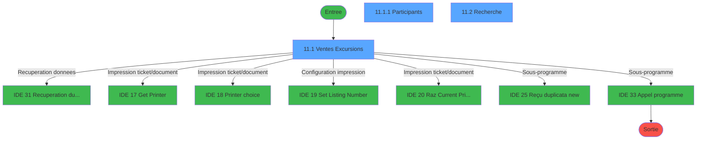
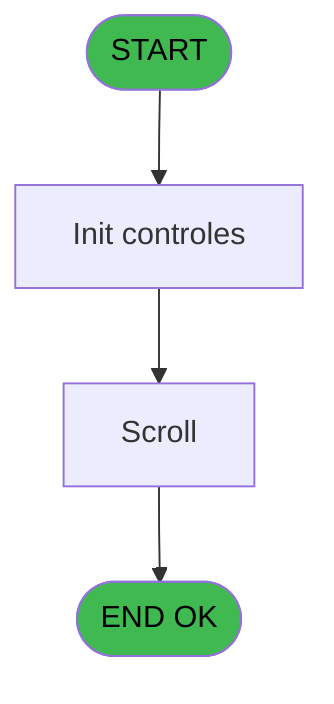
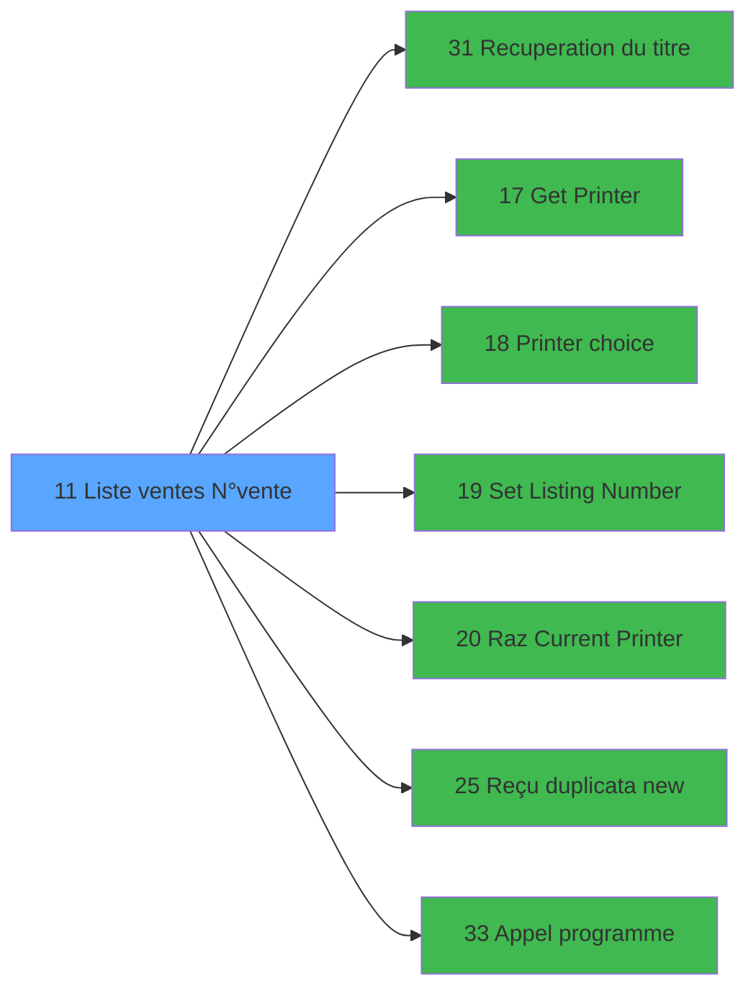

# EXF IDE 11 - Liste ventes /N°vente

> **Analyse**: Phases 1-4 2026-02-03 10:53 -> 10:54 (17s) | Assemblage 10:54
> **Pipeline**: V7.2 Enrichi
> **Structure**: 4 onglets (Resume | Ecrans | Donnees | Connexions)

<!-- TAB:Resume -->

## 1. FICHE D'IDENTITE

| Attribut | Valeur |
|----------|--------|
| Projet | EXF |
| IDE Position | 11 |
| Nom Programme | Liste ventes /N°vente |
| Fichier source | `Prg_11.xml` |
| Dossier IDE | Ventes |
| Taches | 4 (3 ecrans visibles) |
| Tables modifiees | 0 |
| Programmes appeles | 7 |

## 2. DESCRIPTION FONCTIONNELLE

**Liste ventes /N°vente** assure la gestion complete de ce processus, accessible depuis [   Menu listes (IDE 14)](EXF-IDE-14.md).

Le flux de traitement s'organise en **3 blocs fonctionnels** :

- **Saisie** (2 taches) : ecrans de saisie utilisateur (formulaires, champs, donnees)
- **Consultation** (1 tache) : ecrans de recherche, selection et consultation
- **Traitement** (1 tache) : traitements metier divers

Detail : phases du traitement

#### Phase 1 : Saisie (2 taches)

- **11** - Ventes **[[ECRAN]](#ecran-t1)**
- **11.1** - Ventes Excursions **[[ECRAN]](#ecran-t2)**

#### Phase 2 : Traitement (1 tache)

- **11.1.1** - Participants **[[ECRAN]](#ecran-t3)**

Delegue a : [Recuperation du titre (IDE 31)](EXF-IDE-31.md), [Set Listing Number (IDE 19)](EXF-IDE-19.md), [Reçu duplicata new (IDE 25)](EXF-IDE-25.md), [Appel programme (IDE 33)](EXF-IDE-33.md)

#### Phase 3 : Consultation (1 tache)

- **11.2** - Recherche **[[ECRAN]](#ecran-t4)**

Delegue a : [Recuperation du titre (IDE 31)](EXF-IDE-31.md)

## 3. BLOCS FONCTIONNELS

### 3.1 Saisie (2 taches)

L'operateur saisit les donnees de la transaction via 2 ecrans (Ventes, Ventes Excursions).

---

#### 11 - Ventes [[ECRAN]](#ecran-t1)

**Role** : Saisie des donnees : Ventes.
**Ecran** : 166 x 4 DLU (MDI) | [Voir mockup](#ecran-t1)

---

#### 11.1 - Ventes Excursions [[ECRAN]](#ecran-t2)

**Role** : Saisie des donnees : Ventes Excursions.
**Ecran** : 1237 x 256 DLU (MDI) | [Voir mockup](#ecran-t2)

### 3.2 Traitement (1 tache)

Traitements internes.

---

#### 11.1.1 - Participants [[ECRAN]](#ecran-t3)

**Role** : Traitement : Participants.
**Ecran** : 563 x 230 DLU (MDI) | [Voir mockup](#ecran-t3)
**Delegue a** : [Recuperation du titre (IDE 31)](EXF-IDE-31.md), [Set Listing Number (IDE 19)](EXF-IDE-19.md), [Reçu duplicata new (IDE 25)](EXF-IDE-25.md)

### 3.3 Consultation (1 tache)

Ecrans de recherche et consultation.

---

#### 11.2 - Recherche [[ECRAN]](#ecran-t4)

**Role** : Traitement : Recherche.
**Ecran** : 454 x 90 DLU (MDI) | [Voir mockup](#ecran-t4)

## 5. REGLES METIER

*(Aucune regle metier identifiee)*

## 6. CONTEXTE

- **Appele par**: [   Menu listes (IDE 14)](EXF-IDE-14.md)
- **Appelle**: 7 programmes | **Tables**: 3 (W:0 R:2 L:1) | **Taches**: 4 | **Expressions**: 4

<!-- TAB:Ecrans -->

## 8. ECRANS

### 8.1 Forms visibles (3 / 4)

| # | Position | Tache | Nom | Type | Largeur | Hauteur | Bloc |
|---|----------|-------|-----|------|---------|---------|------|
| 1 | 11.1 | 11.1 | Ventes Excursions | MDI | 1237 | 256 | Saisie |
| 2 | 11.1.1 | 11.1.1 | Participants | MDI | 563 | 230 | Traitement |
| 3 | 11.2 | 11.2 | Recherche | MDI | 454 | 90 | Consultation |

### 8.2 Mockups Ecrans

---

#### 11.1 - Ventes Excursions
**Tache** : [11.1](#t2) | **Type** : MDI | **Dimensions** : 1237 x 256 DLU
**Bloc** : Saisie | **Titre IDE** : Ventes Excursions

<!-- FORM-DATA:
{
    "width":  1237,
    "vFactor":  8,
    "type":  "MDI",
    "hFactor":  8,
    "controls":  [
                     {
                         "x":  0,
                         "type":  "label",
                         "var":  "",
                         "y":  1,
                         "w":  1233,
                         "fmt":  "",
                         "name":  "",
                         "h":  17,
                         "color":  "",
                         "text":  "",
                         "parent":  null
                     },
                     {
                         "x":  20,
                         "type":  "table",
                         "var":  "",
                         "name":  "",
                         "titleH":  12,
                         "color":  "110",
                         "w":  1203,
                         "y":  25,
                         "fmt":  "",
                         "parent":  null,
                         "text":  "",
                         "rowH":  14,
                         "h":  101,
                         "cols":  [
                                      {
                                          "title":  "Date Comptable",
                                          "layer":  1,
                                          "w":  136
                                      },
                                      {
                                          "title":  "N° Vente",
                                          "layer":  2,
                                          "w":  118
                                      },
                                      {
                                          "title":  "Montant",
                                          "layer":  3,
                                          "w":  188
                                      },
                                      {
                                          "title":  "Mode Paiement",
                                          "layer":  4,
                                          "w":  128
                                      },
                                      {
                                          "title":  "Excursion",
                                          "layer":  5,
                                          "w":  256
                                      },
                                      {
                                          "title":  "Payé par",
                                          "layer":  6,
                                          "w":  339
                                      }
                                  ],
                         "rows":  6
                     },
                     {
                         "x":  395,
                         "type":  "label",
                         "var":  "",
                         "y":  137,
                         "w":  245,
                         "fmt":  "",
                         "name":  "",
                         "h":  85,
                         "color":  "",
                         "text":  "",
                         "parent":  null
                     },
                     {
                         "x":  420,
                         "type":  "label",
                         "var":  "",
                         "y":  146,
                         "w":  191,
                         "fmt":  "",
                         "name":  "",
                         "h":  52,
                         "color":  "",
                         "text":  "",
                         "parent":  19
                     },
                     {
                         "x":  422,
                         "type":  "label",
                         "var":  "",
                         "y":  147,
                         "w":  34,
                         "fmt":  "",
                         "name":  "",
                         "h":  50,
                         "color":  "",
                         "text":  "",
                         "parent":  19
                     },
                     {
                         "x":  467,
                         "type":  "label",
                         "var":  "",
                         "y":  150,
                         "w":  125,
                         "fmt":  "",
                         "name":  "",
                         "h":  9,
                         "color":  "142",
                         "text":  "Recherche",
                         "parent":  19
                     },
                     {
                         "x":  467,
                         "type":  "label",
                         "var":  "",
                         "y":  167,
                         "w":  125,
                         "fmt":  "",
                         "name":  "",
                         "h":  9,
                         "color":  "142",
                         "text":  "Impression",
                         "parent":  19
                     },
                     {
                         "x":  467,
                         "type":  "label",
                         "var":  "",
                         "y":  184,
                         "w":  127,
                         "fmt":  "",
                         "name":  "",
                         "h":  9,
                         "color":  "142",
                         "text":  "Participants",
                         "parent":  19
                     },
                     {
                         "x":  430,
                         "type":  "label",
                         "var":  "",
                         "y":  203,
                         "w":  117,
                         "fmt":  "",
                         "name":  "",
                         "h":  9,
                         "color":  "",
                         "text":  "Votre choix",
                         "parent":  19
                     },
                     {
                         "x":  0,
                         "type":  "label",
                         "var":  "",
                         "y":  231,
                         "w":  1233,
                         "fmt":  "",
                         "name":  "",
                         "h":  24,
                         "color":  "",
                         "text":  "",
                         "parent":  null
                     },
                     {
                         "x":  162,
                         "type":  "edit",
                         "var":  "",
                         "y":  41,
                         "w":  98,
                         "fmt":  "########L",
                         "name":  "",
                         "h":  8,
                         "color":  "110",
                         "text":  "",
                         "parent":  4
                     },
                     {
                         "x":  486,
                         "type":  "edit",
                         "var":  "",
                         "y":  41,
                         "w":  75,
                         "fmt":  "",
                         "name":  "",
                         "h":  8,
                         "color":  "110",
                         "text":  "",
                         "parent":  4
                     },
                     {
                         "x":  862,
                         "type":  "edit",
                         "var":  "",
                         "y":  41,
                         "w":  176,
                         "fmt":  "",
                         "name":  "",
                         "h":  8,
                         "color":  "110",
                         "text":  "",
                         "parent":  4
                     },
                     {
                         "x":  1046,
                         "type":  "edit",
                         "var":  "",
                         "y":  41,
                         "w":  98,
                         "fmt":  "",
                         "name":  "",
                         "h":  8,
                         "color":  "110",
                         "text":  "",
                         "parent":  4
                     },
                     {
                         "x":  26,
                         "type":  "edit",
                         "var":  "",
                         "y":  41,
                         "w":  120,
                         "fmt":  "",
                         "name":  "",
                         "h":  8,
                         "color":  "110",
                         "text":  "",
                         "parent":  4
                     },
                     {
                         "x":  282,
                         "type":  "edit",
                         "var":  "",
                         "y":  41,
                         "w":  176,
                         "fmt":  "",
                         "name":  "",
                         "h":  8,
                         "color":  "110",
                         "text":  "",
                         "parent":  4
                     },
                     {
                         "x":  605,
                         "type":  "edit",
                         "var":  "",
                         "y":  41,
                         "w":  232,
                         "fmt":  "",
                         "name":  "",
                         "h":  8,
                         "color":  "110",
                         "text":  "",
                         "parent":  4
                     },
                     {
                         "x":  551,
                         "type":  "edit",
                         "var":  "",
                         "y":  203,
                         "w":  26,
                         "fmt":  "",
                         "name":  "W1 choix action",
                         "h":  10,
                         "color":  "6",
                         "text":  "",
                         "parent":  19
                     },
                     {
                         "x":  3,
                         "type":  "edit",
                         "var":  "",
                         "y":  6,
                         "w":  267,
                         "fmt":  "20",
                         "name":  "",
                         "h":  8,
                         "color":  "",
                         "text":  "",
                         "parent":  1
                     },
                     {
                         "x":  1024,
                         "type":  "edit",
                         "var":  "",
                         "y":  6,
                         "w":  203,
                         "fmt":  "WWW DD MMM YYYYT",
                         "name":  "",
                         "h":  8,
                         "color":  "",
                         "text":  "",
                         "parent":  1
                     },
                     {
                         "x":  1158,
                         "type":  "button",
                         "var":  "",
                         "y":  38,
                         "w":  29,
                         "fmt":  "...",
                         "name":  "P",
                         "h":  13,
                         "color":  "",
                         "text":  "",
                         "parent":  4
                     },
                     {
                         "x":  657,
                         "type":  "image",
                         "var":  "",
                         "y":  135,
                         "w":  182,
                         "fmt":  "",
                         "name":  "",
                         "h":  92,
                         "color":  "",
                         "text":  "",
                         "parent":  null
                     },
                     {
                         "x":  426,
                         "type":  "button",
                         "var":  "",
                         "y":  150,
                         "w":  24,
                         "fmt":  "R",
                         "name":  "R",
                         "h":  9,
                         "color":  "",
                         "text":  "",
                         "parent":  19
                     },
                     {
                         "x":  426,
                         "type":  "button",
                         "var":  "",
                         "y":  167,
                         "w":  24,
                         "fmt":  "I",
                         "name":  "I",
                         "h":  9,
                         "color":  "",
                         "text":  "",
                         "parent":  19
                     },
                     {
                         "x":  426,
                         "type":  "button",
                         "var":  "",
                         "y":  184,
                         "w":  24,
                         "fmt":  "P",
                         "name":  "P",
                         "h":  9,
                         "color":  "",
                         "text":  "",
                         "parent":  null
                     },
                     {
                         "x":  6,
                         "type":  "button",
                         "var":  "",
                         "y":  234,
                         "w":  154,
                         "fmt":  "\u0026Quitter",
                         "name":  "",
                         "h":  18,
                         "color":  "",
                         "text":  "",
                         "parent":  27
                     },
                     {
                         "x":  1054,
                         "type":  "button",
                         "var":  "",
                         "y":  234,
                         "w":  168,
                         "fmt":  "Printer",
                         "name":  "",
                         "h":  18,
                         "color":  "",
                         "text":  "",
                         "parent":  null
                     }
                 ],
    "taskId":  "11.1",
    "height":  256
}
-->

<strong>Champs : 10 champs</strong>

| Pos (x,y) | Nom | Variable | Type |
|-----------|-----|----------|------|
| 162,41 | ########L | - | edit |
| 486,41 | (sans nom) | - | edit |
| 862,41 | (sans nom) | - | edit |
| 1046,41 | (sans nom) | - | edit |
| 26,41 | (sans nom) | - | edit |
| 282,41 | (sans nom) | - | edit |
| 605,41 | (sans nom) | - | edit |
| 551,203 | W1 choix action | - | edit |
| 3,6 | 20 | - | edit |
| 1024,6 | WWW DD MMM YYYYT | - | edit |

<strong>Boutons : 6 boutons</strong>

| Bouton | Pos (x,y) | Action |
|--------|-----------|--------|
| ... | 1158,38 | Bouton fonctionnel |
| R | 426,150 | Bouton fonctionnel |
| I | 426,167 | Bouton fonctionnel |
| P | 426,184 | Bouton fonctionnel |
| Quitter | 6,234 | Quitte le programme |
| Printer | 1054,234 | Appel [Get Printer (IDE 17)](EXF-IDE-17.md) |

---

#### 11.1.1 - Participants
**Tache** : [11.1.1](#t3) | **Type** : MDI | **Dimensions** : 563 x 230 DLU
**Bloc** : Traitement | **Titre IDE** : Participants

<!-- FORM-DATA:
{
    "width":  563,
    "vFactor":  8,
    "type":  "MDI",
    "hFactor":  8,
    "controls":  [
                     {
                         "x":  0,
                         "type":  "label",
                         "var":  "",
                         "y":  2,
                         "w":  559,
                         "fmt":  "",
                         "name":  "",
                         "h":  19,
                         "color":  "",
                         "text":  "",
                         "parent":  null
                     },
                     {
                         "x":  29,
                         "type":  "label",
                         "var":  "",
                         "y":  28,
                         "w":  82,
                         "fmt":  "",
                         "name":  "",
                         "h":  10,
                         "color":  "",
                         "text":  "Excursion",
                         "parent":  null
                     },
                     {
                         "x":  372,
                         "type":  "label",
                         "var":  "",
                         "y":  28,
                         "w":  27,
                         "fmt":  "",
                         "name":  "",
                         "h":  10,
                         "color":  "",
                         "text":  "du",
                         "parent":  null
                     },
                     {
                         "x":  106,
                         "type":  "table",
                         "var":  "",
                         "name":  "",
                         "titleH":  12,
                         "color":  "110",
                         "w":  350,
                         "y":  46,
                         "fmt":  "",
                         "parent":  null,
                         "text":  "",
                         "rowH":  14,
                         "h":  151,
                         "cols":  [
                                      {
                                          "title":  "Participants",
                                          "layer":  1,
                                          "w":  319
                                      }
                                  ],
                         "rows":  1
                     },
                     {
                         "x":  0,
                         "type":  "label",
                         "var":  "",
                         "y":  203,
                         "w":  559,
                         "fmt":  "",
                         "name":  "",
                         "h":  24,
                         "color":  "",
                         "text":  "",
                         "parent":  null
                     },
                     {
                         "x":  112,
                         "type":  "edit",
                         "var":  "",
                         "y":  60,
                         "w":  176,
                         "fmt":  "",
                         "name":  "",
                         "h":  11,
                         "color":  "110",
                         "text":  "",
                         "parent":  8
                     },
                     {
                         "x":  306,
                         "type":  "edit",
                         "var":  "",
                         "y":  60,
                         "w":  98,
                         "fmt":  "",
                         "name":  "",
                         "h":  11,
                         "color":  "110",
                         "text":  "",
                         "parent":  8
                     },
                     {
                         "x":  352,
                         "type":  "edit",
                         "var":  "",
                         "y":  7,
                         "w":  203,
                         "fmt":  "WWW DD MMM YYYYT",
                         "name":  "",
                         "h":  8,
                         "color":  "",
                         "text":  "",
                         "parent":  1
                     },
                     {
                         "x":  123,
                         "type":  "edit",
                         "var":  "",
                         "y":  28,
                         "w":  238,
                         "fmt":  "",
                         "name":  "",
                         "h":  10,
                         "color":  "",
                         "text":  "",
                         "parent":  null
                     },
                     {
                         "x":  411,
                         "type":  "edit",
                         "var":  "",
                         "y":  28,
                         "w":  126,
                         "fmt":  "",
                         "name":  "",
                         "h":  10,
                         "color":  "",
                         "text":  "",
                         "parent":  null
                     },
                     {
                         "x":  7,
                         "type":  "button",
                         "var":  "",
                         "y":  206,
                         "w":  154,
                         "fmt":  "\u0026Quitter",
                         "name":  "",
                         "h":  18,
                         "color":  "",
                         "text":  "",
                         "parent":  12
                     },
                     {
                         "x":  6,
                         "type":  "edit",
                         "var":  "",
                         "y":  7,
                         "w":  267,
                         "fmt":  "20",
                         "name":  "",
                         "h":  8,
                         "color":  "",
                         "text":  "",
                         "parent":  1
                     }
                 ],
    "taskId":  "11.1.1",
    "height":  230
}
-->

<strong>Champs : 6 champs</strong>

| Pos (x,y) | Nom | Variable | Type |
|-----------|-----|----------|------|
| 112,60 | (sans nom) | - | edit |
| 306,60 | (sans nom) | - | edit |
| 352,7 | WWW DD MMM YYYYT | - | edit |
| 123,28 | (sans nom) | - | edit |
| 411,28 | (sans nom) | - | edit |
| 6,7 | 20 | - | edit |

<strong>Boutons : 1 boutons</strong>

| Bouton | Pos (x,y) | Action |
|--------|-----------|--------|
| Quitter | 7,206 | Quitte le programme |

---

#### 11.2 - Recherche
**Tache** : [11.2](#t4) | **Type** : MDI | **Dimensions** : 454 x 90 DLU
**Bloc** : Consultation | **Titre IDE** : Recherche

<!-- FORM-DATA:
{
    "width":  454,
    "vFactor":  8,
    "type":  "MDI",
    "hFactor":  8,
    "controls":  [
                     {
                         "x":  133,
                         "type":  "label",
                         "var":  "",
                         "y":  16,
                         "w":  292,
                         "fmt":  "",
                         "name":  "",
                         "h":  33,
                         "color":  "",
                         "text":  "",
                         "parent":  null
                     },
                     {
                         "x":  157,
                         "type":  "label",
                         "var":  "",
                         "y":  27,
                         "w":  137,
                         "fmt":  "",
                         "name":  "",
                         "h":  8,
                         "color":  "",
                         "text":  "Entrez le numero",
                         "parent":  2
                     },
                     {
                         "x":  0,
                         "type":  "label",
                         "var":  "",
                         "y":  63,
                         "w":  449,
                         "fmt":  "",
                         "name":  "",
                         "h":  24,
                         "color":  "",
                         "text":  "",
                         "parent":  null
                     },
                     {
                         "x":  314,
                         "type":  "edit",
                         "var":  "",
                         "y":  26,
                         "w":  86,
                         "fmt":  "",
                         "name":  "",
                         "h":  10,
                         "color":  "6",
                         "text":  "",
                         "parent":  2
                     },
                     {
                         "x":  7,
                         "type":  "button",
                         "var":  "",
                         "y":  66,
                         "w":  154,
                         "fmt":  "\u0026Ok",
                         "name":  "",
                         "h":  18,
                         "color":  "",
                         "text":  "",
                         "parent":  5
                     },
                     {
                         "x":  168,
                         "type":  "button",
                         "var":  "",
                         "y":  66,
                         "w":  154,
                         "fmt":  "\u0026Abandonner",
                         "name":  "",
                         "h":  18,
                         "color":  "",
                         "text":  "",
                         "parent":  5
                     },
                     {
                         "x":  2,
                         "type":  "image",
                         "var":  "",
                         "y":  5,
                         "w":  127,
                         "fmt":  "",
                         "name":  "",
                         "h":  54,
                         "color":  "",
                         "text":  "",
                         "parent":  null
                     }
                 ],
    "taskId":  "11.2",
    "height":  90
}
-->

<strong>Champs : 1 champs</strong>

| Pos (x,y) | Nom | Variable | Type |
|-----------|-----|----------|------|
| 314,26 | (sans nom) | - | edit |

<strong>Boutons : 2 boutons</strong>

| Bouton | Pos (x,y) | Action |
|--------|-----------|--------|
| Ok | 7,66 | Valide la saisie et enregistre |
| Abandonner | 168,66 | Annule et retour au menu |

## 9. NAVIGATION

### 9.1 Enchainement des ecrans

**Detail par enchainement :**

| Depuis | Action | Vers | Retour |
|--------|--------|------|--------|
| Ventes Excursions | Recuperation donnees | [Recuperation du titre (IDE 31)](EXF-IDE-31.md) | Retour ecran |
| Ventes Excursions | Impression ticket/document | [Get Printer (IDE 17)](EXF-IDE-17.md) | Retour ecran |
| Ventes Excursions | Impression ticket/document | [Printer choice (IDE 18)](EXF-IDE-18.md) | Retour ecran |
| Ventes Excursions | Configuration impression | [Set Listing Number (IDE 19)](EXF-IDE-19.md) | Retour ecran |
| Ventes Excursions | Impression ticket/document | [Raz Current Printer (IDE 20)](EXF-IDE-20.md) | Retour ecran |
| Ventes Excursions | Sous-programme | [Reçu duplicata new (IDE 25)](EXF-IDE-25.md) | Retour ecran |
| Ventes Excursions | Sous-programme | [Appel programme (IDE 33)](EXF-IDE-33.md) | Retour ecran |

### 9.3 Structure hierarchique (4 taches)

| Position | Tache | Type | Dimensions | Bloc |
|----------|-------|------|------------|------|
| **11.1** | [**Ventes** (11)](#t1) [mockup](#ecran-t1) | MDI | 166x4 | Saisie |
| 11.1.1 | [Ventes Excursions (11.1)](#t2) [mockup](#ecran-t2) | MDI | 1237x256 | |
| **11.2** | [**Participants** (11.1.1)](#t3) [mockup](#ecran-t3) | MDI | 563x230 | Traitement |
| **11.3** | [**Recherche** (11.2)](#t4) [mockup](#ecran-t4) | MDI | 454x90 | Consultation |

### 9.4 Algorigramme

> **Legende**: Vert = START/END OK | Rouge = END KO | Bleu = Decisions
> *Algorigramme auto-genere. Utiliser `/algorigramme` pour une synthese metier detaillee.*

<!-- TAB:Donnees -->

## 10. TABLES

### Tables utilisees (3)

| ID | Nom | Description | Type | R | W | L | Usages |
|----|-----|-------------|------|---|---|---|--------|
| 298 | participants_____par |  | DB | R |   |   | 1 |
| 300 | excursions_______exc |  | DB |   |   | L | 1 |
| 309 | vente____________vep | Donnees de ventes | DB | R |   |   | 1 |

### Colonnes par table (2 / 2 tables avec colonnes identifiees)

Table 298 - participants_____par (R) - 1 usages

| Lettre | Variable | Acces | Type |
|--------|----------|-------|------|
| A | W creation | R | Logical |
| B | v. titre part | R | Alpha |

Table 309 - vente____________vep (R) - 1 usages

| Lettre | Variable | Acces | Type |
|--------|----------|-------|------|
| A | W1 choix action | R | Alpha |
| B | W1 fin tâche | R | Alpha |
| C | v. titre | R | Alpha |

## 11. VARIABLES

### 11.1 Parametres entrants (2)

Variables recues du programme appelant ([   Menu listes (IDE 14)](EXF-IDE-14.md)).

| Lettre | Nom | Type | Usage dans |
|--------|-----|------|-----------|
| A | P0 nom village | Alpha | - |
| B | P0 masque montant | Alpha | - |

### 11.2 Variables de travail (3)

Variables internes au programme.

| Lettre | Nom | Type | Usage dans |
|--------|-----|------|-----------|
| C | W0 choix action | Alpha | 3x calcul interne |
| D | W0 n° vente | Numeric | - |
| E | W0 voucher ? | Alpha | - |

## 12. EXPRESSIONS

**4 / 4 expressions decodees (100%)**

### 12.1 Repartition par type

| Type | Expressions | Regles |
|------|-------------|--------|
| CONSTANTE | 1 | 0 |
| CONDITION | 3 | 0 |

### 12.2 Expressions cles par type

#### CONSTANTE (1 expressions)

| Type | IDE | Expression | Regle |
|------|-----|------------|-------|
| CONSTANTE | 4 | `104` | - |

#### CONDITION (3 expressions)

| Type | IDE | Expression | Regle |
|------|-----|------------|-------|
| CONDITION | 3 | `W0 choix action [C]='I'` | - |
| CONDITION | 2 | `W0 choix action [C]='R'` | - |
| CONDITION | 1 | `W0 choix action [C]='F'` | - |

<!-- TAB:Connexions -->

## 13. GRAPHE D'APPELS

### 13.1 Chaine depuis Main (Callers)

Main -> ... -> [   Menu listes (IDE 14)](EXF-IDE-14.md) -> **Liste ventes /N°vente (IDE 11)**

### 13.2 Callers

| IDE | Nom Programme | Nb Appels |
|-----|---------------|-----------|
| [14](EXF-IDE-14.md) |    Menu listes | 1 |

### 13.3 Callees (programmes appeles)

### 13.4 Detail Callees avec contexte

| IDE | Nom Programme | Appels | Contexte |
|-----|---------------|--------|----------|
| [31](EXF-IDE-31.md) | Recuperation du titre | 3 | Recuperation donnees |
| [17](EXF-IDE-17.md) | Get Printer | 1 | Impression ticket/document |
| [18](EXF-IDE-18.md) | Printer choice | 1 | Impression ticket/document |
| [19](EXF-IDE-19.md) | Set Listing Number | 1 | Configuration impression |
| [20](EXF-IDE-20.md) | Raz Current Printer | 1 | Impression ticket/document |
| [25](EXF-IDE-25.md) | Reçu duplicata new | 1 | Sous-programme |
| [33](EXF-IDE-33.md) | Appel programme | 1 | Sous-programme |

## 14. RECOMMANDATIONS MIGRATION

### 14.1 Profil du programme

| Metrique | Valeur | Impact migration |
|----------|--------|-----------------|
| Lignes de logique | 88 | Programme compact |
| Expressions | 4 | Peu de logique |
| Tables WRITE | 0 | Impact faible |
| Sous-programmes | 7 | Dependances moderees |
| Ecrans visibles | 3 | Quelques ecrans |
| Code desactive | 0% (0 / 88) | Code sain |
| Regles metier | 0 | Pas de regle identifiee |

### 14.2 Plan de migration par bloc

#### Saisie (2 taches: 2 ecrans, 0 traitement)

- **Strategie** : Formulaire React/Blazor avec validation Zod/FluentValidation.
- Reproduire 2 ecrans : Ventes, Ventes Excursions
- Validation temps reel cote client + serveur

#### Traitement (1 tache: 1 ecran, 0 traitement)

- **Strategie** : 1 composant(s) UI (Razor/React) avec formulaires et validation.
- 7 sous-programme(s) a migrer ou a reutiliser depuis les services existants.
- Decomposer les taches en services unitaires testables.

#### Consultation (1 tache: 1 ecran, 0 traitement)

- **Strategie** : Composants de recherche/selection en modales.
- 1 ecran : Recherche

### 14.3 Dependances critiques

| Dependance | Type | Appels | Impact |
|------------|------|--------|--------|
| [Recuperation du titre (IDE 31)](EXF-IDE-31.md) | Sous-programme | 3x | **CRITIQUE** - Recuperation donnees |
| [Raz Current Printer (IDE 20)](EXF-IDE-20.md) | Sous-programme | 1x | Normale - Impression ticket/document |
| [Reçu duplicata new (IDE 25)](EXF-IDE-25.md) | Sous-programme | 1x | Normale - Sous-programme |
| [Appel programme (IDE 33)](EXF-IDE-33.md) | Sous-programme | 1x | Normale - Sous-programme |
| [Get Printer (IDE 17)](EXF-IDE-17.md) | Sous-programme | 1x | Normale - Impression ticket/document |
| [Printer choice (IDE 18)](EXF-IDE-18.md) | Sous-programme | 1x | Normale - Impression ticket/document |
| [Set Listing Number (IDE 19)](EXF-IDE-19.md) | Sous-programme | 1x | Normale - Configuration impression |

---
*Spec DETAILED generee par Pipeline V7.2 - 2026-02-03 10:54*
