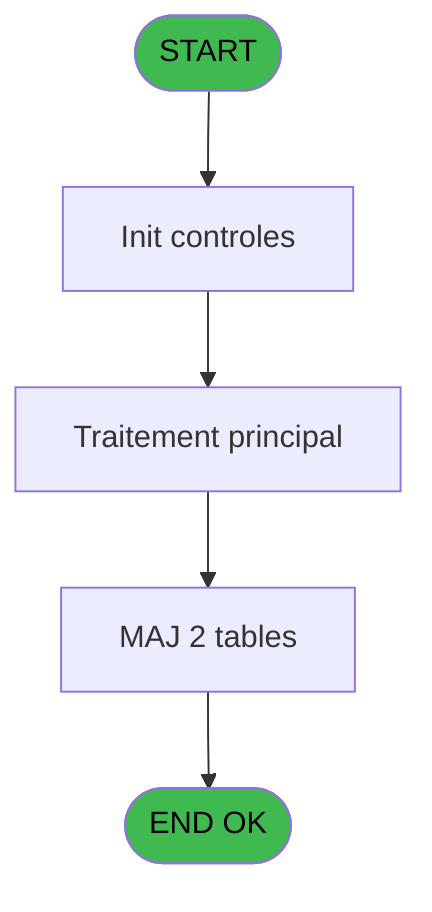
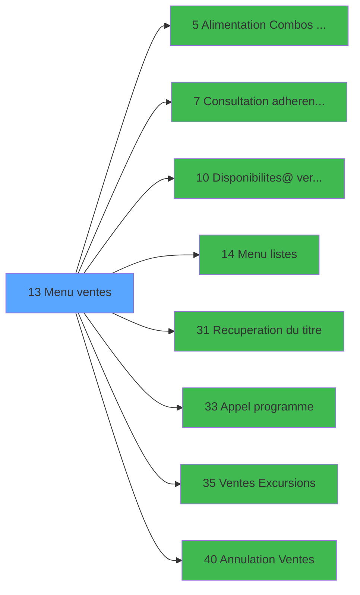

# EXF IDE 13 - Menu ventes

> **Analyse**: Phases 1-4 2026-02-03 10:56 -> 10:56 (18s) | Assemblage 10:56
> **Pipeline**: V7.2 Enrichi
> **Structure**: 4 onglets (Resume | Ecrans | Donnees | Connexions)

<!-- TAB:Resume -->

## 1. FICHE D'IDENTITE

| Attribut | Valeur |
|----------|--------|
| Projet | EXF |
| IDE Position | 13 |
| Nom Programme | Menu ventes |
| Fichier source | `Prg_13.xml` |
| Dossier IDE | Menu |
| Taches | 8 (1 ecrans visibles) |
| Tables modifiees | 2 |
| Programmes appeles | 8 |

## 2. DESCRIPTION FONCTIONNELLE

**Menu ventes** assure la gestion complete de ce processus, accessible depuis [Main Program (IDE 1)](EXF-IDE-1.md).

Le flux de traitement s'organise en **3 blocs fonctionnels** :

- **Traitement** (6 taches) : traitements metier divers
- **Calcul** (1 tache) : calculs de montants, stocks ou compteurs
- **Initialisation** (1 tache) : reinitialisation d'etats et de variables de travail

**Donnees modifiees** : 2 tables en ecriture (date_comptable___dat, reseau_cloture___rcg).

Detail : phases du traitement

#### Phase 1 : Traitement (6 taches)

- **13** - Menu parametrage **[[ECRAN]](#ecran-t1)**
- **13.1** - Test clôture boutique
- **13.1.1** - Blocage clôture v1
- **13.4** - Deblocage clôture golf
- **13.1.2** - Blocage clôture v1
- **13.5** - Deblocage clôture golf

Delegue a : [Alimentation Combos SERVICE (IDE 5)](EXF-IDE-5.md), [Consultation adherent@ GM (IDE 7)](EXF-IDE-7.md), [   Menu listes (IDE 14)](EXF-IDE-14.md), [Recuperation du titre (IDE 31)](EXF-IDE-31.md), [Appel programme (IDE 33)](EXF-IDE-33.md)

#### Phase 2 : Initialisation (1 tache)

- **13.2** - Initialisation

#### Phase 3 : Calcul (1 tache)

- **13.3** - Date comptable

#### Tables impactees

| Table | Operations | Role metier |
|-------|-----------|-------------|
| reseau_cloture___rcg | **W** (5 usages) | Donnees reseau/cloture |
| date_comptable___dat | **W** (1 usages) |  |

## 3. BLOCS FONCTIONNELS

### 3.1 Traitement (6 taches)

Traitements internes.

---

#### 13 - Menu parametrage [[ECRAN]](#ecran-t1)

**Role** : Tache d'orchestration : point d'entree du programme (6 sous-taches). Coordonne l'enchainement des traitements.
**Ecran** : 698 x 213 DLU (MDI) | [Voir mockup](#ecran-t1)

5 sous-taches directes

| Tache | Nom | Bloc |
|-------|-----|------|
| [13.1](#t2) | Test clôture boutique | Traitement |
| [13.1.1](#t3) | Blocage clôture v1 | Traitement |
| [13.4](#t6) | Deblocage clôture golf | Traitement |
| [13.1.2](#t9) | Blocage clôture v1 | Traitement |
| [13.5](#t12) | Deblocage clôture golf | Traitement |

**Delegue a** : [Alimentation Combos SERVICE (IDE 5)](EXF-IDE-5.md), [Consultation adherent@ GM (IDE 7)](EXF-IDE-7.md), [   Menu listes (IDE 14)](EXF-IDE-14.md)

---

#### 13.1 - Test clôture boutique

**Role** : Verification : Test clôture boutique.
**Delegue a** : [Alimentation Combos SERVICE (IDE 5)](EXF-IDE-5.md), [Consultation adherent@ GM (IDE 7)](EXF-IDE-7.md), [   Menu listes (IDE 14)](EXF-IDE-14.md)

---

#### 13.1.1 - Blocage clôture v1

**Role** : Traitement : Blocage clôture v1.
**Variables liees** : F (W0 blocage_clotûre)
**Delegue a** : [Alimentation Combos SERVICE (IDE 5)](EXF-IDE-5.md), [Consultation adherent@ GM (IDE 7)](EXF-IDE-7.md), [   Menu listes (IDE 14)](EXF-IDE-14.md)

---

#### 13.4 - Deblocage clôture golf

**Role** : Traitement : Deblocage clôture golf.
**Delegue a** : [Alimentation Combos SERVICE (IDE 5)](EXF-IDE-5.md), [Consultation adherent@ GM (IDE 7)](EXF-IDE-7.md), [   Menu listes (IDE 14)](EXF-IDE-14.md)

---

#### 13.1.2 - Blocage clôture v1

**Role** : Traitement : Blocage clôture v1.
**Variables liees** : F (W0 blocage_clotûre)
**Delegue a** : [Alimentation Combos SERVICE (IDE 5)](EXF-IDE-5.md), [Consultation adherent@ GM (IDE 7)](EXF-IDE-7.md), [   Menu listes (IDE 14)](EXF-IDE-14.md)

---

#### 13.5 - Deblocage clôture golf

**Role** : Traitement : Deblocage clôture golf.
**Delegue a** : [Alimentation Combos SERVICE (IDE 5)](EXF-IDE-5.md), [Consultation adherent@ GM (IDE 7)](EXF-IDE-7.md), [   Menu listes (IDE 14)](EXF-IDE-14.md)

### 3.2 Initialisation (1 tache)

Reinitialisation d'etats et variables de travail.

---

#### 13.2 - Initialisation

**Role** : Reinitialisation : Initialisation.

### 3.3 Calcul (1 tache)

Calculs metier : montants, stocks, compteurs.

---

#### 13.3 - Date comptable

**Role** : Traitement : Date comptable.
**Variables liees** : C (W0 date comptable)

## 5. REGLES METIER

*(Aucune regle metier identifiee)*

## 6. CONTEXTE

- **Appele par**: [Main Program (IDE 1)](EXF-IDE-1.md)
- **Appelle**: 8 programmes | **Tables**: 3 (W:2 R:1 L:0) | **Taches**: 8 | **Expressions**: 16

<!-- TAB:Ecrans -->

## 8. ECRANS

### 8.1 Forms visibles (1 / 8)

| # | Position | Tache | Nom | Type | Largeur | Hauteur | Bloc |
|---|----------|-------|-----|------|---------|---------|------|
| 1 | 13 | 13 | Menu parametrage | MDI | 698 | 213 | Traitement |

### 8.2 Mockups Ecrans

---

#### 13 - Menu parametrage
**Tache** : [13](#t1) | **Type** : MDI | **Dimensions** : 698 x 213 DLU
**Bloc** : Traitement | **Titre IDE** : Menu parametrage

<!-- FORM-DATA:
{
    "width":  698,
    "vFactor":  8,
    "type":  "MDI",
    "hFactor":  8,
    "controls":  [
                     {
                         "x":  0,
                         "type":  "label",
                         "var":  "",
                         "y":  1,
                         "w":  695,
                         "fmt":  "",
                         "name":  "",
                         "h":  18,
                         "color":  "",
                         "text":  "",
                         "parent":  null
                     },
                     {
                         "x":  275,
                         "type":  "label",
                         "var":  "",
                         "y":  35,
                         "w":  345,
                         "fmt":  "",
                         "name":  "",
                         "h":  130,
                         "color":  "",
                         "text":  "",
                         "parent":  null
                     },
                     {
                         "x":  302,
                         "type":  "label",
                         "var":  "",
                         "y":  44,
                         "w":  294,
                         "fmt":  "",
                         "name":  "",
                         "h":  95,
                         "color":  "6",
                         "text":  "",
                         "parent":  null
                     },
                     {
                         "x":  306,
                         "type":  "label",
                         "var":  "",
                         "y":  44,
                         "w":  290,
                         "fmt":  "",
                         "name":  "",
                         "h":  95,
                         "color":  "6",
                         "text":  "",
                         "parent":  null
                     },
                     {
                         "x":  308,
                         "type":  "label",
                         "var":  "",
                         "y":  49,
                         "w":  44,
                         "fmt":  "",
                         "name":  "",
                         "h":  89,
                         "color":  "",
                         "text":  "",
                         "parent":  7
                     },
                     {
                         "x":  361,
                         "type":  "label",
                         "var":  "",
                         "y":  53,
                         "w":  205,
                         "fmt":  "",
                         "name":  "",
                         "h":  9,
                         "color":  "146",
                         "text":  "Ventes",
                         "parent":  7
                     },
                     {
                         "x":  361,
                         "type":  "label",
                         "var":  "",
                         "y":  70,
                         "w":  205,
                         "fmt":  "",
                         "name":  "",
                         "h":  9,
                         "color":  "146",
                         "text":  "Annulation de vente",
                         "parent":  7
                     },
                     {
                         "x":  361,
                         "type":  "label",
                         "var":  "",
                         "y":  87,
                         "w":  205,
                         "fmt":  "",
                         "name":  "",
                         "h":  9,
                         "color":  "146",
                         "text":  "Edition des Ventes",
                         "parent":  7
                     },
                     {
                         "x":  361,
                         "type":  "label",
                         "var":  "",
                         "y":  104,
                         "w":  205,
                         "fmt":  "",
                         "name":  "",
                         "h":  9,
                         "color":  "146",
                         "text":  "Disponibilites",
                         "parent":  7
                     },
                     {
                         "x":  361,
                         "type":  "label",
                         "var":  "",
                         "y":  121,
                         "w":  205,
                         "fmt":  "",
                         "name":  "",
                         "h":  9,
                         "color":  "146",
                         "text":  "Consultation Adherent",
                         "parent":  7
                     },
                     {
                         "x":  364,
                         "type":  "label",
                         "var":  "",
                         "y":  146,
                         "w":  120,
                         "fmt":  "",
                         "name":  "",
                         "h":  9,
                         "color":  "",
                         "text":  "Votre choix",
                         "parent":  5
                     },
                     {
                         "x":  0,
                         "type":  "label",
                         "var":  "",
                         "y":  187,
                         "w":  692,
                         "fmt":  "",
                         "name":  "",
                         "h":  24,
                         "color":  "",
                         "text":  "",
                         "parent":  null
                     },
                     {
                         "x":  5,
                         "type":  "edit",
                         "var":  "",
                         "y":  10,
                         "w":  319,
                         "fmt":  "",
                         "name":  "",
                         "h":  8,
                         "color":  "",
                         "text":  "",
                         "parent":  1
                     },
                     {
                         "x":  500,
                         "type":  "edit",
                         "var":  "",
                         "y":  146,
                         "w":  26,
                         "fmt":  "",
                         "name":  "W0 choix action",
                         "h":  10,
                         "color":  "6",
                         "text":  "",
                         "parent":  5
                     },
                     {
                         "x":  5,
                         "type":  "edit",
                         "var":  "",
                         "y":  3,
                         "w":  267,
                         "fmt":  "20",
                         "name":  "",
                         "h":  8,
                         "color":  "",
                         "text":  "",
                         "parent":  null
                     },
                     {
                         "x":  429,
                         "type":  "edit",
                         "var":  "",
                         "y":  5,
                         "w":  259,
                         "fmt":  "WWW DD MMM YYYYT",
                         "name":  "",
                         "h":  8,
                         "color":  "",
                         "text":  "",
                         "parent":  null
                     },
                     {
                         "x":  31,
                         "type":  "image",
                         "var":  "",
                         "y":  53,
                         "w":  200,
                         "fmt":  "",
                         "name":  "",
                         "h":  79,
                         "color":  "",
                         "text":  "",
                         "parent":  null
                     },
                     {
                         "x":  318,
                         "type":  "button",
                         "var":  "",
                         "y":  53,
                         "w":  24,
                         "fmt":  "A",
                         "name":  "A",
                         "h":  9,
                         "color":  "",
                         "text":  "",
                         "parent":  8
                     },
                     {
                         "x":  318,
                         "type":  "button",
                         "var":  "",
                         "y":  70,
                         "w":  24,
                         "fmt":  "B",
                         "name":  "B",
                         "h":  9,
                         "color":  "",
                         "text":  "",
                         "parent":  8
                     },
                     {
                         "x":  318,
                         "type":  "button",
                         "var":  "",
                         "y":  87,
                         "w":  24,
                         "fmt":  "C",
                         "name":  "C",
                         "h":  9,
                         "color":  "",
                         "text":  "",
                         "parent":  8
                     },
                     {
                         "x":  318,
                         "type":  "button",
                         "var":  "",
                         "y":  104,
                         "w":  24,
                         "fmt":  "D",
                         "name":  "D",
                         "h":  9,
                         "color":  "",
                         "text":  "",
                         "parent":  8
                     },
                     {
                         "x":  318,
                         "type":  "button",
                         "var":  "",
                         "y":  121,
                         "w":  24,
                         "fmt":  "E",
                         "name":  "E",
                         "h":  9,
                         "color":  "",
                         "text":  "",
                         "parent":  8
                     },
                     {
                         "x":  6,
                         "type":  "button",
                         "var":  "",
                         "y":  190,
                         "w":  154,
                         "fmt":  "\u0026Quitter",
                         "name":  "",
                         "h":  18,
                         "color":  "",
                         "text":  "",
                         "parent":  17
                     }
                 ],
    "taskId":  "13",
    "height":  213
}
-->

<strong>Champs : 4 champs</strong>

| Pos (x,y) | Nom | Variable | Type |
|-----------|-----|----------|------|
| 5,10 | (sans nom) | - | edit |
| 500,146 | W0 choix action | - | edit |
| 5,3 | 20 | - | edit |
| 429,5 | WWW DD MMM YYYYT | - | edit |

<strong>Boutons : 6 boutons</strong>

| Bouton | Pos (x,y) | Action |
|--------|-----------|--------|
| A | 318,53 | Bouton fonctionnel |
| B | 318,70 | Bouton fonctionnel |
| C | 318,87 | Bouton fonctionnel |
| D | 318,104 | Bouton fonctionnel |
| E | 318,121 | Bouton fonctionnel |
| Quitter | 6,190 | Quitte le programme |

## 9. NAVIGATION

Ecran unique: **Menu parametrage**

### 9.3 Structure hierarchique (8 taches)

| Position | Tache | Type | Dimensions | Bloc |
|----------|-------|------|------------|------|
| **13.1** | [**Menu parametrage** (13)](#t1) [mockup](#ecran-t1) | MDI | 698x213 | Traitement |
| 13.1.1 | [Test clôture boutique (13.1)](#t2) | MDI | - | |
| 13.1.2 | [Blocage clôture v1 (13.1.1)](#t3) | MDI | - | |
| 13.1.3 | [Deblocage clôture golf (13.4)](#t6) | MDI | - | |
| 13.1.4 | [Blocage clôture v1 (13.1.2)](#t9) | MDI | - | |
| 13.1.5 | [Deblocage clôture golf (13.5)](#t12) | MDI | - | |
| **13.2** | [**Initialisation** (13.2)](#t4) | MDI | - | Initialisation |
| **13.3** | [**Date comptable** (13.3)](#t5) | MDI | - | Calcul |

### 9.4 Algorigramme

> **Legende**: Vert = START/END OK | Rouge = END KO | Bleu = Decisions
> *Algorigramme auto-genere. Utiliser `/algorigramme` pour une synthese metier detaillee.*

<!-- TAB:Donnees -->

## 10. TABLES

### Tables utilisees (3)

| ID | Nom | Description | Type | R | W | L | Usages |
|----|-----|-------------|------|---|---|---|--------|
| 69 | initialisation___ini |  | DB | R |   |   | 1 |
| 293 | date_comptable___dat |  | DB |   | **W** |   | 1 |
| 303 | reseau_cloture___rcg | Donnees reseau/cloture | DB |   | **W** |   | 5 |

### Colonnes par table (1 / 3 tables avec colonnes identifiees)

Table 69 - initialisation___ini (R) - 1 usages

*Table utilisee uniquement en Link ou aucune colonne Real identifiee dans le DataView.*

Table 293 - date_comptable___dat (**W**) - 1 usages

| Lettre | Variable | Acces | Type |
|--------|----------|-------|------|
| C | W0 date comptable | W | Date |

Table 303 - reseau_cloture___rcg (**W**) - 5 usages

*Table utilisee uniquement en Link ou aucune colonne Real identifiee dans le DataView.*

## 11. VARIABLES

### 11.1 Variables de session (1)

Variables persistantes pendant toute la session.

| Lettre | Nom | Type | Usage dans |
|--------|-----|------|-----------|
| H | v. titre | Alpha | 1x session |

### 11.2 Variables de travail (7)

Variables internes au programme.

| Lettre | Nom | Type | Usage dans |
|--------|-----|------|-----------|
| A | W0 masque montant | Alpha | - |
| B | W0 nbre decimales | Numeric | - |
| C | W0 date comptable | Date | [13.3](#t5) |
| D | W0 nom village | Alpha | - |
| E | W0 choix action | Alpha | 5x calcul interne |
| F | W0 blocage_clotûre | Alpha | 2x calcul interne |
| G | W0 Devise | Alpha | - |

## 12. EXPRESSIONS

**16 / 16 expressions decodees (100%)**

### 12.1 Repartition par type

| Type | Expressions | Regles |
|------|-------------|--------|
| CONDITION | 8 | 0 |
| CONSTANTE | 2 | 0 |
| DATE | 1 | 0 |
| REFERENCE_VG | 2 | 0 |
| OTHER | 1 | 0 |
| NEGATION | 1 | 0 |
| STRING | 1 | 0 |

### 12.2 Expressions cles par type

#### CONDITION (8 expressions)

| Type | IDE | Expression | Regle |
|------|-----|------------|-------|
| CONDITION | 6 | `W0 choix action [E]='C'` | - |
| CONDITION | 5 | `W0 choix action [E]='B'` | - |
| CONDITION | 8 | `W0 choix action [E]='E'` | - |
| CONDITION | 7 | `W0 choix action [E]='D'` | - |
| CONDITION | 2 | `W0 blocage_clotûre [F]<>'O' AND W0 date comptable [C]<>0` | - |
| ... | | *+3 autres* | |

#### CONSTANTE (2 expressions)

| Type | IDE | Expression | Regle |
|------|-----|------------|-------|
| CONSTANTE | 12 | `1` | - |
| CONSTANTE | 1 | `''` | - |

#### DATE (1 expressions)

| Type | IDE | Expression | Regle |
|------|-----|------------|-------|
| DATE | 11 | `Date ()` | - |

#### REFERENCE_VG (2 expressions)

| Type | IDE | Expression | Regle |
|------|-----|------------|-------|
| REFERENCE_VG | 16 | `VG5` | - |
| REFERENCE_VG | 10 | `VG2` | - |

#### OTHER (1 expressions)

| Type | IDE | Expression | Regle |
|------|-----|------------|-------|
| OTHER | 14 | `SetParam ('TEXCURSION','F')` | - |

#### NEGATION (1 expressions)

| Type | IDE | Expression | Regle |
|------|-----|------------|-------|
| NEGATION | 15 | `NOT VG5` | - |

#### STRING (1 expressions)

| Type | IDE | Expression | Regle |
|------|-----|------------|-------|
| STRING | 13 | `Trim (v. titre [H])` | - |

<!-- TAB:Connexions -->

## 13. GRAPHE D'APPELS

### 13.1 Chaine depuis Main (Callers)

Main -> ... -> [Main Program (IDE 1)](EXF-IDE-1.md) -> **Menu ventes (IDE 13)**

### 13.2 Callers

| IDE | Nom Programme | Nb Appels |
|-----|---------------|-----------|
| [1](EXF-IDE-1.md) | Main Program | 1 |

### 13.3 Callees (programmes appeles)

### 13.4 Detail Callees avec contexte

| IDE | Nom Programme | Appels | Contexte |
|-----|---------------|--------|----------|
| [5](EXF-IDE-5.md) | Alimentation Combos SERVICE | 1 | Sous-programme |
| [7](EXF-IDE-7.md) | Consultation adherent@ GM | 1 | Sous-programme |
| [10](EXF-IDE-10.md) | Disponibilites@ verif stat | 1 | Controle/validation |
| [14](EXF-IDE-14.md) |    Menu listes | 1 | Configuration impression |
| [31](EXF-IDE-31.md) | Recuperation du titre | 1 | Recuperation donnees |
| [33](EXF-IDE-33.md) | Appel programme | 1 | Sous-programme |
| [35](EXF-IDE-35.md) | Ventes Excursions | 1 | Sous-programme |
| [40](EXF-IDE-40.md) |  Annulation Ventes | 1 | Sous-programme |

## 14. RECOMMANDATIONS MIGRATION

### 14.1 Profil du programme

| Metrique | Valeur | Impact migration |
|----------|--------|-----------------|
| Lignes de logique | 83 | Programme compact |
| Expressions | 16 | Peu de logique |
| Tables WRITE | 2 | Impact faible |
| Sous-programmes | 8 | Dependances moderees |
| Ecrans visibles | 1 | Ecran unique ou traitement batch |
| Code desactive | 0% (0 / 83) | Code sain |
| Regles metier | 0 | Pas de regle identifiee |

### 14.2 Plan de migration par bloc

#### Traitement (6 taches: 1 ecran, 5 traitements)

- **Strategie** : Orchestrateur avec 1 ecrans (Razor/React) et 5 traitements backend (services).
- Les ecrans deviennent des composants UI, les traitements invisibles deviennent des services injectables.
- 8 sous-programme(s) a migrer ou a reutiliser depuis les services existants.
- Decomposer les taches en services unitaires testables.

#### Initialisation (1 tache: 0 ecran, 1 traitement)

- **Strategie** : Constructeur/methode `InitAsync()` dans l'orchestrateur.

#### Calcul (1 tache: 0 ecran, 1 traitement)

- **Strategie** : Services de calcul purs (Domain Services).
- Migrer la logique de calcul (stock, compteurs, montants)

### 14.3 Dependances critiques

| Dependance | Type | Appels | Impact |
|------------|------|--------|--------|
| date_comptable___dat | Table WRITE (Database) | 1x | Schema + repository |
| reseau_cloture___rcg | Table WRITE (Database) | 5x | Schema + repository |
| [Appel programme (IDE 33)](EXF-IDE-33.md) | Sous-programme | 1x | Normale - Sous-programme |
| [Recuperation du titre (IDE 31)](EXF-IDE-31.md) | Sous-programme | 1x | Normale - Recuperation donnees |
| [ Annulation Ventes (IDE 40)](EXF-IDE-40.md) | Sous-programme | 1x | Normale - Sous-programme |
| [Ventes Excursions (IDE 35)](EXF-IDE-35.md) | Sous-programme | 1x | Normale - Sous-programme |
| [Consultation adherent@ GM (IDE 7)](EXF-IDE-7.md) | Sous-programme | 1x | Normale - Sous-programme |
| [Alimentation Combos SERVICE (IDE 5)](EXF-IDE-5.md) | Sous-programme | 1x | Normale - Sous-programme |
| [   Menu listes (IDE 14)](EXF-IDE-14.md) | Sous-programme | 1x | Normale - Configuration impression |
| [Disponibilites@ verif stat (IDE 10)](EXF-IDE-10.md) | Sous-programme | 1x | Normale - Controle/validation |

---
*Spec DETAILED generee par Pipeline V7.2 - 2026-02-03 10:56*
