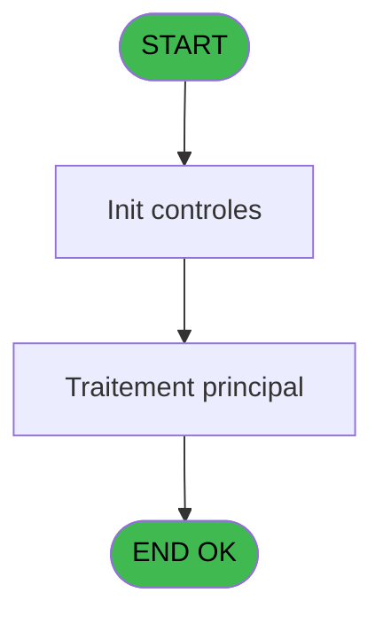
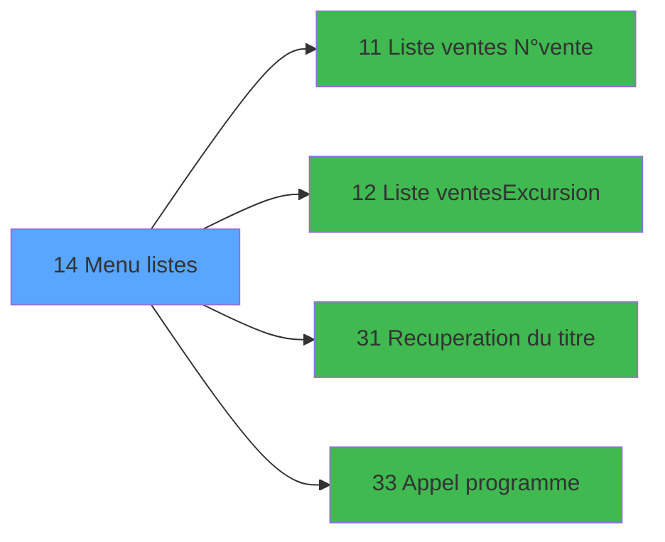

# EXF IDE 14 - Menu listes

> **Analyse**: Phases 1-4 2026-02-03 10:56 -> 10:57 (18s) | Assemblage 10:57
> **Pipeline**: V7.2 Enrichi
> **Structure**: 4 onglets (Resume | Ecrans | Donnees | Connexions)

<!-- TAB:Resume -->

## 1. FICHE D'IDENTITE

| Attribut | Valeur |
|----------|--------|
| Projet | EXF |
| IDE Position | 14 |
| Nom Programme | Menu listes |
| Fichier source | `Prg_14.xml` |
| Dossier IDE | Menu |
| Taches | 1 (1 ecrans visibles) |
| Tables modifiees | 0 |
| Programmes appeles | 4 |

## 2. DESCRIPTION FONCTIONNELLE

**Menu listes** assure la gestion complete de ce processus, accessible depuis [Menu ventes (IDE 13)](EXF-IDE-13.md).

Le flux de traitement s'organise en **1 blocs fonctionnels** :

- **Impression** (1 tache) : generation de tickets et documents

## 3. BLOCS FONCTIONNELS

### 3.1 Impression (1 tache)

Generation des documents et tickets.

---

#### 14 - Menu editions [[ECRAN]](#ecran-t1)

**Role** : Generation du document : Menu editions.
**Ecran** : 760 x 166 DLU (MDI) | [Voir mockup](#ecran-t1)

## 5. REGLES METIER

*(Aucune regle metier identifiee)*

## 6. CONTEXTE

- **Appele par**: [Menu ventes (IDE 13)](EXF-IDE-13.md)
- **Appelle**: 4 programmes | **Tables**: 0 (W:0 R:0 L:0) | **Taches**: 1 | **Expressions**: 7

<!-- TAB:Ecrans -->

## 8. ECRANS

### 8.1 Forms visibles (1 / 1)

| # | Position | Tache | Nom | Type | Largeur | Hauteur | Bloc |
|---|----------|-------|-----|------|---------|---------|------|
| 1 | 14 | 14 | Menu editions | MDI | 760 | 166 | Impression |

### 8.2 Mockups Ecrans

---

#### 14 - Menu editions
**Tache** : [14](#t1) | **Type** : MDI | **Dimensions** : 760 x 166 DLU
**Bloc** : Impression | **Titre IDE** : Menu editions

<!-- FORM-DATA:
{
    "width":  760,
    "vFactor":  8,
    "type":  "MDI",
    "hFactor":  8,
    "controls":  [
                     {
                         "x":  0,
                         "type":  "label",
                         "var":  "",
                         "y":  1,
                         "w":  752,
                         "fmt":  "",
                         "name":  "",
                         "h":  17,
                         "color":  "",
                         "text":  "",
                         "parent":  null
                     },
                     {
                         "x":  244,
                         "type":  "label",
                         "var":  "",
                         "y":  30,
                         "w":  473,
                         "fmt":  "",
                         "name":  "",
                         "h":  95,
                         "color":  "",
                         "text":  "",
                         "parent":  null
                     },
                     {
                         "x":  270,
                         "type":  "label",
                         "var":  "",
                         "y":  42,
                         "w":  407,
                         "fmt":  "",
                         "name":  "",
                         "h":  52,
                         "color":  "",
                         "text":  "",
                         "parent":  4
                     },
                     {
                         "x":  273,
                         "type":  "label",
                         "var":  "",
                         "y":  43,
                         "w":  52,
                         "fmt":  "",
                         "name":  "",
                         "h":  50,
                         "color":  "",
                         "text":  "",
                         "parent":  5
                     },
                     {
                         "x":  340,
                         "type":  "label",
                         "var":  "",
                         "y":  55,
                         "w":  321,
                         "fmt":  "",
                         "name":  "",
                         "h":  9,
                         "color":  "142",
                         "text":  "Liste des Ventes par numero",
                         "parent":  5
                     },
                     {
                         "x":  340,
                         "type":  "label",
                         "var":  "",
                         "y":  72,
                         "w":  321,
                         "fmt":  "",
                         "name":  "",
                         "h":  9,
                         "color":  "142",
                         "text":  "Liste des Ventes par excursion",
                         "parent":  5
                     },
                     {
                         "x":  390,
                         "type":  "label",
                         "var":  "",
                         "y":  107,
                         "w":  120,
                         "fmt":  "",
                         "name":  "",
                         "h":  9,
                         "color":  "",
                         "text":  "Votre choix",
                         "parent":  4
                     },
                     {
                         "x":  0,
                         "type":  "label",
                         "var":  "",
                         "y":  139,
                         "w":  752,
                         "fmt":  "",
                         "name":  "",
                         "h":  24,
                         "color":  "",
                         "text":  "",
                         "parent":  null
                     },
                     {
                         "x":  526,
                         "type":  "edit",
                         "var":  "",
                         "y":  107,
                         "w":  26,
                         "fmt":  "",
                         "name":  "",
                         "h":  10,
                         "color":  "6",
                         "text":  "",
                         "parent":  4
                     },
                     {
                         "x":  490,
                         "type":  "edit",
                         "var":  "",
                         "y":  5,
                         "w":  259,
                         "fmt":  "WWW DD MMM YYYYT",
                         "name":  "",
                         "h":  8,
                         "color":  "",
                         "text":  "",
                         "parent":  null
                     },
                     {
                         "x":  39,
                         "type":  "image",
                         "var":  "",
                         "y":  44,
                         "w":  144,
                         "fmt":  "",
                         "name":  "",
                         "h":  74,
                         "color":  "",
                         "text":  "",
                         "parent":  null
                     },
                     {
                         "x":  287,
                         "type":  "button",
                         "var":  "",
                         "y":  55,
                         "w":  24,
                         "fmt":  "A",
                         "name":  "A",
                         "h":  9,
                         "color":  "",
                         "text":  "",
                         "parent":  5
                     },
                     {
                         "x":  287,
                         "type":  "button",
                         "var":  "",
                         "y":  72,
                         "w":  24,
                         "fmt":  "B",
                         "name":  "B",
                         "h":  9,
                         "color":  "",
                         "text":  "",
                         "parent":  5
                     },
                     {
                         "x":  9,
                         "type":  "button",
                         "var":  "",
                         "y":  142,
                         "w":  168,
                         "fmt":  "\u0026Quitter",
                         "name":  "",
                         "h":  18,
                         "color":  "",
                         "text":  "",
                         "parent":  null
                     },
                     {
                         "x":  3,
                         "type":  "edit",
                         "var":  "",
                         "y":  5,
                         "w":  267,
                         "fmt":  "20",
                         "name":  "",
                         "h":  8,
                         "color":  "",
                         "text":  "",
                         "parent":  null
                     }
                 ],
    "taskId":  "14",
    "height":  166
}
-->

<strong>Champs : 3 champs</strong>

| Pos (x,y) | Nom | Variable | Type |
|-----------|-----|----------|------|
| 526,107 | (sans nom) | - | edit |
| 490,5 | WWW DD MMM YYYYT | - | edit |
| 3,5 | 20 | - | edit |

<strong>Boutons : 3 boutons</strong>

| Bouton | Pos (x,y) | Action |
|--------|-----------|--------|
| A | 287,55 | Bouton fonctionnel |
| B | 287,72 | Bouton fonctionnel |
| Quitter | 9,142 | Quitte le programme |

## 9. NAVIGATION

Ecran unique: **Menu editions**

### 9.3 Structure hierarchique (1 tache)

| Position | Tache | Type | Dimensions | Bloc |
|----------|-------|------|------------|------|
| **14.1** | [**Menu editions** (14)](#t1) [mockup](#ecran-t1) | MDI | 760x166 | Impression |

### 9.4 Algorigramme

> **Legende**: Vert = START/END OK | Rouge = END KO | Bleu = Decisions
> *Algorigramme auto-genere. Utiliser `/algorigramme` pour une synthese metier detaillee.*

<!-- TAB:Donnees -->

## 10. TABLES

### Tables utilisees (0)

| ID | Nom | Description | Type | R | W | L | Usages |
|----|-----|-------------|------|---|---|---|--------|

### Colonnes par table (0 / 0 tables avec colonnes identifiees)

## 11. VARIABLES

### 11.1 Parametres entrants (3)

Variables recues du programme appelant ([Menu ventes (IDE 13)](EXF-IDE-13.md)).

| Lettre | Nom | Type | Usage dans |
|--------|-----|------|-----------|
| A | P0 masque montant | Alpha | - |
| B | P0 date comptable | Date | - |
| C | P0 nom village | Alpha | - |

### 11.2 Variables de session (1)

Variables persistantes pendant toute la session.

| Lettre | Nom | Type | Usage dans |
|--------|-----|------|-----------|
| E | v. titre | Alpha | 1x session |

### 11.3 Variables de travail (1)

Variables internes au programme.

| Lettre | Nom | Type | Usage dans |
|--------|-----|------|-----------|
| D | W0 choix action | Alpha | 2x calcul interne |

## 12. EXPRESSIONS

**7 / 7 expressions decodees (100%)**

### 12.1 Repartition par type

| Type | Expressions | Regles |
|------|-------------|--------|
| CONSTANTE | 2 | 0 |
| DATE | 1 | 0 |
| CONDITION | 2 | 0 |
| REFERENCE_VG | 1 | 0 |
| STRING | 1 | 0 |

### 12.2 Expressions cles par type

#### CONSTANTE (2 expressions)

| Type | IDE | Expression | Regle |
|------|-----|------------|-------|
| CONSTANTE | 6 | `2` | - |
| CONSTANTE | 1 | `''` | - |

#### DATE (1 expressions)

| Type | IDE | Expression | Regle |
|------|-----|------------|-------|
| DATE | 5 | `Date ()` | - |

#### CONDITION (2 expressions)

| Type | IDE | Expression | Regle |
|------|-----|------------|-------|
| CONDITION | 3 | `W0 choix action [D]='B'` | - |
| CONDITION | 2 | `W0 choix action [D]='A'` | - |

#### REFERENCE_VG (1 expressions)

| Type | IDE | Expression | Regle |
|------|-----|------------|-------|
| REFERENCE_VG | 4 | `VG2` | - |

#### STRING (1 expressions)

| Type | IDE | Expression | Regle |
|------|-----|------------|-------|
| STRING | 7 | `Trim (v. titre [E])` | - |

<!-- TAB:Connexions -->

## 13. GRAPHE D'APPELS

### 13.1 Chaine depuis Main (Callers)

Main -> ... -> [Menu ventes (IDE 13)](EXF-IDE-13.md) -> **Menu listes (IDE 14)**

### 13.2 Callers

| IDE | Nom Programme | Nb Appels |
|-----|---------------|-----------|
| [13](EXF-IDE-13.md) | Menu ventes | 1 |

### 13.3 Callees (programmes appeles)

### 13.4 Detail Callees avec contexte

| IDE | Nom Programme | Appels | Contexte |
|-----|---------------|--------|----------|
| [11](EXF-IDE-11.md) | Liste ventes /N°vente | 1 | Configuration impression |
| [12](EXF-IDE-12.md) | Liste ventes/Excursion | 1 | Configuration impression |
| [31](EXF-IDE-31.md) | Recuperation du titre | 1 | Recuperation donnees |
| [33](EXF-IDE-33.md) | Appel programme | 1 | Sous-programme |

## 14. RECOMMANDATIONS MIGRATION

### 14.1 Profil du programme

| Metrique | Valeur | Impact migration |
|----------|--------|-----------------|
| Lignes de logique | 12 | Programme compact |
| Expressions | 7 | Peu de logique |
| Tables WRITE | 0 | Impact faible |
| Sous-programmes | 4 | Peu de dependances |
| Ecrans visibles | 1 | Ecran unique ou traitement batch |
| Code desactive | 0% (0 / 12) | Code sain |
| Regles metier | 0 | Pas de regle identifiee |

### 14.2 Plan de migration par bloc

#### Impression (1 tache: 1 ecran, 0 traitement)

- **Strategie** : Templates HTML -> PDF via wkhtmltopdf ou Puppeteer.
- `PrintService` injectable avec choix imprimante

### 14.3 Dependances critiques

| Dependance | Type | Appels | Impact |
|------------|------|--------|--------|
| [Recuperation du titre (IDE 31)](EXF-IDE-31.md) | Sous-programme | 1x | Normale - Recuperation donnees |
| [Appel programme (IDE 33)](EXF-IDE-33.md) | Sous-programme | 1x | Normale - Sous-programme |
| [Liste ventes /N°vente (IDE 11)](EXF-IDE-11.md) | Sous-programme | 1x | Normale - Configuration impression |
| [Liste ventes/Excursion (IDE 12)](EXF-IDE-12.md) | Sous-programme | 1x | Normale - Configuration impression |

---
*Spec DETAILED generee par Pipeline V7.2 - 2026-02-03 10:57*
