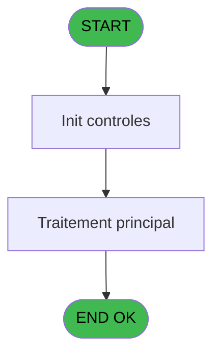
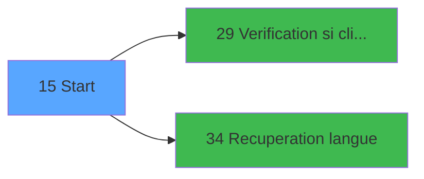

# EXF IDE 15 - Start

> **Analyse**: Phases 1-4 2026-02-03 10:57 -> 10:57 (16s) | Assemblage 10:57
> **Pipeline**: V7.2 Enrichi
> **Structure**: 4 onglets (Resume | Ecrans | Donnees | Connexions)

<!-- TAB:Resume -->

## 1. FICHE D'IDENTITE

| Attribut | Valeur |
|----------|--------|
| Projet | EXF |
| IDE Position | 15 |
| Nom Programme | Start |
| Fichier source | `Prg_15.xml` |
| Dossier IDE | Printer |
| Taches | 3 (0 ecrans visibles) |
| Tables modifiees | 0 |
| Programmes appeles | 2 |

## 2. DESCRIPTION FONCTIONNELLE

**Start** assure la gestion complete de ce processus, accessible depuis [Main Program (IDE 1)](EXF-IDE-1.md).

Le flux de traitement s'organise en **2 blocs fonctionnels** :

- **Calcul** (2 taches) : calculs de montants, stocks ou compteurs
- **Traitement** (1 tache) : traitements metier divers

Detail : phases du traitement

#### Phase 1 : Traitement (1 tache)

- **15** - Start

Delegue a : [Recuperation langue (IDE 34)](EXF-IDE-34.md)

#### Phase 2 : Calcul (2 taches)

- **15.1** - Date comptable
- **15.2** - Date comptable

## 3. BLOCS FONCTIONNELS

### 3.1 Traitement (1 tache)

Traitements internes.

---

#### 15 - Start

**Role** : Traitement : Start.
**Delegue a** : [Recuperation langue (IDE 34)](EXF-IDE-34.md)

### 3.2 Calcul (2 taches)

Calculs metier : montants, stocks, compteurs.

---

#### 15.1 - Date comptable

**Role** : Traitement : Date comptable.

---

#### 15.2 - Date comptable

**Role** : Traitement : Date comptable.

## 5. REGLES METIER

*(Aucune regle metier identifiee)*

## 6. CONTEXTE

- **Appele par**: [Main Program (IDE 1)](EXF-IDE-1.md)
- **Appelle**: 2 programmes | **Tables**: 1 (W:0 R:1 L:0) | **Taches**: 3 | **Expressions**: 14

<!-- TAB:Ecrans -->

## 8. ECRANS

*(Programme sans ecran visible)*

## 9. NAVIGATION

### 9.3 Structure hierarchique (3 taches)

| Position | Tache | Type | Dimensions | Bloc |
|----------|-------|------|------------|------|
| **15.1** | [**Start** (15)](#t1) | MDI | - | Traitement |
| **15.2** | [**Date comptable** (15.1)](#t8) | MDI | - | Calcul |
| 15.2.1 | [Date comptable (15.2)](#t11) | MDI | - | |

### 9.4 Algorigramme

> **Legende**: Vert = START/END OK | Rouge = END KO | Bleu = Decisions
> *Algorigramme auto-genere. Utiliser `/algorigramme` pour une synthese metier detaillee.*

<!-- TAB:Donnees -->

## 10. TABLES

### Tables utilisees (1)

| ID | Nom | Description | Type | R | W | L | Usages |
|----|-----|-------------|------|---|---|---|--------|
| 870 | Rayons_Boutique |  | DB | R |   |   | 2 |

### Colonnes par table (0 / 1 tables avec colonnes identifiees)

Table 870 - Rayons_Boutique (R) - 2 usages

*Table utilisee uniquement en Link ou aucune colonne Real identifiee dans le DataView.*

## 11. VARIABLES

### 11.1 Variables de session (1)

Variables persistantes pendant toute la session.

| Lettre | Nom | Type | Usage dans |
|--------|-----|------|-----------|
| B | v.TPE Actif ? | Logical | - |

### 11.2 Variables de travail (1)

Variables internes au programme.

| Lettre | Nom | Type | Usage dans |
|--------|-----|------|-----------|
| A | W0 connection ? | Logical | 2x calcul interne |

## 12. EXPRESSIONS

**14 / 14 expressions decodees (100%)**

### 12.1 Repartition par type

| Type | Expressions | Regles |
|------|-------------|--------|
| CONSTANTE | 3 | 0 |
| OTHER | 8 | 0 |
| NEGATION | 2 | 0 |
| REFERENCE_VG | 1 | 0 |

### 12.2 Expressions cles par type

#### CONSTANTE (3 expressions)

| Type | IDE | Expression | Regle |
|------|-----|------------|-------|
| CONSTANTE | 11 | `'1.00'` | - |
| CONSTANTE | 10 | `'TPE'` | - |
| CONSTANTE | 9 | `'EXADM'` | - |

#### OTHER (8 expressions)

| Type | IDE | Expression | Regle |
|------|-----|------------|-------|
| OTHER | 7 | `SetParam ('LISTINGNUMPRINTERCHOICE',0)` | - |
| OTHER | 6 | `SetParam ('NUMBERCOPIES',0)` | - |
| OTHER | 12 | `[D]` | - |
| OTHER | 8 | `SetParam ('CHAINEDLISTING','NO')` | - |
| OTHER | 2 | `W0 connection ? [A]` | - |
| ... | | *+3 autres* | |

#### NEGATION (2 expressions)

| Type | IDE | Expression | Regle |
|------|-----|------------|-------|
| NEGATION | 13 | `NOT VG5` | - |
| NEGATION | 3 | `NOT (W0 connection ? [A])` | - |

#### REFERENCE_VG (1 expressions)

| Type | IDE | Expression | Regle |
|------|-----|------------|-------|
| REFERENCE_VG | 14 | `VG5` | - |

<!-- TAB:Connexions -->

## 13. GRAPHE D'APPELS

### 13.1 Chaine depuis Main (Callers)

Main -> ... -> [Main Program (IDE 1)](EXF-IDE-1.md) -> **Start (IDE 15)**

### 13.2 Callers

| IDE | Nom Programme | Nb Appels |
|-----|---------------|-----------|
| [1](EXF-IDE-1.md) | Main Program | 1 |

### 13.3 Callees (programmes appeles)

### 13.4 Detail Callees avec contexte

| IDE | Nom Programme | Appels | Contexte |
|-----|---------------|--------|----------|
| [29](EXF-IDE-29.md) | Verification si client/serveur | 1 | Controle/validation |
| [34](EXF-IDE-34.md) | Recuperation langue | 1 | Recuperation donnees |

## 14. RECOMMANDATIONS MIGRATION

### 14.1 Profil du programme

| Metrique | Valeur | Impact migration |
|----------|--------|-----------------|
| Lignes de logique | 38 | Programme compact |
| Expressions | 14 | Peu de logique |
| Tables WRITE | 0 | Impact faible |
| Sous-programmes | 2 | Peu de dependances |
| Ecrans visibles | 0 | Ecran unique ou traitement batch |
| Code desactive | 0% (0 / 38) | Code sain |
| Regles metier | 0 | Pas de regle identifiee |

### 14.2 Plan de migration par bloc

#### Traitement (1 tache: 0 ecran, 1 traitement)

- **Strategie** : 1 service(s) backend injectable(s) (Domain Services).
- 2 sous-programme(s) a migrer ou a reutiliser depuis les services existants.
- Decomposer les taches en services unitaires testables.

#### Calcul (2 taches: 0 ecran, 2 traitements)

- **Strategie** : Services de calcul purs (Domain Services).
- Migrer la logique de calcul (stock, compteurs, montants)

### 14.3 Dependances critiques

| Dependance | Type | Appels | Impact |
|------------|------|--------|--------|
| [Recuperation langue (IDE 34)](EXF-IDE-34.md) | Sous-programme | 1x | Normale - Recuperation donnees |
| [Verification si client/serveur (IDE 29)](EXF-IDE-29.md) | Sous-programme | 1x | Normale - Controle/validation |

---
*Spec DETAILED generee par Pipeline V7.2 - 2026-02-03 10:57*
