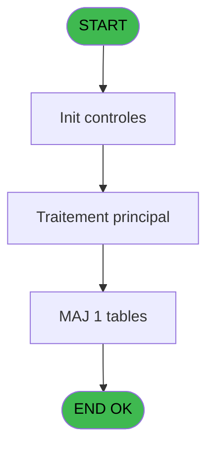
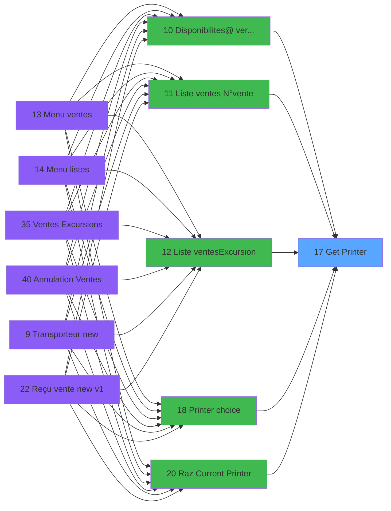

# EXF IDE 17 - Get Printer

> **Analyse**: Phases 1-4 2026-02-03 10:58 -> 10:58 (16s) | Assemblage 10:58
> **Pipeline**: V7.2 Enrichi
> **Structure**: 4 onglets (Resume | Ecrans | Donnees | Connexions)

<!-- TAB:Resume -->

## 1. FICHE D'IDENTITE

| Attribut | Valeur |
|----------|--------|
| Projet | EXF |
| IDE Position | 17 |
| Nom Programme | Get Printer |
| Fichier source | `Prg_17.xml` |
| Dossier IDE | Printer |
| Taches | 3 (0 ecrans visibles) |
| Tables modifiees | 1 |
| Programmes appeles | 1 |

## 2. DESCRIPTION FONCTIONNELLE

**Get Printer** assure la gestion complete de ce processus, accessible depuis [Ventes Excursions (IDE 35)](EXF-IDE-35.md), [Disponibilites@ verif stat (IDE 10)](EXF-IDE-10.md), [Liste ventes /N°vente (IDE 11)](EXF-IDE-11.md), [Liste ventes/Excursion (IDE 12)](EXF-IDE-12.md), [Printer choice (IDE 18)](EXF-IDE-18.md), [Raz Current Printer (IDE 20)](EXF-IDE-20.md), [ Annulation Ventes (IDE 40)](EXF-IDE-40.md).

Le flux de traitement s'organise en **2 blocs fonctionnels** :

- **Traitement** (2 taches) : traitements metier divers
- **Impression** (1 tache) : generation de tickets et documents

**Donnees modifiees** : 1 tables en ecriture (pv_accounting_date).

Detail : phases du traitement

#### Phase 1 : Impression (1 tache)

- **17** - Get Printer

#### Phase 2 : Traitement (2 taches)

- **17.1** - G
- **17.2** - G

Delegue a : [Set Village Address (IDE 16)](EXF-IDE-16.md)

#### Tables impactees

| Table | Operations | Role metier |
|-------|-----------|-------------|
| pv_accounting_date | **W** (2 usages) |  |

## 3. BLOCS FONCTIONNELS

### 3.1 Impression (1 tache)

Generation des documents et tickets.

---

#### 17 - Get Printer

**Role** : Generation du document : Get Printer.

### 3.2 Traitement (2 taches)

Traitements internes.

---

#### 17.1 - G

**Role** : Traitement interne.

---

#### 17.2 - G

**Role** : Traitement interne.

## 5. REGLES METIER

*(Aucune regle metier identifiee)*

## 6. CONTEXTE

- **Appele par**: [Ventes Excursions (IDE 35)](EXF-IDE-35.md), [Disponibilites@ verif stat (IDE 10)](EXF-IDE-10.md), [Liste ventes /N°vente (IDE 11)](EXF-IDE-11.md), [Liste ventes/Excursion (IDE 12)](EXF-IDE-12.md), [Printer choice (IDE 18)](EXF-IDE-18.md), [Raz Current Printer (IDE 20)](EXF-IDE-20.md), [ Annulation Ventes (IDE 40)](EXF-IDE-40.md)
- **Appelle**: 1 programmes | **Tables**: 3 (W:1 R:1 L:1) | **Taches**: 3 | **Expressions**: 14

<!-- TAB:Ecrans -->

## 8. ECRANS

*(Programme sans ecran visible)*

## 9. NAVIGATION

### 9.3 Structure hierarchique (3 taches)

| Position | Tache | Type | Dimensions | Bloc |
|----------|-------|------|------------|------|
| **17.1** | [**Get Printer** (17)](#t1) | MDI | - | Impression |
| **17.2** | [**G** (17.1)](#t5) | - | - | Traitement |
| 17.2.1 | [G (17.2)](#t8) | - | - | |

### 9.4 Algorigramme

> **Legende**: Vert = START/END OK | Rouge = END KO | Bleu = Decisions
> *Algorigramme auto-genere. Utiliser `/algorigramme` pour une synthese metier detaillee.*

<!-- TAB:Donnees -->

## 10. TABLES

### Tables utilisees (3)

| ID | Nom | Description | Type | R | W | L | Usages |
|----|-----|-------------|------|---|---|---|--------|
| 367 | pms_print_param_default |  | DB | R |   |   | 1 |
| 369 | presents_par_nationalite |  | DB |   |   | L | 1 |
| 370 | pv_accounting_date |  | DB |   | **W** |   | 2 |

### Colonnes par table (1 / 2 tables avec colonnes identifiees)

Table 367 - pms_print_param_default (R) - 1 usages

| Lettre | Variable | Acces | Type |
|--------|----------|-------|------|
| A | v.Imprimante | R | Numeric |
| B | v.Copies | R | Numeric |

Table 370 - pv_accounting_date (**W**) - 2 usages

*Table utilisee uniquement en Link ou aucune colonne Real identifiee dans le DataView.*

## 11. VARIABLES

### 11.1 Variables de session (2)

Variables persistantes pendant toute la session.

| Lettre | Nom | Type | Usage dans |
|--------|-----|------|-----------|
| A | v.Imprimante | Numeric | - |
| B | v.Copies | Numeric | - |

## 12. EXPRESSIONS

**14 / 14 expressions decodees (100%)**

### 12.1 Repartition par type

| Type | Expressions | Regles |
|------|-------------|--------|
| OTHER | 7 | 0 |
| CONDITION | 4 | 0 |
| NEGATION | 1 | 0 |
| REFERENCE_VG | 2 | 0 |

### 12.2 Expressions cles par type

#### OTHER (7 expressions)

| Type | IDE | Expression | Regle |
|------|-----|------------|-------|
| OTHER | 6 | `SetParam ('CURRENTPRINTERNUM',[C])` | - |
| OTHER | 7 | `SetParam ('CURRENTPRINTERNAME',[I])` | - |
| OTHER | 10 | `SetParam ('NUMBERCOPIES',[D])` | - |
| OTHER | 5 | `SetParam ('DEFAULTPRINTERNAME',[I])` | - |
| OTHER | 1 | `GetParam ('CURRENTLISTINGNUM')` | - |
| ... | | *+2 autres* | |

#### CONDITION (4 expressions)

| Type | IDE | Expression | Regle |
|------|-----|------------|-------|
| CONDITION | 9 | `GetParam ('CURRENTPRINTERNAME')='VOID'` | - |
| CONDITION | 11 | `GetParam ('NUMBERCOPIES')=0` | - |
| CONDITION | 3 | `SetParam ('CURRENTLISTINGNAME',IF (GetParam ('CODELANGUE')='FRA',[F],IF ([G]='',[F],[G])))` | - |
| CONDITION | 8 | `GetParam ('CURRENTPRINTERNUM')=0` | - |

#### NEGATION (1 expressions)

| Type | IDE | Expression | Regle |
|------|-----|------------|-------|
| NEGATION | 12 | `NOT VG5` | - |

#### REFERENCE_VG (2 expressions)

| Type | IDE | Expression | Regle |
|------|-----|------------|-------|
| REFERENCE_VG | 14 | `VG239` | - |
| REFERENCE_VG | 13 | `VG5` | - |

<!-- TAB:Connexions -->

## 13. GRAPHE D'APPELS

### 13.1 Chaine depuis Main (Callers)

Main -> ... -> [Ventes Excursions (IDE 35)](EXF-IDE-35.md) -> **Get Printer (IDE 17)**

Main -> ... -> [Disponibilites@ verif stat (IDE 10)](EXF-IDE-10.md) -> **Get Printer (IDE 17)**

Main -> ... -> [Liste ventes /N°vente (IDE 11)](EXF-IDE-11.md) -> **Get Printer (IDE 17)**

Main -> ... -> [Liste ventes/Excursion (IDE 12)](EXF-IDE-12.md) -> **Get Printer (IDE 17)**

Main -> ... -> [Printer choice (IDE 18)](EXF-IDE-18.md) -> **Get Printer (IDE 17)**

Main -> ... -> [Raz Current Printer (IDE 20)](EXF-IDE-20.md) -> **Get Printer (IDE 17)**

Main -> ... -> [ Annulation Ventes (IDE 40)](EXF-IDE-40.md) -> **Get Printer (IDE 17)**

### 13.2 Callers

| IDE | Nom Programme | Nb Appels |
|-----|---------------|-----------|
| [35](EXF-IDE-35.md) | Ventes Excursions | 4 |
| [10](EXF-IDE-10.md) | Disponibilites@ verif stat | 1 |
| [11](EXF-IDE-11.md) | Liste ventes /N°vente | 1 |
| [12](EXF-IDE-12.md) | Liste ventes/Excursion | 1 |
| [18](EXF-IDE-18.md) | Printer choice | 1 |
| [20](EXF-IDE-20.md) | Raz Current Printer | 1 |
| [40](EXF-IDE-40.md) |  Annulation Ventes | 1 |

### 13.3 Callees (programmes appeles)

### 13.4 Detail Callees avec contexte

| IDE | Nom Programme | Appels | Contexte |
|-----|---------------|--------|----------|
| [16](EXF-IDE-16.md) | Set Village Address | 1 | Sous-programme |

## 14. RECOMMANDATIONS MIGRATION

### 14.1 Profil du programme

| Metrique | Valeur | Impact migration |
|----------|--------|-----------------|
| Lignes de logique | 44 | Programme compact |
| Expressions | 14 | Peu de logique |
| Tables WRITE | 1 | Impact faible |
| Sous-programmes | 1 | Peu de dependances |
| Ecrans visibles | 0 | Ecran unique ou traitement batch |
| Code desactive | 0% (0 / 44) | Code sain |
| Regles metier | 0 | Pas de regle identifiee |

### 14.2 Plan de migration par bloc

#### Impression (1 tache: 0 ecran, 1 traitement)

- **Strategie** : Templates HTML -> PDF via wkhtmltopdf ou Puppeteer.
- `PrintService` injectable avec choix imprimante

#### Traitement (2 taches: 0 ecran, 2 traitements)

- **Strategie** : 2 service(s) backend injectable(s) (Domain Services).
- 1 sous-programme(s) a migrer ou a reutiliser depuis les services existants.
- Decomposer les taches en services unitaires testables.

### 14.3 Dependances critiques

| Dependance | Type | Appels | Impact |
|------------|------|--------|--------|
| pv_accounting_date | Table WRITE (Database) | 2x | Schema + repository |
| [Set Village Address (IDE 16)](EXF-IDE-16.md) | Sous-programme | 1x | Normale - Sous-programme |

---
*Spec DETAILED generee par Pipeline V7.2 - 2026-02-03 10:58*
