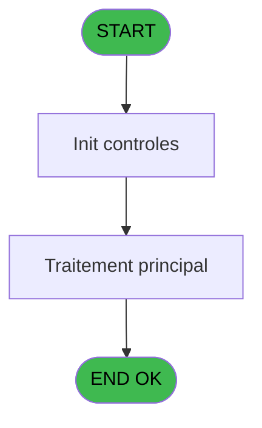
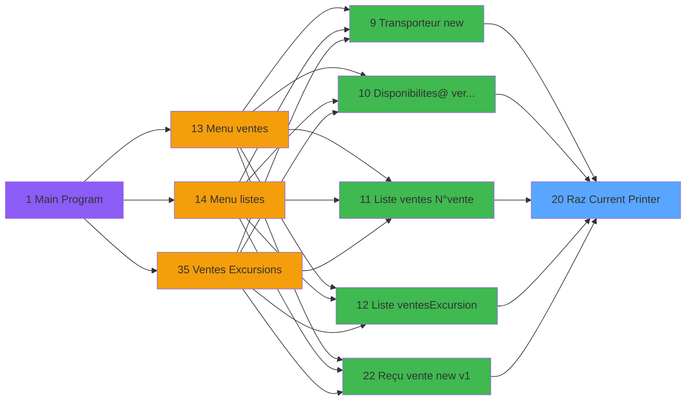

# EXF IDE 20 - Raz Current Printer

> **Analyse**: Phases 1-4 2026-02-03 10:59 -> 10:59 (20s) | Assemblage 10:59
> **Pipeline**: V7.2 Enrichi
> **Structure**: 4 onglets (Resume | Ecrans | Donnees | Connexions)

<!-- TAB:Resume -->

## 1. FICHE D'IDENTITE

| Attribut | Valeur |
|----------|--------|
| Projet | EXF |
| IDE Position | 20 |
| Nom Programme | Raz Current Printer |
| Fichier source | `Prg_20.xml` |
| Dossier IDE | Printer |
| Taches | 1 (0 ecrans visibles) |
| Tables modifiees | 0 |
| Programmes appeles | 1 |

## 2. DESCRIPTION FONCTIONNELLE

**Raz Current Printer** assure la gestion complete de ce processus, accessible depuis [Transporteur new (IDE 9)](EXF-IDE-9.md), [Disponibilites@ verif stat (IDE 10)](EXF-IDE-10.md), [Liste ventes /N°vente (IDE 11)](EXF-IDE-11.md), [Liste ventes/Excursion (IDE 12)](EXF-IDE-12.md), [Reçu vente new v1 (IDE 22)](EXF-IDE-22.md), [Reçu vente new T2H (IDE 23)](EXF-IDE-23.md), [Reçu annulation new (IDE 24)](EXF-IDE-24.md), [Reçu duplicata new (IDE 25)](EXF-IDE-25.md), [Ventes Excursions (IDE 35)](EXF-IDE-35.md), [ Annulation Ventes (IDE 40)](EXF-IDE-40.md).

Le flux de traitement s'organise en **1 blocs fonctionnels** :

- **Impression** (1 tache) : generation de tickets et documents

## 3. BLOCS FONCTIONNELS

### 3.1 Impression (1 tache)

Generation des documents et tickets.

---

#### 20 - Raz Current Printer

**Role** : Generation du document : Raz Current Printer.
**Delegue a** : [Get Printer (IDE 17)](EXF-IDE-17.md)

## 5. REGLES METIER

*(Aucune regle metier identifiee)*

## 6. CONTEXTE

- **Appele par**: [Transporteur new (IDE 9)](EXF-IDE-9.md), [Disponibilites@ verif stat (IDE 10)](EXF-IDE-10.md), [Liste ventes /N°vente (IDE 11)](EXF-IDE-11.md), [Liste ventes/Excursion (IDE 12)](EXF-IDE-12.md), [Reçu vente new v1 (IDE 22)](EXF-IDE-22.md), [Reçu vente new T2H (IDE 23)](EXF-IDE-23.md), [Reçu annulation new (IDE 24)](EXF-IDE-24.md), [Reçu duplicata new (IDE 25)](EXF-IDE-25.md), [Ventes Excursions (IDE 35)](EXF-IDE-35.md), [ Annulation Ventes (IDE 40)](EXF-IDE-40.md)
- **Appelle**: 1 programmes | **Tables**: 0 (W:0 R:0 L:0) | **Taches**: 1 | **Expressions**: 5

<!-- TAB:Ecrans -->

## 8. ECRANS

*(Programme sans ecran visible)*

## 9. NAVIGATION

### 9.3 Structure hierarchique (1 tache)

| Position | Tache | Type | Dimensions | Bloc |
|----------|-------|------|------------|------|
| **20.1** | [**Raz Current Printer** (20)](#t1) | MDI | - | Impression |

### 9.4 Algorigramme

> **Legende**: Vert = START/END OK | Rouge = END KO | Bleu = Decisions
> *Algorigramme auto-genere. Utiliser `/algorigramme` pour une synthese metier detaillee.*

<!-- TAB:Donnees -->

## 10. TABLES

### Tables utilisees (0)

| ID | Nom | Description | Type | R | W | L | Usages |
|----|-----|-------------|------|---|---|---|--------|

### Colonnes par table (0 / 0 tables avec colonnes identifiees)

## 11. VARIABLES

*(Programme sans variables locales mappees)*

## 12. EXPRESSIONS

**5 / 5 expressions decodees (100%)**

### 12.1 Repartition par type

| Type | Expressions | Regles |
|------|-------------|--------|
| OTHER | 5 | 0 |

### 12.2 Expressions cles par type

#### OTHER (5 expressions)

| Type | IDE | Expression | Regle |
|------|-----|------------|-------|
| OTHER | 4 | `SetParam ('NUMBERCOPIES',0)` | - |
| OTHER | 5 | `SetParam ('LISTINGNUMPRINTERCHOICE',0)` | - |
| OTHER | 3 | `SetParam ('SPECIFICPRINT','VOID')` | - |
| OTHER | 1 | `SetParam ('CURRENTPRINTERNUM',0)` | - |
| OTHER | 2 | `SetParam ('CURRENTPRINTERNAME','VOID')` | - |

<!-- TAB:Connexions -->

## 13. GRAPHE D'APPELS

### 13.1 Chaine depuis Main (Callers)

Main -> ... -> [Transporteur new (IDE 9)](EXF-IDE-9.md) -> **Raz Current Printer (IDE 20)**

Main -> ... -> [Disponibilites@ verif stat (IDE 10)](EXF-IDE-10.md) -> **Raz Current Printer (IDE 20)**

Main -> ... -> [Liste ventes /N°vente (IDE 11)](EXF-IDE-11.md) -> **Raz Current Printer (IDE 20)**

Main -> ... -> [Liste ventes/Excursion (IDE 12)](EXF-IDE-12.md) -> **Raz Current Printer (IDE 20)**

Main -> ... -> [Reçu vente new v1 (IDE 22)](EXF-IDE-22.md) -> **Raz Current Printer (IDE 20)**

Main -> ... -> [Reçu vente new T2H (IDE 23)](EXF-IDE-23.md) -> **Raz Current Printer (IDE 20)**

Main -> ... -> [Reçu annulation new (IDE 24)](EXF-IDE-24.md) -> **Raz Current Printer (IDE 20)**

Main -> ... -> [Reçu duplicata new (IDE 25)](EXF-IDE-25.md) -> **Raz Current Printer (IDE 20)**

Main -> ... -> [Ventes Excursions (IDE 35)](EXF-IDE-35.md) -> **Raz Current Printer (IDE 20)**

Main -> ... -> [ Annulation Ventes (IDE 40)](EXF-IDE-40.md) -> **Raz Current Printer (IDE 20)**

### 13.2 Callers

| IDE | Nom Programme | Nb Appels |
|-----|---------------|-----------|
| [9](EXF-IDE-9.md) | Transporteur new | 1 |
| [10](EXF-IDE-10.md) | Disponibilites@ verif stat | 1 |
| [11](EXF-IDE-11.md) | Liste ventes /N°vente | 1 |
| [12](EXF-IDE-12.md) | Liste ventes/Excursion | 1 |
| [22](EXF-IDE-22.md) | Reçu vente new v1 | 1 |
| [23](EXF-IDE-23.md) | Reçu vente new T2H | 1 |
| [24](EXF-IDE-24.md) | Reçu annulation new | 1 |
| [25](EXF-IDE-25.md) | Reçu duplicata new | 1 |
| [35](EXF-IDE-35.md) | Ventes Excursions | 1 |
| [40](EXF-IDE-40.md) |  Annulation Ventes | 1 |

### 13.3 Callees (programmes appeles)

### 13.4 Detail Callees avec contexte

| IDE | Nom Programme | Appels | Contexte |
|-----|---------------|--------|----------|
| [17](EXF-IDE-17.md) | Get Printer | 1 | Impression ticket/document |

## 14. RECOMMANDATIONS MIGRATION

### 14.1 Profil du programme

| Metrique | Valeur | Impact migration |
|----------|--------|-----------------|
| Lignes de logique | 11 | Programme compact |
| Expressions | 5 | Peu de logique |
| Tables WRITE | 0 | Impact faible |
| Sous-programmes | 1 | Peu de dependances |
| Ecrans visibles | 0 | Ecran unique ou traitement batch |
| Code desactive | 0% (0 / 11) | Code sain |
| Regles metier | 0 | Pas de regle identifiee |

### 14.2 Plan de migration par bloc

#### Impression (1 tache: 0 ecran, 1 traitement)

- **Strategie** : Templates HTML -> PDF via wkhtmltopdf ou Puppeteer.
- `PrintService` injectable avec choix imprimante

### 14.3 Dependances critiques

| Dependance | Type | Appels | Impact |
|------------|------|--------|--------|
| [Get Printer (IDE 17)](EXF-IDE-17.md) | Sous-programme | 1x | Normale - Impression ticket/document |

---
*Spec DETAILED generee par Pipeline V7.2 - 2026-02-03 10:59*
