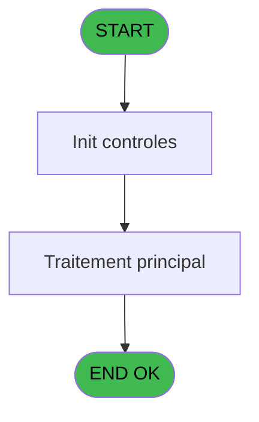

# EXF IDE 23 - Reçu vente new T2H

> **Analyse**: Phases 1-4 2026-02-03 11:00 -> 11:01 (18s) | Assemblage 11:01
> **Pipeline**: V7.2 Enrichi
> **Structure**: 4 onglets (Resume | Ecrans | Donnees | Connexions)

<!-- TAB:Resume -->

## 1. FICHE D'IDENTITE

| Attribut | Valeur |
|----------|--------|
| Projet | EXF |
| IDE Position | 23 |
| Nom Programme | Reçu vente new T2H |
| Fichier source | `Prg_23.xml` |
| Dossier IDE | Recu |
| Taches | 29 (0 ecrans visibles) |
| Tables modifiees | 0 |
| Programmes appeles | 1 |

## 2. DESCRIPTION FONCTIONNELLE

**Reçu vente new T2H** assure la gestion complete de ce processus, accessible depuis [Ventes Excursions (IDE 35)](EXF-IDE-35.md).

Le flux de traitement s'organise en **2 blocs fonctionnels** :

- **Traitement** (24 taches) : traitements metier divers
- **Impression** (5 taches) : generation de tickets et documents

Detail : phases du traitement

#### Phase 1 : Traitement (24 taches)

- **23** - Veuillez patienter... **[[ECRAN]](#ecran-t1)**
- **23.1.1** - Impression
- **23.1.1.1** - Impression
- **23.1.1.1.1** - Participants
- **23.1.2** - Impression
- **23.1.2.1** - Impression
- **23.1.2.1.1** - Participants
- **23.2.1** - Impression
- **23.2.1.1** - Impression
- **23.2.1.1.1** - Participants
- **23.2.2** - Impression
- **23.2.2.1** - Impression
- **23.2.2.1.1** - Participants
- **23.3.1** - Impression
- **23.3.1.1** - Impression
- **23.3.1.2** - Impression
- **23.3.1.2.1** - Participants
- **23.4.1** - Impression
- **23.4.1.1** - Impression
- **23.4.1.2** - Impression
- **23.4.1.2.1** - Participants
- **23.5.1** - Impression
- **23.5.1.1** - Impression
- **23.5.1.1.1** - Participants

#### Phase 2 : Impression (5 taches)

- **23.1** - Printer 1
- **23.2** - Printer 4
- **23.3** - Printer 6
- **23.4** - Printer 8
- **23.5** - Printer 9

Delegue a : [Raz Current Printer (IDE 20)](EXF-IDE-20.md)

## 3. BLOCS FONCTIONNELS

### 3.1 Traitement (24 taches)

Traitements internes.

---

#### 23 - Veuillez patienter... [[ECRAN]](#ecran-t1)

**Role** : Tache d'orchestration : point d'entree du programme (24 sous-taches). Coordonne l'enchainement des traitements.
**Ecran** : 427 x 60 DLU (MDI) | [Voir mockup](#ecran-t1)

23 sous-taches directes

| Tache | Nom | Bloc |
|-------|-----|------|
| [23.1.1](#t4) | Impression | Traitement |
| [23.1.1.1](#t5) | Impression | Traitement |
| [23.1.1.1.1](#t6) | Participants | Traitement |
| [23.1.2](#t7) | Impression | Traitement |
| [23.1.2.1](#t8) | Impression | Traitement |
| [23.1.2.1.1](#t9) | Participants | Traitement |
| [23.2.1](#t11) | Impression | Traitement |
| [23.2.1.1](#t12) | Impression | Traitement |
| [23.2.1.1.1](#t13) | Participants | Traitement |
| [23.2.2](#t14) | Impression | Traitement |
| [23.2.2.1](#t15) | Impression | Traitement |
| [23.2.2.1.1](#t16) | Participants | Traitement |
| [23.3.1](#t18) | Impression | Traitement |
| [23.3.1.1](#t19) | Impression | Traitement |
| [23.3.1.2](#t20) | Impression | Traitement |
| [23.3.1.2.1](#t21) | Participants | Traitement |
| [23.4.1](#t23) | Impression | Traitement |
| [23.4.1.1](#t24) | Impression | Traitement |
| [23.4.1.2](#t25) | Impression | Traitement |
| [23.4.1.2.1](#t26) | Participants | Traitement |
| [23.5.1](#t28) | Impression | Traitement |
| [23.5.1.1](#t29) | Impression | Traitement |
| [23.5.1.1.1](#t30) | Participants | Traitement |

---

#### 23.1.1 - Impression

**Role** : Generation du document : Impression.

---

#### 23.1.1.1 - Impression

**Role** : Generation du document : Impression.

---

#### 23.1.1.1.1 - Participants

**Role** : Traitement : Participants.

---

#### 23.1.2 - Impression

**Role** : Generation du document : Impression.

---

#### 23.1.2.1 - Impression

**Role** : Generation du document : Impression.

---

#### 23.1.2.1.1 - Participants

**Role** : Traitement : Participants.

---

#### 23.2.1 - Impression

**Role** : Generation du document : Impression.

---

#### 23.2.1.1 - Impression

**Role** : Generation du document : Impression.

---

#### 23.2.1.1.1 - Participants

**Role** : Traitement : Participants.

---

#### 23.2.2 - Impression

**Role** : Generation du document : Impression.

---

#### 23.2.2.1 - Impression

**Role** : Generation du document : Impression.

---

#### 23.2.2.1.1 - Participants

**Role** : Traitement : Participants.

---

#### 23.3.1 - Impression

**Role** : Generation du document : Impression.

---

#### 23.3.1.1 - Impression

**Role** : Generation du document : Impression.

---

#### 23.3.1.2 - Impression

**Role** : Generation du document : Impression.

---

#### 23.3.1.2.1 - Participants

**Role** : Traitement : Participants.

---

#### 23.4.1 - Impression

**Role** : Generation du document : Impression.

---

#### 23.4.1.1 - Impression

**Role** : Generation du document : Impression.

---

#### 23.4.1.2 - Impression

**Role** : Generation du document : Impression.

---

#### 23.4.1.2.1 - Participants

**Role** : Traitement : Participants.

---

#### 23.5.1 - Impression

**Role** : Generation du document : Impression.

---

#### 23.5.1.1 - Impression

**Role** : Generation du document : Impression.

---

#### 23.5.1.1.1 - Participants

**Role** : Traitement : Participants.

### 3.2 Impression (5 taches)

Generation des documents et tickets.

---

#### 23.1 - Printer 1

**Role** : Generation du document : Printer 1.
**Delegue a** : [Raz Current Printer (IDE 20)](EXF-IDE-20.md)

---

#### 23.2 - Printer 4

**Role** : Generation du document : Printer 4.
**Delegue a** : [Raz Current Printer (IDE 20)](EXF-IDE-20.md)

---

#### 23.3 - Printer 6

**Role** : Generation du document : Printer 6.
**Delegue a** : [Raz Current Printer (IDE 20)](EXF-IDE-20.md)

---

#### 23.4 - Printer 8

**Role** : Generation du document : Printer 8.
**Delegue a** : [Raz Current Printer (IDE 20)](EXF-IDE-20.md)

---

#### 23.5 - Printer 9

**Role** : Generation du document : Printer 9.
**Delegue a** : [Raz Current Printer (IDE 20)](EXF-IDE-20.md)

## 5. REGLES METIER

*(Aucune regle metier identifiee)*

## 6. CONTEXTE

- **Appele par**: [Ventes Excursions (IDE 35)](EXF-IDE-35.md)
- **Appelle**: 1 programmes | **Tables**: 7 (W:0 R:4 L:3) | **Taches**: 29 | **Expressions**: 8

<!-- TAB:Ecrans -->

## 8. ECRANS

*(Programme sans ecran visible)*

## 9. NAVIGATION

### 9.3 Structure hierarchique (29 taches)

| Position | Tache | Type | Dimensions | Bloc |
|----------|-------|------|------------|------|
| **23.1** | [**Veuillez patienter...** (23)](#t1) [mockup](#ecran-t1) | MDI | 427x60 | Traitement |
| 23.1.1 | [Impression (23.1.1)](#t4) | MDI | - | |
| 23.1.2 | [Impression (23.1.1.1)](#t5) | MDI | - | |
| 23.1.3 | [Participants (23.1.1.1.1)](#t6) | MDI | - | |
| 23.1.4 | [Impression (23.1.2)](#t7) | MDI | - | |
| 23.1.5 | [Impression (23.1.2.1)](#t8) | MDI | - | |
| 23.1.6 | [Participants (23.1.2.1.1)](#t9) | MDI | - | |
| 23.1.7 | [Impression (23.2.1)](#t11) | MDI | - | |
| 23.1.8 | [Impression (23.2.1.1)](#t12) | MDI | - | |
| 23.1.9 | [Participants (23.2.1.1.1)](#t13) | MDI | - | |
| 23.1.10 | [Impression (23.2.2)](#t14) | MDI | - | |
| 23.1.11 | [Impression (23.2.2.1)](#t15) | MDI | - | |
| 23.1.12 | [Participants (23.2.2.1.1)](#t16) | MDI | - | |
| 23.1.13 | [Impression (23.3.1)](#t18) | MDI | - | |
| 23.1.14 | [Impression (23.3.1.1)](#t19) | MDI | - | |
| 23.1.15 | [Impression (23.3.1.2)](#t20) | MDI | - | |
| 23.1.16 | [Participants (23.3.1.2.1)](#t21) | MDI | - | |
| 23.1.17 | [Impression (23.4.1)](#t23) | MDI | - | |
| 23.1.18 | [Impression (23.4.1.1)](#t24) | MDI | - | |
| 23.1.19 | [Impression (23.4.1.2)](#t25) | MDI | - | |
| 23.1.20 | [Participants (23.4.1.2.1)](#t26) | MDI | - | |
| 23.1.21 | [Impression (23.5.1)](#t28) | MDI | - | |
| 23.1.22 | [Impression (23.5.1.1)](#t29) | MDI | - | |
| 23.1.23 | [Participants (23.5.1.1.1)](#t30) | MDI | - | |
| **23.2** | [**Printer 1** (23.1)](#t3) | MDI | - | Impression |
| 23.2.1 | [Printer 4 (23.2)](#t10) | MDI | - | |
| 23.2.2 | [Printer 6 (23.3)](#t17) | MDI | - | |
| 23.2.3 | [Printer 8 (23.4)](#t22) | MDI | - | |
| 23.2.4 | [Printer 9 (23.5)](#t27) | MDI | - | |

### 9.4 Algorigramme

> **Legende**: Vert = START/END OK | Rouge = END KO | Bleu = Decisions
> *Algorigramme auto-genere. Utiliser `/algorigramme` pour une synthese metier detaillee.*

<!-- TAB:Donnees -->

## 10. TABLES

### Tables utilisees (7)

| ID | Nom | Description | Type | R | W | L | Usages |
|----|-----|-------------|------|---|---|---|--------|
| 277 | vendeur |  | DB |   |   | L | 7 |
| 296 | intermediaire____int |  | DB | R |   |   | 7 |
| 298 | participants_____par |  | DB | R |   |   | 7 |
| 300 | excursions_______exc |  | DB |   |   | L | 9 |
| 302 | parametre_voutchers |  | DB |   |   | L | 12 |
| 307 | vente_option_veo | Donnees de ventes | DB | R |   |   | 2 |
| 309 | vente____________vep | Donnees de ventes | DB | R |   |   | 7 |

### Colonnes par table (0 / 4 tables avec colonnes identifiees)

Table 296 - intermediaire____int (R) - 7 usages

*Table utilisee uniquement en Link ou aucune colonne Real identifiee dans le DataView.*

Table 298 - participants_____par (R) - 7 usages

*Table utilisee uniquement en Link ou aucune colonne Real identifiee dans le DataView.*

Table 307 - vente_option_veo (R) - 2 usages

*Table utilisee uniquement en Link ou aucune colonne Real identifiee dans le DataView.*

Table 309 - vente____________vep (R) - 7 usages

*Table utilisee uniquement en Link ou aucune colonne Real identifiee dans le DataView.*

## 11. VARIABLES

### 11.1 Parametres entrants (9)

Variables recues du programme appelant ([Ventes Excursions (IDE 35)](EXF-IDE-35.md)).

| Lettre | Nom | Type | Usage dans |
|--------|-----|------|-----------|
| A | P0 nom village | Alpha | - |
| B | P0 masque montant | Alpha | - |
| C | P0 Nom | Alpha | - |
| D | P0 prenom | Alpha | - |
| E | P0 date | Date | - |
| F | P0 user | Alpha | - |
| G | P0 moyen paiement | Alpha | - |
| H | P0 flag annulation | Alpha | - |
| N | P0 Langue | Alpha | - |

### 11.2 Autres (5)

Variables diverses.

| Lettre | Nom | Type | Usage dans |
|--------|-----|------|-----------|
| I | P0_Type | Alpha | - |
| J | P0_Code | Numeric | - |
| K | P0_N° | Numeric | - |
| L | P0_Chrono | Numeric | - |
| M | P0_global O/N | Alpha | - |

## 12. EXPRESSIONS

**8 / 8 expressions decodees (100%)**

### 12.1 Repartition par type

| Type | Expressions | Regles |
|------|-------------|--------|
| CONDITION | 6 | 0 |
| CAST_LOGIQUE | 1 | 0 |
| OTHER | 1 | 0 |

### 12.2 Expressions cles par type

#### CONDITION (6 expressions)

| Type | IDE | Expression | Regle |
|------|-----|------------|-------|
| CONDITION | 4 | `GetParam ('CURRENTPRINTERNUM')=8` | - |
| CONDITION | 5 | `GetParam ('CURRENTPRINTERNUM')=9` | - |
| CONDITION | 7 | `Counter (0)>=GetParam ('NUMBERCOPIES')` | - |
| CONDITION | 1 | `GetParam ('CURRENTPRINTERNUM')=1` | - |
| CONDITION | 2 | `GetParam ('CURRENTPRINTERNUM')=4` | - |
| ... | | *+1 autres* | |

#### CAST_LOGIQUE (1 expressions)

| Type | IDE | Expression | Regle |
|------|-----|------------|-------|
| CAST_LOGIQUE | 6 | `'TRUE'LOG` | - |

#### OTHER (1 expressions)

| Type | IDE | Expression | Regle |
|------|-----|------------|-------|
| OTHER | 8 | `SetParam ('CURRENTPAGENUMBER',0)` | - |

<!-- TAB:Connexions -->

## 13. GRAPHE D'APPELS

### 13.1 Chaine depuis Main (Callers)

Main -> ... -> [Ventes Excursions (IDE 35)](EXF-IDE-35.md) -> **Reçu vente new T2H (IDE 23)**

### 13.2 Callers

| IDE | Nom Programme | Nb Appels |
|-----|---------------|-----------|
| [35](EXF-IDE-35.md) | Ventes Excursions | 2 |

### 13.3 Callees (programmes appeles)

### 13.4 Detail Callees avec contexte

| IDE | Nom Programme | Appels | Contexte |
|-----|---------------|--------|----------|
| [20](EXF-IDE-20.md) | Raz Current Printer | 1 | Impression ticket/document |

## 14. RECOMMANDATIONS MIGRATION

### 14.1 Profil du programme

| Metrique | Valeur | Impact migration |
|----------|--------|-----------------|
| Lignes de logique | 557 | Programme volumineux |
| Expressions | 8 | Peu de logique |
| Tables WRITE | 0 | Impact faible |
| Sous-programmes | 1 | Peu de dependances |
| Ecrans visibles | 0 | Ecran unique ou traitement batch |
| Code desactive | 0% (0 / 557) | Code sain |
| Regles metier | 0 | Pas de regle identifiee |

### 14.2 Plan de migration par bloc

#### Traitement (24 taches: 1 ecran, 23 traitements)

- **Strategie** : Orchestrateur avec 1 ecrans (Razor/React) et 23 traitements backend (services).
- Les ecrans deviennent des composants UI, les traitements invisibles deviennent des services injectables.
- 1 sous-programme(s) a migrer ou a reutiliser depuis les services existants.
- Decomposer les taches en services unitaires testables.

#### Impression (5 taches: 0 ecran, 5 traitements)

- **Strategie** : Templates HTML -> PDF via wkhtmltopdf ou Puppeteer.
- `PrintService` injectable avec choix imprimante

### 14.3 Dependances critiques

| Dependance | Type | Appels | Impact |
|------------|------|--------|--------|
| [Raz Current Printer (IDE 20)](EXF-IDE-20.md) | Sous-programme | 1x | Normale - Impression ticket/document |

---
*Spec DETAILED generee par Pipeline V7.2 - 2026-02-03 11:01*
