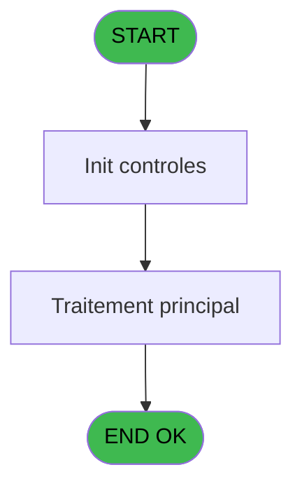

# EXF IDE 37 - Participants general

> **Analyse**: Phases 1-4 2026-02-03 11:06 -> 11:06 (16s) | Assemblage 11:06
> **Pipeline**: V7.2 Enrichi
> **Structure**: 4 onglets (Resume | Ecrans | Donnees | Connexions)

<!-- TAB:Resume -->

## 1. FICHE D'IDENTITE

| Attribut | Valeur |
|----------|--------|
| Projet | EXF |
| IDE Position | 37 |
| Nom Programme | Participants general |
| Fichier source | `Prg_37.xml` |
| Dossier IDE | Vente |
| Taches | 1 (1 ecrans visibles) |
| Tables modifiees | 0 |
| Programmes appeles | 1 |

## 2. DESCRIPTION FONCTIONNELLE

**Participants general** assure la gestion complete de ce processus, accessible depuis [Ventes Excursions (IDE 35)](EXF-IDE-35.md).

Le flux de traitement s'organise en **1 blocs fonctionnels** :

- **Traitement** (1 tache) : traitements metier divers

**Logique metier** : 1 regles identifiees couvrant valeurs par defaut.

## 3. BLOCS FONCTIONNELS

### 3.1 Traitement (1 tache)

Traitements internes.

---

#### 37 - Participants [[ECRAN]](#ecran-t1)

**Role** : Traitement : Participants.
**Ecran** : 677 x 228 DLU (MDI) | [Voir mockup](#ecran-t1)
**Delegue a** : [Recuperation du titre Manager (IDE 32)](EXF-IDE-32.md)

## 5. REGLES METIER

1 regles identifiees:

### Autres (1 regles)

#### [RM-001] Valeur par defaut si > type [B] est vide

| Element | Detail |
|---------|--------|
| **Condition** | `> type [B]=''` |
| **Si vrai** | '1' |
| **Si faux** | > type [B]) |
| **Variables** | B (> type) |
| **Expression source** | Expression 1 : `IF (> type [B]='','1',> type [B])` |
| **Exemple** | Si > type [B]='' → '1'. Sinon → > type [B]) |

## 6. CONTEXTE

- **Appele par**: [Ventes Excursions (IDE 35)](EXF-IDE-35.md)
- **Appelle**: 1 programmes | **Tables**: 3 (W:0 R:1 L:2) | **Taches**: 1 | **Expressions**: 17

<!-- TAB:Ecrans -->

## 8. ECRANS

### 8.1 Forms visibles (1 / 1)

| # | Position | Tache | Nom | Type | Largeur | Hauteur | Bloc |
|---|----------|-------|-----|------|---------|---------|------|
| 1 | 37 | 37 | Participants | MDI | 677 | 228 | Traitement |

### 8.2 Mockups Ecrans

---

#### 37 - Participants
**Tache** : [37](#t1) | **Type** : MDI | **Dimensions** : 677 x 228 DLU
**Bloc** : Traitement | **Titre IDE** : Participants

<!-- FORM-DATA:
{
    "width":  677,
    "vFactor":  8,
    "type":  "MDI",
    "hFactor":  8,
    "controls":  [
                     {
                         "x":  2,
                         "type":  "label",
                         "var":  "",
                         "y":  1,
                         "w":  666,
                         "fmt":  "",
                         "name":  "",
                         "h":  19,
                         "color":  "",
                         "text":  "",
                         "parent":  null
                     },
                     {
                         "x":  157,
                         "type":  "label",
                         "var":  "",
                         "y":  27,
                         "w":  99,
                         "fmt":  "",
                         "name":  "",
                         "h":  8,
                         "color":  "7",
                         "text":  "Excursion",
                         "parent":  null
                     },
                     {
                         "x":  43,
                         "type":  "table",
                         "var":  "",
                         "name":  "",
                         "titleH":  12,
                         "color":  "110",
                         "w":  589,
                         "y":  47,
                         "fmt":  "",
                         "parent":  null,
                         "text":  "",
                         "rowH":  14,
                         "h":  150,
                         "cols":  [
                                      {
                                          "title":  "Date",
                                          "layer":  1,
                                          "w":  138
                                      },
                                      {
                                          "title":  "Participants",
                                          "layer":  2,
                                          "w":  312
                                      },
                                      {
                                          "title":  "Logement",
                                          "layer":  3,
                                          "w":  105
                                      }
                                  ],
                         "rows":  3
                     },
                     {
                         "x":  2,
                         "type":  "label",
                         "var":  "",
                         "y":  203,
                         "w":  668,
                         "fmt":  "",
                         "name":  "",
                         "h":  23,
                         "color":  "",
                         "text":  "",
                         "parent":  null
                     },
                     {
                         "x":  275,
                         "type":  "edit",
                         "var":  "",
                         "y":  27,
                         "w":  238,
                         "fmt":  "",
                         "name":  "",
                         "h":  10,
                         "color":  "7",
                         "text":  "",
                         "parent":  null
                     },
                     {
                         "x":  48,
                         "type":  "edit",
                         "var":  "",
                         "y":  62,
                         "w":  120,
                         "fmt":  "",
                         "name":  "",
                         "h":  11,
                         "color":  "110",
                         "text":  "",
                         "parent":  6
                     },
                     {
                         "x":  194,
                         "type":  "edit",
                         "var":  "",
                         "y":  62,
                         "w":  176,
                         "fmt":  "",
                         "name":  "",
                         "h":  11,
                         "color":  "110",
                         "text":  "",
                         "parent":  6
                     },
                     {
                         "x":  379,
                         "type":  "edit",
                         "var":  "",
                         "y":  62,
                         "w":  98,
                         "fmt":  "",
                         "name":  "",
                         "h":  11,
                         "color":  "110",
                         "text":  "",
                         "parent":  6
                     },
                     {
                         "x":  515,
                         "type":  "edit",
                         "var":  "",
                         "y":  62,
                         "w":  75,
                         "fmt":  "",
                         "name":  "",
                         "h":  11,
                         "color":  "110",
                         "text":  "",
                         "parent":  6
                     },
                     {
                         "x":  458,
                         "type":  "edit",
                         "var":  "",
                         "y":  7,
                         "w":  203,
                         "fmt":  "WWW DD MMM YYYYT",
                         "name":  "",
                         "h":  8,
                         "color":  "",
                         "text":  "",
                         "parent":  1
                     },
                     {
                         "x":  8,
                         "type":  "button",
                         "var":  "",
                         "y":  206,
                         "w":  154,
                         "fmt":  "\u0026Quitter",
                         "name":  "",
                         "h":  18,
                         "color":  "",
                         "text":  "",
                         "parent":  null
                     },
                     {
                         "x":  5,
                         "type":  "edit",
                         "var":  "",
                         "y":  7,
                         "w":  267,
                         "fmt":  "20",
                         "name":  "",
                         "h":  8,
                         "color":  "",
                         "text":  "",
                         "parent":  1
                     }
                 ],
    "taskId":  "37",
    "height":  228
}
-->

<strong>Champs : 7 champs</strong>

| Pos (x,y) | Nom | Variable | Type |
|-----------|-----|----------|------|
| 275,27 | (sans nom) | - | edit |
| 48,62 | (sans nom) | - | edit |
| 194,62 | (sans nom) | - | edit |
| 379,62 | (sans nom) | - | edit |
| 515,62 | (sans nom) | - | edit |
| 458,7 | WWW DD MMM YYYYT | - | edit |
| 5,7 | 20 | - | edit |

<strong>Boutons : 1 boutons</strong>

| Bouton | Pos (x,y) | Action |
|--------|-----------|--------|
| Quitter | 8,206 | Quitte le programme |

## 9. NAVIGATION

Ecran unique: **Participants**

### 9.3 Structure hierarchique (1 tache)

| Position | Tache | Type | Dimensions | Bloc |
|----------|-------|------|------------|------|
| **37.1** | [**Participants** (37)](#t1) [mockup](#ecran-t1) | MDI | 677x228 | Traitement |

### 9.4 Algorigramme

> **Legende**: Vert = START/END OK | Rouge = END KO | Bleu = Decisions
> *Algorigramme auto-genere. Utiliser `/algorigramme` pour une synthese metier detaillee.*

<!-- TAB:Donnees -->

## 10. TABLES

### Tables utilisees (3)

| ID | Nom | Description | Type | R | W | L | Usages |
|----|-----|-------------|------|---|---|---|--------|
| 34 | hebergement______heb | Hebergement (chambres) | DB | R |   |   | 1 |
| 298 | participants_____par |  | DB |   |   | L | 1 |
| 300 | excursions_______exc |  | DB |   |   | L | 1 |

### Colonnes par table (1 / 1 tables avec colonnes identifiees)

Table 34 - hebergement______heb (R) - 1 usages

| Lettre | Variable | Acces | Type |
|--------|----------|-------|------|
| A | > code | R | Numeric |
| B | > type | R | Alpha |
| C | > date | R | Date |
| D | W creation | R | Logical |
| E | v. titre part | R | Alpha |

## 11. VARIABLES

### 11.1 Variables de session (1)

Variables persistantes pendant toute la session.

| Lettre | Nom | Type | Usage dans |
|--------|-----|------|-----------|
| E | v. titre part | Alpha | - |

### 11.2 Autres (4)

Variables diverses.

| Lettre | Nom | Type | Usage dans |
|--------|-----|------|-----------|
| A | > code | Numeric | 1x refs |
| B | > type | Alpha | 1x refs |
| C | > date | Date | - |
| D | W creation | Logical | - |

## 12. EXPRESSIONS

**17 / 17 expressions decodees (100%)**

### 12.1 Repartition par type

| Type | Expressions | Regles |
|------|-------------|--------|
| CONDITION | 3 | 5 |
| CONSTANTE | 2 | 0 |
| DATE | 1 | 0 |
| OTHER | 5 | 0 |
| REFERENCE_VG | 1 | 0 |
| CAST_LOGIQUE | 3 | 0 |
| NEGATION | 1 | 0 |
| STRING | 1 | 0 |

### 12.2 Expressions cles par type

#### CONDITION (3 expressions)

| Type | IDE | Expression | Regle |
|------|-----|------------|-------|
| CONDITION | 1 | `IF (> type [B]='','1',> type [B])` | [RM-001](#rm-RM-001) |
| CONDITION | 5 | `[O]<>'O'` | - |
| CONDITION | 2 | `> code [A]` | - |

#### CONSTANTE (2 expressions)

| Type | IDE | Expression | Regle |
|------|-----|------------|-------|
| CONSTANTE | 17 | `'H'` | - |
| CONSTANTE | 8 | `16` | - |

#### DATE (1 expressions)

| Type | IDE | Expression | Regle |
|------|-----|------------|-------|
| DATE | 3 | `Date ()` | - |

#### OTHER (5 expressions)

| Type | IDE | Expression | Regle |
|------|-----|------------|-------|
| OTHER | 15 | `[N]` | - |
| OTHER | 16 | `[I]` | - |
| OTHER | 14 | `[M]` | - |
| OTHER | 4 | `Stat (0,'C')` | - |
| OTHER | 13 | `[L]` | - |

#### REFERENCE_VG (1 expressions)

| Type | IDE | Expression | Regle |
|------|-----|------------|-------|
| REFERENCE_VG | 6 | `VG2` | - |

#### CAST_LOGIQUE (3 expressions)

| Type | IDE | Expression | Regle |
|------|-----|------------|-------|
| CAST_LOGIQUE | 11 | `INIPut ('AllowCreateInModify=Y','FALSE'LOG)` | - |
| CAST_LOGIQUE | 10 | `INIPut ('AllowCreateInModify=N','FALSE'LOG)` | - |
| CAST_LOGIQUE | 9 | `'TRUE'LOG` | - |

#### NEGATION (1 expressions)

| Type | IDE | Expression | Regle |
|------|-----|------------|-------|
| NEGATION | 12 | `NOT ([W])` | - |

#### STRING (1 expressions)

| Type | IDE | Expression | Regle |
|------|-----|------------|-------|
| STRING | 7 | `Trim ([X])` | - |

<!-- TAB:Connexions -->

## 13. GRAPHE D'APPELS

### 13.1 Chaine depuis Main (Callers)

Main -> ... -> [Ventes Excursions (IDE 35)](EXF-IDE-35.md) -> **Participants general (IDE 37)**

### 13.2 Callers

| IDE | Nom Programme | Nb Appels |
|-----|---------------|-----------|
| [35](EXF-IDE-35.md) | Ventes Excursions | 1 |

### 13.3 Callees (programmes appeles)

### 13.4 Detail Callees avec contexte

| IDE | Nom Programme | Appels | Contexte |
|-----|---------------|--------|----------|
| [32](EXF-IDE-32.md) | Recuperation du titre Manager | 1 | Recuperation donnees |

## 14. RECOMMANDATIONS MIGRATION

### 14.1 Profil du programme

| Metrique | Valeur | Impact migration |
|----------|--------|-----------------|
| Lignes de logique | 44 | Programme compact |
| Expressions | 17 | Peu de logique |
| Tables WRITE | 0 | Impact faible |
| Sous-programmes | 1 | Peu de dependances |
| Ecrans visibles | 1 | Ecran unique ou traitement batch |
| Code desactive | 0% (0 / 44) | Code sain |
| Regles metier | 1 | Quelques regles a preserver |

### 14.2 Plan de migration par bloc

#### Traitement (1 tache: 1 ecran, 0 traitement)

- **Strategie** : 1 composant(s) UI (Razor/React) avec formulaires et validation.
- 1 sous-programme(s) a migrer ou a reutiliser depuis les services existants.
- Decomposer les taches en services unitaires testables.

### 14.3 Dependances critiques

| Dependance | Type | Appels | Impact |
|------------|------|--------|--------|
| [Recuperation du titre Manager (IDE 32)](EXF-IDE-32.md) | Sous-programme | 1x | Normale - Recuperation donnees |

---
*Spec DETAILED generee par Pipeline V7.2 - 2026-02-03 11:06*
