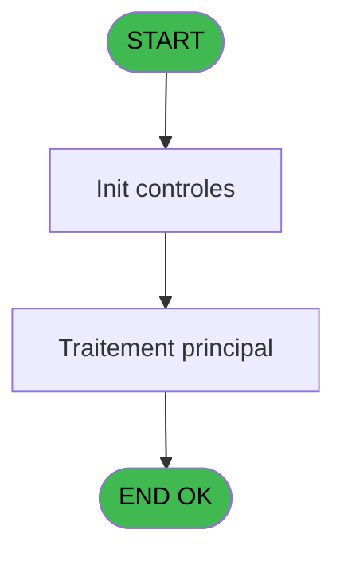
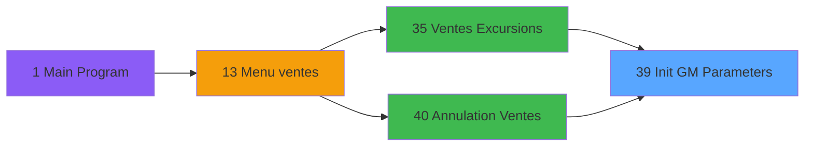

# EXF IDE 39 - Init GM Parameters

> **Analyse**: Phases 1-4 2026-02-03 11:07 -> 11:07 (15s) | Assemblage 11:07
> **Pipeline**: V7.2 Enrichi
> **Structure**: 4 onglets (Resume | Ecrans | Donnees | Connexions)

<!-- TAB:Resume -->

## 1. FICHE D'IDENTITE

| Attribut | Valeur |
|----------|--------|
| Projet | EXF |
| IDE Position | 39 |
| Nom Programme | Init GM Parameters |
| Fichier source | `Prg_39.xml` |
| Dossier IDE | Vente |
| Taches | 1 (0 ecrans visibles) |
| Tables modifiees | 0 |
| Programmes appeles | 0 |

## 2. DESCRIPTION FONCTIONNELLE

**Init GM Parameters** assure la gestion complete de ce processus, accessible depuis [Ventes Excursions (IDE 35)](EXF-IDE-35.md), [ Annulation Ventes (IDE 40)](EXF-IDE-40.md).

Le flux de traitement s'organise en **1 blocs fonctionnels** :

- **Initialisation** (1 tache) : reinitialisation d'etats et de variables de travail

## 3. BLOCS FONCTIONNELS

### 3.1 Initialisation (1 tache)

Reinitialisation d'etats et variables de travail.

---

#### 39 - Init GM Parameters

**Role** : Reinitialisation : Init GM Parameters.

## 5. REGLES METIER

*(Aucune regle metier identifiee)*

## 6. CONTEXTE

- **Appele par**: [Ventes Excursions (IDE 35)](EXF-IDE-35.md), [ Annulation Ventes (IDE 40)](EXF-IDE-40.md)
- **Appelle**: 0 programmes | **Tables**: 2 (W:0 R:1 L:1) | **Taches**: 1 | **Expressions**: 10

<!-- TAB:Ecrans -->

## 8. ECRANS

*(Programme sans ecran visible)*

## 9. NAVIGATION

### 9.3 Structure hierarchique (1 tache)

| Position | Tache | Type | Dimensions | Bloc |
|----------|-------|------|------------|------|
| **39.1** | [**Init GM Parameters** (39)](#t1) | MDI | - | Initialisation |

### 9.4 Algorigramme

> **Legende**: Vert = START/END OK | Rouge = END KO | Bleu = Decisions
> *Algorigramme auto-genere. Utiliser `/algorigramme` pour une synthese metier detaillee.*

<!-- TAB:Donnees -->

## 10. TABLES

### Tables utilisees (2)

| ID | Nom | Description | Type | R | W | L | Usages |
|----|-----|-------------|------|---|---|---|--------|
| 31 | gm-complet_______gmc |  | DB | R |   |   | 1 |
| 34 | hebergement______heb | Hebergement (chambres) | DB |   |   | L | 1 |

### Colonnes par table (1 / 1 tables avec colonnes identifiees)

Table 31 - gm-complet_______gmc (R) - 1 usages

| Lettre | Variable | Acces | Type |
|--------|----------|-------|------|
| A | Param in SOCIETE | R | Alpha |
| B | Param in COMPTE | R | Numeric |
| C | Param in FILIATION | R | Numeric |

## 11. VARIABLES

### 11.1 Autres (3)

Variables diverses.

| Lettre | Nom | Type | Usage dans |
|--------|-----|------|-----------|
| A | Param in SOCIETE | Alpha | [39](#t1) |
| B | Param in COMPTE | Numeric | [39](#t1) |
| C | Param in FILIATION | Numeric | [39](#t1) |

## 12. EXPRESSIONS

**10 / 10 expressions decodees (100%)**

### 12.1 Repartition par type

| Type | Expressions | Regles |
|------|-------------|--------|
| CONSTANTE | 1 | 0 |
| DATE | 1 | 0 |
| OTHER | 5 | 0 |
| CONCATENATION | 3 | 0 |

### 12.2 Expressions cles par type

#### CONSTANTE (1 expressions)

| Type | IDE | Expression | Regle |
|------|-----|------------|-------|
| CONSTANTE | 4 | `'H'` | - |

#### DATE (1 expressions)

| Type | IDE | Expression | Regle |
|------|-----|------------|-------|
| DATE | 5 | `Date ()` | - |

#### OTHER (5 expressions)

| Type | IDE | Expression | Regle |
|------|-----|------------|-------|
| OTHER | 6 | `ASCIIChr (33)` | - |
| OTHER | 9 | `SetParam ('GM_ROOM',[R])` | - |
| OTHER | 3 | `Param in FILIATION [C]` | - |
| OTHER | 1 | `Param in SOCIETE [A]` | - |
| OTHER | 2 | `Param in COMPTE [B]` | - |

#### CONCATENATION (3 expressions)

| Type | IDE | Expression | Regle |
|------|-----|------------|-------|
| CONCATENATION | 10 | `SetParam ('GM_ACCN',Param in SOCIETE [A]&' '&Str (Param in COMPTE [B],'8P0')&' '&Str (Param in FILIATION [C],'3P0'))` | - |
| CONCATENATION | 8 | `SetParam ('GM_ADHN',Str ([G],'10P0')&' '&[H]&' '&Str ([I],'3P0'))` | - |
| CONCATENATION | 7 | `SetParam ('GM_NAME',Trim ([J])&' '&Trim ([K]))` | - |

<!-- TAB:Connexions -->

## 13. GRAPHE D'APPELS

### 13.1 Chaine depuis Main (Callers)

Main -> ... -> [Ventes Excursions (IDE 35)](EXF-IDE-35.md) -> **Init GM Parameters (IDE 39)**

Main -> ... -> [ Annulation Ventes (IDE 40)](EXF-IDE-40.md) -> **Init GM Parameters (IDE 39)**

### 13.2 Callers

| IDE | Nom Programme | Nb Appels |
|-----|---------------|-----------|
| [35](EXF-IDE-35.md) | Ventes Excursions | 4 |
| [40](EXF-IDE-40.md) |  Annulation Ventes | 1 |

### 13.3 Callees (programmes appeles)

### 13.4 Detail Callees avec contexte

| IDE | Nom Programme | Appels | Contexte |
|-----|---------------|--------|----------|
| - | (aucun) | - | - |

## 14. RECOMMANDATIONS MIGRATION

### 14.1 Profil du programme

| Metrique | Valeur | Impact migration |
|----------|--------|-----------------|
| Lignes de logique | 29 | Programme compact |
| Expressions | 10 | Peu de logique |
| Tables WRITE | 0 | Impact faible |
| Sous-programmes | 0 | Peu de dependances |
| Ecrans visibles | 0 | Ecran unique ou traitement batch |
| Code desactive | 0% (0 / 29) | Code sain |
| Regles metier | 0 | Pas de regle identifiee |

### 14.2 Plan de migration par bloc

#### Initialisation (1 tache: 0 ecran, 1 traitement)

- **Strategie** : Constructeur/methode `InitAsync()` dans l'orchestrateur.

### 14.3 Dependances critiques

| Dependance | Type | Appels | Impact |
|------------|------|--------|--------|

---
*Spec DETAILED generee par Pipeline V7.2 - 2026-02-03 11:07*
