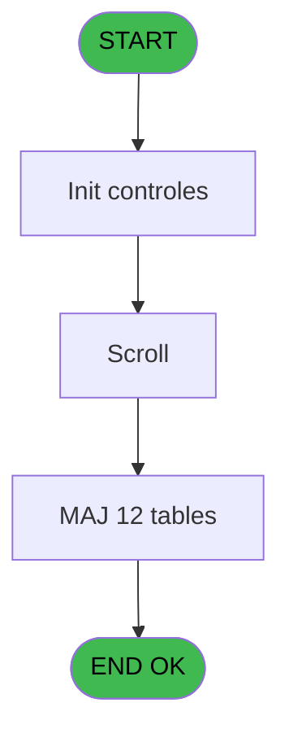
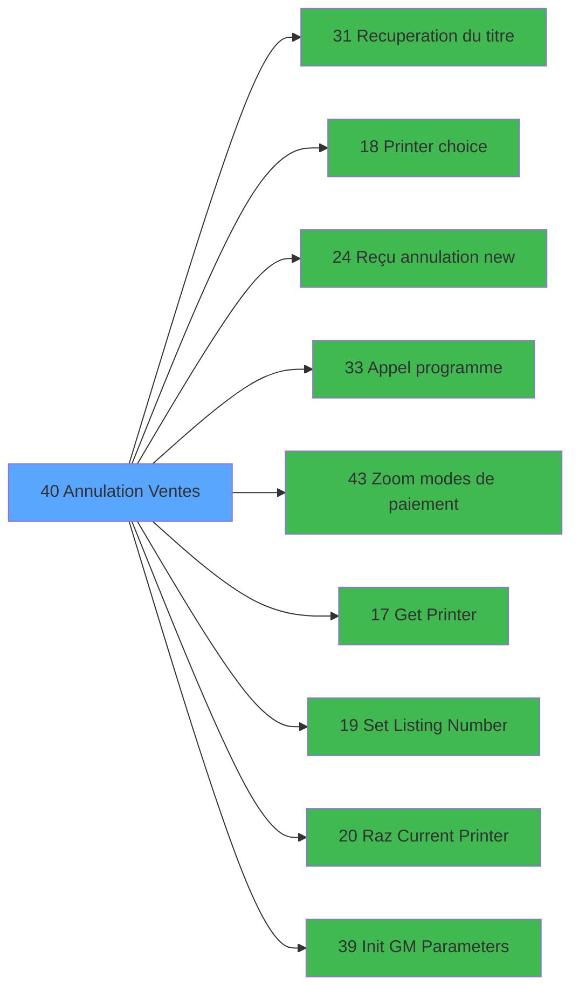

# EXF IDE 40 - Annulation Ventes

> **Analyse**: Phases 1-4 2026-02-03 11:07 -> 11:07 (15s) | Assemblage 11:07
> **Pipeline**: V7.2 Enrichi
> **Structure**: 4 onglets (Resume | Ecrans | Donnees | Connexions)

<!-- TAB:Resume -->

## 1. FICHE D'IDENTITE

| Attribut | Valeur |
|----------|--------|
| Projet | EXF |
| IDE Position | 40 |
| Nom Programme | Annulation Ventes |
| Fichier source | `Prg_40.xml` |
| Dossier IDE | Zoom |
| Taches | 56 (5 ecrans visibles) |
| Tables modifiees | 12 |
| Programmes appeles | 9 |

## 2. DESCRIPTION FONCTIONNELLE

**Annulation Ventes** assure la gestion complete de ce processus, accessible depuis [Menu ventes (IDE 13)](EXF-IDE-13.md).

Le flux de traitement s'organise en **4 blocs fonctionnels** :

- **Traitement** (33 taches) : traitements metier divers
- **Calcul** (16 taches) : calculs de montants, stocks ou compteurs
- **Saisie** (6 taches) : ecrans de saisie utilisateur (formulaires, champs, donnees)
- **Consultation** (1 tache) : ecrans de recherche, selection et consultation

**Donnees modifiees** : 12 tables en ecriture (reseau_cloture___rec, comptable________cte, compte_gm________cgm, date_comptable___dat, intermed_compta__ite, vente, compteur_excurs__cte, date_comptable___dat, participants_____par, excurs_planning__epl, excursions_______exc, vente____________vep).

Detail : phases du traitement

#### Phase 1 : Saisie (6 taches)

- **40** - Ventes **[[ECRAN]](#ecran-t1)**
- **40.1** - Annulation ventes excursion **[[ECRAN]](#ecran-t2)**
- **40.1.1.2** - Annulation de vente **[[ECRAN]](#ecran-t18)**
- **40.1.1.3** - Compteur vente
- **40.1.2** - Annulation de vente **[[ECRAN]](#ecran-t26)**
- **40.1.3** - Compteur vente

#### Phase 2 : Traitement (33 taches)

- **40.1.1** - Participants **[[ECRAN]](#ecran-t3)**
- **40.1.1.1** - Annulation
- **40.1.1.1.1** - Màj Excursions
- **40.1.1.1.2** - Màj Planning
- **40.1.1.1.3** - Generation Participants
- **40.1.1.1.4.1** - Imputation
- **40.1.1.1.4.2** - Date caisse
- **40.1.1.1.4.5** - Màj solde
- **40.1.1.1.5.1** - Imputation
- **40.1.1.1.5.2** - Date caisse
- **40.1.1.5** - Test      reseau caisse
- **40.1.1.6** - Deblocage reseau caisse
- **40.1.1.7** - Test Cloture
- **40.1.1.7.1** - Blocage Cloture v1
- **40.1.1.8** - Deblocage Cloture v1
- **40.1.5** - Annulation
- **40.1.5.1** - Màj Excursions
- **40.1.5.2** - Màj Planning
- **40.1.5.3** - Generation Participants
- **40.1.5.4.1** - Imputation
- **40.1.5.4.2** - Date caisse
- **40.1.5.4.5** - Màj solde
- **40.1.5.5.1** - Imputation
- **40.1.5.5.2** - Date caisse
- **40.1.6** - Test      reseau caisse
- **40.1.7** - Deblocage reseau caisse
- **40.1.8** - Test Cloture
- **40.1.8.1** - Blocage Cloture v1
- **40.1.9** - Deblocage Cloture v1
- **40.1.1.7.2** - Blocage Cloture v1
- **40.1.1.9** - Deblocage Cloture v1
- **40.1.8.2** - Blocage Cloture v1
- **40.1.10** - Deblocage Cloture T2H

Delegue a : [Recuperation du titre (IDE 31)](EXF-IDE-31.md), [Reçu annulation new (IDE 24)](EXF-IDE-24.md), [Appel programme (IDE 33)](EXF-IDE-33.md), [Set Listing Number (IDE 19)](EXF-IDE-19.md)

#### Phase 3 : Calcul (16 taches)

- **40.1.1.1.4** - MAJ Comptable
- **40.1.1.1.4.3** - Creation comptable
- **40.1.1.1.4.4** - Creation comptable
- **40.1.1.1.5** - MAJ Comptable
- **40.1.1.1.5.3** - Creation comptable
- **40.1.1.4** - Date comptable
- **40.1.4** - Date comptable
- **40.1.5.4** - MAJ Comptable
- **40.1.5.4.3** - Creation comptable v1
- **40.1.5.4.4** - Creation comptable
- **40.1.5.5** - MAJ Comptable
- **40.1.5.5.3** - Creation comptable
- **40.1.1.1.4.6** - Creation comptable
- **40.1.5.4.6** - Creation comptable v1
- **40.1.5.5.4** - Creation comptable
- **40.1.1.1.5.4** - Creation comptable

#### Phase 4 : Consultation (1 tache)

- **40.2** - Recherche **[[ECRAN]](#ecran-t48)**

Delegue a : [Recuperation du titre (IDE 31)](EXF-IDE-31.md), [Zoom modes de paiement (IDE 43)](EXF-IDE-43.md)

#### Tables impactees

| Table | Operations | Role metier |
|-------|-----------|-------------|
| reseau_cloture___rec | **W** (10 usages) | Donnees reseau/cloture |
| compte_gm________cgm | **W** (6 usages) | Comptes GM (generaux) |
| comptable________cte | **W** (4 usages) |  |
| date_comptable___dat | R/**W** (4 usages) |  |
| vente | **W** (4 usages) | Donnees de ventes |
| vente____________vep | **W** (3 usages) | Donnees de ventes |
| participants_____par | **W** (3 usages) |  |
| excursions_______exc | **W**/L (3 usages) |  |
| intermed_compta__ite | **W** (2 usages) |  |
| compteur_excurs__cte | **W** (2 usages) | Comptes GM (generaux) |
| date_comptable___dat | R/**W** (2 usages) |  |
| excurs_planning__epl | **W** (2 usages) |  |

## 3. BLOCS FONCTIONNELS

### 3.1 Saisie (6 taches)

L'operateur saisit les donnees de la transaction via 4 ecrans (Ventes, Annulation ventes excursion, Annulation de vente, Annulation de vente).

---

#### 40 - Ventes [[ECRAN]](#ecran-t1)

**Role** : Tache d'orchestration : point d'entree du programme (6 sous-taches). Coordonne l'enchainement des traitements.
**Ecran** : 216 x 20 DLU (MDI) | [Voir mockup](#ecran-t1)

5 sous-taches directes

| Tache | Nom | Bloc |
|-------|-----|------|
| [40.1](#t2) | Annulation ventes excursion **[[ECRAN]](#ecran-t2)** | Saisie |
| [40.1.1.2](#t18) | Annulation de vente **[[ECRAN]](#ecran-t18)** | Saisie |
| [40.1.1.3](#t19) | Compteur vente | Saisie |
| [40.1.2](#t26) | Annulation de vente **[[ECRAN]](#ecran-t26)** | Saisie |
| [40.1.3](#t27) | Compteur vente | Saisie |

---

#### 40.1 - Annulation ventes excursion [[ECRAN]](#ecran-t2)

**Role** : Saisie des donnees : Annulation ventes excursion.
**Ecran** : 1178 x 261 DLU (MDI) | [Voir mockup](#ecran-t2)
**Delegue a** : [Reçu annulation new (IDE 24)](EXF-IDE-24.md)

---

#### 40.1.1.2 - Annulation de vente [[ECRAN]](#ecran-t18)

**Role** : Saisie des donnees : Annulation de vente.
**Ecran** : 626 x 150 DLU (MDI) | [Voir mockup](#ecran-t18)
**Variables liees** : F (W0 n° vente)
**Delegue a** : [Reçu annulation new (IDE 24)](EXF-IDE-24.md)

---

#### 40.1.1.3 - Compteur vente

**Role** : Saisie des donnees : Compteur vente.
**Variables liees** : F (W0 n° vente), H (W0_Compteur)

---

#### 40.1.2 - Annulation de vente [[ECRAN]](#ecran-t26)

**Role** : Saisie des donnees : Annulation de vente.
**Ecran** : 626 x 148 DLU (MDI) | [Voir mockup](#ecran-t26)
**Variables liees** : F (W0 n° vente)
**Delegue a** : [Reçu annulation new (IDE 24)](EXF-IDE-24.md)

---

#### 40.1.3 - Compteur vente

**Role** : Saisie des donnees : Compteur vente.
**Variables liees** : F (W0 n° vente), H (W0_Compteur)

### 3.2 Traitement (33 taches)

Traitements internes.

---

#### 40.1.1 - Participants [[ECRAN]](#ecran-t3)

**Role** : Traitement : Participants.
**Ecran** : 677 x 182 DLU (MDI) | [Voir mockup](#ecran-t3)

---

#### 40.1.1.1 - Annulation

**Role** : Traitement : Annulation.

---

#### 40.1.1.1.1 - Màj Excursions

**Role** : Traitement : Màj Excursions.

---

#### 40.1.1.1.2 - Màj Planning

**Role** : Traitement : Màj Planning.

---

#### 40.1.1.1.3 - Generation Participants

**Role** : Traitement : Generation Participants.

---

#### 40.1.1.1.4.1 - Imputation

**Role** : Traitement : Imputation.

---

#### 40.1.1.1.4.2 - Date caisse

**Role** : Traitement : Date caisse.
**Variables liees** : G (W0_Date_comptable)

---

#### 40.1.1.1.4.5 - Màj solde

**Role** : Consultation/chargement : Màj solde.

---

#### 40.1.1.1.5.1 - Imputation

**Role** : Traitement : Imputation.

---

#### 40.1.1.1.5.2 - Date caisse

**Role** : Traitement : Date caisse.
**Variables liees** : G (W0_Date_comptable)

---

#### 40.1.1.5 - Test      reseau caisse

**Role** : Verification : Test      reseau caisse.

---

#### 40.1.1.6 - Deblocage reseau caisse

**Role** : Traitement : Deblocage reseau caisse.

---

#### 40.1.1.7 - Test Cloture

**Role** : Verification : Test Cloture.

---

#### 40.1.1.7.1 - Blocage Cloture v1

**Role** : Traitement : Blocage Cloture v1.

---

#### 40.1.1.8 - Deblocage Cloture v1

**Role** : Traitement : Deblocage Cloture v1.

---

#### 40.1.5 - Annulation

**Role** : Traitement : Annulation.

---

#### 40.1.5.1 - Màj Excursions

**Role** : Traitement : Màj Excursions.

---

#### 40.1.5.2 - Màj Planning

**Role** : Traitement : Màj Planning.

---

#### 40.1.5.3 - Generation Participants

**Role** : Traitement : Generation Participants.

---

#### 40.1.5.4.1 - Imputation

**Role** : Traitement : Imputation.

---

#### 40.1.5.4.2 - Date caisse

**Role** : Traitement : Date caisse.
**Variables liees** : G (W0_Date_comptable)

---

#### 40.1.5.4.5 - Màj solde

**Role** : Consultation/chargement : Màj solde.

---

#### 40.1.5.5.1 - Imputation

**Role** : Traitement : Imputation.

---

#### 40.1.5.5.2 - Date caisse

**Role** : Traitement : Date caisse.
**Variables liees** : G (W0_Date_comptable)

---

#### 40.1.6 - Test      reseau caisse

**Role** : Verification : Test      reseau caisse.

---

#### 40.1.7 - Deblocage reseau caisse

**Role** : Traitement : Deblocage reseau caisse.

---

#### 40.1.8 - Test Cloture

**Role** : Verification : Test Cloture.

---

#### 40.1.8.1 - Blocage Cloture v1

**Role** : Traitement : Blocage Cloture v1.

---

#### 40.1.9 - Deblocage Cloture v1

**Role** : Traitement : Deblocage Cloture v1.

---

#### 40.1.1.7.2 - Blocage Cloture v1

**Role** : Traitement : Blocage Cloture v1.

---

#### 40.1.1.9 - Deblocage Cloture v1

**Role** : Traitement : Deblocage Cloture v1.

---

#### 40.1.8.2 - Blocage Cloture v1

**Role** : Traitement : Blocage Cloture v1.

---

#### 40.1.10 - Deblocage Cloture T2H

**Role** : Traitement : Deblocage Cloture T2H.

### 3.3 Calcul (16 taches)

Calculs metier : montants, stocks, compteurs.

---

#### 40.1.1.1.4 - MAJ Comptable

**Role** : Traitement : MAJ Comptable.
**Variables liees** : G (W0_Date_comptable)

---

#### 40.1.1.1.4.3 - Creation comptable

**Role** : Creation d'enregistrement : Creation comptable.
**Variables liees** : G (W0_Date_comptable)

---

#### 40.1.1.1.4.4 - Creation comptable

**Role** : Creation d'enregistrement : Creation comptable.
**Variables liees** : G (W0_Date_comptable)

---

#### 40.1.1.1.5 - MAJ Comptable

**Role** : Traitement : MAJ Comptable.
**Variables liees** : G (W0_Date_comptable)

---

#### 40.1.1.1.5.3 - Creation comptable

**Role** : Creation d'enregistrement : Creation comptable.
**Variables liees** : G (W0_Date_comptable)

---

#### 40.1.1.4 - Date comptable

**Role** : Traitement : Date comptable.
**Variables liees** : G (W0_Date_comptable)

---

#### 40.1.4 - Date comptable

**Role** : Traitement : Date comptable.
**Variables liees** : G (W0_Date_comptable)

---

#### 40.1.5.4 - MAJ Comptable

**Role** : Traitement : MAJ Comptable.
**Variables liees** : G (W0_Date_comptable)

---

#### 40.1.5.4.3 - Creation comptable v1

**Role** : Creation d'enregistrement : Creation comptable v1.
**Variables liees** : G (W0_Date_comptable)

---

#### 40.1.5.4.4 - Creation comptable

**Role** : Creation d'enregistrement : Creation comptable.
**Variables liees** : G (W0_Date_comptable)

---

#### 40.1.5.5 - MAJ Comptable

**Role** : Traitement : MAJ Comptable.
**Variables liees** : G (W0_Date_comptable)

---

#### 40.1.5.5.3 - Creation comptable

**Role** : Creation d'enregistrement : Creation comptable.
**Variables liees** : G (W0_Date_comptable)

---

#### 40.1.1.1.4.6 - Creation comptable

**Role** : Creation d'enregistrement : Creation comptable.
**Variables liees** : G (W0_Date_comptable)

---

#### 40.1.5.4.6 - Creation comptable v1

**Role** : Creation d'enregistrement : Creation comptable v1.
**Variables liees** : G (W0_Date_comptable)

---

#### 40.1.5.5.4 - Creation comptable

**Role** : Creation d'enregistrement : Creation comptable.
**Variables liees** : G (W0_Date_comptable)

---

#### 40.1.1.1.5.4 - Creation comptable

**Role** : Creation d'enregistrement : Creation comptable.
**Variables liees** : G (W0_Date_comptable)

### 3.4 Consultation (1 tache)

Ecrans de recherche et consultation.

---

#### 40.2 - Recherche [[ECRAN]](#ecran-t48)

**Role** : Traitement : Recherche.
**Ecran** : 574 x 136 DLU (MDI) | [Voir mockup](#ecran-t48)

## 5. REGLES METIER

*(Aucune regle metier identifiee)*

## 6. CONTEXTE

- **Appele par**: [Menu ventes (IDE 13)](EXF-IDE-13.md)
- **Appelle**: 9 programmes | **Tables**: 16 (W:12 R:3 L:4) | **Taches**: 56 | **Expressions**: 4

<!-- TAB:Ecrans -->

## 8. ECRANS

### 8.1 Forms visibles (5 / 56)

| # | Position | Tache | Nom | Type | Largeur | Hauteur | Bloc |
|---|----------|-------|-----|------|---------|---------|------|
| 1 | 40.1 | 40.1 | Annulation ventes excursion | MDI | 1178 | 261 | Saisie |
| 2 | 40.1.1 | 40.1.1 | Participants | MDI | 677 | 182 | Traitement |
| 3 | 40.1.1.2 | 40.1.1.2 | Annulation de vente | MDI | 626 | 150 | Saisie |
| 4 | 40.1.2 | 40.1.2 | Annulation de vente | MDI | 626 | 148 | Saisie |
| 5 | 40.2 | 40.2 | Recherche | MDI | 574 | 136 | Consultation |

### 8.2 Mockups Ecrans

---

#### 40.1 - Annulation ventes excursion
**Tache** : [40.1](#t2) | **Type** : MDI | **Dimensions** : 1178 x 261 DLU
**Bloc** : Saisie | **Titre IDE** : Annulation ventes excursion

<!-- FORM-DATA:
{
    "width":  1178,
    "vFactor":  8,
    "type":  "MDI",
    "hFactor":  8,
    "controls":  [
                     {
                         "x":  5,
                         "type":  "label",
                         "var":  "",
                         "y":  1,
                         "w":  1167,
                         "fmt":  "",
                         "name":  "",
                         "h":  17,
                         "color":  "",
                         "text":  "",
                         "parent":  null
                     },
                     {
                         "x":  20,
                         "type":  "table",
                         "var":  "",
                         "name":  "",
                         "titleH":  12,
                         "color":  "110",
                         "w":  1130,
                         "y":  27,
                         "fmt":  "",
                         "parent":  null,
                         "text":  "",
                         "rowH":  14,
                         "h":  97,
                         "cols":  [
                                      {
                                          "title":  "Date",
                                          "layer":  1,
                                          "w":  138
                                      },
                                      {
                                          "title":  "Numéro",
                                          "layer":  2,
                                          "w":  152
                                      },
                                      {
                                          "title":  "Montant",
                                          "layer":  3,
                                          "w":  192
                                      },
                                      {
                                          "title":  "Mode",
                                          "layer":  4,
                                          "w":  89
                                      },
                                      {
                                          "title":  "Excursion",
                                          "layer":  5,
                                          "w":  216
                                      },
                                      {
                                          "title":  "Nom",
                                          "layer":  6,
                                          "w":  154
                                      },
                                      {
                                          "title":  "Prénom",
                                          "layer":  7,
                                          "w":  154
                                      }
                                  ],
                         "rows":  7
                     },
                     {
                         "x":  82,
                         "type":  "label",
                         "var":  "",
                         "y":  133,
                         "w":  251,
                         "fmt":  "",
                         "name":  "",
                         "h":  93,
                         "color":  "",
                         "text":  "",
                         "parent":  null
                     },
                     {
                         "x":  101,
                         "type":  "label",
                         "var":  "",
                         "y":  143,
                         "w":  204,
                         "fmt":  "",
                         "name":  "",
                         "h":  60,
                         "color":  "155",
                         "text":  "",
                         "parent":  20
                     },
                     {
                         "x":  103,
                         "type":  "label",
                         "var":  "",
                         "y":  144,
                         "w":  40,
                         "fmt":  "",
                         "name":  "",
                         "h":  58,
                         "color":  "",
                         "text":  "",
                         "parent":  21
                     },
                     {
                         "x":  154,
                         "type":  "label",
                         "var":  "",
                         "y":  152,
                         "w":  125,
                         "fmt":  "",
                         "name":  "",
                         "h":  9,
                         "color":  "142",
                         "text":  "Recherche",
                         "parent":  21
                     },
                     {
                         "x":  154,
                         "type":  "label",
                         "var":  "",
                         "y":  169,
                         "w":  125,
                         "fmt":  "",
                         "name":  "",
                         "h":  9,
                         "color":  "142",
                         "text":  "Impression",
                         "parent":  21
                     },
                     {
                         "x":  154,
                         "type":  "label",
                         "var":  "",
                         "y":  186,
                         "w":  125,
                         "fmt":  "",
                         "name":  "",
                         "h":  9,
                         "color":  "142",
                         "text":  "Annulation",
                         "parent":  21
                     },
                     {
                         "x":  125,
                         "type":  "label",
                         "var":  "",
                         "y":  209,
                         "w":  120,
                         "fmt":  "",
                         "name":  "",
                         "h":  9,
                         "color":  "",
                         "text":  "Votre choix",
                         "parent":  20
                     },
                     {
                         "x":  0,
                         "type":  "label",
                         "var":  "",
                         "y":  236,
                         "w":  1175,
                         "fmt":  "",
                         "name":  "",
                         "h":  21,
                         "color":  "",
                         "text":  "",
                         "parent":  null
                     },
                     {
                         "x":  170,
                         "type":  "edit",
                         "var":  "",
                         "y":  44,
                         "w":  98,
                         "fmt":  "",
                         "name":  "",
                         "h":  8,
                         "color":  "110",
                         "text":  "",
                         "parent":  4
                     },
                     {
                         "x":  512,
                         "type":  "edit",
                         "var":  "",
                         "y":  43,
                         "w":  75,
                         "fmt":  "",
                         "name":  "",
                         "h":  8,
                         "color":  "110",
                         "text":  "",
                         "parent":  4
                     },
                     {
                         "x":  814,
                         "type":  "edit",
                         "var":  "",
                         "y":  44,
                         "w":  142,
                         "fmt":  "U12",
                         "name":  "",
                         "h":  8,
                         "color":  "110",
                         "text":  "",
                         "parent":  4
                     },
                     {
                         "x":  976,
                         "type":  "edit",
                         "var":  "",
                         "y":  44,
                         "w":  98,
                         "fmt":  "",
                         "name":  "",
                         "h":  8,
                         "color":  "110",
                         "text":  "",
                         "parent":  4
                     },
                     {
                         "x":  26,
                         "type":  "edit",
                         "var":  "",
                         "y":  44,
                         "w":  120,
                         "fmt":  "",
                         "name":  "",
                         "h":  8,
                         "color":  "110",
                         "text":  "",
                         "parent":  4
                     },
                     {
                         "x":  322,
                         "type":  "edit",
                         "var":  "",
                         "y":  43,
                         "w":  176,
                         "fmt":  "N## ### ### ###.###Z",
                         "name":  "",
                         "h":  8,
                         "color":  "110",
                         "text":  "",
                         "parent":  4
                     },
                     {
                         "x":  597,
                         "type":  "edit",
                         "var":  "",
                         "y":  44,
                         "w":  198,
                         "fmt":  "U17",
                         "name":  "",
                         "h":  8,
                         "color":  "110",
                         "text":  "",
                         "parent":  4
                     },
                     {
                         "x":  261,
                         "type":  "edit",
                         "var":  "",
                         "y":  209,
                         "w":  26,
                         "fmt":  "",
                         "name":  "W1 choix action",
                         "h":  10,
                         "color":  "6",
                         "text":  "",
                         "parent":  20
                     },
                     {
                         "x":  8,
                         "type":  "edit",
                         "var":  "",
                         "y":  6,
                         "w":  267,
                         "fmt":  "20",
                         "name":  "",
                         "h":  8,
                         "color":  "",
                         "text":  "",
                         "parent":  1
                     },
                     {
                         "x":  961,
                         "type":  "edit",
                         "var":  "",
                         "y":  6,
                         "w":  203,
                         "fmt":  "WWW DD MMM YYYYT",
                         "name":  "",
                         "h":  8,
                         "color":  "",
                         "text":  "",
                         "parent":  1
                     },
                     {
                         "x":  1085,
                         "type":  "button",
                         "var":  "",
                         "y":  40,
                         "w":  31,
                         "fmt":  "...",
                         "name":  "",
                         "h":  13,
                         "color":  "",
                         "text":  "",
                         "parent":  4
                     },
                     {
                         "x":  669,
                         "type":  "image",
                         "var":  "",
                         "y":  132,
                         "w":  182,
                         "fmt":  "",
                         "name":  "",
                         "h":  92,
                         "color":  "",
                         "text":  "",
                         "parent":  null
                     },
                     {
                         "x":  113,
                         "type":  "button",
                         "var":  "",
                         "y":  152,
                         "w":  24,
                         "fmt":  "R",
                         "name":  "R",
                         "h":  9,
                         "color":  "",
                         "text":  "",
                         "parent":  21
                     },
                     {
                         "x":  113,
                         "type":  "button",
                         "var":  "",
                         "y":  169,
                         "w":  24,
                         "fmt":  "I",
                         "name":  "I",
                         "h":  9,
                         "color":  "",
                         "text":  "",
                         "parent":  21
                     },
                     {
                         "x":  113,
                         "type":  "button",
                         "var":  "",
                         "y":  186,
                         "w":  24,
                         "fmt":  "A",
                         "name":  "A",
                         "h":  9,
                         "color":  "",
                         "text":  "",
                         "parent":  21
                     },
                     {
                         "x":  4,
                         "type":  "button",
                         "var":  "",
                         "y":  238,
                         "w":  154,
                         "fmt":  "\u0026Quitter",
                         "name":  "",
                         "h":  18,
                         "color":  "",
                         "text":  "",
                         "parent":  28
                     },
                     {
                         "x":  996,
                         "type":  "button",
                         "var":  "",
                         "y":  238,
                         "w":  168,
                         "fmt":  "Printer",
                         "name":  "",
                         "h":  18,
                         "color":  "",
                         "text":  "",
                         "parent":  null
                     }
                 ],
    "taskId":  "40.1",
    "height":  261
}
-->

<strong>Champs : 10 champs</strong>

| Pos (x,y) | Nom | Variable | Type |
|-----------|-----|----------|------|
| 170,44 | (sans nom) | - | edit |
| 512,43 | (sans nom) | - | edit |
| 814,44 | U12 | - | edit |
| 976,44 | (sans nom) | - | edit |
| 26,44 | (sans nom) | - | edit |
| 322,43 | N## ### ### ###.###Z | - | edit |
| 597,44 | U17 | - | edit |
| 261,209 | W1 choix action | - | edit |
| 8,6 | 20 | - | edit |
| 961,6 | WWW DD MMM YYYYT | - | edit |

<strong>Boutons : 6 boutons</strong>

| Bouton | Pos (x,y) | Action |
|--------|-----------|--------|
| ... | 1085,40 | Bouton fonctionnel |
| R | 113,152 | Bouton fonctionnel |
| I | 113,169 | Bouton fonctionnel |
| A | 113,186 | Bouton fonctionnel |
| Quitter | 4,238 | Quitte le programme |
| Printer | 996,238 | Appel [Printer choice (IDE 18)](EXF-IDE-18.md) |

---

#### 40.1.1 - Participants
**Tache** : [40.1.1](#t3) | **Type** : MDI | **Dimensions** : 677 x 182 DLU
**Bloc** : Traitement | **Titre IDE** : Participants

<!-- FORM-DATA:
{
    "width":  677,
    "vFactor":  8,
    "type":  "MDI",
    "hFactor":  8,
    "controls":  [
                     {
                         "x":  0,
                         "type":  "label",
                         "var":  "",
                         "y":  2,
                         "w":  673,
                         "fmt":  "",
                         "name":  "",
                         "h":  17,
                         "color":  "",
                         "text":  "",
                         "parent":  null
                     },
                     {
                         "x":  34,
                         "type":  "table",
                         "var":  "",
                         "name":  "",
                         "titleH":  12,
                         "color":  "110",
                         "w":  611,
                         "y":  47,
                         "fmt":  "",
                         "parent":  null,
                         "text":  "",
                         "rowH":  14,
                         "h":  99,
                         "cols":  [
                                      {
                                          "title":  "Nom",
                                          "layer":  1,
                                          "w":  182
                                      },
                                      {
                                          "title":  "Prénom",
                                          "layer":  2,
                                          "w":  117
                                      },
                                      {
                                          "title":  "Montant",
                                          "layer":  3,
                                          "w":  192
                                      },
                                      {
                                          "title":  "Annule ?",
                                          "layer":  4,
                                          "w":  85
                                      }
                                  ],
                         "rows":  4
                     },
                     {
                         "x":  0,
                         "type":  "label",
                         "var":  "",
                         "y":  157,
                         "w":  673,
                         "fmt":  "",
                         "name":  "",
                         "h":  22,
                         "color":  "",
                         "text":  "",
                         "parent":  null
                     },
                     {
                         "x":  40,
                         "type":  "edit",
                         "var":  "",
                         "y":  64,
                         "w":  176,
                         "fmt":  "",
                         "name":  "",
                         "h":  8,
                         "color":  "148",
                         "text":  "",
                         "parent":  5
                     },
                     {
                         "x":  226,
                         "type":  "edit",
                         "var":  "",
                         "y":  64,
                         "w":  98,
                         "fmt":  "",
                         "name":  "",
                         "h":  8,
                         "color":  "148",
                         "text":  "",
                         "parent":  5
                     },
                     {
                         "x":  347,
                         "type":  "edit",
                         "var":  "",
                         "y":  64,
                         "w":  176,
                         "fmt":  "N## ### ### ###.###Z",
                         "name":  "",
                         "h":  8,
                         "color":  "148",
                         "text":  "",
                         "parent":  5
                     },
                     {
                         "x":  514,
                         "type":  "button",
                         "var":  "",
                         "y":  159,
                         "w":  154,
                         "fmt":  "\u0026\\Annulation",
                         "name":  "btn Annulation",
                         "h":  18,
                         "color":  "",
                         "text":  "",
                         "parent":  14
                     },
                     {
                         "x":  3,
                         "type":  "edit",
                         "var":  "",
                         "y":  6,
                         "w":  267,
                         "fmt":  "20",
                         "name":  "",
                         "h":  8,
                         "color":  "",
                         "text":  "",
                         "parent":  1
                     },
                     {
                         "x":  460,
                         "type":  "edit",
                         "var":  "",
                         "y":  6,
                         "w":  203,
                         "fmt":  "WWW DD MMM YYYYT",
                         "name":  "",
                         "h":  8,
                         "color":  "",
                         "text":  "",
                         "parent":  1
                     },
                     {
                         "x":  34,
                         "type":  "edit",
                         "var":  "",
                         "y":  33,
                         "w":  605,
                         "fmt":  "42",
                         "name":  "",
                         "h":  13,
                         "color":  "142",
                         "text":  "",
                         "parent":  null
                     },
                     {
                         "x":  534,
                         "type":  "edit",
                         "var":  "",
                         "y":  64,
                         "w":  75,
                         "fmt":  "6",
                         "name":  "",
                         "h":  8,
                         "color":  "148",
                         "text":  "",
                         "parent":  5
                     },
                     {
                         "x":  3,
                         "type":  "button",
                         "var":  "",
                         "y":  159,
                         "w":  154,
                         "fmt":  "\u0026Quitter",
                         "name":  "",
                         "h":  18,
                         "color":  "",
                         "text":  "",
                         "parent":  14
                     },
                     {
                         "x":  251,
                         "type":  "button",
                         "var":  "",
                         "y":  159,
                         "w":  168,
                         "fmt":  "Printer",
                         "name":  "",
                         "h":  18,
                         "color":  "",
                         "text":  "",
                         "parent":  null
                     }
                 ],
    "taskId":  "40.1.1",
    "height":  182
}
-->

<strong>Champs : 7 champs</strong>

| Pos (x,y) | Nom | Variable | Type |
|-----------|-----|----------|------|
| 40,64 | (sans nom) | - | edit |
| 226,64 | (sans nom) | - | edit |
| 347,64 | N## ### ### ###.###Z | - | edit |
| 3,6 | 20 | - | edit |
| 460,6 | WWW DD MMM YYYYT | - | edit |
| 34,33 | 42 | - | edit |
| 534,64 | 6 | - | edit |

<strong>Boutons : 3 boutons</strong>

| Bouton | Pos (x,y) | Action |
|--------|-----------|--------|
| \Annulation | 514,159 | Annule et retour au menu |
| Quitter | 3,159 | Quitte le programme |
| Printer | 251,159 | Appel [Printer choice (IDE 18)](EXF-IDE-18.md) |

---

#### 40.1.1.2 - Annulation de vente
**Tache** : [40.1.1.2](#t18) | **Type** : MDI | **Dimensions** : 626 x 150 DLU
**Bloc** : Saisie | **Titre IDE** : Annulation de vente

<!-- FORM-DATA:
{
    "width":  626,
    "vFactor":  8,
    "type":  "MDI",
    "hFactor":  8,
    "controls":  [
                     {
                         "x":  0,
                         "type":  "label",
                         "var":  "",
                         "y":  2,
                         "w":  621,
                         "fmt":  "",
                         "name":  "",
                         "h":  17,
                         "color":  "",
                         "text":  "",
                         "parent":  null
                     },
                     {
                         "x":  15,
                         "type":  "label",
                         "var":  "",
                         "y":  45,
                         "w":  104,
                         "fmt":  "",
                         "name":  "",
                         "h":  10,
                         "color":  "",
                         "text":  "Paye par",
                         "parent":  null
                     },
                     {
                         "x":  35,
                         "type":  "label",
                         "var":  "",
                         "y":  63,
                         "w":  83,
                         "fmt":  "",
                         "name":  "",
                         "h":  8,
                         "color":  "",
                         "text":  "Nom",
                         "parent":  null
                     },
                     {
                         "x":  35,
                         "type":  "label",
                         "var":  "",
                         "y":  77,
                         "w":  79,
                         "fmt":  "",
                         "name":  "",
                         "h":  10,
                         "color":  "",
                         "text":  "Prenom",
                         "parent":  null
                     },
                     {
                         "x":  35,
                         "type":  "label",
                         "var":  "",
                         "y":  93,
                         "w":  157,
                         "fmt":  "",
                         "name":  "",
                         "h":  10,
                         "color":  "",
                         "text":  "Moyen de paiement",
                         "parent":  null
                     },
                     {
                         "x":  35,
                         "type":  "label",
                         "var":  "",
                         "y":  109,
                         "w":  189,
                         "fmt":  "",
                         "name":  "",
                         "h":  10,
                         "color":  "143",
                         "text":  "Commission Annulation",
                         "parent":  null
                     },
                     {
                         "x":  0,
                         "type":  "label",
                         "var":  "",
                         "y":  125,
                         "w":  621,
                         "fmt":  "",
                         "name":  "",
                         "h":  22,
                         "color":  "",
                         "text":  "",
                         "parent":  null
                     },
                     {
                         "x":  231,
                         "type":  "edit",
                         "var":  "",
                         "y":  92,
                         "w":  82,
                         "fmt":  "UUUUA",
                         "name":  "W_Moyen_lib",
                         "h":  10,
                         "color":  "6",
                         "text":  "",
                         "parent":  null
                     },
                     {
                         "x":  231,
                         "type":  "edit",
                         "var":  "",
                         "y":  108,
                         "w":  82,
                         "fmt":  "3.2 %",
                         "name":  "W_frais annualtion",
                         "h":  10,
                         "color":  "6",
                         "text":  "",
                         "parent":  null
                     },
                     {
                         "x":  4,
                         "type":  "button",
                         "var":  "",
                         "y":  127,
                         "w":  154,
                         "fmt":  "\u0026Ok",
                         "name":  "btn ok",
                         "h":  18,
                         "color":  "",
                         "text":  "",
                         "parent":  16
                     },
                     {
                         "x":  3,
                         "type":  "edit",
                         "var":  "",
                         "y":  7,
                         "w":  267,
                         "fmt":  "20",
                         "name":  "",
                         "h":  8,
                         "color":  "",
                         "text":  "",
                         "parent":  1
                     },
                     {
                         "x":  408,
                         "type":  "edit",
                         "var":  "",
                         "y":  7,
                         "w":  203,
                         "fmt":  "WWW DD MMM YYYYT",
                         "name":  "",
                         "h":  8,
                         "color":  "",
                         "text":  "",
                         "parent":  1
                     },
                     {
                         "x":  136,
                         "type":  "edit",
                         "var":  "",
                         "y":  25,
                         "w":  350,
                         "fmt":  "30",
                         "name":  "",
                         "h":  10,
                         "color":  "142",
                         "text":  "",
                         "parent":  null
                     },
                     {
                         "x":  199,
                         "type":  "edit",
                         "var":  "",
                         "y":  61,
                         "w":  182,
                         "fmt":  "",
                         "name":  "",
                         "h":  10,
                         "color":  "",
                         "text":  "",
                         "parent":  null
                     },
                     {
                         "x":  408,
                         "type":  "edit",
                         "var":  "",
                         "y":  61,
                         "w":  75,
                         "fmt":  "6",
                         "name":  "",
                         "h":  10,
                         "color":  "",
                         "text":  "",
                         "parent":  null
                     },
                     {
                         "x":  501,
                         "type":  "image",
                         "var":  "",
                         "y":  72,
                         "w":  96,
                         "fmt":  "",
                         "name":  "",
                         "h":  38,
                         "color":  "",
                         "text":  "",
                         "parent":  null
                     },
                     {
                         "x":  199,
                         "type":  "edit",
                         "var":  "",
                         "y":  76,
                         "w":  104,
                         "fmt":  "",
                         "name":  "",
                         "h":  10,
                         "color":  "",
                         "text":  "",
                         "parent":  null
                     },
                     {
                         "x":  165,
                         "type":  "button",
                         "var":  "",
                         "y":  127,
                         "w":  154,
                         "fmt":  "A\u0026bandonner",
                         "name":  "",
                         "h":  18,
                         "color":  "",
                         "text":  "",
                         "parent":  null
                     },
                     {
                         "x":  443,
                         "type":  "button",
                         "var":  "",
                         "y":  127,
                         "w":  168,
                         "fmt":  "Printer",
                         "name":  "",
                         "h":  18,
                         "color":  "",
                         "text":  "",
                         "parent":  null
                     }
                 ],
    "taskId":  "40.1.1.2",
    "height":  150
}
-->

<strong>Champs : 8 champs</strong>

| Pos (x,y) | Nom | Variable | Type |
|-----------|-----|----------|------|
| 231,92 | W_Moyen_lib | - | edit |
| 231,108 | W_frais annualtion | - | edit |
| 3,7 | 20 | - | edit |
| 408,7 | WWW DD MMM YYYYT | - | edit |
| 136,25 | 30 | - | edit |
| 199,61 | (sans nom) | - | edit |
| 408,61 | 6 | - | edit |
| 199,76 | (sans nom) | - | edit |

<strong>Boutons : 3 boutons</strong>

| Bouton | Pos (x,y) | Action |
|--------|-----------|--------|
| Ok | 4,127 | Valide la saisie et enregistre |
| Abandonner | 165,127 | Annule et retour au menu |
| Printer | 443,127 | Appel [Printer choice (IDE 18)](EXF-IDE-18.md) |

---

#### 40.1.2 - Annulation de vente
**Tache** : [40.1.2](#t26) | **Type** : MDI | **Dimensions** : 626 x 148 DLU
**Bloc** : Saisie | **Titre IDE** : Annulation de vente

<!-- FORM-DATA:
{
    "width":  626,
    "vFactor":  8,
    "type":  "MDI",
    "hFactor":  8,
    "controls":  [
                     {
                         "x":  0,
                         "type":  "label",
                         "var":  "",
                         "y":  2,
                         "w":  621,
                         "fmt":  "",
                         "name":  "",
                         "h":  17,
                         "color":  "",
                         "text":  "",
                         "parent":  null
                     },
                     {
                         "x":  15,
                         "type":  "label",
                         "var":  "",
                         "y":  44,
                         "w":  104,
                         "fmt":  "",
                         "name":  "",
                         "h":  10,
                         "color":  "",
                         "text":  "Paye par",
                         "parent":  null
                     },
                     {
                         "x":  35,
                         "type":  "label",
                         "var":  "",
                         "y":  62,
                         "w":  79,
                         "fmt":  "",
                         "name":  "",
                         "h":  8,
                         "color":  "",
                         "text":  "Nom",
                         "parent":  null
                     },
                     {
                         "x":  35,
                         "type":  "label",
                         "var":  "",
                         "y":  76,
                         "w":  79,
                         "fmt":  "",
                         "name":  "",
                         "h":  10,
                         "color":  "",
                         "text":  "Prenom",
                         "parent":  null
                     },
                     {
                         "x":  35,
                         "type":  "label",
                         "var":  "",
                         "y":  92,
                         "w":  157,
                         "fmt":  "",
                         "name":  "",
                         "h":  10,
                         "color":  "",
                         "text":  "Moyen de paiement",
                         "parent":  null
                     },
                     {
                         "x":  34,
                         "type":  "label",
                         "var":  "",
                         "y":  108,
                         "w":  189,
                         "fmt":  "",
                         "name":  "",
                         "h":  10,
                         "color":  "143",
                         "text":  "Commission Annulation",
                         "parent":  null
                     },
                     {
                         "x":  0,
                         "type":  "label",
                         "var":  "",
                         "y":  125,
                         "w":  621,
                         "fmt":  "",
                         "name":  "",
                         "h":  21,
                         "color":  "",
                         "text":  "",
                         "parent":  null
                     },
                     {
                         "x":  228,
                         "type":  "edit",
                         "var":  "",
                         "y":  91,
                         "w":  82,
                         "fmt":  "",
                         "name":  "W_Moyen_lib",
                         "h":  10,
                         "color":  "6",
                         "text":  "",
                         "parent":  null
                     },
                     {
                         "x":  227,
                         "type":  "edit",
                         "var":  "",
                         "y":  107,
                         "w":  82,
                         "fmt":  "3.2 %",
                         "name":  "W2_Comm annulation",
                         "h":  10,
                         "color":  "6",
                         "text":  "",
                         "parent":  null
                     },
                     {
                         "x":  4,
                         "type":  "button",
                         "var":  "",
                         "y":  127,
                         "w":  154,
                         "fmt":  "\u0026Ok",
                         "name":  "btn ok",
                         "h":  18,
                         "color":  "",
                         "text":  "",
                         "parent":  16
                     },
                     {
                         "x":  3,
                         "type":  "edit",
                         "var":  "",
                         "y":  7,
                         "w":  267,
                         "fmt":  "20",
                         "name":  "",
                         "h":  8,
                         "color":  "",
                         "text":  "",
                         "parent":  1
                     },
                     {
                         "x":  408,
                         "type":  "edit",
                         "var":  "",
                         "y":  7,
                         "w":  203,
                         "fmt":  "WWW DD MMM YYYYT",
                         "name":  "",
                         "h":  8,
                         "color":  "",
                         "text":  "",
                         "parent":  1
                     },
                     {
                         "x":  136,
                         "type":  "edit",
                         "var":  "",
                         "y":  25,
                         "w":  350,
                         "fmt":  "30",
                         "name":  "",
                         "h":  10,
                         "color":  "142",
                         "text":  "",
                         "parent":  null
                     },
                     {
                         "x":  199,
                         "type":  "edit",
                         "var":  "",
                         "y":  60,
                         "w":  182,
                         "fmt":  "",
                         "name":  "",
                         "h":  10,
                         "color":  "",
                         "text":  "",
                         "parent":  null
                     },
                     {
                         "x":  408,
                         "type":  "edit",
                         "var":  "",
                         "y":  60,
                         "w":  75,
                         "fmt":  "6",
                         "name":  "",
                         "h":  10,
                         "color":  "",
                         "text":  "",
                         "parent":  null
                     },
                     {
                         "x":  501,
                         "type":  "image",
                         "var":  "",
                         "y":  72,
                         "w":  96,
                         "fmt":  "",
                         "name":  "",
                         "h":  38,
                         "color":  "",
                         "text":  "",
                         "parent":  null
                     },
                     {
                         "x":  199,
                         "type":  "edit",
                         "var":  "",
                         "y":  75,
                         "w":  104,
                         "fmt":  "",
                         "name":  "",
                         "h":  10,
                         "color":  "",
                         "text":  "",
                         "parent":  null
                     },
                     {
                         "x":  162,
                         "type":  "button",
                         "var":  "",
                         "y":  127,
                         "w":  154,
                         "fmt":  "A\u0026bandonner",
                         "name":  "",
                         "h":  18,
                         "color":  "",
                         "text":  "",
                         "parent":  null
                     },
                     {
                         "x":  443,
                         "type":  "button",
                         "var":  "",
                         "y":  127,
                         "w":  168,
                         "fmt":  "Printer",
                         "name":  "",
                         "h":  18,
                         "color":  "",
                         "text":  "",
                         "parent":  null
                     }
                 ],
    "taskId":  "40.1.2",
    "height":  148
}
-->

<strong>Champs : 8 champs</strong>

| Pos (x,y) | Nom | Variable | Type |
|-----------|-----|----------|------|
| 228,91 | W_Moyen_lib | - | edit |
| 227,107 | W2_Comm annulation | - | edit |
| 3,7 | 20 | - | edit |
| 408,7 | WWW DD MMM YYYYT | - | edit |
| 136,25 | 30 | - | edit |
| 199,60 | (sans nom) | - | edit |
| 408,60 | 6 | - | edit |
| 199,75 | (sans nom) | - | edit |

<strong>Boutons : 3 boutons</strong>

| Bouton | Pos (x,y) | Action |
|--------|-----------|--------|
| Ok | 4,127 | Valide la saisie et enregistre |
| Abandonner | 162,127 | Annule et retour au menu |
| Printer | 443,127 | Appel [Printer choice (IDE 18)](EXF-IDE-18.md) |

---

#### 40.2 - Recherche
**Tache** : [40.2](#t48) | **Type** : MDI | **Dimensions** : 574 x 136 DLU
**Bloc** : Consultation | **Titre IDE** : Recherche

<!-- FORM-DATA:
{
    "width":  574,
    "vFactor":  8,
    "type":  "MDI",
    "hFactor":  8,
    "controls":  [
                     {
                         "x":  5,
                         "type":  "label",
                         "var":  "",
                         "y":  2,
                         "w":  565,
                         "fmt":  "",
                         "name":  "",
                         "h":  17,
                         "color":  "",
                         "text":  "",
                         "parent":  null
                     },
                     {
                         "x":  299,
                         "type":  "label",
                         "var":  "",
                         "y":  37,
                         "w":  180,
                         "fmt":  "",
                         "name":  "",
                         "h":  9,
                         "color":  "",
                         "text":  "Entrez le numero :",
                         "parent":  null
                     },
                     {
                         "x":  3,
                         "type":  "label",
                         "var":  "",
                         "y":  113,
                         "w":  567,
                         "fmt":  "",
                         "name":  "",
                         "h":  21,
                         "color":  "",
                         "text":  "",
                         "parent":  null
                     },
                     {
                         "x":  328,
                         "type":  "edit",
                         "var":  "",
                         "y":  65,
                         "w":  104,
                         "fmt":  "",
                         "name":  "",
                         "h":  10,
                         "color":  "6",
                         "text":  "",
                         "parent":  null
                     },
                     {
                         "x":  359,
                         "type":  "edit",
                         "var":  "",
                         "y":  6,
                         "w":  203,
                         "fmt":  "WWW DD MMM YYYYT",
                         "name":  "",
                         "h":  8,
                         "color":  "",
                         "text":  "",
                         "parent":  1
                     },
                     {
                         "x":  41,
                         "type":  "image",
                         "var":  "",
                         "y":  38,
                         "w":  163,
                         "fmt":  "",
                         "name":  "",
                         "h":  59,
                         "color":  "",
                         "text":  "",
                         "parent":  null
                     },
                     {
                         "x":  6,
                         "type":  "button",
                         "var":  "",
                         "y":  115,
                         "w":  168,
                         "fmt":  "\u0026Quitter",
                         "name":  "",
                         "h":  18,
                         "color":  "",
                         "text":  "",
                         "parent":  7
                     },
                     {
                         "x":  8,
                         "type":  "edit",
                         "var":  "",
                         "y":  6,
                         "w":  267,
                         "fmt":  "20",
                         "name":  "",
                         "h":  8,
                         "color":  "",
                         "text":  "",
                         "parent":  1
                     }
                 ],
    "taskId":  "40.2",
    "height":  136
}
-->

<strong>Champs : 3 champs</strong>

| Pos (x,y) | Nom | Variable | Type |
|-----------|-----|----------|------|
| 328,65 | (sans nom) | - | edit |
| 359,6 | WWW DD MMM YYYYT | - | edit |
| 8,6 | 20 | - | edit |

<strong>Boutons : 1 boutons</strong>

| Bouton | Pos (x,y) | Action |
|--------|-----------|--------|
| Quitter | 6,115 | Quitte le programme |

## 9. NAVIGATION

### 9.1 Enchainement des ecrans

```mermaid
flowchart TD
    START([Entree])
    style START fill:#3fb950
    VF2[40.1 Annulation ventes e...]
    style VF2 fill:#58a6ff
    VF3[40.1.1 Participants]
    style VF3 fill:#58a6ff
    VF18[40.1.1.2 Annulation de vente]
    style VF18 fill:#58a6ff
    VF26[40.1.2 Annulation de vente]
    style VF26 fill:#58a6ff
    VF48[40.2 Recherche]
    style VF48 fill:#58a6ff
    EXT31[IDE 31 Recuperation du...]
    style EXT31 fill:#3fb950
    EXT18[IDE 18 Printer choice]
    style EXT18 fill:#3fb950
    EXT24[IDE 24 Reçu annulation...]
    style EXT24 fill:#3fb950
    EXT33[IDE 33 Appel programme]
    style EXT33 fill:#3fb950
    EXT43[IDE 43 Zoom modes de p...]
    style EXT43 fill:#3fb950
    EXT17[IDE 17 Get Printer]
    style EXT17 fill:#3fb950
    EXT19[IDE 19 Set Listing Number]
    style EXT19 fill:#3fb950
    EXT20[IDE 20 Raz Current Pri...]
    style EXT20 fill:#3fb950
    EXT39[IDE 39 Init GM Parameters]
    style EXT39 fill:#3fb950
    FIN([Sortie])
    style FIN fill:#f85149
    START --> VF2
    VF2 -->|Recuperation donnees| EXT31
    VF2 -->|Impression ticket/document| EXT18
    VF2 -->|Sous-programme| EXT24
    VF2 -->|Sous-programme| EXT33
    VF2 -->|Selection/consultation| EXT43
    VF2 -->|Impression ticket/document| EXT17
    VF2 -->|Configuration impression| EXT19
    VF2 -->|Impression ticket/document| EXT20
    EXT39 --> FIN
```

**Detail par enchainement :**

| Depuis | Action | Vers | Retour |
|--------|--------|------|--------|
| Annulation ventes excursion | Recuperation donnees | [Recuperation du titre (IDE 31)](EXF-IDE-31.md) | Retour ecran |
| Annulation ventes excursion | Impression ticket/document | [Printer choice (IDE 18)](EXF-IDE-18.md) | Retour ecran |
| Annulation ventes excursion | Sous-programme | [Reçu annulation new (IDE 24)](EXF-IDE-24.md) | Retour ecran |
| Annulation ventes excursion | Sous-programme | [Appel programme (IDE 33)](EXF-IDE-33.md) | Retour ecran |
| Annulation ventes excursion | Selection/consultation | [Zoom modes de paiement (IDE 43)](EXF-IDE-43.md) | Retour ecran |
| Annulation ventes excursion | Impression ticket/document | [Get Printer (IDE 17)](EXF-IDE-17.md) | Retour ecran |
| Annulation ventes excursion | Configuration impression | [Set Listing Number (IDE 19)](EXF-IDE-19.md) | Retour ecran |
| Annulation ventes excursion | Impression ticket/document | [Raz Current Printer (IDE 20)](EXF-IDE-20.md) | Retour ecran |
| Annulation ventes excursion | Reinitialisation | [Init GM Parameters (IDE 39)](EXF-IDE-39.md) | Retour ecran |

### 9.3 Structure hierarchique (56 taches)

| Position | Tache | Type | Dimensions | Bloc |
|----------|-------|------|------------|------|
| **40.1** | [**Ventes** (40)](#t1) [mockup](#ecran-t1) | MDI | 216x20 | Saisie |
| 40.1.1 | [Annulation ventes excursion (40.1)](#t2) [mockup](#ecran-t2) | MDI | 1178x261 | |
| 40.1.2 | [Annulation de vente (40.1.1.2)](#t18) [mockup](#ecran-t18) | MDI | 626x150 | |
| 40.1.3 | [Compteur vente (40.1.1.3)](#t19) | MDI | - | |
| 40.1.4 | [Annulation de vente (40.1.2)](#t26) [mockup](#ecran-t26) | MDI | 626x148 | |
| 40.1.5 | [Compteur vente (40.1.3)](#t27) | MDI | - | |
| **40.2** | [**Participants** (40.1.1)](#t3) [mockup](#ecran-t3) | MDI | 677x182 | Traitement |
| 40.2.1 | [Annulation (40.1.1.1)](#t4) | MDI | - | |
| 40.2.2 | [Màj Excursions (40.1.1.1.1)](#t5) | MDI | - | |
| 40.2.3 | [Màj Planning (40.1.1.1.2)](#t6) | MDI | - | |
| 40.2.4 | [Generation Participants (40.1.1.1.3)](#t7) | MDI | - | |
| 40.2.5 | [Imputation (40.1.1.1.4.1)](#t9) | MDI | - | |
| 40.2.6 | [Date caisse (40.1.1.1.4.2)](#t10) | MDI | - | |
| 40.2.7 | [Màj solde (40.1.1.1.4.5)](#t13) | MDI | - | |
| 40.2.8 | [Imputation (40.1.1.1.5.1)](#t15) | MDI | - | |
| 40.2.9 | [Date caisse (40.1.1.1.5.2)](#t16) | MDI | - | |
| 40.2.10 | [Test      reseau caisse (40.1.1.5)](#t21) | MDI | - | |
| 40.2.11 | [Deblocage reseau caisse (40.1.1.6)](#t22) | MDI | - | |
| 40.2.12 | [Test Cloture (40.1.1.7)](#t23) | MDI | - | |
| 40.2.13 | [Blocage Cloture v1 (40.1.1.7.1)](#t24) | MDI | - | |
| 40.2.14 | [Deblocage Cloture v1 (40.1.1.8)](#t25) | MDI | - | |
| 40.2.15 | [Annulation (40.1.5)](#t29) | MDI | - | |
| 40.2.16 | [Màj Excursions (40.1.5.1)](#t30) | MDI | - | |
| 40.2.17 | [Màj Planning (40.1.5.2)](#t31) | MDI | - | |
| 40.2.18 | [Generation Participants (40.1.5.3)](#t32) | MDI | - | |
| 40.2.19 | [Imputation (40.1.5.4.1)](#t34) | MDI | - | |
| 40.2.20 | [Date caisse (40.1.5.4.2)](#t35) | MDI | - | |
| 40.2.21 | [Màj solde (40.1.5.4.5)](#t38) | MDI | - | |
| 40.2.22 | [Imputation (40.1.5.5.1)](#t40) | MDI | - | |
| 40.2.23 | [Date caisse (40.1.5.5.2)](#t41) | MDI | - | |
| 40.2.24 | [Test      reseau caisse (40.1.6)](#t43) | MDI | - | |
| 40.2.25 | [Deblocage reseau caisse (40.1.7)](#t44) | MDI | - | |
| 40.2.26 | [Test Cloture (40.1.8)](#t45) | MDI | - | |
| 40.2.27 | [Blocage Cloture v1 (40.1.8.1)](#t46) | MDI | - | |
| 40.2.28 | [Deblocage Cloture v1 (40.1.9)](#t47) | MDI | - | |
| 40.2.29 | [Blocage Cloture v1 (40.1.1.7.2)](#t63) | MDI | - | |
| 40.2.30 | [Deblocage Cloture v1 (40.1.1.9)](#t66) | MDI | - | |
| 40.2.31 | [Blocage Cloture v1 (40.1.8.2)](#t69) | MDI | - | |
| 40.2.32 | [Deblocage Cloture T2H (40.1.10)](#t72) | MDI | - | |
| **40.3** | [**MAJ Comptable** (40.1.1.1.4)](#t8) | MDI | - | Calcul |
| 40.3.1 | [Creation comptable (40.1.1.1.4.3)](#t11) | MDI | - | |
| 40.3.2 | [Creation comptable (40.1.1.1.4.4)](#t12) | MDI | - | |
| 40.3.3 | [MAJ Comptable (40.1.1.1.5)](#t14) | MDI | - | |
| 40.3.4 | [Creation comptable (40.1.1.1.5.3)](#t17) | MDI | - | |
| 40.3.5 | [Date comptable (40.1.1.4)](#t20) | MDI | - | |
| 40.3.6 | [Date comptable (40.1.4)](#t28) | MDI | - | |
| 40.3.7 | [MAJ Comptable (40.1.5.4)](#t33) | MDI | - | |
| 40.3.8 | [Creation comptable v1 (40.1.5.4.3)](#t36) | MDI | - | |
| 40.3.9 | [Creation comptable (40.1.5.4.4)](#t37) | MDI | - | |
| 40.3.10 | [MAJ Comptable (40.1.5.5)](#t39) | MDI | - | |
| 40.3.11 | [Creation comptable (40.1.5.5.3)](#t42) | MDI | - | |
| 40.3.12 | [Creation comptable (40.1.1.1.4.6)](#t51) | MDI | - | |
| 40.3.13 | [Creation comptable v1 (40.1.5.4.6)](#t54) | MDI | - | |
| 40.3.14 | [Creation comptable (40.1.5.5.4)](#t57) | MDI | - | |
| 40.3.15 | [Creation comptable (40.1.1.1.5.4)](#t60) | MDI | - | |
| **40.4** | [**Recherche** (40.2)](#t48) [mockup](#ecran-t48) | MDI | 574x136 | Consultation |

### 9.4 Algorigramme

> **Legende**: Vert = START/END OK | Rouge = END KO | Bleu = Decisions
> *Algorigramme auto-genere. Utiliser `/algorigramme` pour une synthese metier detaillee.*

<!-- TAB:Donnees -->

## 10. TABLES

### Tables utilisees (16)

| ID | Nom | Description | Type | R | W | L | Usages |
|----|-----|-------------|------|---|---|---|--------|
| 23 | reseau_cloture___rec | Donnees reseau/cloture | DB |   | **W** |   | 10 |
| 40 | comptable________cte |  | DB |   | **W** |   | 4 |
| 47 | compte_gm________cgm | Comptes GM (generaux) | DB |   | **W** |   | 6 |
| 70 | date_comptable___dat |  | DB | R | **W** |   | 4 |
| 77 | articles_________art | Articles et stock | DB | R |   |   | 4 |
| 89 | moyen_paiement___mop |  | DB |   |   | L | 1 |
| 173 | intermed_compta__ite |  | DB |   | **W** |   | 2 |
| 263 | vente | Donnees de ventes | DB |   | **W** |   | 4 |
| 278 | commission |  | DB |   |   | L | 1 |
| 292 | compteur_excurs__cte | Comptes GM (generaux) | DB |   | **W** |   | 2 |
| 293 | date_comptable___dat |  | DB | R | **W** |   | 2 |
| 298 | participants_____par |  | DB |   | **W** |   | 3 |
| 299 | excurs_planning__epl |  | DB |   | **W** |   | 2 |
| 300 | excursions_______exc |  | DB |   | **W** | L | 3 |
| 309 | vente____________vep | Donnees de ventes | DB |   | **W** |   | 3 |
| 331 | reseau_cloture___rcg | Donnees reseau/cloture | DB |   |   | L | 2 |

### Colonnes par table (13 / 13 tables avec colonnes identifiees)

Table 23 - reseau_cloture___rec (**W**) - 10 usages

| Lettre | Variable | Acces | Type |
|--------|----------|-------|------|
| A | Retour Cloture Caisse | W | Logical |
| B | Retour Cloture Excursion | W | Logical |

Table 40 - comptable________cte (**W**) - 4 usages

| Lettre | Variable | Acces | Type |
|--------|----------|-------|------|
| G | W0_Date_comptable | W | Date |

Table 47 - compte_gm________cgm (**W**) - 6 usages

| Lettre | Variable | Acces | Type |
|--------|----------|-------|------|
| H | W0_Compteur | W | Numeric |

Table 70 - date_comptable___dat (R/**W**) - 4 usages

| Lettre | Variable | Acces | Type |
|--------|----------|-------|------|
| D | W_Date_caisse | W | Date |
| G | W0_Date_comptable | W | Date |

Table 77 - articles_________art (R) - 4 usages

*Table utilisee uniquement en Link ou aucune colonne Real identifiee dans le DataView.*

Table 173 - intermed_compta__ite (**W**) - 2 usages

| Lettre | Variable | Acces | Type |
|--------|----------|-------|------|
| G | W0_Date_comptable | W | Date |

Table 263 - vente (**W**) - 4 usages

| Lettre | Variable | Acces | Type |
|--------|----------|-------|------|
| F | W0 n° vente | W | Numeric |

Table 292 - compteur_excurs__cte (**W**) - 2 usages

| Lettre | Variable | Acces | Type |
|--------|----------|-------|------|
| B | Retour Cloture Excursion | W | Logical |
| H | W0_Compteur | W | Numeric |

Table 293 - date_comptable___dat (R/**W**) - 2 usages

| Lettre | Variable | Acces | Type |
|--------|----------|-------|------|
| D | W_Date_caisse | W | Date |
| G | W0_Date_comptable | W | Date |

Table 298 - participants_____par (**W**) - 3 usages

| Lettre | Variable | Acces | Type |
|--------|----------|-------|------|
| A | W_Action | W | Alpha |
| B | btn Annulation | W | Alpha |
| C | W creation | W | Logical |
| D | v. titre | W | Alpha |
| E | W. Cloture | W | Logical |
| F | W cloture caisse | W | Logical |

Table 299 - excurs_planning__epl (**W**) - 2 usages

| Lettre | Variable | Acces | Type |
|--------|----------|-------|------|
| B | Retour Cloture Excursion | W | Logical |

Table 300 - excursions_______exc (**W**/L) - 3 usages

*Table utilisee uniquement en Link ou aucune colonne Real identifiee dans le DataView.*

Table 309 - vente____________vep (**W**) - 3 usages

| Lettre | Variable | Acces | Type |
|--------|----------|-------|------|
| A | W1 choix action | W | Alpha |
| B | W1_Comm Annulation | W | Numeric |
| C | W1_Blocage_caisse | W | Alpha |
| D | W1_Confirmation | W | Alpha |
| E | W1 fin tâche | W | Alpha |
| F | W creation ? | W | Logical |
| G | v. titre scroll | W | Alpha |
| H | W Cloture | W | Logical |
| I | W cloture caisse | W | Logical |

## 11. VARIABLES

### 11.1 Parametres entrants (4)

Variables recues du programme appelant ([Menu ventes (IDE 13)](EXF-IDE-13.md)).

| Lettre | Nom | Type | Usage dans |
|--------|-----|------|-----------|
| A | P0 nom village | Alpha | - |
| B | P0 masque montant | Alpha | - |
| C | P0 Devise | Alpha | - |
| D | P0 nbre decimales | Numeric | - |

### 11.2 Variables de travail (3)

Variables internes au programme.

| Lettre | Nom | Type | Usage dans |
|--------|-----|------|-----------|
| E | W0 choix action | Alpha | 3x calcul interne |
| F | W0 n° vente | Numeric | - |
| I | W0 voucher ? | Alpha | - |

### 11.3 Autres (2)

Variables diverses.

| Lettre | Nom | Type | Usage dans |
|--------|-----|------|-----------|
| G | W0_Date_comptable | Date | - |
| H | W0_Compteur | Numeric | - |

## 12. EXPRESSIONS

**4 / 4 expressions decodees (100%)**

### 12.1 Repartition par type

| Type | Expressions | Regles |
|------|-------------|--------|
| CONSTANTE | 1 | 0 |
| CONDITION | 3 | 0 |

### 12.2 Expressions cles par type

#### CONSTANTE (1 expressions)

| Type | IDE | Expression | Regle |
|------|-----|------------|-------|
| CONSTANTE | 4 | `102` | - |

#### CONDITION (3 expressions)

| Type | IDE | Expression | Regle |
|------|-----|------------|-------|
| CONDITION | 3 | `W0 choix action [E]='I'` | - |
| CONDITION | 2 | `W0 choix action [E]='R'` | - |
| CONDITION | 1 | `W0 choix action [E]='F'` | - |

<!-- TAB:Connexions -->

## 13. GRAPHE D'APPELS

### 13.1 Chaine depuis Main (Callers)

Main -> ... -> [Menu ventes (IDE 13)](EXF-IDE-13.md) -> **Annulation Ventes (IDE 40)**

### 13.2 Callers

| IDE | Nom Programme | Nb Appels |
|-----|---------------|-----------|
| [13](EXF-IDE-13.md) | Menu ventes | 1 |

### 13.3 Callees (programmes appeles)

### 13.4 Detail Callees avec contexte

| IDE | Nom Programme | Appels | Contexte |
|-----|---------------|--------|----------|
| [31](EXF-IDE-31.md) | Recuperation du titre | 5 | Recuperation donnees |
| [18](EXF-IDE-18.md) | Printer choice | 4 | Impression ticket/document |
| [24](EXF-IDE-24.md) | Reçu annulation new | 3 | Sous-programme |
| [33](EXF-IDE-33.md) | Appel programme | 2 | Sous-programme |
| [43](EXF-IDE-43.md) | Zoom modes de paiement | 2 | Selection/consultation |
| [17](EXF-IDE-17.md) | Get Printer | 1 | Impression ticket/document |
| [19](EXF-IDE-19.md) | Set Listing Number | 1 | Configuration impression |
| [20](EXF-IDE-20.md) | Raz Current Printer | 1 | Impression ticket/document |
| [39](EXF-IDE-39.md) | Init GM Parameters | 1 | Reinitialisation |

## 14. RECOMMANDATIONS MIGRATION

### 14.1 Profil du programme

| Metrique | Valeur | Impact migration |
|----------|--------|-----------------|
| Lignes de logique | 1126 | Programme volumineux |
| Expressions | 4 | Peu de logique |
| Tables WRITE | 12 | Fort impact donnees |
| Sous-programmes | 9 | Dependances moderees |
| Ecrans visibles | 5 | Quelques ecrans |
| Code desactive | 0% (0 / 1126) | Code sain |
| Regles metier | 0 | Pas de regle identifiee |

### 14.2 Plan de migration par bloc

#### Saisie (6 taches: 4 ecrans, 2 traitements)

- **Strategie** : Formulaire React/Blazor avec validation Zod/FluentValidation.
- Reproduire 4 ecrans : Ventes, Annulation ventes excursion, Annulation de vente, Annulation de vente
- Validation temps reel cote client + serveur

#### Traitement (33 taches: 1 ecran, 32 traitements)

- **Strategie** : Orchestrateur avec 1 ecrans (Razor/React) et 32 traitements backend (services).
- Les ecrans deviennent des composants UI, les traitements invisibles deviennent des services injectables.
- 9 sous-programme(s) a migrer ou a reutiliser depuis les services existants.
- Decomposer les taches en services unitaires testables.

#### Calcul (16 taches: 0 ecran, 16 traitements)

- **Strategie** : Services de calcul purs (Domain Services).
- Migrer la logique de calcul (stock, compteurs, montants)

#### Consultation (1 tache: 1 ecran, 0 traitement)

- **Strategie** : Composants de recherche/selection en modales.
- 1 ecran : Recherche

### 14.3 Dependances critiques

| Dependance | Type | Appels | Impact |
|------------|------|--------|--------|
| reseau_cloture___rec | Table WRITE (Database) | 10x | Schema + repository |
| comptable________cte | Table WRITE (Database) | 4x | Schema + repository |
| compte_gm________cgm | Table WRITE (Database) | 6x | Schema + repository |
| date_comptable___dat | Table WRITE (Database) | 2x | Schema + repository |
| intermed_compta__ite | Table WRITE (Database) | 2x | Schema + repository |
| vente | Table WRITE (Database) | 4x | Schema + repository |
| compteur_excurs__cte | Table WRITE (Database) | 2x | Schema + repository |
| date_comptable___dat | Table WRITE (Database) | 1x | Schema + repository |
| participants_____par | Table WRITE (Database) | 3x | Schema + repository |
| excurs_planning__epl | Table WRITE (Database) | 2x | Schema + repository |
| excursions_______exc | Table WRITE (Database) | 2x | Schema + repository |
| vente____________vep | Table WRITE (Database) | 3x | Schema + repository |
| [Recuperation du titre (IDE 31)](EXF-IDE-31.md) | Sous-programme | 5x | **CRITIQUE** - Recuperation donnees |
| [Printer choice (IDE 18)](EXF-IDE-18.md) | Sous-programme | 4x | **CRITIQUE** - Impression ticket/document |
| [Reçu annulation new (IDE 24)](EXF-IDE-24.md) | Sous-programme | 3x | **CRITIQUE** - Sous-programme |
| [Zoom modes de paiement (IDE 43)](EXF-IDE-43.md) | Sous-programme | 2x | Haute - Selection/consultation |
| [Appel programme (IDE 33)](EXF-IDE-33.md) | Sous-programme | 2x | Haute - Sous-programme |
| [Raz Current Printer (IDE 20)](EXF-IDE-20.md) | Sous-programme | 1x | Normale - Impression ticket/document |
| [Init GM Parameters (IDE 39)](EXF-IDE-39.md) | Sous-programme | 1x | Normale - Reinitialisation |
| [Get Printer (IDE 17)](EXF-IDE-17.md) | Sous-programme | 1x | Normale - Impression ticket/document |
| [Set Listing Number (IDE 19)](EXF-IDE-19.md) | Sous-programme | 1x | Normale - Configuration impression |

---
*Spec DETAILED generee par Pipeline V7.2 - 2026-02-03 11:07*
