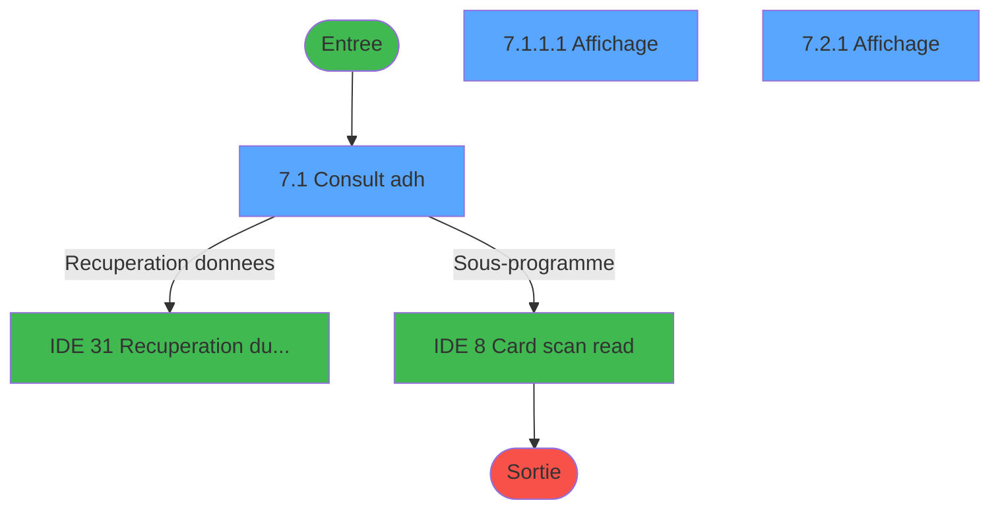
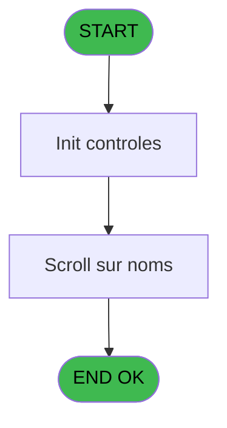
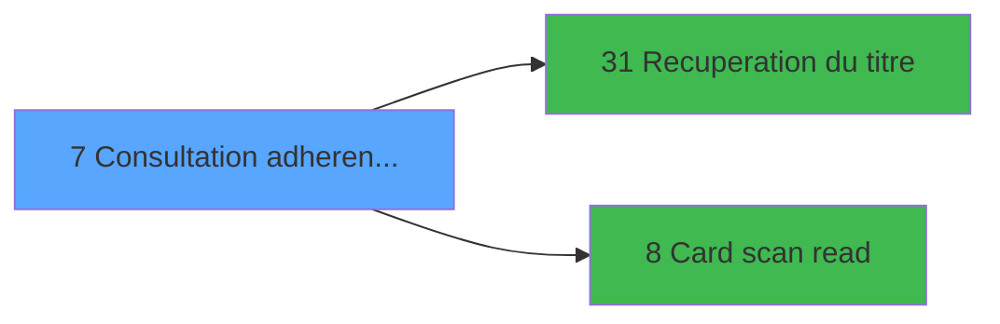

# EXF IDE 7 - Consultation adherent@ GM

> **Analyse**: Phases 1-4 2026-02-03 10:52 -> 10:52 (15s) | Assemblage 10:52
> **Pipeline**: V7.2 Enrichi
> **Structure**: 4 onglets (Resume | Ecrans | Donnees | Connexions)

<!-- TAB:Resume -->

## 1. FICHE D'IDENTITE

| Attribut | Valeur |
|----------|--------|
| Projet | EXF |
| IDE Position | 7 |
| Nom Programme | Consultation adherent@ GM |
| Fichier source | `Prg_7.xml` |
| Dossier IDE | General |
| Taches | 8 (3 ecrans visibles) |
| Tables modifiees | 0 |
| Programmes appeles | 2 |

## 2. DESCRIPTION FONCTIONNELLE

**Consultation adherent@ GM** assure la gestion complete de ce processus, accessible depuis [Menu ventes (IDE 13)](EXF-IDE-13.md).

Le flux de traitement s'organise en **2 blocs fonctionnels** :

- **Traitement** (6 taches) : traitements metier divers
- **Consultation** (2 taches) : ecrans de recherche, selection et consultation

Detail : phases du traitement

#### Phase 1 : Traitement (6 taches)

- **7** - (sans nom) **[[ECRAN]](#ecran-t1)**
- **7.1** - Consult adh **[[ECRAN]](#ecran-t2)**
- **7.1.1** - Fiche **[[ECRAN]](#ecran-t3)**
- **7.1.2** - Exit
- **7.2** - Fiche **[[ECRAN]](#ecran-t6)**
- **7.3** - (sans nom) **[[ECRAN]](#ecran-t8)**

Delegue a : [Recuperation du titre (IDE 31)](EXF-IDE-31.md), [Card scan read (IDE 8)](EXF-IDE-8.md)

#### Phase 2 : Consultation (2 taches)

- **7.1.1.1** - Affichage **[[ECRAN]](#ecran-t4)**
- **7.2.1** - Affichage **[[ECRAN]](#ecran-t7)**

Delegue a : [Recuperation du titre (IDE 31)](EXF-IDE-31.md)

## 3. BLOCS FONCTIONNELS

### 3.1 Traitement (6 taches)

Traitements internes.

---

#### 7 - (sans nom) [[ECRAN]](#ecran-t1)

**Role** : Tache d'orchestration : point d'entree du programme (6 sous-taches). Coordonne l'enchainement des traitements.
**Ecran** : 166 x 13 DLU (MDI) | [Voir mockup](#ecran-t1)

5 sous-taches directes

| Tache | Nom | Bloc |
|-------|-----|------|
| [7.1](#t2) | Consult adh **[[ECRAN]](#ecran-t2)** | Traitement |
| [7.1.1](#t3) | Fiche **[[ECRAN]](#ecran-t3)** | Traitement |
| [7.1.2](#t5) | Exit | Traitement |
| [7.2](#t6) | Fiche **[[ECRAN]](#ecran-t6)** | Traitement |
| [7.3](#t8) | (sans nom) **[[ECRAN]](#ecran-t8)** | Traitement |

**Delegue a** : [Recuperation du titre (IDE 31)](EXF-IDE-31.md), [Card scan read (IDE 8)](EXF-IDE-8.md)

---

#### 7.1 - Consult adh [[ECRAN]](#ecran-t2)

**Role** : Traitement : Consult adh.
**Ecran** : 1178 x 243 DLU (MDI) | [Voir mockup](#ecran-t2)
**Delegue a** : [Recuperation du titre (IDE 31)](EXF-IDE-31.md), [Card scan read (IDE 8)](EXF-IDE-8.md)

---

#### 7.1.1 - Fiche [[ECRAN]](#ecran-t3)

**Role** : Traitement : Fiche.
**Ecran** : 678 x 124 DLU (MDI) | [Voir mockup](#ecran-t3)
**Variables liees** : K (W0 from Fiche GM)
**Delegue a** : [Recuperation du titre (IDE 31)](EXF-IDE-31.md), [Card scan read (IDE 8)](EXF-IDE-8.md)

---

#### 7.1.2 - Exit

**Role** : Traitement : Exit.
**Delegue a** : [Recuperation du titre (IDE 31)](EXF-IDE-31.md), [Card scan read (IDE 8)](EXF-IDE-8.md)

---

#### 7.2 - Fiche [[ECRAN]](#ecran-t6)

**Role** : Traitement : Fiche.
**Ecran** : 682 x 127 DLU (MDI) | [Voir mockup](#ecran-t6)
**Variables liees** : K (W0 from Fiche GM)
**Delegue a** : [Recuperation du titre (IDE 31)](EXF-IDE-31.md), [Card scan read (IDE 8)](EXF-IDE-8.md)

---

#### 7.3 - (sans nom) [[ECRAN]](#ecran-t8)

**Role** : Traitement interne.
**Ecran** : 96 x 24 DLU (MDI) | [Voir mockup](#ecran-t8)
**Delegue a** : [Recuperation du titre (IDE 31)](EXF-IDE-31.md), [Card scan read (IDE 8)](EXF-IDE-8.md)

### 3.2 Consultation (2 taches)

Ecrans de recherche et consultation.

---

#### 7.1.1.1 - Affichage [[ECRAN]](#ecran-t4)

**Role** : Reinitialisation : Affichage.
**Ecran** : 685 x 204 DLU (MDI) | [Voir mockup](#ecran-t4)

---

#### 7.2.1 - Affichage [[ECRAN]](#ecran-t7)

**Role** : Reinitialisation : Affichage.
**Ecran** : 805 x 0 DLU (MDI) | [Voir mockup](#ecran-t7)

## 5. REGLES METIER

*(Aucune regle metier identifiee)*

## 6. CONTEXTE

- **Appele par**: [Menu ventes (IDE 13)](EXF-IDE-13.md)
- **Appelle**: 2 programmes | **Tables**: 4 (W:0 R:2 L:3) | **Taches**: 8 | **Expressions**: 5

<!-- TAB:Ecrans -->

## 8. ECRANS

### 8.1 Forms visibles (3 / 8)

| # | Position | Tache | Nom | Type | Largeur | Hauteur | Bloc |
|---|----------|-------|-----|------|---------|---------|------|
| 1 | 7.1 | 7.1 | Consult adh | MDI | 1178 | 243 | Traitement |
| 2 | 7.1.1.1 | 7.1.1.1 | Affichage | MDI | 685 | 204 | Consultation |
| 3 | 7.2.1 | 7.2.1 | Affichage | MDI | 805 | 0 | Consultation |

### 8.2 Mockups Ecrans

---

#### 7.1 - Consult adh
**Tache** : [7.1](#t2) | **Type** : MDI | **Dimensions** : 1178 x 243 DLU
**Bloc** : Traitement | **Titre IDE** : Consult adh

<!-- FORM-DATA:
{
    "width":  1178,
    "vFactor":  8,
    "type":  "MDI",
    "hFactor":  8,
    "controls":  [
                     {
                         "x":  0,
                         "type":  "label",
                         "var":  "",
                         "y":  0,
                         "w":  1171,
                         "fmt":  "",
                         "name":  "",
                         "h":  21,
                         "color":  "",
                         "text":  "",
                         "parent":  null
                     },
                     {
                         "x":  15,
                         "type":  "label",
                         "var":  "",
                         "y":  32,
                         "w":  413,
                         "fmt":  "",
                         "name":  "",
                         "h":  173,
                         "color":  "",
                         "text":  "",
                         "parent":  null
                     },
                     {
                         "x":  437,
                         "type":  "table",
                         "var":  "",
                         "name":  "",
                         "titleH":  12,
                         "color":  "110",
                         "w":  733,
                         "y":  34,
                         "fmt":  "",
                         "parent":  null,
                         "text":  "",
                         "rowH":  13,
                         "h":  169,
                         "cols":  [
                                      {
                                          "title":  "Nom",
                                          "layer":  1,
                                          "w":  387
                                      },
                                      {
                                          "title":  "Prénom",
                                          "layer":  2,
                                          "w":  136
                                      },
                                      {
                                          "title":  "Sexe",
                                          "layer":  3,
                                          "w":  67
                                      },
                                      {
                                          "title":  "Logement",
                                          "layer":  4,
                                          "w":  106
                                      }
                                  ],
                         "rows":  4
                     },
                     {
                         "x":  443,
                         "type":  "label",
                         "var":  "",
                         "y":  48,
                         "w":  34,
                         "fmt":  "",
                         "name":  "",
                         "h":  9,
                         "color":  "144",
                         "text":  "8",
                         "parent":  6
                     },
                     {
                         "x":  109,
                         "type":  "label",
                         "var":  "",
                         "y":  102,
                         "w":  229,
                         "fmt":  "",
                         "name":  "",
                         "h":  8,
                         "color":  "7",
                         "text":  "Nom du GM",
                         "parent":  5
                     },
                     {
                         "x":  0,
                         "type":  "label",
                         "var":  "",
                         "y":  216,
                         "w":  1168,
                         "fmt":  "",
                         "name":  "",
                         "h":  24,
                         "color":  "",
                         "text":  "",
                         "parent":  null
                     },
                     {
                         "x":  35,
                         "type":  "label",
                         "var":  "",
                         "y":  176,
                         "w":  310,
                         "fmt":  "",
                         "name":  "",
                         "h":  15,
                         "color":  "",
                         "text":  "{\\rtf1\\ansi\\deff0\\deftab720{\\fonttbl{\\f0\\fswiss MS Sans Serif;}{\\f1\\froman\\fcharset2 Symbol;}{\\f2\\fswiss\\fprq2 System;}{\\f3\\fswiss\\fprq2 MS Sans Serif;}}\r\n{\\colortbl\\red0\\green0\\blue0;\\red0\\green0\\blue160;}\r\n\\deflang1036\\pard{\\*\\pn\\pnlvlblt\\pnf1\\pnindent0{\\pntxtb\\\u0027b7}}\\plain\\f3\\fs16\\cf0\\b {\\pntext\\f1\\\u0027b7\\tab} Non GM taper sur la touche  \\plain\\f3\\fs16\\cf1\\b /\\plain\\f3\\fs24\\cf1\\b \r\n\\par }\r\n",
                         "parent":  5
                     },
                     {
                         "x":  774,
                         "type":  "button",
                         "var":  "",
                         "y":  219,
                         "w":  168,
                         "fmt":  "\u0026Scan Card",
                         "name":  "SCANCARD",
                         "h":  18,
                         "color":  "",
                         "text":  "",
                         "parent":  null
                     },
                     {
                         "x":  8,
                         "type":  "button",
                         "var":  "",
                         "y":  219,
                         "w":  168,
                         "fmt":  "\u0026Quitter",
                         "name":  "Bouton Quitter",
                         "h":  18,
                         "color":  "",
                         "text":  "",
                         "parent":  null
                     },
                     {
                         "x":  477,
                         "type":  "edit",
                         "var":  "",
                         "y":  49,
                         "w":  344,
                         "fmt":  "",
                         "name":  "",
                         "h":  8,
                         "color":  "110",
                         "text":  "",
                         "parent":  6
                     },
                     {
                         "x":  846,
                         "type":  "edit",
                         "var":  "",
                         "y":  49,
                         "w":  98,
                         "fmt":  "",
                         "name":  "",
                         "h":  8,
                         "color":  "110",
                         "text":  "",
                         "parent":  6
                     },
                     {
                         "x":  1046,
                         "type":  "edit",
                         "var":  "",
                         "y":  49,
                         "w":  75,
                         "fmt":  "",
                         "name":  "",
                         "h":  8,
                         "color":  "110",
                         "text":  "",
                         "parent":  6
                     },
                     {
                         "x":  120,
                         "type":  "edit",
                         "var":  "",
                         "y":  116,
                         "w":  205,
                         "fmt":  "",
                         "name":  "SAISIENOM",
                         "h":  13,
                         "color":  "6",
                         "text":  "",
                         "parent":  5
                     },
                     {
                         "x":  135,
                         "type":  "edit",
                         "var":  "",
                         "y":  118,
                         "w":  171,
                         "fmt":  "",
                         "name":  "SAISIENOMSUITE",
                         "h":  10,
                         "color":  "6",
                         "text":  "",
                         "parent":  5
                     },
                     {
                         "x":  5,
                         "type":  "image",
                         "var":  "",
                         "y":  2,
                         "w":  59,
                         "fmt":  "",
                         "name":  "",
                         "h":  18,
                         "color":  "",
                         "text":  "",
                         "parent":  null
                     },
                     {
                         "x":  75,
                         "type":  "edit",
                         "var":  "",
                         "y":  6,
                         "w":  267,
                         "fmt":  "20",
                         "name":  "",
                         "h":  8,
                         "color":  "",
                         "text":  "",
                         "parent":  null
                     },
                     {
                         "x":  960,
                         "type":  "edit",
                         "var":  "",
                         "y":  6,
                         "w":  203,
                         "fmt":  "WWW DD MMM YYYYT",
                         "name":  "",
                         "h":  8,
                         "color":  "",
                         "text":  "",
                         "parent":  null
                     },
                     {
                         "x":  981,
                         "type":  "edit",
                         "var":  "",
                         "y":  49,
                         "w":  30,
                         "fmt":  "2",
                         "name":  "",
                         "h":  8,
                         "color":  "110",
                         "text":  "",
                         "parent":  6
                     },
                     {
                         "x":  24,
                         "type":  "image",
                         "var":  "",
                         "y":  35,
                         "w":  86,
                         "fmt":  "",
                         "name":  "",
                         "h":  42,
                         "color":  "",
                         "text":  "",
                         "parent":  null
                     },
                     {
                         "x":  250,
                         "type":  "image",
                         "var":  "",
                         "y":  38,
                         "w":  160,
                         "fmt":  "",
                         "name":  "",
                         "h":  46,
                         "color":  "",
                         "text":  "",
                         "parent":  null
                     },
                     {
                         "x":  990,
                         "type":  "button",
                         "var":  "",
                         "y":  219,
                         "w":  168,
                         "fmt":  "\u0026Non GM",
                         "name":  "Autre GM",
                         "h":  18,
                         "color":  "",
                         "text":  "",
                         "parent":  null
                     }
                 ],
    "taskId":  "7.1",
    "height":  243
}
-->

<strong>Champs : 8 champs</strong>

| Pos (x,y) | Nom | Variable | Type |
|-----------|-----|----------|------|
| 477,49 | (sans nom) | - | edit |
| 846,49 | (sans nom) | - | edit |
| 1046,49 | (sans nom) | - | edit |
| 120,116 | SAISIENOM | - | edit |
| 135,118 | SAISIENOMSUITE | - | edit |
| 75,6 | 20 | - | edit |
| 960,6 | WWW DD MMM YYYYT | - | edit |
| 981,49 | 2 | - | edit |

<strong>Boutons : 3 boutons</strong>

| Bouton | Pos (x,y) | Action |
|--------|-----------|--------|
| Scan Card | 774,219 | Appel [Card scan read (IDE 8)](EXF-IDE-8.md) |
| Quitter | 8,219 | Quitte le programme |
| Non GM | 990,219 | Bouton fonctionnel |

---

#### 7.1.1.1 - Affichage
**Tache** : [7.1.1.1](#t4) | **Type** : MDI | **Dimensions** : 685 x 204 DLU
**Bloc** : Consultation | **Titre IDE** : Affichage

<!-- FORM-DATA:
{
    "width":  685,
    "vFactor":  8,
    "type":  "MDI",
    "hFactor":  8,
    "controls":  [
                     {
                         "x":  2,
                         "type":  "label",
                         "var":  "",
                         "y":  1,
                         "w":  676,
                         "fmt":  "",
                         "name":  "",
                         "h":  17,
                         "color":  "",
                         "text":  "",
                         "parent":  null
                     },
                     {
                         "x":  34,
                         "type":  "table",
                         "var":  "",
                         "name":  "",
                         "titleH":  12,
                         "color":  "110",
                         "w":  627,
                         "y":  44,
                         "fmt":  "",
                         "parent":  null,
                         "text":  "",
                         "rowH":  14,
                         "h":  85,
                         "cols":  [
                                      {
                                          "title":  "Date",
                                          "layer":  1,
                                          "w":  144
                                      },
                                      {
                                          "title":  "Excursion",
                                          "layer":  2,
                                          "w":  238
                                      },
                                      {
                                          "title":  "Montant",
                                          "layer":  3,
                                          "w":  212
                                      }
                                  ],
                         "rows":  3
                     },
                     {
                         "x":  176,
                         "type":  "label",
                         "var":  "",
                         "y":  135,
                         "w":  160,
                         "fmt":  "",
                         "name":  "",
                         "h":  8,
                         "color":  "155",
                         "text":  "W1 EZCard Compte",
                         "parent":  null
                     },
                     {
                         "x":  181,
                         "type":  "label",
                         "var":  "",
                         "y":  147,
                         "w":  158,
                         "fmt":  "",
                         "name":  "",
                         "h":  8,
                         "color":  "155",
                         "text":  "W1 EZCard Filiation",
                         "parent":  null
                     },
                     {
                         "x":  254,
                         "type":  "label",
                         "var":  "",
                         "y":  162,
                         "w":  110,
                         "fmt":  "",
                         "name":  "",
                         "h":  8,
                         "color":  "155",
                         "text":  "W1 code GM",
                         "parent":  null
                     },
                     {
                         "x":  0,
                         "type":  "label",
                         "var":  "",
                         "y":  179,
                         "w":  676,
                         "fmt":  "",
                         "name":  "",
                         "h":  21,
                         "color":  "",
                         "text":  "",
                         "parent":  null
                     },
                     {
                         "x":  182,
                         "type":  "edit",
                         "var":  "",
                         "y":  60,
                         "w":  232,
                         "fmt":  "",
                         "name":  "",
                         "h":  8,
                         "color":  "110",
                         "text":  "",
                         "parent":  5
                     },
                     {
                         "x":  427,
                         "type":  "edit",
                         "var":  "",
                         "y":  60,
                         "w":  198,
                         "fmt":  "",
                         "name":  "",
                         "h":  8,
                         "color":  "110",
                         "text":  "",
                         "parent":  5
                     },
                     {
                         "x":  46,
                         "type":  "edit",
                         "var":  "",
                         "y":  60,
                         "w":  120,
                         "fmt":  "",
                         "name":  "",
                         "h":  8,
                         "color":  "110",
                         "text":  "",
                         "parent":  5
                     },
                     {
                         "x":  35,
                         "type":  "edit",
                         "var":  "",
                         "y":  29,
                         "w":  622,
                         "fmt":  "",
                         "name":  "",
                         "h":  14,
                         "color":  "1",
                         "text":  "",
                         "parent":  null
                     },
                     {
                         "x":  465,
                         "type":  "edit",
                         "var":  "",
                         "y":  5,
                         "w":  203,
                         "fmt":  "WWW DD MMM YYYYT",
                         "name":  "",
                         "h":  8,
                         "color":  "",
                         "text":  "",
                         "parent":  null
                     },
                     {
                         "x":  5,
                         "type":  "image",
                         "var":  "",
                         "y":  137,
                         "w":  94,
                         "fmt":  "",
                         "name":  "",
                         "h":  37,
                         "color":  "155",
                         "text":  "",
                         "parent":  null
                     },
                     {
                         "x":  4,
                         "type":  "button",
                         "var":  "",
                         "y":  181,
                         "w":  154,
                         "fmt":  "\u0026Quitter",
                         "name":  "",
                         "h":  18,
                         "color":  "",
                         "text":  "",
                         "parent":  16
                     },
                     {
                         "x":  5,
                         "type":  "edit",
                         "var":  "",
                         "y":  5,
                         "w":  267,
                         "fmt":  "20",
                         "name":  "",
                         "h":  8,
                         "color":  "",
                         "text":  "",
                         "parent":  null
                     }
                 ],
    "taskId":  "7.1.1.1",
    "height":  204
}
-->

<strong>Champs : 6 champs</strong>

| Pos (x,y) | Nom | Variable | Type |
|-----------|-----|----------|------|
| 182,60 | (sans nom) | - | edit |
| 427,60 | (sans nom) | - | edit |
| 46,60 | (sans nom) | - | edit |
| 35,29 | (sans nom) | - | edit |
| 465,5 | WWW DD MMM YYYYT | - | edit |
| 5,5 | 20 | - | edit |

<strong>Boutons : 1 boutons</strong>

| Bouton | Pos (x,y) | Action |
|--------|-----------|--------|
| Quitter | 4,181 | Quitte le programme |

---

#### 7.2.1 - Affichage
**Tache** : [7.2.1](#t7) | **Type** : MDI | **Dimensions** : 805 x 0 DLU
**Bloc** : Consultation | **Titre IDE** : Affichage

<!-- FORM-DATA:
{
    "width":  805,
    "vFactor":  8,
    "type":  "MDI",
    "hFactor":  8,
    "controls":  [
                     {
                         "x":  2,
                         "type":  "label",
                         "var":  "",
                         "y":  1,
                         "w":  801,
                         "fmt":  "",
                         "name":  "",
                         "h":  17,
                         "color":  "",
                         "text":  "",
                         "parent":  null
                     },
                     {
                         "x":  36,
                         "type":  "table",
                         "var":  "",
                         "name":  "",
                         "titleH":  12,
                         "color":  "110",
                         "w":  733,
                         "y":  78,
                         "fmt":  "",
                         "parent":  null,
                         "text":  "",
                         "rowH":  14,
                         "h":  97,
                         "cols":  [
                                      {
                                          "title":  "Date",
                                          "layer":  1,
                                          "w":  136
                                      },
                                      {
                                          "title":  "Excursion",
                                          "layer":  2,
                                          "w":  240
                                      },
                                      {
                                          "title":  "Montant",
                                          "layer":  3,
                                          "w":  222
                                      },
                                      {
                                          "title":  "Vente",
                                          "layer":  4,
                                          "w":  108
                                      }
                                  ],
                         "rows":  4
                     },
                     {
                         "x":  0,
                         "type":  "label",
                         "var":  "",
                         "y":  179,
                         "w":  804,
                         "fmt":  "",
                         "name":  "",
                         "h":  21,
                         "color":  "",
                         "text":  "",
                         "parent":  null
                     },
                     {
                         "x":  181,
                         "type":  "edit",
                         "var":  "",
                         "y":  94,
                         "w":  232,
                         "fmt":  "",
                         "name":  "",
                         "h":  8,
                         "color":  "6",
                         "text":  "",
                         "parent":  7
                     },
                     {
                         "x":  419,
                         "type":  "edit",
                         "var":  "",
                         "y":  94,
                         "w":  198,
                         "fmt":  "N## ### ### ###.###Z",
                         "name":  "",
                         "h":  8,
                         "color":  "6",
                         "text":  "",
                         "parent":  7
                     },
                     {
                         "x":  42,
                         "type":  "edit",
                         "var":  "",
                         "y":  94,
                         "w":  120,
                         "fmt":  "",
                         "name":  "",
                         "h":  8,
                         "color":  "6",
                         "text":  "",
                         "parent":  7
                     },
                     {
                         "x":  640,
                         "type":  "edit",
                         "var":  "",
                         "y":  94,
                         "w":  98,
                         "fmt":  "",
                         "name":  "",
                         "h":  8,
                         "color":  "6",
                         "text":  "",
                         "parent":  7
                     },
                     {
                         "x":  83,
                         "type":  "edit",
                         "var":  "",
                         "y":  40,
                         "w":  523,
                         "fmt":  "",
                         "name":  "",
                         "h":  8,
                         "color":  "142",
                         "text":  "",
                         "parent":  null
                     },
                     {
                         "x":  593,
                         "type":  "edit",
                         "var":  "",
                         "y":  5,
                         "w":  203,
                         "fmt":  "WWW DD MMM YYYYT",
                         "name":  "",
                         "h":  8,
                         "color":  "",
                         "text":  "",
                         "parent":  null
                     },
                     {
                         "x":  669,
                         "type":  "image",
                         "var":  "",
                         "y":  30,
                         "w":  94,
                         "fmt":  "",
                         "name":  "",
                         "h":  43,
                         "color":  "155",
                         "text":  "",
                         "parent":  null
                     },
                     {
                         "x":  83,
                         "type":  "edit",
                         "var":  "",
                         "y":  57,
                         "w":  523,
                         "fmt":  "40",
                         "name":  "",
                         "h":  8,
                         "color":  "142",
                         "text":  "",
                         "parent":  null
                     },
                     {
                         "x":  4,
                         "type":  "button",
                         "var":  "",
                         "y":  181,
                         "w":  154,
                         "fmt":  "\u0026Quitter",
                         "name":  "",
                         "h":  18,
                         "color":  "",
                         "text":  "",
                         "parent":  16
                     },
                     {
                         "x":  5,
                         "type":  "edit",
                         "var":  "",
                         "y":  5,
                         "w":  267,
                         "fmt":  "20",
                         "name":  "",
                         "h":  8,
                         "color":  "",
                         "text":  "",
                         "parent":  null
                     }
                 ],
    "taskId":  "7.2.1",
    "height":  0
}
-->

<strong>Champs : 8 champs</strong>

| Pos (x,y) | Nom | Variable | Type |
|-----------|-----|----------|------|
| 181,94 | (sans nom) | - | edit |
| 419,94 | N## ### ### ###.###Z | - | edit |
| 42,94 | (sans nom) | - | edit |
| 640,94 | (sans nom) | - | edit |
| 83,40 | (sans nom) | - | edit |
| 593,5 | WWW DD MMM YYYYT | - | edit |
| 83,57 | 40 | - | edit |
| 5,5 | 20 | - | edit |

<strong>Boutons : 1 boutons</strong>

| Bouton | Pos (x,y) | Action |
|--------|-----------|--------|
| Quitter | 4,181 | Quitte le programme |

## 9. NAVIGATION

### 9.1 Enchainement des ecrans

**Detail par enchainement :**

| Depuis | Action | Vers | Retour |
|--------|--------|------|--------|
| Consult adh | Recuperation donnees | [Recuperation du titre (IDE 31)](EXF-IDE-31.md) | Retour ecran |
| Consult adh | Sous-programme | [Card scan read (IDE 8)](EXF-IDE-8.md) | Retour ecran |

### 9.3 Structure hierarchique (8 taches)

| Position | Tache | Type | Dimensions | Bloc |
|----------|-------|------|------------|------|
| **7.1** | [**(sans nom)** (7)](#t1) [mockup](#ecran-t1) | MDI | 166x13 | Traitement |
| 7.1.1 | [Consult adh (7.1)](#t2) [mockup](#ecran-t2) | MDI | 1178x243 | |
| 7.1.2 | [Fiche (7.1.1)](#t3) [mockup](#ecran-t3) | MDI | 678x124 | |
| 7.1.3 | [Exit (7.1.2)](#t5) | MDI | - | |
| 7.1.4 | [Fiche (7.2)](#t6) [mockup](#ecran-t6) | MDI | 682x127 | |
| 7.1.5 | [(sans nom) (7.3)](#t8) [mockup](#ecran-t8) | MDI | 96x24 | |
| **7.2** | [**Affichage** (7.1.1.1)](#t4) [mockup](#ecran-t4) | MDI | 685x204 | Consultation |
| 7.2.1 | [Affichage (7.2.1)](#t7) [mockup](#ecran-t7) | MDI | 805x0 | |

### 9.4 Algorigramme

> **Legende**: Vert = START/END OK | Rouge = END KO | Bleu = Decisions
> *Algorigramme auto-genere. Utiliser `/algorigramme` pour une synthese metier detaillee.*

<!-- TAB:Donnees -->

## 10. TABLES

### Tables utilisees (4)

| ID | Nom | Description | Type | R | W | L | Usages |
|----|-----|-------------|------|---|---|---|--------|
| 30 | gm-recherche_____gmr | Index de recherche | DB | R |   |   | 2 |
| 34 | hebergement______heb | Hebergement (chambres) | DB |   |   | L | 1 |
| 300 | excursions_______exc |  | DB |   |   | L | 2 |
| 309 | vente____________vep | Donnees de ventes | DB | R |   | L | 2 |

### Colonnes par table (2 / 2 tables avec colonnes identifiees)

Table 30 - gm-recherche_____gmr (R) - 2 usages

| Lettre | Variable | Acces | Type |
|--------|----------|-------|------|
| A | Bouton Scan Card | R | Alpha |
| B | Bouton Quitter | R | Alpha |
| C | W1 date debut | R | Alpha |
| D | W1 date fin | R | Alpha |
| E | W1 detecte '/' | R | Alpha |
| F | W1 chaîne_recherchee | R | Alpha |
| G | W1 titre scroll | R | Alpha |
| H | W1 code GM | R | Numeric |
| I | W1 prenom GM | R | Alpha |
| J | W1 EZCard Compte | R | Numeric |
| K | W1 EZCard Filiation | R | Numeric |
| L | W1 EZCard detecte * | R | Alpha |
| M | W1 EZCard chaine | R | Alpha |
| N | W1 EZCard Selection | R | Logical |
| O | W1 EZCard Statut | R | Alpha |
| P | W1 EZCard nom | R | Alpha |
| Q | W1 EZCard prenom | R | Alpha |
| R | W1 EZCARD Cancel | R | Logical |
| S | W1 EZCARD OutOfStay | R | Logical |

Table 309 - vente____________vep (R/L) - 2 usages

| Lettre | Variable | Acces | Type |
|--------|----------|-------|------|
| A | W creation | R | Logical |
| B | Titre affichage | R | Alpha |
| C | v. titre | R | Alpha |

## 11. VARIABLES

### 11.1 Parametres entrants (1)

Variables recues du programme appelant ([Menu ventes (IDE 13)](EXF-IDE-13.md)).

| Lettre | Nom | Type | Usage dans |
|--------|-----|------|-----------|
| A | P0 masque montant | Alpha | - |

### 11.2 Variables de travail (11)

Variables internes au programme.

| Lettre | Nom | Type | Usage dans |
|--------|-----|------|-----------|
| B | W0 choix action | Alpha | 4x calcul interne |
| C | W0 chaîne recherche | Alpha | - |
| D | W0 societe | Alpha | - |
| E | W0 code GM | Numeric | - |
| F | W0 filiation | Numeric | - |
| G | W0 nom | Alpha | - |
| H | W0 prenom | Alpha | - |
| I | W0 EZCard Compte | Numeric | - |
| J | W0 EZCard Filiation | Numeric | - |
| K | W0 from Fiche GM | Logical | - |
| L | W0 Quitter | Logical | 1x calcul interne |

### 11.3 Autres (7)

Variables diverses.

| Lettre | Nom | Type | Usage dans |
|--------|-----|------|-----------|
| M | W1 EZCard chaine | Alpha | - |
| N | W1 EZCard Selection | Logical | - |
| O | W1 EZCard Statut | Alpha | - |
| P | W1 EZCard nom | Alpha | - |
| Q | W1 EZCard prenom | Alpha | - |
| R | W1 EZCARD Cancel | Logical | - |
| S | W1 EZCARD OutOfStay | Logical | - |

Toutes les 19 variables (liste complete)

| Cat | Lettre | Nom Variable | Type |
|-----|--------|--------------|------|
| P0 | **A** | P0 masque montant | Alpha |
| W0 | **B** | W0 choix action | Alpha |
| W0 | **C** | W0 chaîne recherche | Alpha |
| W0 | **D** | W0 societe | Alpha |
| W0 | **E** | W0 code GM | Numeric |
| W0 | **F** | W0 filiation | Numeric |
| W0 | **G** | W0 nom | Alpha |
| W0 | **H** | W0 prenom | Alpha |
| W0 | **I** | W0 EZCard Compte | Numeric |
| W0 | **J** | W0 EZCard Filiation | Numeric |
| W0 | **K** | W0 from Fiche GM | Logical |
| W0 | **L** | W0 Quitter | Logical |
| Autre | **M** | W1 EZCard chaine | Alpha |
| Autre | **N** | W1 EZCard Selection | Logical |
| Autre | **O** | W1 EZCard Statut | Alpha |
| Autre | **P** | W1 EZCard nom | Alpha |
| Autre | **Q** | W1 EZCard prenom | Alpha |
| Autre | **R** | W1 EZCARD Cancel | Logical |
| Autre | **S** | W1 EZCARD OutOfStay | Logical |

## 12. EXPRESSIONS

**5 / 5 expressions decodees (100%)**

### 12.1 Repartition par type

| Type | Expressions | Regles |
|------|-------------|--------|
| CONSTANTE | 1 | 0 |
| CONDITION | 4 | 0 |

### 12.2 Expressions cles par type

#### CONSTANTE (1 expressions)

| Type | IDE | Expression | Regle |
|------|-----|------------|-------|
| CONSTANTE | 4 | `'S'` | - |

#### CONDITION (4 expressions)

| Type | IDE | Expression | Regle |
|------|-----|------------|-------|
| CONDITION | 3 | `(W0 choix action [B]='M' OR W0 choix action [B]='C') AND NOT (W0 Quitter [L])` | - |
| CONDITION | 5 | `W0 choix action [B]='F'` | - |
| CONDITION | 1 | `W0 choix action [B]='S'` | - |
| CONDITION | 2 | `W0 choix action [B]='F'` | - |

<!-- TAB:Connexions -->

## 13. GRAPHE D'APPELS

### 13.1 Chaine depuis Main (Callers)

Main -> ... -> [Menu ventes (IDE 13)](EXF-IDE-13.md) -> **Consultation adherent@ GM (IDE 7)**

### 13.2 Callers

| IDE | Nom Programme | Nb Appels |
|-----|---------------|-----------|
| [13](EXF-IDE-13.md) | Menu ventes | 1 |

### 13.3 Callees (programmes appeles)

### 13.4 Detail Callees avec contexte

| IDE | Nom Programme | Appels | Contexte |
|-----|---------------|--------|----------|
| [31](EXF-IDE-31.md) | Recuperation du titre | 5 | Recuperation donnees |
| [8](EXF-IDE-8.md) | Card scan read | 1 | Sous-programme |

## 14. RECOMMANDATIONS MIGRATION

### 14.1 Profil du programme

| Metrique | Valeur | Impact migration |
|----------|--------|-----------------|
| Lignes de logique | 263 | Taille moyenne |
| Expressions | 5 | Peu de logique |
| Tables WRITE | 0 | Impact faible |
| Sous-programmes | 2 | Peu de dependances |
| Ecrans visibles | 3 | Quelques ecrans |
| Code desactive | 0% (0 / 263) | Code sain |
| Regles metier | 0 | Pas de regle identifiee |

### 14.2 Plan de migration par bloc

#### Traitement (6 taches: 5 ecrans, 1 traitement)

- **Strategie** : Orchestrateur avec 5 ecrans (Razor/React) et 1 traitements backend (services).
- Les ecrans deviennent des composants UI, les traitements invisibles deviennent des services injectables.
- 2 sous-programme(s) a migrer ou a reutiliser depuis les services existants.
- Decomposer les taches en services unitaires testables.

#### Consultation (2 taches: 2 ecrans, 0 traitement)

- **Strategie** : Composants de recherche/selection en modales.
- 2 ecrans : Affichage, Affichage

### 14.3 Dependances critiques

| Dependance | Type | Appels | Impact |
|------------|------|--------|--------|
| [Recuperation du titre (IDE 31)](EXF-IDE-31.md) | Sous-programme | 5x | **CRITIQUE** - Recuperation donnees |
| [Card scan read (IDE 8)](EXF-IDE-8.md) | Sous-programme | 1x | Normale - Sous-programme |

---
*Spec DETAILED generee par Pipeline V7.2 - 2026-02-03 10:52*
