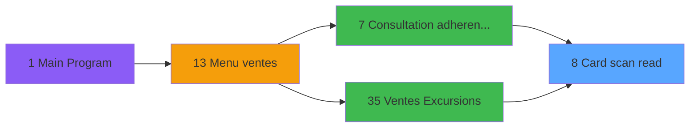

# EXF IDE 8 - Card scan read

> **Analyse**: Phases 1-4 2026-02-03 10:52 -> 10:52 (17s) | Assemblage 10:52
> **Pipeline**: V7.2 Enrichi
> **Structure**: 4 onglets (Resume | Ecrans | Donnees | Connexions)

<!-- TAB:Resume -->

## 1. FICHE D'IDENTITE

| Attribut | Valeur |
|----------|--------|
| Projet | EXF |
| IDE Position | 8 |
| Nom Programme | Card scan read |
| Fichier source | `Prg_8.xml` |
| Dossier IDE | General |
| Taches | 1 (1 ecrans visibles) |
| Tables modifiees | 0 |
| Programmes appeles | 0 |

## 2. DESCRIPTION FONCTIONNELLE

**Card scan read** assure la gestion complete de ce processus, accessible depuis [Ventes Excursions (IDE 35)](EXF-IDE-35.md), [Consultation adherent@ GM (IDE 7)](EXF-IDE-7.md).

Le flux de traitement s'organise en **1 blocs fonctionnels** :

- **Traitement** (1 tache) : traitements metier divers

**Logique metier** : 1 regles identifiees couvrant conditions metier.

## 3. BLOCS FONCTIONNELS

### 3.1 Traitement (1 tache)

Traitements internes.

---

#### 8 - EZCard Identification [[ECRAN]](#ecran-t1)

**Role** : Traitement : EZCard Identification.
**Ecran** : 366 x 68 DLU (MDI) | [Voir mockup](#ecran-t1)
**Variables liees** : E (p.EZCard select)

## 5. REGLES METIER

1 regles identifiees:

### Autres (1 regles)

#### [RM-001] Condition toujours vraie (flag actif)

| Element | Detail |
|---------|--------|
| **Condition** | `Date ()<[W] OR Date ()>[X]` |
| **Si vrai** | 'TRUE'LOG |
| **Si faux** | 'FALSE'LOG) |
| **Expression source** | Expression 21 : `IF (Date ()<[W] OR Date ()>[X],'TRUE'LOG,'FALSE'LOG)` |
| **Exemple** | Si Date ()<[W] OR Date ()>[X] → 'TRUE'LOG. Sinon → 'FALSE'LOG) |

## 6. CONTEXTE

- **Appele par**: [Ventes Excursions (IDE 35)](EXF-IDE-35.md), [Consultation adherent@ GM (IDE 7)](EXF-IDE-7.md)
- **Appelle**: 0 programmes | **Tables**: 2 (W:0 R:1 L:1) | **Taches**: 1 | **Expressions**: 21

<!-- TAB:Ecrans -->

## 8. ECRANS

### 8.1 Forms visibles (1 / 1)

| # | Position | Tache | Nom | Type | Largeur | Hauteur | Bloc |
|---|----------|-------|-----|------|---------|---------|------|
| 1 | 8 | 8 | EZCard Identification | MDI | 366 | 68 | Traitement |

### 8.2 Mockups Ecrans

---

#### 8 - EZCard Identification
**Tache** : [8](#t1) | **Type** : MDI | **Dimensions** : 366 x 68 DLU
**Bloc** : Traitement | **Titre IDE** : EZCard Identification

<!-- FORM-DATA:
{
    "width":  366,
    "vFactor":  4,
    "type":  "MDI",
    "hFactor":  4,
    "controls":  [
                     {
                         "x":  132,
                         "type":  "label",
                         "var":  "",
                         "y":  12,
                         "w":  77,
                         "fmt":  "",
                         "name":  "",
                         "h":  4,
                         "color":  "6",
                         "text":  "Scan EZCard...",
                         "parent":  null
                     },
                     {
                         "x":  157,
                         "type":  "label",
                         "var":  "",
                         "y":  34,
                         "w":  171,
                         "fmt":  "",
                         "name":  "",
                         "h":  8,
                         "color":  "143",
                         "text":  "Carte inconnue",
                         "parent":  null
                     },
                     {
                         "x":  0,
                         "type":  "label",
                         "var":  "",
                         "y":  54,
                         "w":  363,
                         "fmt":  "",
                         "name":  "",
                         "h":  13,
                         "color":  "6",
                         "text":  "",
                         "parent":  null
                     },
                     {
                         "x":  203,
                         "type":  "edit",
                         "var":  "",
                         "y":  25,
                         "w":  83,
                         "fmt":  "",
                         "name":  "pv.card id",
                         "h":  8,
                         "color":  "110",
                         "text":  "",
                         "parent":  null
                     },
                     {
                         "x":  16,
                         "type":  "image",
                         "var":  "",
                         "y":  8,
                         "w":  102,
                         "fmt":  "",
                         "name":  "",
                         "h":  39,
                         "color":  "",
                         "text":  "",
                         "parent":  null
                     },
                     {
                         "x":  262,
                         "type":  "button",
                         "var":  "",
                         "y":  57,
                         "w":  99,
                         "fmt":  "\u0026Abandon",
                         "name":  "ABAN",
                         "h":  9,
                         "color":  "",
                         "text":  "",
                         "parent":  null
                     }
                 ],
    "taskId":  "8",
    "height":  68
}
-->

<strong>Champs : 1 champs</strong>

| Pos (x,y) | Nom | Variable | Type |
|-----------|-----|----------|------|
| 203,25 | pv.card id | - | edit |

<strong>Boutons : 1 boutons</strong>

| Bouton | Pos (x,y) | Action |
|--------|-----------|--------|
| Abandon | 262,57 | Annule et retour au menu |

## 9. NAVIGATION

Ecran unique: **EZCard Identification**

### 9.3 Structure hierarchique (1 tache)

| Position | Tache | Type | Dimensions | Bloc |
|----------|-------|------|------------|------|
| **8.1** | [**EZCard Identification** (8)](#t1) [mockup](#ecran-t1) | MDI | 366x68 | Traitement |

### 9.4 Algorigramme

> **Legende**: Vert = START/END OK | Rouge = END KO | Bleu = Decisions
> *Algorigramme auto-genere. Utiliser `/algorigramme` pour une synthese metier detaillee.*

<!-- TAB:Donnees -->

## 10. TABLES

### Tables utilisees (2)

| ID | Nom | Description | Type | R | W | L | Usages |
|----|-----|-------------|------|---|---|---|--------|
| 30 | gm-recherche_____gmr | Index de recherche | DB | R |   |   | 1 |
| 312 | ez_card |  | DB |   |   | L | 1 |

### Colonnes par table (2 / 1 tables avec colonnes identifiees)

Table 30 - gm-recherche_____gmr (R) - 1 usages

| Lettre | Variable | Acces | Type |
|--------|----------|-------|------|
| A | p.code-8chiffres | R | Numeric |
| B | p.filiation | R | Numeric |
| C | p.chaine U | R | Alpha |
| D | p.chaine U10 | R | Alpha |
| E | p.EZCard select | R | Logical |
| F | pv.card id | R | Alpha |
| G | p.status | R | Alpha |
| H | p.nom | R | Alpha |
| I | p.prenom | R | Alpha |
| J | p.cancel | R | Logical |
| K | p.OutOfStay | R | Logical |
| L | r.card | R | Logical |

## 11. VARIABLES

### 11.1 Parametres entrants (10)

Variables recues du programme appelant ([Ventes Excursions (IDE 35)](EXF-IDE-35.md)).

| Lettre | Nom | Type | Usage dans |
|--------|-----|------|-----------|
| A | p.code-8chiffres | Numeric | - |
| B | p.filiation | Numeric | - |
| C | p.chaine U | Alpha | - |
| D | p.chaine U10 | Alpha | - |
| E | p.EZCard select | Logical | - |
| G | p.status | Alpha | - |
| H | p.nom | Alpha | - |
| I | p.prenom | Alpha | - |
| J | p.cancel | Logical | - |
| K | p.OutOfStay | Logical | - |

### 11.2 Autres (2)

Variables diverses.

| Lettre | Nom | Type | Usage dans |
|--------|-----|------|-----------|
| F | pv.card id | Alpha | 1x refs |
| L | r.card | Logical | 2x refs |

## 12. EXPRESSIONS

**21 / 21 expressions decodees (100%)**

### 12.1 Repartition par type

| Type | Expressions | Regles |
|------|-------------|--------|
| CALCULATION | 1 | 0 |
| CAST_LOGIQUE | 5 | 5 |
| CONSTANTE | 3 | 0 |
| OTHER | 10 | 0 |
| NEGATION | 1 | 0 |
| CONDITION | 1 | 0 |

### 12.2 Expressions cles par type

#### CALCULATION (1 expressions)

| Type | IDE | Expression | Regle |
|------|-----|------------|-------|
| CALCULATION | 5 | `Right (Trim ([U]),Len (Trim ([U]))-1)` | - |

#### CAST_LOGIQUE (5 expressions)

| Type | IDE | Expression | Regle |
|------|-----|------------|-------|
| CAST_LOGIQUE | 21 | `IF (Date ()<[W] OR Date ()>[X],'TRUE'LOG,'FALSE'LOG)` | [RM-001](#rm-RM-001) |
| CAST_LOGIQUE | 19 | `'FALSE'LOG` | - |
| CAST_LOGIQUE | 20 | `'TRUE'LOG` | - |
| CAST_LOGIQUE | 6 | `'TRUE'LOG` | - |
| CAST_LOGIQUE | 16 | `'FALSE'LOG` | - |

#### CONSTANTE (3 expressions)

| Type | IDE | Expression | Regle |
|------|-----|------------|-------|
| CONSTANTE | 18 | `''` | - |
| CONSTANTE | 17 | `0` | - |
| CONSTANTE | 1 | `''` | - |

#### OTHER (10 expressions)

| Type | IDE | Expression | Regle |
|------|-----|------------|-------|
| OTHER | 10 | `[N]` | - |
| OTHER | 9 | `[V]` | - |
| OTHER | 11 | `[O]` | - |
| OTHER | 15 | `pv.card id [F]` | - |
| OTHER | 12 | `[P]` | - |
| ... | | *+5 autres* | |

#### NEGATION (1 expressions)

| Type | IDE | Expression | Regle |
|------|-----|------------|-------|
| NEGATION | 14 | `NOT (r.card [L])` | - |

#### CONDITION (1 expressions)

| Type | IDE | Expression | Regle |
|------|-----|------------|-------|
| CONDITION | 13 | `r.card [L] AND InStr ('VO',[Q])<>0` | - |

### 12.3 Toutes les expressions (21)

Voir les 21 expressions

#### CALCULATION (1)

| IDE | Expression Decodee |
|-----|-------------------|
| 5 | `Right (Trim ([U]),Len (Trim ([U]))-1)` |

#### CAST_LOGIQUE (5)

| IDE | Expression Decodee |
|-----|-------------------|
| 21 | `IF (Date ()<[W] OR Date ()>[X],'TRUE'LOG,'FALSE'LOG)` |
| 6 | `'TRUE'LOG` |
| 16 | `'FALSE'LOG` |
| 19 | `'FALSE'LOG` |
| 20 | `'TRUE'LOG` |

#### CONSTANTE (3)

| IDE | Expression Decodee |
|-----|-------------------|
| 1 | `''` |
| 17 | `0` |
| 18 | `''` |

#### OTHER (10)

| IDE | Expression Decodee |
|-----|-------------------|
| 2 | `[S]` |
| 3 | `[T]` |
| 4 | `Left ([U],1)` |
| 7 | `[Q]` |
| 8 | `[U]` |
| 9 | `[V]` |
| 10 | `[N]` |
| 11 | `[O]` |
| 12 | `[P]` |
| 15 | `pv.card id [F]` |

#### NEGATION (1)

| IDE | Expression Decodee |
|-----|-------------------|
| 14 | `NOT (r.card [L])` |

#### CONDITION (1)

| IDE | Expression Decodee |
|-----|-------------------|
| 13 | `r.card [L] AND InStr ('VO',[Q])<>0` |

<!-- TAB:Connexions -->

## 13. GRAPHE D'APPELS

### 13.1 Chaine depuis Main (Callers)

Main -> ... -> [Ventes Excursions (IDE 35)](EXF-IDE-35.md) -> **Card scan read (IDE 8)**

Main -> ... -> [Consultation adherent@ GM (IDE 7)](EXF-IDE-7.md) -> **Card scan read (IDE 8)**

### 13.2 Callers

| IDE | Nom Programme | Nb Appels |
|-----|---------------|-----------|
| [35](EXF-IDE-35.md) | Ventes Excursions | 6 |
| [7](EXF-IDE-7.md) | Consultation adherent@ GM | 1 |

### 13.3 Callees (programmes appeles)

### 13.4 Detail Callees avec contexte

| IDE | Nom Programme | Appels | Contexte |
|-----|---------------|--------|----------|
| - | (aucun) | - | - |

## 14. RECOMMANDATIONS MIGRATION

### 14.1 Profil du programme

| Metrique | Valeur | Impact migration |
|----------|--------|-----------------|
| Lignes de logique | 59 | Programme compact |
| Expressions | 21 | Peu de logique |
| Tables WRITE | 0 | Impact faible |
| Sous-programmes | 0 | Peu de dependances |
| Ecrans visibles | 1 | Ecran unique ou traitement batch |
| Code desactive | 0% (0 / 59) | Code sain |
| Regles metier | 1 | Quelques regles a preserver |

### 14.2 Plan de migration par bloc

#### Traitement (1 tache: 1 ecran, 0 traitement)

- **Strategie** : 1 composant(s) UI (Razor/React) avec formulaires et validation.
- Decomposer les taches en services unitaires testables.

### 14.3 Dependances critiques

| Dependance | Type | Appels | Impact |
|------------|------|--------|--------|

---
*Spec DETAILED generee par Pipeline V7.2 - 2026-02-03 10:53*
