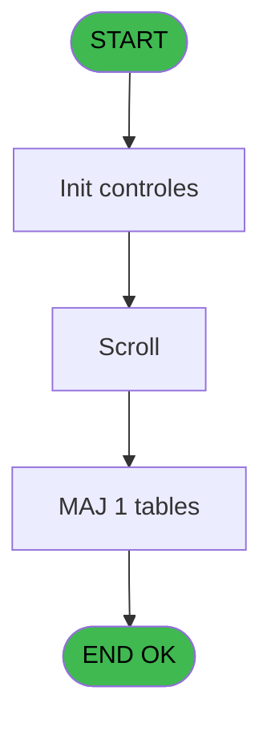

# EXM IDE 10 - Saisie taxes

> **Analyse**: Phases 1-4 2026-02-03 11:12 -> 11:13 (15s) | Assemblage 11:13
> **Pipeline**: V7.2 Enrichi
> **Structure**: 4 onglets (Resume | Ecrans | Donnees | Connexions)

<!-- TAB:Resume -->

## 1. FICHE D'IDENTITE

| Attribut | Valeur |
|----------|--------|
| Projet | EXM |
| IDE Position | 10 |
| Nom Programme | Saisie taxes |
| Fichier source | `Prg_10.xml` |
| Dossier IDE | Autres |
| Taches | 5 (1 ecrans visibles) |
| Tables modifiees | 1 |
| Programmes appeles | 0 |

## 2. DESCRIPTION FONCTIONNELLE

**Saisie taxes** assure la gestion complete de ce processus, accessible depuis [Menu general (IDE 18)](EXM-IDE-18.md).

Le flux de traitement s'organise en **3 blocs fonctionnels** :

- **Calcul** (2 taches) : calculs de montants, stocks ou compteurs
- **Traitement** (2 taches) : traitements metier divers
- **Saisie** (1 tache) : ecrans de saisie utilisateur (formulaires, champs, donnees)

**Donnees modifiees** : 1 tables en ecriture (table_des_tva).

**Logique metier** : 1 regles identifiees couvrant conditions metier.

Detail : phases du traitement

#### Phase 1 : Saisie (1 tache)

- **10** - lieux de vente **[[ECRAN]](#ecran-t1)**

#### Phase 2 : Traitement (2 taches)

- **10.1** - Taxes **[[ECRAN]](#ecran-t2)**
- **10.1.1.2** - Deflag default

#### Phase 3 : Calcul (2 taches)

- **10.1.1** - Calcul tva default
- **10.1.1.1** - Calcul Tva defaut

#### Tables impactees

| Table | Operations | Role metier |
|-------|-----------|-------------|
| table_des_tva | **W** (3 usages) |  |

## 3. BLOCS FONCTIONNELS

### 3.1 Saisie (1 tache)

L'operateur saisit les donnees de la transaction via 1 ecran (lieux de vente).

---

#### 10 - lieux de vente [[ECRAN]](#ecran-t1)

**Role** : Saisie des donnees : lieux de vente.
**Ecran** : 166 x 10 DLU (MDI) | [Voir mockup](#ecran-t1)
**Variables liees** : C (W1 ret.lien vente)

### 3.2 Traitement (2 taches)

Traitements internes.

---

#### 10.1 - Taxes [[ECRAN]](#ecran-t2)

**Role** : Traitement : Taxes.
**Ecran** : 808 x 182 DLU (MDI) | [Voir mockup](#ecran-t2)

---

#### 10.1.1.2 - Deflag default

**Role** : Traitement : Deflag default.

### 3.3 Calcul (2 taches)

Calculs metier : montants, stocks, compteurs.

---

#### 10.1.1 - Calcul tva default

**Role** : Calcul : Calcul tva default.

---

#### 10.1.1.1 - Calcul Tva defaut

**Role** : Calcul : Calcul Tva defaut.

## 5. REGLES METIER

1 regles identifiees:

### Saisie (1 regles)

#### [RM-001] Si W1 ret.lien vente [C] alors 146 sinon 6)

| Element | Detail |
|---------|--------|
| **Condition** | `W1 ret.lien vente [C]` |
| **Si vrai** | 146 |
| **Si faux** | 6) |
| **Variables** | C (W1 ret.lien vente) |
| **Expression source** | Expression 8 : `IF (W1 ret.lien vente [C],146,6)` |
| **Exemple** | Si W1 ret.lien vente [C] → 146. Sinon → 6) |
| **Impact** | Bloc Saisie |

## 6. CONTEXTE

- **Appele par**: [Menu general (IDE 18)](EXM-IDE-18.md)
- **Appelle**: 0 programmes | **Tables**: 1 (W:1 R:0 L:0) | **Taches**: 5 | **Expressions**: 8

<!-- TAB:Ecrans -->

## 8. ECRANS

### 8.1 Forms visibles (1 / 5)

| # | Position | Tache | Nom | Type | Largeur | Hauteur | Bloc |
|---|----------|-------|-----|------|---------|---------|------|
| 1 | 10.1 | 10.1 | Taxes | MDI | 808 | 182 | Traitement |

### 8.2 Mockups Ecrans

---

#### 10.1 - Taxes
**Tache** : [10.1](#t2) | **Type** : MDI | **Dimensions** : 808 x 182 DLU
**Bloc** : Traitement | **Titre IDE** : Taxes

<!-- FORM-DATA:
{
    "width":  808,
    "vFactor":  8,
    "type":  "MDI",
    "hFactor":  8,
    "controls":  [
                     {
                         "x":  2,
                         "type":  "label",
                         "var":  "",
                         "y":  1,
                         "w":  801,
                         "fmt":  "",
                         "name":  "",
                         "h":  17,
                         "color":  "",
                         "text":  "",
                         "parent":  null
                     },
                     {
                         "x":  60,
                         "type":  "table",
                         "var":  "",
                         "name":  "",
                         "titleH":  12,
                         "color":  "110",
                         "w":  506,
                         "y":  26,
                         "fmt":  "",
                         "parent":  null,
                         "text":  "",
                         "rowH":  14,
                         "h":  120,
                         "cols":  [
                                      {
                                          "title":  "Code",
                                          "layer":  1,
                                          "w":  123
                                      },
                                      {
                                          "title":  "Taxe",
                                          "layer":  2,
                                          "w":  216
                                      },
                                      {
                                          "title":  "Défaut",
                                          "layer":  3,
                                          "w":  128
                                      }
                                  ],
                         "rows":  3
                     },
                     {
                         "x":  0,
                         "type":  "label",
                         "var":  "",
                         "y":  155,
                         "w":  802,
                         "fmt":  "",
                         "name":  "",
                         "h":  24,
                         "color":  "",
                         "text":  "",
                         "parent":  null
                     },
                     {
                         "x":  93,
                         "type":  "edit",
                         "var":  "",
                         "y":  42,
                         "w":  42,
                         "fmt":  "",
                         "name":  "Code TVA",
                         "h":  8,
                         "color":  "110",
                         "text":  "",
                         "parent":  4
                     },
                     {
                         "x":  264,
                         "type":  "edit",
                         "var":  "",
                         "y":  42,
                         "w":  75,
                         "fmt":  "",
                         "name":  "TVA",
                         "h":  8,
                         "color":  "110",
                         "text":  "",
                         "parent":  4
                     },
                     {
                         "x":  5,
                         "type":  "edit",
                         "var":  "",
                         "y":  5,
                         "w":  267,
                         "fmt":  "20",
                         "name":  "",
                         "h":  8,
                         "color":  "",
                         "text":  "",
                         "parent":  null
                     },
                     {
                         "x":  589,
                         "type":  "edit",
                         "var":  "",
                         "y":  5,
                         "w":  203,
                         "fmt":  "WWW DD MMM YYYYT",
                         "name":  "",
                         "h":  8,
                         "color":  "",
                         "text":  "",
                         "parent":  null
                     },
                     {
                         "x":  499,
                         "type":  "button",
                         "var":  "",
                         "y":  39,
                         "w":  31,
                         "fmt":  "...",
                         "name":  "",
                         "h":  13,
                         "color":  "",
                         "text":  "",
                         "parent":  4
                     },
                     {
                         "x":  608,
                         "type":  "image",
                         "var":  "",
                         "y":  53,
                         "w":  152,
                         "fmt":  "",
                         "name":  "",
                         "h":  44,
                         "color":  "155",
                         "text":  "",
                         "parent":  null
                     },
                     {
                         "x":  8,
                         "type":  "button",
                         "var":  "",
                         "y":  158,
                         "w":  154,
                         "fmt":  "\u0026Quitter",
                         "name":  "",
                         "h":  18,
                         "color":  "",
                         "text":  "",
                         "parent":  11
                     },
                     {
                         "x":  314,
                         "type":  "button",
                         "var":  "",
                         "y":  158,
                         "w":  154,
                         "fmt":  "\u0026Creation",
                         "name":  "",
                         "h":  18,
                         "color":  "",
                         "text":  "",
                         "parent":  null
                     },
                     {
                         "x":  476,
                         "type":  "button",
                         "var":  "",
                         "y":  158,
                         "w":  154,
                         "fmt":  "\u0026Suppression",
                         "name":  "",
                         "h":  18,
                         "color":  "",
                         "text":  "",
                         "parent":  null
                     },
                     {
                         "x":  638,
                         "type":  "button",
                         "var":  "",
                         "y":  158,
                         "w":  154,
                         "fmt":  "\u0026Modification",
                         "name":  "",
                         "h":  18,
                         "color":  "",
                         "text":  "",
                         "parent":  null
                     }
                 ],
    "taskId":  "10.1",
    "height":  182
}
-->

<strong>Champs : 4 champs</strong>

| Pos (x,y) | Nom | Variable | Type |
|-----------|-----|----------|------|
| 93,42 | Code TVA | - | edit |
| 264,42 | TVA | - | edit |
| 5,5 | 20 | - | edit |
| 589,5 | WWW DD MMM YYYYT | - | edit |

<strong>Boutons : 5 boutons</strong>

| Bouton | Pos (x,y) | Action |
|--------|-----------|--------|
| ... | 499,39 | Bouton fonctionnel |
| Quitter | 8,158 | Quitte le programme |
| Creation | 314,158 | Bouton fonctionnel |
| Suppression | 476,158 | Supprime l'element selectionne |
| Modification | 638,158 | Modifie l'element |

## 9. NAVIGATION

Ecran unique: **Taxes**

### 9.3 Structure hierarchique (5 taches)

| Position | Tache | Type | Dimensions | Bloc |
|----------|-------|------|------------|------|
| **10.1** | [**lieux de vente** (10)](#t1) [mockup](#ecran-t1) | MDI | 166x10 | Saisie |
| **10.2** | [**Taxes** (10.1)](#t2) [mockup](#ecran-t2) | MDI | 808x182 | Traitement |
| 10.2.1 | [Deflag default (10.1.1.2)](#t5) | MDI | - | |
| **10.3** | [**Calcul tva default** (10.1.1)](#t3) | MDI | - | Calcul |
| 10.3.1 | [Calcul Tva defaut (10.1.1.1)](#t4) | MDI | - | |

### 9.4 Algorigramme

> **Legende**: Vert = START/END OK | Rouge = END KO | Bleu = Decisions
> *Algorigramme auto-genere. Utiliser `/algorigramme` pour une synthese metier detaillee.*

<!-- TAB:Donnees -->

## 10. TABLES

### Tables utilisees (1)

| ID | Nom | Description | Type | R | W | L | Usages |
|----|-----|-------------|------|---|---|---|--------|
| 311 | table_des_tva |  | DB |   | **W** |   | 3 |

### Colonnes par table (1 / 1 tables avec colonnes identifiees)

Table 311 - table_des_tva (**W**) - 3 usages

| Lettre | Variable | Acces | Type |
|--------|----------|-------|------|
| A | W1 choix action | W | Alpha |
| B | W1 fin tâche | W | Alpha |
| C | W1 ret.lien vente | W | Numeric |
| D | v. titre scroll | W | Alpha |

## 11. VARIABLES

### 11.1 Variables de session (1)

Variables persistantes pendant toute la session.

| Lettre | Nom | Type | Usage dans |
|--------|-----|------|-----------|
| D | v. titre scroll | Alpha | - |

### 11.2 Autres (3)

Variables diverses.

| Lettre | Nom | Type | Usage dans |
|--------|-----|------|-----------|
| A | W1 choix action | Alpha | - |
| B | W1 fin tâche | Alpha | - |
| C | W1 ret.lien vente | Numeric | [10](#t1) |

## 12. EXPRESSIONS

**8 / 8 expressions decodees (100%)**

### 12.1 Repartition par type

| Type | Expressions | Regles |
|------|-------------|--------|
| CONDITION | 2 | 5 |
| CONSTANTE | 1 | 0 |
| DATE | 1 | 0 |
| REFERENCE_VG | 1 | 0 |
| OTHER | 2 | 0 |
| STRING | 1 | 0 |

### 12.2 Expressions cles par type

#### CONDITION (2 expressions)

| Type | IDE | Expression | Regle |
|------|-----|------------|-------|
| CONDITION | 8 | `IF (W1 ret.lien vente [C],146,6)` | [RM-001](#rm-RM-001) |
| CONDITION | 2 | `[E]='F'` | - |

#### CONSTANTE (1 expressions)

| Type | IDE | Expression | Regle |
|------|-----|------------|-------|
| CONSTANTE | 1 | `''` | - |

#### DATE (1 expressions)

| Type | IDE | Expression | Regle |
|------|-----|------------|-------|
| DATE | 4 | `Date ()` | - |

#### REFERENCE_VG (1 expressions)

| Type | IDE | Expression | Regle |
|------|-----|------------|-------|
| REFERENCE_VG | 3 | `VG2` | - |

#### OTHER (2 expressions)

| Type | IDE | Expression | Regle |
|------|-----|------------|-------|
| OTHER | 7 | `Stat (0,'E'MODE)` | - |
| OTHER | 6 | `Stat (0,'M')` | - |

#### STRING (1 expressions)

| Type | IDE | Expression | Regle |
|------|-----|------------|-------|
| STRING | 5 | `Trim ([G])` | - |

<!-- TAB:Connexions -->

## 13. GRAPHE D'APPELS

### 13.1 Chaine depuis Main (Callers)

Main -> ... -> [Menu general (IDE 18)](EXM-IDE-18.md) -> **Saisie taxes (IDE 10)**

### 13.2 Callers

| IDE | Nom Programme | Nb Appels |
|-----|---------------|-----------|
| [18](EXM-IDE-18.md) | Menu general | 1 |

### 13.3 Callees (programmes appeles)

### 13.4 Detail Callees avec contexte

| IDE | Nom Programme | Appels | Contexte |
|-----|---------------|--------|----------|
| - | (aucun) | - | - |

## 14. RECOMMANDATIONS MIGRATION

### 14.1 Profil du programme

| Metrique | Valeur | Impact migration |
|----------|--------|-----------------|
| Lignes de logique | 27 | Programme compact |
| Expressions | 8 | Peu de logique |
| Tables WRITE | 1 | Impact faible |
| Sous-programmes | 0 | Peu de dependances |
| Ecrans visibles | 1 | Ecran unique ou traitement batch |
| Code desactive | 0% (0 / 27) | Code sain |
| Regles metier | 1 | Quelques regles a preserver |

### 14.2 Plan de migration par bloc

#### Saisie (1 tache: 1 ecran, 0 traitement)

- **Strategie** : Formulaire React/Blazor avec validation Zod/FluentValidation.
- Reproduire 1 ecran : lieux de vente
- Validation temps reel cote client + serveur

#### Traitement (2 taches: 1 ecran, 1 traitement)

- **Strategie** : Orchestrateur avec 1 ecrans (Razor/React) et 1 traitements backend (services).
- Les ecrans deviennent des composants UI, les traitements invisibles deviennent des services injectables.
- Decomposer les taches en services unitaires testables.

#### Calcul (2 taches: 0 ecran, 2 traitements)

- **Strategie** : Services de calcul purs (Domain Services).
- Migrer la logique de calcul (stock, compteurs, montants)

### 14.3 Dependances critiques

| Dependance | Type | Appels | Impact |
|------------|------|--------|--------|
| table_des_tva | Table WRITE (Database) | 3x | Schema + repository |

---
*Spec DETAILED generee par Pipeline V7.2 - 2026-02-03 11:13*
