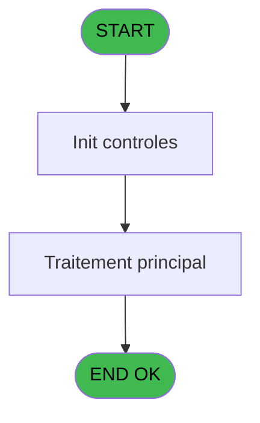
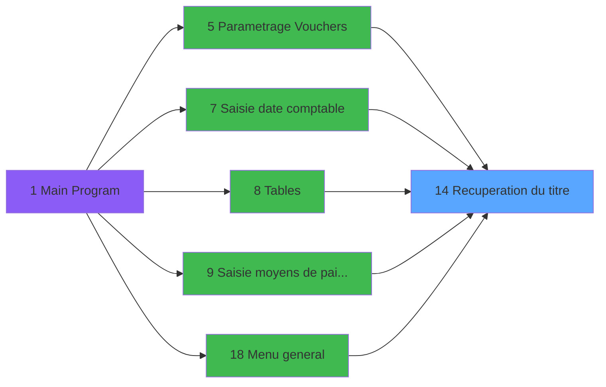

# EXM IDE 14 - Recuperation du titre

> **Analyse**: Phases 1-4 2026-02-03 11:14 -> 11:14 (14s) | Assemblage 11:14
> **Pipeline**: V7.2 Enrichi
> **Structure**: 4 onglets (Resume | Ecrans | Donnees | Connexions)

<!-- TAB:Resume -->

## 1. FICHE D'IDENTITE

| Attribut | Valeur |
|----------|--------|
| Projet | EXM |
| IDE Position | 14 |
| Nom Programme | Recuperation du titre |
| Fichier source | `Prg_14.xml` |
| Dossier IDE | Divers |
| Taches | 1 (0 ecrans visibles) |
| Tables modifiees | 0 |
| Programmes appeles | 0 |

## 2. DESCRIPTION FONCTIONNELLE

**Recuperation du titre** assure la gestion complete de ce processus, accessible depuis [ Tables (IDE 8)](EXM-IDE-8.md), [ Saisie moyens de paiement (IDE 9)](EXM-IDE-9.md), [Parametrage Vouchers (IDE 5)](EXM-IDE-5.md), [ Saisie date comptable (IDE 7)](EXM-IDE-7.md), [Menu general (IDE 18)](EXM-IDE-18.md), [Zoom classe paiement (IDE 23)](EXM-IDE-23.md).

Le flux de traitement s'organise en **1 blocs fonctionnels** :

- **Traitement** (1 tache) : traitements metier divers

## 3. BLOCS FONCTIONNELS

### 3.1 Traitement (1 tache)

Traitements internes.

---

#### 14 - Recuperation du titre

**Role** : Consultation/chargement : Recuperation du titre.

## 5. REGLES METIER

*(Aucune regle metier identifiee)*

## 6. CONTEXTE

- **Appele par**: [ Tables (IDE 8)](EXM-IDE-8.md), [ Saisie moyens de paiement (IDE 9)](EXM-IDE-9.md), [Parametrage Vouchers (IDE 5)](EXM-IDE-5.md), [ Saisie date comptable (IDE 7)](EXM-IDE-7.md), [Menu general (IDE 18)](EXM-IDE-18.md), [Zoom classe paiement (IDE 23)](EXM-IDE-23.md)
- **Appelle**: 0 programmes | **Tables**: 1 (W:0 R:1 L:0) | **Taches**: 1 | **Expressions**: 4

<!-- TAB:Ecrans -->

## 8. ECRANS

*(Programme sans ecran visible)*

## 9. NAVIGATION

### 9.3 Structure hierarchique (1 tache)

| Position | Tache | Type | Dimensions | Bloc |
|----------|-------|------|------------|------|
| **14.1** | [**Recuperation du titre** (14)](#t1) | MDI | - | Traitement |

### 9.4 Algorigramme

> **Legende**: Vert = START/END OK | Rouge = END KO | Bleu = Decisions
> *Algorigramme auto-genere. Utiliser `/algorigramme` pour une synthese metier detaillee.*

<!-- TAB:Donnees -->

## 10. TABLES

### Tables utilisees (1)

| ID | Nom | Description | Type | R | W | L | Usages |
|----|-----|-------------|------|---|---|---|--------|
| 721 | arc_bl_detail |  | DB | R |   |   | 1 |

### Colonnes par table (1 / 1 tables avec colonnes identifiees)

Table 721 - arc_bl_detail (R) - 1 usages

| Lettre | Variable | Acces | Type |
|--------|----------|-------|------|
| A | > code ecran | R | Numeric |
| B | < nom ecran | R | Alpha |
| C | code langue | R | Alpha |

## 11. VARIABLES

### 11.1 Autres (3)

Variables diverses.

| Lettre | Nom | Type | Usage dans |
|--------|-----|------|-----------|
| A | > code ecran | Numeric | 1x refs |
| B | < nom ecran | Alpha | - |
| C | code langue | Alpha | - |

## 12. EXPRESSIONS

**4 / 4 expressions decodees (100%)**

### 12.1 Repartition par type

| Type | Expressions | Regles |
|------|-------------|--------|
| CONCATENATION | 1 | 0 |
| CONSTANTE | 1 | 0 |
| CONDITION | 1 | 0 |
| OTHER | 1 | 0 |

### 12.2 Expressions cles par type

#### CONCATENATION (1 expressions)

| Type | IDE | Expression | Regle |
|------|-----|------------|-------|
| CONCATENATION | 3 | `Trim ([G])&' - '&Trim ([H])` | - |

#### CONSTANTE (1 expressions)

| Type | IDE | Expression | Regle |
|------|-----|------------|-------|
| CONSTANTE | 2 | `'EI'` | - |

#### CONDITION (1 expressions)

| Type | IDE | Expression | Regle |
|------|-----|------------|-------|
| CONDITION | 1 | `> code ecran [A]` | - |

#### OTHER (1 expressions)

| Type | IDE | Expression | Regle |
|------|-----|------------|-------|
| OTHER | 4 | `GetParam ('CODELANGUE')` | - |

<!-- TAB:Connexions -->

## 13. GRAPHE D'APPELS

### 13.1 Chaine depuis Main (Callers)

Main -> ... -> [ Tables (IDE 8)](EXM-IDE-8.md) -> **Recuperation du titre (IDE 14)**

Main -> ... -> [ Saisie moyens de paiement (IDE 9)](EXM-IDE-9.md) -> **Recuperation du titre (IDE 14)**

Main -> ... -> [Parametrage Vouchers (IDE 5)](EXM-IDE-5.md) -> **Recuperation du titre (IDE 14)**

Main -> ... -> [ Saisie date comptable (IDE 7)](EXM-IDE-7.md) -> **Recuperation du titre (IDE 14)**

Main -> ... -> [Menu general (IDE 18)](EXM-IDE-18.md) -> **Recuperation du titre (IDE 14)**

Main -> ... -> [Zoom classe paiement (IDE 23)](EXM-IDE-23.md) -> **Recuperation du titre (IDE 14)**

### 13.2 Callers

| IDE | Nom Programme | Nb Appels |
|-----|---------------|-----------|
| [8](EXM-IDE-8.md) |  Tables | 3 |
| [9](EXM-IDE-9.md) |  Saisie moyens de paiement | 3 |
| [5](EXM-IDE-5.md) | Parametrage Vouchers | 1 |
| [7](EXM-IDE-7.md) |  Saisie date comptable | 1 |
| [18](EXM-IDE-18.md) | Menu general | 1 |
| [23](EXM-IDE-23.md) | Zoom classe paiement | 1 |

### 13.3 Callees (programmes appeles)

### 13.4 Detail Callees avec contexte

| IDE | Nom Programme | Appels | Contexte |
|-----|---------------|--------|----------|
| - | (aucun) | - | - |

## 14. RECOMMANDATIONS MIGRATION

### 14.1 Profil du programme

| Metrique | Valeur | Impact migration |
|----------|--------|-----------------|
| Lignes de logique | 13 | Programme compact |
| Expressions | 4 | Peu de logique |
| Tables WRITE | 0 | Impact faible |
| Sous-programmes | 0 | Peu de dependances |
| Ecrans visibles | 0 | Ecran unique ou traitement batch |
| Code desactive | 0% (0 / 13) | Code sain |
| Regles metier | 0 | Pas de regle identifiee |

### 14.2 Plan de migration par bloc

#### Traitement (1 tache: 0 ecran, 1 traitement)

- **Strategie** : 1 service(s) backend injectable(s) (Domain Services).
- Decomposer les taches en services unitaires testables.

### 14.3 Dependances critiques

| Dependance | Type | Appels | Impact |
|------------|------|--------|--------|

---
*Spec DETAILED generee par Pipeline V7.2 - 2026-02-03 11:14*
