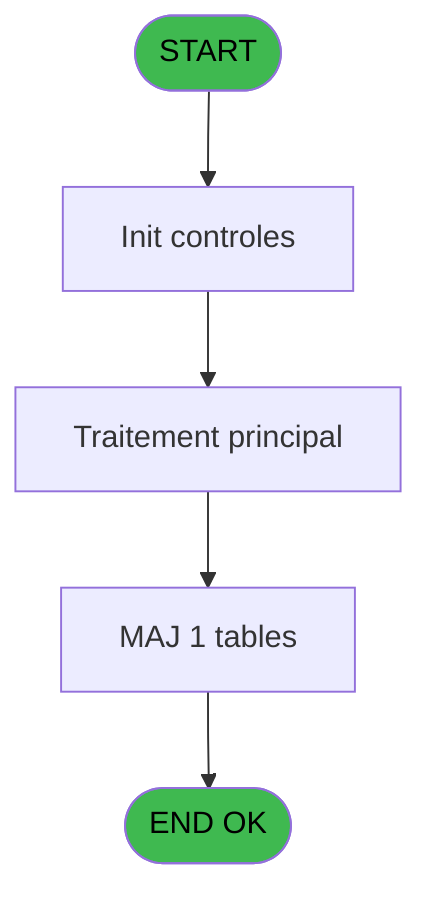
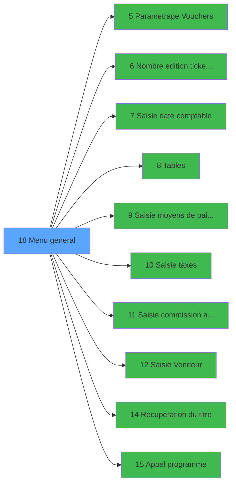

# EXM IDE 18 - Menu general

> **Analyse**: Phases 1-4 2026-02-03 11:15 -> 11:15 (14s) | Assemblage 11:15
> **Pipeline**: V7.2 Enrichi
> **Structure**: 4 onglets (Resume | Ecrans | Donnees | Connexions)

<!-- TAB:Resume -->

## 1. FICHE D'IDENTITE

| Attribut | Valeur |
|----------|--------|
| Projet | EXM |
| IDE Position | 18 |
| Nom Programme | Menu general |
| Fichier source | `Prg_18.xml` |
| Dossier IDE | Menu |
| Taches | 3 (1 ecrans visibles) |
| Tables modifiees | 1 |
| Programmes appeles | 10 |

## 2. DESCRIPTION FONCTIONNELLE

**Menu general** assure la gestion complete de ce processus, accessible depuis [Main Program (IDE 1)](EXM-IDE-1.md).

Le flux de traitement s'organise en **1 blocs fonctionnels** :

- **Traitement** (3 taches) : traitements metier divers

**Donnees modifiees** : 1 tables en ecriture (reseau_cloture___rcg).

## 3. BLOCS FONCTIONNELS

### 3.1 Traitement (3 taches)

Traitements internes.

---

#### 18 - Menu parametrage [[ECRAN]](#ecran-t1)

**Role** : Traitement : Menu parametrage.
**Ecran** : 642 x 225 DLU (MDI) | [Voir mockup](#ecran-t1)
**Delegue a** : [Parametrage Vouchers (IDE 5)](EXM-IDE-5.md), [ Tables (IDE 8)](EXM-IDE-8.md), [Recuperation du titre (IDE 14)](EXM-IDE-14.md)

---

#### 18.1 - Station eteinte erreur v1

**Role** : Traitement : Station eteinte erreur v1.
**Delegue a** : [Parametrage Vouchers (IDE 5)](EXM-IDE-5.md), [ Tables (IDE 8)](EXM-IDE-8.md), [Recuperation du titre (IDE 14)](EXM-IDE-14.md)

---

#### 18.2 - Station eteinte erreur v1

**Role** : Traitement : Station eteinte erreur v1.
**Delegue a** : [Parametrage Vouchers (IDE 5)](EXM-IDE-5.md), [ Tables (IDE 8)](EXM-IDE-8.md), [Recuperation du titre (IDE 14)](EXM-IDE-14.md)

## 5. REGLES METIER

*(Aucune regle metier identifiee)*

## 6. CONTEXTE

- **Appele par**: [Main Program (IDE 1)](EXM-IDE-1.md)
- **Appelle**: 10 programmes | **Tables**: 1 (W:1 R:0 L:0) | **Taches**: 3 | **Expressions**: 15

<!-- TAB:Ecrans -->

## 8. ECRANS

### 8.1 Forms visibles (1 / 3)

| # | Position | Tache | Nom | Type | Largeur | Hauteur | Bloc |
|---|----------|-------|-----|------|---------|---------|------|
| 1 | 18 | 18 | Menu parametrage | MDI | 642 | 225 | Traitement |

### 8.2 Mockups Ecrans

---

#### 18 - Menu parametrage
**Tache** : [18](#t1) | **Type** : MDI | **Dimensions** : 642 x 225 DLU
**Bloc** : Traitement | **Titre IDE** : Menu parametrage

<!-- FORM-DATA:
{
    "width":  642,
    "vFactor":  8,
    "type":  "MDI",
    "hFactor":  8,
    "controls":  [
                     {
                         "x":  0,
                         "type":  "label",
                         "var":  "",
                         "y":  0,
                         "w":  638,
                         "fmt":  "",
                         "name":  "",
                         "h":  19,
                         "color":  "5",
                         "text":  "",
                         "parent":  null
                     },
                     {
                         "x":  263,
                         "type":  "label",
                         "var":  "",
                         "y":  26,
                         "w":  338,
                         "fmt":  "",
                         "name":  "",
                         "h":  163,
                         "color":  "1",
                         "text":  "",
                         "parent":  null
                     },
                     {
                         "x":  278,
                         "type":  "label",
                         "var":  "",
                         "y":  33,
                         "w":  309,
                         "fmt":  "",
                         "name":  "",
                         "h":  131,
                         "color":  "5",
                         "text":  "",
                         "parent":  4
                     },
                     {
                         "x":  278,
                         "type":  "label",
                         "var":  "",
                         "y":  33,
                         "w":  308,
                         "fmt":  "",
                         "name":  "",
                         "h":  130,
                         "color":  "110",
                         "text":  "",
                         "parent":  4
                     },
                     {
                         "x":  280,
                         "type":  "label",
                         "var":  "",
                         "y":  34,
                         "w":  45,
                         "fmt":  "",
                         "name":  "",
                         "h":  127,
                         "color":  "5",
                         "text":  "",
                         "parent":  4
                     },
                     {
                         "x":  333,
                         "type":  "label",
                         "var":  "",
                         "y":  40,
                         "w":  163,
                         "fmt":  "",
                         "name":  "",
                         "h":  9,
                         "color":  "146",
                         "text":  "Date comptable",
                         "parent":  4
                     },
                     {
                         "x":  333,
                         "type":  "label",
                         "var":  "",
                         "y":  56,
                         "w":  237,
                         "fmt":  "",
                         "name":  "",
                         "h":  9,
                         "color":  "146",
                         "text":  "Fin de page du voucher",
                         "parent":  4
                     },
                     {
                         "x":  333,
                         "type":  "label",
                         "var":  "",
                         "y":  72,
                         "w":  224,
                         "fmt":  "",
                         "name":  "",
                         "h":  9,
                         "color":  "146",
                         "text":  "Gestion des Tables",
                         "parent":  4
                     },
                     {
                         "x":  333,
                         "type":  "label",
                         "var":  "",
                         "y":  89,
                         "w":  237,
                         "fmt":  "",
                         "name":  "",
                         "h":  9,
                         "color":  "146",
                         "text":  "Moyens de Paiement",
                         "parent":  4
                     },
                     {
                         "x":  333,
                         "type":  "label",
                         "var":  "",
                         "y":  104,
                         "w":  237,
                         "fmt":  "",
                         "name":  "",
                         "h":  9,
                         "color":  "146",
                         "text":  "Nbres Editions Tickets",
                         "parent":  4
                     },
                     {
                         "x":  336,
                         "type":  "label",
                         "var":  "",
                         "y":  119,
                         "w":  237,
                         "fmt":  "",
                         "name":  "",
                         "h":  9,
                         "color":  "146",
                         "text":  "Taxes",
                         "parent":  4
                     },
                     {
                         "x":  336,
                         "type":  "label",
                         "var":  "",
                         "y":  133,
                         "w":  237,
                         "fmt":  "",
                         "name":  "",
                         "h":  9,
                         "color":  "146",
                         "text":  "Frais Annulation",
                         "parent":  4
                     },
                     {
                         "x":  336,
                         "type":  "label",
                         "var":  "",
                         "y":  147,
                         "w":  237,
                         "fmt":  "",
                         "name":  "",
                         "h":  9,
                         "color":  "146",
                         "text":  "Vendeur",
                         "parent":  4
                     },
                     {
                         "x":  350,
                         "type":  "label",
                         "var":  "",
                         "y":  173,
                         "w":  123,
                         "fmt":  "",
                         "name":  "",
                         "h":  10,
                         "color":  "5",
                         "text":  "Votre choix",
                         "parent":  4
                     },
                     {
                         "x":  0,
                         "type":  "label",
                         "var":  "",
                         "y":  200,
                         "w":  638,
                         "fmt":  "",
                         "name":  "",
                         "h":  24,
                         "color":  "5",
                         "text":  "",
                         "parent":  null
                     },
                     {
                         "x":  480,
                         "type":  "edit",
                         "var":  "",
                         "y":  173,
                         "w":  26,
                         "fmt":  "",
                         "name":  "",
                         "h":  10,
                         "color":  "6",
                         "text":  "",
                         "parent":  4
                     },
                     {
                         "x":  8,
                         "type":  "edit",
                         "var":  "",
                         "y":  6,
                         "w":  267,
                         "fmt":  "20",
                         "name":  "",
                         "h":  8,
                         "color":  "",
                         "text":  "",
                         "parent":  null
                     },
                     {
                         "x":  427,
                         "type":  "edit",
                         "var":  "",
                         "y":  6,
                         "w":  203,
                         "fmt":  "WWW DD MMM YYYYT",
                         "name":  "",
                         "h":  8,
                         "color":  "",
                         "text":  "",
                         "parent":  null
                     },
                     {
                         "x":  43,
                         "type":  "image",
                         "var":  "",
                         "y":  48,
                         "w":  183,
                         "fmt":  "",
                         "name":  "",
                         "h":  75,
                         "color":  "5",
                         "text":  "",
                         "parent":  null
                     },
                     {
                         "x":  289,
                         "type":  "button",
                         "var":  "",
                         "y":  40,
                         "w":  27,
                         "fmt":  "A",
                         "name":  "A",
                         "h":  9,
                         "color":  "1",
                         "text":  "",
                         "parent":  4
                     },
                     {
                         "x":  289,
                         "type":  "button",
                         "var":  "",
                         "y":  56,
                         "w":  27,
                         "fmt":  "B",
                         "name":  "B",
                         "h":  9,
                         "color":  "1",
                         "text":  "",
                         "parent":  4
                     },
                     {
                         "x":  289,
                         "type":  "button",
                         "var":  "",
                         "y":  72,
                         "w":  27,
                         "fmt":  "C",
                         "name":  "C",
                         "h":  9,
                         "color":  "1",
                         "text":  "",
                         "parent":  4
                     },
                     {
                         "x":  289,
                         "type":  "button",
                         "var":  "",
                         "y":  89,
                         "w":  27,
                         "fmt":  "D",
                         "name":  "D",
                         "h":  9,
                         "color":  "1",
                         "text":  "",
                         "parent":  4
                     },
                     {
                         "x":  289,
                         "type":  "button",
                         "var":  "",
                         "y":  104,
                         "w":  27,
                         "fmt":  "E",
                         "name":  "E",
                         "h":  9,
                         "color":  "1",
                         "text":  "",
                         "parent":  4
                     },
                     {
                         "x":  289,
                         "type":  "button",
                         "var":  "",
                         "y":  119,
                         "w":  27,
                         "fmt":  "F",
                         "name":  "F",
                         "h":  9,
                         "color":  "1",
                         "text":  "",
                         "parent":  4
                     },
                     {
                         "x":  289,
                         "type":  "button",
                         "var":  "",
                         "y":  133,
                         "w":  27,
                         "fmt":  "G",
                         "name":  "G",
                         "h":  9,
                         "color":  "1",
                         "text":  "",
                         "parent":  4
                     },
                     {
                         "x":  289,
                         "type":  "button",
                         "var":  "",
                         "y":  147,
                         "w":  27,
                         "fmt":  "H",
                         "name":  "H",
                         "h":  9,
                         "color":  "1",
                         "text":  "",
                         "parent":  4
                     },
                     {
                         "x":  7,
                         "type":  "button",
                         "var":  "",
                         "y":  203,
                         "w":  154,
                         "fmt":  "\u0026Quitter",
                         "name":  "",
                         "h":  18,
                         "color":  "",
                         "text":  "",
                         "parent":  19
                     }
                 ],
    "taskId":  "18",
    "height":  225
}
-->

<strong>Champs : 3 champs</strong>

| Pos (x,y) | Nom | Variable | Type |
|-----------|-----|----------|------|
| 480,173 | (sans nom) | - | edit |
| 8,6 | 20 | - | edit |
| 427,6 | WWW DD MMM YYYYT | - | edit |

<strong>Boutons : 9 boutons</strong>

| Bouton | Pos (x,y) | Action |
|--------|-----------|--------|
| A | 289,40 | Bouton fonctionnel |
| B | 289,56 | Bouton fonctionnel |
| C | 289,72 | Bouton fonctionnel |
| D | 289,89 | Bouton fonctionnel |
| E | 289,104 | Bouton fonctionnel |
| F | 289,119 | Bouton fonctionnel |
| G | 289,133 | Bouton fonctionnel |
| H | 289,147 | Bouton fonctionnel |
| Quitter | 7,203 | Quitte le programme |

## 9. NAVIGATION

Ecran unique: **Menu parametrage**

### 9.3 Structure hierarchique (3 taches)

| Position | Tache | Type | Dimensions | Bloc |
|----------|-------|------|------------|------|
| **18.1** | [**Menu parametrage** (18)](#t1) [mockup](#ecran-t1) | MDI | 642x225 | Traitement |
| 18.1.1 | [Station eteinte erreur v1 (18.1)](#t2) | MDI | - | |
| 18.1.2 | [Station eteinte erreur v1 (18.2)](#t5) | MDI | - | |

### 9.4 Algorigramme

> **Legende**: Vert = START/END OK | Rouge = END KO | Bleu = Decisions
> *Algorigramme auto-genere. Utiliser `/algorigramme` pour une synthese metier detaillee.*

<!-- TAB:Donnees -->

## 10. TABLES

### Tables utilisees (1)

| ID | Nom | Description | Type | R | W | L | Usages |
|----|-----|-------------|------|---|---|---|--------|
| 303 | reseau_cloture___rcg | Donnees reseau/cloture | DB |   | **W** |   | 2 |

### Colonnes par table (0 / 1 tables avec colonnes identifiees)

Table 303 - reseau_cloture___rcg (**W**) - 2 usages

*Table utilisee uniquement en Link ou aucune colonne Real identifiee dans le DataView.*

## 11. VARIABLES

### 11.1 Variables de session (1)

Variables persistantes pendant toute la session.

| Lettre | Nom | Type | Usage dans |
|--------|-----|------|-----------|
| B | v. titre | Alpha | 1x session |

### 11.2 Variables de travail (1)

Variables internes au programme.

| Lettre | Nom | Type | Usage dans |
|--------|-----|------|-----------|
| A | W0 choix action | Alpha | 8x calcul interne |

## 12. EXPRESSIONS

**15 / 15 expressions decodees (100%)**

### 12.1 Repartition par type

| Type | Expressions | Regles |
|------|-------------|--------|
| CONSTANTE | 2 | 0 |
| DATE | 1 | 0 |
| CONDITION | 8 | 0 |
| REFERENCE_VG | 2 | 0 |
| NEGATION | 1 | 0 |
| STRING | 1 | 0 |

### 12.2 Expressions cles par type

#### CONSTANTE (2 expressions)

| Type | IDE | Expression | Regle |
|------|-----|------------|-------|
| CONSTANTE | 12 | `2` | - |
| CONSTANTE | 1 | `''` | - |

#### DATE (1 expressions)

| Type | IDE | Expression | Regle |
|------|-----|------------|-------|
| DATE | 11 | `Date ()` | - |

#### CONDITION (8 expressions)

| Type | IDE | Expression | Regle |
|------|-----|------------|-------|
| CONDITION | 7 | `W0 choix action [A]='F'` | - |
| CONDITION | 6 | `W0 choix action [A]='E'` | - |
| CONDITION | 9 | `W0 choix action [A]='H'` | - |
| CONDITION | 8 | `W0 choix action [A]='G'` | - |
| CONDITION | 3 | `W0 choix action [A]='C'` | - |
| ... | | *+3 autres* | |

#### REFERENCE_VG (2 expressions)

| Type | IDE | Expression | Regle |
|------|-----|------------|-------|
| REFERENCE_VG | 15 | `VG5` | - |
| REFERENCE_VG | 10 | `VG2` | - |

#### NEGATION (1 expressions)

| Type | IDE | Expression | Regle |
|------|-----|------------|-------|
| NEGATION | 14 | `NOT VG5` | - |

#### STRING (1 expressions)

| Type | IDE | Expression | Regle |
|------|-----|------------|-------|
| STRING | 13 | `Trim (v. titre [B])` | - |

<!-- TAB:Connexions -->

## 13. GRAPHE D'APPELS

### 13.1 Chaine depuis Main (Callers)

Main -> ... -> [Main Program (IDE 1)](EXM-IDE-1.md) -> **Menu general (IDE 18)**

### 13.2 Callers

| IDE | Nom Programme | Nb Appels |
|-----|---------------|-----------|
| [1](EXM-IDE-1.md) | Main Program | 1 |

### 13.3 Callees (programmes appeles)

### 13.4 Detail Callees avec contexte

| IDE | Nom Programme | Appels | Contexte |
|-----|---------------|--------|----------|
| [5](EXM-IDE-5.md) | Parametrage Vouchers | 1 | Sous-programme |
| [6](EXM-IDE-6.md) | Nombre edition ticket front of | 1 | Impression ticket/document |
| [7](EXM-IDE-7.md) |  Saisie date comptable | 1 | Sous-programme |
| [8](EXM-IDE-8.md) |  Tables | 1 | Sous-programme |
| [9](EXM-IDE-9.md) |  Saisie moyens de paiement | 1 | Sous-programme |
| [10](EXM-IDE-10.md) | Saisie taxes | 1 | Sous-programme |
| [11](EXM-IDE-11.md) | Saisie commission annulation | 1 | Sous-programme |
| [12](EXM-IDE-12.md) | Saisie Vendeur | 1 | Sous-programme |
| [14](EXM-IDE-14.md) | Recuperation du titre | 1 | Recuperation donnees |
| [15](EXM-IDE-15.md) | Appel programme | 1 | Sous-programme |

## 14. RECOMMANDATIONS MIGRATION

### 14.1 Profil du programme

| Metrique | Valeur | Impact migration |
|----------|--------|-----------------|
| Lignes de logique | 23 | Programme compact |
| Expressions | 15 | Peu de logique |
| Tables WRITE | 1 | Impact faible |
| Sous-programmes | 10 | Dependances moderees |
| Ecrans visibles | 1 | Ecran unique ou traitement batch |
| Code desactive | 0% (0 / 23) | Code sain |
| Regles metier | 0 | Pas de regle identifiee |

### 14.2 Plan de migration par bloc

#### Traitement (3 taches: 1 ecran, 2 traitements)

- **Strategie** : Orchestrateur avec 1 ecrans (Razor/React) et 2 traitements backend (services).
- Les ecrans deviennent des composants UI, les traitements invisibles deviennent des services injectables.
- 10 sous-programme(s) a migrer ou a reutiliser depuis les services existants.
- Decomposer les taches en services unitaires testables.

### 14.3 Dependances critiques

| Dependance | Type | Appels | Impact |
|------------|------|--------|--------|
| reseau_cloture___rcg | Table WRITE (Database) | 2x | Schema + repository |
| [Saisie commission annulation (IDE 11)](EXM-IDE-11.md) | Sous-programme | 1x | Normale - Sous-programme |
| [Saisie taxes (IDE 10)](EXM-IDE-10.md) | Sous-programme | 1x | Normale - Sous-programme |
| [Saisie Vendeur (IDE 12)](EXM-IDE-12.md) | Sous-programme | 1x | Normale - Sous-programme |
| [Appel programme (IDE 15)](EXM-IDE-15.md) | Sous-programme | 1x | Normale - Sous-programme |
| [Recuperation du titre (IDE 14)](EXM-IDE-14.md) | Sous-programme | 1x | Normale - Recuperation donnees |
| [Nombre edition ticket front of (IDE 6)](EXM-IDE-6.md) | Sous-programme | 1x | Normale - Impression ticket/document |
| [Parametrage Vouchers (IDE 5)](EXM-IDE-5.md) | Sous-programme | 1x | Normale - Sous-programme |
| [ Saisie date comptable (IDE 7)](EXM-IDE-7.md) | Sous-programme | 1x | Normale - Sous-programme |
| [ Saisie moyens de paiement (IDE 9)](EXM-IDE-9.md) | Sous-programme | 1x | Normale - Sous-programme |
| [ Tables (IDE 8)](EXM-IDE-8.md) | Sous-programme | 1x | Normale - Sous-programme |

---
*Spec DETAILED generee par Pipeline V7.2 - 2026-02-03 11:15*
