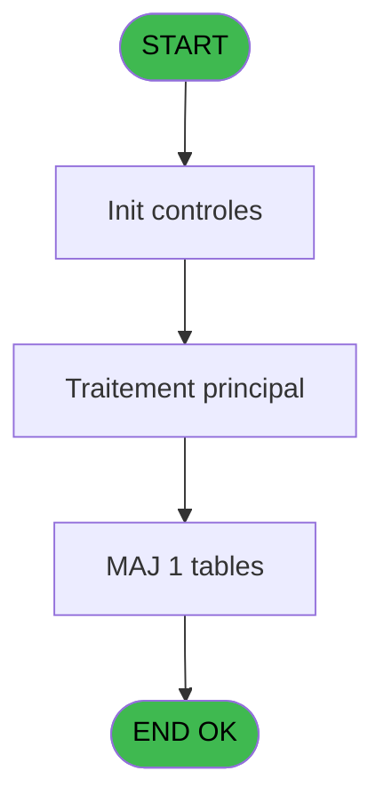

# EXM IDE 5 - Parametrage Vouchers

> **Analyse**: Phases 1-4 2026-02-03 11:10 -> 11:11 (15s) | Assemblage 11:11
> **Pipeline**: V7.2 Enrichi
> **Structure**: 4 onglets (Resume | Ecrans | Donnees | Connexions)

<!-- TAB:Resume -->

## 1. FICHE D'IDENTITE

| Attribut | Valeur |
|----------|--------|
| Projet | EXM |
| IDE Position | 5 |
| Nom Programme | Parametrage Vouchers |
| Fichier source | `Prg_5.xml` |
| Dossier IDE | Autres |
| Taches | 1 (1 ecrans visibles) |
| Tables modifiees | 1 |
| Programmes appeles | 1 |

## 2. DESCRIPTION FONCTIONNELLE

**Parametrage Vouchers** assure la gestion complete de ce processus, accessible depuis [Menu general (IDE 18)](EXM-IDE-18.md).

Le flux de traitement s'organise en **1 blocs fonctionnels** :

- **Traitement** (1 tache) : traitements metier divers

**Donnees modifiees** : 1 tables en ecriture (parametre_voutchers).

## 3. BLOCS FONCTIONNELS

### 3.1 Traitement (1 tache)

Traitements internes.

---

#### 5 - Parametrage Vouchers [[ECRAN]](#ecran-t1)

**Role** : Traitement : Parametrage Vouchers.
**Ecran** : 840 x 198 DLU (MDI) | [Voir mockup](#ecran-t1)
**Delegue a** : [Recuperation du titre (IDE 14)](EXM-IDE-14.md)

## 5. REGLES METIER

*(Aucune regle metier identifiee)*

## 6. CONTEXTE

- **Appele par**: [Menu general (IDE 18)](EXM-IDE-18.md)
- **Appelle**: 1 programmes | **Tables**: 1 (W:1 R:0 L:0) | **Taches**: 1 | **Expressions**: 8

<!-- TAB:Ecrans -->

## 8. ECRANS

### 8.1 Forms visibles (1 / 1)

| # | Position | Tache | Nom | Type | Largeur | Hauteur | Bloc |
|---|----------|-------|-----|------|---------|---------|------|
| 1 | 5 | 5 | Parametrage Vouchers | MDI | 840 | 198 | Traitement |

### 8.2 Mockups Ecrans

---

#### 5 - Parametrage Vouchers
**Tache** : [5](#t1) | **Type** : MDI | **Dimensions** : 840 x 198 DLU
**Bloc** : Traitement | **Titre IDE** : Parametrage Vouchers

<!-- FORM-DATA:
{
    "width":  840,
    "vFactor":  8,
    "type":  "MDI",
    "hFactor":  8,
    "controls":  [
                     {
                         "x":  0,
                         "type":  "label",
                         "var":  "",
                         "y":  0,
                         "w":  834,
                         "fmt":  "",
                         "name":  "",
                         "h":  19,
                         "color":  "",
                         "text":  "",
                         "parent":  null
                     },
                     {
                         "x":  160,
                         "type":  "label",
                         "var":  "",
                         "y":  27,
                         "w":  655,
                         "fmt":  "",
                         "name":  "",
                         "h":  42,
                         "color":  "7",
                         "text":  "Français",
                         "parent":  null
                     },
                     {
                         "x":  160,
                         "type":  "label",
                         "var":  "",
                         "y":  70,
                         "w":  655,
                         "fmt":  "",
                         "name":  "",
                         "h":  42,
                         "color":  "7",
                         "text":  "Anglais",
                         "parent":  null
                     },
                     {
                         "x":  160,
                         "type":  "label",
                         "var":  "",
                         "y":  114,
                         "w":  655,
                         "fmt":  "",
                         "name":  "",
                         "h":  42,
                         "color":  "7",
                         "text":  "Espagnol",
                         "parent":  null
                     },
                     {
                         "x":  0,
                         "type":  "label",
                         "var":  "",
                         "y":  170,
                         "w":  834,
                         "fmt":  "",
                         "name":  "",
                         "h":  24,
                         "color":  "",
                         "text":  "",
                         "parent":  null
                     },
                     {
                         "x":  172,
                         "type":  "edit",
                         "var":  "",
                         "y":  38,
                         "w":  630,
                         "fmt":  "30",
                         "name":  "PVT ligne 1",
                         "h":  10,
                         "color":  "6",
                         "text":  "",
                         "parent":  4
                     },
                     {
                         "x":  172,
                         "type":  "edit",
                         "var":  "",
                         "y":  50,
                         "w":  630,
                         "fmt":  "30",
                         "name":  "PVT ligne 2",
                         "h":  10,
                         "color":  "6",
                         "text":  "",
                         "parent":  4
                     },
                     {
                         "x":  172,
                         "type":  "edit",
                         "var":  "",
                         "y":  82,
                         "w":  630,
                         "fmt":  "30",
                         "name":  "PVT ligne 1_001",
                         "h":  10,
                         "color":  "6",
                         "text":  "",
                         "parent":  8
                     },
                     {
                         "x":  172,
                         "type":  "edit",
                         "var":  "",
                         "y":  94,
                         "w":  630,
                         "fmt":  "30",
                         "name":  "PVT ligne 2_001",
                         "h":  10,
                         "color":  "6",
                         "text":  "",
                         "parent":  8
                     },
                     {
                         "x":  172,
                         "type":  "edit",
                         "var":  "",
                         "y":  126,
                         "w":  630,
                         "fmt":  "30",
                         "name":  "PVT ligne 1_002",
                         "h":  10,
                         "color":  "6",
                         "text":  "",
                         "parent":  11
                     },
                     {
                         "x":  172,
                         "type":  "edit",
                         "var":  "",
                         "y":  138,
                         "w":  630,
                         "fmt":  "30",
                         "name":  "PVT ligne 2_002",
                         "h":  10,
                         "color":  "6",
                         "text":  "",
                         "parent":  11
                     },
                     {
                         "x":  5,
                         "type":  "button",
                         "var":  "",
                         "y":  173,
                         "w":  154,
                         "fmt":  "\u0026Ok",
                         "name":  "btn ok",
                         "h":  18,
                         "color":  "",
                         "text":  "",
                         "parent":  14
                     },
                     {
                         "x":  8,
                         "type":  "edit",
                         "var":  "",
                         "y":  5,
                         "w":  267,
                         "fmt":  "20",
                         "name":  "",
                         "h":  8,
                         "color":  "",
                         "text":  "",
                         "parent":  1
                     },
                     {
                         "x":  624,
                         "type":  "edit",
                         "var":  "",
                         "y":  5,
                         "w":  203,
                         "fmt":  "WWW DD MMM YYYYT",
                         "name":  "",
                         "h":  8,
                         "color":  "",
                         "text":  "",
                         "parent":  1
                     },
                     {
                         "x":  6,
                         "type":  "image",
                         "var":  "",
                         "y":  66,
                         "w":  144,
                         "fmt":  "",
                         "name":  "",
                         "h":  62,
                         "color":  "",
                         "text":  "",
                         "parent":  null
                     },
                     {
                         "x":  164,
                         "type":  "button",
                         "var":  "",
                         "y":  173,
                         "w":  154,
                         "fmt":  "A\u0026bandonner",
                         "name":  "",
                         "h":  18,
                         "color":  "",
                         "text":  "",
                         "parent":  null
                     }
                 ],
    "taskId":  "5",
    "height":  198
}
-->

<strong>Champs : 8 champs</strong>

| Pos (x,y) | Nom | Variable | Type |
|-----------|-----|----------|------|
| 172,38 | PVT ligne 1 | - | edit |
| 172,50 | PVT ligne 2 | - | edit |
| 172,82 | PVT ligne 1_001 | - | edit |
| 172,94 | PVT ligne 2_001 | - | edit |
| 172,126 | PVT ligne 1_002 | - | edit |
| 172,138 | PVT ligne 2_002 | - | edit |
| 8,5 | 20 | - | edit |
| 624,5 | WWW DD MMM YYYYT | - | edit |

<strong>Boutons : 2 boutons</strong>

| Bouton | Pos (x,y) | Action |
|--------|-----------|--------|
| Ok | 5,173 | Valide la saisie et enregistre |
| Abandonner | 164,173 | Annule et retour au menu |

## 9. NAVIGATION

Ecran unique: ** Parametrage Vouchers**

### 9.3 Structure hierarchique (1 tache)

| Position | Tache | Type | Dimensions | Bloc |
|----------|-------|------|------------|------|
| **5.1** | [**Parametrage Vouchers** (5)](#t1) [mockup](#ecran-t1) | MDI | 840x198 | Traitement |

### 9.4 Algorigramme

> **Legende**: Vert = START/END OK | Rouge = END KO | Bleu = Decisions
> *Algorigramme auto-genere. Utiliser `/algorigramme` pour une synthese metier detaillee.*

<!-- TAB:Donnees -->

## 10. TABLES

### Tables utilisees (1)

| ID | Nom | Description | Type | R | W | L | Usages |
|----|-----|-------------|------|---|---|---|--------|
| 302 | parametre_voutchers |  | DB |   | **W** |   | 1 |

### Colonnes par table (1 / 1 tables avec colonnes identifiees)

Table 302 - parametre_voutchers (**W**) - 1 usages

| Lettre | Variable | Acces | Type |
|--------|----------|-------|------|
| A | W confirmation | W | Numeric |
| B | btn ok | W | Alpha |
| C | v. titre | W | Alpha |

## 11. VARIABLES

### 11.1 Variables de session (1)

Variables persistantes pendant toute la session.

| Lettre | Nom | Type | Usage dans |
|--------|-----|------|-----------|
| C | v. titre | Alpha | - |

### 11.2 Autres (2)

Variables diverses.

| Lettre | Nom | Type | Usage dans |
|--------|-----|------|-----------|
| A | W confirmation | Numeric | - |
| B | btn ok | Alpha | - |

## 12. EXPRESSIONS

**8 / 8 expressions decodees (100%)**

### 12.1 Repartition par type

| Type | Expressions | Regles |
|------|-------------|--------|
| CONSTANTE | 4 | 0 |
| DATE | 1 | 0 |
| REFERENCE_VG | 1 | 0 |
| CONDITION | 1 | 0 |
| STRING | 1 | 0 |

### 12.2 Expressions cles par type

#### CONSTANTE (4 expressions)

| Type | IDE | Expression | Regle |
|------|-----|------------|-------|
| CONSTANTE | 3 | `'1'` | - |
| CONSTANTE | 6 | `6` | - |
| CONSTANTE | 1 | `'3'` | - |
| CONSTANTE | 2 | `'4'` | - |

#### DATE (1 expressions)

| Type | IDE | Expression | Regle |
|------|-----|------------|-------|
| DATE | 5 | `Date ()` | - |

#### REFERENCE_VG (1 expressions)

| Type | IDE | Expression | Regle |
|------|-----|------------|-------|
| REFERENCE_VG | 4 | `VG2` | - |

#### CONDITION (1 expressions)

| Type | IDE | Expression | Regle |
|------|-----|------------|-------|
| CONDITION | 8 | `[J]=6` | - |

#### STRING (1 expressions)

| Type | IDE | Expression | Regle |
|------|-----|------------|-------|
| STRING | 7 | `Trim ([L])` | - |

<!-- TAB:Connexions -->

## 13. GRAPHE D'APPELS

### 13.1 Chaine depuis Main (Callers)

Main -> ... -> [Menu general (IDE 18)](EXM-IDE-18.md) -> **Parametrage Vouchers (IDE 5)**

### 13.2 Callers

| IDE | Nom Programme | Nb Appels |
|-----|---------------|-----------|
| [18](EXM-IDE-18.md) | Menu general | 1 |

### 13.3 Callees (programmes appeles)

### 13.4 Detail Callees avec contexte

| IDE | Nom Programme | Appels | Contexte |
|-----|---------------|--------|----------|
| [14](EXM-IDE-14.md) | Recuperation du titre | 1 | Recuperation donnees |

## 14. RECOMMANDATIONS MIGRATION

### 14.1 Profil du programme

| Metrique | Valeur | Impact migration |
|----------|--------|-----------------|
| Lignes de logique | 32 | Programme compact |
| Expressions | 8 | Peu de logique |
| Tables WRITE | 1 | Impact faible |
| Sous-programmes | 1 | Peu de dependances |
| Ecrans visibles | 1 | Ecran unique ou traitement batch |
| Code desactive | 0% (0 / 32) | Code sain |
| Regles metier | 0 | Pas de regle identifiee |

### 14.2 Plan de migration par bloc

#### Traitement (1 tache: 1 ecran, 0 traitement)

- **Strategie** : 1 composant(s) UI (Razor/React) avec formulaires et validation.
- 1 sous-programme(s) a migrer ou a reutiliser depuis les services existants.
- Decomposer les taches en services unitaires testables.

### 14.3 Dependances critiques

| Dependance | Type | Appels | Impact |
|------------|------|--------|--------|
| parametre_voutchers | Table WRITE (Database) | 1x | Schema + repository |
| [Recuperation du titre (IDE 14)](EXM-IDE-14.md) | Sous-programme | 1x | Normale - Recuperation donnees |

---
*Spec DETAILED generee par Pipeline V7.2 - 2026-02-03 11:11*
