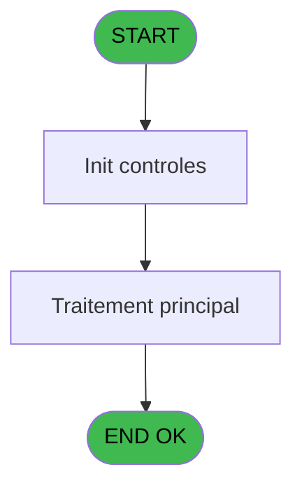

# EXM IDE 6 - Nombre edition ticket front of

> **Analyse**: Phases 1-4 2026-02-03 11:11 -> 11:11 (18s) | Assemblage 11:11
> **Pipeline**: V7.2 Enrichi
> **Structure**: 4 onglets (Resume | Ecrans | Donnees | Connexions)

<!-- TAB:Resume -->

## 1. FICHE D'IDENTITE

| Attribut | Valeur |
|----------|--------|
| Projet | EXM |
| IDE Position | 6 |
| Nom Programme | Nombre edition ticket front of |
| Fichier source | `Prg_6.xml` |
| Dossier IDE | Autres |
| Taches | 1 (1 ecrans visibles) |
| Tables modifiees | 0 |
| Programmes appeles | 0 |

## 2. DESCRIPTION FONCTIONNELLE

**Nombre edition ticket front of** assure la gestion complete de ce processus, accessible depuis [Menu general (IDE 18)](EXM-IDE-18.md).

Le flux de traitement s'organise en **1 blocs fonctionnels** :

- **Impression** (1 tache) : generation de tickets et documents

**Logique metier** : 1 regles identifiees couvrant conditions metier.

## 3. BLOCS FONCTIONNELS

### 3.1 Impression (1 tache)

Generation des documents et tickets.

---

#### 6 - Edition tickets [[ECRAN]](#ecran-t1)

**Role** : Generation du document : Edition tickets.
**Ecran** : 666 x 114 DLU (MDI) | [Voir mockup](#ecran-t1)
**Variables liees** : A (W0 nombre edition)

## 5. REGLES METIER

1 regles identifiees:

### Impression (1 regles)

#### [RM-001] Traitement si Val (INIGet ('[MAGIC_LOGICAL_NAMES]excursion_nb_edition'),'###') est non nul

| Element | Detail |
|---------|--------|
| **Condition** | `Val (INIGet ('[MAGIC_LOGICAL_NAMES]excursion_nb_edition')` |
| **Si vrai** | '###')<>0 |
| **Si faux** | Val (INIGet ('[MAGIC_LOGICAL_NAMES]excursion_nb_edition'),'###'),1) |
| **Expression source** | Expression 1 : `IF (Val (INIGet ('[MAGIC_LOGICAL_NAMES]excursion_nb_edition'` |
| **Exemple** | Si Val (INIGet ('[MAGIC_LOGICAL_NAMES]excursion_nb_edition') → '###')<>0 |
| **Impact** | [6 - Edition tickets](#t1) |

## 6. CONTEXTE

- **Appele par**: [Menu general (IDE 18)](EXM-IDE-18.md)
- **Appelle**: 0 programmes | **Tables**: 0 (W:0 R:0 L:0) | **Taches**: 1 | **Expressions**: 6

<!-- TAB:Ecrans -->

## 8. ECRANS

### 8.1 Forms visibles (1 / 1)

| # | Position | Tache | Nom | Type | Largeur | Hauteur | Bloc |
|---|----------|-------|-----|------|---------|---------|------|
| 1 | 6 | 6 | Edition tickets | MDI | 666 | 114 | Impression |

### 8.2 Mockups Ecrans

---

#### 6 - Edition tickets
**Tache** : [6](#t1) | **Type** : MDI | **Dimensions** : 666 x 114 DLU
**Bloc** : Impression | **Titre IDE** : Edition tickets

<!-- FORM-DATA:
{
    "width":  666,
    "vFactor":  8,
    "type":  "MDI",
    "hFactor":  8,
    "controls":  [
                     {
                         "x":  0,
                         "type":  "label",
                         "var":  "",
                         "y":  0,
                         "w":  663,
                         "fmt":  "",
                         "name":  "",
                         "h":  19,
                         "color":  "",
                         "text":  "",
                         "parent":  null
                     },
                     {
                         "x":  192,
                         "type":  "label",
                         "var":  "",
                         "y":  33,
                         "w":  453,
                         "fmt":  "",
                         "name":  "",
                         "h":  37,
                         "color":  "",
                         "text":  "",
                         "parent":  null
                     },
                     {
                         "x":  213,
                         "type":  "label",
                         "var":  "",
                         "y":  47,
                         "w":  348,
                         "fmt":  "",
                         "name":  "",
                         "h":  8,
                         "color":  "",
                         "text":  "Nombre d\u0027edition ticket pour les ventes",
                         "parent":  5
                     },
                     {
                         "x":  0,
                         "type":  "label",
                         "var":  "",
                         "y":  88,
                         "w":  661,
                         "fmt":  "",
                         "name":  "",
                         "h":  24,
                         "color":  "",
                         "text":  "",
                         "parent":  null
                     },
                     {
                         "x":  577,
                         "type":  "edit",
                         "var":  "",
                         "y":  45,
                         "w":  37,
                         "fmt":  "",
                         "name":  "W0 nombre edition",
                         "h":  10,
                         "color":  "6",
                         "text":  "",
                         "parent":  5
                     },
                     {
                         "x":  5,
                         "type":  "button",
                         "var":  "",
                         "y":  91,
                         "w":  154,
                         "fmt":  "\u0026Ok",
                         "name":  "btn ok",
                         "h":  18,
                         "color":  "",
                         "text":  "",
                         "parent":  8
                     },
                     {
                         "x":  8,
                         "type":  "edit",
                         "var":  "",
                         "y":  5,
                         "w":  267,
                         "fmt":  "20",
                         "name":  "",
                         "h":  8,
                         "color":  "",
                         "text":  "",
                         "parent":  1
                     },
                     {
                         "x":  451,
                         "type":  "edit",
                         "var":  "",
                         "y":  5,
                         "w":  203,
                         "fmt":  "WWW DD MMM YYYYT",
                         "name":  "",
                         "h":  8,
                         "color":  "",
                         "text":  "",
                         "parent":  1
                     },
                     {
                         "x":  8,
                         "type":  "image",
                         "var":  "",
                         "y":  24,
                         "w":  144,
                         "fmt":  "",
                         "name":  "",
                         "h":  62,
                         "color":  "",
                         "text":  "",
                         "parent":  null
                     },
                     {
                         "x":  164,
                         "type":  "button",
                         "var":  "",
                         "y":  91,
                         "w":  154,
                         "fmt":  "A\u0026bandonner",
                         "name":  "",
                         "h":  18,
                         "color":  "",
                         "text":  "",
                         "parent":  null
                     }
                 ],
    "taskId":  "6",
    "height":  114
}
-->

<strong>Champs : 3 champs</strong>

| Pos (x,y) | Nom | Variable | Type |
|-----------|-----|----------|------|
| 577,45 | W0 nombre edition | - | edit |
| 8,5 | 20 | - | edit |
| 451,5 | WWW DD MMM YYYYT | - | edit |

<strong>Boutons : 2 boutons</strong>

| Bouton | Pos (x,y) | Action |
|--------|-----------|--------|
| Ok | 5,91 | Valide la saisie et enregistre |
| Abandonner | 164,91 | Annule et retour au menu |

## 9. NAVIGATION

Ecran unique: **Edition tickets**

### 9.3 Structure hierarchique (1 tache)

| Position | Tache | Type | Dimensions | Bloc |
|----------|-------|------|------------|------|
| **6.1** | [**Edition tickets** (6)](#t1) [mockup](#ecran-t1) | MDI | 666x114 | Impression |

### 9.4 Algorigramme

> **Legende**: Vert = START/END OK | Rouge = END KO | Bleu = Decisions
> *Algorigramme auto-genere. Utiliser `/algorigramme` pour une synthese metier detaillee.*

<!-- TAB:Donnees -->

## 10. TABLES

### Tables utilisees (0)

| ID | Nom | Description | Type | R | W | L | Usages |
|----|-----|-------------|------|---|---|---|--------|

### Colonnes par table (0 / 0 tables avec colonnes identifiees)

## 11. VARIABLES

### 11.1 Variables de session (1)

Variables persistantes pendant toute la session.

| Lettre | Nom | Type | Usage dans |
|--------|-----|------|-----------|
| D | v. titre | Alpha | 1x session |

### 11.2 Variables de travail (1)

Variables internes au programme.

| Lettre | Nom | Type | Usage dans |
|--------|-----|------|-----------|
| A | W0 nombre edition | Numeric | [6](#t1) |

### 11.3 Autres (2)

Variables diverses.

| Lettre | Nom | Type | Usage dans |
|--------|-----|------|-----------|
| B | W confirmation | Numeric | 1x refs |
| C | btn ok | Alpha | - |

## 12. EXPRESSIONS

**6 / 6 expressions decodees (100%)**

### 12.1 Repartition par type

| Type | Expressions | Regles |
|------|-------------|--------|
| CONDITION | 2 | 5 |
| DATE | 1 | 0 |
| REFERENCE_VG | 1 | 0 |
| CAST_LOGIQUE | 1 | 0 |
| STRING | 1 | 0 |

### 12.2 Expressions cles par type

#### CONDITION (2 expressions)

| Type | IDE | Expression | Regle |
|------|-----|------------|-------|
| CONDITION | 1 | `IF (Val (INIGet ('[MAGIC_LOGICAL_NAMES]excursion_nb_edition'),'###')<>0,Val (INIGet ('[MAGIC_LOGICAL_NAMES]excursion_nb_edition'),'###'),1)` | [RM-001](#rm-RM-001) |
| CONDITION | 6 | `W confirmation [B]=6` | - |

#### DATE (1 expressions)

| Type | IDE | Expression | Regle |
|------|-----|------------|-------|
| DATE | 4 | `Date ()` | - |

#### REFERENCE_VG (1 expressions)

| Type | IDE | Expression | Regle |
|------|-----|------------|-------|
| REFERENCE_VG | 3 | `VG2` | - |

#### CAST_LOGIQUE (1 expressions)

| Type | IDE | Expression | Regle |
|------|-----|------------|-------|
| CAST_LOGIQUE | 2 | `INIPut ('[MAGIC_LOGICAL_NAMES]excursion_nb_edition='&Str (W0 nombre edition [A],'###'),'FALSE'LOG)` | - |

#### STRING (1 expressions)

| Type | IDE | Expression | Regle |
|------|-----|------------|-------|
| STRING | 5 | `Trim (v. titre [D])` | - |

<!-- TAB:Connexions -->

## 13. GRAPHE D'APPELS

### 13.1 Chaine depuis Main (Callers)

Main -> ... -> [Menu general (IDE 18)](EXM-IDE-18.md) -> **Nombre edition ticket front of (IDE 6)**

### 13.2 Callers

| IDE | Nom Programme | Nb Appels |
|-----|---------------|-----------|
| [18](EXM-IDE-18.md) | Menu general | 1 |

### 13.3 Callees (programmes appeles)

### 13.4 Detail Callees avec contexte

| IDE | Nom Programme | Appels | Contexte |
|-----|---------------|--------|----------|
| - | (aucun) | - | - |

## 14. RECOMMANDATIONS MIGRATION

### 14.1 Profil du programme

| Metrique | Valeur | Impact migration |
|----------|--------|-----------------|
| Lignes de logique | 11 | Programme compact |
| Expressions | 6 | Peu de logique |
| Tables WRITE | 0 | Impact faible |
| Sous-programmes | 0 | Peu de dependances |
| Ecrans visibles | 1 | Ecran unique ou traitement batch |
| Code desactive | 0% (0 / 11) | Code sain |
| Regles metier | 1 | Quelques regles a preserver |

### 14.2 Plan de migration par bloc

#### Impression (1 tache: 1 ecran, 0 traitement)

- **Strategie** : Templates HTML -> PDF via wkhtmltopdf ou Puppeteer.
- `PrintService` injectable avec choix imprimante

### 14.3 Dependances critiques

| Dependance | Type | Appels | Impact |
|------------|------|--------|--------|

---
*Spec DETAILED generee par Pipeline V7.2 - 2026-02-03 11:11*
