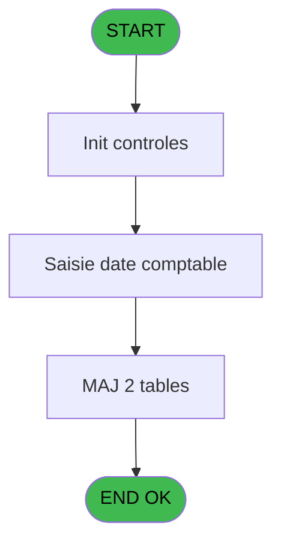

# EXM IDE 7 - Saisie date comptable

> **Analyse**: Phases 1-4 2026-02-03 11:11 -> 11:11 (17s) | Assemblage 11:11
> **Pipeline**: V7.2 Enrichi
> **Structure**: 4 onglets (Resume | Ecrans | Donnees | Connexions)

<!-- TAB:Resume -->

## 1. FICHE D'IDENTITE

| Attribut | Valeur |
|----------|--------|
| Projet | EXM |
| IDE Position | 7 |
| Nom Programme | Saisie date comptable |
| Fichier source | `Prg_7.xml` |
| Dossier IDE | Autres |
| Taches | 5 (1 ecrans visibles) |
| Tables modifiees | 2 |
| Programmes appeles | 1 |

## 2. DESCRIPTION FONCTIONNELLE

**Saisie date comptable** assure la gestion complete de ce processus, accessible depuis [Menu general (IDE 18)](EXM-IDE-18.md).

Le flux de traitement s'organise en **3 blocs fonctionnels** :

- **Calcul** (2 taches) : calculs de montants, stocks ou compteurs
- **Traitement** (2 taches) : traitements metier divers
- **Saisie** (1 tache) : ecrans de saisie utilisateur (formulaires, champs, donnees)

**Donnees modifiees** : 2 tables en ecriture (date_comptable___dat, vente____________vep).

Detail : phases du traitement

#### Phase 1 : Traitement (2 taches)

- **7** - (sans nom)
- **7.3.1** - Enregistrement date

Delegue a : [Recuperation du titre (IDE 14)](EXM-IDE-14.md)

#### Phase 2 : Calcul (2 taches)

- **7.1** - Lecture date comptable
- **7.3** - date comptable **[[ECRAN]](#ecran-t4)**

#### Phase 3 : Saisie (1 tache)

- **7.2** - Vente existante

#### Tables impactees

| Table | Operations | Role metier |
|-------|-----------|-------------|
| date_comptable___dat | R/**W** (2 usages) |  |
| vente____________vep | **W** (1 usages) | Donnees de ventes |

## 3. BLOCS FONCTIONNELS

### 3.1 Traitement (2 taches)

Traitements internes.

---

#### 7 - (sans nom)

**Role** : Traitement interne.
**Delegue a** : [Recuperation du titre (IDE 14)](EXM-IDE-14.md)

---

#### 7.3.1 - Enregistrement date

**Role** : Traitement : Enregistrement date.
**Variables liees** : A (W0 date comptable)
**Delegue a** : [Recuperation du titre (IDE 14)](EXM-IDE-14.md)

### 3.2 Calcul (2 taches)

Calculs metier : montants, stocks, compteurs.

---

#### 7.1 - Lecture date comptable

**Role** : Traitement : Lecture date comptable.
**Variables liees** : A (W0 date comptable)

---

#### 7.3 - date comptable [[ECRAN]](#ecran-t4)

**Role** : Traitement : date comptable.
**Ecran** : 645 x 115 DLU (MDI) | [Voir mockup](#ecran-t4)
**Variables liees** : A (W0 date comptable)

### 3.3 Saisie (1 tache)

Ce bloc traite la saisie des donnees de la transaction.

---

#### 7.2 - Vente existante

**Role** : Saisie des donnees : Vente existante.
**Variables liees** : C (W1 ret.lien vente)

## 5. REGLES METIER

*(Aucune regle metier identifiee)*

## 6. CONTEXTE

- **Appele par**: [Menu general (IDE 18)](EXM-IDE-18.md)
- **Appelle**: 1 programmes | **Tables**: 3 (W:2 R:1 L:1) | **Taches**: 5 | **Expressions**: 1

<!-- TAB:Ecrans -->

## 8. ECRANS

### 8.1 Forms visibles (1 / 5)

| # | Position | Tache | Nom | Type | Largeur | Hauteur | Bloc |
|---|----------|-------|-----|------|---------|---------|------|
| 1 | 7.3 | 7.3 | date comptable | MDI | 645 | 115 | Calcul |

### 8.2 Mockups Ecrans

---

#### 7.3 - date comptable
**Tache** : [7.3](#t4) | **Type** : MDI | **Dimensions** : 645 x 115 DLU
**Bloc** : Calcul | **Titre IDE** : date comptable

<!-- FORM-DATA:
{
    "width":  645,
    "vFactor":  8,
    "type":  "MDI",
    "hFactor":  8,
    "controls":  [
                     {
                         "x":  0,
                         "type":  "label",
                         "var":  "",
                         "y":  0,
                         "w":  637,
                         "fmt":  "",
                         "name":  "",
                         "h":  18,
                         "color":  "",
                         "text":  "",
                         "parent":  null
                     },
                     {
                         "x":  227,
                         "type":  "label",
                         "var":  "",
                         "y":  23,
                         "w":  370,
                         "fmt":  "",
                         "name":  "",
                         "h":  58,
                         "color":  "",
                         "text":  "",
                         "parent":  null
                     },
                     {
                         "x":  270,
                         "type":  "label",
                         "var":  "",
                         "y":  48,
                         "w":  128,
                         "fmt":  "",
                         "name":  "",
                         "h":  10,
                         "color":  "",
                         "text":  "Date comptable",
                         "parent":  4
                     },
                     {
                         "x":  0,
                         "type":  "label",
                         "var":  "",
                         "y":  88,
                         "w":  637,
                         "fmt":  "",
                         "name":  "",
                         "h":  24,
                         "color":  "",
                         "text":  "",
                         "parent":  null
                     },
                     {
                         "x":  402,
                         "type":  "edit",
                         "var":  "",
                         "y":  49,
                         "w":  126,
                         "fmt":  "",
                         "name":  "W1 date comptable",
                         "h":  10,
                         "color":  "6",
                         "text":  "",
                         "parent":  4
                     },
                     {
                         "x":  529,
                         "type":  "button",
                         "var":  "",
                         "y":  49,
                         "w":  23,
                         "fmt":  "...",
                         "name":  "b_zoomDate",
                         "h":  10,
                         "color":  "",
                         "text":  "",
                         "parent":  null
                     },
                     {
                         "x":  6,
                         "type":  "button",
                         "var":  "",
                         "y":  91,
                         "w":  154,
                         "fmt":  "\u0026Ok",
                         "name":  "btn ok",
                         "h":  18,
                         "color":  "",
                         "text":  "",
                         "parent":  8
                     },
                     {
                         "x":  11,
                         "type":  "edit",
                         "var":  "",
                         "y":  4,
                         "w":  267,
                         "fmt":  "20",
                         "name":  "",
                         "h":  8,
                         "color":  "",
                         "text":  "",
                         "parent":  1
                     },
                     {
                         "x":  429,
                         "type":  "edit",
                         "var":  "",
                         "y":  4,
                         "w":  203,
                         "fmt":  "WWW DD MMM YYYYT",
                         "name":  "",
                         "h":  8,
                         "color":  "",
                         "text":  "",
                         "parent":  1
                     },
                     {
                         "x":  39,
                         "type":  "image",
                         "var":  "",
                         "y":  28,
                         "w":  160,
                         "fmt":  "",
                         "name":  "",
                         "h":  49,
                         "color":  "",
                         "text":  "",
                         "parent":  null
                     },
                     {
                         "x":  165,
                         "type":  "button",
                         "var":  "",
                         "y":  91,
                         "w":  154,
                         "fmt":  "A\u0026bandonner",
                         "name":  "",
                         "h":  18,
                         "color":  "",
                         "text":  "",
                         "parent":  null
                     }
                 ],
    "taskId":  "7.3",
    "height":  115
}
-->

<strong>Champs : 3 champs</strong>

| Pos (x,y) | Nom | Variable | Type |
|-----------|-----|----------|------|
| 402,49 | W1 date comptable | - | edit |
| 11,4 | 20 | - | edit |
| 429,4 | WWW DD MMM YYYYT | - | edit |

<strong>Boutons : 3 boutons</strong>

| Bouton | Pos (x,y) | Action |
|--------|-----------|--------|
| ... | 529,49 | Bouton fonctionnel |
| Ok | 6,91 | Valide la saisie et enregistre |
| Abandonner | 165,91 | Annule et retour au menu |

## 9. NAVIGATION

Ecran unique: **date comptable**

### 9.3 Structure hierarchique (5 taches)

| Position | Tache | Type | Dimensions | Bloc |
|----------|-------|------|------------|------|
| **7.1** | [**(sans nom)** (7)](#t1) | MDI | - | Traitement |
| 7.1.1 | [Enregistrement date (7.3.1)](#t6) | MDI | - | |
| **7.2** | [**Lecture date comptable** (7.1)](#t2) | MDI | - | Calcul |
| 7.2.1 | [date comptable (7.3)](#t4) [mockup](#ecran-t4) | MDI | 645x115 | |
| **7.3** | [**Vente existante** (7.2)](#t3) | MDI | - | Saisie |

### 9.4 Algorigramme

> **Legende**: Vert = START/END OK | Rouge = END KO | Bleu = Decisions
> *Algorigramme auto-genere. Utiliser `/algorigramme` pour une synthese metier detaillee.*

<!-- TAB:Donnees -->

## 10. TABLES

### Tables utilisees (3)

| ID | Nom | Description | Type | R | W | L | Usages |
|----|-----|-------------|------|---|---|---|--------|
| 293 | date_comptable___dat |  | DB | R | **W** |   | 2 |
| 307 | vente_option_veo | Donnees de ventes | DB |   |   | L | 1 |
| 309 | vente____________vep | Donnees de ventes | DB |   | **W** |   | 1 |

### Colonnes par table (3 / 2 tables avec colonnes identifiees)

Table 293 - date_comptable___dat (R/**W**) - 2 usages

| Lettre | Variable | Acces | Type |
|--------|----------|-------|------|
| A | W0 date comptable | W | Date |
| B | b_zoomDate | W | Alpha |

Table 309 - vente____________vep (**W**) - 1 usages

| Lettre | Variable | Acces | Type |
|--------|----------|-------|------|
| A | W1 ret.lien vente pa | W | Numeric |
| B | W1 ret.lien vente op | W | Numeric |

## 11. VARIABLES

### 11.1 Variables de session (1)

Variables persistantes pendant toute la session.

| Lettre | Nom | Type | Usage dans |
|--------|-----|------|-----------|
| F | v. titre | Alpha | - |

### 11.2 Variables de travail (2)

Variables internes au programme.

| Lettre | Nom | Type | Usage dans |
|--------|-----|------|-----------|
| A | W0 date comptable | Date | - |
| B | W0 OK | Alpha | 1x calcul interne |

### 11.3 Autres (3)

Variables diverses.

| Lettre | Nom | Type | Usage dans |
|--------|-----|------|-----------|
| C | W1 ret.lien vente | Numeric | - |
| D | W1 confirmation | Numeric | - |
| E | btn ok | Alpha | - |

## 12. EXPRESSIONS

**1 / 1 expressions decodees (100%)**

### 12.1 Repartition par type

| Type | Expressions | Regles |
|------|-------------|--------|
| CONDITION | 1 | 0 |

### 12.2 Expressions cles par type

#### CONDITION (1 expressions)

| Type | IDE | Expression | Regle |
|------|-----|------------|-------|
| CONDITION | 1 | `W0 OK [B]<>'N'` | - |

<!-- TAB:Connexions -->

## 13. GRAPHE D'APPELS

### 13.1 Chaine depuis Main (Callers)

Main -> ... -> [Menu general (IDE 18)](EXM-IDE-18.md) -> **Saisie date comptable (IDE 7)**

### 13.2 Callers

| IDE | Nom Programme | Nb Appels |
|-----|---------------|-----------|
| [18](EXM-IDE-18.md) | Menu general | 1 |

### 13.3 Callees (programmes appeles)

### 13.4 Detail Callees avec contexte

| IDE | Nom Programme | Appels | Contexte |
|-----|---------------|--------|----------|
| [14](EXM-IDE-14.md) | Recuperation du titre | 1 | Recuperation donnees |

## 14. RECOMMANDATIONS MIGRATION

### 14.1 Profil du programme

| Metrique | Valeur | Impact migration |
|----------|--------|-----------------|
| Lignes de logique | 51 | Programme compact |
| Expressions | 1 | Peu de logique |
| Tables WRITE | 2 | Impact faible |
| Sous-programmes | 1 | Peu de dependances |
| Ecrans visibles | 1 | Ecran unique ou traitement batch |
| Code desactive | 0% (0 / 51) | Code sain |
| Regles metier | 0 | Pas de regle identifiee |

### 14.2 Plan de migration par bloc

#### Traitement (2 taches: 0 ecran, 2 traitements)

- **Strategie** : 2 service(s) backend injectable(s) (Domain Services).
- 1 sous-programme(s) a migrer ou a reutiliser depuis les services existants.
- Decomposer les taches en services unitaires testables.

#### Calcul (2 taches: 1 ecran, 1 traitement)

- **Strategie** : Services de calcul purs (Domain Services).
- Migrer la logique de calcul (stock, compteurs, montants)

#### Saisie (1 tache: 0 ecran, 1 traitement)

- **Strategie** : Formulaire React/Blazor avec validation Zod/FluentValidation.
- Validation temps reel cote client + serveur

### 14.3 Dependances critiques

| Dependance | Type | Appels | Impact |
|------------|------|--------|--------|
| date_comptable___dat | Table WRITE (Database) | 1x | Schema + repository |
| vente____________vep | Table WRITE (Database) | 1x | Schema + repository |
| [Recuperation du titre (IDE 14)](EXM-IDE-14.md) | Sous-programme | 1x | Normale - Recuperation donnees |

---
*Spec DETAILED generee par Pipeline V7.2 - 2026-02-03 11:11*
