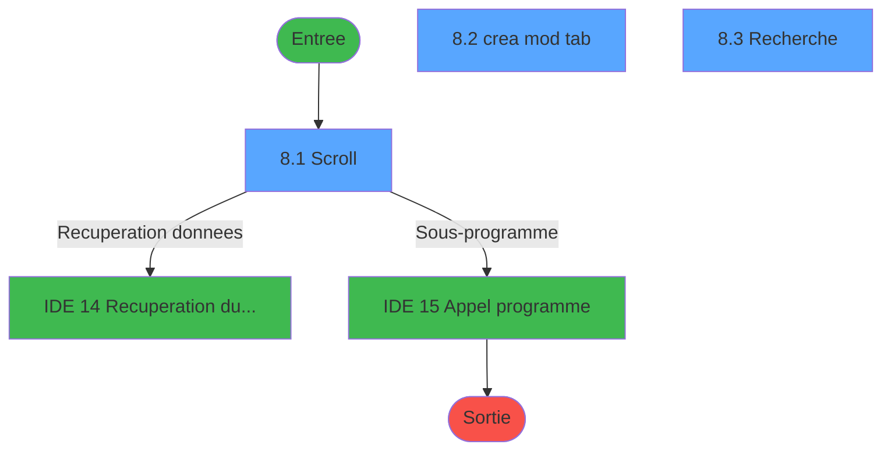
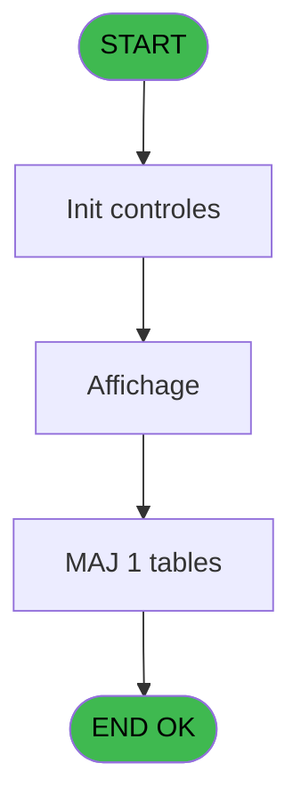
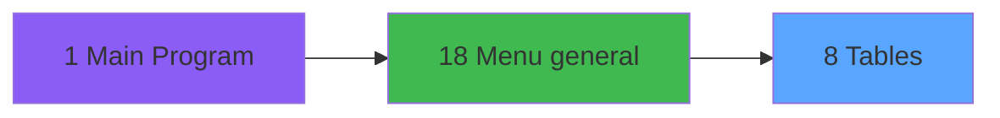
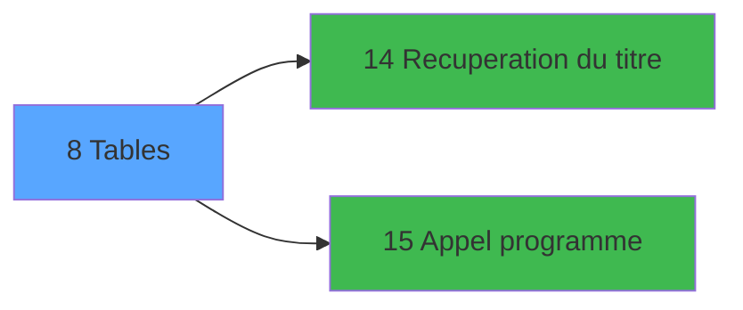

# EXM IDE 8 - Tables

> **Analyse**: Phases 1-4 2026-02-03 11:12 -> 11:12 (17s) | Assemblage 11:12
> **Pipeline**: V7.2 Enrichi
> **Structure**: 4 onglets (Resume | Ecrans | Donnees | Connexions)

<!-- TAB:Resume -->

## 1. FICHE D'IDENTITE

| Attribut | Valeur |
|----------|--------|
| Projet | EXM |
| IDE Position | 8 |
| Nom Programme | Tables |
| Fichier source | `Prg_8.xml` |
| Dossier IDE | Autres |
| Taches | 6 (3 ecrans visibles) |
| Tables modifiees | 1 |
| Programmes appeles | 2 |

## 2. DESCRIPTION FONCTIONNELLE

**Tables** assure la gestion complete de ce processus, accessible depuis [Menu general (IDE 18)](EXM-IDE-18.md).

Le flux de traitement s'organise en **3 blocs fonctionnels** :

- **Traitement** (4 taches) : traitements metier divers
- **Consultation** (1 tache) : ecrans de recherche, selection et consultation
- **Creation** (1 tache) : insertion d'enregistrements en base (mouvements, prestations)

**Donnees modifiees** : 1 tables en ecriture (tables_divers____tad).

Detail : phases du traitement

#### Phase 1 : Traitement (4 taches)

- **8** - Tables **[[ECRAN]](#ecran-t1)**
- **8.1** - Scroll **[[ECRAN]](#ecran-t2)**
- **8.2** - crea mod tab **[[ECRAN]](#ecran-t3)**
- **8.4** - Suppression

Delegue a : [Recuperation du titre (IDE 14)](EXM-IDE-14.md), [Appel programme (IDE 15)](EXM-IDE-15.md)

#### Phase 2 : Creation (1 tache)

- **8.2.1** - Creation

#### Phase 3 : Consultation (1 tache)

- **8.3** - Recherche **[[ECRAN]](#ecran-t7)**

Delegue a : [Recuperation du titre (IDE 14)](EXM-IDE-14.md)

#### Tables impactees

| Table | Operations | Role metier |
|-------|-----------|-------------|
| tables_divers____tad | **W** (4 usages) |  |

## 3. BLOCS FONCTIONNELS

### 3.1 Traitement (4 taches)

Traitements internes.

---

#### 8 - Tables [[ECRAN]](#ecran-t1)

**Role** : Traitement : Tables.
**Ecran** : 166 x 22 DLU (MDI) | [Voir mockup](#ecran-t1)

3 sous-taches directes

| Tache | Nom | Bloc |
|-------|-----|------|
| [8.1](#t2) | Scroll **[[ECRAN]](#ecran-t2)** | Traitement |
| [8.2](#t3) | crea mod tab **[[ECRAN]](#ecran-t3)** | Traitement |
| [8.4](#t8) | Suppression | Traitement |

**Delegue a** : [Recuperation du titre (IDE 14)](EXM-IDE-14.md), [Appel programme (IDE 15)](EXM-IDE-15.md)

---

#### 8.1 - Scroll [[ECRAN]](#ecran-t2)

**Role** : Traitement : Scroll.
**Ecran** : 960 x 241 DLU (MDI) | [Voir mockup](#ecran-t2)
**Delegue a** : [Recuperation du titre (IDE 14)](EXM-IDE-14.md), [Appel programme (IDE 15)](EXM-IDE-15.md)

---

#### 8.2 - crea mod tab [[ECRAN]](#ecran-t3)

**Role** : Traitement : crea mod tab.
**Ecran** : 698 x 121 DLU (MDI) | [Voir mockup](#ecran-t3)
**Delegue a** : [Recuperation du titre (IDE 14)](EXM-IDE-14.md), [Appel programme (IDE 15)](EXM-IDE-15.md)

---

#### 8.4 - Suppression

**Role** : Traitement : Suppression.
**Delegue a** : [Recuperation du titre (IDE 14)](EXM-IDE-14.md), [Appel programme (IDE 15)](EXM-IDE-15.md)

### 3.2 Creation (1 tache)

Insertion de nouveaux enregistrements en base.

---

#### 8.2.1 - Creation

**Role** : Creation d'enregistrement : Creation.

### 3.3 Consultation (1 tache)

Ecrans de recherche et consultation.

---

#### 8.3 - Recherche [[ECRAN]](#ecran-t7)

**Role** : Traitement : Recherche.
**Ecran** : 523 x 90 DLU (MDI) | [Voir mockup](#ecran-t7)

## 5. REGLES METIER

*(Aucune regle metier identifiee)*

## 6. CONTEXTE

- **Appele par**: [Menu general (IDE 18)](EXM-IDE-18.md)
- **Appelle**: 2 programmes | **Tables**: 1 (W:1 R:0 L:0) | **Taches**: 6 | **Expressions**: 5

<!-- TAB:Ecrans -->

## 8. ECRANS

### 8.1 Forms visibles (3 / 6)

| # | Position | Tache | Nom | Type | Largeur | Hauteur | Bloc |
|---|----------|-------|-----|------|---------|---------|------|
| 1 | 8.1 | 8.1 | Scroll | MDI | 960 | 241 | Traitement |
| 2 | 8.2 | 8.2 | crea mod tab | MDI | 698 | 121 | Traitement |
| 3 | 8.3 | 8.3 | Recherche | MDI | 523 | 90 | Consultation |

### 8.2 Mockups Ecrans

---

#### 8.1 - Scroll
**Tache** : [8.1](#t2) | **Type** : MDI | **Dimensions** : 960 x 241 DLU
**Bloc** : Traitement | **Titre IDE** : Scroll

<!-- FORM-DATA:
{
    "width":  960,
    "vFactor":  8,
    "type":  "MDI",
    "hFactor":  8,
    "controls":  [
                     {
                         "x":  2,
                         "type":  "label",
                         "var":  "",
                         "y":  1,
                         "w":  953,
                         "fmt":  "",
                         "name":  "",
                         "h":  17,
                         "color":  "",
                         "text":  "",
                         "parent":  null
                     },
                     {
                         "x":  58,
                         "type":  "table",
                         "var":  "",
                         "name":  "",
                         "titleH":  12,
                         "color":  "110",
                         "w":  512,
                         "y":  28,
                         "fmt":  "",
                         "parent":  null,
                         "text":  "",
                         "rowH":  14,
                         "h":  177,
                         "cols":  [
                                      {
                                          "title":  "Tables",
                                          "layer":  1,
                                          "w":  480
                                      }
                                  ],
                         "rows":  1
                     },
                     {
                         "x":  628,
                         "type":  "label",
                         "var":  "",
                         "y":  93,
                         "w":  281,
                         "fmt":  "",
                         "name":  "",
                         "h":  111,
                         "color":  "155",
                         "text":  "",
                         "parent":  null
                     },
                     {
                         "x":  662,
                         "type":  "label",
                         "var":  "",
                         "y":  107,
                         "w":  212,
                         "fmt":  "",
                         "name":  "",
                         "h":  77,
                         "color":  "1",
                         "text":  "",
                         "parent":  8
                     },
                     {
                         "x":  664,
                         "type":  "label",
                         "var":  "",
                         "y":  108,
                         "w":  42,
                         "fmt":  "",
                         "name":  "",
                         "h":  75,
                         "color":  "",
                         "text":  "",
                         "parent":  8
                     },
                     {
                         "x":  715,
                         "type":  "label",
                         "var":  "",
                         "y":  114,
                         "w":  145,
                         "fmt":  "",
                         "name":  "",
                         "h":  9,
                         "color":  "142",
                         "text":  "Recherche",
                         "parent":  8
                     },
                     {
                         "x":  715,
                         "type":  "label",
                         "var":  "",
                         "y":  131,
                         "w":  145,
                         "fmt":  "",
                         "name":  "",
                         "h":  9,
                         "color":  "142",
                         "text":  "Creation",
                         "parent":  8
                     },
                     {
                         "x":  715,
                         "type":  "label",
                         "var":  "",
                         "y":  148,
                         "w":  145,
                         "fmt":  "",
                         "name":  "",
                         "h":  9,
                         "color":  "142",
                         "text":  "Modification",
                         "parent":  8
                     },
                     {
                         "x":  717,
                         "type":  "label",
                         "var":  "",
                         "y":  165,
                         "w":  145,
                         "fmt":  "",
                         "name":  "",
                         "h":  9,
                         "color":  "142",
                         "text":  "Suppression",
                         "parent":  8
                     },
                     {
                         "x":  698,
                         "type":  "label",
                         "var":  "",
                         "y":  189,
                         "w":  104,
                         "fmt":  "",
                         "name":  "",
                         "h":  9,
                         "color":  "",
                         "text":  "Votre choix",
                         "parent":  8
                     },
                     {
                         "x":  0,
                         "type":  "label",
                         "var":  "",
                         "y":  214,
                         "w":  953,
                         "fmt":  "",
                         "name":  "",
                         "h":  24,
                         "color":  "",
                         "text":  "",
                         "parent":  null
                     },
                     {
                         "x":  810,
                         "type":  "edit",
                         "var":  "",
                         "y":  189,
                         "w":  26,
                         "fmt":  "",
                         "name":  "",
                         "h":  10,
                         "color":  "6",
                         "text":  "",
                         "parent":  8
                     },
                     {
                         "x":  5,
                         "type":  "edit",
                         "var":  "",
                         "y":  5,
                         "w":  267,
                         "fmt":  "20",
                         "name":  "",
                         "h":  8,
                         "color":  "",
                         "text":  "",
                         "parent":  null
                     },
                     {
                         "x":  746,
                         "type":  "edit",
                         "var":  "",
                         "y":  5,
                         "w":  203,
                         "fmt":  "WWW DD MMM YYYYT",
                         "name":  "",
                         "h":  8,
                         "color":  "",
                         "text":  "",
                         "parent":  null
                     },
                     {
                         "x":  701,
                         "type":  "image",
                         "var":  "",
                         "y":  29,
                         "w":  136,
                         "fmt":  "",
                         "name":  "",
                         "h":  57,
                         "color":  "155",
                         "text":  "",
                         "parent":  null
                     },
                     {
                         "x":  64,
                         "type":  "edit",
                         "var":  "",
                         "y":  44,
                         "w":  469,
                         "fmt":  "40",
                         "name":  "",
                         "h":  8,
                         "color":  "110",
                         "text":  "",
                         "parent":  4
                     },
                     {
                         "x":  673,
                         "type":  "button",
                         "var":  "",
                         "y":  114,
                         "w":  24,
                         "fmt":  "R",
                         "name":  "R",
                         "h":  9,
                         "color":  "1",
                         "text":  "",
                         "parent":  null
                     },
                     {
                         "x":  673,
                         "type":  "button",
                         "var":  "",
                         "y":  131,
                         "w":  24,
                         "fmt":  "C",
                         "name":  "C",
                         "h":  9,
                         "color":  "1",
                         "text":  "",
                         "parent":  null
                     },
                     {
                         "x":  673,
                         "type":  "button",
                         "var":  "",
                         "y":  148,
                         "w":  24,
                         "fmt":  "M",
                         "name":  "M",
                         "h":  9,
                         "color":  "1",
                         "text":  "",
                         "parent":  null
                     },
                     {
                         "x":  673,
                         "type":  "button",
                         "var":  "",
                         "y":  165,
                         "w":  24,
                         "fmt":  "S",
                         "name":  "S",
                         "h":  9,
                         "color":  "1",
                         "text":  "",
                         "parent":  null
                     },
                     {
                         "x":  7,
                         "type":  "button",
                         "var":  "",
                         "y":  217,
                         "w":  154,
                         "fmt":  "\u0026Quitter",
                         "name":  "",
                         "h":  18,
                         "color":  "",
                         "text":  "",
                         "parent":  17
                     }
                 ],
    "taskId":  "8.1",
    "height":  241
}
-->

<strong>Champs : 4 champs</strong>

| Pos (x,y) | Nom | Variable | Type |
|-----------|-----|----------|------|
| 810,189 | (sans nom) | - | edit |
| 5,5 | 20 | - | edit |
| 746,5 | WWW DD MMM YYYYT | - | edit |
| 64,44 | 40 | - | edit |

<strong>Boutons : 5 boutons</strong>

| Bouton | Pos (x,y) | Action |
|--------|-----------|--------|
| R | 673,114 | Bouton fonctionnel |
| C | 673,131 | Bouton fonctionnel |
| M | 673,148 | Bouton fonctionnel |
| S | 673,165 | Bouton fonctionnel |
| Quitter | 7,217 | Quitte le programme |

---

#### 8.2 - crea mod tab
**Tache** : [8.2](#t3) | **Type** : MDI | **Dimensions** : 698 x 121 DLU
**Bloc** : Traitement | **Titre IDE** : crea mod tab

<!-- FORM-DATA:
{
    "width":  698,
    "vFactor":  8,
    "type":  "MDI",
    "hFactor":  8,
    "controls":  [
                     {
                         "x":  0,
                         "type":  "label",
                         "var":  "",
                         "y":  2,
                         "w":  695,
                         "fmt":  "",
                         "name":  "",
                         "h":  17,
                         "color":  "",
                         "text":  "",
                         "parent":  null
                     },
                     {
                         "x":  183,
                         "type":  "label",
                         "var":  "",
                         "y":  30,
                         "w":  473,
                         "fmt":  "",
                         "name":  "",
                         "h":  56,
                         "color":  "",
                         "text":  "",
                         "parent":  null
                     },
                     {
                         "x":  211,
                         "type":  "label",
                         "var":  "",
                         "y":  44,
                         "w":  56,
                         "fmt":  "",
                         "name":  "",
                         "h":  10,
                         "color":  "",
                         "text":  "Code",
                         "parent":  4
                     },
                     {
                         "x":  211,
                         "type":  "label",
                         "var":  "",
                         "y":  65,
                         "w":  56,
                         "fmt":  "",
                         "name":  "",
                         "h":  10,
                         "color":  "",
                         "text":  "Libelle",
                         "parent":  4
                     },
                     {
                         "x":  2,
                         "type":  "label",
                         "var":  "",
                         "y":  96,
                         "w":  692,
                         "fmt":  "",
                         "name":  "",
                         "h":  24,
                         "color":  "",
                         "text":  "",
                         "parent":  null
                     },
                     {
                         "x":  277,
                         "type":  "edit",
                         "var":  "",
                         "y":  43,
                         "w":  59,
                         "fmt":  "",
                         "name":  "W1 Code",
                         "h":  10,
                         "color":  "6",
                         "text":  "",
                         "parent":  4
                     },
                     {
                         "x":  277,
                         "type":  "edit",
                         "var":  "",
                         "y":  64,
                         "w":  350,
                         "fmt":  "",
                         "name":  "W1 libelle",
                         "h":  10,
                         "color":  "6",
                         "text":  "",
                         "parent":  4
                     },
                     {
                         "x":  8,
                         "type":  "button",
                         "var":  "",
                         "y":  99,
                         "w":  154,
                         "fmt":  "\u0026Ok",
                         "name":  "btn ok",
                         "h":  18,
                         "color":  "",
                         "text":  "",
                         "parent":  10
                     },
                     {
                         "x":  3,
                         "type":  "edit",
                         "var":  "",
                         "y":  6,
                         "w":  267,
                         "fmt":  "20",
                         "name":  "",
                         "h":  8,
                         "color":  "",
                         "text":  "",
                         "parent":  1
                     },
                     {
                         "x":  485,
                         "type":  "edit",
                         "var":  "",
                         "y":  6,
                         "w":  203,
                         "fmt":  "WWW DD MMM YYYYT",
                         "name":  "",
                         "h":  8,
                         "color":  "",
                         "text":  "",
                         "parent":  1
                     },
                     {
                         "x":  39,
                         "type":  "image",
                         "var":  "",
                         "y":  37,
                         "w":  97,
                         "fmt":  "",
                         "name":  "",
                         "h":  42,
                         "color":  "",
                         "text":  "",
                         "parent":  null
                     },
                     {
                         "x":  168,
                         "type":  "button",
                         "var":  "",
                         "y":  99,
                         "w":  154,
                         "fmt":  "A\u0026bandonner",
                         "name":  "",
                         "h":  18,
                         "color":  "",
                         "text":  "",
                         "parent":  null
                     }
                 ],
    "taskId":  "8.2",
    "height":  121
}
-->

<strong>Champs : 4 champs</strong>

| Pos (x,y) | Nom | Variable | Type |
|-----------|-----|----------|------|
| 277,43 | W1 Code | - | edit |
| 277,64 | W1 libelle | - | edit |
| 3,6 | 20 | - | edit |
| 485,6 | WWW DD MMM YYYYT | - | edit |

<strong>Boutons : 2 boutons</strong>

| Bouton | Pos (x,y) | Action |
|--------|-----------|--------|
| Ok | 8,99 | Valide la saisie et enregistre |
| Abandonner | 168,99 | Annule et retour au menu |

---

#### 8.3 - Recherche
**Tache** : [8.3](#t7) | **Type** : MDI | **Dimensions** : 523 x 90 DLU
**Bloc** : Consultation | **Titre IDE** : Recherche

<!-- FORM-DATA:
{
    "width":  523,
    "vFactor":  8,
    "type":  "MDI",
    "hFactor":  8,
    "controls":  [
                     {
                         "x":  143,
                         "type":  "label",
                         "var":  "",
                         "y":  16,
                         "w":  375,
                         "fmt":  "",
                         "name":  "",
                         "h":  33,
                         "color":  "",
                         "text":  "",
                         "parent":  null
                     },
                     {
                         "x":  153,
                         "type":  "label",
                         "var":  "",
                         "y":  27,
                         "w":  110,
                         "fmt":  "",
                         "name":  "",
                         "h":  10,
                         "color":  "",
                         "text":  "Entrez le nom",
                         "parent":  2
                     },
                     {
                         "x":  0,
                         "type":  "label",
                         "var":  "",
                         "y":  63,
                         "w":  518,
                         "fmt":  "",
                         "name":  "",
                         "h":  24,
                         "color":  "",
                         "text":  "",
                         "parent":  null
                     },
                     {
                         "x":  268,
                         "type":  "edit",
                         "var":  "",
                         "y":  26,
                         "w":  238,
                         "fmt":  "",
                         "name":  "",
                         "h":  10,
                         "color":  "6",
                         "text":  "",
                         "parent":  2
                     },
                     {
                         "x":  7,
                         "type":  "button",
                         "var":  "",
                         "y":  66,
                         "w":  154,
                         "fmt":  "\u0026Ok",
                         "name":  "",
                         "h":  18,
                         "color":  "",
                         "text":  "",
                         "parent":  5
                     },
                     {
                         "x":  351,
                         "type":  "button",
                         "var":  "",
                         "y":  66,
                         "w":  154,
                         "fmt":  "\u0026Abandonner",
                         "name":  "",
                         "h":  18,
                         "color":  "",
                         "text":  "",
                         "parent":  5
                     },
                     {
                         "x":  2,
                         "type":  "image",
                         "var":  "",
                         "y":  5,
                         "w":  127,
                         "fmt":  "",
                         "name":  "",
                         "h":  54,
                         "color":  "",
                         "text":  "",
                         "parent":  null
                     }
                 ],
    "taskId":  "8.3",
    "height":  90
}
-->

<strong>Champs : 1 champs</strong>

| Pos (x,y) | Nom | Variable | Type |
|-----------|-----|----------|------|
| 268,26 | (sans nom) | - | edit |

<strong>Boutons : 2 boutons</strong>

| Bouton | Pos (x,y) | Action |
|--------|-----------|--------|
| Ok | 7,66 | Valide la saisie et enregistre |
| Abandonner | 351,66 | Annule et retour au menu |

## 9. NAVIGATION

### 9.1 Enchainement des ecrans

**Detail par enchainement :**

| Depuis | Action | Vers | Retour |
|--------|--------|------|--------|
| Scroll | Recuperation donnees | [Recuperation du titre (IDE 14)](EXM-IDE-14.md) | Retour ecran |
| Scroll | Sous-programme | [Appel programme (IDE 15)](EXM-IDE-15.md) | Retour ecran |

### 9.3 Structure hierarchique (6 taches)

| Position | Tache | Type | Dimensions | Bloc |
|----------|-------|------|------------|------|
| **8.1** | [**Tables** (8)](#t1) [mockup](#ecran-t1) | MDI | 166x22 | Traitement |
| 8.1.1 | [Scroll (8.1)](#t2) [mockup](#ecran-t2) | MDI | 960x241 | |
| 8.1.2 | [crea mod tab (8.2)](#t3) [mockup](#ecran-t3) | MDI | 698x121 | |
| 8.1.3 | [Suppression (8.4)](#t8) | MDI | - | |
| **8.2** | [**Creation** (8.2.1)](#t6) | MDI | - | Creation |
| **8.3** | [**Recherche** (8.3)](#t7) [mockup](#ecran-t7) | MDI | 523x90 | Consultation |

### 9.4 Algorigramme

> **Legende**: Vert = START/END OK | Rouge = END KO | Bleu = Decisions
> *Algorigramme auto-genere. Utiliser `/algorigramme` pour une synthese metier detaillee.*

<!-- TAB:Donnees -->

## 10. TABLES

### Tables utilisees (1)

| ID | Nom | Description | Type | R | W | L | Usages |
|----|-----|-------------|------|---|---|---|--------|
| 304 | tables_divers____tad |  | DB |   | **W** |   | 4 |

### Colonnes par table (1 / 1 tables avec colonnes identifiees)

Table 304 - tables_divers____tad (**W**) - 4 usages

| Lettre | Variable | Acces | Type |
|--------|----------|-------|------|
| A | W1 choix action | W | Alpha |
| B | W1 fin tâche | W | Alpha |
| C | W1 ret.lien ventes | W | Numeric |
| D | v. titre | W | Alpha |

## 11. VARIABLES

### 11.1 Variables de session (1)

Variables persistantes pendant toute la session.

| Lettre | Nom | Type | Usage dans |
|--------|-----|------|-----------|
| F | v. titre | Alpha | - |

### 11.2 Variables de travail (5)

Variables internes au programme.

| Lettre | Nom | Type | Usage dans |
|--------|-----|------|-----------|
| A | W0 choix action | Alpha | 4x calcul interne |
| B | W0 code | Alpha | - |
| C | W0 libelle | Alpha | - |
| D | W0 pas enreg | Alpha | - |
| E | W0 confirm suppr | Numeric | [8.4](#t8) |

## 12. EXPRESSIONS

**5 / 5 expressions decodees (100%)**

### 12.1 Repartition par type

| Type | Expressions | Regles |
|------|-------------|--------|
| CONDITION | 5 | 0 |

### 12.2 Expressions cles par type

#### CONDITION (5 expressions)

| Type | IDE | Expression | Regle |
|------|-----|------------|-------|
| CONDITION | 4 | `W0 choix action [A]='R'` | - |
| CONDITION | 5 | `W0 confirm suppr [E]=6` | - |
| CONDITION | 3 | `W0 choix action [A]='S'` | - |
| CONDITION | 1 | `W0 choix action [A]='F'` | - |
| CONDITION | 2 | `W0 choix action [A]='C' OR W0 choix action [A]='M'` | - |

<!-- TAB:Connexions -->

## 13. GRAPHE D'APPELS

### 13.1 Chaine depuis Main (Callers)

Main -> ... -> [Menu general (IDE 18)](EXM-IDE-18.md) -> **Tables (IDE 8)**

### 13.2 Callers

| IDE | Nom Programme | Nb Appels |
|-----|---------------|-----------|
| [18](EXM-IDE-18.md) | Menu general | 1 |

### 13.3 Callees (programmes appeles)

### 13.4 Detail Callees avec contexte

| IDE | Nom Programme | Appels | Contexte |
|-----|---------------|--------|----------|
| [14](EXM-IDE-14.md) | Recuperation du titre | 3 | Recuperation donnees |
| [15](EXM-IDE-15.md) | Appel programme | 1 | Sous-programme |

## 14. RECOMMANDATIONS MIGRATION

### 14.1 Profil du programme

| Metrique | Valeur | Impact migration |
|----------|--------|-----------------|
| Lignes de logique | 81 | Programme compact |
| Expressions | 5 | Peu de logique |
| Tables WRITE | 1 | Impact faible |
| Sous-programmes | 2 | Peu de dependances |
| Ecrans visibles | 3 | Quelques ecrans |
| Code desactive | 0% (0 / 81) | Code sain |
| Regles metier | 0 | Pas de regle identifiee |

### 14.2 Plan de migration par bloc

#### Traitement (4 taches: 3 ecrans, 1 traitement)

- **Strategie** : Orchestrateur avec 3 ecrans (Razor/React) et 1 traitements backend (services).
- Les ecrans deviennent des composants UI, les traitements invisibles deviennent des services injectables.
- 2 sous-programme(s) a migrer ou a reutiliser depuis les services existants.
- Decomposer les taches en services unitaires testables.

#### Creation (1 tache: 0 ecran, 1 traitement)

- **Strategie** : Repository pattern avec Entity Framework Core.
- Insertion via `IRepository<T>.CreateAsync()`

#### Consultation (1 tache: 1 ecran, 0 traitement)

- **Strategie** : Composants de recherche/selection en modales.
- 1 ecran : Recherche

### 14.3 Dependances critiques

| Dependance | Type | Appels | Impact |
|------------|------|--------|--------|
| tables_divers____tad | Table WRITE (Database) | 4x | Schema + repository |
| [Recuperation du titre (IDE 14)](EXM-IDE-14.md) | Sous-programme | 3x | **CRITIQUE** - Recuperation donnees |
| [Appel programme (IDE 15)](EXM-IDE-15.md) | Sous-programme | 1x | Normale - Sous-programme |

---
*Spec DETAILED generee par Pipeline V7.2 - 2026-02-03 11:12*
