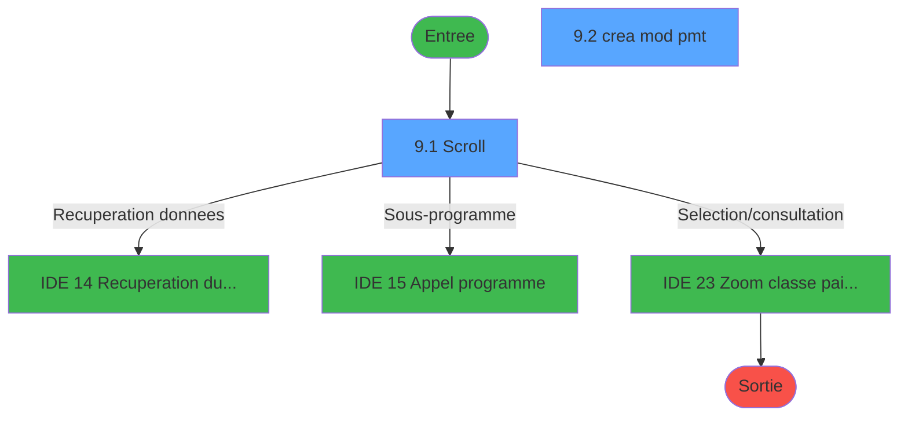
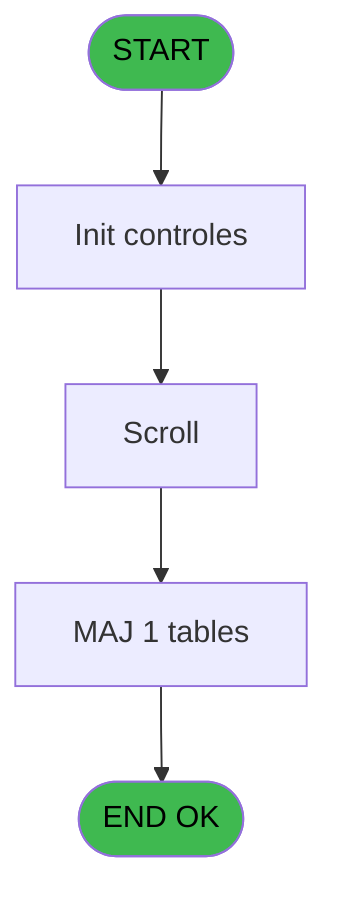
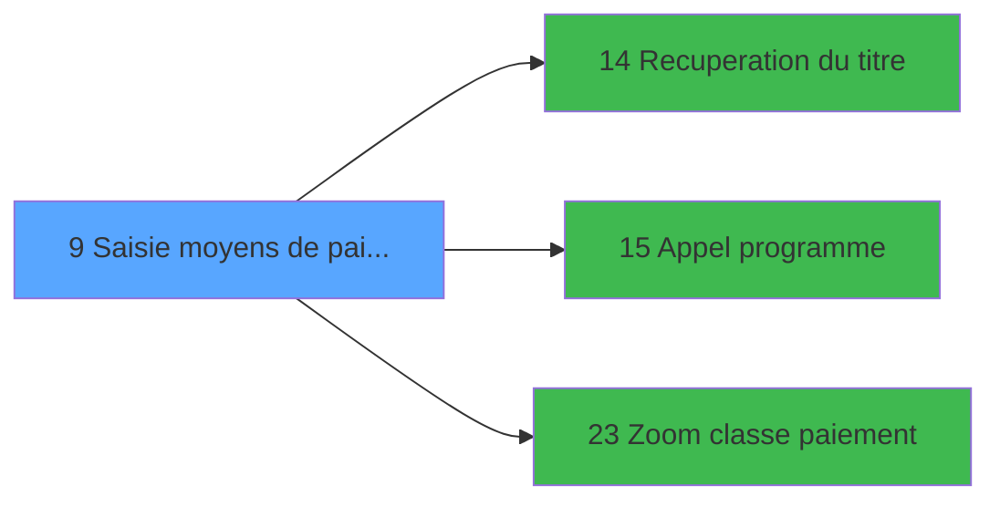

# EXM IDE 9 - Saisie moyens de paiement

> **Analyse**: Phases 1-4 2026-02-03 11:12 -> 11:12 (17s) | Assemblage 11:12
> **Pipeline**: V7.2 Enrichi
> **Structure**: 4 onglets (Resume | Ecrans | Donnees | Connexions)

<!-- TAB:Resume -->

## 1. FICHE D'IDENTITE

| Attribut | Valeur |
|----------|--------|
| Projet | EXM |
| IDE Position | 9 |
| Nom Programme | Saisie moyens de paiement |
| Fichier source | `Prg_9.xml` |
| Dossier IDE | Autres |
| Taches | 9 (2 ecrans visibles) |
| Tables modifiees | 1 |
| Programmes appeles | 3 |

## 2. DESCRIPTION FONCTIONNELLE

**Saisie moyens de paiement** assure la gestion complete de ce processus, accessible depuis [Menu general (IDE 18)](EXM-IDE-18.md).

Le flux de traitement s'organise en **4 blocs fonctionnels** :

- **Traitement** (4 taches) : traitements metier divers
- **Creation** (2 taches) : insertion d'enregistrements en base (mouvements, prestations)
- **Saisie** (2 taches) : ecrans de saisie utilisateur (formulaires, champs, donnees)
- **Consultation** (1 tache) : ecrans de recherche, selection et consultation

**Donnees modifiees** : 1 tables en ecriture (moyen_paiement___moy).

Detail : phases du traitement

#### Phase 1 : Saisie (2 taches)

- **9** - lieux de vente **[[ECRAN]](#ecran-t1)**
- **9.1.1** - Recherche vente

#### Phase 2 : Traitement (4 taches)

- **9.1** - Scroll **[[ECRAN]](#ecran-t2)**
- **9.2** - crea mod pmt **[[ECRAN]](#ecran-t4)**
- **9.2.3** - Suppression
- **9.3** - Lecture CMPASS

Delegue a : [Recuperation du titre (IDE 14)](EXM-IDE-14.md), [Appel programme (IDE 15)](EXM-IDE-15.md)

#### Phase 3 : Creation (2 taches)

- **9.2.1** - Creation
- **9.4** - Creation CMPASS

#### Phase 4 : Consultation (1 tache)

- **9.2.2** - Affichage fournisseur

Delegue a : [Recuperation du titre (IDE 14)](EXM-IDE-14.md), [Zoom classe paiement (IDE 23)](EXM-IDE-23.md)

#### Tables impactees

| Table | Operations | Role metier |
|-------|-----------|-------------|
| moyen_paiement___moy | R/**W** (7 usages) |  |

## 3. BLOCS FONCTIONNELS

### 3.1 Saisie (2 taches)

L'operateur saisit les donnees de la transaction via 1 ecran (lieux de vente).

---

#### 9 - lieux de vente [[ECRAN]](#ecran-t1)

**Role** : Saisie des donnees : lieux de vente.
**Ecran** : 166 x 10 DLU (MDI) | [Voir mockup](#ecran-t1)

---

#### 9.1.1 - Recherche vente

**Role** : Saisie des donnees : Recherche vente.

### 3.2 Traitement (4 taches)

Traitements internes.

---

#### 9.1 - Scroll [[ECRAN]](#ecran-t2)

**Role** : Traitement : Scroll.
**Ecran** : 616 x 251 DLU (MDI) | [Voir mockup](#ecran-t2)
**Delegue a** : [Recuperation du titre (IDE 14)](EXM-IDE-14.md), [Appel programme (IDE 15)](EXM-IDE-15.md)

---

#### 9.2 - crea mod pmt [[ECRAN]](#ecran-t4)

**Role** : Traitement : crea mod pmt.
**Ecran** : 557 x 119 DLU (MDI) | [Voir mockup](#ecran-t4)
**Variables liees** : H (v. titre crea)
**Delegue a** : [Recuperation du titre (IDE 14)](EXM-IDE-14.md), [Appel programme (IDE 15)](EXM-IDE-15.md)

---

#### 9.2.3 - Suppression

**Role** : Traitement : Suppression.
**Delegue a** : [Recuperation du titre (IDE 14)](EXM-IDE-14.md), [Appel programme (IDE 15)](EXM-IDE-15.md)

---

#### 9.3 - Lecture CMPASS

**Role** : Traitement : Lecture CMPASS.
**Variables liees** : E (Existe CMPASS)
**Delegue a** : [Recuperation du titre (IDE 14)](EXM-IDE-14.md), [Appel programme (IDE 15)](EXM-IDE-15.md)

### 3.3 Creation (2 taches)

Insertion de nouveaux enregistrements en base.

---

#### 9.2.1 - Creation

**Role** : Creation d'enregistrement : Creation.

---

#### 9.4 - Creation CMPASS

**Role** : Creation d'enregistrement : Creation CMPASS.
**Variables liees** : E (Existe CMPASS)

### 3.4 Consultation (1 tache)

Ecrans de recherche et consultation.

---

#### 9.2.2 - Affichage fournisseur

**Role** : Reinitialisation : Affichage fournisseur.

## 5. REGLES METIER

*(Aucune regle metier identifiee)*

## 6. CONTEXTE

- **Appele par**: [Menu general (IDE 18)](EXM-IDE-18.md)
- **Appelle**: 3 programmes | **Tables**: 3 (W:1 R:2 L:1) | **Taches**: 9 | **Expressions**: 3

<!-- TAB:Ecrans -->

## 8. ECRANS

### 8.1 Forms visibles (2 / 9)

| # | Position | Tache | Nom | Type | Largeur | Hauteur | Bloc |
|---|----------|-------|-----|------|---------|---------|------|
| 1 | 9.1 | 9.1 | Scroll | MDI | 616 | 251 | Traitement |
| 2 | 9.2 | 9.2 | crea mod pmt | MDI | 557 | 119 | Traitement |

### 8.2 Mockups Ecrans

---

#### 9.1 - Scroll
**Tache** : [9.1](#t2) | **Type** : MDI | **Dimensions** : 616 x 251 DLU
**Bloc** : Traitement | **Titre IDE** : Scroll

<!-- FORM-DATA:
{
    "width":  616,
    "vFactor":  8,
    "type":  "MDI",
    "hFactor":  8,
    "controls":  [
                     {
                         "x":  2,
                         "type":  "label",
                         "var":  "",
                         "y":  1,
                         "w":  612,
                         "fmt":  "",
                         "name":  "",
                         "h":  17,
                         "color":  "",
                         "text":  "",
                         "parent":  null
                     },
                     {
                         "x":  60,
                         "type":  "table",
                         "var":  "",
                         "name":  "",
                         "titleH":  12,
                         "color":  "110",
                         "w":  498,
                         "y":  25,
                         "fmt":  "",
                         "parent":  null,
                         "text":  "",
                         "rowH":  14,
                         "h":  96,
                         "cols":  [
                                      {
                                          "title":  "Moyen",
                                          "layer":  1,
                                          "w":  123
                                      },
                                      {
                                          "title":  "Libellé",
                                          "layer":  2,
                                          "w":  219
                                      },
                                      {
                                          "title":  "Classe",
                                          "layer":  3,
                                          "w":  125
                                      }
                                  ],
                         "rows":  3
                     },
                     {
                         "x":  258,
                         "type":  "label",
                         "var":  "",
                         "y":  124,
                         "w":  289,
                         "fmt":  "",
                         "name":  "",
                         "h":  90,
                         "color":  "155",
                         "text":  "",
                         "parent":  null
                     },
                     {
                         "x":  283,
                         "type":  "label",
                         "var":  "",
                         "y":  134,
                         "w":  234,
                         "fmt":  "",
                         "name":  "",
                         "h":  56,
                         "color":  "1",
                         "text":  "",
                         "parent":  11
                     },
                     {
                         "x":  284,
                         "type":  "label",
                         "var":  "",
                         "y":  135,
                         "w":  34,
                         "fmt":  "",
                         "name":  "",
                         "h":  54,
                         "color":  "",
                         "text":  "",
                         "parent":  11
                     },
                     {
                         "x":  331,
                         "type":  "label",
                         "var":  "",
                         "y":  139,
                         "w":  146,
                         "fmt":  "",
                         "name":  "",
                         "h":  9,
                         "color":  "142",
                         "text":  "Creation",
                         "parent":  11
                     },
                     {
                         "x":  331,
                         "type":  "label",
                         "var":  "",
                         "y":  156,
                         "w":  176,
                         "fmt":  "",
                         "name":  "",
                         "h":  9,
                         "color":  "142",
                         "text":  "Modification",
                         "parent":  11
                     },
                     {
                         "x":  333,
                         "type":  "label",
                         "var":  "",
                         "y":  174,
                         "w":  176,
                         "fmt":  "",
                         "name":  "",
                         "h":  9,
                         "color":  "142",
                         "text":  "Suppression",
                         "parent":  11
                     },
                     {
                         "x":  316,
                         "type":  "label",
                         "var":  "",
                         "y":  196,
                         "w":  120,
                         "fmt":  "",
                         "name":  "",
                         "h":  9,
                         "color":  "",
                         "text":  "Votre choix",
                         "parent":  11
                     },
                     {
                         "x":  0,
                         "type":  "label",
                         "var":  "",
                         "y":  223,
                         "w":  612,
                         "fmt":  "",
                         "name":  "",
                         "h":  24,
                         "color":  "",
                         "text":  "",
                         "parent":  null
                     },
                     {
                         "x":  88,
                         "type":  "edit",
                         "var":  "",
                         "y":  41,
                         "w":  75,
                         "fmt":  "",
                         "name":  "",
                         "h":  8,
                         "color":  "110",
                         "text":  "",
                         "parent":  4
                     },
                     {
                         "x":  202,
                         "type":  "edit",
                         "var":  "",
                         "y":  41,
                         "w":  176,
                         "fmt":  "",
                         "name":  "",
                         "h":  8,
                         "color":  "110",
                         "text":  "",
                         "parent":  4
                     },
                     {
                         "x":  440,
                         "type":  "edit",
                         "var":  "",
                         "y":  41,
                         "w":  53,
                         "fmt":  "",
                         "name":  "",
                         "h":  8,
                         "color":  "110",
                         "text":  "",
                         "parent":  4
                     },
                     {
                         "x":  452,
                         "type":  "edit",
                         "var":  "",
                         "y":  196,
                         "w":  26,
                         "fmt":  "",
                         "name":  "W1 choix action",
                         "h":  10,
                         "color":  "6",
                         "text":  "",
                         "parent":  11
                     },
                     {
                         "x":  5,
                         "type":  "edit",
                         "var":  "",
                         "y":  5,
                         "w":  267,
                         "fmt":  "20",
                         "name":  "",
                         "h":  8,
                         "color":  "",
                         "text":  "",
                         "parent":  null
                     },
                     {
                         "x":  402,
                         "type":  "edit",
                         "var":  "",
                         "y":  5,
                         "w":  203,
                         "fmt":  "WWW DD MMM YYYYT",
                         "name":  "",
                         "h":  8,
                         "color":  "",
                         "text":  "",
                         "parent":  null
                     },
                     {
                         "x":  290,
                         "type":  "button",
                         "var":  "",
                         "y":  139,
                         "w":  24,
                         "fmt":  "C",
                         "name":  "C",
                         "h":  9,
                         "color":  "1",
                         "text":  "",
                         "parent":  null
                     },
                     {
                         "x":  54,
                         "type":  "image",
                         "var":  "",
                         "y":  147,
                         "w":  152,
                         "fmt":  "",
                         "name":  "",
                         "h":  44,
                         "color":  "155",
                         "text":  "",
                         "parent":  null
                     },
                     {
                         "x":  290,
                         "type":  "button",
                         "var":  "",
                         "y":  156,
                         "w":  24,
                         "fmt":  "M",
                         "name":  "M",
                         "h":  9,
                         "color":  "1",
                         "text":  "",
                         "parent":  null
                     },
                     {
                         "x":  290,
                         "type":  "button",
                         "var":  "",
                         "y":  174,
                         "w":  24,
                         "fmt":  "S",
                         "name":  "S",
                         "h":  9,
                         "color":  "1",
                         "text":  "",
                         "parent":  null
                     },
                     {
                         "x":  4,
                         "type":  "button",
                         "var":  "",
                         "y":  226,
                         "w":  154,
                         "fmt":  "\u0026Quitter",
                         "name":  "",
                         "h":  18,
                         "color":  "",
                         "text":  "",
                         "parent":  20
                     }
                 ],
    "taskId":  "9.1",
    "height":  251
}
-->

<strong>Champs : 6 champs</strong>

| Pos (x,y) | Nom | Variable | Type |
|-----------|-----|----------|------|
| 88,41 | (sans nom) | - | edit |
| 202,41 | (sans nom) | - | edit |
| 440,41 | (sans nom) | - | edit |
| 452,196 | W1 choix action | - | edit |
| 5,5 | 20 | - | edit |
| 402,5 | WWW DD MMM YYYYT | - | edit |

<strong>Boutons : 4 boutons</strong>

| Bouton | Pos (x,y) | Action |
|--------|-----------|--------|
| C | 290,139 | Bouton fonctionnel |
| M | 290,156 | Bouton fonctionnel |
| S | 290,174 | Bouton fonctionnel |
| Quitter | 4,226 | Quitte le programme |

---

#### 9.2 - crea mod pmt
**Tache** : [9.2](#t4) | **Type** : MDI | **Dimensions** : 557 x 119 DLU
**Bloc** : Traitement | **Titre IDE** : crea mod pmt

<!-- FORM-DATA:
{
    "width":  557,
    "vFactor":  8,
    "type":  "MDI",
    "hFactor":  8,
    "controls":  [
                     {
                         "x":  0,
                         "type":  "label",
                         "var":  "",
                         "y":  2,
                         "w":  551,
                         "fmt":  "",
                         "name":  "",
                         "h":  17,
                         "color":  "",
                         "text":  "",
                         "parent":  null
                     },
                     {
                         "x":  192,
                         "type":  "label",
                         "var":  "",
                         "y":  27,
                         "w":  330,
                         "fmt":  "",
                         "name":  "",
                         "h":  59,
                         "color":  "",
                         "text":  "",
                         "parent":  null
                     },
                     {
                         "x":  219,
                         "type":  "label",
                         "var":  "",
                         "y":  36,
                         "w":  56,
                         "fmt":  "",
                         "name":  "",
                         "h":  10,
                         "color":  "",
                         "text":  "Moyen",
                         "parent":  4
                     },
                     {
                         "x":  219,
                         "type":  "label",
                         "var":  "",
                         "y":  51,
                         "w":  56,
                         "fmt":  "",
                         "name":  "",
                         "h":  10,
                         "color":  "",
                         "text":  "Libelle",
                         "parent":  4
                     },
                     {
                         "x":  219,
                         "type":  "label",
                         "var":  "",
                         "y":  69,
                         "w":  56,
                         "fmt":  "",
                         "name":  "",
                         "h":  10,
                         "color":  "",
                         "text":  "Classe",
                         "parent":  4
                     },
                     {
                         "x":  0,
                         "type":  "label",
                         "var":  "",
                         "y":  93,
                         "w":  551,
                         "fmt":  "",
                         "name":  "",
                         "h":  24,
                         "color":  "",
                         "text":  "",
                         "parent":  null
                     },
                     {
                         "x":  292,
                         "type":  "edit",
                         "var":  "",
                         "y":  36,
                         "w":  82,
                         "fmt":  "",
                         "name":  "W1 moyen paiement",
                         "h":  10,
                         "color":  "6",
                         "text":  "",
                         "parent":  4
                     },
                     {
                         "x":  292,
                         "type":  "edit",
                         "var":  "",
                         "y":  51,
                         "w":  182,
                         "fmt":  "",
                         "name":  "W1 libelle",
                         "h":  10,
                         "color":  "6",
                         "text":  "",
                         "parent":  4
                     },
                     {
                         "x":  292,
                         "type":  "edit",
                         "var":  "",
                         "y":  69,
                         "w":  26,
                         "fmt":  "",
                         "name":  "W1 n° paiement",
                         "h":  10,
                         "color":  "6",
                         "text":  "",
                         "parent":  4
                     },
                     {
                         "x":  8,
                         "type":  "button",
                         "var":  "",
                         "y":  96,
                         "w":  154,
                         "fmt":  "\u0026Ok",
                         "name":  "btn ok",
                         "h":  18,
                         "color":  "",
                         "text":  "",
                         "parent":  12
                     },
                     {
                         "x":  3,
                         "type":  "edit",
                         "var":  "",
                         "y":  6,
                         "w":  267,
                         "fmt":  "20",
                         "name":  "",
                         "h":  8,
                         "color":  "",
                         "text":  "",
                         "parent":  1
                     },
                     {
                         "x":  344,
                         "type":  "edit",
                         "var":  "",
                         "y":  6,
                         "w":  203,
                         "fmt":  "WWW DD MMM YYYYT",
                         "name":  "",
                         "h":  8,
                         "color":  "",
                         "text":  "",
                         "parent":  1
                     },
                     {
                         "x":  36,
                         "type":  "image",
                         "var":  "",
                         "y":  41,
                         "w":  109,
                         "fmt":  "",
                         "name":  "",
                         "h":  37,
                         "color":  "",
                         "text":  "",
                         "parent":  null
                     },
                     {
                         "x":  168,
                         "type":  "button",
                         "var":  "",
                         "y":  96,
                         "w":  154,
                         "fmt":  "A\u0026bandonner",
                         "name":  "",
                         "h":  18,
                         "color":  "",
                         "text":  "",
                         "parent":  null
                     }
                 ],
    "taskId":  "9.2",
    "height":  119
}
-->

<strong>Champs : 5 champs</strong>

| Pos (x,y) | Nom | Variable | Type |
|-----------|-----|----------|------|
| 292,36 | W1 moyen paiement | - | edit |
| 292,51 | W1 libelle | - | edit |
| 292,69 | W1 n° paiement | - | edit |
| 3,6 | 20 | - | edit |
| 344,6 | WWW DD MMM YYYYT | - | edit |

<strong>Boutons : 2 boutons</strong>

| Bouton | Pos (x,y) | Action |
|--------|-----------|--------|
| Ok | 8,96 | Valide la saisie et enregistre |
| Abandonner | 168,96 | Annule et retour au menu |

## 9. NAVIGATION

### 9.1 Enchainement des ecrans

**Detail par enchainement :**

| Depuis | Action | Vers | Retour |
|--------|--------|------|--------|
| Scroll | Recuperation donnees | [Recuperation du titre (IDE 14)](EXM-IDE-14.md) | Retour ecran |
| Scroll | Sous-programme | [Appel programme (IDE 15)](EXM-IDE-15.md) | Retour ecran |
| Scroll | Selection/consultation | [Zoom classe paiement (IDE 23)](EXM-IDE-23.md) | Retour ecran |

### 9.3 Structure hierarchique (9 taches)

| Position | Tache | Type | Dimensions | Bloc |
|----------|-------|------|------------|------|
| **9.1** | [**lieux de vente** (9)](#t1) [mockup](#ecran-t1) | MDI | 166x10 | Saisie |
| 9.1.1 | [Recherche vente (9.1.1)](#t3) | MDI | - | |
| **9.2** | [**Scroll** (9.1)](#t2) [mockup](#ecran-t2) | MDI | 616x251 | Traitement |
| 9.2.1 | [crea mod pmt (9.2)](#t4) [mockup](#ecran-t4) | MDI | 557x119 | |
| 9.2.2 | [Suppression (9.2.3)](#t9) | MDI | - | |
| 9.2.3 | [Lecture CMPASS (9.3)](#t10) | MDI | - | |
| **9.3** | [**Creation** (9.2.1)](#t7) | MDI | - | Creation |
| 9.3.1 | [Creation CMPASS (9.4)](#t11) | MDI | - | |
| **9.4** | [**Affichage fournisseur** (9.2.2)](#t8) | MDI | - | Consultation |

### 9.4 Algorigramme

> **Legende**: Vert = START/END OK | Rouge = END KO | Bleu = Decisions
> *Algorigramme auto-genere. Utiliser `/algorigramme` pour une synthese metier detaillee.*

<!-- TAB:Donnees -->

## 10. TABLES

### Tables utilisees (3)

| ID | Nom | Description | Type | R | W | L | Usages |
|----|-----|-------------|------|---|---|---|--------|
| 291 | classe_paiement__cla |  | DB |   |   | L | 2 |
| 297 | moyen_paiement___moy |  | DB | R | **W** |   | 7 |
| 309 | vente____________vep | Donnees de ventes | DB | R |   |   | 1 |

### Colonnes par table (3 / 2 tables avec colonnes identifiees)

Table 297 - moyen_paiement___moy (R/**W**) - 7 usages

| Lettre | Variable | Acces | Type |
|--------|----------|-------|------|
| A | W1 choix action | W | Alpha |
| B | W1 fin tâche | W | Alpha |
| C | W1 ret.lien vente | W | Numeric |
| D | W1 confirmation | W | Numeric |
| E | W1 ret.lien moyen | W | Numeric |
| F | W1 ret.lien classe | W | Numeric |
| G | btn ok | W | Alpha |
| H | v. titre crea | W | Alpha |

Table 309 - vente____________vep (R) - 1 usages

| Lettre | Variable | Acces | Type |
|--------|----------|-------|------|
| C | W1 ret.lien vente | R | Numeric |

## 11. VARIABLES

### 11.1 Parametres entrants (1)

Variables recues du programme appelant ([Menu general (IDE 18)](EXM-IDE-18.md)).

| Lettre | Nom | Type | Usage dans |
|--------|-----|------|-----------|
| A | P0 code boutique | Alpha | - |

### 11.2 Variables de session (1)

Variables persistantes pendant toute la session.

| Lettre | Nom | Type | Usage dans |
|--------|-----|------|-----------|
| H | v. titre crea | Alpha | - |

### 11.3 Variables de travail (3)

Variables internes au programme.

| Lettre | Nom | Type | Usage dans |
|--------|-----|------|-----------|
| B | W0 choix action | Alpha | 2x calcul interne |
| C | W0 moyen paiement | Alpha | - |
| D | W0 pas enreg | Alpha | - |

### 11.4 Autres (3)

Variables diverses.

| Lettre | Nom | Type | Usage dans |
|--------|-----|------|-----------|
| E | Existe CMPASS | Logical | [9.3](#t10), [9.4](#t11) |
| F | W1 ret.lien classe | Numeric | - |
| G | btn ok | Alpha | - |

## 12. EXPRESSIONS

**3 / 3 expressions decodees (100%)**

### 12.1 Repartition par type

| Type | Expressions | Regles |
|------|-------------|--------|
| CONDITION | 2 | 0 |
| NEGATION | 1 | 0 |

### 12.2 Expressions cles par type

#### CONDITION (2 expressions)

| Type | IDE | Expression | Regle |
|------|-----|------------|-------|
| CONDITION | 2 | `W0 choix action [B]<>'F'` | - |
| CONDITION | 1 | `W0 choix action [B]='F'` | - |

#### NEGATION (1 expressions)

| Type | IDE | Expression | Regle |
|------|-----|------------|-------|
| NEGATION | 3 | `NOT (Existe CMPASS [E])` | - |

<!-- TAB:Connexions -->

## 13. GRAPHE D'APPELS

### 13.1 Chaine depuis Main (Callers)

Main -> ... -> [Menu general (IDE 18)](EXM-IDE-18.md) -> **Saisie moyens de paiement (IDE 9)**

### 13.2 Callers

| IDE | Nom Programme | Nb Appels |
|-----|---------------|-----------|
| [18](EXM-IDE-18.md) | Menu general | 1 |

### 13.3 Callees (programmes appeles)

### 13.4 Detail Callees avec contexte

| IDE | Nom Programme | Appels | Contexte |
|-----|---------------|--------|----------|
| [14](EXM-IDE-14.md) | Recuperation du titre | 3 | Recuperation donnees |
| [15](EXM-IDE-15.md) | Appel programme | 1 | Sous-programme |
| [23](EXM-IDE-23.md) | Zoom classe paiement | 1 | Selection/consultation |

## 14. RECOMMANDATIONS MIGRATION

### 14.1 Profil du programme

| Metrique | Valeur | Impact migration |
|----------|--------|-----------------|
| Lignes de logique | 141 | Programme compact |
| Expressions | 3 | Peu de logique |
| Tables WRITE | 1 | Impact faible |
| Sous-programmes | 3 | Peu de dependances |
| Ecrans visibles | 2 | Quelques ecrans |
| Code desactive | 0% (0 / 141) | Code sain |
| Regles metier | 0 | Pas de regle identifiee |

### 14.2 Plan de migration par bloc

#### Saisie (2 taches: 1 ecran, 1 traitement)

- **Strategie** : Formulaire React/Blazor avec validation Zod/FluentValidation.
- Reproduire 1 ecran : lieux de vente
- Validation temps reel cote client + serveur

#### Traitement (4 taches: 2 ecrans, 2 traitements)

- **Strategie** : Orchestrateur avec 2 ecrans (Razor/React) et 2 traitements backend (services).
- Les ecrans deviennent des composants UI, les traitements invisibles deviennent des services injectables.
- 3 sous-programme(s) a migrer ou a reutiliser depuis les services existants.
- Decomposer les taches en services unitaires testables.

#### Creation (2 taches: 0 ecran, 2 traitements)

- **Strategie** : Repository pattern avec Entity Framework Core.
- Insertion via `IRepository<T>.CreateAsync()`

#### Consultation (1 tache: 0 ecran, 1 traitement)

- **Strategie** : Composants de recherche/selection en modales.

### 14.3 Dependances critiques

| Dependance | Type | Appels | Impact |
|------------|------|--------|--------|
| moyen_paiement___moy | Table WRITE (Database) | 6x | Schema + repository |
| [Recuperation du titre (IDE 14)](EXM-IDE-14.md) | Sous-programme | 3x | **CRITIQUE** - Recuperation donnees |
| [Zoom classe paiement (IDE 23)](EXM-IDE-23.md) | Sous-programme | 1x | Normale - Selection/consultation |
| [Appel programme (IDE 15)](EXM-IDE-15.md) | Sous-programme | 1x | Normale - Sous-programme |

---
*Spec DETAILED generee par Pipeline V7.2 - 2026-02-03 11:12*
