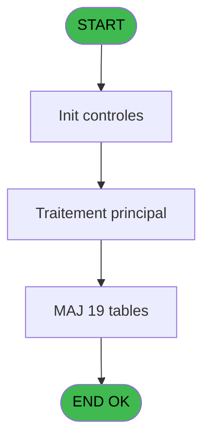

# FIN IDE 17 - Village permanent

> **Analyse**: Phases 1-4 2026-02-03 11:22 -> 11:23 (15s) | Assemblage 11:23
> **Pipeline**: V7.2 Enrichi
> **Structure**: 4 onglets (Resume | Ecrans | Donnees | Connexions)

<!-- TAB:Resume -->

## 1. FICHE D'IDENTITE

| Attribut | Valeur |
|----------|--------|
| Projet | FIN |
| IDE Position | 17 |
| Nom Programme | Village permanent |
| Fichier source | `Prg_17.xml` |
| Dossier IDE | General |
| Taches | 55 (0 ecrans visibles) |
| Tables modifiees | 19 |
| Programmes appeles | 1 |

## 2. DESCRIPTION FONCTIONNELLE

**Village permanent** assure la gestion complete de ce processus, accessible depuis [CF Fin de saison (IDE 6)](FIN-IDE-6.md).

Le flux de traitement s'organise en **2 blocs fonctionnels** :

- **Traitement** (52 taches) : traitements metier divers
- **Calcul** (3 taches) : calculs de montants, stocks ou compteurs

**Donnees modifiees** : 19 tables en ecriture (suivi_cloture, complement_pieces_de_caisse, detail_coffre, detail_coffre_devise, histo_detail_coffre, histo_detail_coffre_devise, ecarts, histo_ajustement_solde, mouvement_stock_histo, mouvement_stock_valeur, sessions_coffre2, histo_appro_remise, solde_compte_adherent, histo_fdr, suivi_pdc, tickets_tpe, vente, vente_gratuite, total_ventes_par_mop).

Detail : phases du traitement

#### Phase 1 : Traitement (52 taches)

- **17** - Village permanent
- **17.1** - 291
- **17.1.1** - Epuration
- **17.2** - 293
- **17.2.1** - Epuration
- **17.3** - 294
- **17.3.1** - Epuration
- **17.4** - 298
- **17.4.1** - Epuration
- **17.5** - 299
- **17.5.1** - Epuration
- **17.6** - 303
- **17.6.1** - Epuration
- **17.7** - 304
- **17.7.1** - Epuration
- **17.8** - 305
- **17.8.1** - Epuration
- **17.9** - 306
- **17.9.2** - Epuration
- **17.10** - 308
- **17.10.1** - Epuration
- **17.11** - 313
- **17.11.1** - Epuration
- **17.12** - 229
- **17.12.1** - Epuration
- **17.12.1.1** - ExisteUser
- **17.13** - 330
- **17.13.1** - Epuration
- **17.13.1.1** - ExisteUser
- **17.14** - 336
- **17.14.1** - Epuration
- **17.15** - 337
- **17.15.1** - Epuration
- **17.16** - 376
- **17.16.1** - Epuration
- **17.17** - 377
- **17.17.2** - Epuration
- **17.18** - 381
- **17.18.1** - Epuration
- **17.19** - 382
- **17.19.1** - Epuration
- **17.20** - 346
- **17.20.1** - Epuration
- **17.20.1.1** - ExisteUser
- **17.21** - 347
- **17.21.2** - Epuration
- **17.22** - 348
- **17.22.1** - Epuration
- **17.23** - 349
- **17.23.1** - Epuration
- **17.24** - 382
- **17.24.1** - Epuration

#### Phase 2 : Calcul (3 taches)

- **17.9.1** - Calcul chrono epuration
- **17.17.1** - Calcul chrono epuration
- **17.21.1** - Calcul date epuration

#### Tables impactees

| Table | Operations | Role metier |
|-------|-----------|-------------|
| histo_detail_coffre | **W** (2 usages) | Etat du coffre |
| mouvement_stock_valeur | **W** (2 usages) | Mouvements de prestation |
| sessions_coffre2 | **W** (2 usages) | Sessions de caisse |
| tickets_tpe | **W** (1 usages) |  |
| total_ventes_par_mop | **W** (1 usages) | Donnees de ventes |
| detail_coffre_devise | **W** (1 usages) | Etat du coffre |
| mouvement_stock_histo | **W** (1 usages) | Mouvements de prestation |
| suivi_cloture | **W** (1 usages) | Donnees reseau/cloture |
| vente | **W** (1 usages) | Donnees de ventes |
| histo_ajustement_solde | **W** (1 usages) | Historique / journal |
| histo_fdr | **W** (1 usages) | Historique / journal |
| vente_gratuite | **W** (1 usages) | Donnees de ventes |
| detail_coffre | **W** (1 usages) | Etat du coffre |
| ecarts | **W** (1 usages) |  |
| histo_appro_remise | **W** (1 usages) | Historique / journal |
| complement_pieces_de_caisse | **W** (1 usages) | Sessions de caisse |
| suivi_pdc | **W** (1 usages) |  |
| solde_compte_adherent | **W** (1 usages) | Comptes GM (generaux) |
| histo_detail_coffre_devise | **W** (1 usages) | Etat du coffre |

## 3. BLOCS FONCTIONNELS

### 3.1 Traitement (52 taches)

Traitements internes.

---

#### 17 - Village permanent

**Role** : Tache d'orchestration : point d'entree du programme (52 sous-taches). Coordonne l'enchainement des traitements.

51 sous-taches directes

| Tache | Nom | Bloc |
|-------|-----|------|
| [17.1](#t2) | 291 | Traitement |
| [17.1.1](#t4) | Epuration | Traitement |
| [17.2](#t5) | 293 | Traitement |
| [17.2.1](#t7) | Epuration | Traitement |
| [17.3](#t8) | 294 | Traitement |
| [17.3.1](#t10) | Epuration | Traitement |
| [17.4](#t11) | 298 | Traitement |
| [17.4.1](#t13) | Epuration | Traitement |
| [17.5](#t14) | 299 | Traitement |
| [17.5.1](#t16) | Epuration | Traitement |
| [17.6](#t17) | 303 | Traitement |
| [17.6.1](#t19) | Epuration | Traitement |
| [17.7](#t20) | 304 | Traitement |
| [17.7.1](#t22) | Epuration | Traitement |
| [17.8](#t23) | 305 | Traitement |
| [17.8.1](#t25) | Epuration | Traitement |
| [17.9](#t26) | 306 | Traitement |
| [17.9.2](#t28) | Epuration | Traitement |
| [17.10](#t29) | 308 | Traitement |
| [17.10.1](#t31) | Epuration | Traitement |
| [17.11](#t32) | 313 | Traitement |
| [17.11.1](#t34) | Epuration | Traitement |
| [17.12](#t35) | 229 | Traitement |
| [17.12.1](#t37) | Epuration | Traitement |
| [17.12.1.1](#t38) | ExisteUser | Traitement |
| [17.13](#t39) | 330 | Traitement |
| [17.13.1](#t41) | Epuration | Traitement |
| [17.13.1.1](#t42) | ExisteUser | Traitement |
| [17.14](#t43) | 336 | Traitement |
| [17.14.1](#t45) | Epuration | Traitement |
| [17.15](#t46) | 337 | Traitement |
| [17.15.1](#t48) | Epuration | Traitement |
| [17.16](#t49) | 376 | Traitement |
| [17.16.1](#t51) | Epuration | Traitement |
| [17.17](#t52) | 377 | Traitement |
| [17.17.2](#t54) | Epuration | Traitement |
| [17.18](#t55) | 381 | Traitement |
| [17.18.1](#t57) | Epuration | Traitement |
| [17.19](#t58) | 382 | Traitement |
| [17.19.1](#t60) | Epuration | Traitement |
| [17.20](#t61) | 346 | Traitement |
| [17.20.1](#t63) | Epuration | Traitement |
| [17.20.1.1](#t64) | ExisteUser | Traitement |
| [17.21](#t65) | 347 | Traitement |
| [17.21.2](#t67) | Epuration | Traitement |
| [17.22](#t68) | 348 | Traitement |
| [17.22.1](#t70) | Epuration | Traitement |
| [17.23](#t71) | 349 | Traitement |
| [17.23.1](#t73) | Epuration | Traitement |
| [17.24](#t79) | 382 | Traitement |
| [17.24.1](#t80) | Epuration | Traitement |

---

#### 17.1 - 291

**Role** : Traitement interne.

---

#### 17.1.1 - Epuration

**Role** : Traitement : Epuration.

---

#### 17.2 - 293

**Role** : Traitement interne.

---

#### 17.2.1 - Epuration

**Role** : Traitement : Epuration.

---

#### 17.3 - 294

**Role** : Traitement interne.

---

#### 17.3.1 - Epuration

**Role** : Traitement : Epuration.

---

#### 17.4 - 298

**Role** : Traitement interne.

---

#### 17.4.1 - Epuration

**Role** : Traitement : Epuration.

---

#### 17.5 - 299

**Role** : Traitement interne.

---

#### 17.5.1 - Epuration

**Role** : Traitement : Epuration.

---

#### 17.6 - 303

**Role** : Traitement interne.

---

#### 17.6.1 - Epuration

**Role** : Traitement : Epuration.

---

#### 17.7 - 304

**Role** : Traitement interne.

---

#### 17.7.1 - Epuration

**Role** : Traitement : Epuration.

---

#### 17.8 - 305

**Role** : Traitement interne.

---

#### 17.8.1 - Epuration

**Role** : Traitement : Epuration.

---

#### 17.9 - 306

**Role** : Traitement interne.

---

#### 17.9.2 - Epuration

**Role** : Traitement : Epuration.

---

#### 17.10 - 308

**Role** : Traitement interne.

---

#### 17.10.1 - Epuration

**Role** : Traitement : Epuration.

---

#### 17.11 - 313

**Role** : Traitement interne.

---

#### 17.11.1 - Epuration

**Role** : Traitement : Epuration.

---

#### 17.12 - 229

**Role** : Traitement interne.

---

#### 17.12.1 - Epuration

**Role** : Traitement : Epuration.

---

#### 17.12.1.1 - ExisteUser

**Role** : Traitement : ExisteUser.

---

#### 17.13 - 330

**Role** : Traitement interne.

---

#### 17.13.1 - Epuration

**Role** : Traitement : Epuration.

---

#### 17.13.1.1 - ExisteUser

**Role** : Traitement : ExisteUser.

---

#### 17.14 - 336

**Role** : Traitement interne.

---

#### 17.14.1 - Epuration

**Role** : Traitement : Epuration.

---

#### 17.15 - 337

**Role** : Traitement interne.

---

#### 17.15.1 - Epuration

**Role** : Traitement : Epuration.

---

#### 17.16 - 376

**Role** : Traitement interne.

---

#### 17.16.1 - Epuration

**Role** : Traitement : Epuration.

---

#### 17.17 - 377

**Role** : Traitement interne.

---

#### 17.17.2 - Epuration

**Role** : Traitement : Epuration.

---

#### 17.18 - 381

**Role** : Traitement interne.

---

#### 17.18.1 - Epuration

**Role** : Traitement : Epuration.

---

#### 17.19 - 382

**Role** : Traitement interne.

---

#### 17.19.1 - Epuration

**Role** : Traitement : Epuration.

---

#### 17.20 - 346

**Role** : Traitement interne.

---

#### 17.20.1 - Epuration

**Role** : Traitement : Epuration.

---

#### 17.20.1.1 - ExisteUser

**Role** : Traitement : ExisteUser.

---

#### 17.21 - 347

**Role** : Traitement interne.

---

#### 17.21.2 - Epuration

**Role** : Traitement : Epuration.

---

#### 17.22 - 348

**Role** : Traitement interne.

---

#### 17.22.1 - Epuration

**Role** : Traitement : Epuration.

---

#### 17.23 - 349

**Role** : Traitement interne.

---

#### 17.23.1 - Epuration

**Role** : Traitement : Epuration.

---

#### 17.24 - 382

**Role** : Traitement interne.

---

#### 17.24.1 - Epuration

**Role** : Traitement : Epuration.

### 3.2 Calcul (3 taches)

Calculs metier : montants, stocks, compteurs.

---

#### 17.9.1 - Calcul chrono epuration

**Role** : Calcul : Calcul chrono epuration.

---

#### 17.17.1 - Calcul chrono epuration

**Role** : Calcul : Calcul chrono epuration.

---

#### 17.21.1 - Calcul date epuration

**Role** : Calcul : Calcul date epuration.
**Variables liees** : B (Param Date Comptable)

## 5. REGLES METIER

*(Aucune regle metier identifiee)*

## 6. CONTEXTE

- **Appele par**: [CF Fin de saison (IDE 6)](FIN-IDE-6.md)
- **Appelle**: 1 programmes | **Tables**: 25 (W:19 R:2 L:5) | **Taches**: 55 | **Expressions**: 4

<!-- TAB:Ecrans -->

## 8. ECRANS

*(Programme sans ecran visible)*

## 9. NAVIGATION

### 9.3 Structure hierarchique (55 taches)

| Position | Tache | Type | Dimensions | Bloc |
|----------|-------|------|------------|------|
| **17.1** | [**Village permanent** (17)](#t1) | MDI | - | Traitement |
| 17.1.1 | [291 (17.1)](#t2) | MDI | - | |
| 17.1.2 | [Epuration (17.1.1)](#t4) | MDI | - | |
| 17.1.3 | [293 (17.2)](#t5) | MDI | - | |
| 17.1.4 | [Epuration (17.2.1)](#t7) | MDI | - | |
| 17.1.5 | [294 (17.3)](#t8) | MDI | - | |
| 17.1.6 | [Epuration (17.3.1)](#t10) | MDI | - | |
| 17.1.7 | [298 (17.4)](#t11) | MDI | - | |
| 17.1.8 | [Epuration (17.4.1)](#t13) | MDI | - | |
| 17.1.9 | [299 (17.5)](#t14) | MDI | - | |
| 17.1.10 | [Epuration (17.5.1)](#t16) | MDI | - | |
| 17.1.11 | [303 (17.6)](#t17) | MDI | - | |
| 17.1.12 | [Epuration (17.6.1)](#t19) | MDI | - | |
| 17.1.13 | [304 (17.7)](#t20) | MDI | - | |
| 17.1.14 | [Epuration (17.7.1)](#t22) | MDI | - | |
| 17.1.15 | [305 (17.8)](#t23) | MDI | - | |
| 17.1.16 | [Epuration (17.8.1)](#t25) | MDI | - | |
| 17.1.17 | [306 (17.9)](#t26) | MDI | - | |
| 17.1.18 | [Epuration (17.9.2)](#t28) | MDI | - | |
| 17.1.19 | [308 (17.10)](#t29) | MDI | - | |
| 17.1.20 | [Epuration (17.10.1)](#t31) | MDI | - | |
| 17.1.21 | [313 (17.11)](#t32) | MDI | - | |
| 17.1.22 | [Epuration (17.11.1)](#t34) | MDI | - | |
| 17.1.23 | [229 (17.12)](#t35) | MDI | - | |
| 17.1.24 | [Epuration (17.12.1)](#t37) | MDI | - | |
| 17.1.25 | [ExisteUser (17.12.1.1)](#t38) | MDI | - | |
| 17.1.26 | [330 (17.13)](#t39) | MDI | - | |
| 17.1.27 | [Epuration (17.13.1)](#t41) | MDI | - | |
| 17.1.28 | [ExisteUser (17.13.1.1)](#t42) | MDI | - | |
| 17.1.29 | [336 (17.14)](#t43) | MDI | - | |
| 17.1.30 | [Epuration (17.14.1)](#t45) | MDI | - | |
| 17.1.31 | [337 (17.15)](#t46) | MDI | - | |
| 17.1.32 | [Epuration (17.15.1)](#t48) | MDI | - | |
| 17.1.33 | [376 (17.16)](#t49) | MDI | - | |
| 17.1.34 | [Epuration (17.16.1)](#t51) | MDI | - | |
| 17.1.35 | [377 (17.17)](#t52) | MDI | - | |
| 17.1.36 | [Epuration (17.17.2)](#t54) | MDI | - | |
| 17.1.37 | [381 (17.18)](#t55) | MDI | - | |
| 17.1.38 | [Epuration (17.18.1)](#t57) | MDI | - | |
| 17.1.39 | [382 (17.19)](#t58) | MDI | - | |
| 17.1.40 | [Epuration (17.19.1)](#t60) | MDI | - | |
| 17.1.41 | [346 (17.20)](#t61) | MDI | - | |
| 17.1.42 | [Epuration (17.20.1)](#t63) | MDI | - | |
| 17.1.43 | [ExisteUser (17.20.1.1)](#t64) | MDI | - | |
| 17.1.44 | [347 (17.21)](#t65) | MDI | - | |
| 17.1.45 | [Epuration (17.21.2)](#t67) | MDI | - | |
| 17.1.46 | [348 (17.22)](#t68) | MDI | - | |
| 17.1.47 | [Epuration (17.22.1)](#t70) | MDI | - | |
| 17.1.48 | [349 (17.23)](#t71) | MDI | - | |
| 17.1.49 | [Epuration (17.23.1)](#t73) | MDI | - | |
| 17.1.50 | [382 (17.24)](#t79) | MDI | - | |
| 17.1.51 | [Epuration (17.24.1)](#t80) | MDI | - | |
| **17.2** | [**Calcul chrono epuration** (17.9.1)](#t27) | MDI | - | Calcul |
| 17.2.1 | [Calcul chrono epuration (17.17.1)](#t53) | MDI | - | |
| 17.2.2 | [Calcul date epuration (17.21.1)](#t66) | MDI | - | |

### 9.4 Algorigramme

> **Legende**: Vert = START/END OK | Rouge = END KO | Bleu = Decisions
> *Algorigramme auto-genere. Utiliser `/algorigramme` pour une synthese metier detaillee.*

<!-- TAB:Donnees -->

## 10. TABLES

### Tables utilisees (25)

| ID | Nom | Description | Type | R | W | L | Usages |
|----|-----|-------------|------|---|---|---|--------|
| 196 | gestion_article_session | Articles et stock | DB |   |   | L | 1 |
| 213 | suivi_cloture | Donnees reseau/cloture | DB |   | **W** |   | 1 |
| 224 | complement_pieces_de_caisse | Sessions de caisse | DB |   | **W** |   | 1 |
| 228 | detail_coffre | Etat du coffre | DB |   | **W** |   | 1 |
| 229 | detail_coffre_devise | Etat du coffre | DB |   | **W** |   | 1 |
| 230 | histo_detail_coffre | Etat du coffre | DB |   | **W** |   | 2 |
| 231 | histo_detail_coffre_devise | Etat du coffre | DB |   | **W** |   | 1 |
| 232 | gestion_devise_session | Sessions de caisse | DB |   |   | L | 1 |
| 234 | ecarts |  | DB |   | **W** |   | 1 |
| 235 | histo_ajustement_solde | Historique / journal | DB |   | **W** |   | 1 |
| 237 | mouvement_stock_histo | Mouvements de prestation | DB |   | **W** |   | 1 |
| 238 | mouvement_stock_valeur | Mouvements de prestation | DB |   | **W** |   | 2 |
| 241 | pointage_appro_remise |  | DB | R |   | L | 3 |
| 242 | pointage_article | Articles et stock | DB |   |   | L | 1 |
| 243 | pointage_devise | Devises / taux de change | DB |   |   | L | 1 |
| 248 | sessions_coffre2 | Sessions de caisse | DB |   | **W** |   | 2 |
| 252 | histo_appro_remise | Historique / journal | DB |   | **W** |   | 1 |
| 253 | solde_compte_adherent | Comptes GM (generaux) | DB |   | **W** |   | 1 |
| 254 | histo_fdr | Historique / journal | DB |   | **W** |   | 1 |
| 255 | suivi_pdc |  | DB |   | **W** |   | 1 |
| 260 | tickets_tpe |  | DB |   | **W** |   | 1 |
| 263 | vente | Donnees de ventes | DB |   | **W** |   | 1 |
| 264 | vente_gratuite | Donnees de ventes | DB |   | **W** |   | 1 |
| 265 | total_ventes_par_mop | Donnees de ventes | DB |   | **W** |   | 1 |
| 740 | pv_stock_movements | Articles et stock | DB | R |   |   | 6 |

### Colonnes par table (2 / 21 tables avec colonnes identifiees)

Table 213 - suivi_cloture (**W**) - 1 usages

*Table utilisee uniquement en Link ou aucune colonne Real identifiee dans le DataView.*

Table 224 - complement_pieces_de_caisse (**W**) - 1 usages

*Table utilisee uniquement en Link ou aucune colonne Real identifiee dans le DataView.*

Table 228 - detail_coffre (**W**) - 1 usages

*Table utilisee uniquement en Link ou aucune colonne Real identifiee dans le DataView.*

Table 229 - detail_coffre_devise (**W**) - 1 usages

*Table utilisee uniquement en Link ou aucune colonne Real identifiee dans le DataView.*

Table 230 - histo_detail_coffre (**W**) - 2 usages

*Table utilisee uniquement en Link ou aucune colonne Real identifiee dans le DataView.*

Table 231 - histo_detail_coffre_devise (**W**) - 1 usages

*Table utilisee uniquement en Link ou aucune colonne Real identifiee dans le DataView.*

Table 234 - ecarts (**W**) - 1 usages

*Table utilisee uniquement en Link ou aucune colonne Real identifiee dans le DataView.*

Table 235 - histo_ajustement_solde (**W**) - 1 usages

*Table utilisee uniquement en Link ou aucune colonne Real identifiee dans le DataView.*

Table 237 - mouvement_stock_histo (**W**) - 1 usages

*Table utilisee uniquement en Link ou aucune colonne Real identifiee dans le DataView.*

Table 238 - mouvement_stock_valeur (**W**) - 2 usages

*Table utilisee uniquement en Link ou aucune colonne Real identifiee dans le DataView.*

Table 241 - pointage_appro_remise (R/L) - 3 usages

*Table utilisee uniquement en Link ou aucune colonne Real identifiee dans le DataView.*

Table 248 - sessions_coffre2 (**W**) - 2 usages

*Table utilisee uniquement en Link ou aucune colonne Real identifiee dans le DataView.*

Table 252 - histo_appro_remise (**W**) - 1 usages

*Table utilisee uniquement en Link ou aucune colonne Real identifiee dans le DataView.*

Table 253 - solde_compte_adherent (**W**) - 1 usages

*Table utilisee uniquement en Link ou aucune colonne Real identifiee dans le DataView.*

Table 254 - histo_fdr (**W**) - 1 usages

*Table utilisee uniquement en Link ou aucune colonne Real identifiee dans le DataView.*

Table 255 - suivi_pdc (**W**) - 1 usages

*Table utilisee uniquement en Link ou aucune colonne Real identifiee dans le DataView.*

Table 260 - tickets_tpe (**W**) - 1 usages

*Table utilisee uniquement en Link ou aucune colonne Real identifiee dans le DataView.*

Table 263 - vente (**W**) - 1 usages

*Table utilisee uniquement en Link ou aucune colonne Real identifiee dans le DataView.*

Table 264 - vente_gratuite (**W**) - 1 usages

*Table utilisee uniquement en Link ou aucune colonne Real identifiee dans le DataView.*

Table 265 - total_ventes_par_mop (**W**) - 1 usages

*Table utilisee uniquement en Link ou aucune colonne Real identifiee dans le DataView.*

Table 740 - pv_stock_movements (R) - 6 usages

*Table utilisee uniquement en Link ou aucune colonne Real identifiee dans le DataView.*

## 11. VARIABLES

### 11.1 Autres (4)

Variables diverses.

| Lettre | Nom | Type | Usage dans |
|--------|-----|------|-----------|
| A | Param Societe | Alpha | - |
| B | Param Date Comptable | Date | [17.21.1](#t66) |
| C | confirmation | Numeric | - |
| D | Tests | Logical | - |

## 12. EXPRESSIONS

**4 / 4 expressions decodees (100%)**

### 12.1 Repartition par type

| Type | Expressions | Regles |
|------|-------------|--------|
| CALCULATION | 2 | 0 |
| CONDITION | 2 | 0 |

### 12.2 Expressions cles par type

#### CALCULATION (2 expressions)

| Type | IDE | Expression | Regle |
|------|-----|------------|-------|
| CALCULATION | 4 | `CallProg('{47,-1}'PROG,'caisse_vente_par_mop')` | - |
| CALCULATION | 3 | `{1,7}-30` | - |

#### CONDITION (2 expressions)

| Type | IDE | Expression | Regle |
|------|-----|------------|-------|
| CONDITION | 2 | `Trim(Translate('%club_test%'))='Y'` | - |
| CONDITION | 1 | `Param Date Comptable [B]=6` | - |

<!-- TAB:Connexions -->

## 13. GRAPHE D'APPELS

### 13.1 Chaine depuis Main (Callers)

Main -> ... -> [CF Fin de saison (IDE 6)](FIN-IDE-6.md) -> **Village permanent (IDE 17)**

### 13.2 Callers

| IDE | Nom Programme | Nb Appels |
|-----|---------------|-----------|
| [6](FIN-IDE-6.md) | CF Fin de saison | 1 |

### 13.3 Callees (programmes appeles)

### 13.4 Detail Callees avec contexte

| IDE | Nom Programme | Appels | Contexte |
|-----|---------------|--------|----------|
| [18](FIN-IDE-18.md) | Affiche nombre en test | 24 | Affichage donnees |

## 14. RECOMMANDATIONS MIGRATION

### 14.1 Profil du programme

| Metrique | Valeur | Impact migration |
|----------|--------|-----------------|
| Lignes de logique | 401 | Taille moyenne |
| Expressions | 4 | Peu de logique |
| Tables WRITE | 19 | Fort impact donnees |
| Sous-programmes | 1 | Peu de dependances |
| Ecrans visibles | 0 | Ecran unique ou traitement batch |
| Code desactive | 0% (0 / 401) | Code sain |
| Regles metier | 0 | Pas de regle identifiee |

### 14.2 Plan de migration par bloc

#### Traitement (52 taches: 0 ecran, 52 traitements)

- **Strategie** : 52 service(s) backend injectable(s) (Domain Services).
- 1 sous-programme(s) a migrer ou a reutiliser depuis les services existants.
- Decomposer les taches en services unitaires testables.

#### Calcul (3 taches: 0 ecran, 3 traitements)

- **Strategie** : Services de calcul purs (Domain Services).
- Migrer la logique de calcul (stock, compteurs, montants)

### 14.3 Dependances critiques

| Dependance | Type | Appels | Impact |
|------------|------|--------|--------|
| suivi_cloture | Table WRITE (Database) | 1x | Schema + repository |
| complement_pieces_de_caisse | Table WRITE (Database) | 1x | Schema + repository |
| detail_coffre | Table WRITE (Database) | 1x | Schema + repository |
| detail_coffre_devise | Table WRITE (Database) | 1x | Schema + repository |
| histo_detail_coffre | Table WRITE (Database) | 2x | Schema + repository |
| histo_detail_coffre_devise | Table WRITE (Database) | 1x | Schema + repository |
| ecarts | Table WRITE (Database) | 1x | Schema + repository |
| histo_ajustement_solde | Table WRITE (Database) | 1x | Schema + repository |
| mouvement_stock_histo | Table WRITE (Database) | 1x | Schema + repository |
| mouvement_stock_valeur | Table WRITE (Database) | 2x | Schema + repository |
| sessions_coffre2 | Table WRITE (Database) | 2x | Schema + repository |
| histo_appro_remise | Table WRITE (Database) | 1x | Schema + repository |
| solde_compte_adherent | Table WRITE (Database) | 1x | Schema + repository |
| histo_fdr | Table WRITE (Database) | 1x | Schema + repository |
| suivi_pdc | Table WRITE (Database) | 1x | Schema + repository |
| tickets_tpe | Table WRITE (Database) | 1x | Schema + repository |
| vente | Table WRITE (Database) | 1x | Schema + repository |
| vente_gratuite | Table WRITE (Database) | 1x | Schema + repository |
| total_ventes_par_mop | Table WRITE (Database) | 1x | Schema + repository |
| [Affiche nombre en test (IDE 18)](FIN-IDE-18.md) | Sous-programme | 24x | **CRITIQUE** - Affichage donnees |

---
*Spec DETAILED generee par Pipeline V7.2 - 2026-02-03 11:23*
