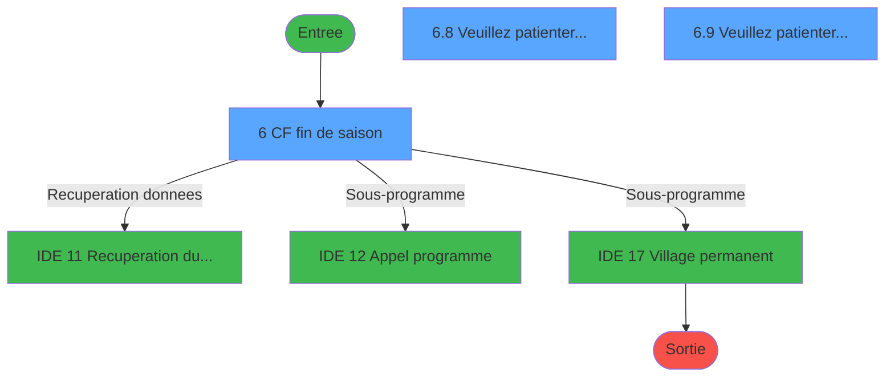
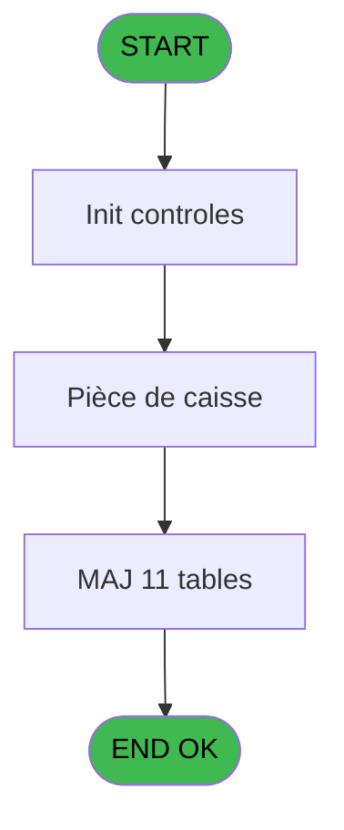
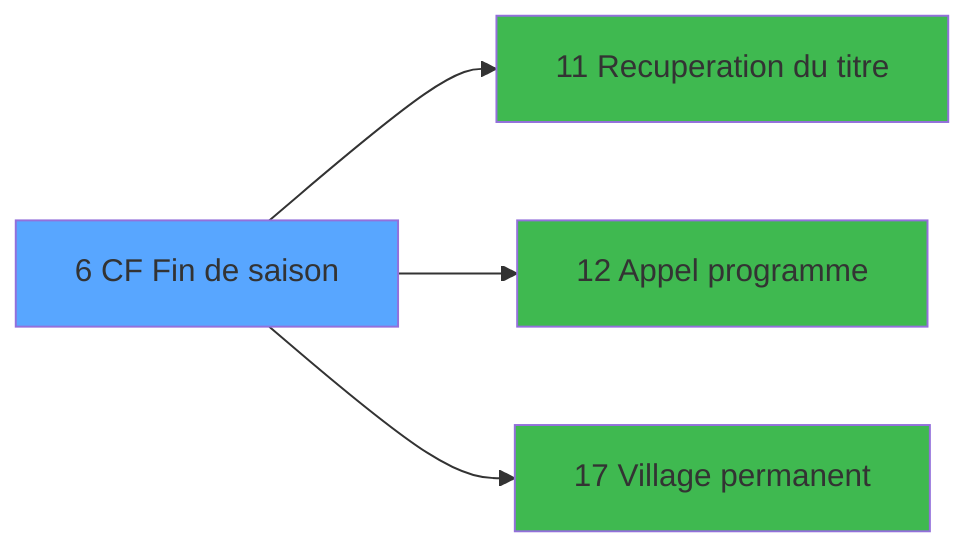

# FIN IDE 6 - CF Fin de saison

> **Analyse**: Phases 1-4 2026-02-03 11:19 -> 11:19 (14s) | Assemblage 11:19
> **Pipeline**: V7.2 Enrichi
> **Structure**: 4 onglets (Resume | Ecrans | Donnees | Connexions)

<!-- TAB:Resume -->

## 1. FICHE D'IDENTITE

| Attribut | Valeur |
|----------|--------|
| Projet | FIN |
| IDE Position | 6 |
| Nom Programme | CF Fin de saison |
| Fichier source | `Prg_6.xml` |
| Dossier IDE | General |
| Taches | 25 (3 ecrans visibles) |
| Tables modifiees | 11 |
| Programmes appeles | 3 |

## 2. DESCRIPTION FONCTIONNELLE

**CF Fin de saison** assure la gestion complete de ce processus, accessible depuis [Main Program (IDE 1)](FIN-IDE-1.md).

Le flux de traitement s'organise en **2 blocs fonctionnels** :

- **Traitement** (22 taches) : traitements metier divers
- **Calcul** (3 taches) : calculs de montants, stocks ou compteurs

**Donnees modifiees** : 11 tables en ecriture (reseau_cloture___rec, comptable________cte, change___________chg, change_exterieur_che, pieces_caisse____pks, solde_caisse_____sks, sorties_devises__sdk, lign_sortie_dev__ldk, compteurs________cpt, change_vente_____chg, frais_change___fchg).

Detail : phases du traitement

#### Phase 1 : Traitement (22 taches)

- **6** - CF fin de saison **[[ECRAN]](#ecran-t1)**
- **6.1** - Station eteinte erreur v1
- **6.2** - Test cloture en cours
- **6.2.1** - Blocage cloture v1
- **6.3** - (sans nom) **[[ECRAN]](#ecran-t5)**
- **6.7** - Lecture paramètres PAR
- **6.8** - Veuillez patienter... **[[ECRAN]](#ecran-t11)**
- **6.8.1** - Solde caisse
- **6.8.2** - Effacement enreg solde caisse
- **6.8.3** - MAJ enreg solde caisse
- **6.8.4** - Suppr. PKS de la societe.
- **6.9** - Veuillez patienter... **[[ECRAN]](#ecran-t16)**
- **6.9.1** - Suppr. change pour la societe
- **6.9.2** - Suppr. change pour la societe
- **6.9.3** - Suppr. change pour la societe
- **6.9.4** - Suppr. change pour la societe
- **6.9.5** - Suppr. change pour la societe
- **6.9.6** - Suppr. change pour la societe
- **6.10** - Deblocage cloture v1
- **6.11** - Station eteinte erreur v1
- **6.2.2** - Blocage cloture v1
- **6.12** - Deblocage cloture v1

Delegue a : [Recuperation du titre (IDE 11)](FIN-IDE-11.md), [Appel programme (IDE 12)](FIN-IDE-12.md), [Village permanent (IDE 17)](FIN-IDE-17.md)

#### Phase 2 : Calcul (3 taches)

- **6.4** - Lecture date comptable
- **6.5** - Lecture date comptable
- **6.6** - Lecture date comptable

#### Tables impactees

| Table | Operations | Role metier |
|-------|-----------|-------------|
| reseau_cloture___rec | R/**W** (7 usages) | Donnees reseau/cloture |
| solde_caisse_____sks | **W** (3 usages) | Sessions de caisse |
| compteurs________cpt | **W** (2 usages) | Comptes GM (generaux) |
| comptable________cte | **W** (1 usages) |  |
| frais_change___fchg | **W** (1 usages) |  |
| pieces_caisse____pks | **W** (1 usages) | Sessions de caisse |
| change_vente_____chg | **W** (1 usages) | Donnees de ventes |
| change___________chg | **W** (1 usages) |  |
| lign_sortie_dev__ldk | **W** (1 usages) |  |
| change_exterieur_che | **W** (1 usages) |  |
| sorties_devises__sdk | **W** (1 usages) | Devises / taux de change |

## 3. BLOCS FONCTIONNELS

### 3.1 Traitement (22 taches)

Traitements internes.

---

#### 6 - CF fin de saison [[ECRAN]](#ecran-t1)

**Role** : Tache d'orchestration : point d'entree du programme (22 sous-taches). Coordonne l'enchainement des traitements.
**Ecran** : 875 x 161 DLU (MDI) | [Voir mockup](#ecran-t1)

21 sous-taches directes

| Tache | Nom | Bloc |
|-------|-----|------|
| [6.1](#t2) | Station eteinte erreur v1 | Traitement |
| [6.2](#t3) | Test cloture en cours | Traitement |
| [6.2.1](#t4) | Blocage cloture v1 | Traitement |
| [6.3](#t5) | (sans nom) **[[ECRAN]](#ecran-t5)** | Traitement |
| [6.7](#t9) | Lecture paramètres PAR | Traitement |
| [6.8](#t11) | Veuillez patienter... **[[ECRAN]](#ecran-t11)** | Traitement |
| [6.8.1](#t12) | Solde caisse | Traitement |
| [6.8.2](#t13) | Effacement enreg solde caisse | Traitement |
| [6.8.3](#t14) | MAJ enreg solde caisse | Traitement |
| [6.8.4](#t15) | Suppr. PKS de la societe. | Traitement |
| [6.9](#t16) | Veuillez patienter... **[[ECRAN]](#ecran-t16)** | Traitement |
| [6.9.1](#t17) | Suppr. change pour la societe | Traitement |
| [6.9.2](#t18) | Suppr. change pour la societe | Traitement |
| [6.9.3](#t19) | Suppr. change pour la societe | Traitement |
| [6.9.4](#t20) | Suppr. change pour la societe | Traitement |
| [6.9.5](#t21) | Suppr. change pour la societe | Traitement |
| [6.9.6](#t22) | Suppr. change pour la societe | Traitement |
| [6.10](#t23) | Deblocage cloture v1 | Traitement |
| [6.11](#t26) | Station eteinte erreur v1 | Traitement |
| [6.2.2](#t29) | Blocage cloture v1 | Traitement |
| [6.12](#t32) | Deblocage cloture v1 | Traitement |

---

#### 6.1 - Station eteinte erreur v1

**Role** : Traitement : Station eteinte erreur v1.

---

#### 6.2 - Test cloture en cours

**Role** : Verification : Test cloture en cours.

---

#### 6.2.1 - Blocage cloture v1

**Role** : Traitement : Blocage cloture v1.

---

#### 6.3 - (sans nom) [[ECRAN]](#ecran-t5)

**Role** : Traitement interne.
**Ecran** : 296 x 88 DLU (MDI) | [Voir mockup](#ecran-t5)

---

#### 6.7 - Lecture paramètres PAR

**Role** : Traitement : Lecture paramètres PAR.

---

#### 6.8 - Veuillez patienter... [[ECRAN]](#ecran-t11)

**Role** : Traitement : Veuillez patienter....
**Ecran** : 422 x 56 DLU (MDI) | [Voir mockup](#ecran-t11)

---

#### 6.8.1 - Solde caisse

**Role** : Consultation/chargement : Solde caisse.

---

#### 6.8.2 - Effacement enreg solde caisse

**Role** : Consultation/chargement : Effacement enreg solde caisse.

---

#### 6.8.3 - MAJ enreg solde caisse

**Role** : Consultation/chargement : MAJ enreg solde caisse.

---

#### 6.8.4 - Suppr. PKS de la societe.

**Role** : Traitement : Suppr. PKS de la societe..

---

#### 6.9 - Veuillez patienter... [[ECRAN]](#ecran-t16)

**Role** : Traitement : Veuillez patienter....
**Ecran** : 422 x 56 DLU (MDI) | [Voir mockup](#ecran-t16)

---

#### 6.9.1 - Suppr. change pour la societe

**Role** : Traitement : Suppr. change pour la societe.
**Variables liees** : A (P0 societe)

---

#### 6.9.2 - Suppr. change pour la societe

**Role** : Traitement : Suppr. change pour la societe.
**Variables liees** : A (P0 societe)

---

#### 6.9.3 - Suppr. change pour la societe

**Role** : Traitement : Suppr. change pour la societe.
**Variables liees** : A (P0 societe)

---

#### 6.9.4 - Suppr. change pour la societe

**Role** : Traitement : Suppr. change pour la societe.
**Variables liees** : A (P0 societe)

---

#### 6.9.5 - Suppr. change pour la societe

**Role** : Traitement : Suppr. change pour la societe.
**Variables liees** : A (P0 societe)

---

#### 6.9.6 - Suppr. change pour la societe

**Role** : Traitement : Suppr. change pour la societe.
**Variables liees** : A (P0 societe)

---

#### 6.10 - Deblocage cloture v1

**Role** : Traitement : Deblocage cloture v1.

---

#### 6.11 - Station eteinte erreur v1

**Role** : Traitement : Station eteinte erreur v1.

---

#### 6.2.2 - Blocage cloture v1

**Role** : Traitement : Blocage cloture v1.

---

#### 6.12 - Deblocage cloture v1

**Role** : Traitement : Deblocage cloture v1.

### 3.2 Calcul (3 taches)

Calculs metier : montants, stocks, compteurs.

---

#### 6.4 - Lecture date comptable

**Role** : Traitement : Lecture date comptable.
**Variables liees** : B (W0 date comptable), F (W0 ecriture comptable ?)

---

#### 6.5 - Lecture date comptable

**Role** : Traitement : Lecture date comptable.
**Variables liees** : B (W0 date comptable), F (W0 ecriture comptable ?)

---

#### 6.6 - Lecture date comptable

**Role** : Traitement : Lecture date comptable.
**Variables liees** : B (W0 date comptable), F (W0 ecriture comptable ?)

## 5. REGLES METIER

*(Aucune regle metier identifiee)*

## 6. CONTEXTE

- **Appele par**: [Main Program (IDE 1)](FIN-IDE-1.md)
- **Appelle**: 3 programmes | **Tables**: 14 (W:11 R:4 L:0) | **Taches**: 25 | **Expressions**: 17

<!-- TAB:Ecrans -->

## 8. ECRANS

### 8.1 Forms visibles (3 / 25)

| # | Position | Tache | Nom | Type | Largeur | Hauteur | Bloc |
|---|----------|-------|-----|------|---------|---------|------|
| 1 | 6 | 6 | CF fin de saison | MDI | 875 | 161 | Traitement |
| 2 | 6.9 | 6.8 | Veuillez patienter... | MDI | 422 | 56 | Traitement |
| 3 | 6.10 | 6.9 | Veuillez patienter... | MDI | 422 | 56 | Traitement |

### 8.2 Mockups Ecrans

---

#### 6 - CF fin de saison
**Tache** : [6](#t1) | **Type** : MDI | **Dimensions** : 875 x 161 DLU
**Bloc** : Traitement | **Titre IDE** : CF fin de saison

<!-- FORM-DATA:
{
    "width":  875,
    "vFactor":  8,
    "type":  "MDI",
    "hFactor":  8,
    "controls":  [
                     {
                         "x":  0,
                         "type":  "label",
                         "var":  "",
                         "y":  0,
                         "w":  869,
                         "fmt":  "",
                         "name":  "",
                         "h":  23,
                         "color":  "",
                         "text":  "",
                         "parent":  null
                     },
                     {
                         "x":  38,
                         "type":  "label",
                         "var":  "",
                         "y":  30,
                         "w":  796,
                         "fmt":  "",
                         "name":  "",
                         "h":  99,
                         "color":  "",
                         "text":  "",
                         "parent":  null
                     },
                     {
                         "x":  239,
                         "type":  "label",
                         "var":  "",
                         "y":  39,
                         "w":  577,
                         "fmt":  "",
                         "name":  "",
                         "h":  80,
                         "color":  "",
                         "text":  "",
                         "parent":  5
                     },
                     {
                         "x":  275,
                         "type":  "label",
                         "var":  "",
                         "y":  51,
                         "w":  519,
                         "fmt":  "",
                         "name":  "",
                         "h":  47,
                         "color":  "6",
                         "text":  "",
                         "parent":  7
                     },
                     {
                         "x":  278,
                         "type":  "label",
                         "var":  "",
                         "y":  51,
                         "w":  37,
                         "fmt":  "",
                         "name":  "",
                         "h":  46,
                         "color":  "",
                         "text":  "",
                         "parent":  7
                     },
                     {
                         "x":  315,
                         "type":  "label",
                         "var":  "",
                         "y":  52,
                         "w":  215,
                         "fmt":  "",
                         "name":  "",
                         "h":  46,
                         "color":  "6",
                         "text":  "",
                         "parent":  5
                     },
                     {
                         "x":  331,
                         "type":  "label",
                         "var":  "",
                         "y":  56,
                         "w":  191,
                         "fmt":  "",
                         "name":  "",
                         "h":  8,
                         "color":  "146",
                         "text":  "Pièce de caisse",
                         "parent":  7
                     },
                     {
                         "x":  331,
                         "type":  "label",
                         "var":  "",
                         "y":  69,
                         "w":  165,
                         "fmt":  "",
                         "name":  "",
                         "h":  8,
                         "color":  "146",
                         "text":  "Change",
                         "parent":  7
                     },
                     {
                         "x":  331,
                         "type":  "label",
                         "var":  "",
                         "y":  83,
                         "w":  453,
                         "fmt":  "",
                         "name":  "",
                         "h":  8,
                         "color":  "146",
                         "text":  "Purge Caisse pour Villages Permanents",
                         "parent":  7
                     },
                     {
                         "x":  437,
                         "type":  "label",
                         "var":  "",
                         "y":  104,
                         "w":  120,
                         "fmt":  "",
                         "name":  "",
                         "h":  10,
                         "color":  "",
                         "text":  "Votre choix",
                         "parent":  7
                     },
                     {
                         "x":  0,
                         "type":  "label",
                         "var":  "",
                         "y":  135,
                         "w":  869,
                         "fmt":  "",
                         "name":  "",
                         "h":  23,
                         "color":  "",
                         "text":  "",
                         "parent":  null
                     },
                     {
                         "x":  570,
                         "type":  "edit",
                         "var":  "",
                         "y":  104,
                         "w":  26,
                         "fmt":  "",
                         "name":  "",
                         "h":  10,
                         "color":  "6",
                         "text":  "",
                         "parent":  7
                     },
                     {
                         "x":  66,
                         "type":  "edit",
                         "var":  "",
                         "y":  6,
                         "w":  267,
                         "fmt":  "20",
                         "name":  "",
                         "h":  8,
                         "color":  "",
                         "text":  "",
                         "parent":  null
                     },
                     {
                         "x":  607,
                         "type":  "edit",
                         "var":  "",
                         "y":  6,
                         "w":  245,
                         "fmt":  "WWW DD MMM YYYYT",
                         "name":  "",
                         "h":  8,
                         "color":  "",
                         "text":  "",
                         "parent":  null
                     },
                     {
                         "x":  57,
                         "type":  "image",
                         "var":  "",
                         "y":  51,
                         "w":  160,
                         "fmt":  "",
                         "name":  "",
                         "h":  57,
                         "color":  "",
                         "text":  "",
                         "parent":  5
                     },
                     {
                         "x":  285,
                         "type":  "button",
                         "var":  "",
                         "y":  55,
                         "w":  26,
                         "fmt":  "1",
                         "name":  "1",
                         "h":  9,
                         "color":  "",
                         "text":  "",
                         "parent":  9
                     },
                     {
                         "x":  285,
                         "type":  "button",
                         "var":  "",
                         "y":  68,
                         "w":  26,
                         "fmt":  "2",
                         "name":  "2",
                         "h":  9,
                         "color":  "",
                         "text":  "",
                         "parent":  9
                     },
                     {
                         "x":  285,
                         "type":  "button",
                         "var":  "",
                         "y":  82,
                         "w":  26,
                         "fmt":  "3",
                         "name":  "3",
                         "h":  9,
                         "color":  "",
                         "text":  "",
                         "parent":  9
                     },
                     {
                         "x":  8,
                         "type":  "button",
                         "var":  "",
                         "y":  138,
                         "w":  168,
                         "fmt":  "\u0026Quitter",
                         "name":  "",
                         "h":  18,
                         "color":  "",
                         "text":  "",
                         "parent":  null
                     },
                     {
                         "x":  2,
                         "type":  "image",
                         "var":  "",
                         "y":  1,
                         "w":  59,
                         "fmt":  "",
                         "name":  "",
                         "h":  17,
                         "color":  "",
                         "text":  "",
                         "parent":  null
                     }
                 ],
    "taskId":  "6",
    "height":  161
}
-->

<strong>Champs : 3 champs</strong>

| Pos (x,y) | Nom | Variable | Type |
|-----------|-----|----------|------|
| 570,104 | (sans nom) | - | edit |
| 66,6 | 20 | - | edit |
| 607,6 | WWW DD MMM YYYYT | - | edit |

<strong>Boutons : 4 boutons</strong>

| Bouton | Pos (x,y) | Action |
|--------|-----------|--------|
| 1 | 285,55 | Bouton fonctionnel |
| 2 | 285,68 | Bouton fonctionnel |
| 3 | 285,82 | Bouton fonctionnel |
| Quitter | 8,138 | Quitte le programme |

---

#### 6.9 - Veuillez patienter...
**Tache** : [6.8](#t11) | **Type** : MDI | **Dimensions** : 422 x 56 DLU
**Bloc** : Traitement | **Titre IDE** : Veuillez patienter...

<!-- FORM-DATA:
{
    "width":  422,
    "vFactor":  8,
    "type":  "MDI",
    "hFactor":  8,
    "controls":  [
                     {
                         "x":  0,
                         "type":  "label",
                         "var":  "",
                         "y":  0,
                         "w":  423,
                         "fmt":  "",
                         "name":  "",
                         "h":  29,
                         "color":  "",
                         "text":  "",
                         "parent":  null
                     },
                     {
                         "x":  120,
                         "type":  "label",
                         "var":  "",
                         "y":  10,
                         "w":  221,
                         "fmt":  "",
                         "name":  "",
                         "h":  8,
                         "color":  "7",
                         "text":  "Traitement en cours...",
                         "parent":  null
                     },
                     {
                         "x":  0,
                         "type":  "label",
                         "var":  "",
                         "y":  29,
                         "w":  423,
                         "fmt":  "",
                         "name":  "",
                         "h":  27,
                         "color":  "",
                         "text":  "",
                         "parent":  null
                     },
                     {
                         "x":  72,
                         "type":  "label",
                         "var":  "",
                         "y":  38,
                         "w":  280,
                         "fmt":  "",
                         "name":  "",
                         "h":  8,
                         "color":  "",
                         "text":  "Pièce de caisse",
                         "parent":  null
                     },
                     {
                         "x":  4,
                         "type":  "image",
                         "var":  "",
                         "y":  2,
                         "w":  72,
                         "fmt":  "",
                         "name":  "",
                         "h":  25,
                         "color":  "",
                         "text":  "",
                         "parent":  null
                     }
                 ],
    "taskId":  "6.9",
    "height":  56
}
-->

---

#### 6.10 - Veuillez patienter...
**Tache** : [6.9](#t16) | **Type** : MDI | **Dimensions** : 422 x 56 DLU
**Bloc** : Traitement | **Titre IDE** : Veuillez patienter...

<!-- FORM-DATA:
{
    "width":  422,
    "vFactor":  8,
    "type":  "MDI",
    "hFactor":  8,
    "controls":  [
                     {
                         "x":  0,
                         "type":  "label",
                         "var":  "",
                         "y":  0,
                         "w":  423,
                         "fmt":  "",
                         "name":  "",
                         "h":  29,
                         "color":  "",
                         "text":  "",
                         "parent":  null
                     },
                     {
                         "x":  120,
                         "type":  "label",
                         "var":  "",
                         "y":  10,
                         "w":  221,
                         "fmt":  "",
                         "name":  "",
                         "h":  8,
                         "color":  "7",
                         "text":  "Traitement en cours...",
                         "parent":  null
                     },
                     {
                         "x":  0,
                         "type":  "label",
                         "var":  "",
                         "y":  29,
                         "w":  423,
                         "fmt":  "",
                         "name":  "",
                         "h":  27,
                         "color":  "",
                         "text":  "",
                         "parent":  null
                     },
                     {
                         "x":  72,
                         "type":  "label",
                         "var":  "",
                         "y":  38,
                         "w":  280,
                         "fmt":  "",
                         "name":  "",
                         "h":  8,
                         "color":  "",
                         "text":  "Change",
                         "parent":  null
                     },
                     {
                         "x":  4,
                         "type":  "image",
                         "var":  "",
                         "y":  2,
                         "w":  72,
                         "fmt":  "",
                         "name":  "",
                         "h":  25,
                         "color":  "",
                         "text":  "",
                         "parent":  null
                     }
                 ],
    "taskId":  "6.10",
    "height":  56
}
-->

## 9. NAVIGATION

### 9.1 Enchainement des ecrans

**Detail par enchainement :**

| Depuis | Action | Vers | Retour |
|--------|--------|------|--------|
| CF fin de saison | Recuperation donnees | [Recuperation du titre (IDE 11)](FIN-IDE-11.md) | Retour ecran |
| CF fin de saison | Sous-programme | [Appel programme (IDE 12)](FIN-IDE-12.md) | Retour ecran |
| CF fin de saison | Sous-programme | [Village permanent (IDE 17)](FIN-IDE-17.md) | Retour ecran |

### 9.3 Structure hierarchique (25 taches)

| Position | Tache | Type | Dimensions | Bloc |
|----------|-------|------|------------|------|
| **6.1** | [**CF fin de saison** (6)](#t1) [mockup](#ecran-t1) | MDI | 875x161 | Traitement |
| 6.1.1 | [Station eteinte erreur v1 (6.1)](#t2) | MDI | - | |
| 6.1.2 | [Test cloture en cours (6.2)](#t3) | MDI | - | |
| 6.1.3 | [Blocage cloture v1 (6.2.1)](#t4) | MDI | - | |
| 6.1.4 | [(sans nom) (6.3)](#t5) [mockup](#ecran-t5) | MDI | 296x88 | |
| 6.1.5 | [Lecture paramètres PAR (6.7)](#t9) | MDI | - | |
| 6.1.6 | [Veuillez patienter... (6.8)](#t11) [mockup](#ecran-t11) | MDI | 422x56 | |
| 6.1.7 | [Solde caisse (6.8.1)](#t12) | MDI | - | |
| 6.1.8 | [Effacement enreg solde caisse (6.8.2)](#t13) | MDI | - | |
| 6.1.9 | [MAJ enreg solde caisse (6.8.3)](#t14) | MDI | - | |
| 6.1.10 | [Suppr. PKS de la societe. (6.8.4)](#t15) | MDI | - | |
| 6.1.11 | [Veuillez patienter... (6.9)](#t16) [mockup](#ecran-t16) | MDI | 422x56 | |
| 6.1.12 | [Suppr. change pour la societe (6.9.1)](#t17) | MDI | - | |
| 6.1.13 | [Suppr. change pour la societe (6.9.2)](#t18) | MDI | - | |
| 6.1.14 | [Suppr. change pour la societe (6.9.3)](#t19) | MDI | - | |
| 6.1.15 | [Suppr. change pour la societe (6.9.4)](#t20) | MDI | - | |
| 6.1.16 | [Suppr. change pour la societe (6.9.5)](#t21) | MDI | - | |
| 6.1.17 | [Suppr. change pour la societe (6.9.6)](#t22) | MDI | - | |
| 6.1.18 | [Deblocage cloture v1 (6.10)](#t23) | MDI | - | |
| 6.1.19 | [Station eteinte erreur v1 (6.11)](#t26) | MDI | - | |
| 6.1.20 | [Blocage cloture v1 (6.2.2)](#t29) | MDI | - | |
| 6.1.21 | [Deblocage cloture v1 (6.12)](#t32) | MDI | - | |
| **6.2** | [**Lecture date comptable** (6.4)](#t6) | MDI | - | Calcul |
| 6.2.1 | [Lecture date comptable (6.5)](#t7) | MDI | - | |
| 6.2.2 | [Lecture date comptable (6.6)](#t8) | MDI | - | |

### 9.4 Algorigramme

> **Legende**: Vert = START/END OK | Rouge = END KO | Bleu = Decisions
> *Algorigramme auto-genere. Utiliser `/algorigramme` pour une synthese metier detaillee.*

<!-- TAB:Donnees -->

## 10. TABLES

### Tables utilisees (14)

| ID | Nom | Description | Type | R | W | L | Usages |
|----|-----|-------------|------|---|---|---|--------|
| 23 | reseau_cloture___rec | Donnees reseau/cloture | DB | R | **W** |   | 7 |
| 40 | comptable________cte |  | DB |   | **W** |   | 1 |
| 44 | change___________chg |  | DB |   | **W** |   | 1 |
| 45 | change_exterieur_che |  | DB |   | **W** |   | 1 |
| 54 | pieces_caisse____pks | Sessions de caisse | DB |   | **W** |   | 1 |
| 55 | solde_caisse_____sks | Sessions de caisse | DB |   | **W** |   | 3 |
| 58 | sorties_devises__sdk | Devises / taux de change | DB |   | **W** |   | 1 |
| 59 | lign_sortie_dev__ldk |  | DB |   | **W** |   | 1 |
| 63 | parametres___par |  | DB | R |   |   | 1 |
| 68 | compteurs________cpt | Comptes GM (generaux) | DB |   | **W** |   | 2 |
| 70 | date_comptable___dat |  | DB | R |   |   | 1 |
| 122 | unilateral_bilateral |  | DB | R |   |   | 1 |
| 147 | change_vente_____chg | Donnees de ventes | DB |   | **W** |   | 1 |
| 324 | frais_change___fchg |  | DB |   | **W** |   | 1 |

### Colonnes par table (7 / 14 tables avec colonnes identifiees)

Table 23 - reseau_cloture___rec (R/**W**) - 7 usages

| Lettre | Variable | Acces | Type |
|--------|----------|-------|------|
| A | W1 cloture en cours | W | Logical |

Table 40 - comptable________cte (**W**) - 1 usages

| Lettre | Variable | Acces | Type |
|--------|----------|-------|------|
| B | W0 date comptable | W | Date |
| F | W0 ecriture comptable ? | W | Logical |

Table 44 - change___________chg (**W**) - 1 usages

*Table utilisee uniquement en Link ou aucune colonne Real identifiee dans le DataView.*

Table 45 - change_exterieur_che (**W**) - 1 usages

*Table utilisee uniquement en Link ou aucune colonne Real identifiee dans le DataView.*

Table 54 - pieces_caisse____pks (**W**) - 1 usages

| Lettre | Variable | Acces | Type |
|--------|----------|-------|------|
| E | W1 solde caisse | W | Numeric |

Table 55 - solde_caisse_____sks (**W**) - 3 usages

| Lettre | Variable | Acces | Type |
|--------|----------|-------|------|
| A | W1 date solde | W | Date |
| E | W1 solde caisse | W | Numeric |

Table 58 - sorties_devises__sdk (**W**) - 1 usages

*Table utilisee uniquement en Link ou aucune colonne Real identifiee dans le DataView.*

Table 59 - lign_sortie_dev__ldk (**W**) - 1 usages

*Table utilisee uniquement en Link ou aucune colonne Real identifiee dans le DataView.*

Table 63 - parametres___par (R) - 1 usages

*Table utilisee uniquement en Link ou aucune colonne Real identifiee dans le DataView.*

Table 68 - compteurs________cpt (**W**) - 2 usages

| Lettre | Variable | Acces | Type |
|--------|----------|-------|------|
| A | W1 date solde | W | Date |
| B | W1 cumul piece caiss | W | Numeric |
| C | W1 cumul versement | W | Numeric |
| D | W1 cumul retrait | W | Numeric |
| E | W1 solde caisse | W | Numeric |
| F | W1 resultat compta | W | Numeric |
| G | W1 cumul res saison | W | Numeric |

Table 70 - date_comptable___dat (R) - 1 usages

| Lettre | Variable | Acces | Type |
|--------|----------|-------|------|
| A | W1 date solde | R | Date |
| B | W0 date comptable | R | Date |
| F | W0 ecriture comptable ? | R | Logical |

Table 122 - unilateral_bilateral (R) - 1 usages

| Lettre | Variable | Acces | Type |
|--------|----------|-------|------|
| E | W0 uni/bilateral | R | Alpha |

Table 147 - change_vente_____chg (**W**) - 1 usages

*Table utilisee uniquement en Link ou aucune colonne Real identifiee dans le DataView.*

Table 324 - frais_change___fchg (**W**) - 1 usages

*Table utilisee uniquement en Link ou aucune colonne Real identifiee dans le DataView.*

## 11. VARIABLES

### 11.1 Parametres entrants (1)

Variables recues du programme appelant ([Main Program (IDE 1)](FIN-IDE-1.md)).

| Lettre | Nom | Type | Usage dans |
|--------|-----|------|-----------|
| A | P0 societe | Alpha | - |

### 11.2 Variables de travail (7)

Variables internes au programme.

| Lettre | Nom | Type | Usage dans |
|--------|-----|------|-----------|
| B | W0 date comptable | Date | - |
| C | W0 choix action | Alpha | 3x calcul interne |
| D | W0 utilisation caiss | Alpha | [6.8.1](#t12), [6.8.2](#t13), [6.8.3](#t14) |
| E | W0 uni/bilateral | Alpha | - |
| F | W0 ecriture comptable ? | Logical | [6.4](#t6), [6.5](#t7), [6.6](#t8) |
| G | W0 fin tache | Alpha | 3x calcul interne |
| H | W0 titre | Alpha | 1x calcul interne |

## 12. EXPRESSIONS

**17 / 17 expressions decodees (100%)**

### 12.1 Repartition par type

| Type | Expressions | Regles |
|------|-------------|--------|
| CONSTANTE | 4 | 0 |
| DATE | 1 | 0 |
| REFERENCE_VG | 2 | 0 |
| CONDITION | 7 | 0 |
| OTHER | 1 | 0 |
| NEGATION | 1 | 0 |
| STRING | 1 | 0 |

### 12.2 Expressions cles par type

#### CONSTANTE (4 expressions)

| Type | IDE | Expression | Regle |
|------|-----|------------|-------|
| CONSTANTE | 6 | `'C'` | - |
| CONSTANTE | 13 | `'F'` | - |
| CONSTANTE | 2 | `1` | - |
| CONSTANTE | 5 | `''` | - |

#### DATE (1 expressions)

| Type | IDE | Expression | Regle |
|------|-----|------------|-------|
| DATE | 3 | `Date ()` | - |

#### REFERENCE_VG (2 expressions)

| Type | IDE | Expression | Regle |
|------|-----|------------|-------|
| REFERENCE_VG | 17 | `VG5` | - |
| REFERENCE_VG | 4 | `VG2` | - |

#### CONDITION (7 expressions)

| Type | IDE | Expression | Regle |
|------|-----|------------|-------|
| CONDITION | 11 | `W0 utilisation caiss [D]<>'O'` | - |
| CONDITION | 14 | `W0 fin tache [G]<>'F'` | - |
| CONDITION | 15 | `W0 fin tache [G]='F'` | - |
| CONDITION | 10 | `W0 fin tache [G]=''` | - |
| CONDITION | 7 | `W0 choix action [C]='1' AND W0 utilisation caiss [D]='O'` | - |
| ... | | *+2 autres* | |

#### OTHER (1 expressions)

| Type | IDE | Expression | Regle |
|------|-----|------------|-------|
| OTHER | 12 | `W0 ecriture comptable ? [F]` | - |

#### NEGATION (1 expressions)

| Type | IDE | Expression | Regle |
|------|-----|------------|-------|
| NEGATION | 16 | `NOT VG5` | - |

#### STRING (1 expressions)

| Type | IDE | Expression | Regle |
|------|-----|------------|-------|
| STRING | 1 | `Trim (W0 titre [H])` | - |

<!-- TAB:Connexions -->

## 13. GRAPHE D'APPELS

### 13.1 Chaine depuis Main (Callers)

Main -> ... -> [Main Program (IDE 1)](FIN-IDE-1.md) -> **CF Fin de saison (IDE 6)**

### 13.2 Callers

| IDE | Nom Programme | Nb Appels |
|-----|---------------|-----------|
| [1](FIN-IDE-1.md) | Main Program | 1 |

### 13.3 Callees (programmes appeles)

### 13.4 Detail Callees avec contexte

| IDE | Nom Programme | Appels | Contexte |
|-----|---------------|--------|----------|
| [11](FIN-IDE-11.md) | Recuperation du titre | 1 | Recuperation donnees |
| [12](FIN-IDE-12.md) | Appel programme | 1 | Sous-programme |
| [17](FIN-IDE-17.md) | Village permanent | 1 | Sous-programme |

## 14. RECOMMANDATIONS MIGRATION

### 14.1 Profil du programme

| Metrique | Valeur | Impact migration |
|----------|--------|-----------------|
| Lignes de logique | 204 | Taille moyenne |
| Expressions | 17 | Peu de logique |
| Tables WRITE | 11 | Fort impact donnees |
| Sous-programmes | 3 | Peu de dependances |
| Ecrans visibles | 3 | Quelques ecrans |
| Code desactive | 0% (0 / 204) | Code sain |
| Regles metier | 0 | Pas de regle identifiee |

### 14.2 Plan de migration par bloc

#### Traitement (22 taches: 4 ecrans, 18 traitements)

- **Strategie** : Orchestrateur avec 4 ecrans (Razor/React) et 18 traitements backend (services).
- Les ecrans deviennent des composants UI, les traitements invisibles deviennent des services injectables.
- 3 sous-programme(s) a migrer ou a reutiliser depuis les services existants.
- Decomposer les taches en services unitaires testables.

#### Calcul (3 taches: 0 ecran, 3 traitements)

- **Strategie** : Services de calcul purs (Domain Services).
- Migrer la logique de calcul (stock, compteurs, montants)

### 14.3 Dependances critiques

| Dependance | Type | Appels | Impact |
|------------|------|--------|--------|
| reseau_cloture___rec | Table WRITE (Database) | 6x | Schema + repository |
| comptable________cte | Table WRITE (Database) | 1x | Schema + repository |
| change___________chg | Table WRITE (Database) | 1x | Schema + repository |
| change_exterieur_che | Table WRITE (Database) | 1x | Schema + repository |
| pieces_caisse____pks | Table WRITE (Database) | 1x | Schema + repository |
| solde_caisse_____sks | Table WRITE (Database) | 3x | Schema + repository |
| sorties_devises__sdk | Table WRITE (Database) | 1x | Schema + repository |
| lign_sortie_dev__ldk | Table WRITE (Database) | 1x | Schema + repository |
| compteurs________cpt | Table WRITE (Database) | 2x | Schema + repository |
| change_vente_____chg | Table WRITE (Database) | 1x | Schema + repository |
| frais_change___fchg | Table WRITE (Database) | 1x | Schema + repository |
| [Village permanent (IDE 17)](FIN-IDE-17.md) | Sous-programme | 1x | Normale - Sous-programme |
| [Appel programme (IDE 12)](FIN-IDE-12.md) | Sous-programme | 1x | Normale - Sous-programme |
| [Recuperation du titre (IDE 11)](FIN-IDE-11.md) | Sous-programme | 1x | Normale - Recuperation donnees |

---
*Spec DETAILED generee par Pipeline V7.2 - 2026-02-03 11:19*
