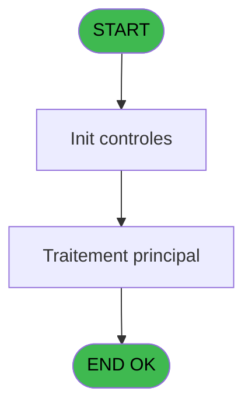
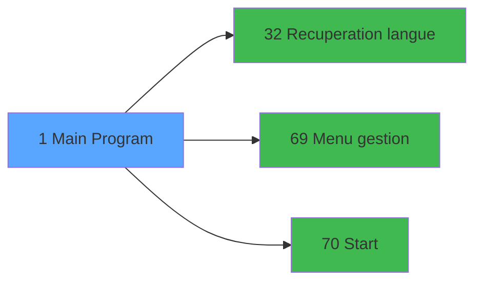

# GES IDE 1 - Main Program

> **Analyse**: Phases 1-4 2026-02-03 11:23 -> 11:23 (13s) | Assemblage 11:23
> **Pipeline**: V7.2 Enrichi
> **Structure**: 4 onglets (Resume | Ecrans | Donnees | Connexions)

<!-- TAB:Resume -->

## 1. FICHE D'IDENTITE

| Attribut | Valeur |
|----------|--------|
| Projet | GES |
| IDE Position | 1 |
| Nom Programme | Main Program |
| Fichier source | `Prg_1.xml` |
| Dossier IDE | General |
| Taches | 1 (1 ecrans visibles) |
| Tables modifiees | 0 |
| Programmes appeles | 3 |
| :warning: Statut | **ORPHELIN_POTENTIEL** |

## 2. DESCRIPTION FONCTIONNELLE

**Main Program** assure la gestion complete de ce processus.

Le flux de traitement s'organise en **1 blocs fonctionnels** :

- **Traitement** (1 tache) : traitements metier divers

## 3. BLOCS FONCTIONNELS

### 3.1 Traitement (1 tache)

Traitements internes.

---

#### 1 - Caisse Gestion [[ECRAN]](#ecran-t1)

**Role** : Gestion du moyen de paiement : Caisse Gestion.
**Ecran** : 320 x 200 DLU (Type11) | [Voir mockup](#ecran-t1)
**Variables liees** : BL (VG.Gestion Garantie API CM)
**Delegue a** : [Recuperation langue (IDE 32)](GES-IDE-32.md), [Menu gestion (IDE 69)](GES-IDE-69.md), [Start (IDE 70)](GES-IDE-70.md)

## 5. REGLES METIER

*(Aucune regle metier identifiee)*

## 6. CONTEXTE

- **Appele par**: (aucun)
- **Appelle**: 3 programmes | **Tables**: 0 (W:0 R:0 L:0) | **Taches**: 1 | **Expressions**: 30

<!-- TAB:Ecrans -->

## 8. ECRANS

### 8.1 Forms visibles (1 / 1)

| # | Position | Tache | Nom | Type | Largeur | Hauteur | Bloc |
|---|----------|-------|-----|------|---------|---------|------|
| 1 | 1 | 1 | Caisse Gestion | Type11 | 320 | 200 | Traitement |

### 8.2 Mockups Ecrans

## 9. NAVIGATION

Ecran unique: **Caisse Gestion**

### 9.3 Structure hierarchique (1 tache)

| Position | Tache | Type | Dimensions | Bloc |
|----------|-------|------|------------|------|
| **1.1** | [**Caisse Gestion** (1)](#t1) [mockup](#ecran-t1) | Type11 | 320x200 | Traitement |

### 9.4 Algorigramme

> **Legende**: Vert = START/END OK | Rouge = END KO | Bleu = Decisions
> *Algorigramme auto-genere. Utiliser `/algorigramme` pour une synthese metier detaillee.*

<!-- TAB:Donnees -->

## 10. TABLES

### Tables utilisees (0)

| ID | Nom | Description | Type | R | W | L | Usages |
|----|-----|-------------|------|---|---|---|--------|

### Colonnes par table (0 / 0 tables avec colonnes identifiees)

## 11. VARIABLES

### 11.1 Variables globales (39)

Variables globales partagees entre programmes.

| Lettre | Nom | Type | Usage dans |
|--------|-----|------|-----------|
| A | VG.LOGIN | Unicode | 1x variable globale |
| B | VG.USER | Unicode | - |
| C | VG.LOGIN I.T. | Logical | - |
| D | VG.PVE LOT 2 ACTIF ? | Logical | - |
| E | VG.VRL ACTIF ? | Logical | - |
| F | VG.COMPTE CASH ACTIF ? | Logical | - |
| G | VG.TABLEAU REMPLISSAGE ACTIF ? | Logical | - |
| H | VG.CALCUL EFFECTIF ACTIF ? | Logical | - |
| I | VG.INTERFACES VOD ACTIF ? | Logical | - |
| J | VG.VERSION | Alpha | - |
| K | VG.DATE VERSION | Alpha | - |
| L | VG.ACTIVATION CREDIT CONSO ACTI | Logical | - |
| M | VG.SEPARATEUR | Alpha | - |
| N | VG.MASQUE MONTANT | Alpha | - |
| O | VG.FACTURE TVA 1.00 ACTIF ? | Logical | - |
| P | VG.PVE LOT 3 ACTIF ? | Logical | - |
| Q | VG.TPE ACTIF ? | Logical | - |
| R | VG.NB LIEU SEJOUR | Numeric | - |
| S | VG.FACTURE TVA 3.00 ACTIF ? | Logical | - |
| T | VG PME (Porte-Monnaie Electr.) | Logical | - |
| U | VG.Services v1.00 ACTIF ? | Logical | - |
| V | VG.Gift Pass Manuel Actif | Logical | - |
| W | VG.Calendrier operationnel | Logical | - |
| X | VG.Libellés Commerciaux V2.00 | Logical | - |
| Y | VG.Gift Pass | Logical | - |
| Z | VG.Entete V1.00 | Logical | - |
| BA | VG.Garanties Club Auto | Logical | - |
| BB | VG.Export Automatique Assurance | Logical | - |
| BC | VG.HOSTNAME AU LIEU DE TERM | Logical | - |
| BD | VG.N° PSEUDO TERMINAL | Numeric | - |
| BE | VG Réception en mobilité V1.00 | Logical | - |
| BF | VG Validation paiement ITOv2 | Logical | - |
| BG | VG TRA v2 | Logical | - |
| BH | VG.VAE/Biking | Logical | - |
| BI | VG Affichage GM sans nom | Logical | - |
| BJ | VG.Verif PLBS par PES | Logical | - |
| BK | VG.Reçu vente Japon | Logical | - |
| BL | VG.Gestion Garantie API CM | Logical | - |
| BM | VG. Plusieurs responsable gesti | Logical | - |

Toutes les 39 variables (liste complete)

| Cat | Lettre | Nom Variable | Type |
|-----|--------|--------------|------|
| VG | **A** | VG.LOGIN | Unicode |
| VG | **B** | VG.USER | Unicode |
| VG | **C** | VG.LOGIN I.T. | Logical |
| VG | **D** | VG.PVE LOT 2 ACTIF ? | Logical |
| VG | **E** | VG.VRL ACTIF ? | Logical |
| VG | **F** | VG.COMPTE CASH ACTIF ? | Logical |
| VG | **G** | VG.TABLEAU REMPLISSAGE ACTIF ? | Logical |
| VG | **H** | VG.CALCUL EFFECTIF ACTIF ? | Logical |
| VG | **I** | VG.INTERFACES VOD ACTIF ? | Logical |
| VG | **J** | VG.VERSION | Alpha |
| VG | **K** | VG.DATE VERSION | Alpha |
| VG | **L** | VG.ACTIVATION CREDIT CONSO ACTI | Logical |
| VG | **M** | VG.SEPARATEUR | Alpha |
| VG | **N** | VG.MASQUE MONTANT | Alpha |
| VG | **O** | VG.FACTURE TVA 1.00 ACTIF ? | Logical |
| VG | **P** | VG.PVE LOT 3 ACTIF ? | Logical |
| VG | **Q** | VG.TPE ACTIF ? | Logical |
| VG | **R** | VG.NB LIEU SEJOUR | Numeric |
| VG | **S** | VG.FACTURE TVA 3.00 ACTIF ? | Logical |
| VG | **T** | VG PME (Porte-Monnaie Electr.) | Logical |
| VG | **U** | VG.Services v1.00 ACTIF ? | Logical |
| VG | **V** | VG.Gift Pass Manuel Actif | Logical |
| VG | **W** | VG.Calendrier operationnel | Logical |
| VG | **X** | VG.Libellés Commerciaux V2.00 | Logical |
| VG | **Y** | VG.Gift Pass | Logical |
| VG | **Z** | VG.Entete V1.00 | Logical |
| VG | **BA** | VG.Garanties Club Auto | Logical |
| VG | **BB** | VG.Export Automatique Assurance | Logical |
| VG | **BC** | VG.HOSTNAME AU LIEU DE TERM | Logical |
| VG | **BD** | VG.N° PSEUDO TERMINAL | Numeric |
| VG | **BE** | VG Réception en mobilité V1.00 | Logical |
| VG | **BF** | VG Validation paiement ITOv2 | Logical |
| VG | **BG** | VG TRA v2 | Logical |
| VG | **BH** | VG.VAE/Biking | Logical |
| VG | **BI** | VG Affichage GM sans nom | Logical |
| VG | **BJ** | VG.Verif PLBS par PES | Logical |
| VG | **BK** | VG.Reçu vente Japon | Logical |
| VG | **BL** | VG.Gestion Garantie API CM | Logical |
| VG | **BM** | VG. Plusieurs responsable gesti | Logical |

## 12. EXPRESSIONS

**30 / 30 expressions decodees (100%)**

### 12.1 Repartition par type

| Type | Expressions | Regles |
|------|-------------|--------|
| CONCATENATION | 1 | 0 |
| CONSTANTE | 21 | 0 |
| CONDITION | 1 | 0 |
| CAST_LOGIQUE | 2 | 0 |
| OTHER | 4 | 0 |
| NEGATION | 1 | 0 |

### 12.2 Expressions cles par type

#### CONCATENATION (1 expressions)

| Type | IDE | Expression | Regle |
|------|-----|------------|-------|
| CONCATENATION | 9 | `'Caisse Gestion - V '&ExpCalc('12'EXP)&' - '&ExpCalc('13'EXP)` | - |

#### CONSTANTE (21 expressions)

| Type | IDE | Expression | Regle |
|------|-----|------------|-------|
| CONSTANTE | 19 | `'RMO'` | - |
| CONSTANTE | 20 | `'ITO'` | - |
| CONSTANTE | 18 | `'T2H'` | - |
| CONSTANTE | 16 | `'GCA'` | - |
| CONSTANTE | 17 | `'EAA'` | - |
| ... | | *+16 autres* | |

#### CONDITION (1 expressions)

| Type | IDE | Expression | Regle |
|------|-----|------------|-------|
| CONDITION | 1 | `RunMode()<=2` | - |

#### CAST_LOGIQUE (2 expressions)

| Type | IDE | Expression | Regle |
|------|-----|------------|-------|
| CAST_LOGIQUE | 29 | `'TRUE'LOG` | - |
| CAST_LOGIQUE | 2 | `CallProg(ProgIdx('hasRight','TRUE'LOG),VG.LOGIN [A],'ACCESALL')` | - |

#### OTHER (4 expressions)

| Type | IDE | Expression | Regle |
|------|-----|------------|-------|
| OTHER | 26 | `[AI]` | - |
| OTHER | 27 | `GetPseudoTerminal ()` | - |
| OTHER | 10 | `Translate('%club_excel_separator%')` | - |
| OTHER | 24 | `Term ()` | - |

#### NEGATION (1 expressions)

| Type | IDE | Expression | Regle |
|------|-----|------------|-------|
| NEGATION | 25 | `NOT [AI]` | - |

### 12.3 Toutes les expressions (30)

Voir les 30 expressions

#### CONCATENATION (1)

| IDE | Expression Decodee |
|-----|-------------------|
| 9 | `'Caisse Gestion - V '&ExpCalc('12'EXP)&' - '&ExpCalc('13'EXP)` |

#### CONSTANTE (21)

| IDE | Expression Decodee |
|-----|-------------------|
| 3 | `'1.00'` |
| 4 | `'2.00'` |
| 5 | `'3.00'` |
| 6 | `'CG'` |
| 7 | `'3.72'` |
| 8 | `'14/11/2025'` |
| 11 | `'FTV'` |
| 12 | `'TPE'` |
| 13 | `'PME'` |
| 14 | `'GPM'` |
| 15 | `'HEA'` |
| 16 | `'GCA'` |
| 17 | `'EAA'` |
| 18 | `'T2H'` |
| 19 | `'RMO'` |
| 20 | `'ITO'` |
| 21 | `'JSR'` |
| 22 | `'TRA'` |
| 23 | `'VAE'` |
| 28 | `'GAC'` |
| 30 | `'RFI'` |

#### CONDITION (1)

| IDE | Expression Decodee |
|-----|-------------------|
| 1 | `RunMode()<=2` |

#### CAST_LOGIQUE (2)

| IDE | Expression Decodee |
|-----|-------------------|
| 2 | `CallProg(ProgIdx('hasRight','TRUE'LOG),VG.LOGIN [A],'ACCESALL')` |
| 29 | `'TRUE'LOG` |

#### OTHER (4)

| IDE | Expression Decodee |
|-----|-------------------|
| 10 | `Translate('%club_excel_separator%')` |
| 24 | `Term ()` |
| 26 | `[AI]` |
| 27 | `GetPseudoTerminal ()` |

#### NEGATION (1)

| IDE | Expression Decodee |
|-----|-------------------|
| 25 | `NOT [AI]` |

<!-- TAB:Connexions -->

## 13. GRAPHE D'APPELS

### 13.1 Chaine depuis Main (Callers)

**Chemin**: (pas de callers directs)

### 13.2 Callers

| IDE | Nom Programme | Nb Appels |
|-----|---------------|-----------|
| - | (aucun) | - |

### 13.3 Callees (programmes appeles)

### 13.4 Detail Callees avec contexte

| IDE | Nom Programme | Appels | Contexte |
|-----|---------------|--------|----------|
| [32](GES-IDE-32.md) | Recuperation langue | 1 | Recuperation donnees |
| [69](GES-IDE-69.md) | Menu gestion | 1 | Gestion moyens paiement |
| [70](GES-IDE-70.md) | Start | 1 | Sous-programme |

## 14. RECOMMANDATIONS MIGRATION

### 14.1 Profil du programme

| Metrique | Valeur | Impact migration |
|----------|--------|-----------------|
| Lignes de logique | 116 | Programme compact |
| Expressions | 30 | Peu de logique |
| Tables WRITE | 0 | Impact faible |
| Sous-programmes | 3 | Peu de dependances |
| Ecrans visibles | 1 | Ecran unique ou traitement batch |
| Code desactive | 2.6% (3 / 116) | Code sain |
| Regles metier | 0 | Pas de regle identifiee |

### 14.2 Plan de migration par bloc

#### Traitement (1 tache: 1 ecran, 0 traitement)

- **Strategie** : 1 composant(s) UI (Razor/React) avec formulaires et validation.
- 3 sous-programme(s) a migrer ou a reutiliser depuis les services existants.
- Decomposer les taches en services unitaires testables.

### 14.3 Dependances critiques

| Dependance | Type | Appels | Impact |
|------------|------|--------|--------|
| [Start (IDE 70)](GES-IDE-70.md) | Sous-programme | 1x | Normale - Sous-programme |
| [Menu gestion (IDE 69)](GES-IDE-69.md) | Sous-programme | 1x | Normale - Gestion moyens paiement |
| [Recuperation langue (IDE 32)](GES-IDE-32.md) | Sous-programme | 1x | Normale - Recuperation donnees |

---
*Spec DETAILED generee par Pipeline V7.2 - 2026-02-03 11:23*
