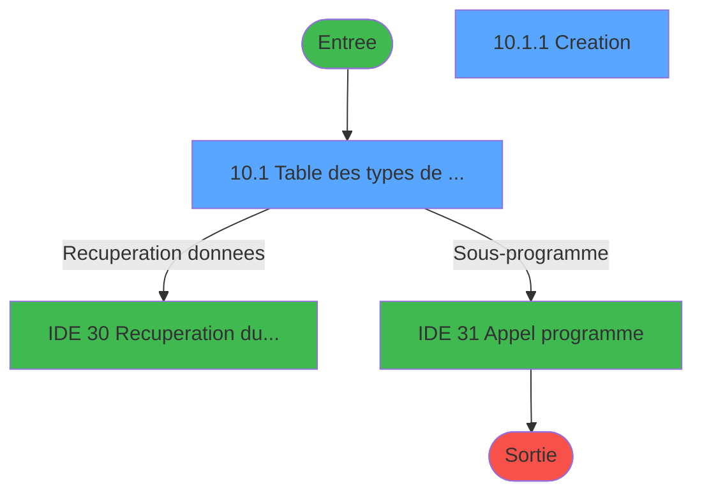
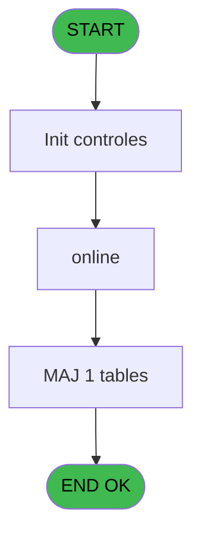
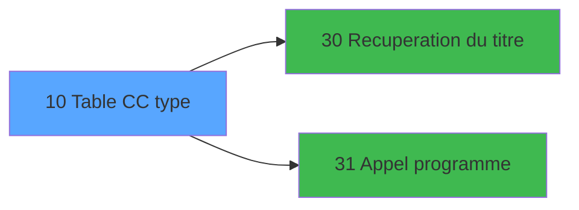

# GES IDE 10 - Table CC type

> **Analyse**: Phases 1-4 2026-02-03 11:26 -> 11:27 (15s) | Assemblage 11:27
> **Pipeline**: V7.2 Enrichi
> **Structure**: 4 onglets (Resume | Ecrans | Donnees | Connexions)

<!-- TAB:Resume -->

## 1. FICHE D'IDENTITE

| Attribut | Valeur |
|----------|--------|
| Projet | GES |
| IDE Position | 10 |
| Nom Programme | Table CC type |
| Fichier source | `Prg_10.xml` |
| Dossier IDE | Bar |
| Taches | 3 (2 ecrans visibles) |
| Tables modifiees | 1 |
| Programmes appeles | 2 |

## 2. DESCRIPTION FONCTIONNELLE

**Table CC type** assure la gestion complete de ce processus, accessible depuis [MENU  Club Med Pass (IDE 5)](GES-IDE-5.md).

Le flux de traitement s'organise en **2 blocs fonctionnels** :

- **Traitement** (2 taches) : traitements metier divers
- **Creation** (1 tache) : insertion d'enregistrements en base (mouvements, prestations)

**Donnees modifiees** : 1 tables en ecriture (cc_type).

Detail : phases du traitement

#### Phase 1 : Traitement (2 taches)

- **10** - Table CC type **[[ECRAN]](#ecran-t1)**
- **10.1** - Table des types de credit cons **[[ECRAN]](#ecran-t2)**

Delegue a : [Recuperation du titre (IDE 30)](GES-IDE-30.md), [Appel programme (IDE 31)](GES-IDE-31.md)

#### Phase 2 : Creation (1 tache)

- **10.1.1** - Creation **[[ECRAN]](#ecran-t3)**

#### Tables impactees

| Table | Operations | Role metier |
|-------|-----------|-------------|
| cc_type | **W** (2 usages) |  |

## 3. BLOCS FONCTIONNELS

### 3.1 Traitement (2 taches)

Traitements internes.

---

#### 10 - Table CC type [[ECRAN]](#ecran-t1)

**Role** : Traitement : Table CC type.
**Ecran** : 126 x 85 DLU (MDI) | [Voir mockup](#ecran-t1)
**Delegue a** : [Recuperation du titre (IDE 30)](GES-IDE-30.md), [Appel programme (IDE 31)](GES-IDE-31.md)

---

#### 10.1 - Table des types de credit cons [[ECRAN]](#ecran-t2)

**Role** : Calcul fidelite/avantage : Table des types de credit cons.
**Ecran** : 825 x 254 DLU (MDI) | [Voir mockup](#ecran-t2)
**Variables liees** : F (V.Code credit rech)
**Delegue a** : [Recuperation du titre (IDE 30)](GES-IDE-30.md), [Appel programme (IDE 31)](GES-IDE-31.md)

### 3.2 Creation (1 tache)

Insertion de nouveaux enregistrements en base.

---

#### 10.1.1 - Creation [[ECRAN]](#ecran-t3)

**Role** : Creation d'enregistrement : Creation.
**Ecran** : 398 x 83 DLU (MDI) | [Voir mockup](#ecran-t3)
**Variables liees** : E (v.creation effectuée)

## 5. REGLES METIER

*(Aucune regle metier identifiee)*

## 6. CONTEXTE

- **Appele par**: [MENU  Club Med Pass (IDE 5)](GES-IDE-5.md)
- **Appelle**: 2 programmes | **Tables**: 1 (W:1 R:0 L:0) | **Taches**: 3 | **Expressions**: 6

<!-- TAB:Ecrans -->

## 8. ECRANS

### 8.1 Forms visibles (2 / 3)

| # | Position | Tache | Nom | Type | Largeur | Hauteur | Bloc |
|---|----------|-------|-----|------|---------|---------|------|
| 1 | 10.1 | 10.1 | Table des types de credit cons | MDI | 825 | 254 | Traitement |
| 2 | 10.1.1 | 10.1.1 | Creation | MDI | 398 | 83 | Creation |

### 8.2 Mockups Ecrans

---

#### 10.1 - Table des types de credit cons
**Tache** : [10.1](#t2) | **Type** : MDI | **Dimensions** : 825 x 254 DLU
**Bloc** : Traitement | **Titre IDE** : Table des types de credit cons

<!-- FORM-DATA:
{
    "width":  825,
    "vFactor":  8,
    "type":  "MDI",
    "hFactor":  8,
    "controls":  [
                     {
                         "x":  2,
                         "type":  "label",
                         "var":  "",
                         "y":  1,
                         "w":  814,
                         "fmt":  "",
                         "name":  "",
                         "h":  19,
                         "color":  "",
                         "text":  "",
                         "parent":  null
                     },
                     {
                         "x":  46,
                         "type":  "label",
                         "var":  "",
                         "y":  28,
                         "w":  733,
                         "fmt":  "",
                         "name":  "",
                         "h":  194,
                         "color":  "",
                         "text":  "",
                         "parent":  null
                     },
                     {
                         "x":  60,
                         "type":  "table",
                         "var":  "",
                         "name":  "",
                         "titleH":  12,
                         "color":  "110",
                         "w":  706,
                         "y":  34,
                         "fmt":  "",
                         "parent":  null,
                         "text":  "",
                         "rowH":  16,
                         "h":  79,
                         "cols":  [
                                      {
                                          "title":  "Code crédit",
                                          "layer":  1,
                                          "w":  106
                                      },
                                      {
                                          "title":  "Libellé",
                                          "layer":  2,
                                          "w":  181
                                      },
                                      {
                                          "title":  "GM",
                                          "layer":  3,
                                          "w":  122
                                      },
                                      {
                                          "title":  "GO",
                                          "layer":  4,
                                          "w":  122
                                      },
                                      {
                                          "title":  "Ventilation",
                                          "layer":  5,
                                          "w":  139
                                      }
                                  ],
                         "rows":  5
                     },
                     {
                         "x":  64,
                         "type":  "label",
                         "var":  "",
                         "y":  116,
                         "w":  697,
                         "fmt":  "",
                         "name":  "",
                         "h":  10,
                         "color":  "143",
                         "text":  "Le code indique la priorité lors de d\u0027une recherche de crédit de conso !!!",
                         "parent":  4
                     },
                     {
                         "x":  50,
                         "type":  "label",
                         "var":  "",
                         "y":  130,
                         "w":  727,
                         "fmt":  "",
                         "name":  "",
                         "h":  91,
                         "color":  "",
                         "text":  "",
                         "parent":  null
                     },
                     {
                         "x":  454,
                         "type":  "label",
                         "var":  "",
                         "y":  137,
                         "w":  290,
                         "fmt":  "",
                         "name":  "",
                         "h":  77,
                         "color":  "",
                         "text":  "",
                         "parent":  null
                     },
                     {
                         "x":  457,
                         "type":  "label",
                         "var":  "",
                         "y":  138,
                         "w":  284,
                         "fmt":  "",
                         "name":  "",
                         "h":  75,
                         "color":  "",
                         "text":  "",
                         "parent":  null
                     },
                     {
                         "x":  487,
                         "type":  "label",
                         "var":  "",
                         "y":  147,
                         "w":  222,
                         "fmt":  "",
                         "name":  "",
                         "h":  46,
                         "color":  "",
                         "text":  "",
                         "parent":  null
                     },
                     {
                         "x":  490,
                         "type":  "label",
                         "var":  "",
                         "y":  148,
                         "w":  37,
                         "fmt":  "",
                         "name":  "",
                         "h":  44,
                         "color":  "",
                         "text":  "",
                         "parent":  null
                     },
                     {
                         "x":  541,
                         "type":  "label",
                         "var":  "",
                         "y":  152,
                         "w":  131,
                         "fmt":  "",
                         "name":  "",
                         "h":  9,
                         "color":  "7",
                         "text":  "Modification",
                         "parent":  null
                     },
                     {
                         "x":  541,
                         "type":  "label",
                         "var":  "",
                         "y":  164,
                         "w":  131,
                         "fmt":  "",
                         "name":  "",
                         "h":  9,
                         "color":  "7",
                         "text":  "Création",
                         "parent":  null
                     },
                     {
                         "x":  541,
                         "type":  "label",
                         "var":  "",
                         "y":  176,
                         "w":  131,
                         "fmt":  "",
                         "name":  "",
                         "h":  9,
                         "color":  "7",
                         "text":  "Suppression",
                         "parent":  null
                     },
                     {
                         "x":  513,
                         "type":  "label",
                         "var":  "",
                         "y":  198,
                         "w":  120,
                         "fmt":  "",
                         "name":  "",
                         "h":  9,
                         "color":  "",
                         "text":  "Votre choix",
                         "parent":  null
                     },
                     {
                         "x":  4,
                         "type":  "label",
                         "var":  "",
                         "y":  228,
                         "w":  816,
                         "fmt":  "",
                         "name":  "",
                         "h":  24,
                         "color":  "",
                         "text":  "",
                         "parent":  null
                     },
                     {
                         "x":  635,
                         "type":  "edit",
                         "var":  "",
                         "y":  197,
                         "w":  26,
                         "fmt":  "",
                         "name":  "V0 choix select",
                         "h":  10,
                         "color":  "6",
                         "text":  "",
                         "parent":  null
                     },
                     {
                         "x":  69,
                         "type":  "edit",
                         "var":  "",
                         "y":  48,
                         "w":  37,
                         "fmt":  "",
                         "name":  "",
                         "h":  13,
                         "color":  "110",
                         "text":  "",
                         "parent":  5
                     },
                     {
                         "x":  179,
                         "type":  "edit",
                         "var":  "",
                         "y":  48,
                         "w":  166,
                         "fmt":  "",
                         "name":  "libelle credit",
                         "h":  13,
                         "color":  "110",
                         "text":  "",
                         "parent":  5
                     },
                     {
                         "x":  357,
                         "type":  "combobox",
                         "var":  "",
                         "y":  48,
                         "w":  110,
                         "fmt":  "",
                         "name":  "affectable GM",
                         "h":  12,
                         "color":  "110",
                         "text":  "",
                         "parent":  5
                     },
                     {
                         "x":  478,
                         "type":  "combobox",
                         "var":  "",
                         "y":  48,
                         "w":  110,
                         "fmt":  "",
                         "name":  "affectable GO",
                         "h":  12,
                         "color":  "110",
                         "text":  "",
                         "parent":  5
                     },
                     {
                         "x":  600,
                         "type":  "combobox",
                         "var":  "",
                         "y":  48,
                         "w":  128,
                         "fmt":  "",
                         "name":  "ventilation",
                         "h":  12,
                         "color":  "110",
                         "text":  "",
                         "parent":  5
                     },
                     {
                         "x":  8,
                         "type":  "edit",
                         "var":  "",
                         "y":  7,
                         "w":  267,
                         "fmt":  "20",
                         "name":  "",
                         "h":  8,
                         "color":  "",
                         "text":  "",
                         "parent":  1
                     },
                     {
                         "x":  506,
                         "type":  "edit",
                         "var":  "",
                         "y":  7,
                         "w":  301,
                         "fmt":  "WWW DD MMM YYYYT",
                         "name":  "",
                         "h":  8,
                         "color":  "",
                         "text":  "",
                         "parent":  1
                     },
                     {
                         "x":  91,
                         "type":  "image",
                         "var":  "",
                         "y":  150,
                         "w":  160,
                         "fmt":  "",
                         "name":  "",
                         "h":  56,
                         "color":  "",
                         "text":  "",
                         "parent":  null
                     },
                     {
                         "x":  494,
                         "type":  "button",
                         "var":  "",
                         "y":  152,
                         "w":  27,
                         "fmt":  "M",
                         "name":  "M",
                         "h":  9,
                         "color":  "",
                         "text":  "",
                         "parent":  null
                     },
                     {
                         "x":  494,
                         "type":  "button",
                         "var":  "",
                         "y":  164,
                         "w":  27,
                         "fmt":  "C",
                         "name":  "C",
                         "h":  9,
                         "color":  "",
                         "text":  "",
                         "parent":  null
                     },
                     {
                         "x":  494,
                         "type":  "button",
                         "var":  "",
                         "y":  176,
                         "w":  27,
                         "fmt":  "S",
                         "name":  "S",
                         "h":  9,
                         "color":  "",
                         "text":  "",
                         "parent":  null
                     },
                     {
                         "x":  8,
                         "type":  "button",
                         "var":  "",
                         "y":  231,
                         "w":  154,
                         "fmt":  "\u0026Quitter",
                         "name":  "Q",
                         "h":  18,
                         "color":  "",
                         "text":  "",
                         "parent":  25
                     }
                 ],
    "taskId":  "10.1",
    "height":  254
}
-->

<strong>Champs : 8 champs</strong>

| Pos (x,y) | Nom | Variable | Type |
|-----------|-----|----------|------|
| 635,197 | V0 choix select | - | edit |
| 69,48 | (sans nom) | - | edit |
| 179,48 | libelle credit | - | edit |
| 357,48 | affectable GM | - | combobox |
| 478,48 | affectable GO | - | combobox |
| 600,48 | ventilation | - | combobox |
| 8,7 | 20 | - | edit |
| 506,7 | WWW DD MMM YYYYT | - | edit |

<strong>Boutons : 4 boutons</strong>

| Bouton | Pos (x,y) | Action |
|--------|-----------|--------|
| M | 494,152 | Bouton fonctionnel |
| C | 494,164 | Bouton fonctionnel |
| S | 494,176 | Bouton fonctionnel |
| Quitter | 8,231 | Quitte le programme |

---

#### 10.1.1 - Creation
**Tache** : [10.1.1](#t3) | **Type** : MDI | **Dimensions** : 398 x 83 DLU
**Bloc** : Creation | **Titre IDE** : Creation

<!-- FORM-DATA:
{
    "width":  398,
    "vFactor":  8,
    "type":  "MDI",
    "hFactor":  8,
    "controls":  [
                     {
                         "x":  65,
                         "type":  "label",
                         "var":  "",
                         "y":  13,
                         "w":  102,
                         "fmt":  "",
                         "name":  "",
                         "h":  10,
                         "color":  "",
                         "text":  "Code",
                         "parent":  null
                     },
                     {
                         "x":  65,
                         "type":  "label",
                         "var":  "",
                         "y":  29,
                         "w":  102,
                         "fmt":  "",
                         "name":  "",
                         "h":  12,
                         "color":  "",
                         "text":  "Libellé",
                         "parent":  null
                     },
                     {
                         "x":  0,
                         "type":  "label",
                         "var":  "",
                         "y":  57,
                         "w":  394,
                         "fmt":  "",
                         "name":  "",
                         "h":  24,
                         "color":  "",
                         "text":  "",
                         "parent":  null
                     },
                     {
                         "x":  175,
                         "type":  "edit",
                         "var":  "",
                         "y":  12,
                         "w":  47,
                         "fmt":  "",
                         "name":  "Code credit",
                         "h":  12,
                         "color":  "6",
                         "text":  "",
                         "parent":  null
                     },
                     {
                         "x":  175,
                         "type":  "edit",
                         "var":  "",
                         "y":  29,
                         "w":  158,
                         "fmt":  "",
                         "name":  "libelle credit",
                         "h":  12,
                         "color":  "6",
                         "text":  "",
                         "parent":  null
                     },
                     {
                         "x":  7,
                         "type":  "button",
                         "var":  "",
                         "y":  60,
                         "w":  154,
                         "fmt":  "\u0026Ok",
                         "name":  "Bouton Ok",
                         "h":  18,
                         "color":  "",
                         "text":  "",
                         "parent":  5
                     },
                     {
                         "x":  171,
                         "type":  "button",
                         "var":  "",
                         "y":  60,
                         "w":  154,
                         "fmt":  "A\u0026bandon",
                         "name":  "",
                         "h":  18,
                         "color":  "",
                         "text":  "",
                         "parent":  5
                     }
                 ],
    "taskId":  "10.1.1",
    "height":  83
}
-->

<strong>Champs : 2 champs</strong>

| Pos (x,y) | Nom | Variable | Type |
|-----------|-----|----------|------|
| 175,12 | Code credit | - | edit |
| 175,29 | libelle credit | - | edit |

<strong>Boutons : 2 boutons</strong>

| Bouton | Pos (x,y) | Action |
|--------|-----------|--------|
| Ok | 7,60 | Valide la saisie et enregistre |
| Abandon | 171,60 | Annule et retour au menu |

## 9. NAVIGATION

### 9.1 Enchainement des ecrans

**Detail par enchainement :**

| Depuis | Action | Vers | Retour |
|--------|--------|------|--------|
| Table des types de credit cons | Recuperation donnees | [Recuperation du titre (IDE 30)](GES-IDE-30.md) | Retour ecran |
| Table des types de credit cons | Sous-programme | [Appel programme (IDE 31)](GES-IDE-31.md) | Retour ecran |

### 9.3 Structure hierarchique (3 taches)

| Position | Tache | Type | Dimensions | Bloc |
|----------|-------|------|------------|------|
| **10.1** | [**Table CC type** (10)](#t1) [mockup](#ecran-t1) | MDI | 126x85 | Traitement |
| 10.1.1 | [Table des types de credit cons (10.1)](#t2) [mockup](#ecran-t2) | MDI | 825x254 | |
| **10.2** | [**Creation** (10.1.1)](#t3) [mockup](#ecran-t3) | MDI | 398x83 | Creation |

### 9.4 Algorigramme

> **Legende**: Vert = START/END OK | Rouge = END KO | Bleu = Decisions
> *Algorigramme auto-genere. Utiliser `/algorigramme` pour une synthese metier detaillee.*

<!-- TAB:Donnees -->

## 10. TABLES

### Tables utilisees (1)

| ID | Nom | Description | Type | R | W | L | Usages |
|----|-----|-------------|------|---|---|---|--------|
| 273 | cc_type |  | DB |   | **W** |   | 2 |

### Colonnes par table (1 / 1 tables avec colonnes identifiees)

Table 273 - cc_type (**W**) - 2 usages

| Lettre | Variable | Acces | Type |
|--------|----------|-------|------|
| A | V0 choix select | W | Alpha |
| B | W0 memory-ligne | W | Alpha |
| C | v. titre | W | Alpha |
| D | v.choix confirmation | W | Numeric |
| E | v.creation effectuée | W | Logical |
| F | V.Code credit rech | W | Unicode |

## 11. VARIABLES

### 11.1 Parametres entrants (1)

Variables recues du programme appelant ([MENU  Club Med Pass (IDE 5)](GES-IDE-5.md)).

| Lettre | Nom | Type | Usage dans |
|--------|-----|------|-----------|
| A | p.societe | Alpha | 1x parametre entrant |

### 11.2 Variables de session (5)

Variables persistantes pendant toute la session.

| Lettre | Nom | Type | Usage dans |
|--------|-----|------|-----------|
| B | v.action | Alpha | 1x session |
| C | v. titre | Alpha | - |
| D | v.choix confirmation | Numeric | - |
| E | v.creation effectuée | Logical | - |
| F | V.Code credit rech | Unicode | - |

## 12. EXPRESSIONS

**6 / 6 expressions decodees (100%)**

### 12.1 Repartition par type

| Type | Expressions | Regles |
|------|-------------|--------|
| CONSTANTE | 2 | 0 |
| CAST_LOGIQUE | 2 | 0 |
| CONDITION | 2 | 0 |

### 12.2 Expressions cles par type

#### CONSTANTE (2 expressions)

| Type | IDE | Expression | Regle |
|------|-----|------------|-------|
| CONSTANTE | 5 | `'C'` | - |
| CONSTANTE | 3 | `'F'` | - |

#### CAST_LOGIQUE (2 expressions)

| Type | IDE | Expression | Regle |
|------|-----|------------|-------|
| CAST_LOGIQUE | 2 | `INIPut ('AllowCreateInModify  = Y','FALSE'LOG)` | - |
| CAST_LOGIQUE | 1 | `INIPut ('AllowCreateInModify  = N','FALSE'LOG)` | - |

#### CONDITION (2 expressions)

| Type | IDE | Expression | Regle |
|------|-----|------------|-------|
| CONDITION | 6 | `p.societe [A]=''` | - |
| CONDITION | 4 | `v.action [B]='F'` | - |

<!-- TAB:Connexions -->

## 13. GRAPHE D'APPELS

### 13.1 Chaine depuis Main (Callers)

Main -> ... -> [MENU  Club Med Pass (IDE 5)](GES-IDE-5.md) -> **Table CC type (IDE 10)**

### 13.2 Callers

| IDE | Nom Programme | Nb Appels |
|-----|---------------|-----------|
| [5](GES-IDE-5.md) | MENU  Club Med Pass | 1 |

### 13.3 Callees (programmes appeles)

### 13.4 Detail Callees avec contexte

| IDE | Nom Programme | Appels | Contexte |
|-----|---------------|--------|----------|
| [30](GES-IDE-30.md) | Recuperation du titre | 2 | Recuperation donnees |
| [31](GES-IDE-31.md) | Appel programme | 1 | Sous-programme |

## 14. RECOMMANDATIONS MIGRATION

### 14.1 Profil du programme

| Metrique | Valeur | Impact migration |
|----------|--------|-----------------|
| Lignes de logique | 64 | Programme compact |
| Expressions | 6 | Peu de logique |
| Tables WRITE | 1 | Impact faible |
| Sous-programmes | 2 | Peu de dependances |
| Ecrans visibles | 2 | Quelques ecrans |
| Code desactive | 0% (0 / 64) | Code sain |
| Regles metier | 0 | Pas de regle identifiee |

### 14.2 Plan de migration par bloc

#### Traitement (2 taches: 2 ecrans, 0 traitement)

- **Strategie** : 2 composant(s) UI (Razor/React) avec formulaires et validation.
- 2 sous-programme(s) a migrer ou a reutiliser depuis les services existants.
- Decomposer les taches en services unitaires testables.

#### Creation (1 tache: 1 ecran, 0 traitement)

- **Strategie** : Repository pattern avec Entity Framework Core.
- Insertion via `IRepository<T>.CreateAsync()`

### 14.3 Dependances critiques

| Dependance | Type | Appels | Impact |
|------------|------|--------|--------|
| cc_type | Table WRITE (Database) | 2x | Schema + repository |
| [Recuperation du titre (IDE 30)](GES-IDE-30.md) | Sous-programme | 2x | Haute - Recuperation donnees |
| [Appel programme (IDE 31)](GES-IDE-31.md) | Sous-programme | 1x | Normale - Sous-programme |

---
*Spec DETAILED generee par Pipeline V7.2 - 2026-02-03 11:27*
