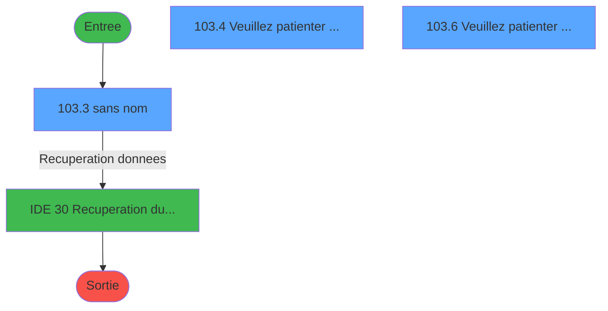
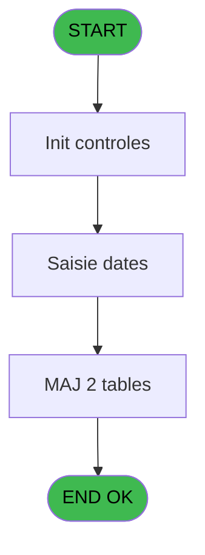
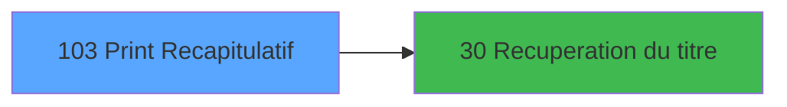

# GES IDE 103 - Print Recapitulatif

> **Analyse**: Phases 1-4 2026-02-03 11:51 -> 11:51 (14s) | Assemblage 11:51
> **Pipeline**: V7.2 Enrichi
> **Structure**: 4 onglets (Resume | Ecrans | Donnees | Connexions)

<!-- TAB:Resume -->

## 1. FICHE D'IDENTITE

| Attribut | Valeur |
|----------|--------|
| Projet | GES |
| IDE Position | 103 |
| Nom Programme | Print Recapitulatif |
| Fichier source | `Prg_103.xml` |
| Dossier IDE | Telephone |
| Taches | 8 (3 ecrans visibles) |
| Tables modifiees | 2 |
| Programmes appeles | 1 |

## 2. DESCRIPTION FONCTIONNELLE

**Print Recapitulatif** assure la gestion complete de ce processus, accessible depuis [Menu Telephone (IDE 107)](GES-IDE-107.md).

Le flux de traitement s'organise en **1 blocs fonctionnels** :

- **Traitement** (8 taches) : traitements metier divers

**Donnees modifiees** : 2 tables en ecriture (recette_telephonerte, historique_pabx).

Detail : phases du traitement

#### Phase 1 : Traitement (8 taches)

- **103** - (sans nom) **[[ECRAN]](#ecran-t1)**
- **103.1** - Recuperation date
- **103.2** - Abonnement
- **103.3** - (sans nom) **[[ECRAN]](#ecran-t4)**
- **103.4** - Veuillez patienter ... **[[ECRAN]](#ecran-t5)**
- **103.5** - Confirmation **[[ECRAN]](#ecran-t6)**
- **103.6** - Veuillez patienter ... **[[ECRAN]](#ecran-t7)**
- **103.6.1** - Ecriture dans RTE

Delegue a : [Recuperation du titre (IDE 30)](GES-IDE-30.md)

#### Tables impactees

| Table | Operations | Role metier |
|-------|-----------|-------------|
| historique_pabx | R/**W** (2 usages) | Historique / journal |
| recette_telephonerte | R/**W** (2 usages) |  |

## 3. BLOCS FONCTIONNELS

### 3.1 Traitement (8 taches)

Traitements internes.

---

#### 103 - (sans nom) [[ECRAN]](#ecran-t1)

**Role** : Tache d'orchestration : point d'entree du programme (8 sous-taches). Coordonne l'enchainement des traitements.
**Ecran** : 8 x 8 DLU (MDI) | [Voir mockup](#ecran-t1)

7 sous-taches directes

| Tache | Nom | Bloc |
|-------|-----|------|
| [103.1](#t2) | Recuperation date | Traitement |
| [103.2](#t3) | Abonnement | Traitement |
| [103.3](#t4) | (sans nom) **[[ECRAN]](#ecran-t4)** | Traitement |
| [103.4](#t5) | Veuillez patienter ... **[[ECRAN]](#ecran-t5)** | Traitement |
| [103.5](#t6) | Confirmation **[[ECRAN]](#ecran-t6)** | Traitement |
| [103.6](#t7) | Veuillez patienter ... **[[ECRAN]](#ecran-t7)** | Traitement |
| [103.6.1](#t8) | Ecriture dans RTE | Traitement |

**Delegue a** : [Recuperation du titre (IDE 30)](GES-IDE-30.md)

---

#### 103.1 - Recuperation date

**Role** : Consultation/chargement : Recuperation date.
**Variables liees** : K (W0 date debut), L (W0 date fin)
**Delegue a** : [Recuperation du titre (IDE 30)](GES-IDE-30.md)

---

#### 103.2 - Abonnement

**Role** : Traitement : Abonnement.
**Variables liees** : F (W0 abonnement)
**Delegue a** : [Recuperation du titre (IDE 30)](GES-IDE-30.md)

---

#### 103.3 - (sans nom) [[ECRAN]](#ecran-t4)

**Role** : Traitement interne.
**Ecran** : 507 x 131 DLU (MDI) | [Voir mockup](#ecran-t4)
**Delegue a** : [Recuperation du titre (IDE 30)](GES-IDE-30.md)

---

#### 103.4 - Veuillez patienter ... [[ECRAN]](#ecran-t5)

**Role** : Traitement : Veuillez patienter ....
**Ecran** : 422 x 56 DLU (MDI) | [Voir mockup](#ecran-t5)
**Delegue a** : [Recuperation du titre (IDE 30)](GES-IDE-30.md)

---

#### 103.5 - Confirmation [[ECRAN]](#ecran-t6)

**Role** : Traitement : Confirmation.
**Ecran** : 442 x 78 DLU (MDI) | [Voir mockup](#ecran-t6)
**Delegue a** : [Recuperation du titre (IDE 30)](GES-IDE-30.md)

---

#### 103.6 - Veuillez patienter ... [[ECRAN]](#ecran-t7)

**Role** : Traitement : Veuillez patienter ....
**Ecran** : 422 x 56 DLU (MDI) | [Voir mockup](#ecran-t7)
**Delegue a** : [Recuperation du titre (IDE 30)](GES-IDE-30.md)

---

#### 103.6.1 - Ecriture dans RTE

**Role** : Traitement : Ecriture dans RTE.
**Delegue a** : [Recuperation du titre (IDE 30)](GES-IDE-30.md)

## 5. REGLES METIER

*(Aucune regle metier identifiee)*

## 6. CONTEXTE

- **Appele par**: [Menu Telephone (IDE 107)](GES-IDE-107.md)
- **Appelle**: 1 programmes | **Tables**: 4 (W:2 R:3 L:1) | **Taches**: 8 | **Expressions**: 4

<!-- TAB:Ecrans -->

## 8. ECRANS

### 8.1 Forms visibles (3 / 8)

| # | Position | Tache | Nom | Type | Largeur | Hauteur | Bloc |
|---|----------|-------|-----|------|---------|---------|------|
| 1 | 103.3 | 103.3 | (sans nom) | MDI | 507 | 131 | Traitement |
| 2 | 103.4 | 103.4 | Veuillez patienter ... | MDI | 422 | 56 | Traitement |
| 3 | 103.6 | 103.6 | Veuillez patienter ... | MDI | 422 | 56 | Traitement |

### 8.2 Mockups Ecrans

---

#### 103.3 - (sans nom)
**Tache** : [103.3](#t4) | **Type** : MDI | **Dimensions** : 507 x 131 DLU
**Bloc** : Traitement | **Titre IDE** : (sans nom)

<!-- FORM-DATA:
{
    "width":  507,
    "vFactor":  8,
    "type":  "MDI",
    "hFactor":  8,
    "controls":  [
                     {
                         "x":  2,
                         "type":  "label",
                         "var":  "",
                         "y":  0,
                         "w":  504,
                         "fmt":  "",
                         "name":  "",
                         "h":  19,
                         "color":  "",
                         "text":  "",
                         "parent":  null
                     },
                     {
                         "x":  175,
                         "type":  "label",
                         "var":  "",
                         "y":  62,
                         "w":  41,
                         "fmt":  "",
                         "name":  "",
                         "h":  8,
                         "color":  "",
                         "text":  "Du",
                         "parent":  null
                     },
                     {
                         "x":  343,
                         "type":  "label",
                         "var":  "",
                         "y":  62,
                         "w":  27,
                         "fmt":  "",
                         "name":  "",
                         "h":  8,
                         "color":  "4",
                         "text":  "au",
                         "parent":  null
                     },
                     {
                         "x":  1,
                         "type":  "label",
                         "var":  "",
                         "y":  106,
                         "w":  505,
                         "fmt":  "",
                         "name":  "",
                         "h":  24,
                         "color":  "",
                         "text":  "",
                         "parent":  null
                     },
                     {
                         "x":  215,
                         "type":  "edit",
                         "var":  "",
                         "y":  60,
                         "w":  126,
                         "fmt":  "##/##/####A",
                         "name":  "W1 date debut",
                         "h":  10,
                         "color":  "6",
                         "text":  "",
                         "parent":  null
                     },
                     {
                         "x":  369,
                         "type":  "edit",
                         "var":  "",
                         "y":  60,
                         "w":  126,
                         "fmt":  "##/##/####A",
                         "name":  "W1 date fin",
                         "h":  10,
                         "color":  "6",
                         "text":  "",
                         "parent":  null
                     },
                     {
                         "x":  8,
                         "type":  "button",
                         "var":  "",
                         "y":  109,
                         "w":  152,
                         "fmt":  "\u0026Ok",
                         "name":  "Bouton Ok",
                         "h":  18,
                         "color":  "",
                         "text":  "",
                         "parent":  9
                     },
                     {
                         "x":  6,
                         "type":  "edit",
                         "var":  "",
                         "y":  5,
                         "w":  267,
                         "fmt":  "20",
                         "name":  "",
                         "h":  8,
                         "color":  "4",
                         "text":  "",
                         "parent":  1
                     },
                     {
                         "x":  297,
                         "type":  "edit",
                         "var":  "",
                         "y":  5,
                         "w":  203,
                         "fmt":  "WWW DD MMM YYYYT",
                         "name":  "",
                         "h":  8,
                         "color":  "",
                         "text":  "",
                         "parent":  1
                     },
                     {
                         "x":  8,
                         "type":  "image",
                         "var":  "",
                         "y":  33,
                         "w":  160,
                         "fmt":  "",
                         "name":  "",
                         "h":  53,
                         "color":  "4",
                         "text":  "",
                         "parent":  null
                     },
                     {
                         "x":  168,
                         "type":  "button",
                         "var":  "",
                         "y":  109,
                         "w":  152,
                         "fmt":  "A\u0026bandonner",
                         "name":  "",
                         "h":  18,
                         "color":  "",
                         "text":  "",
                         "parent":  null
                     }
                 ],
    "taskId":  "103.3",
    "height":  131
}
-->

<strong>Champs : 4 champs</strong>

| Pos (x,y) | Nom | Variable | Type |
|-----------|-----|----------|------|
| 215,60 | W1 date debut | - | edit |
| 369,60 | W1 date fin | - | edit |
| 6,5 | 20 | - | edit |
| 297,5 | WWW DD MMM YYYYT | - | edit |

<strong>Boutons : 2 boutons</strong>

| Bouton | Pos (x,y) | Action |
|--------|-----------|--------|
| Ok | 8,109 | Valide la saisie et enregistre |
| Abandonner | 168,109 | Annule et retour au menu |

---

#### 103.4 - Veuillez patienter ...
**Tache** : [103.4](#t5) | **Type** : MDI | **Dimensions** : 422 x 56 DLU
**Bloc** : Traitement | **Titre IDE** : Veuillez patienter ...

<!-- FORM-DATA:
{
    "width":  422,
    "vFactor":  8,
    "type":  "MDI",
    "hFactor":  8,
    "controls":  [
                     {
                         "x":  0,
                         "type":  "label",
                         "var":  "",
                         "y":  0,
                         "w":  423,
                         "fmt":  "",
                         "name":  "",
                         "h":  29,
                         "color":  "",
                         "text":  "",
                         "parent":  null
                     },
                     {
                         "x":  120,
                         "type":  "label",
                         "var":  "",
                         "y":  10,
                         "w":  221,
                         "fmt":  "",
                         "name":  "",
                         "h":  8,
                         "color":  "7",
                         "text":  "Impression en cours ...",
                         "parent":  null
                     },
                     {
                         "x":  0,
                         "type":  "label",
                         "var":  "",
                         "y":  29,
                         "w":  423,
                         "fmt":  "",
                         "name":  "",
                         "h":  27,
                         "color":  "",
                         "text":  "",
                         "parent":  null
                     },
                     {
                         "x":  103,
                         "type":  "label",
                         "var":  "",
                         "y":  38,
                         "w":  216,
                         "fmt":  "",
                         "name":  "",
                         "h":  8,
                         "color":  "",
                         "text":  "Edition du recapitulatif",
                         "parent":  null
                     },
                     {
                         "x":  4,
                         "type":  "image",
                         "var":  "",
                         "y":  2,
                         "w":  72,
                         "fmt":  "",
                         "name":  "",
                         "h":  25,
                         "color":  "",
                         "text":  "",
                         "parent":  null
                     }
                 ],
    "taskId":  "103.4",
    "height":  56
}
-->

---

#### 103.6 - Veuillez patienter ...
**Tache** : [103.6](#t7) | **Type** : MDI | **Dimensions** : 422 x 56 DLU
**Bloc** : Traitement | **Titre IDE** : Veuillez patienter ...

<!-- FORM-DATA:
{
    "width":  422,
    "vFactor":  8,
    "type":  "MDI",
    "hFactor":  8,
    "controls":  [
                     {
                         "x":  0,
                         "type":  "label",
                         "var":  "",
                         "y":  0,
                         "w":  423,
                         "fmt":  "",
                         "name":  "",
                         "h":  29,
                         "color":  "",
                         "text":  "",
                         "parent":  null
                     },
                     {
                         "x":  120,
                         "type":  "label",
                         "var":  "",
                         "y":  10,
                         "w":  221,
                         "fmt":  "",
                         "name":  "",
                         "h":  8,
                         "color":  "7",
                         "text":  "Traitement en cours ...",
                         "parent":  null
                     },
                     {
                         "x":  0,
                         "type":  "label",
                         "var":  "",
                         "y":  29,
                         "w":  423,
                         "fmt":  "",
                         "name":  "",
                         "h":  27,
                         "color":  "",
                         "text":  "",
                         "parent":  null
                     },
                     {
                         "x":  72,
                         "type":  "label",
                         "var":  "",
                         "y":  38,
                         "w":  280,
                         "fmt":  "",
                         "name":  "",
                         "h":  8,
                         "color":  "",
                         "text":  "Cloture en cours",
                         "parent":  null
                     },
                     {
                         "x":  4,
                         "type":  "image",
                         "var":  "",
                         "y":  2,
                         "w":  72,
                         "fmt":  "",
                         "name":  "",
                         "h":  25,
                         "color":  "",
                         "text":  "",
                         "parent":  null
                     }
                 ],
    "taskId":  "103.6",
    "height":  56
}
-->

## 9. NAVIGATION

### 9.1 Enchainement des ecrans

**Detail par enchainement :**

| Depuis | Action | Vers | Retour |
|--------|--------|------|--------|
|  | Recuperation donnees | [Recuperation du titre (IDE 30)](GES-IDE-30.md) | Retour ecran |

### 9.3 Structure hierarchique (8 taches)

| Position | Tache | Type | Dimensions | Bloc |
|----------|-------|------|------------|------|
| **103.1** | [**(sans nom)** (103)](#t1) [mockup](#ecran-t1) | MDI | 8x8 | Traitement |
| 103.1.1 | [Recuperation date (103.1)](#t2) | MDI | - | |
| 103.1.2 | [Abonnement (103.2)](#t3) | MDI | - | |
| 103.1.3 | [(sans nom) (103.3)](#t4) [mockup](#ecran-t4) | MDI | 507x131 | |
| 103.1.4 | [Veuillez patienter ... (103.4)](#t5) [mockup](#ecran-t5) | MDI | 422x56 | |
| 103.1.5 | [Confirmation (103.5)](#t6) [mockup](#ecran-t6) | MDI | 442x78 | |
| 103.1.6 | [Veuillez patienter ... (103.6)](#t7) [mockup](#ecran-t7) | MDI | 422x56 | |
| 103.1.7 | [Ecriture dans RTE (103.6.1)](#t8) | MDI | - | |

### 9.4 Algorigramme

> **Legende**: Vert = START/END OK | Rouge = END KO | Bleu = Decisions
> *Algorigramme auto-genere. Utiliser `/algorigramme` pour une synthese metier detaillee.*

<!-- TAB:Donnees -->

## 10. TABLES

### Tables utilisees (4)

| ID | Nom | Description | Type | R | W | L | Usages |
|----|-----|-------------|------|---|---|---|--------|
| 60 | table_code_acces_tca |  | DB |   |   | L | 1 |
| 61 | recette_telephonerte |  | DB | R | **W** |   | 2 |
| 67 | tables___________tab |  | DB | R |   |   | 1 |
| 155 | historique_pabx | Historique / journal | DB | R | **W** |   | 2 |

### Colonnes par table (3 / 3 tables avec colonnes identifiees)

Table 61 - recette_telephonerte (R/**W**) - 2 usages

| Lettre | Variable | Acces | Type |
|--------|----------|-------|------|
| E | W0 recette/depense | W | Numeric |

Table 67 - tables___________tab (R) - 1 usages

*Table utilisee uniquement en Link ou aucune colonne Real identifiee dans le DataView.*

Table 155 - historique_pabx (R/**W**) - 2 usages

| Lettre | Variable | Acces | Type |
|--------|----------|-------|------|
| A | W1 total | W | Numeric |
| B | W1 libelle accès | W | Alpha |
| C | W1 code accès | W | Alpha |
| D | W1 cumul taxes | W | Numeric |
| E | W1 cumul tarif ptt | W | Numeric |
| F | W1 cumul tarif club | W | Numeric |
| G | W1 cumul taxes grat. | W | Numeric |
| H | W1 cumul gratuite | W | Numeric |
| I | W1 ss-total PTT | W | Numeric |
| J | W1 ret.lien TCA | W | Numeric |

## 11. VARIABLES

### 11.1 Parametres entrants (4)

Variables recues du programme appelant ([Menu Telephone (IDE 107)](GES-IDE-107.md)).

| Lettre | Nom | Type | Usage dans |
|--------|-----|------|-----------|
| A | P0 societe | Alpha | - |
| B | P0 masque montant | Alpha | 1x parametre entrant |
| C | P0 masque cumul | Alpha | - |
| D | P0 nom village | Alpha | - |

### 11.2 Variables de travail (10)

Variables internes au programme.

| Lettre | Nom | Type | Usage dans |
|--------|-----|------|-----------|
| E | W0 recette/depense | Numeric | - |
| F | W0 abonnement | Numeric | - |
| G | W0 tarif club | Numeric | - |
| H | W0 tarif PTT | Numeric | - |
| I | W0 gratuite | Numeric | - |
| J | W0 clôture O/N | Alpha | 2x calcul interne |
| K | W0 date debut | Date | [103.1](#t2) |
| L | W0 date fin | Date | [103.1](#t2) |
| M | W0 numero compose | Alpha | - |
| N | W0 continue | Logical | 1x calcul interne |

## 12. EXPRESSIONS

**4 / 4 expressions decodees (100%)**

### 12.1 Repartition par type

| Type | Expressions | Regles |
|------|-------------|--------|
| CALCULATION | 1 | 0 |
| CONDITION | 3 | 0 |

### 12.2 Expressions cles par type

#### CALCULATION (1 expressions)

| Type | IDE | Expression | Regle |
|------|-----|------------|-------|
| CALCULATION | 4 | `P0 masque montant [B]+1` | - |

#### CONDITION (3 expressions)

| Type | IDE | Expression | Regle |
|------|-----|------------|-------|
| CONDITION | 3 | `W0 clôture O/N [J]<>'O'` | - |
| CONDITION | 2 | `W0 clôture O/N [J]='O'` | - |
| CONDITION | 1 | `W0 date fin [L]>=W0 date debut [K] AND W0 date fin [L]<Date () AND W0 continue [N]` | - |

<!-- TAB:Connexions -->

## 13. GRAPHE D'APPELS

### 13.1 Chaine depuis Main (Callers)

Main -> ... -> [Menu Telephone (IDE 107)](GES-IDE-107.md) -> **Print Recapitulatif (IDE 103)**

### 13.2 Callers

| IDE | Nom Programme | Nb Appels |
|-----|---------------|-----------|
| [107](GES-IDE-107.md) | Menu Telephone | 1 |

### 13.3 Callees (programmes appeles)

### 13.4 Detail Callees avec contexte

| IDE | Nom Programme | Appels | Contexte |
|-----|---------------|--------|----------|
| [30](GES-IDE-30.md) | Recuperation du titre | 1 | Recuperation donnees |

## 14. RECOMMANDATIONS MIGRATION

### 14.1 Profil du programme

| Metrique | Valeur | Impact migration |
|----------|--------|-----------------|
| Lignes de logique | 138 | Programme compact |
| Expressions | 4 | Peu de logique |
| Tables WRITE | 2 | Impact faible |
| Sous-programmes | 1 | Peu de dependances |
| Ecrans visibles | 3 | Quelques ecrans |
| Code desactive | 0% (0 / 138) | Code sain |
| Regles metier | 0 | Pas de regle identifiee |

### 14.2 Plan de migration par bloc

#### Traitement (8 taches: 5 ecrans, 3 traitements)

- **Strategie** : Orchestrateur avec 5 ecrans (Razor/React) et 3 traitements backend (services).
- Les ecrans deviennent des composants UI, les traitements invisibles deviennent des services injectables.
- 1 sous-programme(s) a migrer ou a reutiliser depuis les services existants.
- Decomposer les taches en services unitaires testables.

### 14.3 Dependances critiques

| Dependance | Type | Appels | Impact |
|------------|------|--------|--------|
| recette_telephonerte | Table WRITE (Database) | 1x | Schema + repository |
| historique_pabx | Table WRITE (Database) | 1x | Schema + repository |
| [Recuperation du titre (IDE 30)](GES-IDE-30.md) | Sous-programme | 1x | Normale - Recuperation donnees |

---
*Spec DETAILED generee par Pipeline V7.2 - 2026-02-03 11:51*
