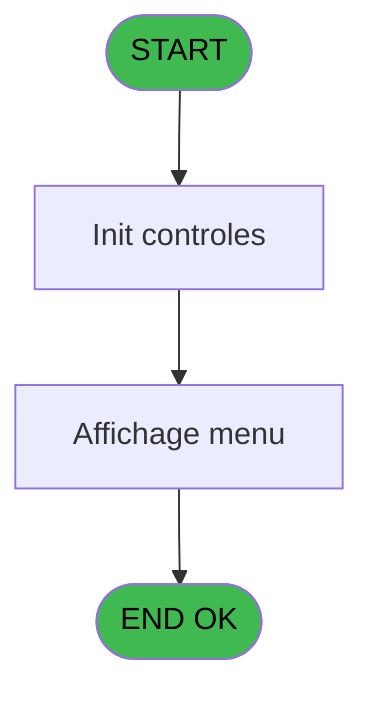
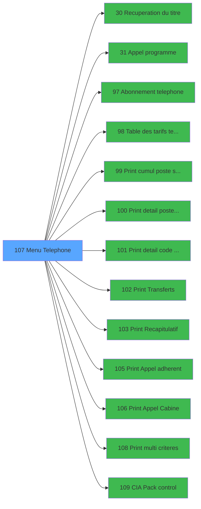

# GES IDE 107 - Menu Telephone

> **Analyse**: Phases 1-4 2026-02-03 11:53 -> 11:53 (17s) | Assemblage 11:53
> **Pipeline**: V7.2 Enrichi
> **Structure**: 4 onglets (Resume | Ecrans | Donnees | Connexions)

<!-- TAB:Resume -->

## 1. FICHE D'IDENTITE

| Attribut | Valeur |
|----------|--------|
| Projet | GES |
| IDE Position | 107 |
| Nom Programme | Menu Telephone |
| Fichier source | `Prg_107.xml` |
| Dossier IDE | Telephone |
| Taches | 3 (2 ecrans visibles) |
| Tables modifiees | 0 |
| Programmes appeles | 13 |

## 2. DESCRIPTION FONCTIONNELLE

**Menu Telephone** assure la gestion complete de ce processus, accessible depuis [Menu gestion (IDE 69)](GES-IDE-69.md).

Le flux de traitement s'organise en **2 blocs fonctionnels** :

- **Traitement** (2 taches) : traitements metier divers
- **Consultation** (1 tache) : ecrans de recherche, selection et consultation

Detail : phases du traitement

#### Phase 1 : Traitement (2 taches)

- **107** - CV  Menu telephone **[[ECRAN]](#ecran-t1)**
- **107.2** - Poste de service **[[ECRAN]](#ecran-t3)**

Delegue a : [Recuperation du titre (IDE 30)](GES-IDE-30.md), [Appel programme (IDE 31)](GES-IDE-31.md), [ Abonnement telephone (IDE 97)](GES-IDE-97.md), [ Table des tarifs telephone (IDE 98)](GES-IDE-98.md), [CIA Pack control (IDE 109)](GES-IDE-109.md)

#### Phase 2 : Consultation (1 tache)

- **107.1** - Affichage menu **[[ECRAN]](#ecran-t2)**

Delegue a : [Recuperation du titre (IDE 30)](GES-IDE-30.md)

## 3. BLOCS FONCTIONNELS

### 3.1 Traitement (2 taches)

Traitements internes.

---

#### 107 - CV  Menu telephone [[ECRAN]](#ecran-t1)

**Role** : Traitement : CV  Menu telephone.
**Ecran** : 640 x 184 DLU (MDI) | [Voir mockup](#ecran-t1)
**Delegue a** : [Recuperation du titre (IDE 30)](GES-IDE-30.md), [Appel programme (IDE 31)](GES-IDE-31.md), [ Abonnement telephone (IDE 97)](GES-IDE-97.md)

---

#### 107.2 - Poste de service [[ECRAN]](#ecran-t3)

**Role** : Traitement : Poste de service.
**Ecran** : 573 x 160 DLU (MDI) | [Voir mockup](#ecran-t3)
**Delegue a** : [Recuperation du titre (IDE 30)](GES-IDE-30.md), [Appel programme (IDE 31)](GES-IDE-31.md), [ Abonnement telephone (IDE 97)](GES-IDE-97.md)

### 3.2 Consultation (1 tache)

Ecrans de recherche et consultation.

---

#### 107.1 - Affichage menu [[ECRAN]](#ecran-t2)

**Role** : Reinitialisation : Affichage menu.
**Ecran** : 842 x 233 DLU (MDI) | [Voir mockup](#ecran-t2)

## 5. REGLES METIER

*(Aucune regle metier identifiee)*

## 6. CONTEXTE

- **Appele par**: [Menu gestion (IDE 69)](GES-IDE-69.md)
- **Appelle**: 13 programmes | **Tables**: 1 (W:0 R:1 L:0) | **Taches**: 3 | **Expressions**: 13

<!-- TAB:Ecrans -->

## 8. ECRANS

### 8.1 Forms visibles (2 / 3)

| # | Position | Tache | Nom | Type | Largeur | Hauteur | Bloc |
|---|----------|-------|-----|------|---------|---------|------|
| 1 | 107.1 | 107.1 | Affichage menu | MDI | 842 | 233 | Consultation |
| 2 | 107.2 | 107.2 | Poste de service | MDI | 573 | 160 | Traitement |

### 8.2 Mockups Ecrans

---

#### 107.1 - Affichage menu
**Tache** : [107.1](#t2) | **Type** : MDI | **Dimensions** : 842 x 233 DLU
**Bloc** : Consultation | **Titre IDE** : Affichage menu

<!-- FORM-DATA:
{
    "width":  842,
    "vFactor":  8,
    "type":  "MDI",
    "hFactor":  8,
    "controls":  [
                     {
                         "x":  0,
                         "type":  "label",
                         "var":  "",
                         "y":  0,
                         "w":  842,
                         "fmt":  "",
                         "name":  "",
                         "h":  19,
                         "color":  "",
                         "text":  "",
                         "parent":  null
                     },
                     {
                         "x":  20,
                         "type":  "label",
                         "var":  "",
                         "y":  25,
                         "w":  790,
                         "fmt":  "",
                         "name":  "",
                         "h":  182,
                         "color":  "",
                         "text":  "",
                         "parent":  null
                     },
                     {
                         "x":  232,
                         "type":  "label",
                         "var":  "",
                         "y":  35,
                         "w":  564,
                         "fmt":  "",
                         "name":  "",
                         "h":  166,
                         "color":  "",
                         "text":  "",
                         "parent":  null
                     },
                     {
                         "x":  258,
                         "type":  "label",
                         "var":  "",
                         "y":  41,
                         "w":  522,
                         "fmt":  "",
                         "name":  "",
                         "h":  140,
                         "color":  "",
                         "text":  "",
                         "parent":  5
                     },
                     {
                         "x":  260,
                         "type":  "label",
                         "var":  "",
                         "y":  42,
                         "w":  45,
                         "fmt":  "",
                         "name":  "",
                         "h":  136,
                         "color":  "",
                         "text":  "",
                         "parent":  5
                     },
                     {
                         "x":  314,
                         "type":  "label",
                         "var":  "",
                         "y":  47,
                         "w":  453,
                         "fmt":  "",
                         "name":  "",
                         "h":  10,
                         "color":  "142",
                         "text":  "Abonnement téléphonique",
                         "parent":  5
                     },
                     {
                         "x":  314,
                         "type":  "label",
                         "var":  "",
                         "y":  60,
                         "w":  453,
                         "fmt":  "",
                         "name":  "",
                         "h":  9,
                         "color":  "142",
                         "text":  "Table des coefficients de marge téléphone",
                         "parent":  5
                     },
                     {
                         "x":  314,
                         "type":  "label",
                         "var":  "",
                         "y":  73,
                         "w":  453,
                         "fmt":  "",
                         "name":  "",
                         "h":  9,
                         "color":  "142",
                         "text":  "Liste des appels des postes de service",
                         "parent":  5
                     },
                     {
                         "x":  314,
                         "type":  "label",
                         "var":  "",
                         "y":  86,
                         "w":  453,
                         "fmt":  "",
                         "name":  "",
                         "h":  9,
                         "color":  "142",
                         "text":  "Liste des appels adhérent",
                         "parent":  5
                     },
                     {
                         "x":  314,
                         "type":  "label",
                         "var":  "",
                         "y":  99,
                         "w":  453,
                         "fmt":  "",
                         "name":  "",
                         "h":  9,
                         "color":  "142",
                         "text":  "Liste des  transferts d\u0027appel",
                         "parent":  5
                     },
                     {
                         "x":  314,
                         "type":  "label",
                         "var":  "",
                         "y":  113,
                         "w":  453,
                         "fmt":  "",
                         "name":  "",
                         "h":  9,
                         "color":  "142",
                         "text":  "Clôture et récapitulatif",
                         "parent":  5
                     },
                     {
                         "x":  314,
                         "type":  "label",
                         "var":  "",
                         "y":  125,
                         "w":  453,
                         "fmt":  "",
                         "name":  "",
                         "h":  9,
                         "color":  "142",
                         "text":  "Appel cabine non facturé",
                         "parent":  5
                     },
                     {
                         "x":  314,
                         "type":  "label",
                         "var":  "",
                         "y":  138,
                         "w":  453,
                         "fmt":  "",
                         "name":  "",
                         "h":  9,
                         "color":  "142",
                         "text":  "Liste des appels par code autocom",
                         "parent":  5
                     },
                     {
                         "x":  314,
                         "type":  "label",
                         "var":  "",
                         "y":  151,
                         "w":  453,
                         "fmt":  "",
                         "name":  "",
                         "h":  9,
                         "color":  "142",
                         "text":  "Liste des appels - Multi Critères",
                         "parent":  5
                     },
                     {
                         "x":  314,
                         "type":  "label",
                         "var":  "",
                         "y":  164,
                         "w":  453,
                         "fmt":  "",
                         "name":  "",
                         "h":  9,
                         "color":  "142",
                         "text":  "CIA Pack control",
                         "parent":  5
                     },
                     {
                         "x":  391,
                         "type":  "label",
                         "var":  "",
                         "y":  186,
                         "w":  120,
                         "fmt":  "",
                         "name":  "",
                         "h":  9,
                         "color":  "",
                         "text":  "Votre choix",
                         "parent":  5
                     },
                     {
                         "x":  0,
                         "type":  "label",
                         "var":  "",
                         "y":  209,
                         "w":  842,
                         "fmt":  "",
                         "name":  "",
                         "h":  24,
                         "color":  "",
                         "text":  "",
                         "parent":  null
                     },
                     {
                         "x":  525,
                         "type":  "edit",
                         "var":  "",
                         "y":  185,
                         "w":  26,
                         "fmt":  "",
                         "name":  "",
                         "h":  10,
                         "color":  "6",
                         "text":  "",
                         "parent":  5
                     },
                     {
                         "x":  8,
                         "type":  "edit",
                         "var":  "",
                         "y":  4,
                         "w":  267,
                         "fmt":  "20",
                         "name":  "",
                         "h":  8,
                         "color":  "",
                         "text":  "",
                         "parent":  1
                     },
                     {
                         "x":  517,
                         "type":  "edit",
                         "var":  "",
                         "y":  5,
                         "w":  307,
                         "fmt":  "WWW DD MMM YYYYT",
                         "name":  "",
                         "h":  8,
                         "color":  "",
                         "text":  "",
                         "parent":  1
                     },
                     {
                         "x":  37,
                         "type":  "image",
                         "var":  "",
                         "y":  50,
                         "w":  160,
                         "fmt":  "",
                         "name":  "",
                         "h":  57,
                         "color":  "",
                         "text":  "",
                         "parent":  null
                     },
                     {
                         "x":  269,
                         "type":  "button",
                         "var":  "",
                         "y":  47,
                         "w":  26,
                         "fmt":  "1",
                         "name":  "1",
                         "h":  10,
                         "color":  "",
                         "text":  "",
                         "parent":  null
                     },
                     {
                         "x":  269,
                         "type":  "button",
                         "var":  "",
                         "y":  60,
                         "w":  26,
                         "fmt":  "2",
                         "name":  "2",
                         "h":  9,
                         "color":  "",
                         "text":  "",
                         "parent":  null
                     },
                     {
                         "x":  269,
                         "type":  "button",
                         "var":  "",
                         "y":  73,
                         "w":  26,
                         "fmt":  "3",
                         "name":  "3",
                         "h":  9,
                         "color":  "",
                         "text":  "",
                         "parent":  null
                     },
                     {
                         "x":  269,
                         "type":  "button",
                         "var":  "",
                         "y":  86,
                         "w":  26,
                         "fmt":  "4",
                         "name":  "4",
                         "h":  9,
                         "color":  "",
                         "text":  "",
                         "parent":  null
                     },
                     {
                         "x":  269,
                         "type":  "button",
                         "var":  "",
                         "y":  99,
                         "w":  26,
                         "fmt":  "5",
                         "name":  "5",
                         "h":  9,
                         "color":  "",
                         "text":  "",
                         "parent":  null
                     },
                     {
                         "x":  269,
                         "type":  "button",
                         "var":  "",
                         "y":  113,
                         "w":  26,
                         "fmt":  "6",
                         "name":  "6",
                         "h":  9,
                         "color":  "",
                         "text":  "",
                         "parent":  null
                     },
                     {
                         "x":  269,
                         "type":  "button",
                         "var":  "",
                         "y":  125,
                         "w":  26,
                         "fmt":  "7",
                         "name":  "7",
                         "h":  9,
                         "color":  "",
                         "text":  "",
                         "parent":  null
                     },
                     {
                         "x":  269,
                         "type":  "button",
                         "var":  "",
                         "y":  138,
                         "w":  26,
                         "fmt":  "8",
                         "name":  "8",
                         "h":  9,
                         "color":  "",
                         "text":  "",
                         "parent":  null
                     },
                     {
                         "x":  269,
                         "type":  "button",
                         "var":  "",
                         "y":  151,
                         "w":  26,
                         "fmt":  "9",
                         "name":  "9",
                         "h":  9,
                         "color":  "",
                         "text":  "",
                         "parent":  null
                     },
                     {
                         "x":  269,
                         "type":  "button",
                         "var":  "",
                         "y":  164,
                         "w":  26,
                         "fmt":  "0",
                         "name":  "0",
                         "h":  9,
                         "color":  "",
                         "text":  "",
                         "parent":  null
                     },
                     {
                         "x":  6,
                         "type":  "button",
                         "var":  "",
                         "y":  212,
                         "w":  168,
                         "fmt":  "\u0026Quitter",
                         "name":  "",
                         "h":  18,
                         "color":  "",
                         "text":  "",
                         "parent":  null
                     }
                 ],
    "taskId":  "107.1",
    "height":  233
}
-->

<strong>Champs : 3 champs</strong>

| Pos (x,y) | Nom | Variable | Type |
|-----------|-----|----------|------|
| 525,185 | (sans nom) | - | edit |
| 8,4 | 20 | - | edit |
| 517,5 | WWW DD MMM YYYYT | - | edit |

<strong>Boutons : 11 boutons</strong>

| Bouton | Pos (x,y) | Action |
|--------|-----------|--------|
| 1 | 269,47 | Bouton fonctionnel |
| 2 | 269,60 | Bouton fonctionnel |
| 3 | 269,73 | Bouton fonctionnel |
| 4 | 269,86 | Bouton fonctionnel |
| 5 | 269,99 | Bouton fonctionnel |
| 6 | 269,113 | Bouton fonctionnel |
| 7 | 269,125 | Bouton fonctionnel |
| 8 | 269,138 | Bouton fonctionnel |
| 9 | 269,151 | Bouton fonctionnel |
| 0 | 269,164 | Bouton fonctionnel |
| Quitter | 6,212 | Quitte le programme |

---

#### 107.2 - Poste de service
**Tache** : [107.2](#t3) | **Type** : MDI | **Dimensions** : 573 x 160 DLU
**Bloc** : Traitement | **Titre IDE** : Poste de service

<!-- FORM-DATA:
{
    "width":  573,
    "vFactor":  8,
    "type":  "MDI",
    "hFactor":  8,
    "controls":  [
                     {
                         "x":  2,
                         "type":  "label",
                         "var":  "",
                         "y":  2,
                         "w":  567,
                         "fmt":  "",
                         "name":  "",
                         "h":  17,
                         "color":  "",
                         "text":  "",
                         "parent":  null
                     },
                     {
                         "x":  7,
                         "type":  "label",
                         "var":  "",
                         "y":  24,
                         "w":  554,
                         "fmt":  "",
                         "name":  "",
                         "h":  105,
                         "color":  "",
                         "text":  "",
                         "parent":  null
                     },
                     {
                         "x":  218,
                         "type":  "label",
                         "var":  "",
                         "y":  41,
                         "w":  292,
                         "fmt":  "",
                         "name":  "",
                         "h":  70,
                         "color":  "",
                         "text":  "",
                         "parent":  null
                     },
                     {
                         "x":  221,
                         "type":  "label",
                         "var":  "",
                         "y":  42,
                         "w":  287,
                         "fmt":  "",
                         "name":  "",
                         "h":  68,
                         "color":  "",
                         "text":  "",
                         "parent":  null
                     },
                     {
                         "x":  244,
                         "type":  "label",
                         "var":  "",
                         "y":  51,
                         "w":  228,
                         "fmt":  "",
                         "name":  "",
                         "h":  33,
                         "color":  "",
                         "text":  "",
                         "parent":  null
                     },
                     {
                         "x":  247,
                         "type":  "label",
                         "var":  "",
                         "y":  52,
                         "w":  37,
                         "fmt":  "",
                         "name":  "",
                         "h":  31,
                         "color":  "",
                         "text":  "",
                         "parent":  null
                     },
                     {
                         "x":  292,
                         "type":  "label",
                         "var":  "",
                         "y":  57,
                         "w":  171,
                         "fmt":  "",
                         "name":  "",
                         "h":  8,
                         "color":  "7",
                         "text":  "Cumul",
                         "parent":  null
                     },
                     {
                         "x":  292,
                         "type":  "label",
                         "var":  "",
                         "y":  72,
                         "w":  171,
                         "fmt":  "",
                         "name":  "",
                         "h":  8,
                         "color":  "7",
                         "text":  "Détail",
                         "parent":  null
                     },
                     {
                         "x":  283,
                         "type":  "label",
                         "var":  "",
                         "y":  94,
                         "w":  120,
                         "fmt":  "",
                         "name":  "",
                         "h":  9,
                         "color":  "",
                         "text":  "Votre choix",
                         "parent":  null
                     },
                     {
                         "x":  2,
                         "type":  "label",
                         "var":  "",
                         "y":  135,
                         "w":  567,
                         "fmt":  "",
                         "name":  "",
                         "h":  23,
                         "color":  "",
                         "text":  "",
                         "parent":  null
                     },
                     {
                         "x":  417,
                         "type":  "edit",
                         "var":  "",
                         "y":  93,
                         "w":  26,
                         "fmt":  "",
                         "name":  "",
                         "h":  10,
                         "color":  "6",
                         "text":  "",
                         "parent":  null
                     },
                     {
                         "x":  10,
                         "type":  "edit",
                         "var":  "",
                         "y":  6,
                         "w":  267,
                         "fmt":  "20",
                         "name":  "",
                         "h":  8,
                         "color":  "",
                         "text":  "",
                         "parent":  1
                     },
                     {
                         "x":  25,
                         "type":  "image",
                         "var":  "",
                         "y":  37,
                         "w":  144,
                         "fmt":  "",
                         "name":  "",
                         "h":  62,
                         "color":  "",
                         "text":  "",
                         "parent":  4
                     },
                     {
                         "x":  251,
                         "type":  "button",
                         "var":  "",
                         "y":  55,
                         "w":  26,
                         "fmt":  "1",
                         "name":  "1",
                         "h":  9,
                         "color":  "",
                         "text":  "",
                         "parent":  null
                     },
                     {
                         "x":  251,
                         "type":  "button",
                         "var":  "",
                         "y":  71,
                         "w":  26,
                         "fmt":  "2",
                         "name":  "2",
                         "h":  9,
                         "color":  "",
                         "text":  "",
                         "parent":  null
                     },
                     {
                         "x":  8,
                         "type":  "button",
                         "var":  "",
                         "y":  138,
                         "w":  168,
                         "fmt":  "\u0026Quitter",
                         "name":  "",
                         "h":  18,
                         "color":  "",
                         "text":  "",
                         "parent":  null
                     },
                     {
                         "x":  357,
                         "type":  "edit",
                         "var":  "",
                         "y":  5,
                         "w":  203,
                         "fmt":  "WWW DD MMM YYYYT",
                         "name":  "",
                         "h":  8,
                         "color":  "",
                         "text":  "",
                         "parent":  1
                     }
                 ],
    "taskId":  "107.2",
    "height":  160
}
-->

<strong>Champs : 3 champs</strong>

| Pos (x,y) | Nom | Variable | Type |
|-----------|-----|----------|------|
| 417,93 | (sans nom) | - | edit |
| 10,6 | 20 | - | edit |
| 357,5 | WWW DD MMM YYYYT | - | edit |

<strong>Boutons : 3 boutons</strong>

| Bouton | Pos (x,y) | Action |
|--------|-----------|--------|
| 1 | 251,55 | Bouton fonctionnel |
| 2 | 251,71 | Bouton fonctionnel |
| Quitter | 8,138 | Quitte le programme |

## 9. NAVIGATION

### 9.1 Enchainement des ecrans

```mermaid
flowchart TD
    START([Entree])
    style START fill:#3fb950
    VF2[107.1 Affichage menu]
    style VF2 fill:#58a6ff
    VF3[107.2 Poste de service]
    style VF3 fill:#58a6ff
    EXT30[IDE 30 Recuperation du...]
    style EXT30 fill:#3fb950
    EXT31[IDE 31 Appel programme]
    style EXT31 fill:#3fb950
    EXT97[IDE 97 Abonnement tele...]
    style EXT97 fill:#3fb950
    EXT98[IDE 98 Table des tarif...]
    style EXT98 fill:#3fb950
    EXT99[IDE 99 Print cumul pos...]
    style EXT99 fill:#3fb950
    EXT100[IDE 100 Print detail p...]
    style EXT100 fill:#3fb950
    EXT101[IDE 101 Print detail c...]
    style EXT101 fill:#3fb950
    EXT102[IDE 102 Print Transferts]
    style EXT102 fill:#3fb950
    EXT103[IDE 103 Print Recapitu...]
    style EXT103 fill:#3fb950
    EXT105[IDE 105 Print Appel ad...]
    style EXT105 fill:#3fb950
    EXT106[IDE 106 Print Appel Ca...]
    style EXT106 fill:#3fb950
    EXT108[IDE 108 Print multi cr...]
    style EXT108 fill:#3fb950
    EXT109[IDE 109 CIA Pack control]
    style EXT109 fill:#3fb950
    FIN([Sortie])
    style FIN fill:#f85149
    START --> VF2
    VF2 -->|Recuperation donnees| EXT30
    VF2 -->|Sous-programme| EXT31
    VF2 -->|Sous-programme| EXT97
    VF2 -->|Sous-programme| EXT98
    VF2 -->|Impression ticket/document| EXT99
    VF2 -->|Impression ticket/document| EXT100
    VF2 -->|Impression ticket/document| EXT101
    VF2 -->|Impression ticket/document| EXT102
    EXT109 --> FIN
```

**Detail par enchainement :**

| Depuis | Action | Vers | Retour |
|--------|--------|------|--------|
| Affichage menu | Recuperation donnees | [Recuperation du titre (IDE 30)](GES-IDE-30.md) | Retour ecran |
| Affichage menu | Sous-programme | [Appel programme (IDE 31)](GES-IDE-31.md) | Retour ecran |
| Affichage menu | Sous-programme | [ Abonnement telephone (IDE 97)](GES-IDE-97.md) | Retour ecran |
| Affichage menu | Sous-programme | [ Table des tarifs telephone (IDE 98)](GES-IDE-98.md) | Retour ecran |
| Affichage menu | Impression ticket/document | [ Print cumul poste service (IDE 99)](GES-IDE-99.md) | Retour ecran |
| Affichage menu | Impression ticket/document | [ Print detail poste service (IDE 100)](GES-IDE-100.md) | Retour ecran |
| Affichage menu | Impression ticket/document | [ Print detail code autocom (IDE 101)](GES-IDE-101.md) | Retour ecran |
| Affichage menu | Impression ticket/document | [ Print Transferts (IDE 102)](GES-IDE-102.md) | Retour ecran |
| Affichage menu | Impression ticket/document | [ Print Recapitulatif (IDE 103)](GES-IDE-103.md) | Retour ecran |
| Affichage menu | Impression ticket/document | [ Print Appel adherent (IDE 105)](GES-IDE-105.md) | Retour ecran |
| Affichage menu | Impression ticket/document | [ Print Appel Cabine (IDE 106)](GES-IDE-106.md) | Retour ecran |
| Affichage menu | Impression ticket/document | [  Print multi criteres (IDE 108)](GES-IDE-108.md) | Retour ecran |
| Affichage menu | Sous-programme | [CIA Pack control (IDE 109)](GES-IDE-109.md) | Retour ecran |

### 9.3 Structure hierarchique (3 taches)

| Position | Tache | Type | Dimensions | Bloc |
|----------|-------|------|------------|------|
| **107.1** | [**CV  Menu telephone** (107)](#t1) [mockup](#ecran-t1) | MDI | 640x184 | Traitement |
| 107.1.1 | [Poste de service (107.2)](#t3) [mockup](#ecran-t3) | MDI | 573x160 | |
| **107.2** | [**Affichage menu** (107.1)](#t2) [mockup](#ecran-t2) | MDI | 842x233 | Consultation |

### 9.4 Algorigramme

> **Legende**: Vert = START/END OK | Rouge = END KO | Bleu = Decisions
> *Algorigramme auto-genere. Utiliser `/algorigramme` pour une synthese metier detaillee.*

<!-- TAB:Donnees -->

## 10. TABLES

### Tables utilisees (1)

| ID | Nom | Description | Type | R | W | L | Usages |
|----|-----|-------------|------|---|---|---|--------|
| 63 | parametres___par |  | DB | R |   |   | 1 |

### Colonnes par table (1 / 1 tables avec colonnes identifiees)

Table 63 - parametres___par (R) - 1 usages

| Lettre | Variable | Acces | Type |
|--------|----------|-------|------|
| A | P0 societe | R | Alpha |
| B | P0 masque montant | R | Alpha |
| C | P0 masque cumul | R | Alpha |
| D | P0 nom village | R | Alpha |
| E | P0 nbre decimales | R | Numeric |
| F | W0 choix action | R | Alpha |

## 11. VARIABLES

### 11.1 Parametres entrants (5)

Variables recues du programme appelant ([Menu gestion (IDE 69)](GES-IDE-69.md)).

| Lettre | Nom | Type | Usage dans |
|--------|-----|------|-----------|
| A | P0 societe | Alpha | 1x parametre entrant |
| B | P0 masque montant | Alpha | - |
| C | P0 masque cumul | Alpha | - |
| D | P0 nom village | Alpha | - |
| E | P0 nbre decimales | Numeric | - |

### 11.2 Variables de travail (1)

Variables internes au programme.

| Lettre | Nom | Type | Usage dans |
|--------|-----|------|-----------|
| F | W0 choix action | Alpha | 11x calcul interne |

## 12. EXPRESSIONS

**13 / 13 expressions decodees (100%)**

### 12.1 Repartition par type

| Type | Expressions | Regles |
|------|-------------|--------|
| CONSTANTE | 1 | 0 |
| OTHER | 1 | 0 |
| CONDITION | 11 | 0 |

### 12.2 Expressions cles par type

#### CONSTANTE (1 expressions)

| Type | IDE | Expression | Regle |
|------|-----|------------|-------|
| CONSTANTE | 2 | `34` | - |

#### OTHER (1 expressions)

| Type | IDE | Expression | Regle |
|------|-----|------------|-------|
| OTHER | 1 | `P0 societe [A]` | - |

#### CONDITION (11 expressions)

| Type | IDE | Expression | Regle |
|------|-----|------------|-------|
| CONDITION | 10 | `W0 choix action [F]='8'` | - |
| CONDITION | 9 | `W0 choix action [F]='7' AND [I]='O'` | - |
| CONDITION | 11 | `W0 choix action [F]='9'` | - |
| CONDITION | 13 | `W0 choix action [F]='F'` | - |
| CONDITION | 12 | `W0 choix action [F]='0'` | - |
| ... | | *+6 autres* | |

<!-- TAB:Connexions -->

## 13. GRAPHE D'APPELS

### 13.1 Chaine depuis Main (Callers)

Main -> ... -> [Menu gestion (IDE 69)](GES-IDE-69.md) -> **Menu Telephone (IDE 107)**

### 13.2 Callers

| IDE | Nom Programme | Nb Appels |
|-----|---------------|-----------|
| [69](GES-IDE-69.md) | Menu gestion | 1 |

### 13.3 Callees (programmes appeles)

### 13.4 Detail Callees avec contexte

| IDE | Nom Programme | Appels | Contexte |
|-----|---------------|--------|----------|
| [30](GES-IDE-30.md) | Recuperation du titre | 2 | Recuperation donnees |
| [31](GES-IDE-31.md) | Appel programme | 2 | Sous-programme |
| [97](GES-IDE-97.md) |  Abonnement telephone | 1 | Sous-programme |
| [98](GES-IDE-98.md) |  Table des tarifs telephone | 1 | Sous-programme |
| [99](GES-IDE-99.md) |  Print cumul poste service | 1 | Impression ticket/document |
| [100](GES-IDE-100.md) |  Print detail poste service | 1 | Impression ticket/document |
| [101](GES-IDE-101.md) |  Print detail code autocom | 1 | Impression ticket/document |
| [102](GES-IDE-102.md) |  Print Transferts | 1 | Impression ticket/document |
| [103](GES-IDE-103.md) |  Print Recapitulatif | 1 | Impression ticket/document |
| [105](GES-IDE-105.md) |  Print Appel adherent | 1 | Impression ticket/document |
| [106](GES-IDE-106.md) |  Print Appel Cabine | 1 | Impression ticket/document |
| [108](GES-IDE-108.md) |   Print multi criteres | 1 | Impression ticket/document |
| [109](GES-IDE-109.md) | CIA Pack control | 1 | Sous-programme |

## 14. RECOMMANDATIONS MIGRATION

### 14.1 Profil du programme

| Metrique | Valeur | Impact migration |
|----------|--------|-----------------|
| Lignes de logique | 45 | Programme compact |
| Expressions | 13 | Peu de logique |
| Tables WRITE | 0 | Impact faible |
| Sous-programmes | 13 | Forte dependance |
| Ecrans visibles | 2 | Quelques ecrans |
| Code desactive | 0% (0 / 45) | Code sain |
| Regles metier | 0 | Pas de regle identifiee |

### 14.2 Plan de migration par bloc

#### Traitement (2 taches: 2 ecrans, 0 traitement)

- **Strategie** : 2 composant(s) UI (Razor/React) avec formulaires et validation.
- 13 sous-programme(s) a migrer ou a reutiliser depuis les services existants.
- Decomposer les taches en services unitaires testables.

#### Consultation (1 tache: 1 ecran, 0 traitement)

- **Strategie** : Composants de recherche/selection en modales.
- 1 ecran : Affichage menu

### 14.3 Dependances critiques

| Dependance | Type | Appels | Impact |
|------------|------|--------|--------|
| [Appel programme (IDE 31)](GES-IDE-31.md) | Sous-programme | 2x | Haute - Sous-programme |
| [Recuperation du titre (IDE 30)](GES-IDE-30.md) | Sous-programme | 2x | Haute - Recuperation donnees |
| [ Print Appel adherent (IDE 105)](GES-IDE-105.md) | Sous-programme | 1x | Normale - Impression ticket/document |
| [ Print Recapitulatif (IDE 103)](GES-IDE-103.md) | Sous-programme | 1x | Normale - Impression ticket/document |
| [ Print Appel Cabine (IDE 106)](GES-IDE-106.md) | Sous-programme | 1x | Normale - Impression ticket/document |
| [CIA Pack control (IDE 109)](GES-IDE-109.md) | Sous-programme | 1x | Normale - Sous-programme |
| [  Print multi criteres (IDE 108)](GES-IDE-108.md) | Sous-programme | 1x | Normale - Impression ticket/document |
| [ Print Transferts (IDE 102)](GES-IDE-102.md) | Sous-programme | 1x | Normale - Impression ticket/document |
| [ Table des tarifs telephone (IDE 98)](GES-IDE-98.md) | Sous-programme | 1x | Normale - Sous-programme |
| [ Abonnement telephone (IDE 97)](GES-IDE-97.md) | Sous-programme | 1x | Normale - Sous-programme |

---
*Spec DETAILED generee par Pipeline V7.2 - 2026-02-03 11:53*
