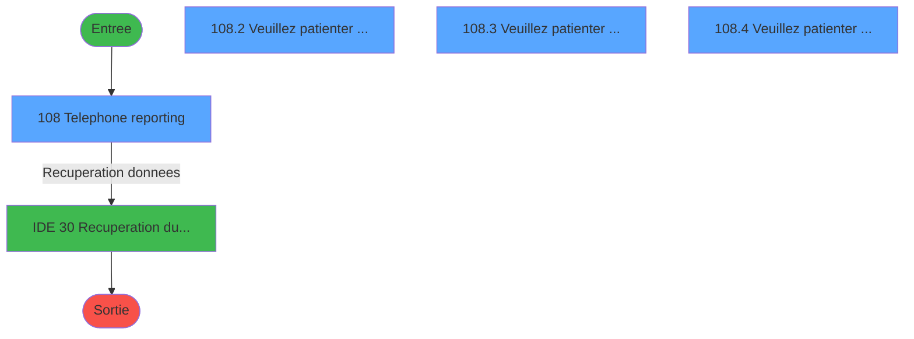
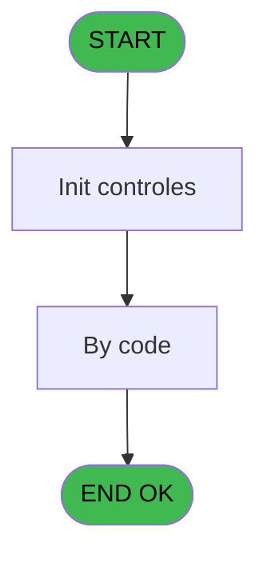
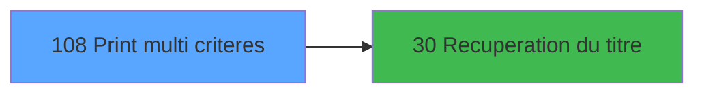

# GES IDE 108 - Print multi criteres

> **Analyse**: Phases 1-4 2026-02-03 11:53 -> 11:53 (15s) | Assemblage 11:53
> **Pipeline**: V7.2 Enrichi
> **Structure**: 4 onglets (Resume | Ecrans | Donnees | Connexions)

<!-- TAB:Resume -->

## 1. FICHE D'IDENTITE

| Attribut | Valeur |
|----------|--------|
| Projet | GES |
| IDE Position | 108 |
| Nom Programme | Print multi criteres |
| Fichier source | `Prg_108.xml` |
| Dossier IDE | Telephone |
| Taches | 5 (4 ecrans visibles) |
| Tables modifiees | 0 |
| Programmes appeles | 1 |

## 2. DESCRIPTION FONCTIONNELLE

**Print multi criteres** assure la gestion complete de ce processus, accessible depuis [Menu Telephone (IDE 107)](GES-IDE-107.md).

Le flux de traitement s'organise en **1 blocs fonctionnels** :

- **Traitement** (5 taches) : traitements metier divers

**Logique metier** : 3 regles identifiees couvrant conditions metier.

Detail : phases du traitement

#### Phase 1 : Traitement (5 taches)

- **108** - Telephone reporting **[[ECRAN]](#ecran-t1)**
- **108.1** - load combo prefix
- **108.2** - Veuillez patienter ... **[[ECRAN]](#ecran-t3)**
- **108.3** - Veuillez patienter ... **[[ECRAN]](#ecran-t4)**
- **108.4** - Veuillez patienter ... **[[ECRAN]](#ecran-t5)**

Delegue a : [Recuperation du titre (IDE 30)](GES-IDE-30.md)

## 3. BLOCS FONCTIONNELS

### 3.1 Traitement (5 taches)

Traitements internes.

---

#### 108 - Telephone reporting [[ECRAN]](#ecran-t1)

**Role** : Traitement : Telephone reporting.
**Ecran** : 893 x 313 DLU (MDI) | [Voir mockup](#ecran-t1)

4 sous-taches directes

| Tache | Nom | Bloc |
|-------|-----|------|
| [108.1](#t2) | load combo prefix | Traitement |
| [108.2](#t3) | Veuillez patienter ... **[[ECRAN]](#ecran-t3)** | Traitement |
| [108.3](#t4) | Veuillez patienter ... **[[ECRAN]](#ecran-t4)** | Traitement |
| [108.4](#t5) | Veuillez patienter ... **[[ECRAN]](#ecran-t5)** | Traitement |

**Delegue a** : [Recuperation du titre (IDE 30)](GES-IDE-30.md)

---

#### 108.1 - load combo prefix

**Role** : Traitement : load combo prefix.
**Variables liees** : K (W0 prefix), S (v.combo prefix)
**Delegue a** : [Recuperation du titre (IDE 30)](GES-IDE-30.md)

---

#### 108.2 - Veuillez patienter ... [[ECRAN]](#ecran-t3)

**Role** : Traitement : Veuillez patienter ....
**Ecran** : 422 x 56 DLU (MDI) | [Voir mockup](#ecran-t3)
**Delegue a** : [Recuperation du titre (IDE 30)](GES-IDE-30.md)

---

#### 108.3 - Veuillez patienter ... [[ECRAN]](#ecran-t4)

**Role** : Traitement : Veuillez patienter ....
**Ecran** : 422 x 56 DLU (MDI) | [Voir mockup](#ecran-t4)
**Delegue a** : [Recuperation du titre (IDE 30)](GES-IDE-30.md)

---

#### 108.4 - Veuillez patienter ... [[ECRAN]](#ecran-t5)

**Role** : Traitement : Veuillez patienter ....
**Ecran** : 422 x 56 DLU (MDI) | [Voir mockup](#ecran-t5)
**Delegue a** : [Recuperation du titre (IDE 30)](GES-IDE-30.md)

## 5. REGLES METIER

3 regles identifiees:

### Autres (3 regles)

#### [RM-001] Traitement si W0 poste [I] est non nul

| Element | Detail |
|---------|--------|
| **Condition** | `W0 poste [I]<>0` |
| **Si vrai** | 'E' |
| **Si faux** | 'C') |
| **Variables** | I (W0 poste) |
| **Expression source** | Expression 3 : `IF (W0 poste [I]<>0,'E','C')` |
| **Exemple** | Si W0 poste [I]<>0 → 'E'. Sinon → 'C') |

#### [RM-002] Condition toujours fausse (flag inactif)

| Element | Detail |
|---------|--------|
| **Condition** | `W0 poste [I]<>0 AND W0 code autocom [H]<>0` |
| **Si vrai** | 'FALSE'LOG |
| **Si faux** | W0 Sub total [N]) |
| **Variables** | H (W0 code autocom), I (W0 poste), N (W0 Sub total) |
| **Expression source** | Expression 6 : `IF (W0 poste [I]<>0 AND W0 code autocom [H]<>0,'FALSE'LOG,W0` |
| **Exemple** | Si W0 poste [I]<>0 AND W0 code autocom [H]<>0 → 'FALSE'LOG. Sinon → W0 Sub total [N]) |

#### [RM-003] Traitement conditionnel si W0 code autocom [H] est a zero

| Element | Detail |
|---------|--------|
| **Condition** | `W0 code autocom [H]=0` |
| **Si vrai** | W0 prefix [K] |
| **Si faux** | '') |
| **Variables** | H (W0 code autocom), K (W0 prefix) |
| **Expression source** | Expression 12 : `IF (W0 code autocom [H]=0,W0 prefix [K],'')` |
| **Exemple** | Si W0 code autocom [H]=0 → W0 prefix [K]. Sinon → '') |

## 6. CONTEXTE

- **Appele par**: [Menu Telephone (IDE 107)](GES-IDE-107.md)
- **Appelle**: 1 programmes | **Tables**: 2 (W:0 R:2 L:0) | **Taches**: 5 | **Expressions**: 20

<!-- TAB:Ecrans -->

## 8. ECRANS

### 8.1 Forms visibles (4 / 5)

| # | Position | Tache | Nom | Type | Largeur | Hauteur | Bloc |
|---|----------|-------|-----|------|---------|---------|------|
| 1 | 108 | 108 | Telephone reporting | MDI | 893 | 313 | Traitement |
| 2 | 108.2 | 108.2 | Veuillez patienter ... | MDI | 422 | 56 | Traitement |
| 3 | 108.3 | 108.3 | Veuillez patienter ... | MDI | 422 | 56 | Traitement |
| 4 | 108.4 | 108.4 | Veuillez patienter ... | MDI | 422 | 56 | Traitement |

### 8.2 Mockups Ecrans

---

#### 108 - Telephone reporting
**Tache** : [108](#t1) | **Type** : MDI | **Dimensions** : 893 x 313 DLU
**Bloc** : Traitement | **Titre IDE** : Telephone reporting

<!-- FORM-DATA:
{
    "width":  893,
    "vFactor":  8,
    "type":  "MDI",
    "hFactor":  8,
    "controls":  [
                     {
                         "x":  0,
                         "type":  "label",
                         "var":  "",
                         "y":  0,
                         "w":  892,
                         "fmt":  "",
                         "name":  "",
                         "h":  19,
                         "color":  "",
                         "text":  "",
                         "parent":  null
                     },
                     {
                         "x":  220,
                         "type":  "label",
                         "var":  "",
                         "y":  25,
                         "w":  452,
                         "fmt":  "",
                         "name":  "",
                         "h":  12,
                         "color":  "",
                         "text":  "Multi Criteria Reporting",
                         "parent":  null
                     },
                     {
                         "x":  9,
                         "type":  "label",
                         "var":  "",
                         "y":  40,
                         "w":  872,
                         "fmt":  "",
                         "name":  "",
                         "h":  209,
                         "color":  "",
                         "text":  "Criterias",
                         "parent":  null
                     },
                     {
                         "x":  39,
                         "type":  "label",
                         "var":  "",
                         "y":  56,
                         "w":  120,
                         "fmt":  "",
                         "name":  "",
                         "h":  11,
                         "color":  "4",
                         "text":  "Du",
                         "parent":  5
                     },
                     {
                         "x":  338,
                         "type":  "label",
                         "var":  "",
                         "y":  56,
                         "w":  54,
                         "fmt":  "",
                         "name":  "",
                         "h":  11,
                         "color":  "4",
                         "text":  "Au",
                         "parent":  5
                     },
                     {
                         "x":  39,
                         "type":  "label",
                         "var":  "",
                         "y":  78,
                         "w":  120,
                         "fmt":  "",
                         "name":  "",
                         "h":  11,
                         "color":  "",
                         "text":  "Code Autocom",
                         "parent":  5
                     },
                     {
                         "x":  39,
                         "type":  "label",
                         "var":  "",
                         "y":  92,
                         "w":  120,
                         "fmt":  "",
                         "name":  "",
                         "h":  11,
                         "color":  "",
                         "text":  "Poste",
                         "parent":  5
                     },
                     {
                         "x":  39,
                         "type":  "label",
                         "var":  "",
                         "y":  106,
                         "w":  120,
                         "fmt":  "",
                         "name":  "",
                         "h":  11,
                         "color":  "",
                         "text":  "Ligne (GPIN)",
                         "parent":  5
                     },
                     {
                         "x":  39,
                         "type":  "label",
                         "var":  "",
                         "y":  135,
                         "w":  130,
                         "fmt":  "",
                         "name":  "",
                         "h":  10,
                         "color":  "",
                         "text":  "Type d\u0027appel",
                         "parent":  5
                     },
                     {
                         "x":  392,
                         "type":  "label",
                         "var":  "",
                         "y":  139,
                         "w":  72,
                         "fmt":  "",
                         "name":  "",
                         "h":  11,
                         "color":  "",
                         "text":  "Tri",
                         "parent":  5
                     },
                     {
                         "x":  513,
                         "type":  "label",
                         "var":  "",
                         "y":  174,
                         "w":  91,
                         "fmt":  "",
                         "name":  "",
                         "h":  12,
                         "color":  "",
                         "text":  "Sous-total",
                         "parent":  5
                     },
                     {
                         "x":  620,
                         "type":  "label",
                         "var":  "",
                         "y":  212,
                         "w":  91,
                         "fmt":  "",
                         "name":  "",
                         "h":  12,
                         "color":  "",
                         "text":  "Details",
                         "parent":  5
                     },
                     {
                         "x":  9,
                         "type":  "label",
                         "var":  "",
                         "y":  256,
                         "w":  462,
                         "fmt":  "",
                         "name":  "",
                         "h":  27,
                         "color":  "",
                         "text":  "Output",
                         "parent":  null
                     },
                     {
                         "x":  500,
                         "type":  "label",
                         "var":  "",
                         "y":  256,
                         "w":  381,
                         "fmt":  "",
                         "name":  "",
                         "h":  27,
                         "color":  "",
                         "text":  "Security",
                         "parent":  null
                     },
                     {
                         "x":  0,
                         "type":  "label",
                         "var":  "",
                         "y":  289,
                         "w":  892,
                         "fmt":  "",
                         "name":  "",
                         "h":  24,
                         "color":  "",
                         "text":  "",
                         "parent":  null
                     },
                     {
                         "x":  186,
                         "type":  "edit",
                         "var":  "",
                         "y":  56,
                         "w":  106,
                         "fmt":  "DD/MM/YYYY",
                         "name":  "W0 date debut",
                         "h":  11,
                         "color":  "6",
                         "text":  "",
                         "parent":  5
                     },
                     {
                         "x":  397,
                         "type":  "edit",
                         "var":  "",
                         "y":  56,
                         "w":  106,
                         "fmt":  "DD/MM/YYYY",
                         "name":  "W0 date fin",
                         "h":  11,
                         "color":  "6",
                         "text":  "",
                         "parent":  5
                     },
                     {
                         "x":  186,
                         "type":  "edit",
                         "var":  "",
                         "y":  78,
                         "w":  106,
                         "fmt":  "",
                         "name":  "W0 code autocom",
                         "h":  11,
                         "color":  "6",
                         "text":  "",
                         "parent":  5
                     },
                     {
                         "x":  186,
                         "type":  "edit",
                         "var":  "",
                         "y":  92,
                         "w":  106,
                         "fmt":  "",
                         "name":  "W0 poste",
                         "h":  11,
                         "color":  "6",
                         "text":  "",
                         "parent":  5
                     },
                     {
                         "x":  186,
                         "type":  "edit",
                         "var":  "",
                         "y":  106,
                         "w":  106,
                         "fmt":  "",
                         "name":  "W0 ligne (GPIN)",
                         "h":  11,
                         "color":  "6",
                         "text":  "",
                         "parent":  5
                     },
                     {
                         "x":  186,
                         "type":  "listbox",
                         "var":  "",
                         "y":  134,
                         "w":  188,
                         "fmt":  "",
                         "name":  "W0 prefix",
                         "h":  67,
                         "color":  "110",
                         "text":  " ,0  Administratif,5  Sans code,9  GM GO",
                         "parent":  null
                     },
                     {
                         "x":  76,
                         "type":  "radio",
                         "var":  "",
                         "y":  264,
                         "w":  357,
                         "fmt":  "",
                         "name":  "W0 output",
                         "h":  15,
                         "color":  "",
                         "text":  "",
                         "parent":  null
                     },
                     {
                         "x":  467,
                         "type":  "radio",
                         "var":  "",
                         "y":  135,
                         "w":  200,
                         "fmt":  "",
                         "name":  "W0 Sort",
                         "h":  29,
                         "color":  "",
                         "text":  "Code / Extension,Extension / Code",
                         "parent":  null
                     },
                     {
                         "x":  600,
                         "type":  "radio",
                         "var":  "",
                         "y":  172,
                         "w":  101,
                         "fmt":  "",
                         "name":  "W0 Sub total",
                         "h":  29,
                         "color":  "",
                         "text":  "Oui,Non",
                         "parent":  null
                     },
                     {
                         "x":  709,
                         "type":  "radio",
                         "var":  "",
                         "y":  210,
                         "w":  101,
                         "fmt":  "",
                         "name":  "W0 details",
                         "h":  29,
                         "color":  "",
                         "text":  "Oui,Non",
                         "parent":  null
                     },
                     {
                         "x":  613,
                         "type":  "checkbox",
                         "var":  "",
                         "y":  267,
                         "w":  245,
                         "fmt":  "",
                         "name":  "W0 show code",
                         "h":  12,
                         "color":  "",
                         "text":  "Show code ?",
                         "parent":  21
                     },
                     {
                         "x":  565,
                         "type":  "button",
                         "var":  "",
                         "y":  292,
                         "w":  158,
                         "fmt":  "\u0026Ok",
                         "name":  "Bouton Ok",
                         "h":  18,
                         "color":  "",
                         "text":  "",
                         "parent":  null
                     },
                     {
                         "x":  5,
                         "type":  "edit",
                         "var":  "",
                         "y":  6,
                         "w":  267,
                         "fmt":  "20",
                         "name":  "",
                         "h":  8,
                         "color":  "",
                         "text":  "",
                         "parent":  1
                     },
                     {
                         "x":  605,
                         "type":  "edit",
                         "var":  "",
                         "y":  6,
                         "w":  280,
                         "fmt":  "WWW DD MMM YYYYZ",
                         "name":  "",
                         "h":  8,
                         "color":  "",
                         "text":  "",
                         "parent":  1
                     },
                     {
                         "x":  752,
                         "type":  "image",
                         "var":  "",
                         "y":  46,
                         "w":  126,
                         "fmt":  "",
                         "name":  "",
                         "h":  56,
                         "color":  "",
                         "text":  "",
                         "parent":  null
                     },
                     {
                         "x":  728,
                         "type":  "button",
                         "var":  "",
                         "y":  292,
                         "w":  158,
                         "fmt":  "A\u0026bandonner",
                         "name":  "",
                         "h":  18,
                         "color":  "",
                         "text":  "",
                         "parent":  null
                     }
                 ],
    "taskId":  "108",
    "height":  313
}
-->

<strong>Champs : 8 champs</strong>

| Pos (x,y) | Nom | Variable | Type |
|-----------|-----|----------|------|
| 186,56 | W0 date debut | - | edit |
| 397,56 | W0 date fin | - | edit |
| 186,78 | W0 code autocom | - | edit |
| 186,92 | W0 poste | - | edit |
| 186,106 | W0 ligne (GPIN) | - | edit |
| 613,267 | W0 show code | - | checkbox |
| 5,6 | 20 | - | edit |
| 605,6 | WWW DD MMM YYYYZ | - | edit |

<strong>Boutons : 2 boutons</strong>

| Bouton | Pos (x,y) | Action |
|--------|-----------|--------|
| Ok | 565,292 | Valide la saisie et enregistre |
| Abandonner | 728,292 | Annule et retour au menu |

---

#### 108.2 - Veuillez patienter ...
**Tache** : [108.2](#t3) | **Type** : MDI | **Dimensions** : 422 x 56 DLU
**Bloc** : Traitement | **Titre IDE** : Veuillez patienter ...

<!-- FORM-DATA:
{
    "width":  422,
    "vFactor":  8,
    "type":  "MDI",
    "hFactor":  8,
    "controls":  [
                     {
                         "x":  0,
                         "type":  "label",
                         "var":  "",
                         "y":  0,
                         "w":  423,
                         "fmt":  "",
                         "name":  "",
                         "h":  29,
                         "color":  "",
                         "text":  "",
                         "parent":  null
                     },
                     {
                         "x":  117,
                         "type":  "label",
                         "var":  "",
                         "y":  10,
                         "w":  275,
                         "fmt":  "",
                         "name":  "",
                         "h":  8,
                         "color":  "7",
                         "text":  "Impression en cours",
                         "parent":  null
                     },
                     {
                         "x":  0,
                         "type":  "label",
                         "var":  "",
                         "y":  29,
                         "w":  423,
                         "fmt":  "",
                         "name":  "",
                         "h":  27,
                         "color":  "",
                         "text":  "",
                         "parent":  null
                     },
                     {
                         "x":  72,
                         "type":  "label",
                         "var":  "",
                         "y":  39,
                         "w":  323,
                         "fmt":  "",
                         "name":  "",
                         "h":  8,
                         "color":  "",
                         "text":  "Impression detail appel / code",
                         "parent":  null
                     },
                     {
                         "x":  1,
                         "type":  "image",
                         "var":  "",
                         "y":  2,
                         "w":  72,
                         "fmt":  "",
                         "name":  "",
                         "h":  25,
                         "color":  "",
                         "text":  "",
                         "parent":  null
                     }
                 ],
    "taskId":  "108.2",
    "height":  56
}
-->

---

#### 108.3 - Veuillez patienter ...
**Tache** : [108.3](#t4) | **Type** : MDI | **Dimensions** : 422 x 56 DLU
**Bloc** : Traitement | **Titre IDE** : Veuillez patienter ...

<!-- FORM-DATA:
{
    "width":  422,
    "vFactor":  8,
    "type":  "MDI",
    "hFactor":  8,
    "controls":  [
                     {
                         "x":  0,
                         "type":  "label",
                         "var":  "",
                         "y":  0,
                         "w":  423,
                         "fmt":  "",
                         "name":  "",
                         "h":  29,
                         "color":  "",
                         "text":  "",
                         "parent":  null
                     },
                     {
                         "x":  117,
                         "type":  "label",
                         "var":  "",
                         "y":  10,
                         "w":  275,
                         "fmt":  "",
                         "name":  "",
                         "h":  8,
                         "color":  "7",
                         "text":  "Impression en cours",
                         "parent":  null
                     },
                     {
                         "x":  0,
                         "type":  "label",
                         "var":  "",
                         "y":  29,
                         "w":  423,
                         "fmt":  "",
                         "name":  "",
                         "h":  27,
                         "color":  "",
                         "text":  "",
                         "parent":  null
                     },
                     {
                         "x":  72,
                         "type":  "label",
                         "var":  "",
                         "y":  39,
                         "w":  323,
                         "fmt":  "",
                         "name":  "",
                         "h":  8,
                         "color":  "",
                         "text":  "Impression detail appel / code",
                         "parent":  null
                     },
                     {
                         "x":  1,
                         "type":  "image",
                         "var":  "",
                         "y":  2,
                         "w":  72,
                         "fmt":  "",
                         "name":  "",
                         "h":  25,
                         "color":  "",
                         "text":  "",
                         "parent":  null
                     }
                 ],
    "taskId":  "108.3",
    "height":  56
}
-->

---

#### 108.4 - Veuillez patienter ...
**Tache** : [108.4](#t5) | **Type** : MDI | **Dimensions** : 422 x 56 DLU
**Bloc** : Traitement | **Titre IDE** : Veuillez patienter ...

<!-- FORM-DATA:
{
    "width":  422,
    "vFactor":  8,
    "type":  "MDI",
    "hFactor":  8,
    "controls":  [
                     {
                         "x":  0,
                         "type":  "label",
                         "var":  "",
                         "y":  0,
                         "w":  423,
                         "fmt":  "",
                         "name":  "",
                         "h":  29,
                         "color":  "",
                         "text":  "",
                         "parent":  null
                     },
                     {
                         "x":  117,
                         "type":  "label",
                         "var":  "",
                         "y":  10,
                         "w":  275,
                         "fmt":  "",
                         "name":  "",
                         "h":  8,
                         "color":  "7",
                         "text":  "Impression en cours",
                         "parent":  null
                     },
                     {
                         "x":  0,
                         "type":  "label",
                         "var":  "",
                         "y":  29,
                         "w":  423,
                         "fmt":  "",
                         "name":  "",
                         "h":  27,
                         "color":  "",
                         "text":  "",
                         "parent":  null
                     },
                     {
                         "x":  72,
                         "type":  "label",
                         "var":  "",
                         "y":  39,
                         "w":  323,
                         "fmt":  "",
                         "name":  "",
                         "h":  8,
                         "color":  "",
                         "text":  "Impression detail appel / code",
                         "parent":  null
                     },
                     {
                         "x":  1,
                         "type":  "image",
                         "var":  "",
                         "y":  2,
                         "w":  72,
                         "fmt":  "",
                         "name":  "",
                         "h":  25,
                         "color":  "",
                         "text":  "",
                         "parent":  null
                     }
                 ],
    "taskId":  "108.4",
    "height":  56
}
-->

## 9. NAVIGATION

### 9.1 Enchainement des ecrans

**Detail par enchainement :**

| Depuis | Action | Vers | Retour |
|--------|--------|------|--------|
| Telephone reporting | Recuperation donnees | [Recuperation du titre (IDE 30)](GES-IDE-30.md) | Retour ecran |

### 9.3 Structure hierarchique (5 taches)

| Position | Tache | Type | Dimensions | Bloc |
|----------|-------|------|------------|------|
| **108.1** | [**Telephone reporting** (108)](#t1) [mockup](#ecran-t1) | MDI | 893x313 | Traitement |
| 108.1.1 | [load combo prefix (108.1)](#t2) | MDI | - | |
| 108.1.2 | [Veuillez patienter ... (108.2)](#t3) [mockup](#ecran-t3) | MDI | 422x56 | |
| 108.1.3 | [Veuillez patienter ... (108.3)](#t4) [mockup](#ecran-t4) | MDI | 422x56 | |
| 108.1.4 | [Veuillez patienter ... (108.4)](#t5) [mockup](#ecran-t5) | MDI | 422x56 | |

### 9.4 Algorigramme

> **Legende**: Vert = START/END OK | Rouge = END KO | Bleu = Decisions
> *Algorigramme auto-genere. Utiliser `/algorigramme` pour une synthese metier detaillee.*

<!-- TAB:Donnees -->

## 10. TABLES

### Tables utilisees (2)

| ID | Nom | Description | Type | R | W | L | Usages |
|----|-----|-------------|------|---|---|---|--------|
| 60 | table_code_acces_tca |  | DB | R |   |   | 1 |
| 155 | historique_pabx | Historique / journal | DB | R |   |   | 3 |

### Colonnes par table (2 / 2 tables avec colonnes identifiees)

Table 60 - table_code_acces_tca (R) - 1 usages

| Lettre | Variable | Acces | Type |
|--------|----------|-------|------|
| B | W1 total code | R | Numeric |
| D | W1 total time code | R | Time |
| H | W0 code autocom | R | Numeric |
| P | W0 show code | R | Logical |

Table 155 - historique_pabx (R) - 3 usages

| Lettre | Variable | Acces | Type |
|--------|----------|-------|------|
| A | W1 total poste | R | Numeric |
| B | W1 total code | R | Numeric |
| C | W1 total | R | Numeric |
| D | W1 total time code | R | Time |
| E | W1 total time poste | R | Time |
| F | W1 total time | R | Time |
| G | W1 config.imprimante | R | Alpha |

## 11. VARIABLES

### 11.1 Parametres entrants (5)

Variables recues du programme appelant ([Menu Telephone (IDE 107)](GES-IDE-107.md)).

| Lettre | Nom | Type | Usage dans |
|--------|-----|------|-----------|
| A | P0 societe | Alpha | - |
| B | P0 Nb decimale | Numeric | - |
| C | P0 masque montant | Alpha | - |
| D | P0 masque cumul | Alpha | - |
| E | P0 nom village | Alpha | - |

### 11.2 Variables de session (2)

Variables persistantes pendant toute la session.

| Lettre | Nom | Type | Usage dans |
|--------|-----|------|-----------|
| R | v.titre | Alpha | - |
| S | v.combo prefix | Alpha | [108.1](#t2) |

### 11.3 Variables de travail (11)

Variables internes au programme.

| Lettre | Nom | Type | Usage dans |
|--------|-----|------|-----------|
| F | W0 date debut | Date | 1x calcul interne |
| G | W0 date fin | Date | 1x calcul interne |
| H | W0 code autocom | Numeric | 5x calcul interne |
| I | W0 poste | Numeric | 4x calcul interne |
| J | W0 ligne (GPIN) | Numeric | - |
| K | W0 prefix | Alpha | [108.1](#t2) |
| L | W0 output | Alpha | - |
| M | W0 Sort | Alpha | 2x calcul interne |
| N | W0 Sub total | Logical | 1x calcul interne |
| O | W0 details | Logical | - |
| P | W0 show code | Logical | - |

### 11.4 Autres (1)

Variables diverses.

| Lettre | Nom | Type | Usage dans |
|--------|-----|------|-----------|
| Q | Bouton Ok | Alpha | - |

Toutes les 19 variables (liste complete)

| Cat | Lettre | Nom Variable | Type |
|-----|--------|--------------|------|
| P0 | **A** | P0 societe | Alpha |
| P0 | **B** | P0 Nb decimale | Numeric |
| P0 | **C** | P0 masque montant | Alpha |
| P0 | **D** | P0 masque cumul | Alpha |
| P0 | **E** | P0 nom village | Alpha |
| W0 | **F** | W0 date debut | Date |
| W0 | **G** | W0 date fin | Date |
| W0 | **H** | W0 code autocom | Numeric |
| W0 | **I** | W0 poste | Numeric |
| W0 | **J** | W0 ligne (GPIN) | Numeric |
| W0 | **K** | W0 prefix | Alpha |
| W0 | **L** | W0 output | Alpha |
| W0 | **M** | W0 Sort | Alpha |
| W0 | **N** | W0 Sub total | Logical |
| W0 | **O** | W0 details | Logical |
| W0 | **P** | W0 show code | Logical |
| V. | **R** | v.titre | Alpha |
| V. | **S** | v.combo prefix | Alpha |
| Autre | **Q** | Bouton Ok | Alpha |

## 12. EXPRESSIONS

**20 / 20 expressions decodees (100%)**

### 12.1 Repartition par type

| Type | Expressions | Regles |
|------|-------------|--------|
| CONDITION | 9 | 2 |
| CAST_LOGIQUE | 2 | 5 |
| CONSTANTE | 2 | 0 |
| DATE | 2 | 0 |
| NEGATION | 1 | 0 |
| OTHER | 2 | 0 |
| REFERENCE_VG | 1 | 0 |
| STRING | 1 | 0 |

### 12.2 Expressions cles par type

#### CONDITION (9 expressions)

| Type | IDE | Expression | Regle |
|------|-----|------------|-------|
| CONDITION | 12 | `IF (W0 code autocom [H]=0,W0 prefix [K],'')` | [RM-003](#rm-RM-003) |
| CONDITION | 3 | `IF (W0 poste [I]<>0,'E','C')` | [RM-001](#rm-RM-001) |
| CONDITION | 10 | `W0 prefix [K]<>''` | - |
| CONDITION | 13 | `W0 code autocom [H]=0` | - |
| CONDITION | 19 | `W0 date fin [G]<W0 date debut [F]` | - |
| ... | | *+4 autres* | |

#### CAST_LOGIQUE (2 expressions)

| Type | IDE | Expression | Regle |
|------|-----|------------|-------|
| CAST_LOGIQUE | 6 | `IF (W0 poste [I]<>0 AND W0 code autocom [H]<>0,'FALSE'LOG,W0 Sub total [N])` | [RM-002](#rm-RM-002) |
| CAST_LOGIQUE | 2 | `'FALSE'LOG` | - |

#### CONSTANTE (2 expressions)

| Type | IDE | Expression | Regle |
|------|-----|------------|-------|
| CONSTANTE | 18 | `159` | - |
| CONSTANTE | 11 | `'S'` | - |

#### DATE (2 expressions)

| Type | IDE | Expression | Regle |
|------|-----|------------|-------|
| DATE | 20 | `Date ()` | - |
| DATE | 17 | `Date ()` | - |

#### NEGATION (1 expressions)

| Type | IDE | Expression | Regle |
|------|-----|------------|-------|
| NEGATION | 5 | `NOT (W0 poste [I]<>0 AND W0 code autocom [H]<>0)` | - |

#### OTHER (2 expressions)

| Type | IDE | Expression | Regle |
|------|-----|------------|-------|
| OTHER | 15 | `SetCrsr (1)` | - |
| OTHER | 14 | `SetCrsr (2)` | - |

#### REFERENCE_VG (1 expressions)

| Type | IDE | Expression | Regle |
|------|-----|------------|-------|
| REFERENCE_VG | 16 | `VG2` | - |

#### STRING (1 expressions)

| Type | IDE | Expression | Regle |
|------|-----|------------|-------|
| STRING | 1 | `RTrim (v.combo prefix [S])` | - |

<!-- TAB:Connexions -->

## 13. GRAPHE D'APPELS

### 13.1 Chaine depuis Main (Callers)

Main -> ... -> [Menu Telephone (IDE 107)](GES-IDE-107.md) -> **Print multi criteres (IDE 108)**

### 13.2 Callers

| IDE | Nom Programme | Nb Appels |
|-----|---------------|-----------|
| [107](GES-IDE-107.md) | Menu Telephone | 1 |

### 13.3 Callees (programmes appeles)

### 13.4 Detail Callees avec contexte

| IDE | Nom Programme | Appels | Contexte |
|-----|---------------|--------|----------|
| [30](GES-IDE-30.md) | Recuperation du titre | 1 | Recuperation donnees |

## 14. RECOMMANDATIONS MIGRATION

### 14.1 Profil du programme

| Metrique | Valeur | Impact migration |
|----------|--------|-----------------|
| Lignes de logique | 163 | Programme compact |
| Expressions | 20 | Peu de logique |
| Tables WRITE | 0 | Impact faible |
| Sous-programmes | 1 | Peu de dependances |
| Ecrans visibles | 4 | Quelques ecrans |
| Code desactive | 0% (0 / 163) | Code sain |
| Regles metier | 3 | Quelques regles a preserver |

### 14.2 Plan de migration par bloc

#### Traitement (5 taches: 4 ecrans, 1 traitement)

- **Strategie** : Orchestrateur avec 4 ecrans (Razor/React) et 1 traitements backend (services).
- Les ecrans deviennent des composants UI, les traitements invisibles deviennent des services injectables.
- 1 sous-programme(s) a migrer ou a reutiliser depuis les services existants.
- Decomposer les taches en services unitaires testables.

### 14.3 Dependances critiques

| Dependance | Type | Appels | Impact |
|------------|------|--------|--------|
| [Recuperation du titre (IDE 30)](GES-IDE-30.md) | Sous-programme | 1x | Normale - Recuperation donnees |

---
*Spec DETAILED generee par Pipeline V7.2 - 2026-02-03 11:53*
