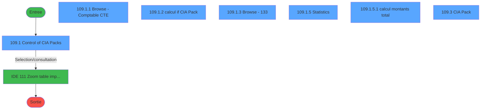
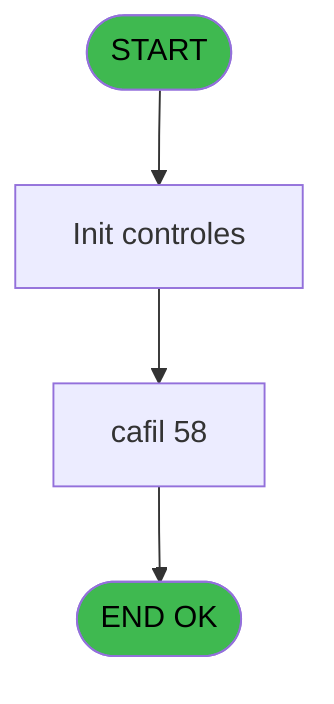
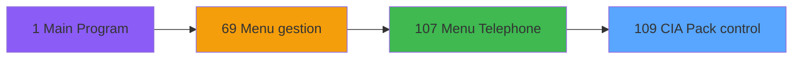
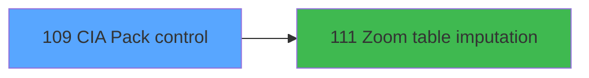

# GES IDE 109 - CIA Pack control

> **Analyse**: Phases 1-4 2026-02-03 11:53 -> 11:54 (13s) | Assemblage 11:54
> **Pipeline**: V7.2 Enrichi
> **Structure**: 4 onglets (Resume | Ecrans | Donnees | Connexions)

<!-- TAB:Resume -->

## 1. FICHE D'IDENTITE

| Attribut | Valeur |
|----------|--------|
| Projet | GES |
| IDE Position | 109 |
| Nom Programme | CIA Pack control |
| Fichier source | `Prg_109.xml` |
| Dossier IDE | Telephone |
| Taches | 11 (7 ecrans visibles) |
| Tables modifiees | 0 |
| Programmes appeles | 1 |

## 2. DESCRIPTION FONCTIONNELLE

**CIA Pack control** assure la gestion complete de ce processus, accessible depuis [Menu Telephone (IDE 107)](GES-IDE-107.md).

Le flux de traitement s'organise en **2 blocs fonctionnels** :

- **Traitement** (7 taches) : traitements metier divers
- **Calcul** (4 taches) : calculs de montants, stocks ou compteurs

Detail : phases du traitement

#### Phase 1 : Traitement (7 taches)

- **109** - CIA Pack control **[[ECRAN]](#ecran-t1)**
- **109.1** - Control of CIA Packs **[[ECRAN]](#ecran-t2)**
- **109.1.3** - Browse - 133 **[[ECRAN]](#ecran-t5)**
- **109.1.5** - Statistics **[[ECRAN]](#ecran-t7)**
- **109.1.5.2** - load combo prefix
- **109.2** - get CIA pack limit
- **109.3** - CIA Pack **[[ECRAN]](#ecran-t11)**

#### Phase 2 : Calcul (4 taches)

- **109.1.1** - Browse - Comptable        CTE **[[ECRAN]](#ecran-t3)**
- **109.1.2** - calcul if CIA Pack **[[ECRAN]](#ecran-t4)**
- **109.1.4** - calcul montants **[[ECRAN]](#ecran-t6)**
- **109.1.5.1** - calcul montants total **[[ECRAN]](#ecran-t8)**

## 3. BLOCS FONCTIONNELS

### 3.1 Traitement (7 taches)

Traitements internes.

---

#### 109 - CIA Pack control [[ECRAN]](#ecran-t1)

**Role** : Tache d'orchestration : point d'entree du programme (7 sous-taches). Coordonne l'enchainement des traitements.
**Ecran** : 517 x 262 DLU (MDI) | [Voir mockup](#ecran-t1)

6 sous-taches directes

| Tache | Nom | Bloc |
|-------|-----|------|
| [109.1](#t2) | Control of CIA Packs **[[ECRAN]](#ecran-t2)** | Traitement |
| [109.1.3](#t5) | Browse - 133 **[[ECRAN]](#ecran-t5)** | Traitement |
| [109.1.5](#t7) | Statistics **[[ECRAN]](#ecran-t7)** | Traitement |
| [109.1.5.2](#t9) | load combo prefix | Traitement |
| [109.2](#t10) | get CIA pack limit | Traitement |
| [109.3](#t11) | CIA Pack **[[ECRAN]](#ecran-t11)** | Traitement |

**Variables liees** : A (v.CIA pack limit), B (v.CIA pack exist), E (v.cout CIA PACK)

---

#### 109.1 - Control of CIA Packs [[ECRAN]](#ecran-t2)

**Role** : Traitement : Control of CIA Packs.
**Ecran** : 534 x 313 DLU (MDI) | [Voir mockup](#ecran-t2)

---

#### 109.1.3 - Browse - 133 [[ECRAN]](#ecran-t5)

**Role** : Traitement : Browse - 133.
**Ecran** : 516 x 97 DLU (Modal) | [Voir mockup](#ecran-t5)

---

#### 109.1.5 - Statistics [[ECRAN]](#ecran-t7)

**Role** : Traitement : Statistics.
**Ecran** : 279 x 134 DLU (MDI) | [Voir mockup](#ecran-t7)

---

#### 109.1.5.2 - load combo prefix

**Role** : Traitement : load combo prefix.

---

#### 109.2 - get CIA pack limit

**Role** : Consultation/chargement : get CIA pack limit.
**Variables liees** : A (v.CIA pack limit), B (v.CIA pack exist), E (v.cout CIA PACK)

---

#### 109.3 - CIA Pack [[ECRAN]](#ecran-t11)

**Role** : Traitement : CIA Pack.
**Ecran** : 238 x 62 DLU (MDI) | [Voir mockup](#ecran-t11)
**Variables liees** : A (v.CIA pack limit), B (v.CIA pack exist), E (v.cout CIA PACK)

### 3.2 Calcul (4 taches)

Calculs metier : montants, stocks, compteurs.

---

#### 109.1.1 - Browse - Comptable        CTE [[ECRAN]](#ecran-t3)

**Role** : Traitement : Browse - Comptable        CTE.
**Ecran** : 505 x 100 DLU (Modal) | [Voir mockup](#ecran-t3)
**Variables liees** : G (v.imputation-comptable)

---

#### 109.1.2 - calcul if CIA Pack [[ECRAN]](#ecran-t4)

**Role** : Calcul : calcul if CIA Pack.
**Ecran** : 516 x 86 DLU (Modal) | [Voir mockup](#ecran-t4)
**Variables liees** : A (v.CIA pack limit), B (v.CIA pack exist), E (v.cout CIA PACK)

---

#### 109.1.4 - calcul montants [[ECRAN]](#ecran-t6)

**Role** : Calcul : calcul montants.
**Ecran** : 516 x 86 DLU (Modal) | [Voir mockup](#ecran-t6)

---

#### 109.1.5.1 - calcul montants total [[ECRAN]](#ecran-t8)

**Role** : Calcul : calcul montants total.
**Ecran** : 171 x 93 DLU (MDI) | [Voir mockup](#ecran-t8)
**Variables liees** : C (v.total Cout Client), D (v.total Duree)

## 5. REGLES METIER

*(Aucune regle metier identifiee)*

## 6. CONTEXTE

- **Appele par**: [Menu Telephone (IDE 107)](GES-IDE-107.md)
- **Appelle**: 1 programmes | **Tables**: 7 (W:0 R:5 L:2) | **Taches**: 11 | **Expressions**: 1

<!-- TAB:Ecrans -->

## 8. ECRANS

### 8.1 Forms visibles (7 / 11)

| # | Position | Tache | Nom | Type | Largeur | Hauteur | Bloc |
|---|----------|-------|-----|------|---------|---------|------|
| 1 | 109.1 | 109.1 | Control of CIA Packs | MDI | 534 | 313 | Traitement |
| 2 | 109.1.1 | 109.1.1 | Browse - Comptable        CTE | Modal | 505 | 100 | Calcul |
| 3 | 109.1.2 | 109.1.2 | calcul if CIA Pack | Modal | 516 | 86 | Calcul |
| 4 | 109.1.3 | 109.1.3 | Browse - 133 | Modal | 516 | 97 | Traitement |
| 5 | 109.1.5 | 109.1.5 | Statistics | MDI | 279 | 134 | Traitement |
| 6 | 109.1.5.1 | 109.1.5.1 | calcul montants total | MDI | 171 | 93 | Calcul |
| 7 | 109.3 | 109.3 | CIA Pack | MDI | 238 | 62 | Traitement |

### 8.2 Mockups Ecrans

---

#### 109.1 - Control of CIA Packs
**Tache** : [109.1](#t2) | **Type** : MDI | **Dimensions** : 534 x 313 DLU
**Bloc** : Traitement | **Titre IDE** : Control of CIA Packs

<!-- FORM-DATA:
{
    "width":  534,
    "vFactor":  8,
    "type":  "MDI",
    "hFactor":  4,
    "controls":  [
                     {
                         "x":  0,
                         "type":  "label",
                         "var":  "",
                         "y":  0,
                         "w":  517,
                         "fmt":  "",
                         "name":  "",
                         "h":  19,
                         "color":  "",
                         "text":  "",
                         "parent":  null
                     },
                     {
                         "x":  16,
                         "type":  "label",
                         "var":  "",
                         "y":  28,
                         "w":  91,
                         "fmt":  "",
                         "name":  "",
                         "h":  10,
                         "color":  "",
                         "text":  "CIA Pack account",
                         "parent":  null
                     },
                     {
                         "x":  270,
                         "type":  "label",
                         "var":  "",
                         "y":  30,
                         "w":  91,
                         "fmt":  "",
                         "name":  "",
                         "h":  8,
                         "color":  "",
                         "text":  "Imputation comptable",
                         "parent":  null
                     },
                     {
                         "x":  12,
                         "type":  "table",
                         "var":  "",
                         "name":  "",
                         "titleH":  12,
                         "color":  "110",
                         "w":  493,
                         "y":  47,
                         "fmt":  "",
                         "parent":  null,
                         "text":  "",
                         "rowH":  12,
                         "h":  99,
                         "cols":  [
                                      {
                                          "title":  "Code Adhérent",
                                          "layer":  1,
                                          "w":  98
                                      },
                                      {
                                          "title":  "Ligne téléphone",
                                          "layer":  2,
                                          "w":  70
                                      },
                                      {
                                          "title":  "Nom",
                                          "layer":  3,
                                          "w":  238
                                      },
                                      {
                                          "title":  "Poste",
                                          "layer":  4,
                                          "w":  53
                                      },
                                      {
                                          "title":  "",
                                          "layer":  5,
                                          "w":  16
                                      }
                                  ],
                         "rows":  5
                     },
                     {
                         "x":  450,
                         "type":  "label",
                         "var":  "",
                         "y":  147,
                         "w":  53,
                         "fmt":  "",
                         "name":  "",
                         "h":  16,
                         "color":  "6",
                         "text":  "",
                         "parent":  null
                     },
                     {
                         "x":  461,
                         "type":  "label",
                         "var":  "",
                         "y":  149,
                         "w":  8,
                         "fmt":  "",
                         "name":  "",
                         "h":  10,
                         "color":  "144",
                         "text":  "$",
                         "parent":  21
                     },
                     {
                         "x":  475,
                         "type":  "label",
                         "var":  "",
                         "y":  149,
                         "w":  8,
                         "fmt":  "",
                         "name":  "",
                         "h":  10,
                         "color":  "144",
                         "text":  "$",
                         "parent":  21
                     },
                     {
                         "x":  488,
                         "type":  "label",
                         "var":  "",
                         "y":  149,
                         "w":  14,
                         "fmt":  "",
                         "name":  "",
                         "h":  10,
                         "color":  "142",
                         "text":  ")",
                         "parent":  21
                     },
                     {
                         "x":  70,
                         "type":  "label",
                         "var":  "",
                         "y":  277,
                         "w":  47,
                         "fmt":  "",
                         "name":  "",
                         "h":  10,
                         "color":  "",
                         "text":  "Total duree",
                         "parent":  null
                     },
                     {
                         "x":  243,
                         "type":  "label",
                         "var":  "",
                         "y":  277,
                         "w":  84,
                         "fmt":  "",
                         "name":  "",
                         "h":  10,
                         "color":  "",
                         "text":  "Total Cout Client",
                         "parent":  null
                     },
                     {
                         "x":  243,
                         "type":  "label",
                         "var":  "",
                         "y":  288,
                         "w":  84,
                         "fmt":  "",
                         "name":  "",
                         "h":  10,
                         "color":  "",
                         "text":  "Total Cout Operateur",
                         "parent":  null
                     },
                     {
                         "x":  173,
                         "type":  "edit",
                         "var":  "",
                         "y":  288,
                         "w":  66,
                         "fmt":  "",
                         "name":  "v.total Cout Operateur",
                         "h":  10,
                         "color":  "6",
                         "text":  "",
                         "parent":  null
                     },
                     {
                         "x":  173,
                         "type":  "edit",
                         "var":  "",
                         "y":  277,
                         "w":  66,
                         "fmt":  "",
                         "name":  "v.total Cout Client",
                         "h":  10,
                         "color":  "6",
                         "text":  "",
                         "parent":  null
                     },
                     {
                         "x":  118,
                         "type":  "edit",
                         "var":  "",
                         "y":  277,
                         "w":  52,
                         "fmt":  "",
                         "name":  "v.total Duree",
                         "h":  10,
                         "color":  "6",
                         "text":  "",
                         "parent":  null
                     },
                     {
                         "x":  16,
                         "type":  "edit",
                         "var":  "",
                         "y":  61,
                         "w":  49,
                         "fmt":  "",
                         "name":  "AUT code adherent",
                         "h":  8,
                         "color":  "110",
                         "text":  "",
                         "parent":  9
                     },
                     {
                         "x":  81,
                         "type":  "edit",
                         "var":  "",
                         "y":  61,
                         "w":  21,
                         "fmt":  "",
                         "name":  "AUT filiation",
                         "h":  8,
                         "color":  "110",
                         "text":  "",
                         "parent":  9
                     },
                     {
                         "x":  122,
                         "type":  "edit",
                         "var":  "",
                         "y":  61,
                         "w":  50,
                         "fmt":  "",
                         "name":  "AUT ligne telephone",
                         "h":  8,
                         "color":  "110",
                         "text":  "",
                         "parent":  9
                     },
                     {
                         "x":  422,
                         "type":  "edit",
                         "var":  "",
                         "y":  61,
                         "w":  38,
                         "fmt":  "",
                         "name":  "AUT poste",
                         "h":  8,
                         "color":  "110",
                         "text":  "",
                         "parent":  9
                     },
                     {
                         "x":  475,
                         "type":  "edit",
                         "var":  "",
                         "y":  61,
                         "w":  10,
                         "fmt":  "",
                         "name":  "AUT flag utilise",
                         "h":  8,
                         "color":  "110",
                         "text":  "",
                         "parent":  9
                     },
                     {
                         "x":  367,
                         "type":  "edit",
                         "var":  "",
                         "y":  30,
                         "w":  60,
                         "fmt":  "",
                         "name":  "v.imputation-comptable",
                         "h":  8,
                         "color":  "",
                         "text":  "",
                         "parent":  null
                     },
                     {
                         "x":  436,
                         "type":  "edit",
                         "var":  "",
                         "y":  30,
                         "w":  21,
                         "fmt":  "",
                         "name":  "v.sous-imputation",
                         "h":  8,
                         "color":  "",
                         "text":  "",
                         "parent":  null
                     },
                     {
                         "x":  109,
                         "type":  "edit",
                         "var":  "",
                         "y":  28,
                         "w":  145,
                         "fmt":  "",
                         "name":  "CRE libelle",
                         "h":  11,
                         "color":  "6",
                         "text":  "",
                         "parent":  null
                     },
                     {
                         "x":  12,
                         "type":  "tab",
                         "var":  "",
                         "y":  165,
                         "w":  491,
                         "fmt":  "",
                         "name":  "v.tab",
                         "h":  108,
                         "color":  "",
                         "text":  "Appels,Compte",
                         "parent":  null
                     },
                     {
                         "x":  356,
                         "type":  "button",
                         "var":  "",
                         "y":  284,
                         "w":  77,
                         "fmt":  "Stats",
                         "name":  "btn stats",
                         "h":  18,
                         "color":  "",
                         "text":  "",
                         "parent":  null
                     },
                     {
                         "x":  8,
                         "type":  "edit",
                         "var":  "",
                         "y":  6,
                         "w":  237,
                         "fmt":  "30",
                         "name":  "",
                         "h":  9,
                         "color":  "",
                         "text":  "",
                         "parent":  1
                     },
                     {
                         "x":  273,
                         "type":  "edit",
                         "var":  "",
                         "y":  6,
                         "w":  236,
                         "fmt":  "WWW DD MMM YYYYT",
                         "name":  "",
                         "h":  9,
                         "color":  "",
                         "text":  "",
                         "parent":  1
                     },
                     {
                         "x":  183,
                         "type":  "edit",
                         "var":  "",
                         "y":  61,
                         "w":  227,
                         "fmt":  "60",
                         "name":  "",
                         "h":  9,
                         "color":  "110",
                         "text":  "",
                         "parent":  9
                     },
                     {
                         "x":  437,
                         "type":  "button",
                         "var":  "",
                         "y":  284,
                         "w":  77,
                         "fmt":  "Quitter",
                         "name":  "",
                         "h":  18,
                         "color":  "",
                         "text":  "",
                         "parent":  null
                     }
                 ],
    "taskId":  "109.1",
    "height":  313
}
-->

<strong>Champs : 14 champs</strong>

| Pos (x,y) | Nom | Variable | Type |
|-----------|-----|----------|------|
| 173,288 | v.total Cout Operateur | - | edit |
| 173,277 | v.total Cout Client | - | edit |
| 118,277 | v.total Duree | - | edit |
| 16,61 | AUT code adherent | - | edit |
| 81,61 | AUT filiation | - | edit |
| 122,61 | AUT ligne telephone | - | edit |
| 422,61 | AUT poste | - | edit |
| 475,61 | AUT flag utilise | - | edit |
| 367,30 | v.imputation-comptable | - | edit |
| 436,30 | v.sous-imputation | - | edit |
| 109,28 | CRE libelle | - | edit |
| 8,6 | 30 | - | edit |
| 273,6 | WWW DD MMM YYYYT | - | edit |
| 183,61 | 60 | - | edit |

<strong>Boutons : 2 boutons</strong>

| Bouton | Pos (x,y) | Action |
|--------|-----------|--------|
| Stats | 356,284 | Bouton fonctionnel |
| Quitter | 437,284 | Quitte le programme |

---

#### 109.1.1 - Browse - Comptable        CTE
**Tache** : [109.1.1](#t3) | **Type** : Modal | **Dimensions** : 505 x 100 DLU
**Bloc** : Calcul | **Titre IDE** : Browse - Comptable        CTE

<!-- FORM-DATA:
{
    "width":  505,
    "vFactor":  8,
    "type":  "Modal",
    "hFactor":  4,
    "controls":  [
                     {
                         "x":  0,
                         "type":  "table",
                         "var":  "",
                         "name":  "",
                         "titleH":  12,
                         "color":  "110",
                         "w":  490,
                         "y":  0,
                         "fmt":  "",
                         "parent":  null,
                         "text":  "",
                         "rowH":  12,
                         "h":  86,
                         "cols":  [
                                      {
                                          "title":  "Libellé",
                                          "layer":  1,
                                          "w":  96
                                      },
                                      {
                                          "title":  "Libellé Supplémentaire",
                                          "layer":  2,
                                          "w":  99
                                      },
                                      {
                                          "title":  "Montant",
                                          "layer":  3,
                                          "w":  79
                                      },
                                      {
                                          "title":  "Crédit/Débit",
                                          "layer":  4,
                                          "w":  53
                                      },
                                      {
                                          "title":  "Date",
                                          "layer":  5,
                                          "w":  77
                                      },
                                      {
                                          "title":  "Opérateur",
                                          "layer":  6,
                                          "w":  70
                                      }
                                  ],
                         "rows":  6
                     },
                     {
                         "x":  4,
                         "type":  "edit",
                         "var":  "",
                         "y":  14,
                         "w":  88,
                         "fmt":  "",
                         "name":  "",
                         "h":  8,
                         "color":  "6",
                         "text":  "",
                         "parent":  1
                     },
                     {
                         "x":  100,
                         "type":  "edit",
                         "var":  "",
                         "y":  14,
                         "w":  88,
                         "fmt":  "",
                         "name":  "",
                         "h":  8,
                         "color":  "6",
                         "text":  "",
                         "parent":  1
                     },
                     {
                         "x":  277,
                         "type":  "edit",
                         "var":  "",
                         "y":  14,
                         "w":  13,
                         "fmt":  "",
                         "name":  "",
                         "h":  10,
                         "color":  "6",
                         "text":  "",
                         "parent":  1
                     },
                     {
                         "x":  199,
                         "type":  "edit",
                         "var":  "",
                         "y":  14,
                         "w":  68,
                         "fmt":  "",
                         "name":  "",
                         "h":  8,
                         "color":  "6",
                         "text":  "",
                         "parent":  1
                     },
                     {
                         "x":  329,
                         "type":  "edit",
                         "var":  "",
                         "y":  14,
                         "w":  62,
                         "fmt":  "",
                         "name":  "",
                         "h":  8,
                         "color":  "6",
                         "text":  "",
                         "parent":  1
                     },
                     {
                         "x":  408,
                         "type":  "edit",
                         "var":  "",
                         "y":  14,
                         "w":  55,
                         "fmt":  "",
                         "name":  "",
                         "h":  8,
                         "color":  "6",
                         "text":  "",
                         "parent":  1
                     }
                 ],
    "taskId":  "109.1.1",
    "height":  100
}
-->

<strong>Champs : 6 champs</strong>

| Pos (x,y) | Nom | Variable | Type |
|-----------|-----|----------|------|
| 4,14 | (sans nom) | - | edit |
| 100,14 | (sans nom) | - | edit |
| 277,14 | (sans nom) | - | edit |
| 199,14 | (sans nom) | - | edit |
| 329,14 | (sans nom) | - | edit |
| 408,14 | (sans nom) | - | edit |

---

#### 109.1.2 - calcul if CIA Pack
**Tache** : [109.1.2](#t4) | **Type** : Modal | **Dimensions** : 516 x 86 DLU
**Bloc** : Calcul | **Titre IDE** : calcul if CIA Pack

<!-- FORM-DATA:
{
    "width":  516,
    "vFactor":  8,
    "type":  "Modal",
    "hFactor":  4,
    "controls":  [
                     {
                         "x":  12,
                         "type":  "table",
                         "var":  "",
                         "name":  "",
                         "titleH":  12,
                         "color":  "6",
                         "w":  488,
                         "y":  0,
                         "fmt":  "",
                         "parent":  null,
                         "text":  "",
                         "rowH":  12,
                         "h":  86,
                         "cols":  [
                                      {
                                          "title":  "",
                                          "layer":  1,
                                          "w":  96
                                      },
                                      {
                                          "title":  "",
                                          "layer":  2,
                                          "w":  99
                                      },
                                      {
                                          "title":  "",
                                          "layer":  3,
                                          "w":  79
                                      },
                                      {
                                          "title":  "",
                                          "layer":  4,
                                          "w":  53
                                      },
                                      {
                                          "title":  "",
                                          "layer":  5,
                                          "w":  77
                                      },
                                      {
                                          "title":  "",
                                          "layer":  6,
                                          "w":  70
                                      }
                                  ],
                         "rows":  6
                     },
                     {
                         "x":  16,
                         "type":  "label",
                         "var":  "",
                         "y":  2,
                         "w":  44,
                         "fmt":  "",
                         "name":  "",
                         "h":  8,
                         "color":  "142",
                         "text":  "Libelle",
                         "parent":  1
                     },
                     {
                         "x":  112,
                         "type":  "label",
                         "var":  "",
                         "y":  2,
                         "w":  78,
                         "fmt":  "",
                         "name":  "",
                         "h":  8,
                         "color":  "142",
                         "text":  "Libelle Supplem.",
                         "parent":  1
                     },
                     {
                         "x":  212,
                         "type":  "label",
                         "var":  "",
                         "y":  2,
                         "w":  54,
                         "fmt":  "",
                         "name":  "",
                         "h":  8,
                         "color":  "142",
                         "text":  "Montant",
                         "parent":  1
                     },
                     {
                         "x":  289,
                         "type":  "label",
                         "var":  "",
                         "y":  2,
                         "w":  46,
                         "fmt":  "",
                         "name":  "",
                         "h":  8,
                         "color":  "142",
                         "text":  "Credit/debit",
                         "parent":  1
                     },
                     {
                         "x":  341,
                         "type":  "label",
                         "var":  "",
                         "y":  2,
                         "w":  72,
                         "fmt":  "",
                         "name":  "",
                         "h":  8,
                         "color":  "142",
                         "text":  "Date d\u0027operation",
                         "parent":  1
                     },
                     {
                         "x":  420,
                         "type":  "label",
                         "var":  "",
                         "y":  2,
                         "w":  59,
                         "fmt":  "",
                         "name":  "",
                         "h":  8,
                         "color":  "142",
                         "text":  "Operateur",
                         "parent":  1
                     },
                     {
                         "x":  16,
                         "type":  "edit",
                         "var":  "",
                         "y":  14,
                         "w":  88,
                         "fmt":  "",
                         "name":  "",
                         "h":  8,
                         "color":  "6",
                         "text":  "",
                         "parent":  1
                     },
                     {
                         "x":  112,
                         "type":  "edit",
                         "var":  "",
                         "y":  14,
                         "w":  88,
                         "fmt":  "",
                         "name":  "",
                         "h":  8,
                         "color":  "6",
                         "text":  "",
                         "parent":  1
                     },
                     {
                         "x":  289,
                         "type":  "edit",
                         "var":  "",
                         "y":  14,
                         "w":  13,
                         "fmt":  "",
                         "name":  "",
                         "h":  10,
                         "color":  "6",
                         "text":  "",
                         "parent":  1
                     },
                     {
                         "x":  211,
                         "type":  "edit",
                         "var":  "",
                         "y":  14,
                         "w":  68,
                         "fmt":  "",
                         "name":  "",
                         "h":  8,
                         "color":  "6",
                         "text":  "",
                         "parent":  1
                     },
                     {
                         "x":  341,
                         "type":  "edit",
                         "var":  "",
                         "y":  14,
                         "w":  62,
                         "fmt":  "",
                         "name":  "",
                         "h":  8,
                         "color":  "6",
                         "text":  "",
                         "parent":  1
                     },
                     {
                         "x":  420,
                         "type":  "edit",
                         "var":  "",
                         "y":  14,
                         "w":  55,
                         "fmt":  "",
                         "name":  "",
                         "h":  8,
                         "color":  "6",
                         "text":  "",
                         "parent":  1
                     }
                 ],
    "taskId":  "109.1.2",
    "height":  86
}
-->

<strong>Champs : 6 champs</strong>

| Pos (x,y) | Nom | Variable | Type |
|-----------|-----|----------|------|
| 16,14 | (sans nom) | - | edit |
| 112,14 | (sans nom) | - | edit |
| 289,14 | (sans nom) | - | edit |
| 211,14 | (sans nom) | - | edit |
| 341,14 | (sans nom) | - | edit |
| 420,14 | (sans nom) | - | edit |

---

#### 109.1.3 - Browse - 133
**Tache** : [109.1.3](#t5) | **Type** : Modal | **Dimensions** : 516 x 97 DLU
**Bloc** : Traitement | **Titre IDE** : Browse - 133

<!-- FORM-DATA:
{
    "width":  516,
    "vFactor":  8,
    "type":  "Modal",
    "hFactor":  4,
    "controls":  [
                     {
                         "x":  0,
                         "type":  "table",
                         "var":  "",
                         "name":  "",
                         "titleH":  12,
                         "color":  "110",
                         "w":  501,
                         "y":  0,
                         "fmt":  "",
                         "parent":  null,
                         "text":  "",
                         "rowH":  12,
                         "h":  86,
                         "cols":  [
                                      {
                                          "title":  "Date",
                                          "layer":  1,
                                          "w":  105
                                      },
                                      {
                                          "title":  "Durée",
                                          "layer":  2,
                                          "w":  55
                                      },
                                      {
                                          "title":  "Montant",
                                          "layer":  3,
                                          "w":  68
                                      },
                                      {
                                          "title":  "Pays Appelé",
                                          "layer":  4,
                                          "w":  125
                                      },
                                      {
                                          "title":  "N° Composé",
                                          "layer":  5,
                                          "w":  97
                                      },
                                      {
                                          "title":  "Préfixe",
                                          "layer":  6,
                                          "w":  34
                                      }
                                  ],
                         "rows":  6
                     },
                     {
                         "x":  453,
                         "type":  "edit",
                         "var":  "",
                         "y":  14,
                         "w":  18,
                         "fmt":  "",
                         "name":  "",
                         "h":  10,
                         "color":  "110",
                         "text":  "",
                         "parent":  1
                     },
                     {
                         "x":  4,
                         "type":  "edit",
                         "var":  "",
                         "y":  14,
                         "w":  62,
                         "fmt":  "",
                         "name":  "",
                         "h":  8,
                         "color":  "110",
                         "text":  "",
                         "parent":  1
                     },
                     {
                         "x":  67,
                         "type":  "edit",
                         "var":  "",
                         "y":  14,
                         "w":  32,
                         "fmt":  "",
                         "name":  "",
                         "h":  8,
                         "color":  "110",
                         "text":  "",
                         "parent":  1
                     },
                     {
                         "x":  356,
                         "type":  "edit",
                         "var":  "",
                         "y":  14,
                         "w":  86,
                         "fmt":  "",
                         "name":  "",
                         "h":  10,
                         "color":  "110",
                         "text":  "",
                         "parent":  1
                     },
                     {
                         "x":  109,
                         "type":  "edit",
                         "var":  "",
                         "y":  14,
                         "w":  46,
                         "fmt":  "",
                         "name":  "",
                         "h":  8,
                         "color":  "110",
                         "text":  "",
                         "parent":  1
                     },
                     {
                         "x":  231,
                         "type":  "edit",
                         "var":  "",
                         "y":  14,
                         "w":  119,
                         "fmt":  "",
                         "name":  "",
                         "h":  10,
                         "color":  "110",
                         "text":  "",
                         "parent":  1
                     },
                     {
                         "x":  165,
                         "type":  "edit",
                         "var":  "",
                         "y":  14,
                         "w":  59,
                         "fmt":  "### ###.##Z",
                         "name":  "",
                         "h":  10,
                         "color":  "110",
                         "text":  "",
                         "parent":  1
                     }
                 ],
    "taskId":  "109.1.3",
    "height":  97
}
-->

<strong>Champs : 7 champs</strong>

| Pos (x,y) | Nom | Variable | Type |
|-----------|-----|----------|------|
| 453,14 | (sans nom) | - | edit |
| 4,14 | (sans nom) | - | edit |
| 67,14 | (sans nom) | - | edit |
| 356,14 | (sans nom) | - | edit |
| 109,14 | (sans nom) | - | edit |
| 231,14 | (sans nom) | - | edit |
| 165,14 | ### ###.##Z | - | edit |

---

#### 109.1.5 - Statistics
**Tache** : [109.1.5](#t7) | **Type** : MDI | **Dimensions** : 279 x 134 DLU
**Bloc** : Traitement | **Titre IDE** : Statistics

<!-- FORM-DATA:
{
    "width":  279,
    "vFactor":  8,
    "type":  "MDI",
    "hFactor":  4,
    "controls":  [
                     {
                         "x":  116,
                         "type":  "label",
                         "var":  "",
                         "y":  7,
                         "w":  52,
                         "fmt":  "",
                         "name":  "",
                         "h":  10,
                         "color":  "",
                         "text":  "Type d\u0027appel",
                         "parent":  null
                     },
                     {
                         "x":  12,
                         "type":  "label",
                         "var":  "",
                         "y":  8,
                         "w":  35,
                         "fmt":  "",
                         "name":  "",
                         "h":  10,
                         "color":  "",
                         "text":  "Date du",
                         "parent":  null
                     },
                     {
                         "x":  12,
                         "type":  "label",
                         "var":  "",
                         "y":  23,
                         "w":  35,
                         "fmt":  "",
                         "name":  "",
                         "h":  10,
                         "color":  "",
                         "text":  "Date au",
                         "parent":  null
                     },
                     {
                         "x":  49,
                         "type":  "edit",
                         "var":  "",
                         "y":  8,
                         "w":  59,
                         "fmt":  "",
                         "name":  "v.date du",
                         "h":  10,
                         "color":  "6",
                         "text":  "",
                         "parent":  null
                     },
                     {
                         "x":  49,
                         "type":  "edit",
                         "var":  "",
                         "y":  23,
                         "w":  59,
                         "fmt":  "",
                         "name":  "v.date au",
                         "h":  10,
                         "color":  "6",
                         "text":  "",
                         "parent":  null
                     },
                     {
                         "x":  172,
                         "type":  "listbox",
                         "var":  "",
                         "y":  7,
                         "w":  103,
                         "fmt":  "",
                         "name":  "v.combo prefixe",
                         "h":  50,
                         "color":  "",
                         "text":  "LIST",
                         "parent":  null
                     },
                     {
                         "x":  205,
                         "type":  "button",
                         "var":  "",
                         "y":  94,
                         "w":  70,
                         "fmt":  "Start",
                         "name":  "btn start",
                         "h":  18,
                         "color":  "",
                         "text":  "",
                         "parent":  null
                     },
                     {
                         "x":  205,
                         "type":  "button",
                         "var":  "",
                         "y":  114,
                         "w":  70,
                         "fmt":  "Quitter",
                         "name":  "",
                         "h":  18,
                         "color":  "",
                         "text":  "",
                         "parent":  null
                     }
                 ],
    "taskId":  "109.1.5",
    "height":  134
}
-->

<strong>Champs : 2 champs</strong>

| Pos (x,y) | Nom | Variable | Type |
|-----------|-----|----------|------|
| 49,8 | v.date du | - | edit |
| 49,23 | v.date au | - | edit |

<strong>Boutons : 2 boutons</strong>

| Bouton | Pos (x,y) | Action |
|--------|-----------|--------|
| Start | 205,94 | Bouton fonctionnel |
| Quitter | 205,114 | Quitte le programme |

---

#### 109.1.5.1 - calcul montants total
**Tache** : [109.1.5.1](#t8) | **Type** : MDI | **Dimensions** : 171 x 93 DLU
**Bloc** : Calcul | **Titre IDE** : calcul montants total

<!-- FORM-DATA:
{
    "width":  171,
    "vFactor":  8,
    "type":  "MDI",
    "hFactor":  4,
    "controls":  [
                     {
                         "x":  10,
                         "type":  "table",
                         "var":  "",
                         "name":  "",
                         "titleH":  12,
                         "color":  "6",
                         "w":  150,
                         "y":  4,
                         "fmt":  "",
                         "parent":  null,
                         "text":  "",
                         "rowH":  14,
                         "h":  27,
                         "cols":  [
                                      {
                                          "title":  "",
                                          "layer":  1,
                                          "w":  45
                                      },
                                      {
                                          "title":  "",
                                          "layer":  2,
                                          "w":  68
                                      },
                                      {
                                          "title":  "",
                                          "layer":  3,
                                          "w":  37
                                      }
                                  ],
                         "rows":  3
                     },
                     {
                         "x":  15,
                         "type":  "label",
                         "var":  "",
                         "y":  6,
                         "w":  54,
                         "fmt":  "",
                         "name":  "",
                         "h":  8,
                         "color":  "142",
                         "text":  "Duree",
                         "parent":  1
                     },
                     {
                         "x":  60,
                         "type":  "label",
                         "var":  "",
                         "y":  6,
                         "w":  51,
                         "fmt":  "",
                         "name":  "",
                         "h":  8,
                         "color":  "142",
                         "text":  "Montant",
                         "parent":  1
                     },
                     {
                         "x":  126,
                         "type":  "label",
                         "var":  "",
                         "y":  6,
                         "w":  32,
                         "fmt":  "",
                         "name":  "",
                         "h":  8,
                         "color":  "142",
                         "text":  "Prefixe",
                         "parent":  1
                     },
                     {
                         "x":  80,
                         "type":  "label",
                         "var":  "",
                         "y":  38,
                         "w":  84,
                         "fmt":  "",
                         "name":  "",
                         "h":  10,
                         "color":  "",
                         "text":  "Total Cout Client",
                         "parent":  null
                     },
                     {
                         "x":  80,
                         "type":  "label",
                         "var":  "",
                         "y":  49,
                         "w":  84,
                         "fmt":  "",
                         "name":  "",
                         "h":  10,
                         "color":  "",
                         "text":  "Total Cout Operateur",
                         "parent":  null
                     },
                     {
                         "x":  80,
                         "type":  "label",
                         "var":  "",
                         "y":  60,
                         "w":  84,
                         "fmt":  "",
                         "name":  "",
                         "h":  10,
                         "color":  "",
                         "text":  "Total duree",
                         "parent":  null
                     },
                     {
                         "x":  77,
                         "type":  "label",
                         "var":  "",
                         "y":  78,
                         "w":  84,
                         "fmt":  "",
                         "name":  "",
                         "h":  10,
                         "color":  "",
                         "text":  "Total # of packages",
                         "parent":  null
                     },
                     {
                         "x":  11,
                         "type":  "edit",
                         "var":  "",
                         "y":  78,
                         "w":  60,
                         "fmt":  "",
                         "name":  "",
                         "h":  10,
                         "color":  "6",
                         "text":  "",
                         "parent":  null
                     },
                     {
                         "x":  126,
                         "type":  "edit",
                         "var":  "",
                         "y":  18,
                         "w":  18,
                         "fmt":  "",
                         "name":  "",
                         "h":  10,
                         "color":  "6",
                         "text":  "",
                         "parent":  1
                     },
                     {
                         "x":  14,
                         "type":  "edit",
                         "var":  "",
                         "y":  18,
                         "w":  36,
                         "fmt":  "",
                         "name":  "",
                         "h":  8,
                         "color":  "6",
                         "text":  "",
                         "parent":  1
                     },
                     {
                         "x":  60,
                         "type":  "edit",
                         "var":  "",
                         "y":  18,
                         "w":  59,
                         "fmt":  "### ###.##Z",
                         "name":  "",
                         "h":  10,
                         "color":  "6",
                         "text":  "",
                         "parent":  1
                     },
                     {
                         "x":  11,
                         "type":  "edit",
                         "var":  "",
                         "y":  38,
                         "w":  60,
                         "fmt":  "",
                         "name":  "",
                         "h":  10,
                         "color":  "6",
                         "text":  "",
                         "parent":  null
                     },
                     {
                         "x":  11,
                         "type":  "edit",
                         "var":  "",
                         "y":  49,
                         "w":  60,
                         "fmt":  "",
                         "name":  "",
                         "h":  10,
                         "color":  "6",
                         "text":  "",
                         "parent":  null
                     },
                     {
                         "x":  25,
                         "type":  "edit",
                         "var":  "",
                         "y":  60,
                         "w":  46,
                         "fmt":  "",
                         "name":  "",
                         "h":  10,
                         "color":  "6",
                         "text":  "",
                         "parent":  null
                     }
                 ],
    "taskId":  "109.1.5.1",
    "height":  93
}
-->

<strong>Champs : 7 champs</strong>

| Pos (x,y) | Nom | Variable | Type |
|-----------|-----|----------|------|
| 11,78 | (sans nom) | - | edit |
| 126,18 | (sans nom) | - | edit |
| 14,18 | (sans nom) | - | edit |
| 60,18 | ### ###.##Z | - | edit |
| 11,38 | (sans nom) | - | edit |
| 11,49 | (sans nom) | - | edit |
| 25,60 | (sans nom) | - | edit |

---

#### 109.3 - CIA Pack
**Tache** : [109.3](#t11) | **Type** : MDI | **Dimensions** : 238 x 62 DLU
**Bloc** : Traitement | **Titre IDE** : CIA Pack

<!-- FORM-DATA:
{
    "width":  238,
    "vFactor":  8,
    "type":  "MDI",
    "hFactor":  4,
    "controls":  [
                     {
                         "x":  27,
                         "type":  "label",
                         "var":  "",
                         "y":  18,
                         "w":  161,
                         "fmt":  "",
                         "name":  "",
                         "h":  10,
                         "color":  "",
                         "text":  "Il n\u0027y a pas de CIA Pack vendu",
                         "parent":  null
                     },
                     {
                         "x":  158,
                         "type":  "button",
                         "var":  "",
                         "y":  44,
                         "w":  77,
                         "fmt":  "Quitter",
                         "name":  "",
                         "h":  14,
                         "color":  "",
                         "text":  "",
                         "parent":  null
                     }
                 ],
    "taskId":  "109.3",
    "height":  62
}
-->

<strong>Boutons : 1 boutons</strong>

| Bouton | Pos (x,y) | Action |
|--------|-----------|--------|
| Quitter | 158,44 | Quitte le programme |

## 9. NAVIGATION

### 9.1 Enchainement des ecrans

**Detail par enchainement :**

| Depuis | Action | Vers | Retour |
|--------|--------|------|--------|
| Control of CIA Packs | Selection/consultation | [Zoom table imputation (IDE 111)](GES-IDE-111.md) | Retour ecran |

### 9.3 Structure hierarchique (11 taches)

| Position | Tache | Type | Dimensions | Bloc |
|----------|-------|------|------------|------|
| **109.1** | [**CIA Pack control** (109)](#t1) [mockup](#ecran-t1) | MDI | 517x262 | Traitement |
| 109.1.1 | [Control of CIA Packs (109.1)](#t2) [mockup](#ecran-t2) | MDI | 534x313 | |
| 109.1.2 | [Browse - 133 (109.1.3)](#t5) [mockup](#ecran-t5) | Modal | 516x97 | |
| 109.1.3 | [Statistics (109.1.5)](#t7) [mockup](#ecran-t7) | MDI | 279x134 | |
| 109.1.4 | [load combo prefix (109.1.5.2)](#t9) | MDI | - | |
| 109.1.5 | [get CIA pack limit (109.2)](#t10) | MDI | - | |
| 109.1.6 | [CIA Pack (109.3)](#t11) [mockup](#ecran-t11) | MDI | 238x62 | |
| **109.2** | [**Browse - Comptable        CTE** (109.1.1)](#t3) [mockup](#ecran-t3) | Modal | 505x100 | Calcul |
| 109.2.1 | [calcul if CIA Pack (109.1.2)](#t4) [mockup](#ecran-t4) | Modal | 516x86 | |
| 109.2.2 | [calcul montants (109.1.4)](#t6) [mockup](#ecran-t6) | Modal | 516x86 | |
| 109.2.3 | [calcul montants total (109.1.5.1)](#t8) [mockup](#ecran-t8) | MDI | 171x93 | |

### 9.4 Algorigramme

> **Legende**: Vert = START/END OK | Rouge = END KO | Bleu = Decisions
> *Algorigramme auto-genere. Utiliser `/algorigramme` pour une synthese metier detaillee.*

<!-- TAB:Donnees -->

## 10. TABLES

### Tables utilisees (7)

| ID | Nom | Description | Type | R | W | L | Usages |
|----|-----|-------------|------|---|---|---|--------|
| 30 | gm-recherche_____gmr | Index de recherche | DB | R |   |   | 1 |
| 40 | comptable________cte |  | DB | R |   |   | 2 |
| 60 | table_code_acces_tca |  | DB | R |   |   | 1 |
| 65 | comptes_recette__cre | Comptes GM (generaux) | DB |   |   | L | 1 |
| 78 | param__telephone_tel |  | DB | R |   |   | 1 |
| 80 | codes_autocom____aut |  | DB |   |   | L | 1 |
| 155 | historique_pabx | Historique / journal | DB | R |   |   | 3 |

### Colonnes par table (3 / 5 tables avec colonnes identifiees)

Table 30 - gm-recherche_____gmr (R) - 1 usages

| Lettre | Variable | Acces | Type |
|--------|----------|-------|------|
| A | v.color | R | Numeric |
| B | v.total Cout Operateur | R | Numeric |
| C | v.total Cout Client | R | Numeric |
| D | v.total Duree | R | Time |
| E | v.cout CIA PACK | R | Numeric |
| F | v.Service | R | Alpha |
| G | v.imputation-comptable | R | Numeric |
| H | v.sous-imputation | R | Numeric |
| I | v.tab | R | Alpha |
| J | btn stats | R | Alpha |

Table 40 - comptable________cte (R) - 2 usages

| Lettre | Variable | Acces | Type |
|--------|----------|-------|------|
| G | v.imputation-comptable | R | Numeric |

Table 60 - table_code_acces_tca (R) - 1 usages

| Lettre | Variable | Acces | Type |
|--------|----------|-------|------|
| G | v.imputation-comptable | R | Numeric |

Table 78 - param__telephone_tel (R) - 1 usages

*Table utilisee uniquement en Link ou aucune colonne Real identifiee dans le DataView.*

Table 155 - historique_pabx (R) - 3 usages

*Table utilisee uniquement en Link ou aucune colonne Real identifiee dans le DataView.*

## 11. VARIABLES

### 11.1 Variables de session (9)

Variables persistantes pendant toute la session.

| Lettre | Nom | Type | Usage dans |
|--------|-----|------|-----------|
| A | v.CIA pack limit | Numeric | - |
| B | v.CIA pack exist | Logical | [109](#t1), [109.1](#t2), [109.1.2](#t4) |
| C | v.total Cout Client | Numeric | - |
| D | v.total Duree | Time | - |
| E | v.cout CIA PACK | Numeric | - |
| F | v.Service | Alpha | - |
| G | v.imputation-comptable | Numeric | - |
| H | v.sous-imputation | Numeric | - |
| I | v.tab | Alpha | - |

### 11.2 Autres (1)

Variables diverses.

| Lettre | Nom | Type | Usage dans |
|--------|-----|------|-----------|
| J | btn stats | Alpha | - |

## 12. EXPRESSIONS

**1 / 1 expressions decodees (100%)**

### 12.1 Repartition par type

| Type | Expressions | Regles |
|------|-------------|--------|
| NEGATION | 1 | 0 |

### 12.2 Expressions cles par type

#### NEGATION (1 expressions)

| Type | IDE | Expression | Regle |
|------|-----|------------|-------|
| NEGATION | 1 | `NOT (v.CIA pack exist [B])` | - |

<!-- TAB:Connexions -->

## 13. GRAPHE D'APPELS

### 13.1 Chaine depuis Main (Callers)

Main -> ... -> [Menu Telephone (IDE 107)](GES-IDE-107.md) -> **CIA Pack control (IDE 109)**

### 13.2 Callers

| IDE | Nom Programme | Nb Appels |
|-----|---------------|-----------|
| [107](GES-IDE-107.md) | Menu Telephone | 1 |

### 13.3 Callees (programmes appeles)

### 13.4 Detail Callees avec contexte

| IDE | Nom Programme | Appels | Contexte |
|-----|---------------|--------|----------|
| [111](GES-IDE-111.md) | Zoom table imputation | 1 | Selection/consultation |

## 14. RECOMMANDATIONS MIGRATION

### 14.1 Profil du programme

| Metrique | Valeur | Impact migration |
|----------|--------|-----------------|
| Lignes de logique | 184 | Programme compact |
| Expressions | 1 | Peu de logique |
| Tables WRITE | 0 | Impact faible |
| Sous-programmes | 1 | Peu de dependances |
| Ecrans visibles | 7 | Interface complexe multi-ecrans |
| Code desactive | 0% (0 / 184) | Code sain |
| Regles metier | 0 | Pas de regle identifiee |

### 14.2 Plan de migration par bloc

#### Traitement (7 taches: 5 ecrans, 2 traitements)

- **Strategie** : Orchestrateur avec 5 ecrans (Razor/React) et 2 traitements backend (services).
- Les ecrans deviennent des composants UI, les traitements invisibles deviennent des services injectables.
- 1 sous-programme(s) a migrer ou a reutiliser depuis les services existants.
- Decomposer les taches en services unitaires testables.

#### Calcul (4 taches: 4 ecrans, 0 traitement)

- **Strategie** : Services de calcul purs (Domain Services).
- Migrer la logique de calcul (stock, compteurs, montants)

### 14.3 Dependances critiques

| Dependance | Type | Appels | Impact |
|------------|------|--------|--------|
| [Zoom table imputation (IDE 111)](GES-IDE-111.md) | Sous-programme | 1x | Normale - Selection/consultation |

---
*Spec DETAILED generee par Pipeline V7.2 - 2026-02-03 11:54*
