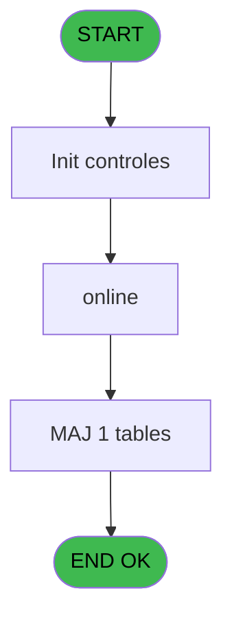
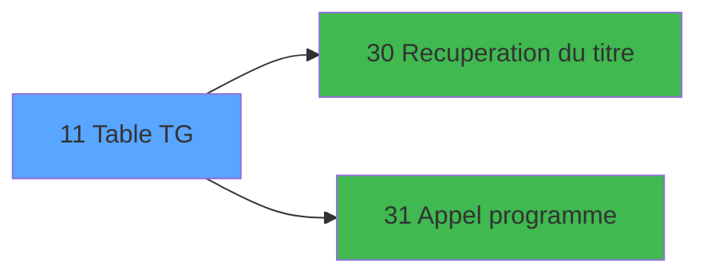

# GES IDE 11 - Table TG

> **Analyse**: Phases 1-4 2026-02-03 11:27 -> 11:27 (14s) | Assemblage 11:27
> **Pipeline**: V7.2 Enrichi
> **Structure**: 4 onglets (Resume | Ecrans | Donnees | Connexions)

<!-- TAB:Resume -->

## 1. FICHE D'IDENTITE

| Attribut | Valeur |
|----------|--------|
| Projet | GES |
| IDE Position | 11 |
| Nom Programme | Table TG |
| Fichier source | `Prg_11.xml` |
| Dossier IDE | Bar |
| Taches | 2 (1 ecrans visibles) |
| Tables modifiees | 1 |
| Programmes appeles | 2 |

## 2. DESCRIPTION FONCTIONNELLE

**Table TG** assure la gestion complete de ce processus, accessible depuis [MENU  Club Med Pass (IDE 5)](GES-IDE-5.md).

Le flux de traitement s'organise en **1 blocs fonctionnels** :

- **Traitement** (2 taches) : traitements metier divers

**Donnees modifiees** : 1 tables en ecriture (comptage_coffre).

## 3. BLOCS FONCTIONNELS

### 3.1 Traitement (2 taches)

Traitements internes.

---

#### 11 - Table Imputation Club Med Pass [[ECRAN]](#ecran-t1)

**Role** : Traitement : Table Imputation Club Med Pass.
**Ecran** : 164 x 169 DLU (MDI) | [Voir mockup](#ecran-t1)
**Delegue a** : [Recuperation du titre (IDE 30)](GES-IDE-30.md), [Appel programme (IDE 31)](GES-IDE-31.md)

---

#### 11.1 - Parametre Club Med Pass [[ECRAN]](#ecran-t2)

**Role** : Traitement : Parametre Club Med Pass.
**Ecran** : 774 x 254 DLU (MDI) | [Voir mockup](#ecran-t2)
**Delegue a** : [Recuperation du titre (IDE 30)](GES-IDE-30.md), [Appel programme (IDE 31)](GES-IDE-31.md)

## 5. REGLES METIER

*(Aucune regle metier identifiee)*

## 6. CONTEXTE

- **Appele par**: [MENU  Club Med Pass (IDE 5)](GES-IDE-5.md)
- **Appelle**: 2 programmes | **Tables**: 1 (W:1 R:0 L:0) | **Taches**: 2 | **Expressions**: 6

<!-- TAB:Ecrans -->

## 8. ECRANS

### 8.1 Forms visibles (1 / 2)

| # | Position | Tache | Nom | Type | Largeur | Hauteur | Bloc |
|---|----------|-------|-----|------|---------|---------|------|
| 1 | 11.1 | 11.1 | Parametre Club Med Pass | MDI | 774 | 254 | Traitement |

### 8.2 Mockups Ecrans

---

#### 11.1 - Parametre Club Med Pass
**Tache** : [11.1](#t2) | **Type** : MDI | **Dimensions** : 774 x 254 DLU
**Bloc** : Traitement | **Titre IDE** : Parametre Club Med Pass

<!-- FORM-DATA:
{
    "width":  774,
    "vFactor":  8,
    "type":  "MDI",
    "hFactor":  8,
    "controls":  [
                     {
                         "x":  2,
                         "type":  "label",
                         "var":  "",
                         "y":  1,
                         "w":  766,
                         "fmt":  "",
                         "name":  "",
                         "h":  19,
                         "color":  "",
                         "text":  "",
                         "parent":  null
                     },
                     {
                         "x":  12,
                         "type":  "label",
                         "var":  "",
                         "y":  28,
                         "w":  746,
                         "fmt":  "",
                         "name":  "",
                         "h":  194,
                         "color":  "",
                         "text":  "",
                         "parent":  null
                     },
                     {
                         "x":  21,
                         "type":  "table",
                         "var":  "",
                         "name":  "",
                         "titleH":  12,
                         "color":  "110",
                         "w":  733,
                         "y":  35,
                         "fmt":  "",
                         "parent":  null,
                         "text":  "",
                         "rowH":  16,
                         "h":  89,
                         "cols":  [
                                      {
                                          "title":  "Code",
                                          "layer":  1,
                                          "w":  136
                                      },
                                      {
                                          "title":  "Libellé",
                                          "layer":  2,
                                          "w":  337
                                      },
                                      {
                                          "title":  "Valeur",
                                          "layer":  3,
                                          "w":  222
                                      }
                                  ],
                         "rows":  3
                     },
                     {
                         "x":  24,
                         "type":  "label",
                         "var":  "",
                         "y":  130,
                         "w":  605,
                         "fmt":  "",
                         "name":  "",
                         "h":  91,
                         "color":  "",
                         "text":  "",
                         "parent":  null
                     },
                     {
                         "x":  304,
                         "type":  "label",
                         "var":  "",
                         "y":  147,
                         "w":  290,
                         "fmt":  "",
                         "name":  "",
                         "h":  61,
                         "color":  "",
                         "text":  "",
                         "parent":  null
                     },
                     {
                         "x":  307,
                         "type":  "label",
                         "var":  "",
                         "y":  148,
                         "w":  284,
                         "fmt":  "",
                         "name":  "",
                         "h":  59,
                         "color":  "",
                         "text":  "",
                         "parent":  null
                     },
                     {
                         "x":  337,
                         "type":  "label",
                         "var":  "",
                         "y":  157,
                         "w":  222,
                         "fmt":  "",
                         "name":  "",
                         "h":  22,
                         "color":  "",
                         "text":  "",
                         "parent":  null
                     },
                     {
                         "x":  340,
                         "type":  "label",
                         "var":  "",
                         "y":  158,
                         "w":  37,
                         "fmt":  "",
                         "name":  "",
                         "h":  20,
                         "color":  "",
                         "text":  "",
                         "parent":  null
                     },
                     {
                         "x":  391,
                         "type":  "label",
                         "var":  "",
                         "y":  162,
                         "w":  131,
                         "fmt":  "",
                         "name":  "",
                         "h":  9,
                         "color":  "7",
                         "text":  "Modification",
                         "parent":  null
                     },
                     {
                         "x":  363,
                         "type":  "label",
                         "var":  "",
                         "y":  189,
                         "w":  120,
                         "fmt":  "",
                         "name":  "",
                         "h":  10,
                         "color":  "",
                         "text":  "Votre choix",
                         "parent":  null
                     },
                     {
                         "x":  2,
                         "type":  "label",
                         "var":  "",
                         "y":  228,
                         "w":  768,
                         "fmt":  "",
                         "name":  "",
                         "h":  24,
                         "color":  "",
                         "text":  "",
                         "parent":  null
                     },
                     {
                         "x":  485,
                         "type":  "edit",
                         "var":  "",
                         "y":  189,
                         "w":  26,
                         "fmt":  "",
                         "name":  "V0 choix select",
                         "h":  10,
                         "color":  "6",
                         "text":  "",
                         "parent":  null
                     },
                     {
                         "x":  37,
                         "type":  "edit",
                         "var":  "",
                         "y":  50,
                         "w":  113,
                         "fmt":  "",
                         "name":  "",
                         "h":  12,
                         "color":  "110",
                         "text":  "",
                         "parent":  5
                     },
                     {
                         "x":  165,
                         "type":  "edit",
                         "var":  "",
                         "y":  50,
                         "w":  324,
                         "fmt":  "",
                         "name":  "",
                         "h":  12,
                         "color":  "110",
                         "text":  "",
                         "parent":  5
                     },
                     {
                         "x":  554,
                         "type":  "combobox",
                         "var":  "",
                         "y":  50,
                         "w":  110,
                         "fmt":  "",
                         "name":  "valeur alpha",
                         "h":  12,
                         "color":  "110",
                         "text":  "Oui,Non",
                         "parent":  5
                     },
                     {
                         "x":  8,
                         "type":  "edit",
                         "var":  "",
                         "y":  7,
                         "w":  267,
                         "fmt":  "20",
                         "name":  "",
                         "h":  8,
                         "color":  "",
                         "text":  "",
                         "parent":  1
                     },
                     {
                         "x":  471,
                         "type":  "edit",
                         "var":  "",
                         "y":  7,
                         "w":  203,
                         "fmt":  "WWW DD MMM YYYYT",
                         "name":  "",
                         "h":  8,
                         "color":  "",
                         "text":  "",
                         "parent":  1
                     },
                     {
                         "x":  77,
                         "type":  "image",
                         "var":  "",
                         "y":  150,
                         "w":  160,
                         "fmt":  "",
                         "name":  "",
                         "h":  56,
                         "color":  "",
                         "text":  "",
                         "parent":  null
                     },
                     {
                         "x":  344,
                         "type":  "button",
                         "var":  "",
                         "y":  162,
                         "w":  27,
                         "fmt":  "M",
                         "name":  "M",
                         "h":  9,
                         "color":  "",
                         "text":  "",
                         "parent":  null
                     },
                     {
                         "x":  6,
                         "type":  "button",
                         "var":  "",
                         "y":  231,
                         "w":  154,
                         "fmt":  "\u0026Quitter",
                         "name":  "Q",
                         "h":  18,
                         "color":  "",
                         "text":  "",
                         "parent":  20
                     }
                 ],
    "taskId":  "11.1",
    "height":  254
}
-->

<strong>Champs : 6 champs</strong>

| Pos (x,y) | Nom | Variable | Type |
|-----------|-----|----------|------|
| 485,189 | V0 choix select | - | edit |
| 37,50 | (sans nom) | - | edit |
| 165,50 | (sans nom) | - | edit |
| 554,50 | valeur alpha | - | combobox |
| 8,7 | 20 | - | edit |
| 471,7 | WWW DD MMM YYYYT | - | edit |

<strong>Boutons : 2 boutons</strong>

| Bouton | Pos (x,y) | Action |
|--------|-----------|--------|
| M | 344,162 | Bouton fonctionnel |
| Quitter | 6,231 | Quitte le programme |

## 9. NAVIGATION

Ecran unique: **Parametre Club Med Pass**

### 9.3 Structure hierarchique (2 taches)

| Position | Tache | Type | Dimensions | Bloc |
|----------|-------|------|------------|------|
| **11.1** | [**Table Imputation Club Med Pass** (11)](#t1) [mockup](#ecran-t1) | MDI | 164x169 | Traitement |
| 11.1.1 | [Parametre Club Med Pass (11.1)](#t2) [mockup](#ecran-t2) | MDI | 774x254 | |

### 9.4 Algorigramme

> **Legende**: Vert = START/END OK | Rouge = END KO | Bleu = Decisions
> *Algorigramme auto-genere. Utiliser `/algorigramme` pour une synthese metier detaillee.*

<!-- TAB:Donnees -->

## 10. TABLES

### Tables utilisees (1)

| ID | Nom | Description | Type | R | W | L | Usages |
|----|-----|-------------|------|---|---|---|--------|
| 470 | comptage_coffre | Etat du coffre | TMP |   | **W** |   | 1 |

### Colonnes par table (1 / 1 tables avec colonnes identifiees)

Table 470 - comptage_coffre (**W**) - 1 usages

| Lettre | Variable | Acces | Type |
|--------|----------|-------|------|
| A | V0 choix select | W | Alpha |
| B | v. titre | W | Alpha |

## 11. VARIABLES

### 11.1 Parametres entrants (1)

Variables recues du programme appelant ([MENU  Club Med Pass (IDE 5)](GES-IDE-5.md)).

| Lettre | Nom | Type | Usage dans |
|--------|-----|------|-----------|
| A | p.societe | Alpha | 1x parametre entrant |

### 11.2 Variables de session (1)

Variables persistantes pendant toute la session.

| Lettre | Nom | Type | Usage dans |
|--------|-----|------|-----------|
| B | v.action | Alpha | 1x session |

## 12. EXPRESSIONS

**6 / 6 expressions decodees (100%)**

### 12.1 Repartition par type

| Type | Expressions | Regles |
|------|-------------|--------|
| CONSTANTE | 2 | 0 |
| CAST_LOGIQUE | 2 | 0 |
| CONDITION | 2 | 0 |

### 12.2 Expressions cles par type

#### CONSTANTE (2 expressions)

| Type | IDE | Expression | Regle |
|------|-----|------------|-------|
| CONSTANTE | 5 | `'C'` | - |
| CONSTANTE | 3 | `'F'` | - |

#### CAST_LOGIQUE (2 expressions)

| Type | IDE | Expression | Regle |
|------|-----|------------|-------|
| CAST_LOGIQUE | 2 | `INIPut ('AllowCreateInModify  = Y','FALSE'LOG)` | - |
| CAST_LOGIQUE | 1 | `INIPut ('AllowCreateInModify  = N','FALSE'LOG)` | - |

#### CONDITION (2 expressions)

| Type | IDE | Expression | Regle |
|------|-----|------------|-------|
| CONDITION | 6 | `p.societe [A]=''` | - |
| CONDITION | 4 | `v.action [B]='F'` | - |

<!-- TAB:Connexions -->

## 13. GRAPHE D'APPELS

### 13.1 Chaine depuis Main (Callers)

Main -> ... -> [MENU  Club Med Pass (IDE 5)](GES-IDE-5.md) -> **Table TG (IDE 11)**

### 13.2 Callers

| IDE | Nom Programme | Nb Appels |
|-----|---------------|-----------|
| [5](GES-IDE-5.md) | MENU  Club Med Pass | 1 |

### 13.3 Callees (programmes appeles)

### 13.4 Detail Callees avec contexte

| IDE | Nom Programme | Appels | Contexte |
|-----|---------------|--------|----------|
| [30](GES-IDE-30.md) | Recuperation du titre | 1 | Recuperation donnees |
| [31](GES-IDE-31.md) | Appel programme | 1 | Sous-programme |

## 14. RECOMMANDATIONS MIGRATION

### 14.1 Profil du programme

| Metrique | Valeur | Impact migration |
|----------|--------|-----------------|
| Lignes de logique | 21 | Programme compact |
| Expressions | 6 | Peu de logique |
| Tables WRITE | 1 | Impact faible |
| Sous-programmes | 2 | Peu de dependances |
| Ecrans visibles | 1 | Ecran unique ou traitement batch |
| Code desactive | 0% (0 / 21) | Code sain |
| Regles metier | 0 | Pas de regle identifiee |

### 14.2 Plan de migration par bloc

#### Traitement (2 taches: 2 ecrans, 0 traitement)

- **Strategie** : 2 composant(s) UI (Razor/React) avec formulaires et validation.
- 2 sous-programme(s) a migrer ou a reutiliser depuis les services existants.
- Decomposer les taches en services unitaires testables.

### 14.3 Dependances critiques

| Dependance | Type | Appels | Impact |
|------------|------|--------|--------|
| comptage_coffre | Table WRITE (Temp) | 1x | Schema + repository |
| [Appel programme (IDE 31)](GES-IDE-31.md) | Sous-programme | 1x | Normale - Sous-programme |
| [Recuperation du titre (IDE 30)](GES-IDE-30.md) | Sous-programme | 1x | Normale - Recuperation donnees |

---
*Spec DETAILED generee par Pipeline V7.2 - 2026-02-03 11:27*
