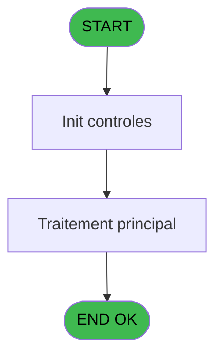
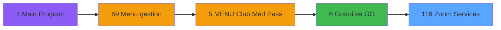
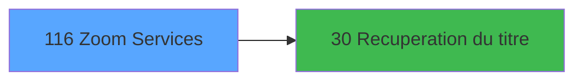

# GES IDE 116 - Zoom Services

> **Analyse**: Phases 1-4 2026-02-03 11:56 -> 11:56 (16s) | Assemblage 11:56
> **Pipeline**: V7.2 Enrichi
> **Structure**: 4 onglets (Resume | Ecrans | Donnees | Connexions)

<!-- TAB:Resume -->

## 1. FICHE D'IDENTITE

| Attribut | Valeur |
|----------|--------|
| Projet | GES |
| IDE Position | 116 |
| Nom Programme | Zoom Services |
| Fichier source | `Prg_116.xml` |
| Dossier IDE | Zooms |
| Taches | 1 (1 ecrans visibles) |
| Tables modifiees | 0 |
| Programmes appeles | 1 |

## 2. DESCRIPTION FONCTIONNELLE

**Zoom Services** assure la gestion complete de ce processus, accessible depuis [Gratuites GO (IDE 6)](GES-IDE-6.md).

Le flux de traitement s'organise en **1 blocs fonctionnels** :

- **Consultation** (1 tache) : ecrans de recherche, selection et consultation

## 3. BLOCS FONCTIONNELS

### 3.1 Consultation (1 tache)

Ecrans de recherche et consultation.

---

#### 116 - Zoom Service [[ECRAN]](#ecran-t1)

**Role** : Selection par l'operateur : Zoom Service.
**Ecran** : 281 x 222 DLU (MDI) | [Voir mockup](#ecran-t1)
**Variables liees** : D (P. Service id), E (p.service label)

## 5. REGLES METIER

*(Aucune regle metier identifiee)*

## 6. CONTEXTE

- **Appele par**: [Gratuites GO (IDE 6)](GES-IDE-6.md)
- **Appelle**: 1 programmes | **Tables**: 1 (W:0 R:1 L:0) | **Taches**: 1 | **Expressions**: 8

<!-- TAB:Ecrans -->

## 8. ECRANS

### 8.1 Forms visibles (1 / 1)

| # | Position | Tache | Nom | Type | Largeur | Hauteur | Bloc |
|---|----------|-------|-----|------|---------|---------|------|
| 1 | 116 | 116 | Zoom Service | MDI | 281 | 222 | Consultation |

### 8.2 Mockups Ecrans

---

#### 116 - Zoom Service
**Tache** : [116](#t1) | **Type** : MDI | **Dimensions** : 281 x 222 DLU
**Bloc** : Consultation | **Titre IDE** : Zoom Service

<!-- FORM-DATA:
{
    "width":  281,
    "vFactor":  8,
    "type":  "MDI",
    "hFactor":  4,
    "controls":  [
                     {
                         "x":  4,
                         "type":  "table",
                         "var":  "",
                         "name":  "",
                         "titleH":  12,
                         "color":  "196",
                         "w":  271,
                         "y":  8,
                         "fmt":  "",
                         "parent":  null,
                         "text":  "",
                         "rowH":  14,
                         "h":  185,
                         "cols":  [
                                      {
                                          "title":  "Code",
                                          "layer":  1,
                                          "w":  71
                                      },
                                      {
                                          "title":  "Libellé",
                                          "layer":  2,
                                          "w":  184
                                      }
                                  ],
                         "rows":  2
                     },
                     {
                         "x":  7,
                         "type":  "edit",
                         "var":  "",
                         "y":  21,
                         "w":  66,
                         "fmt":  "",
                         "name":  "",
                         "h":  12,
                         "color":  "196",
                         "text":  "",
                         "parent":  1
                     },
                     {
                         "x":  78,
                         "type":  "edit",
                         "var":  "",
                         "y":  21,
                         "w":  180,
                         "fmt":  "",
                         "name":  "",
                         "h":  12,
                         "color":  "196",
                         "text":  "",
                         "parent":  1
                     },
                     {
                         "x":  189,
                         "type":  "button",
                         "var":  "",
                         "y":  200,
                         "w":  84,
                         "fmt":  "\u0026Choix",
                         "name":  "BOUTON Choix",
                         "h":  18,
                         "color":  "",
                         "text":  "",
                         "parent":  null
                     },
                     {
                         "x":  4,
                         "type":  "button",
                         "var":  "",
                         "y":  200,
                         "w":  84,
                         "fmt":  "\u0026Tous",
                         "name":  "BOUTON Tous",
                         "h":  18,
                         "color":  "",
                         "text":  "",
                         "parent":  null
                     }
                 ],
    "taskId":  "116",
    "height":  222
}
-->

<strong>Champs : 2 champs</strong>

| Pos (x,y) | Nom | Variable | Type |
|-----------|-----|----------|------|
| 7,21 | (sans nom) | - | edit |
| 78,21 | (sans nom) | - | edit |

<strong>Boutons : 2 boutons</strong>

| Bouton | Pos (x,y) | Action |
|--------|-----------|--------|
| Choix | 189,200 | Bouton fonctionnel |
| Tous | 4,200 | Bouton fonctionnel |

## 9. NAVIGATION

Ecran unique: **Zoom Service**

### 9.3 Structure hierarchique (1 tache)

| Position | Tache | Type | Dimensions | Bloc |
|----------|-------|------|------------|------|
| **116.1** | [**Zoom Service** (116)](#t1) [mockup](#ecran-t1) | MDI | 281x222 | Consultation |

### 9.4 Algorigramme

> **Legende**: Vert = START/END OK | Rouge = END KO | Bleu = Decisions
> *Algorigramme auto-genere. Utiliser `/algorigramme` pour une synthese metier detaillee.*

<!-- TAB:Donnees -->

## 10. TABLES

### Tables utilisees (1)

| ID | Nom | Description | Type | R | W | L | Usages |
|----|-----|-------------|------|---|---|---|--------|
| 117 | tables_services | Services / filieres | DB | R |   |   | 1 |

### Colonnes par table (1 / 1 tables avec colonnes identifiees)

Table 117 - tables_services (R) - 1 usages

| Lettre | Variable | Acces | Type |
|--------|----------|-------|------|
| A | P.Societe | R | Alpha |
| B | P.CodeTable | R | Alpha |
| C | P.Langue | R | Alpha |
| D | P. Service id | R | Alpha |
| E | p.service label | R | Alpha |
| F | V TITRE | R | Alpha |
| G | BOUTON Choix | R | Alpha |
| H | BOUTON Tous | R | Alpha |

## 11. VARIABLES

### 11.1 Parametres entrants (5)

Variables recues du programme appelant ([Gratuites GO (IDE 6)](GES-IDE-6.md)).

| Lettre | Nom | Type | Usage dans |
|--------|-----|------|-----------|
| A | P.Societe | Alpha | 1x parametre entrant |
| B | P.CodeTable | Alpha | 1x parametre entrant |
| C | P.Langue | Alpha | 1x parametre entrant |
| D | P. Service id | Alpha | - |
| E | p.service label | Alpha | - |

### 11.2 Variables de session (1)

Variables persistantes pendant toute la session.

| Lettre | Nom | Type | Usage dans |
|--------|-----|------|-----------|
| F | V TITRE | Alpha | - |

### 11.3 Autres (2)

Variables diverses.

| Lettre | Nom | Type | Usage dans |
|--------|-----|------|-----------|
| G | BOUTON Choix | Alpha | 1x refs |
| H | BOUTON Tous | Alpha | - |

## 12. EXPRESSIONS

**8 / 8 expressions decodees (100%)**

### 12.1 Repartition par type

| Type | Expressions | Regles |
|------|-------------|--------|
| CONSTANTE | 2 | 0 |
| OTHER | 4 | 0 |
| STRING | 2 | 0 |

### 12.2 Expressions cles par type

#### CONSTANTE (2 expressions)

| Type | IDE | Expression | Regle |
|------|-----|------------|-------|
| CONSTANTE | 7 | `307` | - |
| CONSTANTE | 6 | `''` | - |

#### OTHER (4 expressions)

| Type | IDE | Expression | Regle |
|------|-----|------------|-------|
| OTHER | 3 | `P.Langue [C]` | - |
| OTHER | 5 | `[L]` | - |
| OTHER | 1 | `P.Societe [A]` | - |
| OTHER | 2 | `P.CodeTable [B]` | - |

#### STRING (2 expressions)

| Type | IDE | Expression | Regle |
|------|-----|------------|-------|
| STRING | 8 | `Trim (BOUTON Choix [G])` | - |
| STRING | 4 | `Trim ([K])` | - |

<!-- TAB:Connexions -->

## 13. GRAPHE D'APPELS

### 13.1 Chaine depuis Main (Callers)

Main -> ... -> [Gratuites GO (IDE 6)](GES-IDE-6.md) -> **Zoom Services (IDE 116)**

### 13.2 Callers

| IDE | Nom Programme | Nb Appels |
|-----|---------------|-----------|
| [6](GES-IDE-6.md) | Gratuites GO | 1 |

### 13.3 Callees (programmes appeles)

### 13.4 Detail Callees avec contexte

| IDE | Nom Programme | Appels | Contexte |
|-----|---------------|--------|----------|
| [30](GES-IDE-30.md) | Recuperation du titre | 1 | Recuperation donnees |

## 14. RECOMMANDATIONS MIGRATION

### 14.1 Profil du programme

| Metrique | Valeur | Impact migration |
|----------|--------|-----------------|
| Lignes de logique | 26 | Programme compact |
| Expressions | 8 | Peu de logique |
| Tables WRITE | 0 | Impact faible |
| Sous-programmes | 1 | Peu de dependances |
| Ecrans visibles | 1 | Ecran unique ou traitement batch |
| Code desactive | 0% (0 / 26) | Code sain |
| Regles metier | 0 | Pas de regle identifiee |

### 14.2 Plan de migration par bloc

#### Consultation (1 tache: 1 ecran, 0 traitement)

- **Strategie** : Composants de recherche/selection en modales.
- 1 ecran : Zoom Service

### 14.3 Dependances critiques

| Dependance | Type | Appels | Impact |
|------------|------|--------|--------|
| [Recuperation du titre (IDE 30)](GES-IDE-30.md) | Sous-programme | 1x | Normale - Recuperation donnees |

---
*Spec DETAILED generee par Pipeline V7.2 - 2026-02-03 11:56*
