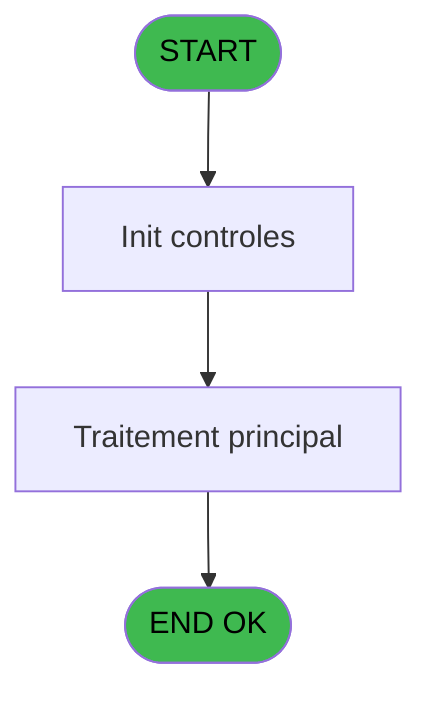

# GES IDE 119 - Réinit Sale label ds PKG Price

> **Analyse**: Phases 1-4 2026-02-03 11:57 -> 11:57 (13s) | Assemblage 11:57
> **Pipeline**: V7.2 Enrichi
> **Structure**: 4 onglets (Resume | Ecrans | Donnees | Connexions)

<!-- TAB:Resume -->

## 1. FICHE D'IDENTITE

| Attribut | Valeur |
|----------|--------|
| Projet | GES |
| IDE Position | 119 |
| Nom Programme | Réinit Sale label ds PKG Price |
| Fichier source | `Prg_119.xml` |
| Dossier IDE | Sauvegarde |
| Taches | 1 (1 ecrans visibles) |
| Tables modifiees | 0 |
| Programmes appeles | 0 |
| :warning: Statut | **ORPHELIN_POTENTIEL** |

## 2. DESCRIPTION FONCTIONNELLE

**Réinit Sale label ds PKG Price** assure la gestion complete de ce processus.

Le flux de traitement s'organise en **1 blocs fonctionnels** :

- **Initialisation** (1 tache) : reinitialisation d'etats et de variables de travail

## 3. BLOCS FONCTIONNELS

### 3.1 Initialisation (1 tache)

Reinitialisation d'etats et variables de travail.

---

#### 119 - Réinit Sale label ds PKG Price [[ECRAN]](#ecran-t2)

**Role** : Reinitialisation : Réinit Sale label ds PKG Price.
**Ecran** : 186 x 29 DLU (MDI) | [Voir mockup](#ecran-t2)

## 5. REGLES METIER

*(Aucune regle metier identifiee)*

## 6. CONTEXTE

- **Appele par**: (aucun)
- **Appelle**: 0 programmes | **Tables**: 3 (W:0 R:1 L:2) | **Taches**: 1 | **Expressions**: 8

<!-- TAB:Ecrans -->

## 8. ECRANS

### 8.1 Forms visibles (1 / 1)

| # | Position | Tache | Nom | Type | Largeur | Hauteur | Bloc |
|---|----------|-------|-----|------|---------|---------|------|
| 1 | 119.1 | 119 | Réinit Sale label ds PKG Price | MDI | 186 | 29 | Initialisation |

### 8.2 Mockups Ecrans

---

#### 119.1 - Réinit Sale label ds PKG Price
**Tache** : [119](#t2) | **Type** : MDI | **Dimensions** : 186 x 29 DLU
**Bloc** : Initialisation | **Titre IDE** : Réinit Sale label ds PKG Price

<!-- FORM-DATA:
{
    "width":  186,
    "vFactor":  8,
    "type":  "MDI",
    "hFactor":  4,
    "controls":  [
                     {
                         "x":  17,
                         "type":  "label",
                         "var":  "",
                         "y":  6,
                         "w":  152,
                         "fmt":  "",
                         "name":  "",
                         "h":  16,
                         "color":  "",
                         "text":  "Traitement en cours ...",
                         "parent":  null
                     }
                 ],
    "taskId":  "119.1",
    "height":  29
}
-->

## 9. NAVIGATION

Ecran unique: **Réinit Sale label ds PKG Price**

### 9.3 Structure hierarchique (1 tache)

| Position | Tache | Type | Dimensions | Bloc |
|----------|-------|------|------------|------|
| **119.1** | [**Réinit Sale label ds PKG Price** (119)](#t2) [mockup](#ecran-t2) | MDI | 186x29 | Initialisation |

### 9.4 Algorigramme

> **Legende**: Vert = START/END OK | Rouge = END KO | Bleu = Decisions
> *Algorigramme auto-genere. Utiliser `/algorigramme` pour une synthese metier detaillee.*

<!-- TAB:Donnees -->

## 10. TABLES

### Tables utilisees (3)

| ID | Nom | Description | Type | R | W | L | Usages |
|----|-----|-------------|------|---|---|---|--------|
| 379 | pv_customer_temp |  | DB | R |   |   | 1 |
| 403 | pv_sellers |  | DB |   |   | L | 1 |
| 413 | pv_tva |  | DB |   |   | L | 1 |

### Colonnes par table (1 / 1 tables avec colonnes identifiees)

Table 379 - pv_customer_temp (R) - 1 usages

| Lettre | Variable | Acces | Type |
|--------|----------|-------|------|
| A | Pi.Service | R | Alpha |
| B | Pi.Cat | R | Numeric |
| C | Pi.Sub-Cat | R | Numeric |

## 11. VARIABLES

### 11.1 Parametres entrants (3)

Variables recues en parametre.

| Lettre | Nom | Type | Usage dans |
|--------|-----|------|-----------|
| A | Pi.Service | Alpha | 1x parametre entrant |
| B | Pi.Cat | Numeric | 1x parametre entrant |
| C | Pi.Sub-Cat | Numeric | 1x parametre entrant |

## 12. EXPRESSIONS

**8 / 8 expressions decodees (100%)**

### 12.1 Repartition par type

| Type | Expressions | Regles |
|------|-------------|--------|
| CONCATENATION | 1 | 0 |
| OTHER | 4 | 0 |
| CONDITION | 2 | 0 |
| CAST_LOGIQUE | 1 | 0 |

### 12.2 Expressions cles par type

#### CONCATENATION (1 expressions)

| Type | IDE | Expression | Regle |
|------|-----|------------|-------|
| CONCATENATION | 4 | `Trim([J])&' - '&Trim([O])` | - |

#### OTHER (4 expressions)

| Type | IDE | Expression | Regle |
|------|-----|------------|-------|
| OTHER | 3 | `Pi.Sub-Cat [C]` | - |
| OTHER | 5 | `[R]` | - |
| OTHER | 1 | `Pi.Service [A]` | - |
| OTHER | 2 | `Pi.Cat [B]` | - |

#### CONDITION (2 expressions)

| Type | IDE | Expression | Regle |
|------|-----|------------|-------|
| CONDITION | 7 | `CndRange([T]<>0,[T])` | - |
| CONDITION | 6 | `CndRange([Q]<>0,[Q])` | - |

#### CAST_LOGIQUE (1 expressions)

| Type | IDE | Expression | Regle |
|------|-----|------------|-------|
| CAST_LOGIQUE | 8 | `'TRUE'LOG` | - |

<!-- TAB:Connexions -->

## 13. GRAPHE D'APPELS

### 13.1 Chaine depuis Main (Callers)

**Chemin**: (pas de callers directs)

### 13.2 Callers

| IDE | Nom Programme | Nb Appels |
|-----|---------------|-----------|
| - | (aucun) | - |

### 13.3 Callees (programmes appeles)

### 13.4 Detail Callees avec contexte

| IDE | Nom Programme | Appels | Contexte |
|-----|---------------|--------|----------|
| - | (aucun) | - | - |

## 14. RECOMMANDATIONS MIGRATION

### 14.1 Profil du programme

| Metrique | Valeur | Impact migration |
|----------|--------|-----------------|
| Lignes de logique | 27 | Programme compact |
| Expressions | 8 | Peu de logique |
| Tables WRITE | 0 | Impact faible |
| Sous-programmes | 0 | Peu de dependances |
| Ecrans visibles | 1 | Ecran unique ou traitement batch |
| Code desactive | 0% (0 / 27) | Code sain |
| Regles metier | 0 | Pas de regle identifiee |

### 14.2 Plan de migration par bloc

#### Initialisation (1 tache: 1 ecran, 0 traitement)

- **Strategie** : Constructeur/methode `InitAsync()` dans l'orchestrateur.

### 14.3 Dependances critiques

| Dependance | Type | Appels | Impact |
|------------|------|--------|--------|

---
*Spec DETAILED generee par Pipeline V7.2 - 2026-02-03 11:57*
