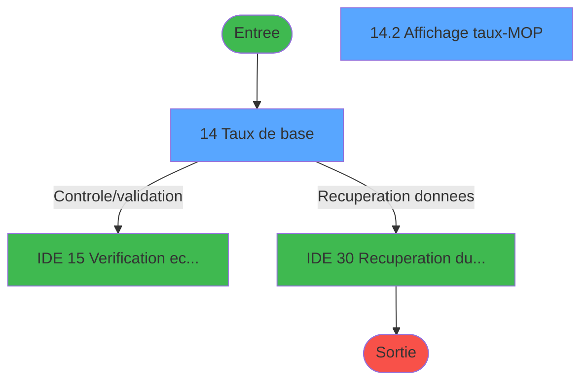
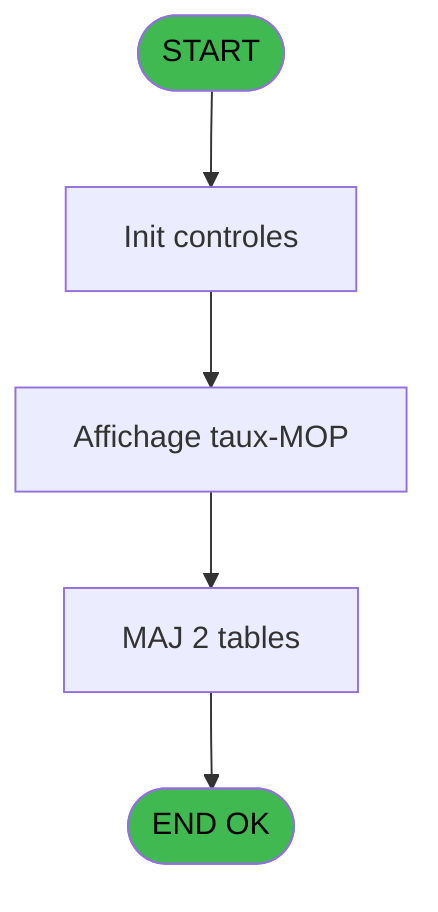
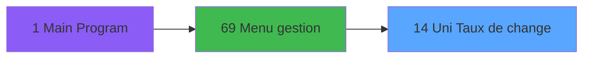
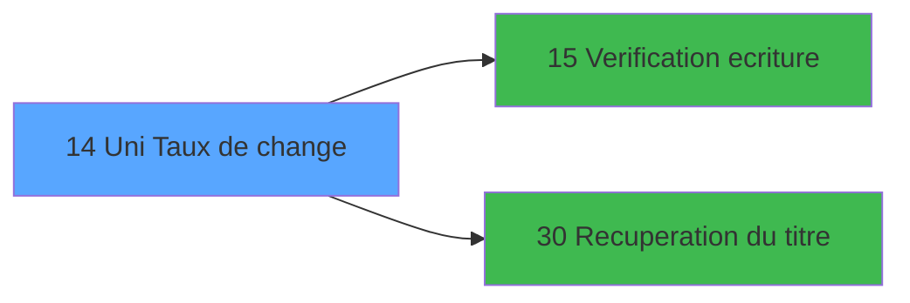

# GES IDE 14 - Uni Taux de change

> **Analyse**: Phases 1-4 2026-02-03 11:28 -> 11:28 (14s) | Assemblage 11:28
> **Pipeline**: V7.2 Enrichi
> **Structure**: 4 onglets (Resume | Ecrans | Donnees | Connexions)

<!-- TAB:Resume -->

## 1. FICHE D'IDENTITE

| Attribut | Valeur |
|----------|--------|
| Projet | GES |
| IDE Position | 14 |
| Nom Programme | Uni Taux de change |
| Fichier source | `Prg_14.xml` |
| Dossier IDE | Change |
| Taches | 3 (2 ecrans visibles) |
| Tables modifiees | 2 |
| Programmes appeles | 2 |

## 2. DESCRIPTION FONCTIONNELLE

**Uni Taux de change** assure la gestion complete de ce processus, accessible depuis [Menu gestion (IDE 69)](GES-IDE-69.md).

Le flux de traitement s'organise en **2 blocs fonctionnels** :

- **Traitement** (2 taches) : traitements metier divers
- **Reglement** (1 tache) : gestion des moyens de paiement et reglements

**Donnees modifiees** : 2 tables en ecriture (moyens_reglement_mor, devises__________dev).

**Logique metier** : 3 regles identifiees couvrant conditions metier, valeurs par defaut.

Detail : phases du traitement

#### Phase 1 : Traitement (2 taches)

- **14** - Taux de base **[[ECRAN]](#ecran-t1)**
- **14.1** - Mise à jour taux change

Delegue a : [Recuperation du titre (IDE 30)](GES-IDE-30.md)

#### Phase 2 : Reglement (1 tache)

- **14.2** - Affichage taux-MOP **[[ECRAN]](#ecran-t4)**

#### Tables impactees

| Table | Operations | Role metier |
|-------|-----------|-------------|
| moyens_reglement_mor | **W** (2 usages) | Reglements / paiements |
| devises__________dev | **W** (1 usages) | Devises / taux de change |

## 3. BLOCS FONCTIONNELS

### 3.1 Traitement (2 taches)

Traitements internes.

---

#### 14 - Taux de base [[ECRAN]](#ecran-t1)

**Role** : Calcul : Taux de base.
**Ecran** : 886 x 235 DLU (MDI) | [Voir mockup](#ecran-t1)
**Variables liees** : E (W0 mise à jour taux), F (W0 memory-taux), K (CHG_REASON_dev_taux), L (CHG_PRV_dev_taux)
**Delegue a** : [Recuperation du titre (IDE 30)](GES-IDE-30.md)

---

#### 14.1 - Mise à jour taux change

**Role** : Calcul : Mise à jour taux change.
**Variables liees** : E (W0 mise à jour taux), F (W0 memory-taux), K (CHG_REASON_dev_taux), L (CHG_PRV_dev_taux)
**Delegue a** : [Recuperation du titre (IDE 30)](GES-IDE-30.md)

### 3.2 Reglement (1 tache)

Gestion des moyens de paiement : 1 tache de reglement.

---

#### 14.2 - Affichage taux-MOP [[ECRAN]](#ecran-t4)

**Role** : Calcul : Affichage taux-MOP.
**Ecran** : 395 x 159 DLU (Modal) | [Voir mockup](#ecran-t4)

## 5. REGLES METIER

3 regles identifiees:

### Autres (3 regles)

#### [RM-001] Valeur par defaut si P0 societe [A] est vide

| Element | Detail |
|---------|--------|
| **Condition** | `P0 societe [A]=''` |
| **Si vrai** | 'C' |
| **Si faux** | P0 societe [A]) |
| **Variables** | A (P0 societe) |
| **Expression source** | Expression 6 : `IF (P0 societe [A]='','C',P0 societe [A])` |
| **Exemple** | Si P0 societe [A]='' → 'C'. Sinon → P0 societe [A]) |

#### [RM-002] Traitement conditionnel si CHG_REASON_dev_taux [K] est a zero

| Element | Detail |
|---------|--------|
| **Condition** | `CHG_REASON_dev_taux [K]=0` |
| **Si vrai** | 'Z' |
| **Si faux** | 'O') |
| **Variables** | K (CHG_REASON_dev_taux) |
| **Expression source** | Expression 10 : `IF (CHG_REASON_dev_taux [K]=0,'Z','O')` |
| **Exemple** | Si CHG_REASON_dev_taux [K]=0 → 'Z'. Sinon → 'O') |
| **Impact** | [14 - Taux de base](#t1) |

#### [RM-003] Si W0 ds le zoom [D]='Z' alors 141 sinon 110)

| Element | Detail |
|---------|--------|
| **Condition** | `W0 ds le zoom [D]='Z'` |
| **Si vrai** | 141 |
| **Si faux** | 110) |
| **Variables** | D (W0 ds le zoom) |
| **Expression source** | Expression 13 : `IF (W0 ds le zoom [D]='Z',141,110)` |
| **Exemple** | Si W0 ds le zoom [D]='Z' → 141. Sinon → 110) |

## 6. CONTEXTE

- **Appele par**: [Menu gestion (IDE 69)](GES-IDE-69.md)
- **Appelle**: 2 programmes | **Tables**: 3 (W:2 R:0 L:1) | **Taches**: 3 | **Expressions**: 20

<!-- TAB:Ecrans -->

## 8. ECRANS

### 8.1 Forms visibles (2 / 3)

| # | Position | Tache | Nom | Type | Largeur | Hauteur | Bloc |
|---|----------|-------|-----|------|---------|---------|------|
| 1 | 14 | 14 | Taux de base | MDI | 886 | 235 | Traitement |
| 2 | 14.2 | 14.2 | Affichage taux-MOP | Modal | 395 | 159 | Reglement |

### 8.2 Mockups Ecrans

---

#### 14 - Taux de base
**Tache** : [14](#t1) | **Type** : MDI | **Dimensions** : 886 x 235 DLU
**Bloc** : Traitement | **Titre IDE** : Taux de base

<!-- FORM-DATA:
{
    "width":  886,
    "vFactor":  8,
    "type":  "MDI",
    "hFactor":  8,
    "controls":  [
                     {
                         "x":  0,
                         "type":  "label",
                         "var":  "",
                         "y":  2,
                         "w":  885,
                         "fmt":  "",
                         "name":  "",
                         "h":  18,
                         "color":  "",
                         "text":  "",
                         "parent":  null
                     },
                     {
                         "x":  24,
                         "type":  "table",
                         "var":  "",
                         "name":  "",
                         "titleH":  12,
                         "color":  "110",
                         "w":  392,
                         "y":  32,
                         "fmt":  "",
                         "parent":  null,
                         "text":  "",
                         "rowH":  14,
                         "h":  143,
                         "cols":  [
                                      {
                                          "title":  "Code",
                                          "layer":  1,
                                          "w":  98
                                      },
                                      {
                                          "title":  "Taux Banque",
                                          "layer":  2,
                                          "w":  259
                                      }
                                  ],
                         "rows":  2
                     },
                     {
                         "x":  0,
                         "type":  "label",
                         "var":  "",
                         "y":  210,
                         "w":  886,
                         "fmt":  "",
                         "name":  "",
                         "h":  24,
                         "color":  "",
                         "text":  "",
                         "parent":  null
                     },
                     {
                         "x":  33,
                         "type":  "edit",
                         "var":  "",
                         "y":  48,
                         "w":  42,
                         "fmt":  "",
                         "name":  "",
                         "h":  8,
                         "color":  "110",
                         "text":  "",
                         "parent":  6
                     },
                     {
                         "x":  133,
                         "type":  "edit",
                         "var":  "",
                         "y":  48,
                         "w":  240,
                         "fmt":  "## ### ### ###.######Z",
                         "name":  "DEV taux banque",
                         "h":  8,
                         "color":  "110",
                         "text":  "",
                         "parent":  6
                     },
                     {
                         "x":  6,
                         "type":  "edit",
                         "var":  "",
                         "y":  6,
                         "w":  396,
                         "fmt":  "30",
                         "name":  "",
                         "h":  8,
                         "color":  "",
                         "text":  "",
                         "parent":  null
                     },
                     {
                         "x":  641,
                         "type":  "edit",
                         "var":  "",
                         "y":  7,
                         "w":  237,
                         "fmt":  "WWW DD MMM YYYYT",
                         "name":  "",
                         "h":  8,
                         "color":  "",
                         "text":  "",
                         "parent":  null
                     },
                     {
                         "x":  8,
                         "type":  "button",
                         "var":  "",
                         "y":  213,
                         "w":  154,
                         "fmt":  "\u0026Quitter",
                         "name":  "",
                         "h":  18,
                         "color":  "",
                         "text":  "",
                         "parent":  15
                     }
                 ],
    "taskId":  "14",
    "height":  235
}
-->

<strong>Champs : 4 champs</strong>

| Pos (x,y) | Nom | Variable | Type |
|-----------|-----|----------|------|
| 33,48 | (sans nom) | - | edit |
| 133,48 | DEV taux banque | - | edit |
| 6,6 | 30 | - | edit |
| 641,7 | WWW DD MMM YYYYT | - | edit |

<strong>Boutons : 1 boutons</strong>

| Bouton | Pos (x,y) | Action |
|--------|-----------|--------|
| Quitter | 8,213 | Quitte le programme |

---

#### 14.2 - Affichage taux-MOP
**Tache** : [14.2](#t4) | **Type** : Modal | **Dimensions** : 395 x 159 DLU
**Bloc** : Reglement | **Titre IDE** : Affichage taux-MOP

<!-- FORM-DATA:
{
    "width":  395,
    "vFactor":  8,
    "type":  "Modal",
    "hFactor":  8,
    "controls":  [
                     {
                         "x":  0,
                         "type":  "table",
                         "var":  "",
                         "name":  "",
                         "titleH":  12,
                         "color":  "110",
                         "w":  376,
                         "y":  15,
                         "fmt":  "",
                         "parent":  null,
                         "text":  "",
                         "rowH":  14,
                         "h":  125,
                         "cols":  [
                                      {
                                          "title":  "MOP",
                                          "layer":  1,
                                          "w":  103
                                      },
                                      {
                                          "title":  "Taux de Change",
                                          "layer":  2,
                                          "w":  237
                                      }
                                  ],
                         "rows":  2
                     },
                     {
                         "x":  14,
                         "type":  "edit",
                         "var":  "",
                         "y":  31,
                         "w":  53,
                         "fmt":  "",
                         "name":  "",
                         "h":  8,
                         "color":  "110",
                         "text":  "",
                         "parent":  2
                     },
                     {
                         "x":  114,
                         "type":  "edit",
                         "var":  "",
                         "y":  31,
                         "w":  210,
                         "fmt":  "",
                         "name":  "MOR taux de change",
                         "h":  8,
                         "color":  "110",
                         "text":  "",
                         "parent":  2
                     },
                     {
                         "x":  55,
                         "type":  "edit",
                         "var":  "",
                         "y":  2,
                         "w":  238,
                         "fmt":  "",
                         "name":  "",
                         "h":  10,
                         "color":  "7",
                         "text":  "",
                         "parent":  null
                     }
                 ],
    "taskId":  "14.2",
    "height":  159
}
-->

<strong>Champs : 3 champs</strong>

| Pos (x,y) | Nom | Variable | Type |
|-----------|-----|----------|------|
| 14,31 | (sans nom) | - | edit |
| 114,31 | MOR taux de change | - | edit |
| 55,2 | (sans nom) | - | edit |

## 9. NAVIGATION

### 9.1 Enchainement des ecrans

**Detail par enchainement :**

| Depuis | Action | Vers | Retour |
|--------|--------|------|--------|
| Taux de base | Controle/validation | [  Verification ecriture (IDE 15)](GES-IDE-15.md) | Retour ecran |
| Taux de base | Recuperation donnees | [Recuperation du titre (IDE 30)](GES-IDE-30.md) | Retour ecran |

### 9.3 Structure hierarchique (3 taches)

| Position | Tache | Type | Dimensions | Bloc |
|----------|-------|------|------------|------|
| **14.1** | [**Taux de base** (14)](#t1) [mockup](#ecran-t1) | MDI | 886x235 | Traitement |
| 14.1.1 | [Mise à jour taux change (14.1)](#t3) | MDI | - | |
| **14.2** | [**Affichage taux-MOP** (14.2)](#t4) [mockup](#ecran-t4) | Modal | 395x159 | Reglement |

### 9.4 Algorigramme

> **Legende**: Vert = START/END OK | Rouge = END KO | Bleu = Decisions
> *Algorigramme auto-genere. Utiliser `/algorigramme` pour une synthese metier detaillee.*

<!-- TAB:Donnees -->

## 10. TABLES

### Tables utilisees (3)

| ID | Nom | Description | Type | R | W | L | Usages |
|----|-----|-------------|------|---|---|---|--------|
| 50 | moyens_reglement_mor | Reglements / paiements | DB |   | **W** |   | 2 |
| 89 | moyen_paiement___mop |  | DB |   |   | L | 1 |
| 90 | devises__________dev | Devises / taux de change | DB |   | **W** |   | 1 |

### Colonnes par table (1 / 2 tables avec colonnes identifiees)

Table 50 - moyens_reglement_mor (**W**) - 2 usages

*Table utilisee uniquement en Link ou aucune colonne Real identifiee dans le DataView.*

Table 90 - devises__________dev (**W**) - 1 usages

| Lettre | Variable | Acces | Type |
|--------|----------|-------|------|
| A | P0 societe | W | Alpha |
| B | P0 Date Comptable | W | Date |
| C | W0 mode accès zoom | W | Alpha |
| D | W0 ds le zoom | W | Alpha |
| E | W0 mise à jour taux | W | Numeric |
| F | W0 memory-taux | W | Numeric |
| G | W0 couleur flêche | W | Numeric |
| H | W0 mode rapide (R) | W | Alpha |
| I | W0 modif | W | Logical |
| J | v. titre ecran | W | Alpha |
| K | CHG_REASON_dev_taux | W | Numeric |
| L | CHG_PRV_dev_taux | W | Numeric |

## 11. VARIABLES

### 11.1 Parametres entrants (2)

Variables recues du programme appelant ([Menu gestion (IDE 69)](GES-IDE-69.md)).

| Lettre | Nom | Type | Usage dans |
|--------|-----|------|-----------|
| A | P0 societe | Alpha | 2x parametre entrant |
| B | P0 Date Comptable | Date | - |

### 11.2 Variables de session (1)

Variables persistantes pendant toute la session.

| Lettre | Nom | Type | Usage dans |
|--------|-----|------|-----------|
| J | v. titre ecran | Alpha | - |

### 11.3 Variables de travail (7)

Variables internes au programme.

| Lettre | Nom | Type | Usage dans |
|--------|-----|------|-----------|
| C | W0 mode accès zoom | Alpha | - |
| D | W0 ds le zoom | Alpha | 1x calcul interne |
| E | W0 mise à jour taux | Numeric | - |
| F | W0 memory-taux | Numeric | - |
| G | W0 couleur flêche | Numeric | - |
| H | W0 mode rapide (R) | Alpha | - |
| I | W0 modif | Logical | - |

### 11.4 Autres (2)

Variables diverses.

| Lettre | Nom | Type | Usage dans |
|--------|-----|------|-----------|
| K | CHG_REASON_dev_taux | Numeric | 2x refs |
| L | CHG_PRV_dev_taux | Numeric | - |

## 12. EXPRESSIONS

**20 / 20 expressions decodees (100%)**

### 12.1 Repartition par type

| Type | Expressions | Regles |
|------|-------------|--------|
| CONDITION | 5 | 3 |
| CONSTANTE | 7 | 0 |
| DATE | 1 | 0 |
| CAST_LOGIQUE | 2 | 0 |
| REFERENCE_VG | 1 | 0 |
| OTHER | 3 | 0 |
| STRING | 1 | 0 |

### 12.2 Expressions cles par type

#### CONDITION (5 expressions)

| Type | IDE | Expression | Regle |
|------|-----|------------|-------|
| CONDITION | 13 | `IF (W0 ds le zoom [D]='Z',141,110)` | [RM-003](#rm-RM-003) |
| CONDITION | 10 | `IF (CHG_REASON_dev_taux [K]=0,'Z','O')` | [RM-002](#rm-RM-002) |
| CONDITION | 6 | `IF (P0 societe [A]='','C',P0 societe [A])` | [RM-001](#rm-RM-001) |
| CONDITION | 16 | `P0 societe [A]=''` | - |
| CONDITION | 11 | `[N]=6` | - |

#### CONSTANTE (7 expressions)

| Type | IDE | Expression | Regle |
|------|-----|------------|-------|
| CONSTANTE | 15 | `'C'` | - |
| CONSTANTE | 18 | `0` | - |
| CONSTANTE | 19 | `1` | - |
| CONSTANTE | 14 | `16` | - |
| CONSTANTE | 3 | `40` | - |
| ... | | *+2 autres* | |

#### DATE (1 expressions)

| Type | IDE | Expression | Regle |
|------|-----|------------|-------|
| DATE | 4 | `Date ()` | - |

#### CAST_LOGIQUE (2 expressions)

| Type | IDE | Expression | Regle |
|------|-----|------------|-------|
| CAST_LOGIQUE | 20 | `INIPut ('AllowCreateInModify = Y','FALSE'LOG)` | - |
| CAST_LOGIQUE | 1 | `INIPut ('AllowCreateInModify = N','FALSE'LOG)` | - |

#### REFERENCE_VG (1 expressions)

| Type | IDE | Expression | Regle |
|------|-----|------------|-------|
| REFERENCE_VG | 5 | `VG2` | - |

#### OTHER (3 expressions)

| Type | IDE | Expression | Regle |
|------|-----|------------|-------|
| OTHER | 17 | `[R]` | - |
| OTHER | 12 | `Stat (0,'C'MODE)` | - |
| OTHER | 7 | `CHG_REASON_dev_taux [K]` | - |

#### STRING (1 expressions)

| Type | IDE | Expression | Regle |
|------|-----|------------|-------|
| STRING | 2 | `Trim ([S])` | - |

<!-- TAB:Connexions -->

## 13. GRAPHE D'APPELS

### 13.1 Chaine depuis Main (Callers)

Main -> ... -> [Menu gestion (IDE 69)](GES-IDE-69.md) -> **Uni Taux de change (IDE 14)**

### 13.2 Callers

| IDE | Nom Programme | Nb Appels |
|-----|---------------|-----------|
| [69](GES-IDE-69.md) | Menu gestion | 1 |

### 13.3 Callees (programmes appeles)

### 13.4 Detail Callees avec contexte

| IDE | Nom Programme | Appels | Contexte |
|-----|---------------|--------|----------|
| [15](GES-IDE-15.md) |   Verification ecriture | 1 | Controle/validation |
| [30](GES-IDE-30.md) | Recuperation du titre | 1 | Recuperation donnees |

## 14. RECOMMANDATIONS MIGRATION

### 14.1 Profil du programme

| Metrique | Valeur | Impact migration |
|----------|--------|-----------------|
| Lignes de logique | 91 | Programme compact |
| Expressions | 20 | Peu de logique |
| Tables WRITE | 2 | Impact faible |
| Sous-programmes | 2 | Peu de dependances |
| Ecrans visibles | 2 | Quelques ecrans |
| Code desactive | 1.1% (1 / 91) | Code sain |
| Regles metier | 3 | Quelques regles a preserver |

### 14.2 Plan de migration par bloc

#### Traitement (2 taches: 1 ecran, 1 traitement)

- **Strategie** : Orchestrateur avec 1 ecrans (Razor/React) et 1 traitements backend (services).
- Les ecrans deviennent des composants UI, les traitements invisibles deviennent des services injectables.
- 2 sous-programme(s) a migrer ou a reutiliser depuis les services existants.
- Decomposer les taches en services unitaires testables.

#### Reglement (1 tache: 1 ecran, 0 traitement)

- **Strategie** : Service `IReglementService` avec pattern Strategy par mode de paiement.
- Integration TPE si applicable

### 14.3 Dependances critiques

| Dependance | Type | Appels | Impact |
|------------|------|--------|--------|
| moyens_reglement_mor | Table WRITE (Database) | 2x | Schema + repository |
| devises__________dev | Table WRITE (Database) | 1x | Schema + repository |
| [Recuperation du titre (IDE 30)](GES-IDE-30.md) | Sous-programme | 1x | Normale - Recuperation donnees |
| [  Verification ecriture (IDE 15)](GES-IDE-15.md) | Sous-programme | 1x | Normale - Controle/validation |

---
*Spec DETAILED generee par Pipeline V7.2 - 2026-02-03 11:28*
