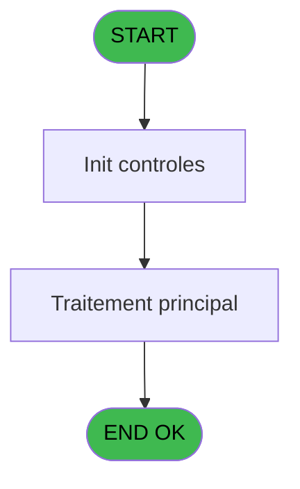
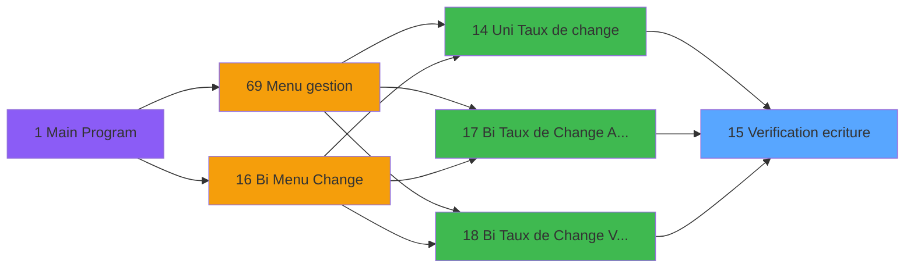

# GES IDE 15 - Verification ecriture

> **Analyse**: Phases 1-4 2026-02-03 11:28 -> 11:28 (14s) | Assemblage 11:28
> **Pipeline**: V7.2 Enrichi
> **Structure**: 4 onglets (Resume | Ecrans | Donnees | Connexions)

<!-- TAB:Resume -->

## 1. FICHE D'IDENTITE

| Attribut | Valeur |
|----------|--------|
| Projet | GES |
| IDE Position | 15 |
| Nom Programme | Verification ecriture |
| Fichier source | `Prg_15.xml` |
| Dossier IDE | Change |
| Taches | 1 (0 ecrans visibles) |
| Tables modifiees | 0 |
| Programmes appeles | 0 |

## 2. DESCRIPTION FONCTIONNELLE

**Verification ecriture** assure la gestion complete de ce processus, accessible depuis [Uni Taux de change (IDE 14)](GES-IDE-14.md), [ Bi  Taux de Change Achat (IDE 17)](GES-IDE-17.md), [ Bi  Taux de Change Vente (IDE 18)](GES-IDE-18.md).

Le flux de traitement s'organise en **1 blocs fonctionnels** :

- **Validation** (1 tache) : controles et verifications de coherence

## 3. BLOCS FONCTIONNELS

### 3.1 Validation (1 tache)

Controles de coherence : 1 tache verifie les donnees et conditions.

---

#### 15 - Verification ecriture

**Role** : Verification : Verification ecriture.

## 5. REGLES METIER

*(Aucune regle metier identifiee)*

## 6. CONTEXTE

- **Appele par**: [Uni Taux de change (IDE 14)](GES-IDE-14.md), [ Bi  Taux de Change Achat (IDE 17)](GES-IDE-17.md), [ Bi  Taux de Change Vente (IDE 18)](GES-IDE-18.md)
- **Appelle**: 0 programmes | **Tables**: 3 (W:0 R:1 L:2) | **Taches**: 1 | **Expressions**: 6

<!-- TAB:Ecrans -->

## 8. ECRANS

*(Programme sans ecran visible)*

## 9. NAVIGATION

### 9.3 Structure hierarchique (1 tache)

| Position | Tache | Type | Dimensions | Bloc |
|----------|-------|------|------------|------|
| **15.1** | [**Verification ecriture** (15)](#t1) | MDI | - | Validation |

### 9.4 Algorigramme

> **Legende**: Vert = START/END OK | Rouge = END KO | Bleu = Decisions
> *Algorigramme auto-genere. Utiliser `/algorigramme` pour une synthese metier detaillee.*

<!-- TAB:Donnees -->

## 10. TABLES

### Tables utilisees (3)

| ID | Nom | Description | Type | R | W | L | Usages |
|----|-----|-------------|------|---|---|---|--------|
| 40 | comptable________cte |  | DB | R |   |   | 1 |
| 44 | change___________chg |  | DB |   |   | L | 1 |
| 147 | change_vente_____chg | Donnees de ventes | DB |   |   | L | 1 |

### Colonnes par table (3 / 1 tables avec colonnes identifiees)

Table 40 - comptable________cte (R) - 1 usages

| Lettre | Variable | Acces | Type |
|--------|----------|-------|------|
| A | > code societe | R | Alpha |
| B | > date comptable | R | Date |
| C | < Autorisation modif | R | Logical |
| D | v. code retours comptable | R | Logical |
| E | v. code change achat | R | Logical |
| F | v. code change vente | R | Logical |

## 11. VARIABLES

### 11.1 Variables de session (3)

Variables persistantes pendant toute la session.

| Lettre | Nom | Type | Usage dans |
|--------|-----|------|-----------|
| D | v. code retours comptable | Logical | - |
| E | v. code change achat | Logical | - |
| F | v. code change vente | Logical | - |

### 11.2 Autres (3)

Variables diverses.

| Lettre | Nom | Type | Usage dans |
|--------|-----|------|-----------|
| A | > code societe | Alpha | 1x refs |
| B | > date comptable | Date | 1x refs |
| C | < Autorisation modif | Logical | - |

## 12. EXPRESSIONS

**6 / 6 expressions decodees (100%)**

### 12.1 Repartition par type

| Type | Expressions | Regles |
|------|-------------|--------|
| CONDITION | 2 | 0 |
| CAST_LOGIQUE | 2 | 0 |
| OTHER | 1 | 0 |
| REFERENCE_VG | 1 | 0 |

### 12.2 Expressions cles par type

#### CONDITION (2 expressions)

| Type | IDE | Expression | Regle |
|------|-----|------------|-------|
| CONDITION | 2 | `> date comptable [B]` | - |
| CONDITION | 1 | `> code societe [A]` | - |

#### CAST_LOGIQUE (2 expressions)

| Type | IDE | Expression | Regle |
|------|-----|------------|-------|
| CAST_LOGIQUE | 4 | `'FALSE'LOG` | - |
| CAST_LOGIQUE | 3 | `'TRUE'LOG` | - |

#### OTHER (1 expressions)

| Type | IDE | Expression | Regle |
|------|-----|------------|-------|
| OTHER | 5 | `[G] OR [J]` | - |

#### REFERENCE_VG (1 expressions)

| Type | IDE | Expression | Regle |
|------|-----|------------|-------|
| REFERENCE_VG | 6 | `VG3` | - |

<!-- TAB:Connexions -->

## 13. GRAPHE D'APPELS

### 13.1 Chaine depuis Main (Callers)

Main -> ... -> [Uni Taux de change (IDE 14)](GES-IDE-14.md) -> **Verification ecriture (IDE 15)**

Main -> ... -> [ Bi  Taux de Change Achat (IDE 17)](GES-IDE-17.md) -> **Verification ecriture (IDE 15)**

Main -> ... -> [ Bi  Taux de Change Vente (IDE 18)](GES-IDE-18.md) -> **Verification ecriture (IDE 15)**

### 13.2 Callers

| IDE | Nom Programme | Nb Appels |
|-----|---------------|-----------|
| [14](GES-IDE-14.md) | Uni Taux de change | 1 |
| [17](GES-IDE-17.md) |  Bi  Taux de Change Achat | 1 |
| [18](GES-IDE-18.md) |  Bi  Taux de Change Vente | 1 |

### 13.3 Callees (programmes appeles)

### 13.4 Detail Callees avec contexte

| IDE | Nom Programme | Appels | Contexte |
|-----|---------------|--------|----------|
| - | (aucun) | - | - |

## 14. RECOMMANDATIONS MIGRATION

### 14.1 Profil du programme

| Metrique | Valeur | Impact migration |
|----------|--------|-----------------|
| Lignes de logique | 26 | Programme compact |
| Expressions | 6 | Peu de logique |
| Tables WRITE | 0 | Impact faible |
| Sous-programmes | 0 | Peu de dependances |
| Ecrans visibles | 0 | Ecran unique ou traitement batch |
| Code desactive | 0% (0 / 26) | Code sain |
| Regles metier | 0 | Pas de regle identifiee |

### 14.2 Plan de migration par bloc

#### Validation (1 tache: 0 ecran, 1 traitement)

- **Strategie** : FluentValidation avec validators specifiques.
- Chaque tache de validation -> un validator injectable

### 14.3 Dependances critiques

| Dependance | Type | Appels | Impact |
|------------|------|--------|--------|

---
*Spec DETAILED generee par Pipeline V7.2 - 2026-02-03 11:28*
