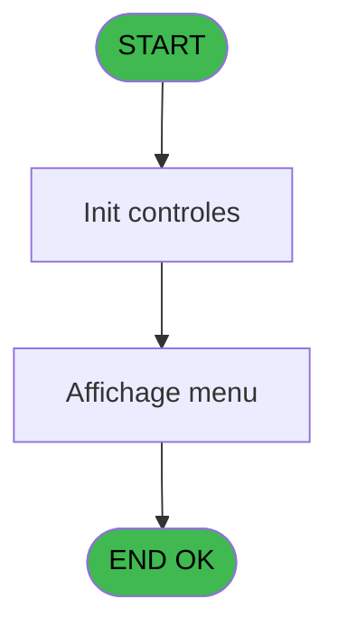
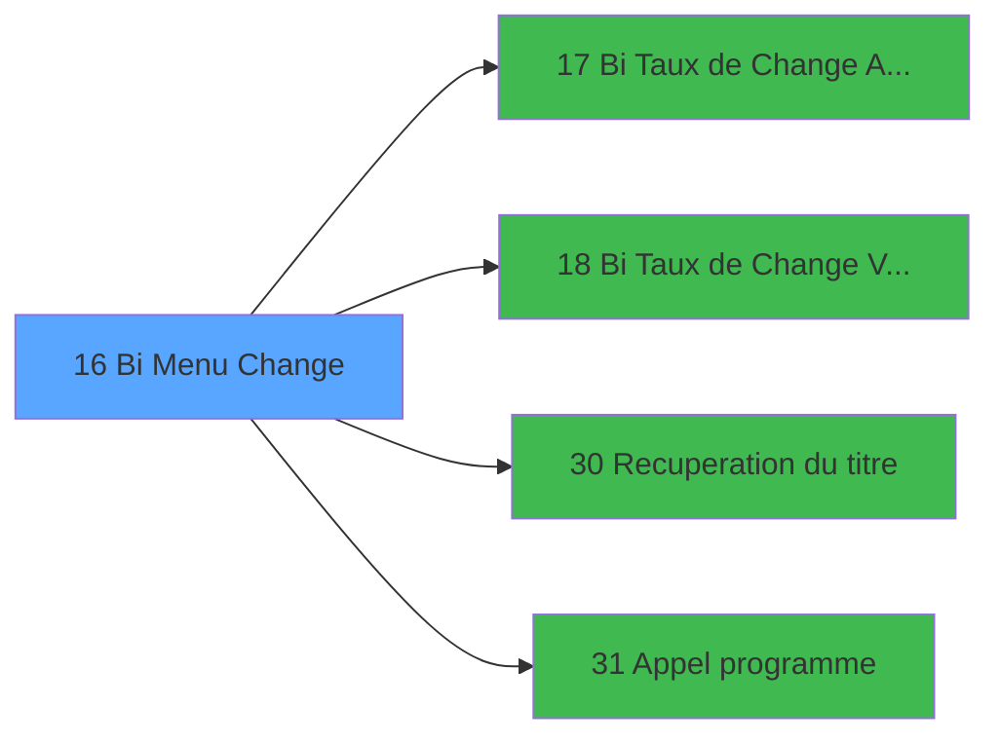

# GES IDE 16 - Bi  Menu Change

> **Analyse**: Phases 1-4 2026-02-03 11:28 -> 11:29 (14s) | Assemblage 11:29
> **Pipeline**: V7.2 Enrichi
> **Structure**: 4 onglets (Resume | Ecrans | Donnees | Connexions)

<!-- TAB:Resume -->

## 1. FICHE D'IDENTITE

| Attribut | Valeur |
|----------|--------|
| Projet | GES |
| IDE Position | 16 |
| Nom Programme | Bi  Menu Change |
| Fichier source | `Prg_16.xml` |
| Dossier IDE | Change |
| Taches | 2 (1 ecrans visibles) |
| Tables modifiees | 0 |
| Programmes appeles | 4 |

## 2. DESCRIPTION FONCTIONNELLE

**Bi  Menu Change** assure la gestion complete de ce processus, accessible depuis [Menu gestion (IDE 69)](GES-IDE-69.md).

Le flux de traitement s'organise en **2 blocs fonctionnels** :

- **Consultation** (1 tache) : ecrans de recherche, selection et consultation
- **Traitement** (1 tache) : traitements metier divers

Detail : phases du traitement

#### Phase 1 : Traitement (1 tache)

- **16** - CV  Menu Services village **[[ECRAN]](#ecran-t1)**

Delegue a : [ Bi  Taux de Change Achat (IDE 17)](GES-IDE-17.md), [Recuperation du titre (IDE 30)](GES-IDE-30.md), [Appel programme (IDE 31)](GES-IDE-31.md)

#### Phase 2 : Consultation (1 tache)

- **16.1** - Affichage menu **[[ECRAN]](#ecran-t2)**

Delegue a : [Recuperation du titre (IDE 30)](GES-IDE-30.md)

## 3. BLOCS FONCTIONNELS

### 3.1 Traitement (1 tache)

Traitements internes.

---

#### 16 - CV  Menu Services village [[ECRAN]](#ecran-t1)

**Role** : Traitement : CV  Menu Services village.
**Ecran** : 232 x 18 DLU (MDI) | [Voir mockup](#ecran-t1)
**Delegue a** : [ Bi  Taux de Change Achat (IDE 17)](GES-IDE-17.md), [Recuperation du titre (IDE 30)](GES-IDE-30.md), [Appel programme (IDE 31)](GES-IDE-31.md)

### 3.2 Consultation (1 tache)

Ecrans de recherche et consultation.

---

#### 16.1 - Affichage menu [[ECRAN]](#ecran-t2)

**Role** : Reinitialisation : Affichage menu.
**Ecran** : 557 x 157 DLU (MDI) | [Voir mockup](#ecran-t2)

## 5. REGLES METIER

*(Aucune regle metier identifiee)*

## 6. CONTEXTE

- **Appele par**: [Menu gestion (IDE 69)](GES-IDE-69.md)
- **Appelle**: 4 programmes | **Tables**: 1 (W:0 R:1 L:0) | **Taches**: 2 | **Expressions**: 5

<!-- TAB:Ecrans -->

## 8. ECRANS

### 8.1 Forms visibles (1 / 2)

| # | Position | Tache | Nom | Type | Largeur | Hauteur | Bloc |
|---|----------|-------|-----|------|---------|---------|------|
| 1 | 16.1 | 16.1 | Affichage menu | MDI | 557 | 157 | Consultation |

### 8.2 Mockups Ecrans

---

#### 16.1 - Affichage menu
**Tache** : [16.1](#t2) | **Type** : MDI | **Dimensions** : 557 x 157 DLU
**Bloc** : Consultation | **Titre IDE** : Affichage menu

<!-- FORM-DATA:
{
    "width":  557,
    "vFactor":  8,
    "type":  "MDI",
    "hFactor":  8,
    "controls":  [
                     {
                         "x":  0,
                         "type":  "label",
                         "var":  "",
                         "y":  0,
                         "w":  555,
                         "fmt":  "",
                         "name":  "",
                         "h":  18,
                         "color":  "",
                         "text":  "",
                         "parent":  null
                     },
                     {
                         "x":  197,
                         "type":  "label",
                         "var":  "",
                         "y":  38,
                         "w":  308,
                         "fmt":  "",
                         "name":  "",
                         "h":  73,
                         "color":  "",
                         "text":  "",
                         "parent":  null
                     },
                     {
                         "x":  231,
                         "type":  "label",
                         "var":  "",
                         "y":  51,
                         "w":  229,
                         "fmt":  "",
                         "name":  "",
                         "h":  34,
                         "color":  "",
                         "text":  "",
                         "parent":  5
                     },
                     {
                         "x":  234,
                         "type":  "label",
                         "var":  "",
                         "y":  52,
                         "w":  45,
                         "fmt":  "",
                         "name":  "",
                         "h":  32,
                         "color":  "",
                         "text":  "",
                         "parent":  5
                     },
                     {
                         "x":  290,
                         "type":  "label",
                         "var":  "",
                         "y":  56,
                         "w":  150,
                         "fmt":  "",
                         "name":  "",
                         "h":  8,
                         "color":  "7",
                         "text":  "Taux à l\u0027achat",
                         "parent":  5
                     },
                     {
                         "x":  290,
                         "type":  "label",
                         "var":  "",
                         "y":  70,
                         "w":  163,
                         "fmt":  "",
                         "name":  "",
                         "h":  8,
                         "color":  "7",
                         "text":  "Taux à la vente",
                         "parent":  5
                     },
                     {
                         "x":  251,
                         "type":  "label",
                         "var":  "",
                         "y":  94,
                         "w":  123,
                         "fmt":  "",
                         "name":  "",
                         "h":  10,
                         "color":  "",
                         "text":  "Votre choix",
                         "parent":  5
                     },
                     {
                         "x":  0,
                         "type":  "label",
                         "var":  "",
                         "y":  133,
                         "w":  554,
                         "fmt":  "",
                         "name":  "",
                         "h":  24,
                         "color":  "",
                         "text":  "",
                         "parent":  null
                     },
                     {
                         "x":  385,
                         "type":  "edit",
                         "var":  "",
                         "y":  94,
                         "w":  26,
                         "fmt":  "",
                         "name":  "",
                         "h":  10,
                         "color":  "6",
                         "text":  "",
                         "parent":  5
                     },
                     {
                         "x":  312,
                         "type":  "edit",
                         "var":  "",
                         "y":  5,
                         "w":  233,
                         "fmt":  "WWW DD MMM YYYYT",
                         "name":  "",
                         "h":  8,
                         "color":  "",
                         "text":  "",
                         "parent":  null
                     },
                     {
                         "x":  34,
                         "type":  "image",
                         "var":  "",
                         "y":  34,
                         "w":  122,
                         "fmt":  "",
                         "name":  "",
                         "h":  27,
                         "color":  "",
                         "text":  "",
                         "parent":  null
                     },
                     {
                         "x":  243,
                         "type":  "button",
                         "var":  "",
                         "y":  55,
                         "w":  26,
                         "fmt":  "1",
                         "name":  "1",
                         "h":  8,
                         "color":  "",
                         "text":  "",
                         "parent":  null
                     },
                     {
                         "x":  243,
                         "type":  "button",
                         "var":  "",
                         "y":  70,
                         "w":  26,
                         "fmt":  "2",
                         "name":  "2",
                         "h":  8,
                         "color":  "",
                         "text":  "",
                         "parent":  null
                     },
                     {
                         "x":  8,
                         "type":  "button",
                         "var":  "",
                         "y":  136,
                         "w":  154,
                         "fmt":  "\u0026Quitter",
                         "name":  "",
                         "h":  18,
                         "color":  "",
                         "text":  "",
                         "parent":  12
                     },
                     {
                         "x":  6,
                         "type":  "edit",
                         "var":  "",
                         "y":  5,
                         "w":  267,
                         "fmt":  "20",
                         "name":  "",
                         "h":  8,
                         "color":  "",
                         "text":  "",
                         "parent":  null
                     }
                 ],
    "taskId":  "16.1",
    "height":  157
}
-->

<strong>Champs : 3 champs</strong>

| Pos (x,y) | Nom | Variable | Type |
|-----------|-----|----------|------|
| 385,94 | (sans nom) | - | edit |
| 312,5 | WWW DD MMM YYYYT | - | edit |
| 6,5 | 20 | - | edit |

<strong>Boutons : 3 boutons</strong>

| Bouton | Pos (x,y) | Action |
|--------|-----------|--------|
| 1 | 243,55 | Bouton fonctionnel |
| 2 | 243,70 | Bouton fonctionnel |
| Quitter | 8,136 | Quitte le programme |

## 9. NAVIGATION

Ecran unique: **Affichage menu**

### 9.3 Structure hierarchique (2 taches)

| Position | Tache | Type | Dimensions | Bloc |
|----------|-------|------|------------|------|
| **16.1** | [**CV  Menu Services village** (16)](#t1) [mockup](#ecran-t1) | MDI | 232x18 | Traitement |
| **16.2** | [**Affichage menu** (16.1)](#t2) [mockup](#ecran-t2) | MDI | 557x157 | Consultation |

### 9.4 Algorigramme

> **Legende**: Vert = START/END OK | Rouge = END KO | Bleu = Decisions
> *Algorigramme auto-genere. Utiliser `/algorigramme` pour une synthese metier detaillee.*

<!-- TAB:Donnees -->

## 10. TABLES

### Tables utilisees (1)

| ID | Nom | Description | Type | R | W | L | Usages |
|----|-----|-------------|------|---|---|---|--------|
| 70 | date_comptable___dat |  | DB | R |   |   | 1 |

### Colonnes par table (1 / 1 tables avec colonnes identifiees)

Table 70 - date_comptable___dat (R) - 1 usages

| Lettre | Variable | Acces | Type |
|--------|----------|-------|------|
| A | v titre ecran | R | Alpha |
| B | W1 choix action | R | Alpha |
| C | W1 fin tâche | R | Alpha |

## 11. VARIABLES

### 11.1 Parametres entrants (1)

Variables recues du programme appelant ([Menu gestion (IDE 69)](GES-IDE-69.md)).

| Lettre | Nom | Type | Usage dans |
|--------|-----|------|-----------|
| A | P0 societe | Alpha | 1x parametre entrant |

### 11.2 Variables de travail (2)

Variables internes au programme.

| Lettre | Nom | Type | Usage dans |
|--------|-----|------|-----------|
| B | W0 choix action | Alpha | - |
| C | W0 date comptable | Date | 3x calcul interne |

## 12. EXPRESSIONS

**5 / 5 expressions decodees (100%)**

### 12.1 Repartition par type

| Type | Expressions | Regles |
|------|-------------|--------|
| CONSTANTE | 1 | 0 |
| CONDITION | 4 | 0 |

### 12.2 Expressions cles par type

#### CONSTANTE (1 expressions)

| Type | IDE | Expression | Regle |
|------|-----|------------|-------|
| CONSTANTE | 4 | `'C'` | - |

#### CONDITION (4 expressions)

| Type | IDE | Expression | Regle |
|------|-----|------------|-------|
| CONDITION | 3 | `W0 date comptable [C]='F'` | - |
| CONDITION | 5 | `P0 societe [A]=''` | - |
| CONDITION | 1 | `W0 date comptable [C]='1'` | - |
| CONDITION | 2 | `W0 date comptable [C]='2'` | - |

<!-- TAB:Connexions -->

## 13. GRAPHE D'APPELS

### 13.1 Chaine depuis Main (Callers)

Main -> ... -> [Menu gestion (IDE 69)](GES-IDE-69.md) -> **Bi  Menu Change (IDE 16)**

### 13.2 Callers

| IDE | Nom Programme | Nb Appels |
|-----|---------------|-----------|
| [69](GES-IDE-69.md) | Menu gestion | 1 |

### 13.3 Callees (programmes appeles)

### 13.4 Detail Callees avec contexte

| IDE | Nom Programme | Appels | Contexte |
|-----|---------------|--------|----------|
| [17](GES-IDE-17.md) |  Bi  Taux de Change Achat | 1 | Sous-programme |
| [18](GES-IDE-18.md) |  Bi  Taux de Change Vente | 1 | Sous-programme |
| [30](GES-IDE-30.md) | Recuperation du titre | 1 | Recuperation donnees |
| [31](GES-IDE-31.md) | Appel programme | 1 | Sous-programme |

## 14. RECOMMANDATIONS MIGRATION

### 14.1 Profil du programme

| Metrique | Valeur | Impact migration |
|----------|--------|-----------------|
| Lignes de logique | 27 | Programme compact |
| Expressions | 5 | Peu de logique |
| Tables WRITE | 0 | Impact faible |
| Sous-programmes | 4 | Peu de dependances |
| Ecrans visibles | 1 | Ecran unique ou traitement batch |
| Code desactive | 0% (0 / 27) | Code sain |
| Regles metier | 0 | Pas de regle identifiee |

### 14.2 Plan de migration par bloc

#### Traitement (1 tache: 1 ecran, 0 traitement)

- **Strategie** : 1 composant(s) UI (Razor/React) avec formulaires et validation.
- 4 sous-programme(s) a migrer ou a reutiliser depuis les services existants.
- Decomposer les taches en services unitaires testables.

#### Consultation (1 tache: 1 ecran, 0 traitement)

- **Strategie** : Composants de recherche/selection en modales.
- 1 ecran : Affichage menu

### 14.3 Dependances critiques

| Dependance | Type | Appels | Impact |
|------------|------|--------|--------|
| [Recuperation du titre (IDE 30)](GES-IDE-30.md) | Sous-programme | 1x | Normale - Recuperation donnees |
| [Appel programme (IDE 31)](GES-IDE-31.md) | Sous-programme | 1x | Normale - Sous-programme |
| [ Bi  Taux de Change Achat (IDE 17)](GES-IDE-17.md) | Sous-programme | 1x | Normale - Sous-programme |
| [ Bi  Taux de Change Vente (IDE 18)](GES-IDE-18.md) | Sous-programme | 1x | Normale - Sous-programme |

---
*Spec DETAILED generee par Pipeline V7.2 - 2026-02-03 11:29*
