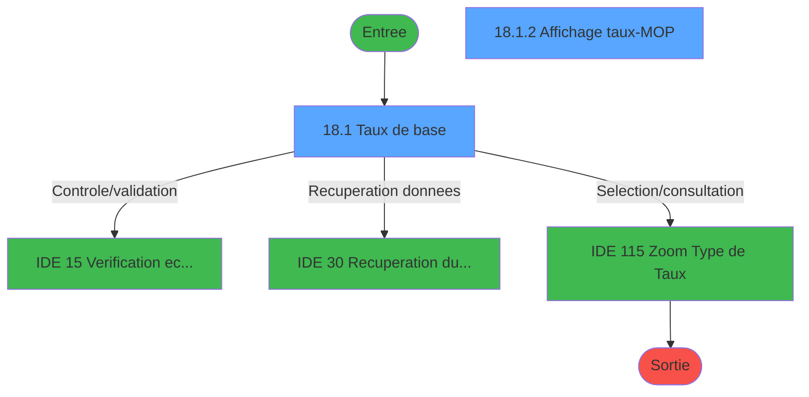
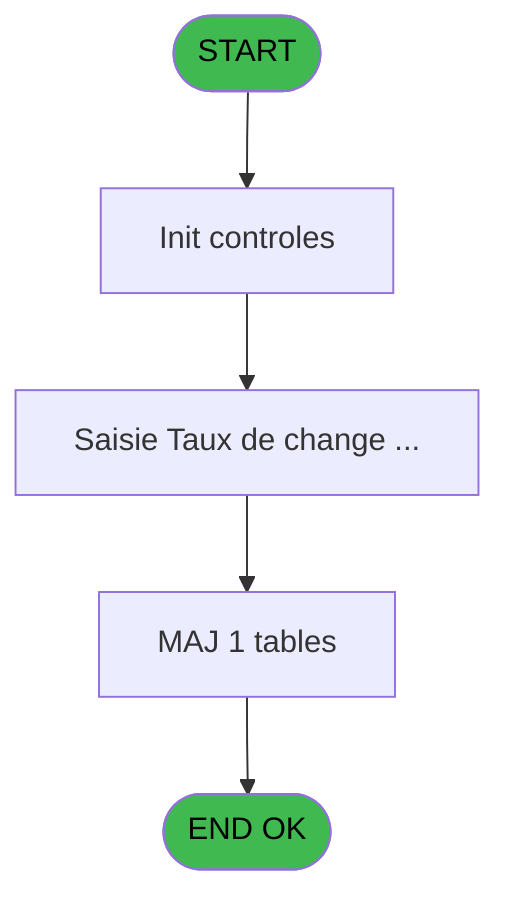
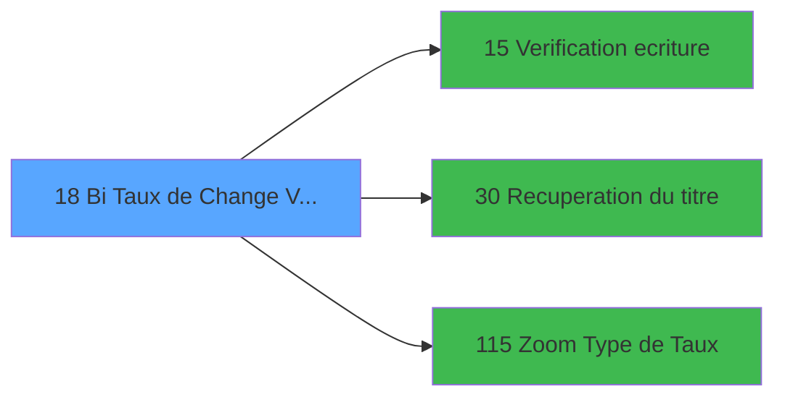

# GES IDE 18 - Bi  Taux de Change Vente

> **Analyse**: Phases 1-4 2026-02-03 11:29 -> 11:29 (14s) | Assemblage 11:29
> **Pipeline**: V7.2 Enrichi
> **Structure**: 4 onglets (Resume | Ecrans | Donnees | Connexions)

<!-- TAB:Resume -->

## 1. FICHE D'IDENTITE

| Attribut | Valeur |
|----------|--------|
| Projet | GES |
| IDE Position | 18 |
| Nom Programme | Bi  Taux de Change Vente |
| Fichier source | `Prg_18.xml` |
| Dossier IDE | Change |
| Taches | 6 (2 ecrans visibles) |
| Tables modifiees | 1 |
| Programmes appeles | 3 |

## 2. DESCRIPTION FONCTIONNELLE

**Bi  Taux de Change Vente** assure la gestion complete de ce processus, accessible depuis [Bi  Menu Change (IDE 16)](GES-IDE-16.md).

Le flux de traitement s'organise en **2 blocs fonctionnels** :

- **Traitement** (5 taches) : traitements metier divers
- **Reglement** (1 tache) : gestion des moyens de paiement et reglements

**Donnees modifiees** : 1 tables en ecriture (moyens_reglement_mor).

**Logique metier** : 1 regles identifiees couvrant conditions metier.

Detail : phases du traitement

#### Phase 1 : Traitement (5 taches)

- **18** - (sans nom)
- **18.1** - Taux de base **[[ECRAN]](#ecran-t2)**
- **18.1.1** - Mise à jour taux change
- **18.1.2.1** - Mise à jour taux change
- **18.1.3** - Test Z/O Entete

Delegue a : [Recuperation du titre (IDE 30)](GES-IDE-30.md)

#### Phase 2 : Reglement (1 tache)

- **18.1.2** - Affichage taux-MOP **[[ECRAN]](#ecran-t5)**

#### Tables impactees

| Table | Operations | Role metier |
|-------|-----------|-------------|
| moyens_reglement_mor | R/**W** (4 usages) | Reglements / paiements |

## 3. BLOCS FONCTIONNELS

### 3.1 Traitement (5 taches)

Traitements internes.

---

#### 18 - (sans nom)

**Role** : Traitement interne.

4 sous-taches directes

| Tache | Nom | Bloc |
|-------|-----|------|
| [18.1](#t2) | Taux de base **[[ECRAN]](#ecran-t2)** | Traitement |
| [18.1.1](#t4) | Mise à jour taux change | Traitement |
| [18.1.2.1](#t6) | Mise à jour taux change | Traitement |
| [18.1.3](#t7) | Test Z/O Entete | Traitement |

**Delegue a** : [Recuperation du titre (IDE 30)](GES-IDE-30.md)

---

#### 18.1 - Taux de base [[ECRAN]](#ecran-t2)

**Role** : Calcul : Taux de base.
**Ecran** : 899 x 225 DLU (MDI) | [Voir mockup](#ecran-t2)
**Variables liees** : C (W0 Type de Taux), D (W0 Libelle Taux), J (W0 affichageFIN taux MOP)
**Delegue a** : [Recuperation du titre (IDE 30)](GES-IDE-30.md)

---

#### 18.1.1 - Mise à jour taux change

**Role** : Calcul : Mise à jour taux change.
**Variables liees** : C (W0 Type de Taux), D (W0 Libelle Taux), J (W0 affichageFIN taux MOP)
**Delegue a** : [Recuperation du titre (IDE 30)](GES-IDE-30.md)

---

#### 18.1.2.1 - Mise à jour taux change

**Role** : Calcul : Mise à jour taux change.
**Variables liees** : C (W0 Type de Taux), D (W0 Libelle Taux), J (W0 affichageFIN taux MOP)
**Delegue a** : [Recuperation du titre (IDE 30)](GES-IDE-30.md)

---

#### 18.1.3 - Test Z/O Entete

**Role** : Verification : Test Z/O Entete.
**Delegue a** : [Recuperation du titre (IDE 30)](GES-IDE-30.md)

### 3.2 Reglement (1 tache)

Gestion des moyens de paiement : 1 tache de reglement.

---

#### 18.1.2 - Affichage taux-MOP [[ECRAN]](#ecran-t5)

**Role** : Calcul : Affichage taux-MOP.
**Ecran** : 376 x 144 DLU (Modal) | [Voir mockup](#ecran-t5)
**Variables liees** : J (W0 affichageFIN taux MOP)

## 5. REGLES METIER

1 regles identifiees:

### Autres (1 regles)

#### [RM-001] Traitement conditionnel si W0 Type de Taux [C] est a zero

| Element | Detail |
|---------|--------|
| **Condition** | `W0 Type de Taux [C]=0` |
| **Si vrai** | 'F' |
| **Si faux** | '') |
| **Variables** | C (W0 Type de Taux) |
| **Expression source** | Expression 3 : `IF (W0 Type de Taux [C]=0,'F','')` |
| **Exemple** | Si W0 Type de Taux [C]=0 → 'F'. Sinon → '') |
| **Impact** | [18.1 - Taux de base](#t2) |

## 6. CONTEXTE

- **Appele par**: [Bi  Menu Change (IDE 16)](GES-IDE-16.md)
- **Appelle**: 3 programmes | **Tables**: 3 (W:1 R:2 L:2) | **Taches**: 6 | **Expressions**: 5

<!-- TAB:Ecrans -->

## 8. ECRANS

### 8.1 Forms visibles (2 / 6)

| # | Position | Tache | Nom | Type | Largeur | Hauteur | Bloc |
|---|----------|-------|-----|------|---------|---------|------|
| 1 | 18.1 | 18.1 | Taux de base | MDI | 899 | 225 | Traitement |
| 2 | 18.1.2 | 18.1.2 | Affichage taux-MOP | Modal | 376 | 144 | Reglement |

### 8.2 Mockups Ecrans

---

#### 18.1 - Taux de base
**Tache** : [18.1](#t2) | **Type** : MDI | **Dimensions** : 899 x 225 DLU
**Bloc** : Traitement | **Titre IDE** : Taux de base

<!-- FORM-DATA:
{
    "width":  899,
    "vFactor":  8,
    "type":  "MDI",
    "hFactor":  8,
    "controls":  [
                     {
                         "x":  0,
                         "type":  "label",
                         "var":  "",
                         "y":  0,
                         "w":  894,
                         "fmt":  "",
                         "name":  "",
                         "h":  18,
                         "color":  "",
                         "text":  "",
                         "parent":  null
                     },
                     {
                         "x":  15,
                         "type":  "table",
                         "var":  "",
                         "name":  "",
                         "titleH":  12,
                         "color":  "110",
                         "w":  462,
                         "y":  37,
                         "fmt":  "",
                         "parent":  null,
                         "text":  "",
                         "rowH":  13,
                         "h":  150,
                         "cols":  [
                                      {
                                          "title":  "Code",
                                          "layer":  1,
                                          "w":  98
                                      },
                                      {
                                          "title":  "Taux Banque",
                                          "layer":  2,
                                          "w":  329
                                      }
                                  ],
                         "rows":  2
                     },
                     {
                         "x":  490,
                         "type":  "label",
                         "var":  "",
                         "y":  37,
                         "w":  388,
                         "fmt":  "",
                         "name":  "",
                         "h":  150,
                         "color":  "",
                         "text":  "",
                         "parent":  null
                     },
                     {
                         "x":  0,
                         "type":  "label",
                         "var":  "",
                         "y":  200,
                         "w":  895,
                         "fmt":  "",
                         "name":  "",
                         "h":  24,
                         "color":  "",
                         "text":  "",
                         "parent":  null
                     },
                     {
                         "x":  21,
                         "type":  "edit",
                         "var":  "",
                         "y":  53,
                         "w":  42,
                         "fmt":  "",
                         "name":  "",
                         "h":  8,
                         "color":  "110",
                         "text":  "",
                         "parent":  5
                     },
                     {
                         "x":  150,
                         "type":  "edit",
                         "var":  "",
                         "y":  53,
                         "w":  232,
                         "fmt":  "## ### ### ###.#####Z",
                         "name":  "DEV taux banque Vent",
                         "h":  8,
                         "color":  "110",
                         "text":  "",
                         "parent":  5
                     },
                     {
                         "x":  397,
                         "type":  "button",
                         "var":  "",
                         "y":  50,
                         "w":  43,
                         "fmt":  "\u003e\u003e\u003e",
                         "name":  "bouton zoom",
                         "h":  11,
                         "color":  "",
                         "text":  "",
                         "parent":  5
                     },
                     {
                         "x":  6,
                         "type":  "edit",
                         "var":  "",
                         "y":  4,
                         "w":  267,
                         "fmt":  "20",
                         "name":  "",
                         "h":  8,
                         "color":  "",
                         "text":  "",
                         "parent":  null
                     },
                     {
                         "x":  647,
                         "type":  "edit",
                         "var":  "",
                         "y":  4,
                         "w":  237,
                         "fmt":  "WWW DD MMM YYYYT",
                         "name":  "",
                         "h":  8,
                         "color":  "",
                         "text":  "",
                         "parent":  null
                     },
                     {
                         "x":  8,
                         "type":  "button",
                         "var":  "",
                         "y":  203,
                         "w":  154,
                         "fmt":  "\u0026Quitter",
                         "name":  "",
                         "h":  18,
                         "color":  "",
                         "text":  "",
                         "parent":  14
                     }
                 ],
    "taskId":  "18.1",
    "height":  225
}
-->

<strong>Champs : 4 champs</strong>

| Pos (x,y) | Nom | Variable | Type |
|-----------|-----|----------|------|
| 21,53 | (sans nom) | - | edit |
| 150,53 | DEV taux banque Vent | - | edit |
| 6,4 | 20 | - | edit |
| 647,4 | WWW DD MMM YYYYT | - | edit |

<strong>Boutons : 2 boutons</strong>

| Bouton | Pos (x,y) | Action |
|--------|-----------|--------|
| >>> | 397,50 | Bouton fonctionnel |
| Quitter | 8,203 | Quitte le programme |

---

#### 18.1.2 - Affichage taux-MOP
**Tache** : [18.1.2](#t5) | **Type** : Modal | **Dimensions** : 376 x 144 DLU
**Bloc** : Reglement | **Titre IDE** : Affichage taux-MOP

<!-- FORM-DATA:
{
    "width":  376,
    "vFactor":  8,
    "type":  "Modal",
    "hFactor":  8,
    "controls":  [
                     {
                         "x":  17,
                         "type":  "table",
                         "var":  "",
                         "name":  "",
                         "titleH":  12,
                         "color":  "110",
                         "w":  350,
                         "y":  16,
                         "fmt":  "",
                         "parent":  null,
                         "text":  "",
                         "rowH":  12,
                         "h":  125,
                         "cols":  [
                                      {
                                          "title":  "Type",
                                          "layer":  1,
                                          "w":  84
                                      },
                                      {
                                          "title":  "Taux",
                                          "layer":  2,
                                          "w":  232
                                      }
                                  ],
                         "rows":  2
                     },
                     {
                         "x":  36,
                         "type":  "edit",
                         "var":  "",
                         "y":  32,
                         "w":  53,
                         "fmt":  "",
                         "name":  "",
                         "h":  8,
                         "color":  "110",
                         "text":  "",
                         "parent":  2
                     },
                     {
                         "x":  115,
                         "type":  "edit",
                         "var":  "",
                         "y":  32,
                         "w":  198,
                         "fmt":  "### ### ###.#####Z",
                         "name":  "MOR taux de change",
                         "h":  8,
                         "color":  "110",
                         "text":  "",
                         "parent":  2
                     },
                     {
                         "x":  55,
                         "type":  "edit",
                         "var":  "",
                         "y":  3,
                         "w":  267,
                         "fmt":  "",
                         "name":  "",
                         "h":  8,
                         "color":  "7",
                         "text":  "",
                         "parent":  null
                     }
                 ],
    "taskId":  "18.1.2",
    "height":  144
}
-->

<strong>Champs : 3 champs</strong>

| Pos (x,y) | Nom | Variable | Type |
|-----------|-----|----------|------|
| 36,32 | (sans nom) | - | edit |
| 115,32 | MOR taux de change | - | edit |
| 55,3 | (sans nom) | - | edit |

## 9. NAVIGATION

### 9.1 Enchainement des ecrans

**Detail par enchainement :**

| Depuis | Action | Vers | Retour |
|--------|--------|------|--------|
| Taux de base | Controle/validation | [  Verification ecriture (IDE 15)](GES-IDE-15.md) | Retour ecran |
| Taux de base | Recuperation donnees | [Recuperation du titre (IDE 30)](GES-IDE-30.md) | Retour ecran |
| Taux de base | Selection/consultation | [Zoom Type de Taux (IDE 115)](GES-IDE-115.md) | Retour ecran |

### 9.3 Structure hierarchique (6 taches)

| Position | Tache | Type | Dimensions | Bloc |
|----------|-------|------|------------|------|
| **18.1** | [**(sans nom)** (18)](#t1) | MDI | - | Traitement |
| 18.1.1 | [Taux de base (18.1)](#t2) [mockup](#ecran-t2) | MDI | 899x225 | |
| 18.1.2 | [Mise à jour taux change (18.1.1)](#t4) | MDI | - | |
| 18.1.3 | [Mise à jour taux change (18.1.2.1)](#t6) | MDI | - | |
| 18.1.4 | [Test Z/O Entete (18.1.3)](#t7) | MDI | - | |
| **18.2** | [**Affichage taux-MOP** (18.1.2)](#t5) [mockup](#ecran-t5) | Modal | 376x144 | Reglement |

### 9.4 Algorigramme

> **Legende**: Vert = START/END OK | Rouge = END KO | Bleu = Decisions
> *Algorigramme auto-genere. Utiliser `/algorigramme` pour une synthese metier detaillee.*

<!-- TAB:Donnees -->

## 10. TABLES

### Tables utilisees (3)

| ID | Nom | Description | Type | R | W | L | Usages |
|----|-----|-------------|------|---|---|---|--------|
| 139 | moyens_reglement_mor | Reglements / paiements | DB | R | **W** |   | 4 |
| 140 | moyen_paiement___mop |  | DB |   |   | L | 1 |
| 141 | devises__________dev | Devises / taux de change | DB | R |   | L | 2 |

### Colonnes par table (1 / 2 tables avec colonnes identifiees)

Table 139 - moyens_reglement_mor (R/**W**) - 4 usages

| Lettre | Variable | Acces | Type |
|--------|----------|-------|------|
| A | bouton zoom | W | Alpha |
| B | W0 mode accès zoom | W | Alpha |
| C | W0 ds le zoom | W | Alpha |
| D | W0 mise à jour taux | W | Numeric |
| E | W0 memory-taux | W | Numeric |
| F | W0 couleur flêche | W | Numeric |
| G | W0 mode rapide (R) | W | Alpha |
| H | W0 Z/O | W | Alpha |
| I | v. titre ecran | W | Alpha |
| J | W0 affichageFIN taux MOP | W | Logical |

Table 141 - devises__________dev (R/L) - 2 usages

*Table utilisee uniquement en Link ou aucune colonne Real identifiee dans le DataView.*

## 11. VARIABLES

### 11.1 Parametres entrants (2)

Variables recues du programme appelant ([Bi  Menu Change (IDE 16)](GES-IDE-16.md)).

| Lettre | Nom | Type | Usage dans |
|--------|-----|------|-----------|
| A | P0 Societe | Alpha | - |
| B | P0 date comptable | Date | - |

### 11.2 Variables de session (1)

Variables persistantes pendant toute la session.

| Lettre | Nom | Type | Usage dans |
|--------|-----|------|-----------|
| I | v. titre ecran | Alpha | - |

### 11.3 Variables de travail (7)

Variables internes au programme.

| Lettre | Nom | Type | Usage dans |
|--------|-----|------|-----------|
| C | W0 Type de Taux | Numeric | [18.1](#t2), [18.1.1](#t4), [18.1.2](#t5) |
| D | W0 Libelle Taux | Alpha | - |
| E | W0 Fin tache | Alpha | 1x calcul interne |
| F | W0 autorisation modif | Logical | - |
| G | W0 mode rapide (R) | Alpha | - |
| H | W0 Z/O | Alpha | - |
| J | W0 affichageFIN taux MOP | Logical | - |

## 12. EXPRESSIONS

**5 / 5 expressions decodees (100%)**

### 12.1 Repartition par type

| Type | Expressions | Regles |
|------|-------------|--------|
| CONDITION | 3 | 5 |
| CAST_LOGIQUE | 2 | 0 |

### 12.2 Expressions cles par type

#### CONDITION (3 expressions)

| Type | IDE | Expression | Regle |
|------|-----|------------|-------|
| CONDITION | 3 | `IF (W0 Type de Taux [C]=0,'F','')` | [RM-001](#rm-RM-001) |
| CONDITION | 2 | `W0 Fin tache [E]='F'` | - |
| CONDITION | 1 | `W0 Type de Taux [C]<>0` | - |

#### CAST_LOGIQUE (2 expressions)

| Type | IDE | Expression | Regle |
|------|-----|------------|-------|
| CAST_LOGIQUE | 5 | `INIPut ('AllowCreateInModify = Y','FALSE'LOG)` | - |
| CAST_LOGIQUE | 4 | `INIPut ('AllowCreateInModify = N','FALSE'LOG)` | - |

<!-- TAB:Connexions -->

## 13. GRAPHE D'APPELS

### 13.1 Chaine depuis Main (Callers)

Main -> ... -> [Bi  Menu Change (IDE 16)](GES-IDE-16.md) -> **Bi  Taux de Change Vente (IDE 18)**

### 13.2 Callers

| IDE | Nom Programme | Nb Appels |
|-----|---------------|-----------|
| [16](GES-IDE-16.md) | Bi  Menu Change | 1 |

### 13.3 Callees (programmes appeles)

### 13.4 Detail Callees avec contexte

| IDE | Nom Programme | Appels | Contexte |
|-----|---------------|--------|----------|
| [15](GES-IDE-15.md) |   Verification ecriture | 1 | Controle/validation |
| [30](GES-IDE-30.md) | Recuperation du titre | 1 | Recuperation donnees |
| [115](GES-IDE-115.md) | Zoom Type de Taux | 1 | Selection/consultation |

## 14. RECOMMANDATIONS MIGRATION

### 14.1 Profil du programme

| Metrique | Valeur | Impact migration |
|----------|--------|-----------------|
| Lignes de logique | 171 | Programme compact |
| Expressions | 5 | Peu de logique |
| Tables WRITE | 1 | Impact faible |
| Sous-programmes | 3 | Peu de dependances |
| Ecrans visibles | 2 | Quelques ecrans |
| Code desactive | 0% (0 / 171) | Code sain |
| Regles metier | 1 | Quelques regles a preserver |

### 14.2 Plan de migration par bloc

#### Traitement (5 taches: 1 ecran, 4 traitements)

- **Strategie** : Orchestrateur avec 1 ecrans (Razor/React) et 4 traitements backend (services).
- Les ecrans deviennent des composants UI, les traitements invisibles deviennent des services injectables.
- 3 sous-programme(s) a migrer ou a reutiliser depuis les services existants.
- Decomposer les taches en services unitaires testables.

#### Reglement (1 tache: 1 ecran, 0 traitement)

- **Strategie** : Service `IReglementService` avec pattern Strategy par mode de paiement.
- Integration TPE si applicable

### 14.3 Dependances critiques

| Dependance | Type | Appels | Impact |
|------------|------|--------|--------|
| moyens_reglement_mor | Table WRITE (Database) | 3x | Schema + repository |
| [Zoom Type de Taux (IDE 115)](GES-IDE-115.md) | Sous-programme | 1x | Normale - Selection/consultation |
| [Recuperation du titre (IDE 30)](GES-IDE-30.md) | Sous-programme | 1x | Normale - Recuperation donnees |
| [  Verification ecriture (IDE 15)](GES-IDE-15.md) | Sous-programme | 1x | Normale - Controle/validation |

---
*Spec DETAILED generee par Pipeline V7.2 - 2026-02-03 11:29*
