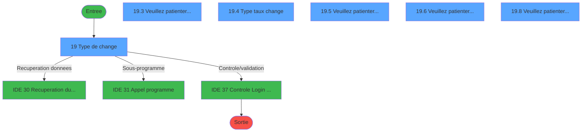
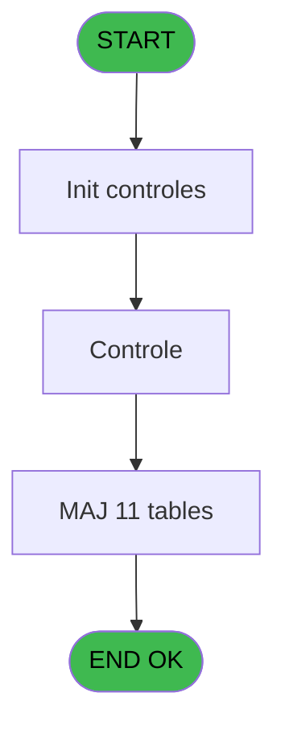
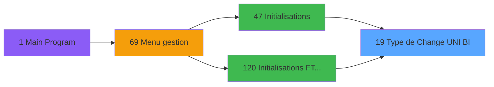
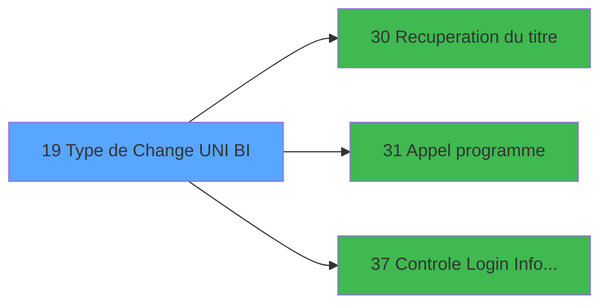

# GES IDE 19 - Type de Change (UNI / BI)

> **Analyse**: Phases 1-4 2026-02-03 11:30 -> 11:30 (14s) | Assemblage 11:30
> **Pipeline**: V7.2 Enrichi
> **Structure**: 4 onglets (Resume | Ecrans | Donnees | Connexions)

<!-- TAB:Resume -->

## 1. FICHE D'IDENTITE

| Attribut | Valeur |
|----------|--------|
| Projet | GES |
| IDE Position | 19 |
| Nom Programme | Type de Change (UNI / BI) |
| Fichier source | `Prg_19.xml` |
| Dossier IDE | Change |
| Taches | 31 (6 ecrans visibles) |
| Tables modifiees | 11 |
| Programmes appeles | 3 |

## 2. DESCRIPTION FONCTIONNELLE

**Type de Change (UNI / BI)** assure la gestion complete de ce processus, accessible depuis [Initialisations (IDE 47)](GES-IDE-47.md), [Initialisations (FTV 2.00) (IDE 120)](GES-IDE-120.md).

Le flux de traitement s'organise en **5 blocs fonctionnels** :

- **Traitement** (21 taches) : traitements metier divers
- **Creation** (7 taches) : insertion d'enregistrements en base (mouvements, prestations)
- **Transfert** (1 tache) : transferts de donnees entre modules ou deversements
- **Calcul** (1 tache) : calculs de montants, stocks ou compteurs
- **Validation** (1 tache) : controles et verifications de coherence

**Donnees modifiees** : 11 tables en ecriture (moyens_reglement_mor, devises_caisse___ddk, sorties_devises__sdk, lign_sortie_dev__ldk, moyen_paiement___mop, devises__________dev, unilateral_bilateral, type_taux_change, moyens_reglement_mor, moyen_paiement___mop, devises__________dev).

Detail : phases du traitement

#### Phase 1 : Traitement (21 taches)

- **19** - Type de change **[[ECRAN]](#ecran-t1)**
- **19.1** - Affectation Virtuelle
- **19.3** - Veuillez patienter... **[[ECRAN]](#ecran-t4)**
- **19.3.2** - (sans nom) **[[ECRAN]](#ecran-t6)**
- **19.3.3** - Suppr. Sortie devises
- **19.3.4** - Suppr. Sortie devises
- **19.4** - Type taux change **[[ECRAN]](#ecran-t9)**
- **19.5** - Veuillez patienter... **[[ECRAN]](#ecran-t10)**
- **19.5.1** - Fic 119 ---> Fic 68
- **19.5.1.2** - (sans nom)
- **19.5.2** - Fic 119 ---> Fic 68
- **19.5.3** - Fic 119 ---> Fic 68
- **19.6** - Veuillez patienter... **[[ECRAN]](#ecran-t19)**
- **19.6.1** - Fichier 117
- **19.6.2** - Fichier 117
- **19.6.3** - Fichier 117
- **19.6.4** - Fichier 117
- **19.8** - Veuillez patienter... **[[ECRAN]](#ecran-t25)**
- **19.8.1** - Fic 119 ---> Fic 68
- **19.8.2** - Fic 119 ---> Fic 68
- **19.8.3** - Fic 119 ---> Fic 68

Delegue a : [Recuperation du titre (IDE 30)](GES-IDE-30.md), [Appel programme (IDE 31)](GES-IDE-31.md)

#### Phase 2 : Calcul (1 tache)

- **19.2** - Lecture Date Comptable

#### Phase 3 : Validation (1 tache)

- **19.3.1** - Controle Stock Devises

Delegue a : [Controle Login Informaticien (IDE 37)](GES-IDE-37.md)

#### Phase 4 : Creation (7 taches)

- **19.5.1.1** - Creation 68
- **19.5.2.1** - Creation 68
- **19.5.3.1** - Creation 68
- **19.5.3.2** - Creation CASH dans 35
- **19.8.1.1** - Creation 68
- **19.8.2.1** - Creation 68
- **19.8.3.1** - Creation 68

#### Phase 5 : Transfert (1 tache)

- **19.7** - Maj Uni/Bilateral

#### Tables impactees

| Table | Operations | Role metier |
|-------|-----------|-------------|
| moyens_reglement_mor | **W** (5 usages) | Reglements / paiements |
| devises__________dev | **W** (4 usages) | Devises / taux de change |
| devises_caisse___ddk | R/**W** (2 usages) | Sessions de caisse |
| moyen_paiement___mop | R/**W** (2 usages) |  |
| devises__________dev | **W** (2 usages) | Devises / taux de change |
| moyens_reglement_mor | **W** (2 usages) | Reglements / paiements |
| moyen_paiement___mop | R/**W** (2 usages) |  |
| unilateral_bilateral | R/**W** (2 usages) |  |
| type_taux_change | R/**W** (2 usages) | Devises / taux de change |
| sorties_devises__sdk | **W** (1 usages) | Devises / taux de change |
| lign_sortie_dev__ldk | **W** (1 usages) |  |

## 3. BLOCS FONCTIONNELS

### 3.1 Traitement (21 taches)

Traitements internes.

---

#### 19 - Type de change [[ECRAN]](#ecran-t1)

**Role** : Tache d'orchestration : point d'entree du programme (21 sous-taches). Coordonne l'enchainement des traitements.
**Ecran** : 578 x 166 DLU (MDI) | [Voir mockup](#ecran-t1)

20 sous-taches directes

| Tache | Nom | Bloc |
|-------|-----|------|
| [19.1](#t2) | Affectation Virtuelle | Traitement |
| [19.3](#t4) | Veuillez patienter... **[[ECRAN]](#ecran-t4)** | Traitement |
| [19.3.2](#t6) | (sans nom) **[[ECRAN]](#ecran-t6)** | Traitement |
| [19.3.3](#t7) | Suppr. Sortie devises | Traitement |
| [19.3.4](#t8) | Suppr. Sortie devises | Traitement |
| [19.4](#t9) | Type taux change **[[ECRAN]](#ecran-t9)** | Traitement |
| [19.5](#t10) | Veuillez patienter... **[[ECRAN]](#ecran-t10)** | Traitement |
| [19.5.1](#t11) | Fic 119 ---> Fic 68 | Traitement |
| [19.5.1.2](#t13) | (sans nom) | Traitement |
| [19.5.2](#t14) | Fic 119 ---> Fic 68 | Traitement |
| [19.5.3](#t16) | Fic 119 ---> Fic 68 | Traitement |
| [19.6](#t19) | Veuillez patienter... **[[ECRAN]](#ecran-t19)** | Traitement |
| [19.6.1](#t20) | Fichier 117 | Traitement |
| [19.6.2](#t21) | Fichier 117 | Traitement |
| [19.6.3](#t22) | Fichier 117 | Traitement |
| [19.6.4](#t23) | Fichier 117 | Traitement |
| [19.8](#t25) | Veuillez patienter... **[[ECRAN]](#ecran-t25)** | Traitement |
| [19.8.1](#t26) | Fic 119 ---> Fic 68 | Traitement |
| [19.8.2](#t28) | Fic 119 ---> Fic 68 | Traitement |
| [19.8.3](#t30) | Fic 119 ---> Fic 68 | Traitement |

---

#### 19.1 - Affectation Virtuelle

**Role** : Traitement : Affectation Virtuelle.

---

#### 19.3 - Veuillez patienter... [[ECRAN]](#ecran-t4)

**Role** : Traitement : Veuillez patienter....
**Ecran** : 424 x 56 DLU (MDI) | [Voir mockup](#ecran-t4)

---

#### 19.3.2 - (sans nom) [[ECRAN]](#ecran-t6)

**Role** : Traitement interne.
**Ecran** : 533 x 71 DLU (MDI) | [Voir mockup](#ecran-t6)

---

#### 19.3.3 - Suppr. Sortie devises

**Role** : Traitement : Suppr. Sortie devises.

---

#### 19.3.4 - Suppr. Sortie devises

**Role** : Traitement : Suppr. Sortie devises.

---

#### 19.4 - Type taux change [[ECRAN]](#ecran-t9)

**Role** : Calcul : Type taux change.
**Ecran** : 501 x 145 DLU (MDI) | [Voir mockup](#ecran-t9)

---

#### 19.5 - Veuillez patienter... [[ECRAN]](#ecran-t10)

**Role** : Traitement : Veuillez patienter....
**Ecran** : 426 x 57 DLU (MDI) | [Voir mockup](#ecran-t10)

---

#### 19.5.1 - Fic 119 ---> Fic 68

**Role** : Traitement : Fic 119 ---> Fic 68.

---

#### 19.5.1.2 - (sans nom)

**Role** : Traitement interne.

---

#### 19.5.2 - Fic 119 ---> Fic 68

**Role** : Traitement : Fic 119 ---> Fic 68.

---

#### 19.5.3 - Fic 119 ---> Fic 68

**Role** : Traitement : Fic 119 ---> Fic 68.

---

#### 19.6 - Veuillez patienter... [[ECRAN]](#ecran-t19)

**Role** : Traitement : Veuillez patienter....
**Ecran** : 422 x 56 DLU (MDI) | [Voir mockup](#ecran-t19)

---

#### 19.6.1 - Fichier 117

**Role** : Traitement : Fichier 117.

---

#### 19.6.2 - Fichier 117

**Role** : Traitement : Fichier 117.

---

#### 19.6.3 - Fichier 117

**Role** : Traitement : Fichier 117.

---

#### 19.6.4 - Fichier 117

**Role** : Traitement : Fichier 117.

---

#### 19.8 - Veuillez patienter... [[ECRAN]](#ecran-t25)

**Role** : Traitement : Veuillez patienter....
**Ecran** : 424 x 56 DLU (MDI) | [Voir mockup](#ecran-t25)

---

#### 19.8.1 - Fic 119 ---> Fic 68

**Role** : Traitement : Fic 119 ---> Fic 68.

---

#### 19.8.2 - Fic 119 ---> Fic 68

**Role** : Traitement : Fic 119 ---> Fic 68.

---

#### 19.8.3 - Fic 119 ---> Fic 68

**Role** : Traitement : Fic 119 ---> Fic 68.

### 3.2 Calcul (1 tache)

Calculs metier : montants, stocks, compteurs.

---

#### 19.2 - Lecture Date Comptable

**Role** : Traitement : Lecture Date Comptable.
**Variables liees** : F (W0 Date comptable)

### 3.3 Validation (1 tache)

Controles de coherence : 1 tache verifie les donnees et conditions.

---

#### 19.3.1 - Controle Stock Devises

**Role** : Calcul : Controle Stock Devises.
**Variables liees** : G (W0 Controle)
**Delegue a** : [Controle Login Informaticien (IDE 37)](GES-IDE-37.md)

### 3.4 Creation (7 taches)

Insertion de nouveaux enregistrements en base.

---

#### 19.5.1.1 - Creation 68

**Role** : Creation d'enregistrement : Creation 68.

---

#### 19.5.2.1 - Creation 68

**Role** : Creation d'enregistrement : Creation 68.

---

#### 19.5.3.1 - Creation 68

**Role** : Creation d'enregistrement : Creation 68.

---

#### 19.5.3.2 - Creation CASH dans 35

**Role** : Creation d'enregistrement : Creation CASH dans 35.

---

#### 19.8.1.1 - Creation 68

**Role** : Creation d'enregistrement : Creation 68.

---

#### 19.8.2.1 - Creation 68

**Role** : Creation d'enregistrement : Creation 68.

---

#### 19.8.3.1 - Creation 68

**Role** : Creation d'enregistrement : Creation 68.

### 3.5 Transfert (1 tache)

Transfert de donnees entre modules.

---

#### 19.7 - Maj Uni/Bilateral

**Role** : Traitement : Maj Uni/Bilateral.
**Variables liees** : I (W0 Uni/Bilateral)

## 5. REGLES METIER

*(Aucune regle metier identifiee)*

## 6. CONTEXTE

- **Appele par**: [Initialisations (IDE 47)](GES-IDE-47.md), [Initialisations (FTV 2.00) (IDE 120)](GES-IDE-120.md)
- **Appelle**: 3 programmes | **Tables**: 13 (W:11 R:7 L:0) | **Taches**: 31 | **Expressions**: 17

<!-- TAB:Ecrans -->

## 8. ECRANS

### 8.1 Forms visibles (6 / 31)

| # | Position | Tache | Nom | Type | Largeur | Hauteur | Bloc |
|---|----------|-------|-----|------|---------|---------|------|
| 1 | 19 | 19 | Type de change | MDI | 578 | 166 | Traitement |
| 2 | 19.3 | 19.3 | Veuillez patienter... | MDI | 424 | 56 | Traitement |
| 3 | 19.4 | 19.4 | Type taux change | MDI | 501 | 145 | Traitement |
| 4 | 19.5 | 19.5 | Veuillez patienter... | MDI | 426 | 57 | Traitement |
| 5 | 19.6 | 19.6 | Veuillez patienter... | MDI | 422 | 56 | Traitement |
| 6 | 19.8 | 19.8 | Veuillez patienter... | MDI | 424 | 56 | Traitement |

### 8.2 Mockups Ecrans

---

#### 19 - Type de change
**Tache** : [19](#t1) | **Type** : MDI | **Dimensions** : 578 x 166 DLU
**Bloc** : Traitement | **Titre IDE** : Type de change

<!-- FORM-DATA:
{
    "width":  578,
    "vFactor":  8,
    "type":  "MDI",
    "hFactor":  8,
    "controls":  [
                     {
                         "x":  2,
                         "type":  "label",
                         "var":  "",
                         "y":  2,
                         "w":  565,
                         "fmt":  "",
                         "name":  "",
                         "h":  17,
                         "color":  "",
                         "text":  "",
                         "parent":  null
                     },
                     {
                         "x":  11,
                         "type":  "label",
                         "var":  "",
                         "y":  28,
                         "w":  554,
                         "fmt":  "",
                         "name":  "",
                         "h":  105,
                         "color":  "",
                         "text":  "",
                         "parent":  null
                     },
                     {
                         "x":  222,
                         "type":  "label",
                         "var":  "",
                         "y":  45,
                         "w":  292,
                         "fmt":  "",
                         "name":  "",
                         "h":  70,
                         "color":  "",
                         "text":  "",
                         "parent":  null
                     },
                     {
                         "x":  225,
                         "type":  "label",
                         "var":  "",
                         "y":  46,
                         "w":  287,
                         "fmt":  "",
                         "name":  "",
                         "h":  68,
                         "color":  "",
                         "text":  "",
                         "parent":  null
                     },
                     {
                         "x":  248,
                         "type":  "label",
                         "var":  "",
                         "y":  55,
                         "w":  247,
                         "fmt":  "",
                         "name":  "",
                         "h":  33,
                         "color":  "",
                         "text":  "",
                         "parent":  null
                     },
                     {
                         "x":  251,
                         "type":  "label",
                         "var":  "",
                         "y":  56,
                         "w":  37,
                         "fmt":  "",
                         "name":  "",
                         "h":  31,
                         "color":  "",
                         "text":  "",
                         "parent":  null
                     },
                     {
                         "x":  296,
                         "type":  "label",
                         "var":  "",
                         "y":  61,
                         "w":  190,
                         "fmt":  "",
                         "name":  "",
                         "h":  8,
                         "color":  "7",
                         "text":  "Change Unilateral",
                         "parent":  null
                     },
                     {
                         "x":  296,
                         "type":  "label",
                         "var":  "",
                         "y":  76,
                         "w":  190,
                         "fmt":  "",
                         "name":  "",
                         "h":  8,
                         "color":  "7",
                         "text":  "Change Bilateral",
                         "parent":  null
                     },
                     {
                         "x":  287,
                         "type":  "label",
                         "var":  "",
                         "y":  98,
                         "w":  120,
                         "fmt":  "",
                         "name":  "",
                         "h":  9,
                         "color":  "",
                         "text":  "Votre choix",
                         "parent":  null
                     },
                     {
                         "x":  2,
                         "type":  "label",
                         "var":  "",
                         "y":  140,
                         "w":  572,
                         "fmt":  "",
                         "name":  "",
                         "h":  23,
                         "color":  "",
                         "text":  "",
                         "parent":  null
                     },
                     {
                         "x":  421,
                         "type":  "edit",
                         "var":  "",
                         "y":  97,
                         "w":  26,
                         "fmt":  "UA",
                         "name":  "W0 Uni/Bilateral",
                         "h":  10,
                         "color":  "6",
                         "text":  "",
                         "parent":  null
                     },
                     {
                         "x":  10,
                         "type":  "edit",
                         "var":  "",
                         "y":  6,
                         "w":  267,
                         "fmt":  "20",
                         "name":  "",
                         "h":  8,
                         "color":  "",
                         "text":  "",
                         "parent":  1
                     },
                     {
                         "x":  315,
                         "type":  "edit",
                         "var":  "",
                         "y":  6,
                         "w":  245,
                         "fmt":  "WWW DD MMM YYYYT",
                         "name":  "",
                         "h":  8,
                         "color":  "",
                         "text":  "",
                         "parent":  1
                     },
                     {
                         "x":  34,
                         "type":  "image",
                         "var":  "",
                         "y":  42,
                         "w":  141,
                         "fmt":  "",
                         "name":  "",
                         "h":  62,
                         "color":  "",
                         "text":  "",
                         "parent":  4
                     },
                     {
                         "x":  255,
                         "type":  "button",
                         "var":  "",
                         "y":  59,
                         "w":  26,
                         "fmt":  "U",
                         "name":  "U",
                         "h":  9,
                         "color":  "",
                         "text":  "",
                         "parent":  null
                     },
                     {
                         "x":  255,
                         "type":  "button",
                         "var":  "",
                         "y":  75,
                         "w":  26,
                         "fmt":  "B",
                         "name":  "B",
                         "h":  9,
                         "color":  "",
                         "text":  "",
                         "parent":  null
                     },
                     {
                         "x":  8,
                         "type":  "button",
                         "var":  "",
                         "y":  143,
                         "w":  168,
                         "fmt":  "\u0026Quitter",
                         "name":  "",
                         "h":  18,
                         "color":  "",
                         "text":  "",
                         "parent":  null
                     }
                 ],
    "taskId":  "19",
    "height":  166
}
-->

<strong>Champs : 3 champs</strong>

| Pos (x,y) | Nom | Variable | Type |
|-----------|-----|----------|------|
| 421,97 | W0 Uni/Bilateral | - | edit |
| 10,6 | 20 | - | edit |
| 315,6 | WWW DD MMM YYYYT | - | edit |

<strong>Boutons : 3 boutons</strong>

| Bouton | Pos (x,y) | Action |
|--------|-----------|--------|
| U | 255,59 | Bouton fonctionnel |
| B | 255,75 | Bouton fonctionnel |
| Quitter | 8,143 | Quitte le programme |

---

#### 19.3 - Veuillez patienter...
**Tache** : [19.3](#t4) | **Type** : MDI | **Dimensions** : 424 x 56 DLU
**Bloc** : Traitement | **Titre IDE** : Veuillez patienter...

<!-- FORM-DATA:
{
    "width":  424,
    "vFactor":  8,
    "type":  "MDI",
    "hFactor":  8,
    "controls":  [
                     {
                         "x":  0,
                         "type":  "label",
                         "var":  "",
                         "y":  0,
                         "w":  423,
                         "fmt":  "",
                         "name":  "",
                         "h":  29,
                         "color":  "",
                         "text":  "",
                         "parent":  null
                     },
                     {
                         "x":  112,
                         "type":  "label",
                         "var":  "",
                         "y":  10,
                         "w":  229,
                         "fmt":  "",
                         "name":  "",
                         "h":  8,
                         "color":  "7",
                         "text":  "Traitement en cours ...",
                         "parent":  null
                     },
                     {
                         "x":  0,
                         "type":  "label",
                         "var":  "",
                         "y":  29,
                         "w":  423,
                         "fmt":  "",
                         "name":  "",
                         "h":  27,
                         "color":  "",
                         "text":  "",
                         "parent":  null
                     },
                     {
                         "x":  72,
                         "type":  "label",
                         "var":  "",
                         "y":  38,
                         "w":  280,
                         "fmt":  "",
                         "name":  "",
                         "h":  8,
                         "color":  "",
                         "text":  "Contrôle",
                         "parent":  null
                     },
                     {
                         "x":  4,
                         "type":  "image",
                         "var":  "",
                         "y":  2,
                         "w":  72,
                         "fmt":  "",
                         "name":  "",
                         "h":  25,
                         "color":  "",
                         "text":  "",
                         "parent":  null
                     }
                 ],
    "taskId":  "19.3",
    "height":  56
}
-->

---

#### 19.4 - Type taux change
**Tache** : [19.4](#t9) | **Type** : MDI | **Dimensions** : 501 x 145 DLU
**Bloc** : Traitement | **Titre IDE** : Type taux change

<!-- FORM-DATA:
{
    "width":  501,
    "vFactor":  8,
    "type":  "MDI",
    "hFactor":  8,
    "controls":  [
                     {
                         "x":  2,
                         "type":  "label",
                         "var":  "",
                         "y":  0,
                         "w":  492,
                         "fmt":  "",
                         "name":  "",
                         "h":  116,
                         "color":  "",
                         "text":  "",
                         "parent":  null
                     },
                     {
                         "x":  49,
                         "type":  "table",
                         "var":  "",
                         "name":  "",
                         "titleH":  12,
                         "color":  "110",
                         "w":  401,
                         "y":  6,
                         "fmt":  "",
                         "parent":  null,
                         "text":  "",
                         "rowH":  14,
                         "h":  99,
                         "cols":  [
                                      {
                                          "title":  "Type de taux",
                                          "layer":  1,
                                          "w":  254
                                      },
                                      {
                                          "title":  "Utilisable",
                                          "layer":  2,
                                          "w":  111
                                      }
                                  ],
                         "rows":  2
                     },
                     {
                         "x":  0,
                         "type":  "label",
                         "var":  "",
                         "y":  118,
                         "w":  494,
                         "fmt":  "",
                         "name":  "",
                         "h":  23,
                         "color":  "",
                         "text":  "",
                         "parent":  null
                     },
                     {
                         "x":  61,
                         "type":  "edit",
                         "var":  "",
                         "y":  24,
                         "w":  30,
                         "fmt":  "",
                         "name":  "",
                         "h":  8,
                         "color":  "110",
                         "text":  "",
                         "parent":  2
                     },
                     {
                         "x":  122,
                         "type":  "edit",
                         "var":  "",
                         "y":  24,
                         "w":  176,
                         "fmt":  "",
                         "name":  "",
                         "h":  8,
                         "color":  "110",
                         "text":  "",
                         "parent":  2
                     },
                     {
                         "x":  310,
                         "type":  "combobox",
                         "var":  "",
                         "y":  22,
                         "w":  99,
                         "fmt":  "",
                         "name":  "",
                         "h":  12,
                         "color":  "110",
                         "text":  "",
                         "parent":  2
                     },
                     {
                         "x":  5,
                         "type":  "button",
                         "var":  "",
                         "y":  121,
                         "w":  168,
                         "fmt":  "\u0026Quitter",
                         "name":  "",
                         "h":  18,
                         "color":  "",
                         "text":  "",
                         "parent":  null
                     }
                 ],
    "taskId":  "19.4",
    "height":  145
}
-->

<strong>Champs : 3 champs</strong>

| Pos (x,y) | Nom | Variable | Type |
|-----------|-----|----------|------|
| 61,24 | (sans nom) | - | edit |
| 122,24 | (sans nom) | - | edit |
| 310,22 | (sans nom) | - | combobox |

<strong>Boutons : 1 boutons</strong>

| Bouton | Pos (x,y) | Action |
|--------|-----------|--------|
| Quitter | 5,121 | Quitte le programme |

---

#### 19.5 - Veuillez patienter...
**Tache** : [19.5](#t10) | **Type** : MDI | **Dimensions** : 426 x 57 DLU
**Bloc** : Traitement | **Titre IDE** : Veuillez patienter...

<!-- FORM-DATA:
{
    "width":  426,
    "vFactor":  8,
    "type":  "MDI",
    "hFactor":  8,
    "controls":  [
                     {
                         "x":  0,
                         "type":  "label",
                         "var":  "",
                         "y":  0,
                         "w":  423,
                         "fmt":  "",
                         "name":  "",
                         "h":  29,
                         "color":  "",
                         "text":  "",
                         "parent":  null
                     },
                     {
                         "x":  120,
                         "type":  "label",
                         "var":  "",
                         "y":  10,
                         "w":  221,
                         "fmt":  "",
                         "name":  "",
                         "h":  8,
                         "color":  "7",
                         "text":  "Traitement en cours ...",
                         "parent":  null
                     },
                     {
                         "x":  0,
                         "type":  "label",
                         "var":  "",
                         "y":  29,
                         "w":  423,
                         "fmt":  "",
                         "name":  "",
                         "h":  27,
                         "color":  "",
                         "text":  "",
                         "parent":  null
                     },
                     {
                         "x":  72,
                         "type":  "label",
                         "var":  "",
                         "y":  38,
                         "w":  280,
                         "fmt":  "",
                         "name":  "",
                         "h":  8,
                         "color":  "",
                         "text":  "Passage de Uni à Bi",
                         "parent":  null
                     },
                     {
                         "x":  4,
                         "type":  "image",
                         "var":  "",
                         "y":  2,
                         "w":  72,
                         "fmt":  "",
                         "name":  "",
                         "h":  25,
                         "color":  "",
                         "text":  "",
                         "parent":  null
                     }
                 ],
    "taskId":  "19.5",
    "height":  57
}
-->

---

#### 19.6 - Veuillez patienter...
**Tache** : [19.6](#t19) | **Type** : MDI | **Dimensions** : 422 x 56 DLU
**Bloc** : Traitement | **Titre IDE** : Veuillez patienter...

<!-- FORM-DATA:
{
    "width":  422,
    "vFactor":  8,
    "type":  "MDI",
    "hFactor":  8,
    "controls":  [
                     {
                         "x":  0,
                         "type":  "label",
                         "var":  "",
                         "y":  0,
                         "w":  423,
                         "fmt":  "",
                         "name":  "",
                         "h":  29,
                         "color":  "",
                         "text":  "",
                         "parent":  null
                     },
                     {
                         "x":  117,
                         "type":  "label",
                         "var":  "",
                         "y":  10,
                         "w":  224,
                         "fmt":  "",
                         "name":  "",
                         "h":  8,
                         "color":  "7",
                         "text":  "Traitement en cours ...",
                         "parent":  null
                     },
                     {
                         "x":  0,
                         "type":  "label",
                         "var":  "",
                         "y":  29,
                         "w":  423,
                         "fmt":  "",
                         "name":  "",
                         "h":  27,
                         "color":  "",
                         "text":  "",
                         "parent":  null
                     },
                     {
                         "x":  72,
                         "type":  "label",
                         "var":  "",
                         "y":  38,
                         "w":  280,
                         "fmt":  "",
                         "name":  "",
                         "h":  8,
                         "color":  "",
                         "text":  "Maj des fichiers",
                         "parent":  null
                     },
                     {
                         "x":  4,
                         "type":  "image",
                         "var":  "",
                         "y":  2,
                         "w":  72,
                         "fmt":  "",
                         "name":  "",
                         "h":  25,
                         "color":  "",
                         "text":  "",
                         "parent":  null
                     }
                 ],
    "taskId":  "19.6",
    "height":  56
}
-->

---

#### 19.8 - Veuillez patienter...
**Tache** : [19.8](#t25) | **Type** : MDI | **Dimensions** : 424 x 56 DLU
**Bloc** : Traitement | **Titre IDE** : Veuillez patienter...

<!-- FORM-DATA:
{
    "width":  424,
    "vFactor":  8,
    "type":  "MDI",
    "hFactor":  8,
    "controls":  [
                     {
                         "x":  0,
                         "type":  "label",
                         "var":  "",
                         "y":  0,
                         "w":  423,
                         "fmt":  "",
                         "name":  "",
                         "h":  29,
                         "color":  "",
                         "text":  "",
                         "parent":  null
                     },
                     {
                         "x":  120,
                         "type":  "label",
                         "var":  "",
                         "y":  10,
                         "w":  221,
                         "fmt":  "",
                         "name":  "",
                         "h":  8,
                         "color":  "7",
                         "text":  "Traitement en cours ...",
                         "parent":  null
                     },
                     {
                         "x":  0,
                         "type":  "label",
                         "var":  "",
                         "y":  29,
                         "w":  423,
                         "fmt":  "",
                         "name":  "",
                         "h":  27,
                         "color":  "",
                         "text":  "",
                         "parent":  null
                     },
                     {
                         "x":  72,
                         "type":  "label",
                         "var":  "",
                         "y":  38,
                         "w":  280,
                         "fmt":  "",
                         "name":  "",
                         "h":  8,
                         "color":  "",
                         "text":  "Passage de Bi à Uni",
                         "parent":  null
                     },
                     {
                         "x":  4,
                         "type":  "image",
                         "var":  "",
                         "y":  2,
                         "w":  72,
                         "fmt":  "",
                         "name":  "",
                         "h":  25,
                         "color":  "",
                         "text":  "",
                         "parent":  null
                     }
                 ],
    "taskId":  "19.8",
    "height":  56
}
-->

## 9. NAVIGATION

### 9.1 Enchainement des ecrans

**Detail par enchainement :**

| Depuis | Action | Vers | Retour |
|--------|--------|------|--------|
| Type de change | Recuperation donnees | [Recuperation du titre (IDE 30)](GES-IDE-30.md) | Retour ecran |
| Type de change | Sous-programme | [Appel programme (IDE 31)](GES-IDE-31.md) | Retour ecran |
| Type de change | Controle/validation | [Controle Login Informaticien (IDE 37)](GES-IDE-37.md) | Retour ecran |

### 9.3 Structure hierarchique (31 taches)

| Position | Tache | Type | Dimensions | Bloc |
|----------|-------|------|------------|------|
| **19.1** | [**Type de change** (19)](#t1) [mockup](#ecran-t1) | MDI | 578x166 | Traitement |
| 19.1.1 | [Affectation Virtuelle (19.1)](#t2) | MDI | - | |
| 19.1.2 | [Veuillez patienter... (19.3)](#t4) [mockup](#ecran-t4) | MDI | 424x56 | |
| 19.1.3 | [(sans nom) (19.3.2)](#t6) [mockup](#ecran-t6) | MDI | 533x71 | |
| 19.1.4 | [Suppr. Sortie devises (19.3.3)](#t7) | MDI | - | |
| 19.1.5 | [Suppr. Sortie devises (19.3.4)](#t8) | MDI | - | |
| 19.1.6 | [Type taux change (19.4)](#t9) [mockup](#ecran-t9) | MDI | 501x145 | |
| 19.1.7 | [Veuillez patienter... (19.5)](#t10) [mockup](#ecran-t10) | MDI | 426x57 | |
| 19.1.8 | [Fic 119 ---> Fic 68 (19.5.1)](#t11) | MDI | - | |
| 19.1.9 | [(sans nom) (19.5.1.2)](#t13) | MDI | - | |
| 19.1.10 | [Fic 119 ---> Fic 68 (19.5.2)](#t14) | MDI | - | |
| 19.1.11 | [Fic 119 ---> Fic 68 (19.5.3)](#t16) | MDI | - | |
| 19.1.12 | [Veuillez patienter... (19.6)](#t19) [mockup](#ecran-t19) | MDI | 422x56 | |
| 19.1.13 | [Fichier 117 (19.6.1)](#t20) | MDI | - | |
| 19.1.14 | [Fichier 117 (19.6.2)](#t21) | MDI | - | |
| 19.1.15 | [Fichier 117 (19.6.3)](#t22) | MDI | - | |
| 19.1.16 | [Fichier 117 (19.6.4)](#t23) | MDI | - | |
| 19.1.17 | [Veuillez patienter... (19.8)](#t25) [mockup](#ecran-t25) | MDI | 424x56 | |
| 19.1.18 | [Fic 119 ---> Fic 68 (19.8.1)](#t26) | MDI | - | |
| 19.1.19 | [Fic 119 ---> Fic 68 (19.8.2)](#t28) | MDI | - | |
| 19.1.20 | [Fic 119 ---> Fic 68 (19.8.3)](#t30) | MDI | - | |
| **19.2** | [**Lecture Date Comptable** (19.2)](#t3) | MDI | - | Calcul |
| **19.3** | [**Controle Stock Devises** (19.3.1)](#t5) | MDI | - | Validation |
| **19.4** | [**Creation 68** (19.5.1.1)](#t12) | MDI | - | Creation |
| 19.4.1 | [Creation 68 (19.5.2.1)](#t15) | MDI | - | |
| 19.4.2 | [Creation 68 (19.5.3.1)](#t17) | MDI | - | |
| 19.4.3 | [Creation CASH dans 35 (19.5.3.2)](#t18) | MDI | - | |
| 19.4.4 | [Creation 68 (19.8.1.1)](#t27) | MDI | - | |
| 19.4.5 | [Creation 68 (19.8.2.1)](#t29) | MDI | - | |
| 19.4.6 | [Creation 68 (19.8.3.1)](#t31) | MDI | - | |
| **19.5** | [**Maj Uni/Bilateral** (19.7)](#t24) | MDI | - | Transfert |

### 9.4 Algorigramme

> **Legende**: Vert = START/END OK | Rouge = END KO | Bleu = Decisions
> *Algorigramme auto-genere. Utiliser `/algorigramme` pour une synthese metier detaillee.*

<!-- TAB:Donnees -->

## 10. TABLES

### Tables utilisees (13)

| ID | Nom | Description | Type | R | W | L | Usages |
|----|-----|-------------|------|---|---|---|--------|
| 50 | moyens_reglement_mor | Reglements / paiements | DB |   | **W** |   | 2 |
| 57 | devises_caisse___ddk | Sessions de caisse | DB | R | **W** |   | 2 |
| 58 | sorties_devises__sdk | Devises / taux de change | DB |   | **W** |   | 1 |
| 59 | lign_sortie_dev__ldk |  | DB |   | **W** |   | 1 |
| 70 | date_comptable___dat |  | DB | R |   |   | 1 |
| 89 | moyen_paiement___mop |  | DB | R | **W** |   | 2 |
| 90 | devises__________dev | Devises / taux de change | DB |   | **W** |   | 2 |
| 122 | unilateral_bilateral |  | DB | R | **W** |   | 2 |
| 124 | type_taux_change | Devises / taux de change | DB | R | **W** |   | 2 |
| 139 | moyens_reglement_mor | Reglements / paiements | DB |   | **W** |   | 5 |
| 140 | moyen_paiement___mop |  | DB | R | **W** |   | 2 |
| 141 | devises__________dev | Devises / taux de change | DB |   | **W** |   | 4 |
| 147 | change_vente_____chg | Donnees de ventes | DB | R |   |   | 1 |

### Colonnes par table (3 / 13 tables avec colonnes identifiees)

Table 50 - moyens_reglement_mor (**W**) - 2 usages

*Table utilisee uniquement en Link ou aucune colonne Real identifiee dans le DataView.*

Table 57 - devises_caisse___ddk (R/**W**) - 2 usages

*Table utilisee uniquement en Link ou aucune colonne Real identifiee dans le DataView.*

Table 58 - sorties_devises__sdk (**W**) - 1 usages

*Table utilisee uniquement en Link ou aucune colonne Real identifiee dans le DataView.*

Table 59 - lign_sortie_dev__ldk (**W**) - 1 usages

*Table utilisee uniquement en Link ou aucune colonne Real identifiee dans le DataView.*

Table 70 - date_comptable___dat (R) - 1 usages

| Lettre | Variable | Acces | Type |
|--------|----------|-------|------|
| F | W0 Date comptable | R | Date |

Table 89 - moyen_paiement___mop (R/**W**) - 2 usages

*Table utilisee uniquement en Link ou aucune colonne Real identifiee dans le DataView.*

Table 90 - devises__________dev (**W**) - 2 usages

*Table utilisee uniquement en Link ou aucune colonne Real identifiee dans le DataView.*

Table 122 - unilateral_bilateral (R/**W**) - 2 usages

| Lettre | Variable | Acces | Type |
|--------|----------|-------|------|
| I | W0 Uni/Bilateral | W | Alpha |

Table 124 - type_taux_change (R/**W**) - 2 usages

*Table utilisee uniquement en Link ou aucune colonne Real identifiee dans le DataView.*

Table 139 - moyens_reglement_mor (**W**) - 5 usages

*Table utilisee uniquement en Link ou aucune colonne Real identifiee dans le DataView.*

Table 140 - moyen_paiement___mop (R/**W**) - 2 usages

*Table utilisee uniquement en Link ou aucune colonne Real identifiee dans le DataView.*

Table 141 - devises__________dev (**W**) - 4 usages

*Table utilisee uniquement en Link ou aucune colonne Real identifiee dans le DataView.*

Table 147 - change_vente_____chg (R) - 1 usages

| Lettre | Variable | Acces | Type |
|--------|----------|-------|------|
| A | W1 ret lien 125 | R | Numeric |
| B | W1 Controle Devise | R | Alpha |
| C | W1 fin Tache | R | Alpha |

## 11. VARIABLES

### 11.1 Parametres entrants (2)

Variables recues du programme appelant ([Initialisations (IDE 47)](GES-IDE-47.md)).

| Lettre | Nom | Type | Usage dans |
|--------|-----|------|-----------|
| A | P0 Societe | Alpha | - |
| B | P0 Devise Locale | Alpha | - |

### 11.2 Variables de session (1)

Variables persistantes pendant toute la session.

| Lettre | Nom | Type | Usage dans |
|--------|-----|------|-----------|
| C | v. titre ecran | Alpha | 1x session |

### 11.3 Variables de travail (7)

Variables internes au programme.

| Lettre | Nom | Type | Usage dans |
|--------|-----|------|-----------|
| D | W0 fin tache | Alpha | 1x calcul interne |
| E | W0 Acces | Alpha | 1x calcul interne |
| F | W0 Date comptable | Date | - |
| G | W0 Controle | Alpha | [19.3.1](#t5) |
| H | W0 Old Valeur | Alpha | 3x calcul interne |
| I | W0 Uni/Bilateral | Alpha | [19.7](#t24) |
| J | W0 accesLoginInformaticien | Logical | - |

## 12. EXPRESSIONS

**17 / 17 expressions decodees (100%)**

### 12.1 Repartition par type

| Type | Expressions | Regles |
|------|-------------|--------|
| CONSTANTE | 3 | 0 |
| DATE | 1 | 0 |
| OTHER | 3 | 0 |
| REFERENCE_VG | 1 | 0 |
| CONDITION | 7 | 0 |
| NEGATION | 1 | 0 |
| STRING | 1 | 0 |

### 12.2 Expressions cles par type

#### CONSTANTE (3 expressions)

| Type | IDE | Expression | Regle |
|------|-----|------------|-------|
| CONSTANTE | 8 | `'F'` | - |
| CONSTANTE | 7 | `'U'` | - |
| CONSTANTE | 6 | `61` | - |

#### DATE (1 expressions)

| Type | IDE | Expression | Regle |
|------|-----|------------|-------|
| DATE | 4 | `Date ()` | - |

#### OTHER (3 expressions)

| Type | IDE | Expression | Regle |
|------|-----|------------|-------|
| OTHER | 15 | `W0 Uni/Bilateral [I]` | - |
| OTHER | 2 | `SetCrsr (1)` | - |
| OTHER | 1 | `SetCrsr (2)` | - |

#### REFERENCE_VG (1 expressions)

| Type | IDE | Expression | Regle |
|------|-----|------------|-------|
| REFERENCE_VG | 3 | `VG2` | - |

#### CONDITION (7 expressions)

| Type | IDE | Expression | Regle |
|------|-----|------------|-------|
| CONDITION | 13 | `W0 Uni/Bilateral [I]='B'` | - |
| CONDITION | 14 | `W0 Uni/Bilateral [I]='U'` | - |
| CONDITION | 16 | `W0 fin tache [D]='F'` | - |
| CONDITION | 12 | `W0 Old Valeur [H]<>W0 Uni/Bilateral [I]` | - |
| CONDITION | 9 | `W0 Uni/Bilateral [I]<>'U' AND W0 Uni/Bilateral [I]<>'B'` | - |
| ... | | *+2 autres* | |

#### NEGATION (1 expressions)

| Type | IDE | Expression | Regle |
|------|-----|------------|-------|
| NEGATION | 17 | `NOT (W0 accesLoginInformati... [J])` | - |

#### STRING (1 expressions)

| Type | IDE | Expression | Regle |
|------|-----|------------|-------|
| STRING | 5 | `Trim (v. titre ecran [C])` | - |

<!-- TAB:Connexions -->

## 13. GRAPHE D'APPELS

### 13.1 Chaine depuis Main (Callers)

Main -> ... -> [Initialisations (IDE 47)](GES-IDE-47.md) -> **Type de Change (UNI / BI) (IDE 19)**

Main -> ... -> [Initialisations (FTV 2.00) (IDE 120)](GES-IDE-120.md) -> **Type de Change (UNI / BI) (IDE 19)**

### 13.2 Callers

| IDE | Nom Programme | Nb Appels |
|-----|---------------|-----------|
| [47](GES-IDE-47.md) | Initialisations | 1 |
| [120](GES-IDE-120.md) | Initialisations (FTV 2.00) | 1 |

### 13.3 Callees (programmes appeles)

### 13.4 Detail Callees avec contexte

| IDE | Nom Programme | Appels | Contexte |
|-----|---------------|--------|----------|
| [30](GES-IDE-30.md) | Recuperation du titre | 1 | Recuperation donnees |
| [31](GES-IDE-31.md) | Appel programme | 1 | Sous-programme |
| [37](GES-IDE-37.md) | Controle Login Informaticien | 1 | Controle/validation |

## 14. RECOMMANDATIONS MIGRATION

### 14.1 Profil du programme

| Metrique | Valeur | Impact migration |
|----------|--------|-----------------|
| Lignes de logique | 366 | Taille moyenne |
| Expressions | 17 | Peu de logique |
| Tables WRITE | 11 | Fort impact donnees |
| Sous-programmes | 3 | Peu de dependances |
| Ecrans visibles | 6 | Interface complexe multi-ecrans |
| Code desactive | 0% (0 / 366) | Code sain |
| Regles metier | 0 | Pas de regle identifiee |

### 14.2 Plan de migration par bloc

#### Traitement (21 taches: 7 ecrans, 14 traitements)

- **Strategie** : Orchestrateur avec 7 ecrans (Razor/React) et 14 traitements backend (services).
- Les ecrans deviennent des composants UI, les traitements invisibles deviennent des services injectables.
- 3 sous-programme(s) a migrer ou a reutiliser depuis les services existants.
- Decomposer les taches en services unitaires testables.

#### Calcul (1 tache: 0 ecran, 1 traitement)

- **Strategie** : Services de calcul purs (Domain Services).
- Migrer la logique de calcul (stock, compteurs, montants)

#### Validation (1 tache: 0 ecran, 1 traitement)

- **Strategie** : FluentValidation avec validators specifiques.
- Chaque tache de validation -> un validator injectable

#### Creation (7 taches: 0 ecran, 7 traitements)

- **Strategie** : Repository pattern avec Entity Framework Core.
- Insertion via `IRepository<T>.CreateAsync()`

#### Transfert (1 tache: 0 ecran, 1 traitement)

- **Strategie** : Service `ITransfertService` avec logique de deversement.

### 14.3 Dependances critiques

| Dependance | Type | Appels | Impact |
|------------|------|--------|--------|
| moyens_reglement_mor | Table WRITE (Database) | 2x | Schema + repository |
| devises_caisse___ddk | Table WRITE (Database) | 1x | Schema + repository |
| sorties_devises__sdk | Table WRITE (Database) | 1x | Schema + repository |
| lign_sortie_dev__ldk | Table WRITE (Database) | 1x | Schema + repository |
| moyen_paiement___mop | Table WRITE (Database) | 1x | Schema + repository |
| devises__________dev | Table WRITE (Database) | 2x | Schema + repository |
| unilateral_bilateral | Table WRITE (Database) | 1x | Schema + repository |
| type_taux_change | Table WRITE (Database) | 1x | Schema + repository |
| moyens_reglement_mor | Table WRITE (Database) | 5x | Schema + repository |
| moyen_paiement___mop | Table WRITE (Database) | 1x | Schema + repository |
| devises__________dev | Table WRITE (Database) | 4x | Schema + repository |
| [Controle Login Informaticien (IDE 37)](GES-IDE-37.md) | Sous-programme | 1x | Normale - Controle/validation |
| [Appel programme (IDE 31)](GES-IDE-31.md) | Sous-programme | 1x | Normale - Sous-programme |
| [Recuperation du titre (IDE 30)](GES-IDE-30.md) | Sous-programme | 1x | Normale - Recuperation donnees |

---
*Spec DETAILED generee par Pipeline V7.2 - 2026-02-03 11:30*
