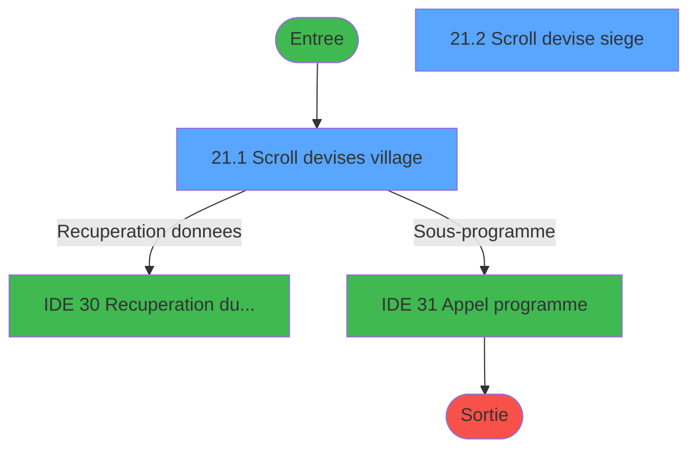
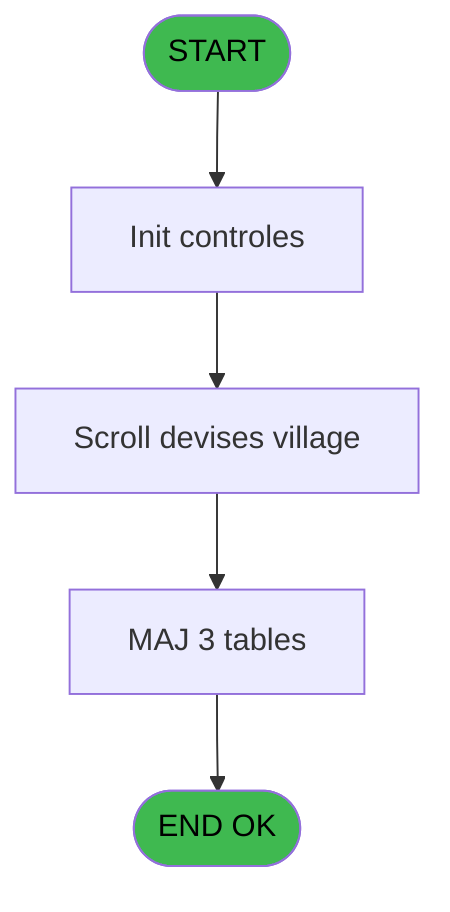
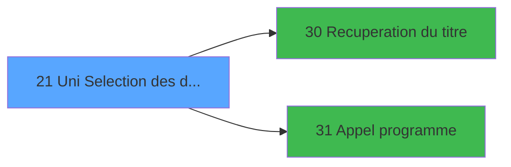

# GES IDE 21 - Uni Selection des devises

> **Analyse**: Phases 1-4 2026-02-03 11:30 -> 11:30 (14s) | Assemblage 11:30
> **Pipeline**: V7.2 Enrichi
> **Structure**: 4 onglets (Resume | Ecrans | Donnees | Connexions)

<!-- TAB:Resume -->

## 1. FICHE D'IDENTITE

| Attribut | Valeur |
|----------|--------|
| Projet | GES |
| IDE Position | 21 |
| Nom Programme | Uni Selection des devises |
| Fichier source | `Prg_21.xml` |
| Dossier IDE | Devises |
| Taches | 9 (2 ecrans visibles) |
| Tables modifiees | 3 |
| Programmes appeles | 2 |

## 2. DESCRIPTION FONCTIONNELLE

**Uni Selection des devises** assure la gestion complete de ce processus, accessible depuis [Menu Uni Devises (IDE 23)](GES-IDE-23.md).

Le flux de traitement s'organise en **2 blocs fonctionnels** :

- **Traitement** (7 taches) : traitements metier divers
- **Creation** (2 taches) : insertion d'enregistrements en base (mouvements, prestations)

**Donnees modifiees** : 3 tables en ecriture (moyens_reglement_mor, tables___________tab, devises__________dev).

Detail : phases du traitement

#### Phase 1 : Traitement (7 taches)

- **21** - AC  Table devise village **[[ECRAN]](#ecran-t1)**
- **21.1** - Scroll devises village **[[ECRAN]](#ecran-t2)**
- **21.1.1** - Neutralisation MOR's
- **21.1.2** - Neutralisation MOR's
- **21.2** - Scroll devise siege **[[ECRAN]](#ecran-t5)**
- **21.4** - Effacement numeros BDEV
- **21.5** - (sans nom)

Delegue a : [Recuperation du titre (IDE 30)](GES-IDE-30.md), [Appel programme (IDE 31)](GES-IDE-31.md)

#### Phase 2 : Creation (2 taches)

- **21.3** - Creation devises
- **21.5.1** - Creation MOR

#### Tables impactees

| Table | Operations | Role metier |
|-------|-----------|-------------|
| devises__________dev | R/**W**/L (4 usages) | Devises / taux de change |
| moyens_reglement_mor | **W** (3 usages) | Reglements / paiements |
| tables___________tab | R/**W** (3 usages) |  |

## 3. BLOCS FONCTIONNELS

### 3.1 Traitement (7 taches)

Traitements internes.

---

#### 21 - AC  Table devise village [[ECRAN]](#ecran-t1)

**Role** : Tache d'orchestration : point d'entree du programme (7 sous-taches). Coordonne l'enchainement des traitements.
**Ecran** : 885 x 222 DLU (MDI) | [Voir mockup](#ecran-t1)

6 sous-taches directes

| Tache | Nom | Bloc |
|-------|-----|------|
| [21.1](#t2) | Scroll devises village **[[ECRAN]](#ecran-t2)** | Traitement |
| [21.1.1](#t3) | Neutralisation MOR's | Traitement |
| [21.1.2](#t4) | Neutralisation MOR's | Traitement |
| [21.2](#t5) | Scroll devise siege **[[ECRAN]](#ecran-t5)** | Traitement |
| [21.4](#t7) | Effacement numeros BDEV | Traitement |
| [21.5](#t8) | (sans nom) | Traitement |

**Variables liees** : E (W0 cherche-n° devise), B (> devise locale)
**Delegue a** : [Recuperation du titre (IDE 30)](GES-IDE-30.md), [Appel programme (IDE 31)](GES-IDE-31.md)

---

#### 21.1 - Scroll devises village [[ECRAN]](#ecran-t2)

**Role** : Traitement : Scroll devises village.
**Ecran** : 963 x 260 DLU (MDI) | [Voir mockup](#ecran-t2)
**Variables liees** : F (W0 fin-scroll-BDEV)
**Delegue a** : [Recuperation du titre (IDE 30)](GES-IDE-30.md), [Appel programme (IDE 31)](GES-IDE-31.md)

---

#### 21.1.1 - Neutralisation MOR's

**Role** : Traitement : Neutralisation MOR's.
**Delegue a** : [Recuperation du titre (IDE 30)](GES-IDE-30.md), [Appel programme (IDE 31)](GES-IDE-31.md)

---

#### 21.1.2 - Neutralisation MOR's

**Role** : Traitement : Neutralisation MOR's.
**Delegue a** : [Recuperation du titre (IDE 30)](GES-IDE-30.md), [Appel programme (IDE 31)](GES-IDE-31.md)

---

#### 21.2 - Scroll devise siege [[ECRAN]](#ecran-t5)

**Role** : Traitement : Scroll devise siege.
**Ecran** : 385 x 124 DLU (MDI) | [Voir mockup](#ecran-t5)
**Variables liees** : E (W0 cherche-n° devise), F (W0 fin-scroll-BDEV), B (> devise locale)
**Delegue a** : [Recuperation du titre (IDE 30)](GES-IDE-30.md), [Appel programme (IDE 31)](GES-IDE-31.md)

---

#### 21.4 - Effacement numeros BDEV

**Role** : Traitement : Effacement numeros BDEV.
**Variables liees** : F (W0 fin-scroll-BDEV)
**Delegue a** : [Recuperation du titre (IDE 30)](GES-IDE-30.md), [Appel programme (IDE 31)](GES-IDE-31.md)

---

#### 21.5 - (sans nom)

**Role** : Traitement interne.
**Delegue a** : [Recuperation du titre (IDE 30)](GES-IDE-30.md), [Appel programme (IDE 31)](GES-IDE-31.md)

### 3.2 Creation (2 taches)

Insertion de nouveaux enregistrements en base.

---

#### 21.3 - Creation devises

**Role** : Creation d'enregistrement : Creation devises.

---

#### 21.5.1 - Creation MOR

**Role** : Creation d'enregistrement : Creation MOR.

## 5. REGLES METIER

*(Aucune regle metier identifiee)*

## 6. CONTEXTE

- **Appele par**: [Menu Uni Devises (IDE 23)](GES-IDE-23.md)
- **Appelle**: 2 programmes | **Tables**: 4 (W:3 R:2 L:2) | **Taches**: 9 | **Expressions**: 8

<!-- TAB:Ecrans -->

## 8. ECRANS

### 8.1 Forms visibles (2 / 9)

| # | Position | Tache | Nom | Type | Largeur | Hauteur | Bloc |
|---|----------|-------|-----|------|---------|---------|------|
| 1 | 21.1 | 21.1 | Scroll devises village | MDI | 963 | 260 | Traitement |
| 2 | 21.2 | 21.2 | Scroll devise siege | MDI | 385 | 124 | Traitement |

### 8.2 Mockups Ecrans

---

#### 21.1 - Scroll devises village
**Tache** : [21.1](#t2) | **Type** : MDI | **Dimensions** : 963 x 260 DLU
**Bloc** : Traitement | **Titre IDE** : Scroll devises village

<!-- FORM-DATA:
{
    "width":  963,
    "vFactor":  8,
    "type":  "MDI",
    "hFactor":  8,
    "controls":  [
                     {
                         "x":  0,
                         "type":  "label",
                         "var":  "",
                         "y":  1,
                         "w":  963,
                         "fmt":  "",
                         "name":  "",
                         "h":  19,
                         "color":  "",
                         "text":  "",
                         "parent":  null
                     },
                     {
                         "x":  14,
                         "type":  "label",
                         "var":  "",
                         "y":  22,
                         "w":  469,
                         "fmt":  "",
                         "name":  "",
                         "h":  115,
                         "color":  "195",
                         "text":  "Devises acceptées",
                         "parent":  null
                     },
                     {
                         "x":  22,
                         "type":  "table",
                         "var":  "",
                         "name":  "",
                         "titleH":  12,
                         "color":  "110",
                         "w":  456,
                         "y":  33,
                         "fmt":  "",
                         "parent":  null,
                         "text":  "",
                         "rowH":  12,
                         "h":  102,
                         "cols":  [
                                      {
                                          "title":  "Numéro",
                                          "layer":  1,
                                          "w":  89
                                      },
                                      {
                                          "title":  "Devise",
                                          "layer":  2,
                                          "w":  82
                                      },
                                      {
                                          "title":  "Libellé",
                                          "layer":  3,
                                          "w":  251
                                      }
                                  ],
                         "rows":  3
                     },
                     {
                         "x":  248,
                         "type":  "label",
                         "var":  "",
                         "y":  158,
                         "w":  541,
                         "fmt":  "",
                         "name":  "",
                         "h":  71,
                         "color":  "",
                         "text":  "",
                         "parent":  null
                     },
                     {
                         "x":  490,
                         "type":  "label",
                         "var":  "",
                         "y":  162,
                         "w":  290,
                         "fmt":  "",
                         "name":  "",
                         "h":  64,
                         "color":  "",
                         "text":  "",
                         "parent":  null
                     },
                     {
                         "x":  493,
                         "type":  "label",
                         "var":  "",
                         "y":  163,
                         "w":  284,
                         "fmt":  "",
                         "name":  "",
                         "h":  62,
                         "color":  "",
                         "text":  "",
                         "parent":  null
                     },
                     {
                         "x":  534,
                         "type":  "label",
                         "var":  "",
                         "y":  168,
                         "w":  207,
                         "fmt":  "",
                         "name":  "",
                         "h":  37,
                         "color":  "",
                         "text":  "",
                         "parent":  null
                     },
                     {
                         "x":  536,
                         "type":  "label",
                         "var":  "",
                         "y":  169,
                         "w":  42,
                         "fmt":  "",
                         "name":  "",
                         "h":  35,
                         "color":  "",
                         "text":  "",
                         "parent":  null
                     },
                     {
                         "x":  583,
                         "type":  "label",
                         "var":  "",
                         "y":  174,
                         "w":  146,
                         "fmt":  "",
                         "name":  "",
                         "h":  9,
                         "color":  "7",
                         "text":  "Création",
                         "parent":  null
                     },
                     {
                         "x":  583,
                         "type":  "label",
                         "var":  "",
                         "y":  188,
                         "w":  146,
                         "fmt":  "",
                         "name":  "",
                         "h":  9,
                         "color":  "7",
                         "text":  "Désactivation",
                         "parent":  null
                     },
                     {
                         "x":  555,
                         "type":  "label",
                         "var":  "",
                         "y":  209,
                         "w":  120,
                         "fmt":  "",
                         "name":  "",
                         "h":  9,
                         "color":  "",
                         "text":  "Votre choix",
                         "parent":  null
                     },
                     {
                         "x":  0,
                         "type":  "label",
                         "var":  "",
                         "y":  235,
                         "w":  960,
                         "fmt":  "",
                         "name":  "",
                         "h":  24,
                         "color":  "",
                         "text":  "",
                         "parent":  null
                     },
                     {
                         "x":  56,
                         "type":  "edit",
                         "var":  "",
                         "y":  48,
                         "w":  30,
                         "fmt":  "##",
                         "name":  "",
                         "h":  8,
                         "color":  "110",
                         "text":  "",
                         "parent":  5
                     },
                     {
                         "x":  126,
                         "type":  "edit",
                         "var":  "",
                         "y":  48,
                         "w":  42,
                         "fmt":  "",
                         "name":  "",
                         "h":  8,
                         "color":  "110",
                         "text":  "",
                         "parent":  5
                     },
                     {
                         "x":  208,
                         "type":  "edit",
                         "var":  "",
                         "y":  48,
                         "w":  232,
                         "fmt":  "",
                         "name":  "",
                         "h":  8,
                         "color":  "110",
                         "text":  "",
                         "parent":  5
                     },
                     {
                         "x":  683,
                         "type":  "edit",
                         "var":  "",
                         "y":  208,
                         "w":  26,
                         "fmt":  "",
                         "name":  "W1 action",
                         "h":  10,
                         "color":  "6",
                         "text":  "",
                         "parent":  null
                     },
                     {
                         "x":  650,
                         "type":  "edit",
                         "var":  "",
                         "y":  6,
                         "w":  302,
                         "fmt":  "WWW DD MMM YYYYT",
                         "name":  "",
                         "h":  8,
                         "color":  "",
                         "text":  "",
                         "parent":  null
                     },
                     {
                         "x":  6,
                         "type":  "edit",
                         "var":  "",
                         "y":  7,
                         "w":  384,
                         "fmt":  "20",
                         "name":  "",
                         "h":  8,
                         "color":  "",
                         "text":  "",
                         "parent":  1
                     },
                     {
                         "x":  282,
                         "type":  "image",
                         "var":  "",
                         "y":  173,
                         "w":  163,
                         "fmt":  "",
                         "name":  "",
                         "h":  46,
                         "color":  "",
                         "text":  "",
                         "parent":  null
                     },
                     {
                         "x":  540,
                         "type":  "button",
                         "var":  "",
                         "y":  174,
                         "w":  27,
                         "fmt":  "C",
                         "name":  "C",
                         "h":  9,
                         "color":  "",
                         "text":  "",
                         "parent":  null
                     },
                     {
                         "x":  542,
                         "type":  "button",
                         "var":  "",
                         "y":  188,
                         "w":  27,
                         "fmt":  "D",
                         "name":  "D",
                         "h":  9,
                         "color":  "",
                         "text":  "",
                         "parent":  null
                     },
                     {
                         "x":  8,
                         "type":  "button",
                         "var":  "",
                         "y":  238,
                         "w":  154,
                         "fmt":  "\u0026Quitter",
                         "name":  "",
                         "h":  18,
                         "color":  "",
                         "text":  "",
                         "parent":  26
                     }
                 ],
    "taskId":  "21.1",
    "height":  260
}
-->

<strong>Champs : 6 champs</strong>

| Pos (x,y) | Nom | Variable | Type |
|-----------|-----|----------|------|
| 56,48 | ## | - | edit |
| 126,48 | (sans nom) | - | edit |
| 208,48 | (sans nom) | - | edit |
| 683,208 | W1 action | - | edit |
| 650,6 | WWW DD MMM YYYYT | - | edit |
| 6,7 | 20 | - | edit |

<strong>Boutons : 3 boutons</strong>

| Bouton | Pos (x,y) | Action |
|--------|-----------|--------|
| C | 540,174 | Bouton fonctionnel |
| D | 542,188 | Bouton fonctionnel |
| Quitter | 8,238 | Quitte le programme |

---

#### 21.2 - Scroll devise siege
**Tache** : [21.2](#t5) | **Type** : MDI | **Dimensions** : 385 x 124 DLU
**Bloc** : Traitement | **Titre IDE** : Scroll devise siege

<!-- FORM-DATA:
{
    "width":  385,
    "vFactor":  8,
    "type":  "MDI",
    "hFactor":  8,
    "controls":  [
                     {
                         "x":  7,
                         "type":  "label",
                         "var":  "",
                         "y":  1,
                         "w":  370,
                         "fmt":  "",
                         "name":  "",
                         "h":  123,
                         "color":  "195",
                         "text":  "Devises",
                         "parent":  null
                     },
                     {
                         "x":  18,
                         "type":  "table",
                         "var":  "",
                         "name":  "",
                         "titleH":  12,
                         "color":  "110",
                         "w":  349,
                         "y":  14,
                         "fmt":  "",
                         "parent":  null,
                         "text":  "",
                         "rowH":  12,
                         "h":  88,
                         "cols":  [
                                      {
                                          "title":  "Code",
                                          "layer":  1,
                                          "w":  66
                                      },
                                      {
                                          "title":  "TAB Code",
                                          "layer":  2,
                                          "w":  93
                                      },
                                      {
                                          "title":  "Libellé",
                                          "layer":  3,
                                          "w":  153
                                      }
                                  ],
                         "rows":  3
                     },
                     {
                         "x":  30,
                         "type":  "edit",
                         "var":  "",
                         "y":  29,
                         "w":  42,
                         "fmt":  "###Z",
                         "name":  "TAB code numeric6",
                         "h":  8,
                         "color":  "110",
                         "text":  "",
                         "parent":  2
                     },
                     {
                         "x":  123,
                         "type":  "edit",
                         "var":  "",
                         "y":  29,
                         "w":  42,
                         "fmt":  "3",
                         "name":  "",
                         "h":  8,
                         "color":  "110",
                         "text":  "",
                         "parent":  2
                     },
                     {
                         "x":  182,
                         "type":  "edit",
                         "var":  "",
                         "y":  29,
                         "w":  142,
                         "fmt":  "12",
                         "name":  "",
                         "h":  8,
                         "color":  "110",
                         "text":  "",
                         "parent":  2
                     },
                     {
                         "x":  18,
                         "type":  "button",
                         "var":  "",
                         "y":  107,
                         "w":  55,
                         "fmt":  "\u003c\u003c\u003c",
                         "name":  "",
                         "h":  14,
                         "color":  "",
                         "text":  "",
                         "parent":  null
                     }
                 ],
    "taskId":  "21.2",
    "height":  124
}
-->

<strong>Champs : 3 champs</strong>

| Pos (x,y) | Nom | Variable | Type |
|-----------|-----|----------|------|
| 30,29 | TAB code numeric6 | - | edit |
| 123,29 | 3 | - | edit |
| 182,29 | 12 | - | edit |

<strong>Boutons : 1 boutons</strong>

| Bouton | Pos (x,y) | Action |
|--------|-----------|--------|
| <<< | 18,107 | Bouton fonctionnel |

## 9. NAVIGATION

### 9.1 Enchainement des ecrans

**Detail par enchainement :**

| Depuis | Action | Vers | Retour |
|--------|--------|------|--------|
| Scroll devises village | Recuperation donnees | [Recuperation du titre (IDE 30)](GES-IDE-30.md) | Retour ecran |
| Scroll devises village | Sous-programme | [Appel programme (IDE 31)](GES-IDE-31.md) | Retour ecran |

### 9.3 Structure hierarchique (9 taches)

| Position | Tache | Type | Dimensions | Bloc |
|----------|-------|------|------------|------|
| **21.1** | [**AC  Table devise village** (21)](#t1) [mockup](#ecran-t1) | MDI | 885x222 | Traitement |
| 21.1.1 | [Scroll devises village (21.1)](#t2) [mockup](#ecran-t2) | MDI | 963x260 | |
| 21.1.2 | [Neutralisation MOR's (21.1.1)](#t3) | MDI | - | |
| 21.1.3 | [Neutralisation MOR's (21.1.2)](#t4) | MDI | - | |
| 21.1.4 | [Scroll devise siege (21.2)](#t5) [mockup](#ecran-t5) | MDI | 385x124 | |
| 21.1.5 | [Effacement numeros BDEV (21.4)](#t7) | MDI | - | |
| 21.1.6 | [(sans nom) (21.5)](#t8) | MDI | - | |
| **21.2** | [**Creation devises** (21.3)](#t6) | MDI | - | Creation |
| 21.2.1 | [Creation MOR (21.5.1)](#t9) | MDI | - | |

### 9.4 Algorigramme

> **Legende**: Vert = START/END OK | Rouge = END KO | Bleu = Decisions
> *Algorigramme auto-genere. Utiliser `/algorigramme` pour une synthese metier detaillee.*

<!-- TAB:Donnees -->

## 10. TABLES

### Tables utilisees (4)

| ID | Nom | Description | Type | R | W | L | Usages |
|----|-----|-------------|------|---|---|---|--------|
| 50 | moyens_reglement_mor | Reglements / paiements | DB |   | **W** |   | 3 |
| 67 | tables___________tab |  | DB | R | **W** |   | 3 |
| 89 | moyen_paiement___mop |  | DB |   |   | L | 1 |
| 90 | devises__________dev | Devises / taux de change | DB | R | **W** | L | 4 |

### Colonnes par table (2 / 3 tables avec colonnes identifiees)

Table 50 - moyens_reglement_mor (**W**) - 3 usages

*Table utilisee uniquement en Link ou aucune colonne Real identifiee dans le DataView.*

Table 67 - tables___________tab (R/**W**) - 3 usages

| Lettre | Variable | Acces | Type |
|--------|----------|-------|------|
| A | W1 presence scroll | W | Alpha |
| B | W1 ret. lien1 n° | W | Numeric |
| C | W1 ret. lien devise | W | Numeric |

Table 90 - devises__________dev (R/**W**/L) - 4 usages

| Lettre | Variable | Acces | Type |
|--------|----------|-------|------|
| A | W1 cdrt EUR | W | Logical |
| B | W1 action | W | Alpha |
| C | W1 fin-tâche | W | Alpha |
| D | v. titre | W | Alpha |

## 11. VARIABLES

### 11.1 Variables de travail (4)

Variables internes au programme.

| Lettre | Nom | Type | Usage dans |
|--------|-----|------|-----------|
| D | W0 cherch-en cours | Alpha | - |
| E | W0 cherche-n° devise | Numeric | - |
| F | W0 fin-scroll-BDEV | Alpha | - |
| G | W0 scrool vide | Logical | - |

### 11.2 Autres (3)

Variables diverses.

| Lettre | Nom | Type | Usage dans |
|--------|-----|------|-----------|
| A | > societe | Alpha | 1x refs |
| B | > devise locale | Alpha | - |
| C | V0 choix action | Alpha | 3x refs |

## 12. EXPRESSIONS

**8 / 8 expressions decodees (100%)**

### 12.1 Repartition par type

| Type | Expressions | Regles |
|------|-------------|--------|
| CONSTANTE | 2 | 0 |
| OTHER | 2 | 0 |
| CONDITION | 4 | 0 |

### 12.2 Expressions cles par type

#### CONSTANTE (2 expressions)

| Type | IDE | Expression | Regle |
|------|-----|------------|-------|
| CONSTANTE | 7 | `'C'` | - |
| CONSTANTE | 6 | `'F'` | - |

#### OTHER (2 expressions)

| Type | IDE | Expression | Regle |
|------|-----|------------|-------|
| OTHER | 2 | `SetCrsr (1)` | - |
| OTHER | 1 | `SetCrsr (2)` | - |

#### CONDITION (4 expressions)

| Type | IDE | Expression | Regle |
|------|-----|------------|-------|
| CONDITION | 5 | `V0 choix action [C]='F'` | - |
| CONDITION | 8 | `> societe [A]=''` | - |
| CONDITION | 3 | `V0 choix action [C]='C'` | - |
| CONDITION | 4 | `V0 choix action [C]='O'` | - |

<!-- TAB:Connexions -->

## 13. GRAPHE D'APPELS

### 13.1 Chaine depuis Main (Callers)

Main -> ... -> [Menu Uni Devises (IDE 23)](GES-IDE-23.md) -> **Uni Selection des devises (IDE 21)**

### 13.2 Callers

| IDE | Nom Programme | Nb Appels |
|-----|---------------|-----------|
| [23](GES-IDE-23.md) | Menu Uni Devises | 1 |

### 13.3 Callees (programmes appeles)

### 13.4 Detail Callees avec contexte

| IDE | Nom Programme | Appels | Contexte |
|-----|---------------|--------|----------|
| [30](GES-IDE-30.md) | Recuperation du titre | 1 | Recuperation donnees |
| [31](GES-IDE-31.md) | Appel programme | 1 | Sous-programme |

## 14. RECOMMANDATIONS MIGRATION

### 14.1 Profil du programme

| Metrique | Valeur | Impact migration |
|----------|--------|-----------------|
| Lignes de logique | 176 | Programme compact |
| Expressions | 8 | Peu de logique |
| Tables WRITE | 3 | Impact modere |
| Sous-programmes | 2 | Peu de dependances |
| Ecrans visibles | 2 | Quelques ecrans |
| Code desactive | 0% (0 / 176) | Code sain |
| Regles metier | 0 | Pas de regle identifiee |

### 14.2 Plan de migration par bloc

#### Traitement (7 taches: 3 ecrans, 4 traitements)

- **Strategie** : Orchestrateur avec 3 ecrans (Razor/React) et 4 traitements backend (services).
- Les ecrans deviennent des composants UI, les traitements invisibles deviennent des services injectables.
- 2 sous-programme(s) a migrer ou a reutiliser depuis les services existants.
- Decomposer les taches en services unitaires testables.

#### Creation (2 taches: 0 ecran, 2 traitements)

- **Strategie** : Repository pattern avec Entity Framework Core.
- Insertion via `IRepository<T>.CreateAsync()`

### 14.3 Dependances critiques

| Dependance | Type | Appels | Impact |
|------------|------|--------|--------|
| moyens_reglement_mor | Table WRITE (Database) | 3x | Schema + repository |
| tables___________tab | Table WRITE (Database) | 2x | Schema + repository |
| devises__________dev | Table WRITE (Database) | 1x | Schema + repository |
| [Appel programme (IDE 31)](GES-IDE-31.md) | Sous-programme | 1x | Normale - Sous-programme |
| [Recuperation du titre (IDE 30)](GES-IDE-30.md) | Sous-programme | 1x | Normale - Recuperation donnees |

---
*Spec DETAILED generee par Pipeline V7.2 - 2026-02-03 11:30*
