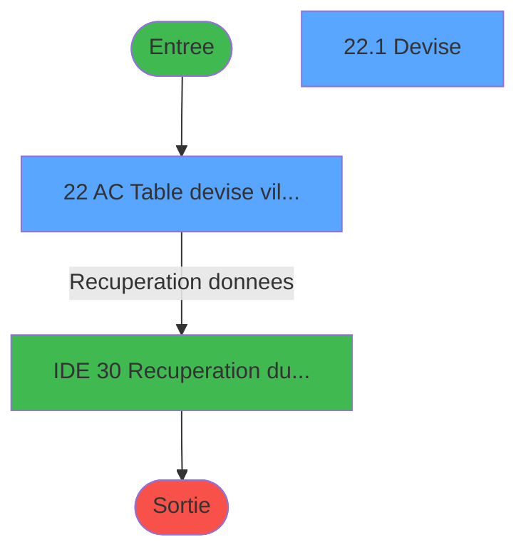
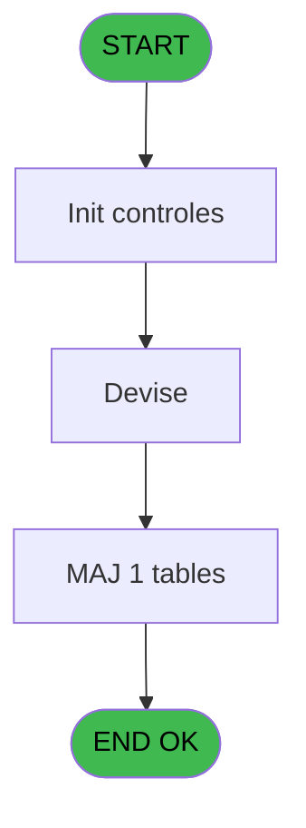
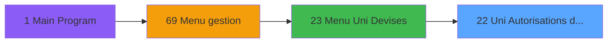
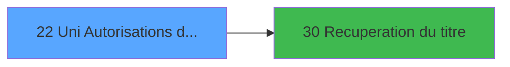

# GES IDE 22 - Uni Autorisations devises

> **Analyse**: Phases 1-4 2026-02-03 11:31 -> 11:31 (14s) | Assemblage 11:31
> **Pipeline**: V7.2 Enrichi
> **Structure**: 4 onglets (Resume | Ecrans | Donnees | Connexions)

<!-- TAB:Resume -->

## 1. FICHE D'IDENTITE

| Attribut | Valeur |
|----------|--------|
| Projet | GES |
| IDE Position | 22 |
| Nom Programme | Uni Autorisations devises |
| Fichier source | `Prg_22.xml` |
| Dossier IDE | Devises |
| Taches | 2 (2 ecrans visibles) |
| Tables modifiees | 1 |
| Programmes appeles | 1 |

## 2. DESCRIPTION FONCTIONNELLE

**Uni Autorisations devises** assure la gestion complete de ce processus, accessible depuis [Menu Uni Devises (IDE 23)](GES-IDE-23.md).

Le flux de traitement s'organise en **1 blocs fonctionnels** :

- **Traitement** (2 taches) : traitements metier divers

**Donnees modifiees** : 1 tables en ecriture (moyens_reglement_mor).

**Logique metier** : 2 regles identifiees couvrant conditions metier.

## 3. BLOCS FONCTIONNELS

### 3.1 Traitement (2 taches)

Traitements internes.

---

#### 22 - AC  Table devise village [[ECRAN]](#ecran-t1)

**Role** : Traitement : AC  Table devise village.
**Ecran** : 886 x 206 DLU (MDI) | [Voir mockup](#ecran-t1)
**Variables liees** : B (> devise locale)
**Delegue a** : [Recuperation du titre (IDE 30)](GES-IDE-30.md)

---

#### 22.1 - Devise [[ECRAN]](#ecran-t2)

**Role** : Traitement : Devise.
**Ecran** : 401 x 159 DLU (Modal) | [Voir mockup](#ecran-t2)
**Variables liees** : B (> devise locale)
**Delegue a** : [Recuperation du titre (IDE 30)](GES-IDE-30.md)

## 5. REGLES METIER

2 regles identifiees:

### Autres (2 regles)

#### [RM-001] Si [E]='O' alors 110 sinon 141)

| Element | Detail |
|---------|--------|
| **Condition** | `[E]='O'` |
| **Si vrai** | 110 |
| **Si faux** | 141) |
| **Expression source** | Expression 11 : `IF ([E]='O',110,141)` |
| **Exemple** | Si [E]='O' → 110. Sinon → 141) |

#### [RM-002] Condition toujours vraie (flag actif)

| Element | Detail |
|---------|--------|
| **Condition** | `[F]='EUR' AND INIGet ('[MAGIC_LOGICAL_NAMES]club_devise_euro')='N' OR [F]<>'EUR'` |
| **Si vrai** | 'TRUE'LOG |
| **Si faux** | 'FALSE'LOG) |
| **Expression source** | Expression 14 : `IF ([F]='EUR' AND INIGet ('[MAGIC_LOGICAL_NAMES]club_devise_` |
| **Exemple** | Si [F]='EUR' AND INIGet ('[MAGIC_LOGICAL_NAMES]club_devise_euro')='N' OR [F]<>'EUR' → 'TRUE'LOG. Sinon → 'FALSE'LOG) |
| **Impact** | [22.1 - Devise](#t2) |

## 6. CONTEXTE

- **Appele par**: [Menu Uni Devises (IDE 23)](GES-IDE-23.md)
- **Appelle**: 1 programmes | **Tables**: 2 (W:1 R:1 L:0) | **Taches**: 2 | **Expressions**: 15

<!-- TAB:Ecrans -->

## 8. ECRANS

### 8.1 Forms visibles (2 / 2)

| # | Position | Tache | Nom | Type | Largeur | Hauteur | Bloc |
|---|----------|-------|-----|------|---------|---------|------|
| 1 | 22 | 22 | AC  Table devise village | MDI | 886 | 206 | Traitement |
| 2 | 22.1 | 22.1 | Devise | Modal | 401 | 159 | Traitement |

### 8.2 Mockups Ecrans

---

#### 22 - AC  Table devise village
**Tache** : [22](#t1) | **Type** : MDI | **Dimensions** : 886 x 206 DLU
**Bloc** : Traitement | **Titre IDE** : AC  Table devise village

<!-- FORM-DATA:
{
    "width":  886,
    "vFactor":  8,
    "type":  "MDI",
    "hFactor":  8,
    "controls":  [
                     {
                         "x":  0,
                         "type":  "label",
                         "var":  "",
                         "y":  0,
                         "w":  886,
                         "fmt":  "",
                         "name":  "",
                         "h":  19,
                         "color":  "",
                         "text":  "",
                         "parent":  null
                     },
                     {
                         "x":  24,
                         "type":  "table",
                         "var":  "",
                         "name":  "",
                         "titleH":  12,
                         "color":  "110",
                         "w":  426,
                         "y":  34,
                         "fmt":  "",
                         "parent":  null,
                         "text":  "",
                         "rowH":  13,
                         "h":  129,
                         "cols":  [
                                      {
                                          "title":  "Code",
                                          "layer":  1,
                                          "w":  78
                                      },
                                      {
                                          "title":  "Devise",
                                          "layer":  2,
                                          "w":  314
                                      }
                                  ],
                         "rows":  2
                     },
                     {
                         "x":  2,
                         "type":  "label",
                         "var":  "",
                         "y":  182,
                         "w":  883,
                         "fmt":  "",
                         "name":  "",
                         "h":  24,
                         "color":  "",
                         "text":  "",
                         "parent":  null
                     },
                     {
                         "x":  35,
                         "type":  "edit",
                         "var":  "",
                         "y":  49,
                         "w":  58,
                         "fmt":  "",
                         "name":  "",
                         "h":  8,
                         "color":  "110",
                         "text":  "",
                         "parent":  4
                     },
                     {
                         "x":  378,
                         "type":  "button",
                         "var":  "",
                         "y":  47,
                         "w":  39,
                         "fmt":  "\u003e\u003e\u003e",
                         "name":  "Bouton Suite",
                         "h":  12,
                         "color":  "",
                         "text":  "",
                         "parent":  4
                     },
                     {
                         "x":  111,
                         "type":  "edit",
                         "var":  "",
                         "y":  49,
                         "w":  232,
                         "fmt":  "",
                         "name":  "DEV libelle",
                         "h":  8,
                         "color":  "110",
                         "text":  "",
                         "parent":  4
                     },
                     {
                         "x":  5,
                         "type":  "edit",
                         "var":  "",
                         "y":  5,
                         "w":  267,
                         "fmt":  "20",
                         "name":  "",
                         "h":  8,
                         "color":  "",
                         "text":  "",
                         "parent":  1
                     },
                     {
                         "x":  675,
                         "type":  "edit",
                         "var":  "",
                         "y":  5,
                         "w":  203,
                         "fmt":  "WWW DD MMM YYYYT",
                         "name":  "",
                         "h":  8,
                         "color":  "",
                         "text":  "",
                         "parent":  1
                     },
                     {
                         "x":  8,
                         "type":  "button",
                         "var":  "",
                         "y":  185,
                         "w":  154,
                         "fmt":  "\u0026Quitter",
                         "name":  "",
                         "h":  18,
                         "color":  "",
                         "text":  "",
                         "parent":  10
                     }
                 ],
    "taskId":  "22",
    "height":  206
}
-->

<strong>Champs : 4 champs</strong>

| Pos (x,y) | Nom | Variable | Type |
|-----------|-----|----------|------|
| 35,49 | (sans nom) | - | edit |
| 111,49 | DEV libelle | - | edit |
| 5,5 | 20 | - | edit |
| 675,5 | WWW DD MMM YYYYT | - | edit |

<strong>Boutons : 2 boutons</strong>

| Bouton | Pos (x,y) | Action |
|--------|-----------|--------|
| >>> | 378,47 | Bouton fonctionnel |
| Quitter | 8,185 | Quitte le programme |

---

#### 22.1 - Devise
**Tache** : [22.1](#t2) | **Type** : Modal | **Dimensions** : 401 x 159 DLU
**Bloc** : Traitement | **Titre IDE** : Devise

<!-- FORM-DATA:
{
    "width":  401,
    "vFactor":  8,
    "type":  "Modal",
    "hFactor":  8,
    "controls":  [
                     {
                         "x":  61,
                         "type":  "table",
                         "var":  "",
                         "name":  "",
                         "titleH":  12,
                         "color":  "110",
                         "w":  286,
                         "y":  14,
                         "fmt":  "",
                         "parent":  null,
                         "text":  "",
                         "rowH":  13,
                         "h":  129,
                         "cols":  [
                                      {
                                          "title":  "Autorisations",
                                          "layer":  1,
                                          "w":  252
                                      }
                                  ],
                         "rows":  1
                     },
                     {
                         "x":  78,
                         "type":  "edit",
                         "var":  "",
                         "y":  30,
                         "w":  53,
                         "fmt":  "",
                         "name":  "",
                         "h":  8,
                         "color":  "110",
                         "text":  "",
                         "parent":  1
                     },
                     {
                         "x":  192,
                         "type":  "combobox",
                         "var":  "",
                         "y":  28,
                         "w":  110,
                         "fmt":  "",
                         "name":  "",
                         "h":  12,
                         "color":  "110",
                         "text":  "",
                         "parent":  1
                     }
                 ],
    "taskId":  "22.1",
    "height":  159
}
-->

<strong>Champs : 2 champs</strong>

| Pos (x,y) | Nom | Variable | Type |
|-----------|-----|----------|------|
| 78,30 | (sans nom) | - | edit |
| 192,28 | (sans nom) | - | combobox |

## 9. NAVIGATION

### 9.1 Enchainement des ecrans

**Detail par enchainement :**

| Depuis | Action | Vers | Retour |
|--------|--------|------|--------|
| AC  Table devise village | Recuperation donnees | [Recuperation du titre (IDE 30)](GES-IDE-30.md) | Retour ecran |

### 9.3 Structure hierarchique (2 taches)

| Position | Tache | Type | Dimensions | Bloc |
|----------|-------|------|------------|------|
| **22.1** | [**AC  Table devise village** (22)](#t1) [mockup](#ecran-t1) | MDI | 886x206 | Traitement |
| 22.1.1 | [Devise (22.1)](#t2) [mockup](#ecran-t2) | Modal | 401x159 | |

### 9.4 Algorigramme

> **Legende**: Vert = START/END OK | Rouge = END KO | Bleu = Decisions
> *Algorigramme auto-genere. Utiliser `/algorigramme` pour une synthese metier detaillee.*

<!-- TAB:Donnees -->

## 10. TABLES

### Tables utilisees (2)

| ID | Nom | Description | Type | R | W | L | Usages |
|----|-----|-------------|------|---|---|---|--------|
| 50 | moyens_reglement_mor | Reglements / paiements | DB |   | **W** |   | 1 |
| 90 | devises__________dev | Devises / taux de change | DB | R |   |   | 1 |

### Colonnes par table (1 / 2 tables avec colonnes identifiees)

Table 50 - moyens_reglement_mor (**W**) - 1 usages

*Table utilisee uniquement en Link ou aucune colonne Real identifiee dans le DataView.*

Table 90 - devises__________dev (R) - 1 usages

| Lettre | Variable | Acces | Type |
|--------|----------|-------|------|
| A | > societe | R | Alpha |
| B | > devise locale | R | Alpha |
| C | Bouton Suite | R | Alpha |
| D | v. titre | R | Alpha |

## 11. VARIABLES

### 11.1 Variables de session (1)

Variables persistantes pendant toute la session.

| Lettre | Nom | Type | Usage dans |
|--------|-----|------|-----------|
| D | v. titre | Alpha | - |

### 11.2 Autres (3)

Variables diverses.

| Lettre | Nom | Type | Usage dans |
|--------|-----|------|-----------|
| A | > societe | Alpha | 2x refs |
| B | > devise locale | Alpha | [22](#t1), [22.1](#t2) |
| C | Bouton Suite | Alpha | - |

## 12. EXPRESSIONS

**15 / 15 expressions decodees (100%)**

### 12.1 Repartition par type

| Type | Expressions | Regles |
|------|-------------|--------|
| CONDITION | 4 | 5 |
| CAST_LOGIQUE | 3 | 5 |
| CONSTANTE | 4 | 0 |
| DATE | 1 | 0 |
| REFERENCE_VG | 1 | 0 |
| OTHER | 1 | 0 |
| STRING | 1 | 0 |

### 12.2 Expressions cles par type

#### CONDITION (4 expressions)

| Type | IDE | Expression | Regle |
|------|-----|------------|-------|
| CONDITION | 11 | `IF ([E]='O',110,141)` | [RM-001](#rm-RM-001) |
| CONDITION | 6 | `> devise locale [B]=''` | - |
| CONDITION | 5 | `> societe [A]=''` | - |
| CONDITION | 3 | `> societe [A]` | - |

#### CAST_LOGIQUE (3 expressions)

| Type | IDE | Expression | Regle |
|------|-----|------------|-------|
| CAST_LOGIQUE | 14 | `IF ([F]='EUR' AND INIGet ('[MAGIC_LOGICAL_NAMES]club_devise_euro')='N' OR [F]<>'EUR','TRUE'LOG,'FALSE'LOG)` | [RM-002](#rm-RM-002) |
| CAST_LOGIQUE | 2 | `INIPut ('AllowCreateInModify = Y','FALSE'LOG)` | - |
| CAST_LOGIQUE | 1 | `INIPut ('AllowCreateInModify = N','FALSE'LOG)` | - |

#### CONSTANTE (4 expressions)

| Type | IDE | Expression | Regle |
|------|-----|------------|-------|
| CONSTANTE | 13 | `'>>>'` | - |
| CONSTANTE | 15 | `1` | - |
| CONSTANTE | 4 | `'DEM'` | - |
| CONSTANTE | 8 | `96` | - |

#### DATE (1 expressions)

| Type | IDE | Expression | Regle |
|------|-----|------------|-------|
| DATE | 9 | `Date ()` | - |

#### REFERENCE_VG (1 expressions)

| Type | IDE | Expression | Regle |
|------|-----|------------|-------|
| REFERENCE_VG | 10 | `VG2` | - |

#### OTHER (1 expressions)

| Type | IDE | Expression | Regle |
|------|-----|------------|-------|
| OTHER | 12 | `Stat (0,'C'MODE)` | - |

#### STRING (1 expressions)

| Type | IDE | Expression | Regle |
|------|-----|------------|-------|
| STRING | 7 | `Trim ([K])` | - |

<!-- TAB:Connexions -->

## 13. GRAPHE D'APPELS

### 13.1 Chaine depuis Main (Callers)

Main -> ... -> [Menu Uni Devises (IDE 23)](GES-IDE-23.md) -> **Uni Autorisations devises (IDE 22)**

### 13.2 Callers

| IDE | Nom Programme | Nb Appels |
|-----|---------------|-----------|
| [23](GES-IDE-23.md) | Menu Uni Devises | 1 |

### 13.3 Callees (programmes appeles)

### 13.4 Detail Callees avec contexte

| IDE | Nom Programme | Appels | Contexte |
|-----|---------------|--------|----------|
| [30](GES-IDE-30.md) | Recuperation du titre | 1 | Recuperation donnees |

## 14. RECOMMANDATIONS MIGRATION

### 14.1 Profil du programme

| Metrique | Valeur | Impact migration |
|----------|--------|-----------------|
| Lignes de logique | 32 | Programme compact |
| Expressions | 15 | Peu de logique |
| Tables WRITE | 1 | Impact faible |
| Sous-programmes | 1 | Peu de dependances |
| Ecrans visibles | 2 | Quelques ecrans |
| Code desactive | 0% (0 / 32) | Code sain |
| Regles metier | 2 | Quelques regles a preserver |

### 14.2 Plan de migration par bloc

#### Traitement (2 taches: 2 ecrans, 0 traitement)

- **Strategie** : 2 composant(s) UI (Razor/React) avec formulaires et validation.
- 1 sous-programme(s) a migrer ou a reutiliser depuis les services existants.
- Decomposer les taches en services unitaires testables.

### 14.3 Dependances critiques

| Dependance | Type | Appels | Impact |
|------------|------|--------|--------|
| moyens_reglement_mor | Table WRITE (Database) | 1x | Schema + repository |
| [Recuperation du titre (IDE 30)](GES-IDE-30.md) | Sous-programme | 1x | Normale - Recuperation donnees |

---
*Spec DETAILED generee par Pipeline V7.2 - 2026-02-03 11:31*
